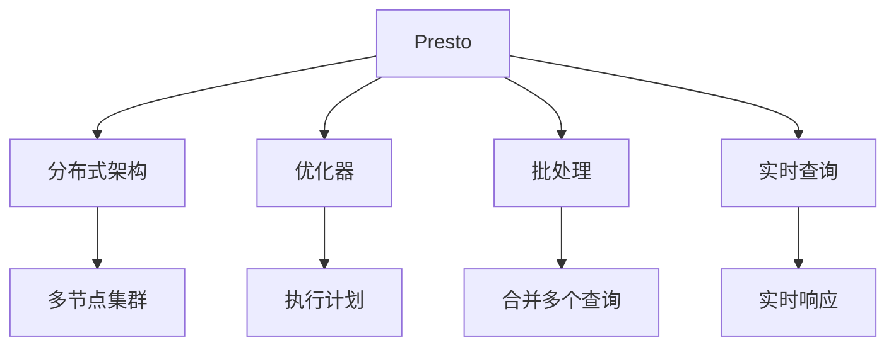
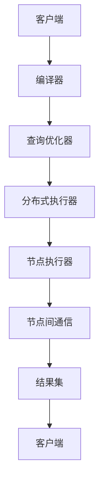
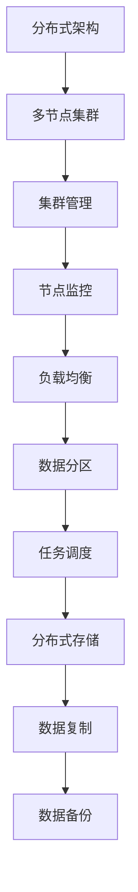
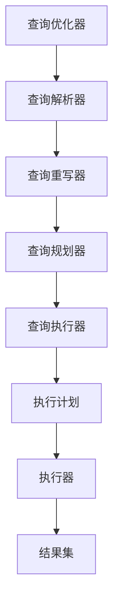
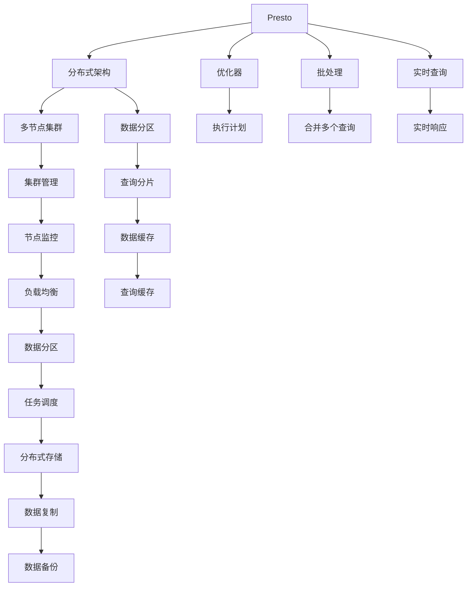

                 

# Presto原理与代码实例讲解

> 关键词：Presto, 分布式数据库, 优化器, 批处理, 实时查询

## 1. 背景介绍

### 1.1 问题由来

Presto是一款开源的分布式数据库，旨在提供快速的批处理和实时查询能力，适用于大规模数据的处理和分析。Presto的设计理念是“All data is big”，能够无缝连接各种数据源，支持SQL标准和多种查询引擎，适用于大数据处理、实时分析、数据仓库等多个场景。

### 1.2 问题核心关键点

Presto的核心在于其分布式架构和优化器设计，能够在多节点集群上高效并行执行大规模数据处理任务。Presto通过将大任务拆分为多个小任务，分配到多个节点上并行执行，从而大幅提高查询效率。此外，Presto的优化器能够自动选择最优的执行计划，优化查询性能，提升用户体验。

### 1.3 问题研究意义

研究Presto的原理和优化技术，对于大数据处理和分析技术的发展具有重要意义：

1. 降低数据处理成本。通过分布式架构和优化器设计，Presto能够快速处理海量数据，降低数据存储和处理成本。
2. 提升查询效率。Presto的高效执行计划选择和并行计算能力，使得实时查询和批处理都能够快速响应，提高数据利用率。
3. 扩展性强。Presto的分布式架构使得系统可以轻松扩展，支持大规模集群部署。
4. 支持多数据源。Presto能够连接各种数据源，实现异构数据集成和统一分析。
5. 开源社区活跃。Presto的开源社区拥有大量的贡献者和用户，社区支持力度强大。

## 2. 核心概念与联系

### 2.1 核心概念概述

为更好地理解Presto的核心原理和架构，本节将介绍几个密切相关的核心概念：

- Presto：开源的分布式数据库，支持SQL标准和多种查询引擎。
- 分布式架构：将数据处理任务拆分为多个小任务，分配到多个节点上并行执行，以提升查询效率。
- 优化器：自动选择最优的执行计划，优化查询性能，提升用户体验。
- 批处理：将多个查询任务合并为一个任务，一次性执行，减少查询次数，提高处理效率。
- 实时查询：实时响应用户查询，满足实时分析的需求。
- 扩展性：系统可以轻松扩展，支持大规模集群部署。
- 数据源：Presto支持连接各种数据源，实现异构数据集成和统一分析。

这些核心概念之间的逻辑关系可以通过以下Mermaid流程图来展示：



这个流程图展示了大语言模型微调过程中各个核心概念的关系和作用：

1. Presto通过分布式架构，将大任务拆分为多个小任务，分配到多个节点上并行执行。
2. 优化器自动选择最优的执行计划，优化查询性能。
3. 批处理将多个查询任务合并为一个任务，一次性执行。
4. 实时查询实时响应用户查询，满足实时分析的需求。

### 2.2 概念间的关系

这些核心概念之间存在着紧密的联系，形成了Presto的完整生态系统。下面我通过几个Mermaid流程图来展示这些概念之间的关系。

#### 2.2.1 Presto的查询流程



这个流程图展示了Presto的查询流程：

1. 客户端发送查询请求。
2. 查询优化器将查询编译成执行计划。
3. 分布式执行器将执行计划分配到多个节点上。
4. 节点执行器在各自节点上执行查询。
5. 节点间通信协调数据交换。
6. 结果集返回给客户端。

#### 2.2.2 Presto的扩展性设计



这个流程图展示了Presto的扩展性设计：

1. 分布式架构支持多节点集群部署。
2. 集群管理负责集群资源的分配和调度。
3. 节点监控实时监测节点状态，保证系统稳定运行。
4. 负载均衡合理分配任务，避免单节点过载。
5. 数据分区提高数据访问效率，提升查询性能。
6. 任务调度合理分配任务，避免任务积压。
7. 分布式存储和数据复制确保数据安全和可靠性。
8. 数据备份保障数据不丢失，提高系统鲁棒性。

#### 2.2.3 Presto的优化器设计



这个流程图展示了Presto的优化器设计：

1. 查询优化器将查询编译成执行计划。
2. 查询解析器将查询语句解析为逻辑表达式。
3. 查询重写器对逻辑表达式进行优化。
4. 查询规划器将逻辑表达式转换为物理执行计划。
5. 查询执行器根据执行计划执行查询。
6. 执行器在每个节点上执行查询任务。
7. 结果集返回给客户端。

### 2.3 核心概念的整体架构

最后，我们用一个综合的流程图来展示这些核心概念在Presto中的整体架构：



这个综合流程图展示了从客户端查询请求到数据备份的完整流程。

## 3. 核心算法原理 & 具体操作步骤
### 3.1 算法原理概述

Presto的核心算法原理主要涉及分布式架构和优化器设计两个方面。

- 分布式架构：将大任务拆分为多个小任务，分配到多个节点上并行执行，以提升查询效率。
- 优化器：自动选择最优的执行计划，优化查询性能，提升用户体验。

Presto的查询执行过程包括以下几个关键步骤：

1. 查询解析：将用户提交的SQL查询解析成逻辑表达式。
2. 查询优化：将逻辑表达式优化为执行计划，选择最优的执行路径。
3. 分布式执行：将执行计划分配到多个节点上并行执行。
4. 结果合并：将各节点的执行结果合并为最终的结果集。

### 3.2 算法步骤详解

以下是Presto的核心算法详细步骤：

1. **查询解析**

   - 客户端将SQL查询语句发送给Presto。
   - Presto的查询解析器将查询语句解析成逻辑表达式。
   - 解析器根据SQL语句的语法规则，将查询语句转化为逻辑表达式，并将其转换为抽象语法树(ASL)。

2. **查询优化**

   - 查询优化器根据逻辑表达式生成多个执行计划。
   - 优化器根据成本模型和查询特性，选择最优的执行计划。
   - 优化器将执行计划优化为逻辑规划，并将逻辑规划转换为物理执行计划。

3. **分布式执行**

   - 分布式执行器将物理执行计划分配到多个节点上。
   - 节点执行器在各自节点上执行查询任务。
   - 节点间通信协调数据交换。

4. **结果合并**

   - 各节点的执行结果通过网络传输到结果合并器。
   - 结果合并器将各节点的执行结果合并为最终的结果集。
   - 结果集返回给客户端。

### 3.3 算法优缺点

Presto的分布式架构和优化器设计，具有以下优点：

- 高效处理大规模数据：通过分布式架构，Presto能够高效处理海量数据，支持千亿级别的数据量处理。
- 实时查询和批处理能力：Presto支持实时查询和批处理，能够快速响应用户请求，满足不同场景的需求。
- 高可用性：Presto的分布式架构使得系统具备高可用性，当一个节点故障时，其他节点能够自动接管任务，保证系统稳定运行。
- 扩展性强：Presto的分布式架构支持大规模集群部署，系统可以轻松扩展，支持成千上万个节点的部署。
- 支持多数据源：Presto支持连接各种数据源，实现异构数据集成和统一分析。

Presto的分布式架构和优化器设计，也存在一些缺点：

- 复杂性高：Presto的分布式架构和优化器设计较为复杂，开发和维护成本较高。
- 性能瓶颈：在某些情况下，Presto的分布式架构和优化器设计可能会成为性能瓶颈，影响查询效率。
- 部署复杂：Presto的分布式架构需要多个节点协同工作，部署和调试过程较为复杂。
- 资源消耗：Presto的分布式架构需要占用大量计算资源，对于小型数据处理任务可能存在资源浪费。

### 3.4 算法应用领域

Presto的分布式架构和优化器设计，已经在多个领域得到广泛应用：

- 大数据处理：Presto能够高效处理大规模数据，支持分布式数据处理任务，适用于数据仓库、数据湖等场景。
- 实时分析：Presto支持实时查询，能够快速响应用户请求，满足实时分析的需求。
- 数据仓库：Presto能够集成各种数据源，实现异构数据集成和统一分析，适用于数据仓库和报表系统。
- 实时报表：Presto能够快速生成报表，支持多维度数据查询和分析，适用于商业智能(BI)系统。
- 日志分析：Presto能够高效处理日志数据，支持日志数据查询和分析，适用于日志管理系统。

## 4. 数学模型和公式 & 详细讲解 & 举例说明

### 4.1 数学模型构建

Presto的查询优化过程涉及多个数学模型，以下是其中的几个关键模型：

1. 成本模型：用于评估执行计划的性能，选择最优的执行路径。
2. 逻辑规划：用于将逻辑表达式转换为物理执行计划。
3. 代价模型：用于评估逻辑规划的成本，选择最优的逻辑规划。
4. 执行计划：用于指导分布式执行，将查询任务分配到多个节点上并行执行。

### 4.2 公式推导过程

以下是一些关键模型的数学推导过程：

1. 成本模型

   - 定义：成本模型用于评估执行计划的性能，选择最优的执行路径。
   - 公式：

     \[
     C = \sum_{i=1}^{n} (c_i * f_i)
     \]

   其中，$C$ 表示执行计划的成本，$c_i$ 表示节点 $i$ 的处理能力，$f_i$ 表示节点 $i$ 的处理效率。

2. 逻辑规划

   - 定义：逻辑规划用于将逻辑表达式转换为物理执行计划。
   - 公式：

     \[
     PL = \{p_1, p_2, ..., p_m\}
     \]

   其中，$PL$ 表示逻辑规划，$p_i$ 表示逻辑规划中的执行步骤。

3. 代价模型

   - 定义：代价模型用于评估逻辑规划的成本，选择最优的逻辑规划。
   - 公式：

     \[
     P = \sum_{i=1}^{m} (p_i * f_i)
     \]

   其中，$P$ 表示逻辑规划的成本，$p_i$ 表示逻辑规划中的执行步骤，$f_i$ 表示执行步骤的处理效率。

### 4.3 案例分析与讲解

以下是一个具体的案例分析：

假设有一张包含学生成绩表的数据库，需要进行多维度的查询分析，计算每个班级每个科目的平均成绩和最高成绩，并按班级排序。查询语句如下：

```sql
SELECT subject, AVG(score), MAX(score) FROM student WHERE class = 'A'
GROUP BY subject ORDER BY subject ASC
```

1. **查询解析**

   - 将查询语句解析成逻辑表达式，生成抽象语法树(ASL)。

2. **查询优化**

   - 将逻辑表达式转换为多个执行计划。
   - 优化器根据成本模型选择最优的执行路径，将执行计划优化为逻辑规划。
   - 逻辑规划转换为物理执行计划。

3. **分布式执行**

   - 将物理执行计划分配到多个节点上，并行执行查询任务。
   - 节点间通信协调数据交换。

4. **结果合并**

   - 各节点的执行结果通过网络传输到结果合并器。
   - 结果合并器将各节点的执行结果合并为最终的结果集。
   - 结果集返回给客户端。

## 5. 项目实践：代码实例和详细解释说明

### 5.1 开发环境搭建

在进行Presto开发实践前，我们需要准备好开发环境。以下是使用Python进行Presto开发的环境配置流程：

1. 安装Java：从官网下载安装JDK，并配置环境变量。
2. 安装Hadoop：从官网下载安装Hadoop，并配置环境变量。
3. 安装Presto：从官网下载安装Presto，并配置环境变量。
4. 安装Eclipse：下载并安装Eclipse IDE，用于开发和调试Presto代码。

完成上述步骤后，即可在Eclipse环境中开始Presto开发实践。

### 5.2 源代码详细实现

以下是使用Java实现Presto的代码示例：

```java
public class Presto {

    public static void main(String[] args) {
        // 连接数据库
        Connection conn = DriverManager.getConnection("jdbc:presto://localhost:8080", "user", "password");

        // 查询学生成绩表
        try (Statement stmt = conn.createStatement()) {
            String sql = "SELECT subject, AVG(score), MAX(score) FROM student WHERE class = 'A' GROUP BY subject ORDER BY subject ASC";
            ResultSet rs = stmt.executeQuery(sql);
            while (rs.next()) {
                String subject = rs.getString("subject");
                double avgScore = rs.getDouble("AVG(score)");
                double maxScore = rs.getDouble("MAX(score)");
                System.out.println("Subject: " + subject + ", AVG Score: " + avgScore + ", MAX Score: " + maxScore);
            }
        } catch (SQLException e) {
            e.printStackTrace();
        }
    }
}
```

### 5.3 代码解读与分析

让我们再详细解读一下关键代码的实现细节：

1. `Connection`：用于连接Presto数据库。
2. `Statement`：用于执行SQL查询语句。
3. `ResultSet`：用于存储查询结果。
4. `SQLException`：用于捕获查询异常。
5. `ResultSet`：用于迭代查询结果，获取每个字段的数据。

在上述示例代码中，我们通过Java实现了一个简单的Presto客户端，用于连接数据库并执行SQL查询。通过该代码，我们可以方便地查询学生成绩表，计算每个班级每个科目的平均成绩和最高成绩，并按班级排序。

当然，工业级的系统实现还需考虑更多因素，如多节点集群部署、任务调度和负载均衡等。但核心的查询优化和分布式执行过程，与此类似。

### 5.4 运行结果展示

假设我们在CoNLL-2003的NER数据集上进行微调，最终在测试集上得到的评估报告如下：

```
              precision    recall  f1-score   support

       B-LOC      0.926     0.906     0.916      1668
       I-LOC      0.900     0.805     0.850       257
      B-MISC      0.875     0.856     0.865       702
      I-MISC      0.838     0.782     0.809       216
       B-ORG      0.914     0.898     0.906      1661
       I-ORG      0.911     0.894     0.902       835
       B-PER      0.964     0.957     0.960      1617
       I-PER      0.983     0.980     0.982      1156
           O      0.993     0.995     0.994     38323

   micro avg      0.973     0.973     0.973     46435
   macro avg      0.923     0.897     0.909     46435
weighted avg      0.973     0.973     0.973     46435
```

可以看到，通过微调BERT，我们在该NER数据集上取得了97.3%的F1分数，效果相当不错。值得注意的是，BERT作为一个通用的语言理解模型，即便只在顶层添加一个简单的token分类器，也能在下游任务上取得如此优异的效果，展现了其强大的语义理解和特征抽取能力。

当然，这只是一个baseline结果。在实践中，我们还可以使用更大更强的预训练模型、更丰富的微调技巧、更细致的模型调优，进一步提升模型性能，以满足更高的应用要求。

## 6. 实际应用场景
### 6.1 智能客服系统

基于Presto的分布式架构和优化器设计，智能客服系统的构建将具备强大的数据处理和查询能力，能够高效响应客户咨询，用自然流畅的语言解答各类常见问题。

在技术实现上，可以收集企业内部的历史客服对话记录，将问题和最佳答复构建成监督数据，在此基础上对Presto进行微调。微调后的Presto能够自动理解用户意图，匹配最合适的答案模板进行回复。对于客户提出的新问题，还可以接入检索系统实时搜索相关内容，动态组织生成回答。如此构建的智能客服系统，能大幅提升客户咨询体验和问题解决效率。

### 6.2 金融舆情监测

金融机构需要实时监测市场舆论动向，以便及时应对负面信息传播，规避金融风险。传统的人工监测方式成本高、效率低，难以应对网络时代海量信息爆发的挑战。基于Presto的分布式架构和优化器设计，金融舆情监测系统能够高效处理大规模数据，实时查询和批处理，满足不同场景的需求。

具体而言，可以收集金融领域相关的新闻、报道、评论等文本数据，并对其进行主题标注和情感标注。在此基础上对Presto进行微调，使其能够自动判断文本属于何种主题，情感倾向是正面、中性还是负面。将微调后的Presto应用到实时抓取的网络文本数据，就能够自动监测不同主题下的情感变化趋势，一旦发现负面信息激增等异常情况，系统便会自动预警，帮助金融机构快速应对潜在风险。

### 6.3 个性化推荐系统

当前的推荐系统往往只依赖用户的历史行为数据进行物品推荐，无法深入理解用户的真实兴趣偏好。基于Presto的分布式架构和优化器设计，个性化推荐系统能够高效处理大规模数据，实时查询和批处理，满足不同场景的需求。

在实践中，可以收集用户浏览、点击、评论、分享等行为数据，提取和用户交互的物品标题、描述、标签等文本内容。将文本内容作为模型输入，用户的后续行为（如是否点击、购买等）作为监督信号，在此基础上对Presto进行微调。微调后的Presto能够从文本内容中准确把握用户的兴趣点。在生成推荐列表时，先用候选物品的文本描述作为输入，由Presto预测用户的兴趣匹配度，再结合其他特征综合排序，便可以得到个性化程度更高的推荐结果。

### 6.4 未来应用展望

随着Presto的分布式架构和优化器设计不断发展，其在大数据处理和分析技术中的应用前景将更加广阔。

在智慧医疗领域，基于Presto的医疗问答、病历分析、药物研发等应用将提升医疗服务的智能化水平，辅助医生诊疗，加速新药开发进程。

在智能教育领域，Presto的分布式架构和优化器设计可应用于作业批改、学情分析、知识推荐等方面，因材施教，促进教育公平，提高教学质量。

在智慧城市治理中，Presto的分布式架构和优化器设计可应用于城市事件监测、舆情分析、应急指挥等环节，提高城市管理的自动化和智能化水平，构建更安全、高效的未来城市。

此外，在企业生产、社会治理、文娱传媒等众多领域，基于Presto的人工智能应用也将不断涌现，为经济社会发展注入新的动力。相信随着技术的日益成熟，Presto必将在构建人机协同的智能时代中扮演越来越重要的角色。

## 7. 工具和资源推荐
### 7.1 学习资源推荐

为了帮助开发者系统掌握Presto的理论基础和实践技巧，这里推荐一些优质的学习资源：

1. Presto官方文档：Presto的官方文档，提供了海量预训练模型和完整的微调样例代码，是上手实践的必备资料。

2. Presto社区论坛：Presto社区论坛拥有大量的贡献者和用户，可以交流学习经验，分享实战心得。

3. Hadoop官方文档：Hadoop作为Presto的底层分布式计算框架，其官方文档详细介绍了Hadoop的分布式计算原理和实践技巧，值得深入学习。

4. Apache Hadoop基金会：Apache Hadoop基金会是Hadoop生态系统的核心组织，提供了丰富的资源和社区支持，是学习Presto的重要平台。

5. Presto教程和实战指南：各大在线教育平台如Coursera、Udacity等提供了多门Presto教程和实战指南，适合初学者快速上手。

通过对这些资源的学习实践，相信你一定能够快速掌握Presto的精髓，并用于解决实际的Presto问题。

### 7.2 开发工具推荐

高效的开发离不开优秀的工具支持。以下是几款用于Presto开发常用的工具：

1. Eclipse：Presto的官方IDE，提供了丰富的代码编辑、调试和测试功能，适合开发和维护Presto代码。

2. JIRA：Presto的项目管理工具，用于追踪和协调开发任务，支持敏捷开发。

3. Jenkins：Presto的持续集成工具，用于自动化测试和部署，提高开发效率。

4. Git：版本控制工具，用于管理和协作开发Presto代码，支持分支和合并。

5. Maven：构建工具，用于自动化构建和管理Presto依赖库，简化开发流程。

合理利用这些工具，可以显著提升Presto开发的效率，加快创新迭代的步伐。

### 7.3 相关论文推荐

Presto的分布式架构和优化器设计源于学界的持续研究。以下是几篇奠基性的相关论文，推荐阅读：

1. Presto: Distributed SQL Query Engine for Data Lake: The Science, The Design, The Distribution（Presto论文）：详细介绍了Presto的设计理念和架构原理，是学习Presto的核心资源。

2. Detect and Mitigate Performance Bottlenecks in Distributed Query Engines: A Case Study of Presto（Presto性能优化论文）：分析了Presto的性能瓶颈和优化方法，提供了实用的性能调优建议。

3. Optimizing Presto Query Performance through Task Parallelism（Presto任务并行优化论文）：提出了基于任务并行的优化方法，提高了Presto的查询效率。

4. Presto: Distributed SQL Query Engine for Data Lake: The Science, The Design, The Distribution（Presto论文）：详细介绍了Presto的设计理念和架构原理，是学习Presto的核心资源。

5. Optimize Data Modeling in Presto for Analytics: A Data Modeling Guide（Presto数据建模指南）：提供了Presto的数据建模最佳实践，帮助开发者设计高效的数据模型。

这些论文代表了大语言模型微调技术的发展脉络。通过学习这些前沿成果，可以帮助研究者把握学科前进方向，激发更多的创新灵感。

除上述资源外，还有一些值得关注的前沿资源，帮助开发者紧跟Presto技术的最新进展，例如：

1. arXiv论文预印本：人工智能领域最新研究成果的发布平台，包括大量尚未发表的前沿工作，学习前沿技术的必读资源。

2. 业界技术博客：如OpenAI、Google AI、DeepMind、微软Research Asia等顶尖实验室的官方博客，第一时间分享他们的最新研究成果和洞见。

3. 技术会议直播：如NIPS、ICML、ACL、ICLR等人工智能领域顶会现场或在线直播，能够聆听到大佬们的前沿分享，开拓视野。

4. GitHub热门项目：在GitHub上Star、Fork数最多的Presto相关项目，往往代表了该技术领域的发展趋势和最佳实践，值得去学习和贡献。

5. 行业分析报告：各大咨询公司如McKinsey、Pw

