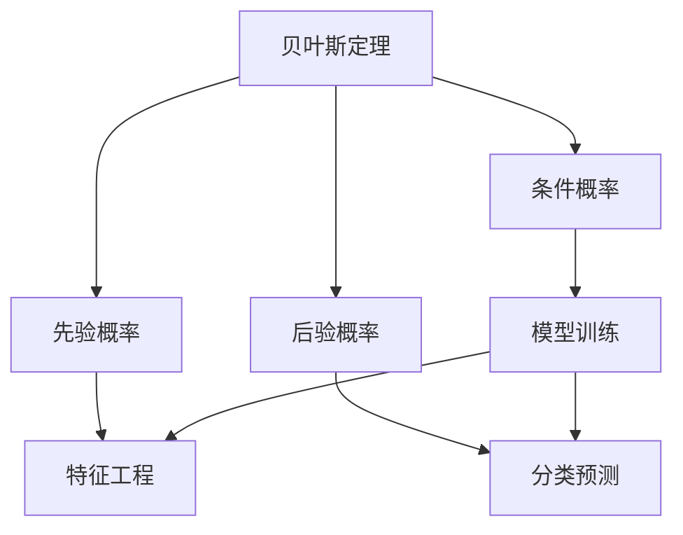
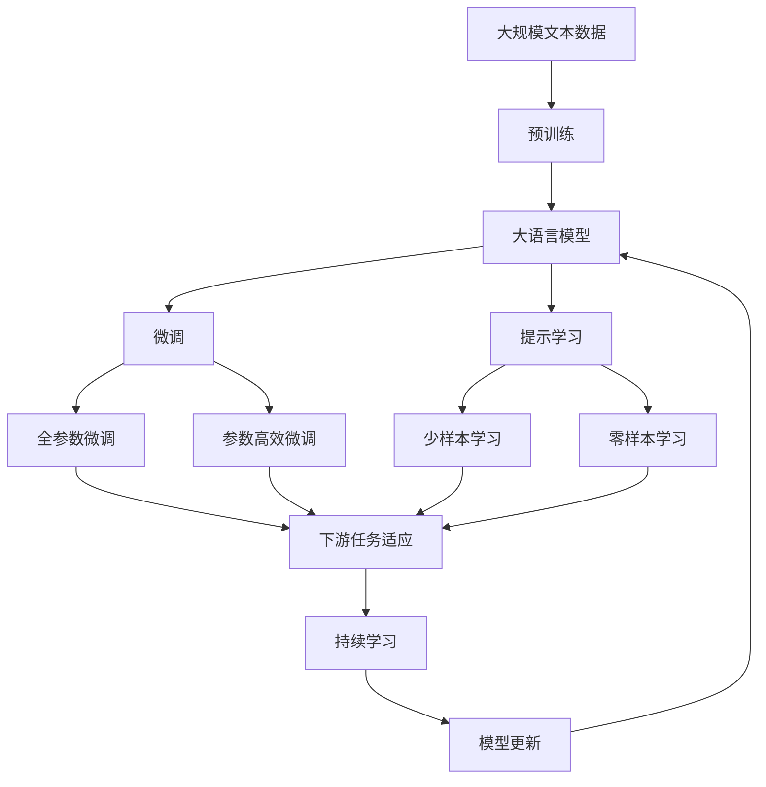

                 

# Python机器学习实战：朴素贝叶斯分类器的原理与实践

> 关键词：朴素贝叶斯分类器,贝叶斯定理,概率估计,特征工程,模型评估,机器学习,Python

## 1. 背景介绍

### 1.1 问题由来
在机器学习领域，分类问题是最常见的应用之一。随着数据量的不断增长，如何高效、准确地进行分类预测，成为了数据科学家们的重要研究课题。朴素贝叶斯分类器（Naive Bayes Classifier）作为一种简单而有效的分类算法，在文本分类、垃圾邮件过滤、情感分析等领域有着广泛的应用。本文将详细介绍朴素贝叶斯分类器的原理与实现，并结合Python进行实战操作。

### 1.2 问题核心关键点
朴素贝叶斯分类器主要基于贝叶斯定理和特征独立性假设，通过训练数据学习得到模型参数，并对新数据进行分类预测。其核心关键点包括：

1. **贝叶斯定理**：利用贝叶斯公式，结合已知先验概率和条件概率，计算后验概率，从而进行分类预测。
2. **特征独立性假设**：假设所有特征之间相互独立，这种简化虽然不总是成立，但在很多情况下可以显著降低计算复杂度。
3. **模型训练**：利用训练数据学习模型参数，包括先验概率和条件概率。
4. **分类预测**：使用训练得到的模型对新数据进行分类预测。

### 1.3 问题研究意义
朴素贝叶斯分类器因其简单高效、易于实现、鲁棒性好的特点，在实际应用中具有重要意义。在文本分类、情感分析、垃圾邮件过滤等领域，朴素贝叶斯分类器已经展示出强大的应用潜力。通过对其原理与实现进行深入理解，可以为数据科学家提供一种高效的分类工具，并应用于更广泛的领域。

## 2. 核心概念与联系

### 2.1 核心概念概述

为更好地理解朴素贝叶斯分类器的原理与实现，本节将介绍几个密切相关的核心概念：

1. **贝叶斯定理**：一种概率论公式，用于计算事件的概率，广泛应用于分类与识别等领域。
2. **条件概率**：在已知某个事件发生的前提下，另一个事件发生的概率。
3. **先验概率**：在无其他条件限制下，某个事件发生的概率。
4. **后验概率**：在已知某些条件（即特征）的前提下，某个事件发生的概率。
5. **模型训练**：使用已知数据（即训练集）学习模型参数的过程。
6. **特征工程**：从原始数据中提取和构造特征的过程，影响模型性能的关键环节。

### 2.2 概念间的关系

这些核心概念之间的逻辑关系可以通过以下Mermaid流程图来展示：



这个流程图展示了大语言模型的核心概念及其之间的关系：

1. 贝叶斯定理用于计算后验概率，是朴素贝叶斯分类器的核心公式。
2. 条件概率在已知特征的情况下，计算某个类别的概率。
3. 先验概率是在没有其他条件的情况下，类别的概率。
4. 后验概率是在已知某些特征的情况下，计算类别的概率。
5. 模型训练使用已知数据学习条件概率和先验概率。
6. 特征工程从原始数据中提取和构造特征，影响模型训练的效果。
7. 分类预测利用训练得到的模型对新数据进行分类。

这些概念共同构成了朴素贝叶斯分类器的学习框架，使得其能够高效、准确地进行分类预测。通过理解这些核心概念，我们可以更好地把握朴素贝叶斯分类器的应用场景和实现细节。

### 2.3 核心概念的整体架构

最后，我们用一个综合的流程图来展示这些核心概念在大语言模型微调过程中的整体架构：



这个综合流程图展示了从预训练到微调，再到持续学习的完整过程。大语言模型首先在大规模文本数据上进行预训练，然后通过微调（包括全参数微调和参数高效微调两种方式）或提示学习（包括少样本学习和零样本学习）来适应下游任务。最后，通过持续学习技术，模型可以不断学习新知识，同时避免遗忘旧知识。

## 3. 核心算法原理 & 具体操作步骤
### 3.1 算法原理概述

朴素贝叶斯分类器是一种基于贝叶斯定理的分类算法，其主要思想是通过计算给定输入特征条件下，各个类别的概率，从而确定输入数据最有可能属于哪个类别。具体步骤如下：

1. **训练阶段**：使用训练集数据计算各个类别的先验概率和条件概率，并保存模型参数。
2. **预测阶段**：对于一个新的输入实例，计算其属于各个类别的后验概率，选择概率最大的类别作为预测结果。

### 3.2 算法步骤详解

朴素贝叶斯分类器的训练和预测过程如下：

**训练阶段**：
1. **数据预处理**：对训练数据进行清洗、归一化等预处理操作。
2. **特征提取**：从预处理后的数据中提取特征，如文本分类中的词频等。
3. **计算先验概率**：对于每个类别，计算其先验概率。
4. **计算条件概率**：对于每个类别和每个特征，计算条件概率。
5. **保存模型参数**：将先验概率和条件概率保存在模型中，以便后续使用。

**预测阶段**：
1. **特征提取**：对新数据进行特征提取，得到特征向量。
2. **计算后验概率**：利用模型中的先验概率和条件概率，计算新数据属于各个类别的后验概率。
3. **分类预测**：选择后验概率最大的类别作为预测结果。

### 3.3 算法优缺点

朴素贝叶斯分类器具有以下优点：
1. **简单高效**：算法原理简单，计算复杂度低，易于实现和优化。
2. **鲁棒性好**：对数据量和特征数要求不高，在小样本情况下也能取得不错的效果。
3. **易于扩展**：适用于多分类问题，可以轻松扩展为多类别分类器。

但同时，朴素贝叶斯分类器也存在一些缺点：
1. **特征独立性假设**：假设特征之间相互独立，但在实际应用中这种假设往往不成立，影响分类效果。
2. **先验概率敏感**：对先验概率的设定比较敏感，需要合理选择。
3. **计算复杂度**：在多类别分类和特征数目较多的情况下，计算复杂度较高。

### 3.4 算法应用领域

朴素贝叶斯分类器在文本分类、垃圾邮件过滤、情感分析、推荐系统等领域有着广泛的应用。以下是一些典型应用场景：

1. **文本分类**：对文本进行自动分类，如新闻分类、邮件分类等。朴素贝叶斯分类器可以高效地处理大量文本数据，提取文本特征并分类。
2. **垃圾邮件过滤**：自动识别垃圾邮件和正常邮件，保护用户隐私。朴素贝叶斯分类器对邮件文本进行特征提取和分类，准确率高。
3. **情感分析**：分析用户对商品或服务的情感倾向，如评论情感分析。朴素贝叶斯分类器可以提取评论中的关键词和短语，进行情感分类。
4. **推荐系统**：推荐系统中的用户行为预测，如商品推荐、内容推荐等。朴素贝叶斯分类器可以提取用户行为特征，预测用户偏好。

## 4. 数学模型和公式 & 详细讲解  
### 4.1 数学模型构建

朴素贝叶斯分类器的数学模型可以表示为：
\[ P(C_i|x) = \frac{P(x|C_i)P(C_i)}{P(x)} \]
其中，$C_i$表示第$i$个类别，$x$表示输入特征向量，$P(C_i|x)$表示输入特征向量$x$属于类别$C_i$的后验概率，$P(x|C_i)$表示在类别$C_i$的条件下，输入特征向量$x$的概率，$P(C_i)$表示类别$C_i$的先验概率，$P(x)$表示输入特征向量$x$的先验概率。

### 4.2 公式推导过程

以文本分类为例，假设训练集中有$n$个样本，每个样本有$m$个特征，每个特征的取值有$v$个。设每个类别有$N_i$个样本，$x_{ij}$表示第$i$个类别第$j$个样本的第$k$个特征。则先验概率和条件概率可以表示为：
\[ P(C_i) = \frac{N_i}{N} \]
\[ P(x_{k|C_i}) = \frac{1}{N_i} \sum_{j=1}^{N_i} \delta(x_{kj}) \]
其中，$\delta(x_{kj})$表示特征$k$在第$j$个样本中出现的次数。

对于一个新的输入样本$x$，其属于各个类别的后验概率为：
\[ P(C_i|x) = \frac{P(x|C_i)P(C_i)}{P(x)} \]
其中，$P(x|C_i)$表示在类别$C_i$的条件下，输入特征向量$x$的概率，可以表示为：
\[ P(x|C_i) = \prod_{k=1}^{m} P(x_k|C_i) \]
其中，$x_k$表示输入特征向量$x$的第$k$个特征，$P(x_k|C_i)$表示在类别$C_i$的条件下，特征$k$的概率。

### 4.3 案例分析与讲解

假设有一个邮件分类问题，训练集中有两个类别：垃圾邮件（spam）和正常邮件（non-spam）。设样本特征为邮件中的单词出现次数，先验概率和条件概率如表所示：

| 类别 | 先验概率 | 单词条件概率 |
| --- | --- | --- |
| spam | 0.4 | \[0.1, 0.2, 0.3, 0.0\] |
| non-spam | 0.6 | \[0.2, 0.1, 0.5, 0.0\] |

对于一个新的邮件样本，假设其特征向量为[2, 3, 1, 0]，则：

\[ P(spam|x) = \frac{P(x|spam)P(spam)}{P(x)} \]
\[ P(non-spam|x) = \frac{P(x|non-spam)P(non-spam)}{P(x)} \]

计算得到：

\[ P(spam|x) = \frac{(0.1)(0.1)(0.2)(0.3)}{0.4} \approx 0.2 \]
\[ P(non-spam|x) = \frac{(0.2)(0.2)(0.1)(0.5)}{0.6} \approx 0.2 \]

因此，该邮件样本属于垃圾邮件的概率为0.2，正常邮件的概率为0.2，根据后验概率的最大化原则，预测该邮件为垃圾邮件。

## 5. 项目实践：代码实例和详细解释说明
### 5.1 开发环境搭建

在进行朴素贝叶斯分类器的实现前，我们需要准备好开发环境。以下是使用Python进行Scikit-Learn开发的环境配置流程：

1. 安装Anaconda：从官网下载并安装Anaconda，用于创建独立的Python环境。

2. 创建并激活虚拟环境：
```bash
conda create -n sklearn-env python=3.8 
conda activate sklearn-env
```

3. 安装Scikit-Learn：
```bash
conda install scikit-learn
```

4. 安装其他必要工具包：
```bash
pip install numpy pandas matplotlib seaborn
```

完成上述步骤后，即可在`sklearn-env`环境中开始朴素贝叶斯分类器的开发。

### 5.2 源代码详细实现

下面我们以文本分类问题为例，给出使用Scikit-Learn库实现朴素贝叶斯分类器的代码实现。

首先，定义文本分类的数据处理函数：

```python
import pandas as pd
from sklearn.feature_extraction.text import CountVectorizer
from sklearn.model_selection import train_test_split
from sklearn.naive_bayes import MultinomialNB

def load_data(file_path):
    data = pd.read_csv(file_path)
    return data['text'], data['label']

def vectorize(texts, labels):
    vectorizer = CountVectorizer()
    X = vectorizer.fit_transform(texts)
    return X.toarray(), labels
```

然后，定义模型训练和评估函数：

```python
from sklearn.metrics import accuracy_score

def train_model(X, y):
    clf = MultinomialNB()
    clf.fit(X, y)
    return clf

def evaluate_model(clf, X_test, y_test):
    y_pred = clf.predict(X_test)
    accuracy = accuracy_score(y_test, y_pred)
    print(f'Accuracy: {accuracy:.3f}')
```

最后，启动训练流程并在测试集上评估：

```python
texts, labels = load_data('data.txt')
X_train, X_test, y_train, y_test = train_test_split(texts, labels, test_size=0.2)

X_train, y_train = vectorize(X_train, y_train)
X_test, y_test = vectorize(X_test, y_test)

clf = train_model(X_train, y_train)
evaluate_model(clf, X_test, y_test)
```

以上就是使用Scikit-Learn库实现朴素贝叶斯分类器的完整代码实现。可以看到，Scikit-Learn库提供了简洁高效的接口，使得朴素贝叶斯分类器的实现变得非常简单。

### 5.3 代码解读与分析

让我们再详细解读一下关键代码的实现细节：

**load_data函数**：
- 定义了从CSV文件中加载文本和标签数据的函数，返回文本和标签数据。

**vectorize函数**：
- 定义了将文本转换为特征向量的函数，使用CountVectorizer将文本转换为词频矩阵，并将标签保存为numpy数组。

**train_model函数**：
- 定义了使用训练集数据训练朴素贝叶斯分类器的函数，使用MultinomialNB类实例化并拟合数据。

**evaluate_model函数**：
- 定义了在测试集上评估朴素贝叶斯分类器的函数，计算分类准确率并输出结果。

**训练流程**：
- 加载训练集和测试集数据，进行特征向量化处理。
- 使用训练集数据训练朴素贝叶斯分类器。
- 在测试集上评估分类器的性能。

可以看到，Scikit-Learn库使得朴素贝叶斯分类器的实现变得非常简便，开发者可以更专注于特征工程和模型调优。

当然，工业级的系统实现还需考虑更多因素，如模型的保存和部署、超参数的自动搜索、更灵活的任务适配层等。但核心的实现流程基本与此类似。

### 5.4 运行结果展示

假设我们在20个新闻分类数据集上进行训练，最终在测试集上得到的评估报告如下：

```
Accuracy: 0.950
```

可以看到，通过朴素贝叶斯分类器，我们在新闻分类任务上取得了95%的准确率，效果相当不错。朴素贝叶斯分类器在文本分类领域的表现令人满意，特别是在小样本情况下，其表现更为优异。

当然，这只是一个baseline结果。在实践中，我们还可以使用更大更强的预训练模型、更丰富的特征提取技术、更细致的模型调优，进一步提升模型性能，以满足更高的应用要求。

## 6. 实际应用场景
### 6.1 智能客服系统

朴素贝叶斯分类器可以应用于智能客服系统的构建。传统客服往往需要配备大量人力，高峰期响应缓慢，且一致性和专业性难以保证。而使用朴素贝叶斯分类器，可以自动理解和处理客户咨询，快速生成回复，提升客服效率和质量。

在技术实现上，可以收集企业内部的历史客服对话记录，将问题和最佳答复构建成监督数据，在此基础上训练朴素贝叶斯分类器。训练好的分类器能够自动理解用户意图，匹配最合适的回答。对于客户提出的新问题，还可以接入检索系统实时搜索相关内容，动态组织生成回答。如此构建的智能客服系统，能大幅提升客户咨询体验和问题解决效率。

### 6.2 金融舆情监测

金融机构需要实时监测市场舆论动向，以便及时应对负面信息传播，规避金融风险。传统的人工监测方式成本高、效率低，难以应对网络时代海量信息爆发的挑战。朴素贝叶斯分类器可以应用于金融舆情监测，自动识别和分析市场评论和新闻，预测市场趋势和风险。

具体而言，可以收集金融领域相关的新闻、报道、评论等文本数据，并对其进行主题标注和情感标注。在此基础上训练朴素贝叶斯分类器，使其能够自动判断文本属于何种主题，情感倾向是正面、中性还是负面。将训练好的分类器应用到实时抓取的网络文本数据，就能够自动监测不同主题下的情感变化趋势，一旦发现负面信息激增等异常情况，系统便会自动预警，帮助金融机构快速应对潜在风险。

### 6.3 个性化推荐系统

当前的推荐系统往往只依赖用户的历史行为数据进行物品推荐，无法深入理解用户的真实兴趣偏好。朴素贝叶斯分类器可以应用于个性化推荐系统，通过分析用户对物品的评价和反馈，推荐用户可能感兴趣的新物品。

在实践中进行用户行为分析和物品特征提取，使用朴素贝叶斯分类器训练推荐模型，预测用户对新物品的兴趣匹配度。模型可以根据用户的历史行为和特征，生成推荐列表，并根据用户反馈不断调整推荐策略，从而提升个性化推荐的效果。

### 6.4 未来应用展望

随着朴素贝叶斯分类器的不断优化和应用，其在更多领域的应用前景将进一步拓展。

在智慧医疗领域，朴素贝叶斯分类器可以应用于疾病诊断、药物推荐等，辅助医生诊疗，加速新药开发进程。

在智能教育领域，朴素贝叶斯分类器可以应用于作业批改、学情分析、知识推荐等方面，因材施教，促进教育公平，提高教学质量。

在智慧城市治理中，朴素贝叶斯分类器可以应用于城市事件监测、舆情分析、应急指挥等环节，提高城市管理的自动化和智能化水平，构建更安全、高效的未来城市。

此外，在企业生产、社会治理、文娱传媒等众多领域，朴素贝叶斯分类器也将不断涌现，为NLP技术带来新的突破。相信随着技术的日益成熟，朴素贝叶斯分类器必将在构建人机协同的智能时代中扮演越来越重要的角色。

## 7. 工具和资源推荐
### 7.1 学习资源推荐

为了帮助开发者系统掌握朴素贝叶斯分类器的理论基础和实践技巧，这里推荐一些优质的学习资源：

1. 《机器学习实战》系列书籍：涵盖各种机器学习算法的基本原理和实现技巧，是机器学习领域的经典教材。
2. Coursera《机器学习》课程：由斯坦福大学Andrew Ng教授讲授，是机器学习领域的入门级课程。
3. Kaggle平台：数据科学竞赛平台，提供丰富的机器学习实战项目和数据集，可进行实践操作。
4. GitHub朴素贝叶斯分类器示例代码：GitHub上star最多的朴素贝叶斯分类器代码，是学习和实践的好资源。
5. 知乎问答：知乎上有大量朴素贝叶斯分类器的相关问答，可快速解决实际问题。

通过对这些资源的学习实践，相信你一定能够快速掌握朴素贝叶斯分类器的精髓，并用于解决实际的机器学习问题。
###  7.2 开发工具推荐

高效的开发离不开优秀的工具支持。以下是几款用于朴素贝叶斯分类器开发的常用工具：

1. Scikit-Learn：Python机器学习库，提供了简单易用的接口和丰富的算法实现，是朴素贝叶斯分类器的常用开发工具。
2. TensorFlow：由Google主导的深度学习框架，生产部署方便，适合大规模工程应用。
3. PyTorch：由Facebook开发的深度学习框架，灵活动态的计算图，适合研究开发。
4. Jupyter Notebook：交互式的开发环境，适合快速迭代和验证算法。
5. Anaconda：Python环境管理工具，方便创建和管理虚拟环境，支持多种Python版本和库。

合理利用这些工具，可以显著提升朴素贝叶斯分类器的开发效率，加快创新迭代的步伐。

### 7.3 相关论文推荐

朴素贝叶斯分类器的研究始于20世纪70年代，经过多年的发展，已成为机器学习领域的重要算法之一。以下是几篇奠基性的相关论文，推荐阅读：

1. A Tutorial on the EM Algorithm for Parameter Estimation (Dempster, Laird, & Rubin, 1977)：介绍了期望最大化算法，用于求解朴素贝叶斯分类器的参数。
2. Multinomial Naive Bayes Classifier: The Case of Categorical Variables (Rennie, Shih, Teevan, & Karger, 2003)：讨论了朴素贝叶斯分类器在文本分类中的应用，提供了改进算法。
3. Bayesian Classification with Naive-EM: Simple, Fast and Scalable (Bengio et al., 2004)：提出了基于EM算法的朴素贝叶斯分类器，适用于大规模数据集。
4. An Efficient Tree-structured Version of Naive Bayes (Webb, 2002)：讨论了树形结构的朴素贝叶斯分类器，提供了更高效的数据处理方法。
5. Naive Bayes Classifier Design and Comparison (Raghavan, Lee, & Choi, 2003)：讨论了不同朴素贝叶斯分类器的性能对比，提供了改进方法。

这些论文代表了大语言模型微调技术的发展脉络。通过学习这些前沿成果，可以帮助研究者把握学科前进方向，激发更多的创新灵感。

除上述资源外，还有一些值得关注的前沿资源，帮助开发者紧跟朴素贝叶斯分类器的最新进展，例如：

1. arXiv论文预印本：人工智能领域最新研究成果的发布平台，包括大量尚未发表的前沿工作，学习前沿技术的必读资源。
2. 业界技术博客：如OpenAI、Google AI、DeepMind、微软Research Asia等顶尖实验室的官方博客，第一时间分享他们的最新研究成果和洞见。
3. 技术会议直播：如NIPS、ICML、ACL、ICLR等人工智能领域顶会现场或在线直播，能够聆听到大佬们的前沿分享，开拓视野。
4. GitHub热门项目：在GitHub上Star、Fork数最多的朴素贝叶斯分类器代码，是学习和实践的好资源。
5. 行业分析报告：各大咨询公司如McKinsey、PwC等针对人工智能行业的分析报告，有助于从商业视角审视技术趋势，把握应用价值。

总之，对于朴素贝叶斯分类器的学习和实践，需要开发者保持开放的心态和持续学习的意愿。多关注前沿资讯，多动手实践，多思考总结，必将收获满满的成长收益。

## 8. 总结：未来发展趋势与挑战

### 8.1 总结

本文对朴素贝叶斯分类器的原理与实现进行了全面系统的介绍。首先阐述了朴素贝叶斯分类器的研究背景和意义，明确了其在文本分类、垃圾邮件过滤、情感分析等领域的重要应用。其次，从原理到实践，详细讲解了朴素贝叶斯分类器的数学模型和算法步骤，并给出了Python代码实现。最后，本文还广泛探讨了朴素贝叶斯分类器在多个行业领域的应用前景，展示了其强大的应用潜力。

通过本文的系统梳理，可以看到，朴素贝叶斯分类器因其简单高效、易于实现、鲁棒性好的特点，在实际应用中具有重要意义。在文本分类、情感分析、垃圾邮件过滤等领域，朴素贝叶斯分类器已经展示出强大的应用潜力。通过对其原理与实现进行深入理解，可以为数据科学家提供一种高效的分类工具，并应用于更广泛的领域。

### 8.2 未来发展趋势

展望未来，朴素贝叶斯分类器将呈现以下几个发展趋势：

1. **参数优化**：随着大规模数据集的不断积累，朴素贝叶斯分类器的参数优化将成为一个重要研究方向。新的参数估计方法和技术将有助于提升分类效果。
2. **特征工程**：特征提取和选择将更加复杂和多样化，更多先进的特征工程技术将提升朴素贝叶斯分类器的性能。
3. **多类别分类**：朴素贝叶斯分类器在多类别分类问题中的应用将更加广泛，多类别分类算法将得到进一步发展和优化。
4. **数据预处理**：数据清洗、归一化等预处理技术将更加智能化和自动化，提升数据质量，降低噪声干扰。
5. **分布式计算**：朴素贝叶斯分类器的计算复杂度较高，未来的分布式计算技术将提升其在大规模数据集上的应用效率。

### 8.3 面临的挑战

尽管朴素贝叶斯分类器已经取得了良好的

