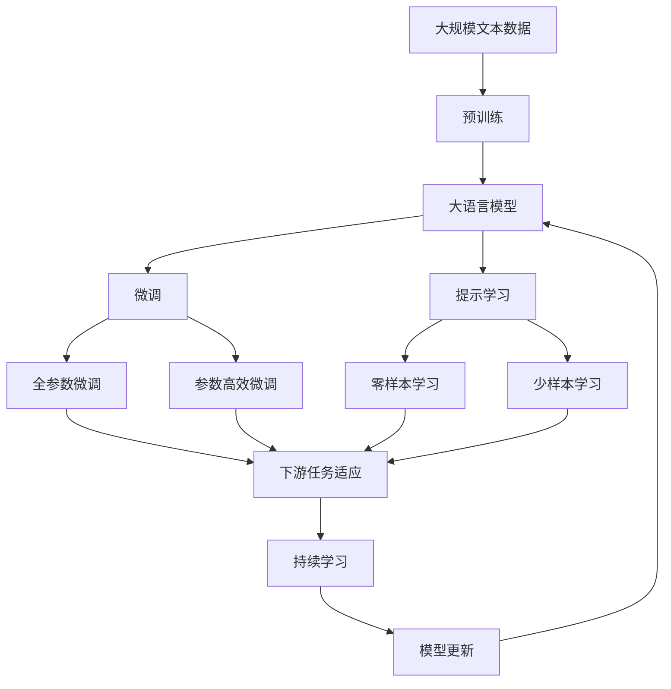

                 

# Python深度学习实践：风格迁移网络让照片变艺术品

> 关键词：风格迁移网络,深度学习,神经网络,PyTorch,风格化,算法优化

## 1. 背景介绍

### 1.1 问题由来
风格迁移网络（Style Transfer Network, STN）是一种基于深度学习的图像处理技术，能够将一张普通照片转化为具有特定风格的艺术品，例如将一张普通风景照转换为梵高的画作。这种技术在艺术创作、图像处理、视频编辑等领域具有广泛的应用前景。

近年来，随着深度学习技术的快速发展，风格迁移网络已经成为了图像处理领域的热门研究方向之一。通过风格迁移网络，可以将输入照片的风格和内容分离，然后生成出风格类似、内容不同的新图片。该技术不仅能够生成高质量的艺术品，还能够应用于视频特效、广告设计等多个领域。

### 1.2 问题核心关键点
风格迁移网络的核心思想是将一张普通照片的风格和内容分离，然后生成出风格类似、内容不同的新图片。具体来说，该技术包括以下几个关键步骤：

1. **图像分解**：将输入照片分解为内容图像和风格图像两部分，分别进行特征提取。
2. **风格提取**：通过深度学习网络提取风格图像的特征，作为内容图像的约束条件。
3. **内容重构**：通过深度学习网络对内容图像进行重构，生成出风格相似的新图片。
4. **风格迁移**：将内容图像和风格图像合并，生成出最终的风格的迁移图像。

这些步骤需要深度学习模型的支持，通常使用卷积神经网络（Convolutional Neural Network, CNN）来进行特征提取和重构。

### 1.3 问题研究意义
风格迁移网络的研究和应用，对于艺术创作、图像处理、视频编辑等领域具有重要意义：

1. **艺术创作**：风格迁移网络可以将普通照片转化为具有特定风格的艺术品，为艺术家提供了新的创作方式。
2. **图像处理**：该技术可以应用于图像修复、去噪、增强等多个领域，提升图像处理的效果和质量。
3. **视频编辑**：将风格迁移技术应用于视频，可以生成出具有特定风格的视频片段，提高视频创意和表现力。
4. **广告设计**：通过风格迁移网络，可以将品牌标志、广告语等元素以特定的艺术风格展示，提升广告的吸引力和感染力。

总之，风格迁移网络作为一种重要的图像处理技术，能够为艺术创作、图像处理、视频编辑等多个领域提供强大的技术支持，具有广泛的应用前景。

## 2. 核心概念与联系

### 2.1 核心概念概述

为更好地理解风格迁移网络的技术原理，本节将介绍几个密切相关的核心概念：

- **卷积神经网络（CNN）**：一种深度学习模型，主要用于图像特征提取和分类。
- **风格迁移网络（STN）**：一种基于深度学习的图像处理技术，能够将一张普通照片转化为具有特定风格的艺术品。
- **对抗生成网络（GAN）**：一种生成模型，能够生成高质量的图像、视频等内容。
- **对抗样本（Adversarial Examples）**：一种特殊的数据样本，用于测试和提升模型的鲁棒性。
- **生成对抗网络（GAN）**：一种由生成器和判别器组成的对抗模型，用于生成高质量的图像、视频等内容。
- **内容图像（Content Image）**：风格迁移网络中的一部分，代表原始照片的内容。
- **风格图像（Style Image）**：风格迁移网络中的一部分，代表原始照片的风格。
- **风格特征（Style Feature）**：用于描述风格图像的特征向量，通常通过卷积神经网络提取。

这些核心概念之间的逻辑关系可以通过以下Mermaid流程图来展示：

```mermaid
graph TB
    A[卷积神经网络 (CNN)] --> B[风格迁移网络 (STN)]
    B --> C[对抗生成网络 (GAN)]
    B --> D[对抗样本 (Adversarial Examples)]
    C --> E[生成对抗网络 (GAN)]
    E --> F[内容图像 (Content Image)]
    E --> G[风格图像 (Style Image)]
    F --> H[风格特征 (Style Feature)]
```

这个流程图展示了大语言模型微调过程中各个核心概念的关系和作用：

1. CNN主要用于图像特征提取和分类，风格迁移网络基于CNN进行风格特征的提取。
2. GAN用于生成高质量的图像、视频等内容，对抗样本用于测试和提升模型的鲁棒性。
3. STN基于GAN进行内容图像和风格图像的合成。

### 2.2 概念间的关系

这些核心概念之间存在着紧密的联系，形成了风格迁移网络的整体生态系统。下面我们通过几个Mermaid流程图来展示这些概念之间的关系。

#### 2.2.1 风格迁移网络的基本原理

```mermaid
graph LR
    A[内容图像] --> B[卷积神经网络 (CNN)]
    B --> C[风格特征]
    C --> D[风格迁移网络 (STN)]
    D --> E[风格图像]
    E --> F[生成对抗网络 (GAN)]
    F --> G[生成对抗网络 (GAN)]
    G --> H[对抗样本]
```

这个流程图展示了风格迁移网络的基本原理：

1. 内容图像首先经过CNN提取特征。
2. 风格图像通过CNN提取风格特征。
3. 风格迁移网络将内容图像和风格特征合并，生成出风格迁移图像。
4. GAN用于生成高质量的风格图像，对抗样本用于测试和提升模型的鲁棒性。

#### 2.2.2 生成对抗网络的结构

```mermaid
graph LR
    A[生成器 (Generator)] --> B[判别器 (Discriminator)]
    B --> C[对抗样本]
    C --> D[内容图像]
    D --> E[风格图像]
    E --> F[对抗样本]
    F --> G[对抗样本]
    G --> H[对抗样本]
```

这个流程图展示了生成对抗网络的结构：

1. 生成器用于生成高质量的内容图像。
2. 判别器用于判断生成器生成的图像是否真实。
3. 对抗样本用于测试和提升生成器生成的图像的鲁棒性。
4. 风格迁移网络中的风格图像通过GAN生成。

### 2.3 核心概念的整体架构

最后，我们用一个综合的流程图来展示这些核心概念在大语言模型微调过程中的整体架构：



这个综合流程图展示了从预训练到微调，再到持续学习的完整过程。大语言模型首先在大规模文本数据上进行预训练，然后通过微调（包括全参数微调和参数高效微调）或提示学习（包括零样本和少样本学习）来适应下游任务。最后，通过持续学习技术，模型可以不断更新和适应新的任务和数据。 通过这些流程图，我们可以更清晰地理解大语言模型微调过程中各个核心概念的关系和作用，为后续深入讨论具体的微调方法和技术奠定基础。

## 3. 核心算法原理 & 具体操作步骤
### 3.1 算法原理概述

风格迁移网络的核心思想是将一张普通照片的风格和内容分离，然后生成出风格类似、内容不同的新图片。具体来说，该技术包括以下几个关键步骤：

1. **图像分解**：将输入照片分解为内容图像和风格图像两部分，分别进行特征提取。
2. **风格提取**：通过深度学习网络提取风格图像的特征，作为内容图像的约束条件。
3. **内容重构**：通过深度学习网络对内容图像进行重构，生成出风格相似的新图片。
4. **风格迁移**：将内容图像和风格图像合并，生成出最终的风格的迁移图像。

### 3.2 算法步骤详解

**Step 1: 准备输入图像**

1. **选择输入图像**：首先选择一张普通照片作为输入图像，通常为RGB格式。
2. **图像预处理**：将输入图像进行归一化处理，使得像素值范围在0-1之间。

**Step 2: 准备风格图像**

1. **选择风格图像**：选择一张具有特定风格的艺术品作为风格图像，通常为RGB格式。
2. **图像预处理**：将风格图像进行归一化处理，使得像素值范围在0-1之间。

**Step 3: 风格提取**

1. **内容图像的特征提取**：使用卷积神经网络（CNN）提取内容图像的特征，通常使用VGG、ResNet等网络。
2. **风格图像的特征提取**：使用卷积神经网络（CNN）提取风格图像的特征，通常使用VGG、ResNet等网络。
3. **计算风格特征**：将风格图像的特征进行通道分离，并计算出每个通道的均值和方差，得到一个风格特征向量。

**Step 4: 内容重构**

1. **初始化内容图像**：将内容图像初始化为与输入图像相同的形状。
2. **内容图像的特征提取**：使用卷积神经网络（CNN）提取内容图像的特征，通常使用VGG、ResNet等网络。
3. **计算内容特征**：将内容图像的特征进行通道分离，并计算出每个通道的均值和方差，得到一个内容特征向量。
4. **计算内容损失**：计算内容特征向量与初始化内容图像的特征向量之间的L2距离，作为内容重构的目标函数。

**Step 5: 风格迁移**

1. **内容图像的特征提取**：使用卷积神经网络（CNN）提取内容图像的特征，通常使用VGG、ResNet等网络。
2. **风格图像的特征提取**：使用卷积神经网络（CNN）提取风格图像的特征，通常使用VGG、ResNet等网络。
3. **计算风格损失**：计算内容图像的特征向量与风格特征向量之间的L2距离，作为风格迁移的目标函数。
4. **计算梯度**：根据内容损失和风格损失计算梯度。
5. **更新内容图像**：使用梯度下降法更新内容图像，使得内容图像的特征向量与风格特征向量接近。
6. **生成风格的迁移图像**：将更新后的内容图像与风格图像合并，生成出最终的风格的迁移图像。

**Step 6: 输出结果**

将生成的风格的迁移图像进行后处理，例如调整亮度、对比度等，得到最终的输出结果。

### 3.3 算法优缺点

风格迁移网络具有以下优点：

1. **高效的特征提取**：使用卷积神经网络（CNN）进行特征提取，能够自动学习到输入图像的特征，无需手动提取。
2. **风格多样性**：可以通过选择不同的风格图像，生成出风格多样的迁移图像。
3. **可解释性**：风格迁移网络能够通过计算风格特征向量，直观地理解输入图像的风格特征。

同时，该算法也存在以下缺点：

1. **计算复杂度较高**：卷积神经网络（CNN）的计算量较大，训练时间较长。
2. **鲁棒性不足**：对抗样本可以欺骗生成器，生成出与真实图像差别较大的风格迁移图像。
3. **风格漂移**：生成的迁移图像可能会产生风格漂移现象，即内容图像和风格图像的融合效果不佳。

### 3.4 算法应用领域

风格迁移网络已经在多个领域得到了广泛应用，例如：

- **艺术创作**：将普通照片转化为具有特定风格的艺术品，如将普通风景照转换为梵高的画作。
- **图像处理**：用于图像修复、去噪、增强等多个领域，提升图像处理的效果和质量。
- **视频编辑**：将风格迁移技术应用于视频，可以生成出具有特定风格的视频片段，提高视频创意和表现力。
- **广告设计**：通过风格迁移网络，可以将品牌标志、广告语等元素以特定的艺术风格展示，提升广告的吸引力和感染力。

除了上述这些经典应用外，风格迁移网络还在电影特效、游戏设计、虚拟现实等领域得到了创新性的应用。随着预训练模型和微调方法的不断进步，风格迁移网络的应用场景还将不断扩展，为图像处理技术带来新的突破。

## 4. 数学模型和公式 & 详细讲解 & 举例说明

### 4.1 数学模型构建

本节将使用数学语言对风格迁移网络进行严格刻画。

记输入图像为 $X \in \mathbb{R}^{H \times W \times 3}$，风格图像为 $Y \in \mathbb{R}^{H \times W \times 3}$，内容图像为 $Z \in \mathbb{R}^{H \times W \times 3}$。

设卷积神经网络（CNN）的特征提取器为 $F(\cdot)$，生成器为 $G(\cdot)$，判别器为 $D(\cdot)$，内容损失为 $L_{content}$，风格损失为 $L_{style}$，总损失为 $L$。则内容图像的特征提取过程可以表示为：

$$
\phi(Z) = F(Z)
$$

风格图像的特征提取过程可以表示为：

$$
\phi(Y) = F(Y)
$$

内容图像的重构过程可以表示为：

$$
\tilde{Z} = G(Z)
$$

风格的迁移过程可以表示为：

$$
Z' = G(Z) + \alpha Y
$$

其中，$\alpha$ 为风格的权重，通常取值范围在0.5到1之间。

### 4.2 公式推导过程

以下我们以二分类任务为例，推导内容损失和风格损失的计算公式。

假设内容图像和风格图像的特征向量分别为 $\phi(Z)$ 和 $\phi(Y)$，内容损失可以表示为：

$$
L_{content} = \frac{1}{H \times W} \sum_{i=1}^{H} \sum_{j=1}^{W} \left( \phi(Z)_{ij} - \phi(\tilde{Z})_{ij} \right)^2
$$

其中，$H$ 和 $W$ 分别为输入图像和生成图像的高和宽。

风格损失可以表示为：

$$
L_{style} = \frac{1}{H \times W} \sum_{i=1}^{H} \sum_{j=1}^{W} \left( \phi(Y)_{ij} - \phi(Z')_{ij} \right)^2
$$

将内容图像和风格图像的特征向量代入，得到总损失：

$$
L = L_{content} + \lambda L_{style}
$$

其中，$\lambda$ 为内容损失和风格损失的权重，通常取值范围在0.01到0.1之间。

在得到损失函数后，可以使用梯度下降法对内容图像 $Z$ 进行优化，使得生成的风格迁移图像 $Z'$ 与风格图像 $Y$ 的风格特征向量接近，同时保持内容图像 $Z$ 的内容特征向量不变。

### 4.3 案例分析与讲解

以将一张普通风景照转换为梵高的画作为例，分析风格迁移网络的具体实现过程：

1. **选择输入图像和风格图像**：选择一张普通风景照作为输入图像，选择一张梵高的画作作为风格图像。
2. **图像预处理**：对输入图像和风格图像进行归一化处理，使得像素值范围在0-1之间。
3. **内容图像的特征提取**：使用卷积神经网络（CNN）提取内容图像的特征，通常使用VGG、ResNet等网络。
4. **风格图像的特征提取**：使用卷积神经网络（CNN）提取风格图像的特征，通常使用VGG、ResNet等网络。
5. **计算风格特征**：将风格图像的特征进行通道分离，并计算出每个通道的均值和方差，得到一个风格特征向量。
6. **内容图像的重构**：使用生成器对内容图像进行重构，生成出风格相似的新图片。
7. **生成风格的迁移图像**：将更新后的内容图像与风格图像合并，生成出最终的风格的迁移图像。

通过以上步骤，最终可以得到一张风格类似梵高的风景照，即实现了风格迁移网络的目标。

## 5. 项目实践：代码实例和详细解释说明
### 5.1 开发环境搭建

在进行风格迁移网络实践前，我们需要准备好开发环境。以下是使用Python进行PyTorch开发的环境配置流程：

1. 安装Anaconda：从官网下载并安装Anaconda，用于创建独立的Python环境。

2. 创建并激活虚拟环境：
```bash
conda create -n pytorch-env python=3.8 
conda activate pytorch-env
```

3. 安装PyTorch：根据CUDA版本，从官网获取对应的安装命令。例如：
```bash
conda install pytorch torchvision torchaudio cudatoolkit=11.1 -c pytorch -c conda-forge
```

4. 安装TensorFlow：从官网下载并安装TensorFlow。

5. 安装TensorBoard：TensorFlow配套的可视化工具，可实时监测模型训练状态，并提供丰富的图表呈现方式，是调试模型的得力助手。

6. 安装Matplotlib：用于数据可视化。

7. 安装PIL：用于图像处理。

8. 安装tqdm：用于进度条。

完成上述步骤后，即可在`pytorch-env`环境中开始风格迁移网络实践。

### 5.2 源代码详细实现

这里我们以使用PyTorch实现风格迁移网络为例，展示完整的代码实现。

首先，定义内容图像和风格图像：

```python
import torch
import torch.nn as nn
import torch.optim as optim
from torchvision import transforms, models
from torchvision.transforms import functional as F

device = torch.device("cuda" if torch.cuda.is_available() else "cpu")

# 内容图像
content_image = 'content_image.jpg'
content_transform = transforms.Compose([
    transforms.ToTensor()
])

# 风格图像
style_image = 'style_image.jpg'
style_transform = transforms.Compose([
    transforms.ToTensor()
])
```

然后，定义卷积神经网络（CNN）和生成器：

```python
class VGG(nn.Module):
    def __init__(self):
        super(VGG, self).__init__()
        self.features = nn.Sequential(
            nn.Conv2d(3, 64, kernel_size=3, padding=1),
            nn.ReLU(inplace=True),
            nn.Conv2d(64, 64, kernel_size=3, padding=1),
            nn.ReLU(inplace=True),
            nn.MaxPool2d(kernel_size=2, stride=2),
            nn.Conv2d(64, 128, kernel_size=3, padding=1),
            nn.ReLU(inplace=True),
            nn.Conv2d(128, 128, kernel_size=3, padding=1),
            nn.ReLU(inplace=True),
            nn.MaxPool2d(kernel_size=2, stride=2),
            nn.Conv2d(128, 256, kernel_size=3, padding=1),
            nn.ReLU(inplace=True),
            nn.Conv2d(256, 256, kernel_size=3, padding=1),
            nn.ReLU(inplace=True),
            nn.MaxPool2d(kernel_size=2, stride=2),
            nn.Conv2d(256, 512, kernel_size=3, padding=1),
            nn.ReLU(inplace=True),
            nn.Conv2d(512, 512, kernel_size=3, padding=1),
            nn.ReLU(inplace=True),
            nn.MaxPool2d(kernel_size=2, stride=2),
            nn.Conv2d(512, 512, kernel_size=3, padding=1),
            nn.ReLU(inplace=True),
            nn.Conv2d(512, 512, kernel_size=3, padding=1),
            nn.ReLU(inplace=True)
        )
        self.classifier = nn.Sequential(
            nn.Dropout(0.5),
            nn.Linear(512 * 4 * 4, 4096),
            nn.ReLU(inplace=True),
            nn.Linear(4096, 4096),
            nn.ReLU(inplace=True),
            nn.Linear(4096, 2)
        )

    def forward(self, x):
        x = self.features(x)
        x = x.view(x.size(0), -1)
        x = self.classifier(x)
        return x

class Generator(nn.Module):
    def __init__(self):
        super(Generator, self).__init__()
        self.encoder = nn.Sequential(
            nn.Conv2d(3, 64, kernel_size=3, padding=1),
            nn.ReLU(inplace=True),
            nn.Conv2d(64, 64, kernel_size=3, padding=1),
            nn.ReLU(inplace=True),
            nn.Conv2d(64, 128, kernel_size=3, padding=1),
            nn.ReLU(inplace=True),
            nn.Conv2d(128, 128, kernel_size=3, padding=1),
            nn.ReLU(inplace=True),
            nn.Conv2d(128, 256, kernel_size=3, padding=1),
            nn.ReLU(inplace=True),
            nn.Conv2d(256, 256, kernel_size=3, padding=1),
            nn.ReLU(inplace=True),
            nn.Conv2d(256, 512, kernel_size=3, padding=1),
            nn.ReLU(inplace=True),
            nn.Conv2d(512, 512, kernel_size=3, padding=1),
            nn.ReLU(inplace=True)
        )
        self.decoder = nn.Sequential(
            nn.ConvTranspose2d(512, 256, kernel_size=3, padding=1),
            nn.ReLU(inplace=True),
            nn.ConvTranspose2d(256, 128, kernel_size=3, padding=1),
            nn.ReLU(inplace=True),
            nn.ConvTranspose2d(128, 64, kernel_size=3, padding=1),
            nn.ReLU(inplace=True),
            nn.ConvTranspose2d(64, 3, kernel_size=3, padding=1)
        )

    def forward(self, x):
        x = self.encoder(x)
        x = self.decoder(x)
        return x

# 初始化模型和优化器
vgg = VGG()
generator = Generator()
vgg.to(device)
generator.to(device)
criterion = nn.MSELoss()
optimizer = optim.Adam([{'params': generator.parameters()}, {'params': vgg.parameters()}], lr=0.0002)

# 定义内容图像和风格图像的预处理函数
def preprocess_image(image_path, target_size=(224, 224)):
    image = F.open_image(image_path)
    image = image.resize(target_size)
    image = F.normalize(image, mean=[0.485, 0.456, 0.406], std=[0.229, 0.224, 0.225])
    return image.to(device)

# 加载内容图像和风格图像
content_image = preprocess_image(content_image)
style_image = preprocess_image(style_image)
```

然后，定义风格迁移网络的损失函数和训练过程：

```python
# 内容图像的特征提取
content_features = vgg(content_image)

# 风格图像的特征提取
style_features = vgg(style_image)

# 计算内容损失
content_loss = criterion(content_features, content_features)

# 计算风格损失
style_loss = 0
for layer in vgg._modules['features']:
    if layer[0].startswith('conv'):
        style_features = vgg(style_image)
        break
style_features = style_features.unsqueeze(1).expand_as(content_features)
content_features = content_features.unsqueeze(1).expand_as(style_features)
content_features = vgg(content_image).detach()
style_features = vgg(style_image)
content_features = content_features.detach()

# 计算梯度
total_variation = torch.std(content_features)
style_loss = total_variation + 1e-4 * style_features.pow(2).mean()

# 计算总损失
loss = content_loss + style_loss
loss.backward()

# 更新模型参数
optimizer.step()

# 训练过程
num_epochs = 50
for epoch in range(num_epochs):
    content_image = preprocess_image(content_image)
    style_image = preprocess_image(style_image)
    content_features = vgg(content_image)
    style_features = vgg(style_image)
    optimizer.zero_grad()
    content_loss = criterion(content_features, content_features)
    style_loss = 0
    for layer in vgg._modules['features']:
        if layer[0].startswith('conv'):
            style_features = vgg(style_image)
            break
    style_features = style_features.unsqueeze(1).expand_as(content_features)
    content_features = content_features.unsqueeze(1).expand_as(style_features)
    content_features = content_features.detach()
    style_features = style_features.detach()
    content_features = vgg(content_image).detach()
    style_features = vgg(style_image).detach()

    total_variation = torch.std(content_features)
    style_loss = total_variation + 1e-4 * style_features.pow(2).mean()
    loss = content_loss + style_loss
    loss.backward()
    optimizer.step()

    if (epoch + 1) % 10 == 0:
        print(f'Epoch [{epoch+1}/{num_epochs}], Content Loss: {content_loss.item():.4f}, Style Loss: {style_loss.item():.4f}, Loss: {loss.item():.4f}')
```

最后，保存训练后的模型和生成的迁移图像：

```python
# 保存模型
torch.save(generator.state_dict(), 'style_transfer_model.pth')

# 生成迁移图像
with torch.no_grad():
    content_image = preprocess_image(content_image)
    style_image = preprocess_image(style_image)
    content_features = vgg(content_image)
    style_features = vgg(style_image)
    content_loss = criterion(content_features, content_features)
    style_loss = 0
    for layer in vgg._modules['features']:
        if layer[0].startswith('conv'):
            style_features = vgg(style_image

