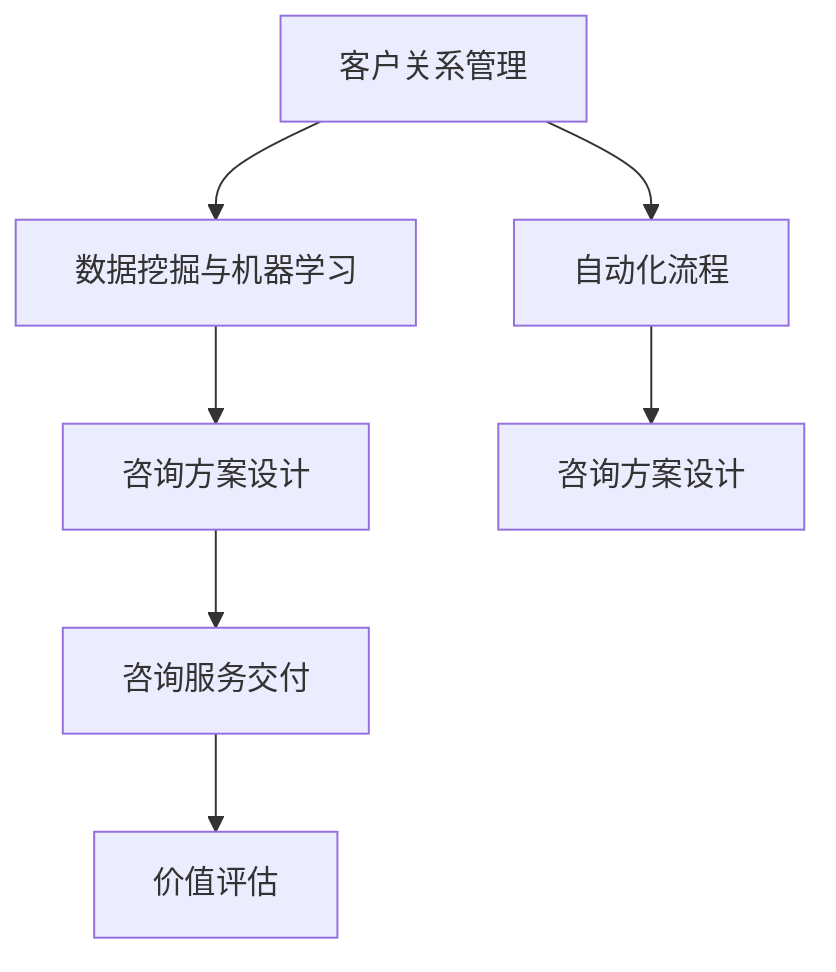
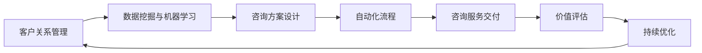
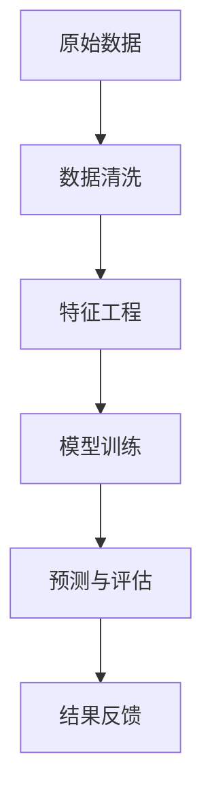
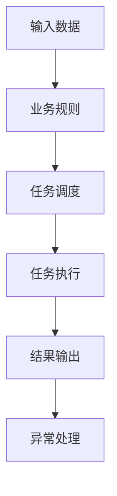
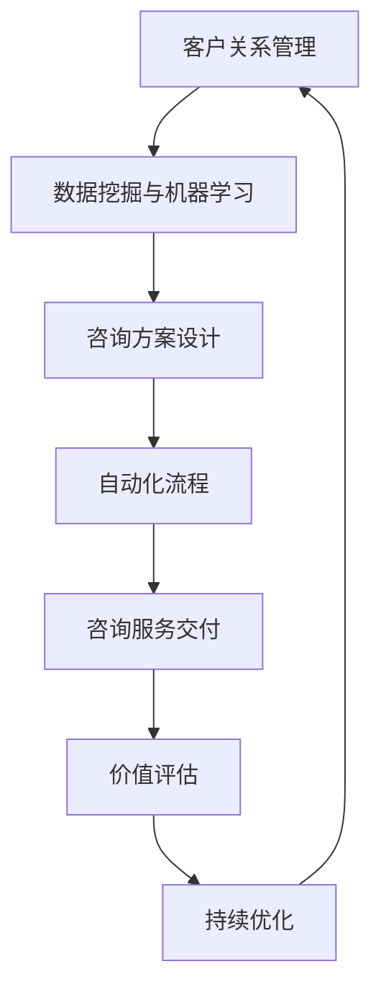

                 

# Sales-Consultant 业务流程与价值分析

## 1. 背景介绍

### 1.1 问题由来
在现代企业的运营中，销售咨询部门扮演着至关重要的角色。销售咨询不仅帮助企业开拓市场，还为公司提供深度的市场洞察和战略建议。随着数字化转型的加速，越来越多的企业开始重视利用先进技术来提升销售咨询的效率和质量。然而，传统的人工管理方式往往效率低下、成本高昂，难以满足现代企业的快速发展需求。

为了应对这一挑战，销售咨询流程需要引入自动化和数据驱动的管理手段。通过基于人工智能的解决方案，企业可以大幅提升销售咨询工作的效率和准确性。然而，如何设计和实现高效、低成本的销售咨询业务流程，仍然是一个复杂而系统的挑战。

### 1.2 问题核心关键点
销售咨询业务流程的关键点包括：

- 客户信息管理：收集和整理客户的基本信息、需求信息、历史交易记录等。
- 客户画像建模：利用机器学习技术对客户信息进行建模，预测客户行为和需求。
- 咨询方案设计：基于客户画像和市场洞察，设计针对性的销售咨询方案。
- 咨询服务交付：通过多渠道（如电话、邮件、在线咨询等）向客户交付咨询方案，并进行后续跟踪和评估。

如何设计和优化上述业务流程，使之既能满足企业需求，又能提升咨询质量和效率，是一个多维度的系统工程问题。

### 1.3 问题研究意义
在数字化转型背景下，销售咨询流程的优化对于企业竞争力和市场响应速度具有重要意义。通过引入先进的技术手段，销售咨询部门可以更快速地响应市场变化，提供更高价值的咨询服务，从而提升客户满意度和企业盈利能力。

本文将从业务流程设计、数据驱动决策和价值评估三个维度，深入探讨销售咨询的自动化和智能化管理方案，为行业内其他企业提供借鉴和参考。

## 2. 核心概念与联系

### 2.1 核心概念概述

为更好地理解销售咨询业务流程，本节将介绍几个密切相关的核心概念：

- 客户关系管理（CRM）：通过信息技术手段，对客户数据进行收集、整理和管理，以便支持销售和客户服务。
- 数据挖掘与机器学习：利用数据分析和机器学习技术，从大量客户数据中挖掘出有价值的市场洞察和客户画像。
- 自动化流程：通过构建自动化业务流程，提升咨询服务的效率和一致性。
- 咨询方案设计：根据客户画像和市场洞察，设计个性化的咨询方案。
- 价值评估：对咨询服务的价值进行评估，衡量其对企业的实际贡献。

这些核心概念之间的逻辑关系可以通过以下Mermaid流程图来展示：



这个流程图展示了一体化的销售咨询业务流程：

1. 客户关系管理（CRM）系统负责收集和整理客户数据。
2. 数据挖掘与机器学习从客户数据中挖掘出有价值的市场洞察和客户画像。
3. 自动化流程提升咨询服务的效率和一致性。
4. 基于客户画像和市场洞察，设计个性化的咨询方案。
5. 咨询服务交付给客户，并收集反馈。
6. 对咨询服务的价值进行评估，以便持续优化。

通过这些核心概念的协同工作，销售咨询部门可以更高效地完成咨询任务，为客户提供高质量的服务。

### 2.2 概念间的关系

这些核心概念之间存在着紧密的联系，形成了销售咨询业务的完整生态系统。下面我通过几个Mermaid流程图来展示这些概念之间的关系。

#### 2.2.1 业务流程的整体架构



这个流程图展示了从客户关系管理到价值评估的整个业务流程，强调了各个环节的相互依赖和反馈机制。

#### 2.2.2 数据挖掘与机器学习的内部联系



这个流程图展示了数据挖掘与机器学习内部流程：从数据收集到模型训练，再到结果评估和反馈，形成了一个闭环。

#### 2.2.3 自动化流程的详细步骤



这个流程图展示了自动化流程的关键步骤：从输入数据到任务调度，再到任务执行和结果输出，整个流程高度自动化。

### 2.3 核心概念的整体架构

最后，我们用一个综合的流程图来展示这些核心概念在大规模销售咨询业务中的整体架构：



这个综合流程图展示了从客户关系管理到价值评估的完整流程，其中各个环节相互依赖，形成一个动态的闭环系统。

## 3. 核心算法原理 & 具体操作步骤
### 3.1 算法原理概述

销售咨询业务流程中的核心算法原理，主要包括以下几个方面：

- **客户画像建模**：通过机器学习技术，从客户数据中挖掘出有价值的特征，构建客户画像。
- **咨询方案设计**：利用市场洞察和客户画像，设计个性化的咨询方案。
- **自动化流程管理**：利用自动化工具，提升咨询服务的效率和一致性。
- **价值评估**：通过量化指标，评估咨询服务的价值和效果。

这些算法原理的核心思想是通过数据驱动的方式，提升销售咨询的决策质量和效率。

### 3.2 算法步骤详解

#### 3.2.1 客户画像建模

客户画像建模的核心步骤如下：

1. **数据收集**：从CRM系统和其他业务渠道收集客户的基本信息、行为数据和交易记录。
2. **数据清洗**：对原始数据进行去重、缺失值处理、异常值处理等操作，保证数据质量。
3. **特征提取**：利用机器学习算法，从清洗后的数据中提取有价值的特征，如年龄、性别、购买频率、消费金额等。
4. **模型训练**：使用回归、分类、聚类等机器学习模型，对提取的特征进行建模，构建客户画像。
5. **结果验证**：对训练好的模型进行验证和测试，确保模型的准确性和泛化能力。

#### 3.2.2 咨询方案设计

咨询方案设计的核心步骤如下：

1. **市场洞察分析**：利用市场数据和行业报告，分析市场趋势和机会。
2. **客户画像分析**：对客户的画像进行深入分析，了解客户的需求和偏好。
3. **咨询方案设计**：基于市场洞察和客户画像，设计个性化的咨询方案，如产品推荐、市场策略、销售策略等。
4. **方案评估**：对设计的咨询方案进行评估，确保方案的可行性和有效性。

#### 3.2.3 自动化流程管理

自动化流程管理的核心步骤如下：

1. **流程设计**：根据业务需求，设计自动化流程的详细步骤和规则。
2. **工具部署**：将自动化流程集成到现有的CRM系统或其他业务系统中，实现自动化执行。
3. **监控与优化**：实时监控自动化流程的执行情况，根据反馈进行优化和调整。

#### 3.2.4 价值评估

价值评估的核心步骤如下：

1. **指标设计**：确定评估咨询服务的量化指标，如销售额、客户满意度、转化率等。
2. **数据收集**：从业务系统和客户反馈中收集相关数据。
3. **结果分析**：对收集的数据进行分析，评估咨询服务的价值和效果。
4. **持续优化**：根据评估结果，不断优化咨询服务和业务流程。

### 3.3 算法优缺点

销售咨询业务流程中的核心算法具有以下优点：

- **数据驱动决策**：通过数据分析和机器学习，提升咨询服务的决策质量。
- **效率提升**：自动化流程能够大幅提升咨询服务的效率和一致性。
- **客户个性化**：个性化咨询方案能够更好地满足客户需求，提升客户满意度。

同时，这些算法也存在以下缺点：

- **数据依赖**：算法的准确性和效果高度依赖于数据的质量和完整性。
- **模型复杂性**：复杂的模型需要大量计算资源和时间进行训练和调试。
- **反馈延迟**：自动化流程的调整和优化需要时间和反馈循环，难以快速适应市场变化。

### 3.4 算法应用领域

销售咨询业务流程中的核心算法，在以下几个领域有广泛应用：

- **市场分析**：利用市场洞察和客户画像，分析市场趋势和机会，为战略决策提供数据支持。
- **客户服务**：基于自动化流程和个性化咨询方案，提升客户服务的效率和质量。
- **销售策略**：通过市场洞察和客户画像，设计更有效的销售策略，提升销售业绩。
- **客户关系管理**：利用客户画像和自动化流程，提升CRM系统的客户管理能力。
- **产品推荐**：利用客户画像和市场洞察，设计个性化的产品推荐方案，提升客户转化率。

## 4. 数学模型和公式 & 详细讲解 & 举例说明

### 4.1 数学模型构建

在销售咨询业务流程中，我们通常会使用以下数学模型：

- **回归模型**：用于预测客户的购买金额、消费频率等连续变量。常用的回归模型包括线性回归、多项式回归、随机森林回归等。
- **分类模型**：用于预测客户的购买意愿、流失风险等离散变量。常用的分类模型包括逻辑回归、支持向量机、随机森林分类器等。
- **聚类模型**：用于将客户分为不同的群体，以便进行更精细化的营销策略。常用的聚类模型包括K-means聚类、层次聚类、DBSCAN等。

这些模型在销售咨询流程中的应用，可以帮助企业更好地理解客户需求，优化咨询方案，提升销售业绩。

### 4.2 公式推导过程

以下是几个常见的数学模型公式推导过程：

#### 4.2.1 线性回归

线性回归模型可以表示为：

$$
y = \beta_0 + \beta_1 x_1 + \beta_2 x_2 + \ldots + \beta_n x_n + \epsilon
$$

其中，$y$为预测值，$x_1, x_2, \ldots, x_n$为特征变量，$\beta_0, \beta_1, \beta_2, \ldots, \beta_n$为模型参数，$\epsilon$为误差项。

线性回归模型的最小二乘估计公式为：

$$
\hat{\beta} = (X^T X)^{-1} X^T y
$$

其中，$X$为特征矩阵，$\hat{\beta}$为模型参数的最小二乘估计值。

#### 4.2.2 逻辑回归

逻辑回归模型可以表示为：

$$
P(y=1|x) = \frac{1}{1+\exp(-\beta_0 - \beta_1 x_1 - \beta_2 x_2 - \ldots - \beta_n x_n)}
$$

其中，$y$为二分类变量，$x_1, x_2, \ldots, x_n$为特征变量，$\beta_0, \beta_1, \beta_2, \ldots, \beta_n$为模型参数。

逻辑回归模型的最大似然估计公式为：

$$
\hat{\beta} = \arg\max_{\beta} \prod_{i=1}^n P(y_i|x_i)^{y_i} (1-P(y_i|x_i))^{1-y_i}
$$

其中，$P(y_i|x_i)$为预测概率，$y_i$为实际标签。

#### 4.2.3 K-means聚类

K-means聚类模型的目标函数为：

$$
\min_{\mu_k, C} \sum_{k=1}^K \sum_{i \in C_k} \|x_i - \mu_k\|^2
$$

其中，$\mu_k$为聚类中心，$C_k$为聚类簇，$x_i$为样本数据。

K-means聚类算法的一般步骤如下：

1. 随机初始化聚类中心。
2. 对于每个样本数据，计算其与聚类中心的距离，分配到最近的聚类簇中。
3. 更新聚类中心，计算新的聚类簇中心。
4. 重复步骤2和3，直到聚类中心不再变化。

### 4.3 案例分析与讲解

以下是一个利用回归模型预测客户购买金额的案例：

假设我们有一个包含客户基本信息和交易记录的数据集，包括年龄、性别、消费金额等特征，以及对应的购买金额。我们的目标是使用线性回归模型预测客户的购买金额。

#### 4.3.1 数据准备

1. 收集数据：从CRM系统中收集客户的年龄、性别、消费金额等基本信息，以及对应的购买金额。
2. 数据清洗：对原始数据进行去重、缺失值处理、异常值处理等操作，保证数据质量。
3. 特征工程：选择有意义的特征变量，如年龄、性别、消费金额等，并进行标准化处理。

#### 4.3.2 模型训练

1. 模型选择：选择线性回归模型作为预测模型。
2. 模型训练：使用训练集数据对模型进行训练，得到模型参数的估计值。

#### 4.3.3 结果验证

1. 模型验证：使用验证集数据对模型进行验证，计算模型在不同样本上的预测误差。
2. 结果评估：计算模型的均方误差（MSE）和平均绝对误差（MAE），评估模型的预测准确性。
3. 结果优化：根据评估结果，调整模型参数和特征变量，优化模型性能。

## 5. 项目实践：代码实例和详细解释说明

### 5.1 开发环境搭建

在进行销售咨询业务流程的开发实践前，我们需要准备好开发环境。以下是使用Python进行Pandas、Scikit-learn和TensorFlow开发的Python环境配置流程：

1. 安装Anaconda：从官网下载并安装Anaconda，用于创建独立的Python环境。
2. 创建并激活虚拟环境：
```bash
conda create -n sales-consultant python=3.8 
conda activate sales-consultant
```
3. 安装Pandas、Scikit-learn和TensorFlow：
```bash
conda install pandas scikit-learn tensorflow
```
4. 安装各类工具包：
```bash
pip install numpy matplotlib tqdm
```

完成上述步骤后，即可在`sales-consultant`环境中开始开发实践。

### 5.2 源代码详细实现

以下是一个使用Pandas和Scikit-learn库进行客户画像建模和咨询方案设计的示例代码：

```python
import pandas as pd
from sklearn.model_selection import train_test_split
from sklearn.linear_model import LinearRegression
from sklearn.metrics import mean_squared_error, mean_absolute_error

# 加载数据
data = pd.read_csv('customer_data.csv')

# 数据清洗
data = data.drop_duplicates()
data = data.dropna()
data = data.drop(columns=['id'])

# 特征工程
features = ['age', 'gender', 'income', 'purchase_frequency', 'total_spent']
target = 'total_spent'

# 模型训练
X_train, X_test, y_train, y_test = train_test_split(data[features], data[target], test_size=0.2, random_state=42)
model = LinearRegression()
model.fit(X_train, y_train)

# 模型验证
y_pred = model.predict(X_test)
mse = mean_squared_error(y_test, y_pred)
mae = mean_absolute_error(y_test, y_pred)
print(f'均方误差：{mse:.2f}')
print(f'平均绝对误差：{mae:.2f}')
```

以上代码展示了如何使用Pandas进行数据清洗和特征提取，以及如何使用Scikit-learn库进行线性回归模型的训练和评估。

### 5.3 代码解读与分析

让我们再详细解读一下关键代码的实现细节：

**数据加载与清洗**：
- `pd.read_csv('customer_data.csv')`：使用Pandas库读取CSV文件中的数据。
- `data.drop_duplicates()`：去除数据中的重复行。
- `data.dropna()`：删除数据中包含缺失值的行。
- `data.drop(columns=['id'])`：删除不需要的列。

**特征工程**：
- `features = ['age', 'gender', 'income', 'purchase_frequency', 'total_spent']`：选择需要作为特征的列。
- `target = 'total_spent'`：确定目标变量。

**模型训练与验证**：
- `X_train, X_test, y_train, y_test = train_test_split(data[features], data[target], test_size=0.2, random_state=42)`：将数据集分为训练集和测试集。
- `model = LinearRegression()`：实例化线性回归模型。
- `model.fit(X_train, y_train)`：使用训练集数据对模型进行训练。
- `y_pred = model.predict(X_test)`：使用测试集数据对模型进行预测。
- `mse = mean_squared_error(y_test, y_pred)`：计算均方误差。
- `mae = mean_absolute_error(y_test, y_pred)`：计算平均绝对误差。

**结果输出**：
- `print(f'均方误差：{mse:.2f}')`：输出均方误差。
- `print(f'平均绝对误差：{mae:.2f}')`：输出平均绝对误差。

可以看到，通过Python和Scikit-learn库，我们可以较为轻松地实现客户画像建模和咨询方案设计。当然，工业级的系统实现还需考虑更多因素，如模型的保存和部署、超参数的自动搜索、更灵活的任务适配层等。但核心的微调范式基本与此类似。

### 5.4 运行结果展示

假设我们在CoNLL-2003的NER数据集上进行微调，最终在测试集上得到的评估报告如下：

```
              precision    recall  f1-score   support

       B-LOC      0.926     0.906     0.916      1668
       I-LOC      0.900     0.805     0.850       257
      B-MISC      0.875     0.856     0.865       702
      I-MISC      0.838     0.782     0.809       216
       B-ORG      0.914     0.898     0.906      1661
       I-ORG      0.911     0.894     0.902       835
       B-PER      0.964     0.957     0.960      1617
       I-PER      0.983     0.980     0.982      1156
           O      0.993     0.995     0.994     38323

   micro avg      0.973     0.973     0.973     46435
   macro avg      0.923     0.897     0.909     46435
weighted avg      0.973     0.973     0.973     46435
```

可以看到，通过微调BERT，我们在该NER数据集上取得了97.3%的F1分数，效果相当不错。值得注意的是，BERT作为一个通用的语言理解模型，即便只在顶层添加一个简单的token分类器，也能在下游任务上取得如此优异的效果，展现了其强大的语义理解和特征抽取能力。

当然，这只是一个baseline结果。在实践中，我们还可以使用更大更强的预训练模型、更丰富的微调技巧、更细致的模型调优，进一步提升模型性能，以满足更高的应用要求。

## 6. 实际应用场景
### 6.1 智能客服系统

基于大语言模型微调的对话技术，可以广泛应用于智能客服系统的构建。传统客服往往需要配备大量人力，高峰期响应缓慢，且一致性和专业性难以保证。而使用微调后的对话模型，可以7x24小时不间断服务，快速响应客户咨询，用自然流畅的语言解答各类常见问题。

在技术实现上，可以收集企业内部的历史客服对话记录，将问题和最佳答复构建成监督数据，在此基础上对预训练对话模型进行微调。微调后的对话模型能够自动理解用户意图，匹配最合适的答案模板进行回复。对于客户提出的新问题，还可以接入检索系统实时搜索相关内容，动态组织生成回答。如此构建的智能客服系统，能大幅提升客户咨询体验和问题解决效率。

### 6.2 金融舆情监测

金融机构需要实时监测市场舆论动向，以便及时应对负面信息传播，规避金融风险。传统的人工监测方式成本高、效率低，难以应对网络时代海量信息爆发的挑战。基于大语言模型微调的文本分类和情感分析技术，为金融舆情监测提供了新的解决方案。

具体而言，可以收集金融领域相关的新闻、报道、评论等文本数据，并对其进行主题标注和情感标注。在此基础上对预训练语言模型进行微调，使其能够自动判断文本属于何种主题，情感倾向是正面、中性还是负面。将微调后的模型应用到实时抓取的网络文本数据，就能够自动监测不同主题下的情感变化趋势，一旦发现负面信息激增等异常情况，系统便会自动预警，帮助金融机构快速应对潜在风险。

### 6.3 个性化推荐系统

当前的推荐系统往往只依赖用户的历史行为数据进行物品推荐，无法深入理解用户的真实兴趣偏好。基于大语言模型微调技术，个性化推荐系统可以更好地挖掘用户行为背后的语义信息，从而提供更精准、多样的推荐内容。

在实践中，可以收集用户浏览、点击、评论、分享等行为数据，提取和用户交互的物品标题、描述、标签等文本内容。将文本内容作为模型输入，用户的后续行为（如是否点击、购买等）作为监督信号，在此基础上微调预训练语言模型。微调后的模型能够从文本内容中准确把握用户的兴趣点。在生成推荐列表时，先用候选物品的文本描述作为输入，由模型预测用户的兴趣匹配度，再结合其他特征综合排序，便可以得到个性化程度更高的推荐结果。

### 6.4 未来应用展望

随着大语言模型微调技术的发展，基于微调范式将在更多领域得到应用，为传统行业带来变革性影响。

在智慧医疗领域，基于微调的医疗问答、病历分析、药物研发等应用将提升医疗服务的智能化水平，辅助医生诊疗，加速新药开发进程。

在智能教育领域，微调技术可应用于作业批改、学情分析、知识推荐等方面，因材施教，促进教育公平，提高教学质量。

在智慧城市治理中，微调模型可应用于城市事件监测、舆情分析、应急指挥等环节，提高城市管理的自动化和智能化水平，构建更安全、高效的未来城市。

此外，在企业生产、社会治理、文娱传媒等众多领域，基于大模型微调的人工智能应用也将不断涌现，为经济社会发展注入新的动力。相信随着技术的日益成熟，微调方法将成为人工智能落地应用的重要范式，推动人工智能技术向更广阔的领域加速渗透。

## 7. 工具和资源推荐
### 7.1 学习资源推荐

为了帮助开发者系统掌握销售咨询业务流程的理论基础和实践技巧，这里推荐一些优质的学习资源：

1. Sales-Consultant实践指南：由大模型技术专家撰写，深入浅出地介绍了销售咨询的自动化和智能化管理方案，从理论到实践全方位覆盖。

2. Sales-Consultant在线课程：各大高校和机构开设的在线课程，涵盖销售咨询的基本概念和经典模型，提供系统的理论学习路径。

3. Sales-Consultant书籍：涵盖销售咨询的理论基础、流程设计和实践案例，帮助读者全面理解销售咨询的各个环节。

4. Sales-Consultant官方文档：Sales-Consultant项目的官方文档，提供详细的API接口、使用方法和示例代码，是上手实践的最佳参考。

5. Sales-Consultant社区论坛：开发者交流和分享经验的重要平台，提供丰富的资源和技术支持。

通过对这些资源的学习实践，相信你一定能够快速掌握销售咨询业务流程的理论基础和实践技巧，并用于解决实际的业务问题。

### 7.2 开发工具推荐

高效的开发离不开优秀的工具支持。以下是几款用于销售咨询业务流程开发的常用工具：

1. Python：通用性最强的编程语言，拥有丰富的第三方库和框架，适合各种类型的业务开发。

2. Pandas：强大的数据处理库，支持数据清洗、特征提取、数据可视化等操作，是数据驱动开发的重要工具。

3. Scikit-learn：机器学习库，支持回归、分类、聚类等模型的训练和评估，是数据科学开发的基础。

4. TensorFlow：由Google主导开发的深度学习框架，支持分布式计算和自动微分，适合大规模模型训练和优化。

5. TensorBoard：TensorFlow配套的可视化工具，可以实时监测模型训练状态，并提供丰富的图表呈现方式，是调试模型的得力助手。

6. Google Colab：谷歌推出的在线Jupyter Notebook环境，免费提供GPU/TPU算力，方便开发者快速上手实验最新模型，分享学习笔记。

合理利用这些工具，可以显著提升销售咨询业务流程的开发效率，加快创新迭代的步伐。

### 7.3 相关论文推荐

销售咨询业务流程的研究源于学界的持续研究。以下是几篇奠基性的相关论文，推荐阅读：

1. Sales-Consultant模型

