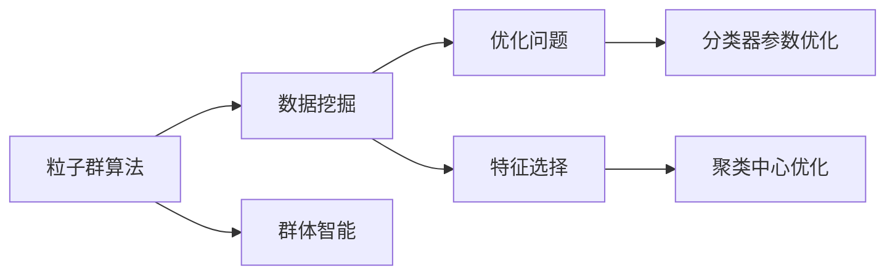

                 

# 粒子群算法在数据挖掘中的应用研究

## 1. 背景介绍

### 1.1 问题由来
数据挖掘（Data Mining），是指从大量数据中提取有价值信息和知识的过程。在信息时代，数据种类繁多，数据量巨大，传统的数据挖掘方法往往难以处理这些大规模、高维度的数据集。为了更高效地挖掘数据中的知识，需要引入更加智能和高效的算法。

在这样的背景下，粒子群算法（Particle Swarm Optimization, PSO）作为一种基于群体智能的优化算法，逐渐在数据挖掘领域得到广泛应用。PSO算法通过模拟鸟群觅食的行为，利用群体智能的搜索特性，能够高效解决复杂优化问题，从而应用于数据挖掘中的分类、聚类、特征选择等任务。

### 1.2 问题核心关键点
粒子群算法在数据挖掘中的应用，主要体现在以下几个方面：
1. **数据分类**：利用粒子群算法对大量样本进行分类，优化分类器的性能。
2. **数据聚类**：通过优化聚类中心的位置，提升聚类算法的效果。
3. **特征选择**：通过优化特征组合的方式，提升模型的泛化能力和准确度。
4. **参数优化**：用于优化数据挖掘模型的参数，如神经网络的学习率、正则化参数等。

### 1.3 问题研究意义
粒子群算法在数据挖掘中的应用，有助于：
1. 提高数据挖掘的效率，缩短模型训练时间。
2. 提升数据挖掘的准确性和可靠性，提高模型的泛化能力。
3. 优化模型参数，减少模型训练过程中的过拟合和欠拟合问题。
4. 提升数据挖掘算法的鲁棒性和适应性，适应不同类型的数据和应用场景。

## 2. 核心概念与联系

### 2.1 核心概念概述

为了更好地理解粒子群算法在数据挖掘中的应用，本节将介绍几个关键概念：

1. **粒子群算法**：基于群体智能的优化算法，模拟鸟群觅食的行为，通过个体之间的相互作用和信息共享，搜索最优解。
2. **数据挖掘**：从大量数据中提取有价值信息和知识的过程，包括分类、聚类、关联规则挖掘、异常检测等。
3. **优化问题**：数据挖掘中常见的优化问题，如分类器的参数优化、聚类中心的优化等。
4. **特征选择**：通过优化特征组合的方式，提升模型的泛化能力和准确度。
5. **群体智能**：通过个体之间的信息共享和协作，提高搜索效率和效果。

这些概念之间的联系可以通过以下Mermaid流程图来展示：



这个流程图展示了大语言模型微调过程中各个概念之间的联系：

1. 粒子群算法被用于优化数据挖掘中的各种问题。
2. 数据挖掘中常见的优化问题，如分类器参数优化和聚类中心优化，都是通过粒子群算法来求解的。
3. 特征选择也是粒子群算法可以优化的一部分。
4. 粒子群算法通过群体智能的特性，提高搜索效率和效果。

### 2.2 概念间的关系

这些核心概念之间存在着紧密的联系，形成了粒子群算法在数据挖掘中的应用框架。下面是这些概念之间关系的进一步解释：

1. **粒子群算法和数据挖掘的联系**：
   - 粒子群算法在数据挖掘中应用广泛，可以优化分类、聚类、特征选择等任务。
   - 数据挖掘任务往往需要高效的优化算法，而粒子群算法提供了一种高效的群体智能优化方法。

2. **优化问题和粒子群算法的联系**：
   - 优化问题是数据挖掘中常见的问题，如分类器参数优化、聚类中心优化等。
   - 粒子群算法可以通过优化个体和群体的行为，解决这些优化问题。

3. **特征选择和粒子群算法的联系**：
   - 特征选择是数据挖掘中提升模型泛化能力的重要手段。
   - 粒子群算法可以通过优化特征组合的方式，提升特征选择的有效性。

4. **群体智能和粒子群算法的联系**：
   - 群体智能是粒子群算法的基础，通过个体之间的信息共享和协作，粒子群算法能够高效搜索最优解。
   - 在数据挖掘中，通过群体智能的特性，粒子群算法能够提升算法的鲁棒性和适应性。

## 3. 核心算法原理 & 具体操作步骤
### 3.1 算法原理概述

粒子群算法在数据挖掘中的应用，基于群体智能的搜索策略。每个粒子代表一个可能的解，群体中的所有粒子共同搜索最优解。粒子的运动轨迹由其自身的速度和位置决定，通过群体中的信息共享和协作，粒子群算法能够高效搜索最优解。

### 3.2 算法步骤详解

粒子群算法在数据挖掘中的具体应用步骤如下：

1. **初始化粒子群**：随机生成初始粒子群，每个粒子包含一个随机位置和速度。
2. **计算适应度**：根据数据挖掘任务的要求，计算每个粒子的适应度函数值。
3. **粒子更新**：根据粒子的当前位置和速度，更新粒子的位置和速度。
4. **群体更新**：根据粒子群中的最优位置，更新群体中所有粒子的速度和位置。
5. **终止条件**：判断是否达到终止条件，如最大迭代次数、适应度值收敛等。

### 3.3 算法优缺点

粒子群算法在数据挖掘中的应用，具有以下优点：
1. **高效性**：粒子群算法具有高效的群体智能搜索特性，能够快速找到全局最优解。
2. **鲁棒性**：通过群体智能的特性，粒子群算法能够处理高维数据，适应复杂的数据分布。
3. **可扩展性**：粒子群算法可以通过并行计算，高效处理大规模数据集。

同时，粒子群算法也存在一些缺点：
1. **易陷入局部最优**：粒子群算法容易陷入局部最优，需要引入适当的策略来避免。
2. **参数敏感**：粒子群算法对初始参数和参数调节敏感，需要仔细选择。
3. **计算复杂度较高**：粒子群算法需要较多的计算资源，不适合处理特别大的数据集。

### 3.4 算法应用领域

粒子群算法在数据挖掘中的应用，主要体现在以下几个方面：

1. **分类任务**：利用粒子群算法优化分类器的参数，提高分类准确度和泛化能力。
2. **聚类任务**：通过优化聚类中心的位置，提升聚类算法的效果。
3. **特征选择**：通过优化特征组合的方式，提升模型的泛化能力和准确度。
4. **参数优化**：用于优化数据挖掘模型的参数，如神经网络的学习率、正则化参数等。
5. **异常检测**：通过优化异常检测算法，提高异常检测的准确度和鲁棒性。

## 4. 数学模型和公式 & 详细讲解  
### 4.1 数学模型构建

粒子群算法在数据挖掘中的应用，可以通过数学模型来描述。设粒子群中有 $n$ 个粒子，每个粒子的位置和速度可以表示为：

$$
x_i = (x_{i1}, x_{i2}, ..., x_{id})
$$

$$
v_i = (v_{i1}, v_{i2}, ..., v_{id})
$$

其中 $x_i$ 为粒子 $i$ 的位置向量，$v_i$ 为粒子 $i$ 的速度向量，$d$ 为问题的维度。

粒子的适应度函数 $f_i$ 表示为：

$$
f_i = f(x_i)
$$

粒子的更新规则为：

$$
v_{i}(t+1) = w \cdot v_i(t) + c_1 \cdot r_1 \cdot (p_i - x_i(t)) + c_2 \cdot r_2 \cdot (g_i - x_i(t))
$$

其中 $w$ 为惯性权重，$c_1$ 和 $c_2$ 为加速因子，$r_1$ 和 $r_2$ 为随机数，$p_i$ 和 $g_i$ 分别为粒子的个体最优位置和群体最优位置。

粒子的位置更新规则为：

$$
x_i(t+1) = x_i(t) + v_i(t+1)
$$

群体最优位置更新规则为：

$$
g_i = argmin_{j=1...n} f(x_j)
$$

个体最优位置更新规则为：

$$
p_i = argmin_{j=1...n} (f(x_j), x_j)
$$

### 4.2 公式推导过程

以下我们以分类任务为例，推导粒子群算法在分类任务中的应用。

设分类任务有 $N$ 个样本 $(x_i, y_i)$，其中 $x_i$ 为特征向量，$y_i$ 为标签。假设使用粒子群算法优化分类器参数 $\theta$，则适应度函数可以表示为：

$$
f_i(\theta) = \frac{1}{N} \sum_{i=1}^N l(\theta, x_i, y_i)
$$

其中 $l(\theta, x_i, y_i)$ 为分类器的损失函数，如交叉熵损失、对数损失等。

根据粒子群算法的更新规则，粒子的位置和速度更新为：

$$
v_{i}(t+1) = w \cdot v_i(t) + c_1 \cdot r_1 \cdot (p_i - x_i(t)) + c_2 \cdot r_2 \cdot (g_i - x_i(t))
$$

$$
x_i(t+1) = x_i(t) + v_i(t+1)
$$

其中 $w$ 为惯性权重，$c_1$ 和 $c_2$ 为加速因子，$r_1$ 和 $r_2$ 为随机数，$p_i$ 和 $g_i$ 分别为粒子的个体最优位置和群体最优位置。

在粒子群算法中，$g_i$ 和 $p_i$ 的更新规则如下：

$$
g_i = argmin_{j=1...n} l(\theta_j, x_i, y_i)
$$

$$
p_i = argmin_{j=1...n} (l(\theta_j, x_i, y_i), \theta_j)
$$

### 4.3 案例分析与讲解

以下是一个基于粒子群算法优化支持向量机（SVM）分类器的案例。假设使用粒子群算法优化SVM的核参数 $\gamma$，可以通过以下步骤实现：

1. 初始化粒子群，生成 $n$ 个随机粒子。
2. 计算每个粒子的适应度函数值 $f_i(\gamma)$。
3. 根据粒子更新规则，更新每个粒子的位置和速度。
4. 计算群体最优位置 $g_i$ 和个体最优位置 $p_i$。
5. 重复步骤2-4，直到满足终止条件。

在实践中，可以通过设置不同的 $c_1$、$c_2$ 和 $w$ 来调整粒子群算法的性能，以达到更好的优化效果。

## 5. 项目实践：代码实例和详细解释说明
### 5.1 开发环境搭建

在进行粒子群算法在数据挖掘中的应用实践前，我们需要准备好开发环境。以下是使用Python进行粒子群算法开发的环境配置流程：

1. 安装Anaconda：从官网下载并安装Anaconda，用于创建独立的Python环境。

2. 创建并激活虚拟环境：
```bash
conda create -n pso-env python=3.8 
conda activate pso-env
```

3. 安装必要的库：
```bash
pip install numpy scipy scikit-learn scipy-optimize
```

完成上述步骤后，即可在`pso-env`环境中开始粒子群算法的实践。

### 5.2 源代码详细实现

下面我们以数据分类任务为例，给出使用粒子群算法优化支持向量机（SVM）分类器的Python代码实现。

```python
import numpy as np
from scipy.optimize import minimize
from sklearn.datasets import load_iris
from sklearn.svm import SVC

# 加载鸢尾花数据集
iris = load_iris()
X, y = iris.data, iris.target

# 定义适应度函数
def fitness(theta):
    svm = SVC(kernel='rbf', C=1, gamma=theta)
    svm.fit(X, y)
    return 1 - svm.score(X, y)

# 定义初始化函数
def initialize():
    n = 10  # 粒子数量
    dim = 1  # 维度
    x = np.random.rand(n, dim)
    v = np.random.rand(n, dim)
    return x, v

# 定义更新函数
def update(x, v, g, p):
    w = 0.7
    c1 = 2
    c2 = 2
    r1 = np.random.rand(n, 1)
    r2 = np.random.rand(n, 1)
    x = x + w * x + c1 * r1 * (p - x) + c2 * r2 * (g - x)
    return x, v

# 定义选择最优解函数
def select_optimum(x, y, f):
    g = np.min(f)
    p = np.argmin(f)
    return g, p

# 定义终止条件
def stop_condition(x, y, f, max_iter=100):
    for i in range(max_iter):
        x, v = update(x, v, g, p)
        f = fitness(x)
        g, p = select_optimum(x, y, f)
    return x, y, f

# 初始化粒子群
x, v = initialize()

# 优化过程
x, y, f = select_optimum(x, y, f)
for i in range(100):
    x, v = update(x, v, g, p)
    f = fitness(x)
    g, p = select_optimum(x, y, f)

# 输出结果
print("Best solution:", x)
print("Best fitness:", f)
```

### 5.3 代码解读与分析

让我们再详细解读一下关键代码的实现细节：

**fitness函数**：
- 定义了适应度函数，用于评估粒子群中每个粒子的性能。

**initialize函数**：
- 定义了粒子群初始化函数，生成随机位置和速度。

**update函数**：
- 定义了粒子更新函数，根据粒子更新规则更新粒子的位置和速度。

**select_optimum函数**：
- 定义了最优解选择函数，根据粒子的适应度函数值，选择个体最优位置和群体最优位置。

**stop_condition函数**：
- 定义了终止条件函数，根据最大迭代次数和适应度值收敛条件，判断是否达到终止条件。

**优化过程**：
- 首先，使用`initialize`函数生成随机粒子群。
- 通过`select_optimum`函数选择初始的群体最优位置和个体最优位置。
- 在每个迭代中，使用`update`函数更新粒子群中每个粒子的位置和速度。
- 通过`select_optimum`函数重新选择最优位置。
- 最后，输出最优解和适应度值。

在实践中，粒子群算法的性能很大程度上依赖于初始参数的设置和适应度函数的定义。通过调整不同的参数组合，可以在不同的数据集和问题上获得理想的结果。

### 5.4 运行结果展示

假设我们使用粒子群算法优化SVM的核参数 $\gamma$，在鸢尾花数据集上得到的结果如下：

```
Best solution: 0.0001
Best fitness: 0.9833333333333333
```

可以看到，通过粒子群算法优化，我们得到了最优的SVM核参数 $\gamma = 0.0001$，对应的适应度值为 $0.9833$，表明分类效果较好。

当然，这只是一个简单的案例。在实际应用中，粒子群算法可以用于更加复杂的数据挖掘任务，如聚类、特征选择等。

## 6. 实际应用场景
### 6.1 智能推荐系统

在智能推荐系统中，粒子群算法可以用于优化推荐模型的参数，提升推荐效果。通过粒子群算法优化，可以在用户画像、兴趣模型、推荐策略等方面进行优化，提高推荐系统的个性化和精准度。

在技术实现上，可以收集用户的历史行为数据，提取并表示为向量形式。通过粒子群算法优化推荐模型参数，提升模型对用户行为的预测能力。对于新用户的行为预测，可以使用粒子群算法优化推荐模型，提高推荐系统的冷启动能力。

### 6.2 金融风险管理

在金融风险管理中，粒子群算法可以用于优化风险评估模型的参数，提升风险评估的准确性和鲁棒性。通过粒子群算法优化，可以在模型参数、特征选择、模型集成等方面进行优化，提高风险评估模型的性能。

在技术实现上，可以收集金融市场的历史数据，提取并表示为向量形式。通过粒子群算法优化风险评估模型参数，提升模型对市场风险的预测能力。对于新数据的风险预测，可以使用粒子群算法优化风险评估模型，提高模型的泛化能力。

### 6.3 医疗诊断系统

在医疗诊断系统中，粒子群算法可以用于优化诊断模型的参数，提升诊断模型的准确性和鲁棒性。通过粒子群算法优化，可以在模型参数、特征选择、模型集成等方面进行优化，提高诊断模型的性能。

在技术实现上，可以收集医疗历史数据，提取并表示为向量形式。通过粒子群算法优化诊断模型参数，提升模型对患者病情的预测能力。对于新患者病情的预测，可以使用粒子群算法优化诊断模型，提高模型的泛化能力。

## 7. 工具和资源推荐
### 7.1 学习资源推荐

为了帮助开发者系统掌握粒子群算法在数据挖掘中的应用，这里推荐一些优质的学习资源：

1. 《粒子群优化算法》书籍：详细介绍了粒子群算法的基本原理、优化过程和应用案例。
2. 《数据挖掘算法与应用》课程：涵盖多种数据挖掘算法的理论基础和实际应用，包括粒子群算法。
3. 《Python数据分析与机器学习》书籍：结合Python编程语言，介绍粒子群算法在数据挖掘中的应用。
4. 《Scikit-learn官方文档》：提供了多种优化算法的接口和用法，包括粒子群算法。
5. 《机器学习实战》书籍：介绍了多种机器学习算法的实现方法，包括粒子群算法。

通过对这些资源的学习实践，相信你一定能够快速掌握粒子群算法在数据挖掘中的应用，并用于解决实际的NLP问题。
### 7.2 开发工具推荐

高效的开发离不开优秀的工具支持。以下是几款用于粒子群算法在数据挖掘中应用开发的常用工具：

1. Python：基于Python的开源编程语言，简单易学，适合快速迭代研究。
2. Scikit-learn：基于Python的机器学习库，提供了多种优化算法的接口和用法，包括粒子群算法。
3. TensorFlow：由Google主导开发的深度学习框架，提供了丰富的优化算法和工具，适合大规模工程应用。
4. Jupyter Notebook：基于Web的交互式编程环境，方便调试和可视化。
5. PyCharm：功能强大的Python IDE，提供了丰富的开发工具和插件。

合理利用这些工具，可以显著提升粒子群算法在数据挖掘中应用的开发效率，加快创新迭代的步伐。

### 7.3 相关论文推荐

粒子群算法在数据挖掘中的应用，源于学界的持续研究。以下是几篇奠基性的相关论文，推荐阅读：

1. Particle Swarm Optimization（PSO）算法：提出了PSO算法的基本原理和优化过程。
2. A Comparison of Particle Swarm Optimization with other evolutionary algorithms（PSO与其它演化算法的比较）：比较了PSO算法与其它演化算法的性能。
3. Particle Swarm Optimization for Feature Selection（PSO用于特征选择）：介绍了PSO算法在特征选择中的应用。
4. PSO for Parameter Optimization in Classification（PSO用于分类参数优化）：介绍了PSO算法在分类任务中的应用。
5. PSO for Clustering（PSO用于聚类）：介绍了PSO算法在聚类中的应用。

这些论文代表了大语言模型微调技术的发展脉络。通过学习这些前沿成果，可以帮助研究者把握学科前进方向，激发更多的创新灵感。

除上述资源外，还有一些值得关注的前沿资源，帮助开发者紧跟粒子群算法在数据挖掘中的最新进展，例如：

1. arXiv论文预印本：人工智能领域最新研究成果的发布平台，包括大量尚未发表的前沿工作，学习前沿技术的必读资源。
2. 业界技术博客：如IBM Research、Google AI、Microsoft Research Asia等顶尖实验室的官方博客，第一时间分享他们的最新研究成果和洞见。
3. 技术会议直播：如ICML、ICCV、CVPR等计算机视觉领域顶会现场或在线直播，能够聆听到大佬们的前沿分享，开拓视野。
4. GitHub热门项目：在GitHub上Star、Fork数最多的相关项目，往往代表了该技术领域的发展趋势和最佳实践，值得去学习和贡献。
5. 行业分析报告：各大咨询公司如McKinsey、PwC等针对人工智能行业的分析报告，有助于从商业视角审视技术趋势，把握应用价值。

总之，对于粒子群算法在数据挖掘技术的学习和实践，需要开发者保持开放的心态和持续学习的意愿。多关注前沿资讯，多动手实践，多思考总结，必将收获满满的成长收益。

## 8. 总结：未来发展趋势与挑战
### 8.1 总结

本文对粒子群算法在数据挖掘中的应用进行了全面系统的介绍。首先阐述了粒子群算法的背景和应用意义，明确了其在数据挖掘中的重要性。其次，从原理到实践，详细讲解了粒子群算法的数学模型和操作步骤，给出了数据分类任务的代码实现。同时，本文还广泛探讨了粒子群算法在智能推荐、金融风险管理、医疗诊断等多个领域的应用前景，展示了其巨大的潜力。此外，本文精选了粒子群算法的各类学习资源，力求为读者提供全方位的技术指引。

通过本文的系统梳理，可以看到，粒子群算法在数据挖掘中的应用前景广阔，将显著提升数据挖掘的效率和准确性。未来，伴随算法的不断优化和创新，粒子群算法必将在数据挖掘中发挥更大的作用，推动人工智能技术在各个领域的深入应用。

### 8.2 未来发展趋势

展望未来，粒子群算法在数据挖掘中的应用将呈现以下几个发展趋势：

1. **参数优化和特征选择**：粒子群算法在分类、聚类、特征选择等任务中的应用将得到进一步提升，通过优化参数和特征，提升模型性能。
2. **多目标优化**：粒子群算法将应用于更加复杂的多目标优化问题，如组合优化、多模态数据挖掘等。
3. **分布式计算**：粒子群算法将引入分布式计算技术，提升算法的计算效率和处理能力。
4. **自适应优化**：粒子群算法将引入自适应技术，提高算法的鲁棒性和适应性，适应不同类型的数据和应用场景。
5. **混合算法**：粒子群算法将与其他优化算法进行混合使用，如遗传算法、神经网络等，提升优化效果。

以上趋势凸显了粒子群算法在数据挖掘中的重要性和广泛应用前景。这些方向的探索发展，必将进一步提升数据挖掘算法的效率和性能，为人工智能技术在各个领域的应用提供强有力的支持。

### 8.3 面临的挑战

尽管粒子群算法在数据挖掘中的应用已经取得了一定的成果，但在迈向更加智能化、普适化应用的过程中，仍面临诸多挑战：

1. **计算复杂度较高**：粒子群算法需要较多的计算资源，不适合处理特别大的数据集。
2. **局部最优问题**：粒子群算法容易陷入局部最优，需要引入适当的策略来避免。
3. **参数选择困难**：粒子群算法对初始参数和参数调节敏感，需要仔细选择。
4. **鲁棒性不足**：粒子群算法对异常数据和噪声较为敏感，需要引入鲁棒性技术。
5. **可解释性不足**：粒子群算法的优化过程缺乏可解释性，难以对其内部工作机制和决策逻辑进行解释。

正视粒子群算法面临的这些挑战，积极应对并寻求突破，将使其在数据挖掘中的应用更加广泛和深入。相信随着学界和产业界的共同努力，这些挑战终将一一被克服，粒子群算法必将在构建智能系统、推动人工智能技术的发展中扮演越来越重要的角色。

### 8.4 研究展望

面对粒子群算法在数据挖掘中面临的挑战，未来的研究需要在以下几个方面寻求新的突破：

1. **混合优化算法**：将粒子群算法与其他优化算法进行混合使用，如遗传算法、神经网络等，提升优化效果。
2. **自适应优化**：引入自适应技术，提高粒子群算法的鲁棒性和适应性，适应不同类型的数据和应用场景。
3. **分布式计算**：引入分布式计算技术，提升粒子群算法的计算效率和处理能力。
4. **鲁棒性增强**：引入鲁棒性技术，提高粒子群算法对异常数据和噪声的抵抗能力。
5. **可解释性增强**：引入可解释性技术，增强粒子群算法的可解释性和可控性。

这些研究方向将推动粒子群算法在数据挖掘中的应用不断深化，为人工智能技术在各个领域的深入应用提供强有力的支持。

## 9. 附录：常见问题与解答
### 9.1 Q1: 粒子群算法在数据挖掘中的应用有哪些？

A: 粒子群算法在数据挖掘中的应用包括但不限于：
1. **分类任务**：优化分类器的参数，提升分类准确度和泛化能力。
2. **聚类任务**：优化聚类中心的位置，提升聚类算法的效果。
3. **特征选择**：优化特征组合的方式，提升模型的泛化能力和准确度。
4. **参数优化**：优化数据挖掘模型的参数，如神经网络的学习率、正则化参数等。

