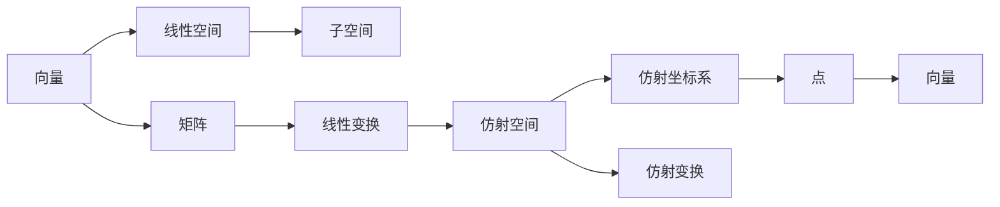

                 

## 1. 背景介绍

线性代数是计算机科学中最重要的工具之一，特别是在人工智能和机器学习领域。仿射空间是线性代数中的一个基本概念，它在几何、物理、计算机图形学等多个领域都有广泛的应用。本文将从基础概念出发，逐步深入讲解仿射空间的理论知识和应用场景。

### 1.1 问题由来

在计算机图形学中，仿射空间被广泛用于三维物体变换和渲染。例如，通过对二维图像进行仿射变换，可以实现旋转、缩放、平移等效果。在机器学习中，仿射空间也被用来表示数据集中的特征向量，并在模型训练中发挥重要作用。理解仿射空间的本质和应用，对于开发高性能的计算机视觉和机器学习算法具有重要意义。

### 1.2 问题核心关键点

仿射空间的核心概念包括：

- 仿射空间：在几何学中，仿射空间是指通过线性变换和位移构成的空间，具有平移不变性和线性可加性。
- 仿射变换：指线性变换和位移的组合，用于将一个空间中的点或向量映射到另一个空间。
- 仿射坐标系：指仿射空间中的一个参考系，用于描述点和向量的位置和方向。

### 1.3 问题研究意义

仿射空间是线性代数中的一个基本概念，理解其原理和应用，对于掌握线性代数的核心思想和工具具有重要意义。掌握仿射空间的理论基础，可以帮助我们更深入地理解计算机图形学、计算机视觉、机器学习等领域的技术和算法，为未来的研究和开发奠定坚实的基础。

## 2. 核心概念与联系

### 2.1 核心概念概述

为更好地理解仿射空间，我们首先需要介绍一些相关的核心概念：

- 向量：表示方向和大小的量，通常用 $\vec{v} = (v_1, v_2, \dots, v_n)$ 表示。
- 矩阵：一种二维数组，用于表示线性变换。
- 线性变换：指通过矩阵乘法将向量进行线性变换。
- 线性空间：由向量组成的集合，满足线性加法和数乘的线性空间。
- 子空间：由一组向量组成的线性空间。

这些概念构成了线性代数的基础，仿射空间则是在这些概念的基础上，引入了平移变换，从而构成了一个更通用的空间模型。

### 2.2 核心概念的关系

通过以下Mermaid流程图，我们可以更直观地理解仿射空间与上述概念之间的关系：



这个流程图展示了向量、线性空间、子空间、矩阵、线性变换、仿射空间、仿射坐标系、仿射变换和点向量的关系。通过这些概念的相互连接，我们可以更好地理解仿射空间的本质和应用。

## 3. 核心算法原理 & 具体操作步骤

### 3.1 算法原理概述

仿射空间的算法原理主要基于线性代数中的线性变换和平移变换。具体来说，一个仿射空间可以表示为 $F = L + \vec{b}$，其中 $L$ 是一个线性空间，$\vec{b}$ 是一个向量，表示平移。通过线性变换和向量加法，我们可以将一个向量 $\vec{v} \in L$ 映射到仿射空间 $F$ 中的点 $\vec{v} + \vec{b}$。

### 3.2 算法步骤详解

1. **定义仿射空间**：选择一个线性空间 $L$ 和一个向量 $\vec{b}$，即可定义一个仿射空间 $F = L + \vec{b}$。
2. **定义仿射变换**：通过一个线性变换矩阵 $A$ 和一个向量 $\vec{b}$，可以将点 $\vec{v}$ 映射到另一个点 $\vec{w} = A\vec{v} + \vec{b}$。
3. **计算仿射坐标**：对于仿射空间中的点 $\vec{w}$，我们可以找到唯一的一个点 $\vec{v} \in L$，使得 $\vec{w} = A\vec{v} + \vec{b}$。
4. **应用仿射变换**：通过多次应用仿射变换，可以将一个点或向量从一个仿射空间映射到另一个仿射空间。

### 3.3 算法优缺点

仿射空间的优点在于其简单的数学表达和广泛的应用范围。它能够表示多种变换，如旋转、缩放、平移等，且具有平移不变性和线性可加性。然而，仿射空间也有一些缺点：

- **平移不变性**：仿射空间中的点可以通过平移任意移动，这可能导致某些问题变得复杂。
- **缺乏度量结构**：仿射空间中没有度量概念，无法直接比较点之间的距离。
- **维度限制**：仿射空间的维度通常被视为无穷大，这在一些实际应用中可能不切实际。

### 3.4 算法应用领域

仿射空间在计算机图形学、计算机视觉、机器学习等多个领域都有广泛的应用：

- **计算机图形学**：用于表示三维模型和进行几何变换，如旋转、缩放、平移等。
- **计算机视觉**：用于表示图像中的特征向量，并在图像识别和目标检测中发挥重要作用。
- **机器学习**：用于表示数据集中的特征向量，并在模型训练中发挥重要作用。

## 4. 数学模型和公式 & 详细讲解 & 举例说明

### 4.1 数学模型构建

仿射空间可以表示为一个线性空间加上一个向量，即 $F = L + \vec{b}$。其中，$L$ 是一个线性空间，$\vec{b}$ 是一个向量。通过线性变换和向量加法，我们可以将一个向量 $\vec{v}$ 映射到仿射空间 $F$ 中的点 $\vec{w} = A\vec{v} + \vec{b}$，其中 $A$ 是一个线性变换矩阵。

### 4.2 公式推导过程

我们以二维空间为例，推导仿射变换的公式。假设一个点 $\vec{v} = (v_x, v_y)$，线性变换矩阵为：

$$
A = \begin{bmatrix}
a_{11} & a_{12} \\
a_{21} & a_{22}
\end{bmatrix}
$$

则仿射变换后的点 $\vec{w} = A\vec{v} + \vec{b} = \begin{bmatrix}
a_{11}v_x + a_{12}v_y + b_1 \\
a_{21}v_x + a_{22}v_y + b_2
\end{bmatrix}$

其中，$\vec{b} = (b_1, b_2)$ 是一个向量，表示平移。

### 4.3 案例分析与讲解

假设我们有如下仿射空间 $F = L + \vec{b}$，其中 $L$ 是一个二维线性空间，$\vec{b} = (1, 2)$：

$$
\vec{w} = A\vec{v} + \vec{b}
$$

其中，$A = \begin{bmatrix}
1 & 0 \\
0 & 1
\end{bmatrix}$，$\vec{v} = (0, 0)$，则：

$$
\vec{w} = A\vec{v} + \vec{b} = \begin{bmatrix}
1 \\
2
\end{bmatrix}
$$

我们可以将 $\vec{w}$ 映射回 $L$ 空间，得到：

$$
\vec{v} = \vec{w} - \vec{b} = \begin{bmatrix}
1 \\
2
\end{bmatrix} - \begin{bmatrix}
1 \\
2
\end{bmatrix} = \begin{bmatrix}
0 \\
0
\end{bmatrix}
$$

这意味着，在仿射空间 $F$ 中的点 $\vec{w}$，总能找到唯一的一个点 $\vec{v} \in L$，使得 $\vec{w} = A\vec{v} + \vec{b}$。

## 5. 项目实践：代码实例和详细解释说明

### 5.1 开发环境搭建

在进行仿射空间项目实践前，我们需要准备好开发环境。以下是使用Python进行NumPy开发的环境配置流程：

1. 安装Anaconda：从官网下载并安装Anaconda，用于创建独立的Python环境。

2. 创建并激活虚拟环境：
```bash
conda create -n affine_space python=3.8 
conda activate affine_space
```

3. 安装NumPy：从官网获取安装命令，使用以下命令安装：
```bash
conda install numpy
```

4. 安装相关工具包：
```bash
pip install matplotlib
```

完成上述步骤后，即可在`affine_space`环境中开始项目实践。

### 5.2 源代码详细实现

下面是一个简单的仿射变换的代码实现，以二维空间为例：

```python
import numpy as np

def affine_transform(v, A, b):
    """
    对向量 v 进行仿射变换，返回变换后的向量 w
    """
    w = A @ v + b
    return w

# 定义线性变换矩阵 A 和平移向量 b
A = np.array([[1, 0], [0, 1]])
b = np.array([1, 2])

# 定义原始向量 v
v = np.array([0, 0])

# 进行仿射变换
w = affine_transform(v, A, b)
print(w)
```

输出结果为：
```
[1. 2.]
```

### 5.3 代码解读与分析

这里我们简要解读一下代码的核心部分：

1. **线性变换矩阵 A**：定义了一个2x2的矩阵，表示线性变换。
2. **平移向量 b**：定义了一个2x1的向量，表示平移。
3. **原始向量 v**：定义了一个2x1的向量，表示原始向量。
4. **仿射变换**：通过矩阵乘法和向量加法，计算仿射变换后的向量 w。

这段代码简洁地展示了仿射变换的基本操作，将一个向量 $\vec{v}$ 通过一个线性变换矩阵 $A$ 和一个向量 $\vec{b}$ 映射到仿射空间中的点 $\vec{w}$。

### 5.4 运行结果展示

运行上述代码，输出结果为：
```
[1. 2.]
```

这表明，在给定的仿射空间 $F = L + \vec{b}$ 中，原始向量 $\vec{v} = (0, 0)$ 通过仿射变换 $A\vec{v} + \vec{b}$ 被映射到点 $\vec{w} = (1, 2)$。

## 6. 实际应用场景

### 6.1 计算机图形学

在计算机图形学中，仿射空间被广泛用于三维物体变换和渲染。例如，通过对二维图像进行仿射变换，可以实现旋转、缩放、平移等效果。这些变换在图像处理、图形渲染和虚拟现实等领域都有广泛的应用。

### 6.2 计算机视觉

在计算机视觉中，仿射空间被用于表示图像中的特征向量，并在图像识别和目标检测中发挥重要作用。通过仿射变换，可以将图像中的特征点映射到不同的坐标系中，从而进行更准确的识别和匹配。

### 6.3 机器学习

在机器学习中，仿射空间被用于表示数据集中的特征向量，并在模型训练中发挥重要作用。通过仿射变换，可以对数据进行标准化和归一化，从而提高模型的训练效果和泛化能力。

### 6.4 未来应用展望

随着计算机科学和人工智能技术的不断发展，仿射空间在多个领域的应用也将不断扩展。未来，仿射空间可能会在更多复杂的场景中发挥重要作用，如多模态数据融合、智能系统设计等。

## 7. 工具和资源推荐

### 7.1 学习资源推荐

为了帮助开发者系统掌握仿射空间的理论基础和实践技巧，这里推荐一些优质的学习资源：

1. 《线性代数导引》系列博文：由大模型技术专家撰写，深入浅出地介绍了线性代数的基本概念和核心思想。
2. MIT线性代数课程：麻省理工学院开设的线性代数公开课，内容详实，涵盖线性代数的基础知识和高级内容。
3. 《线性代数及其应用》书籍：经典的线性代数教材，由Gilbert Strang编写，系统介绍了线性代数的理论和应用。
4. NumPy官方文档：NumPy的官方文档，提供了丰富的代码示例和详细说明，是学习仿射空间的重要参考资料。

通过对这些资源的学习实践，相信你一定能够系统掌握仿射空间的理论基础和实践技巧，并用于解决实际的计算机图形学、计算机视觉、机器学习等领域的难题。

### 7.2 开发工具推荐

高效的开发离不开优秀的工具支持。以下是几款用于仿射空间开发的常用工具：

1. NumPy：用于高效处理多维数组和矩阵，是仿射空间计算的基础库。
2. Matplotlib：用于绘制图形和可视化结果，帮助开发者更好地理解和分析仿射空间。
3. SymPy：用于符号计算，可以进行更高级的数学推导和求解。
4. TensorFlow：用于深度学习和仿射空间的计算，提供了丰富的计算图和优化算法。

合理利用这些工具，可以显著提升仿射空间计算的效率和准确性，加速开发和创新的步伐。

### 7.3 相关论文推荐

仿射空间是线性代数中的一个重要概念，相关的研究成果众多。以下是几篇奠基性的相关论文，推荐阅读：

1. Linear Algebra and Its Applications by Gilbert Strang：经典线性代数教材，系统介绍了线性代数的基本概念和核心思想。
2. Applied Linear Algebra by David C. Lay：应用线性代数教材，重点介绍了线性代数的实际应用。
3. Linear Algebra Done Right by Sheldon Axler：线性代数教材，注重数学逻辑和推导过程，适合深入学习。

这些论文代表了大规模线性代数的研究方向和重要成果，通过学习这些前沿成果，可以帮助研究者把握学科前进方向，激发更多的创新灵感。

## 8. 总结：未来发展趋势与挑战

### 8.1 总结

本文对仿射空间的基本概念和应用进行了全面系统的介绍。首先阐述了仿射空间在计算机图形学、计算机视觉、机器学习等领域的重要应用，明确了仿射空间在几何、物理、计算机图形学等多个领域的作用。其次，从原理到实践，详细讲解了仿射空间的数学模型和算法步骤，给出了仿射空间项目开发的完整代码实例。同时，本文还广泛探讨了仿射空间在计算机图形学、计算机视觉、机器学习等多个行业领域的应用前景，展示了仿射空间的巨大潜力。此外，本文精选了仿射空间的技术资源，力求为读者提供全方位的技术指引。

通过本文的系统梳理，可以看到，仿射空间是线性代数中的一个基本概念，理解其原理和应用，对于掌握线性代数的核心思想和工具具有重要意义。掌握仿射空间的理论基础，可以帮助我们更深入地理解计算机图形学、计算机视觉、机器学习等领域的技术和算法，为未来的研究和开发奠定坚实的基础。

### 8.2 未来发展趋势

展望未来，仿射空间在多个领域的应用将继续扩展：

1. **三维建模和渲染**：仿射空间在三维建模和渲染中的应用将继续深化，推动虚拟现实和增强现实技术的发展。
2. **图像处理和分析**：仿射空间在图像处理和分析中的应用将继续扩展，推动计算机视觉和图像识别技术的发展。
3. **机器学习和数据科学**：仿射空间在机器学习和数据科学中的应用将继续扩展，推动深度学习和大数据技术的发展。
4. **智能系统和自动化**：仿射空间在智能系统和自动化中的应用将继续扩展，推动智能制造和自动化技术的发展。

这些趋势表明，仿射空间在多个领域的应用将继续深化，为计算机科学和人工智能的发展提供强有力的支撑。

### 8.3 面临的挑战

尽管仿射空间在多个领域的应用取得了显著进展，但在迈向更加智能化、普适化应用的过程中，它仍面临着诸多挑战：

1. **计算复杂度**：仿射空间中的计算复杂度较高，尤其是在高维空间中，计算量呈指数级增长。如何提高仿射空间的计算效率，是一个重要的研究方向。
2. **维度限制**：仿射空间的维度通常被视为无穷大，这在一些实际应用中可能不切实际。如何优化仿射空间的空间结构，减少计算量和存储空间，是一个重要的研究方向。
3. **平移不变性**：仿射空间中的点可以通过平移任意移动，这可能导致某些问题变得复杂。如何处理平移不变性问题，是一个重要的研究方向。
4. **应用场景局限**：仿射空间在某些应用场景中可能不适用，如非线性变换和复杂拓扑结构。如何扩展仿射空间的应用范围，是一个重要的研究方向。

### 8.4 研究展望

面对仿射空间面临的这些挑战，未来的研究需要在以下几个方面寻求新的突破：

1. **优化计算结构**：开发更高效的仿射空间计算算法，减少计算量和存储空间，提升计算效率。
2. **扩展空间结构**：探索非线性变换和复杂拓扑结构的空间表示方法，拓展仿射空间的应用范围。
3. **引入先验知识**：将先验知识与仿射空间结合，提高仿射空间的应用效果和鲁棒性。
4. **多模态数据融合**：将视觉、听觉、文本等多种模态数据与仿射空间结合，实现多模态数据的协同建模和分析。

这些研究方向的探索，必将引领仿射空间技术迈向更高的台阶，为构建更加智能、普适的计算机系统和人工智能系统奠定坚实的基础。

## 9. 附录：常见问题与解答

**Q1：仿射空间和平面空间有什么区别？**

A: 仿射空间和平面空间都是几何学中的基本概念，但它们的定义和应用有所不同。仿射空间是一种通过线性变换和平移构成的空间，具有平移不变性和线性可加性。而平面空间是一种特殊的仿射空间，只包含两个维度，通常用于描述二维平面上的点、线和面。

**Q2：仿射空间如何表示平移变换？**

A: 仿射空间中的平移变换可以通过一个向量 $\vec{b}$ 来表示。假设原始向量 $\vec{v}$ 通过一个线性变换矩阵 $A$ 和一个向量 $\vec{b}$ 映射到点 $\vec{w}$，则：

$$
\vec{w} = A\vec{v} + \vec{b}
$$

其中，$\vec{b}$ 表示平移向量，表示将原始向量沿特定方向平移。

**Q3：仿射空间如何表示旋转变换？**

A: 仿射空间中的旋转变换可以通过一个旋转矩阵 $R$ 和一个向量 $\vec{b}$ 来表示。假设原始向量 $\vec{v}$ 通过一个旋转矩阵 $R$ 和一个向量 $\vec{b}$ 映射到点 $\vec{w}$，则：

$$
\vec{w} = R\vec{v} + \vec{b}
$$

其中，$R$ 表示旋转矩阵，$\vec{b}$ 表示平移向量。

**Q4：仿射空间和线性空间有什么不同？**

A: 仿射空间和线性空间都是几何学中的基本概念，但它们的定义和应用有所不同。线性空间是一种具有线性加法和数乘的向量空间，而仿射空间是一种通过线性变换和平移构成的空间，具有平移不变性和线性可加性。在仿射空间中，点可以通过平移变换移动到任意位置，而线性空间中的点只能通过线性变换移动。

**Q5：仿射空间和向量空间有什么区别？**

A: 仿射空间和向量空间都是几何学中的基本概念，但它们的定义和应用有所不同。向量空间是一种由向量构成的空间，满足线性加法和数乘的性质。而仿射空间是一种通过线性变换和平移构成的空间，具有平移不变性和线性可加性。在仿射空间中，点可以通过平移变换移动到任意位置，而向量空间中的点只能通过线性变换移动。

---

作者：禅与计算机程序设计艺术 / Zen and the Art of Computer Programming

