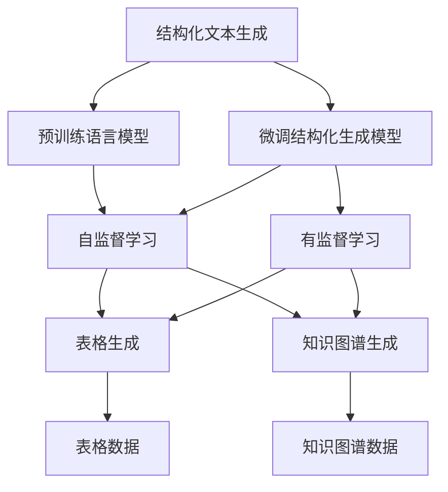
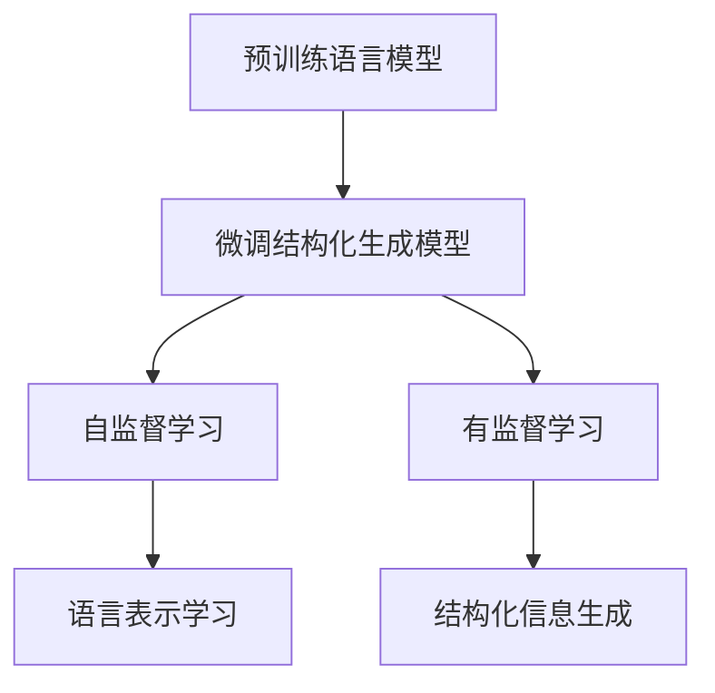
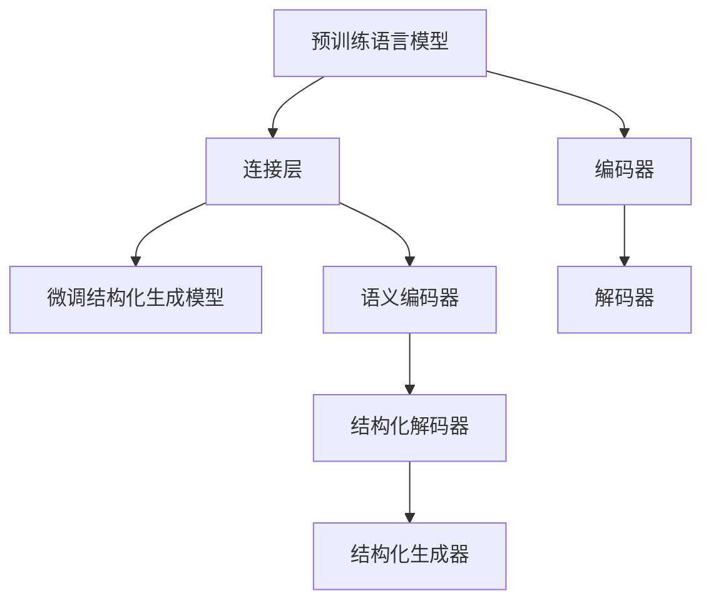
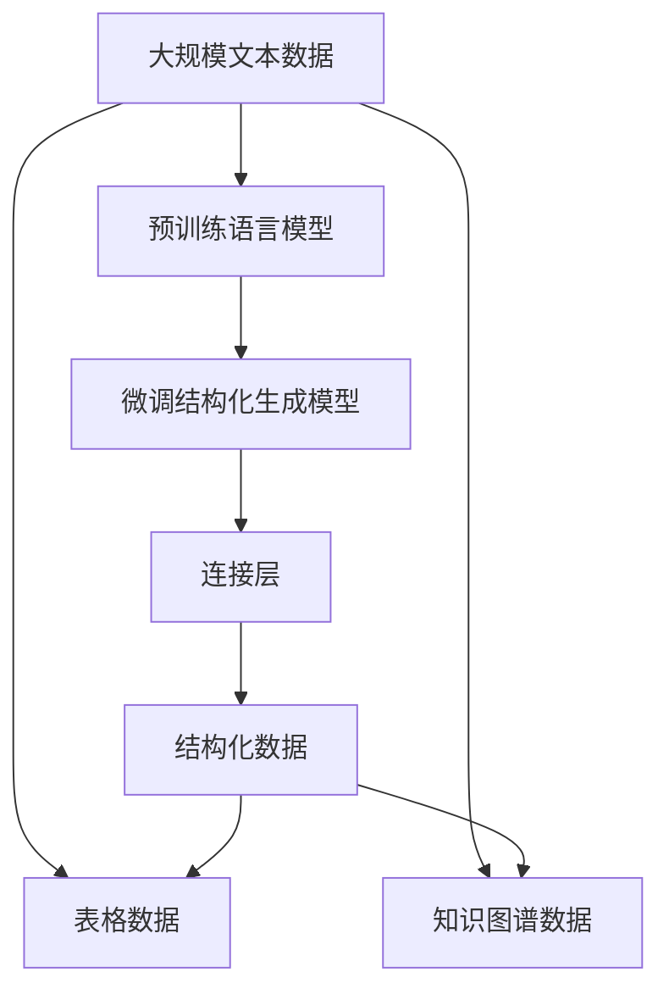

                 

# 结构化文本生成：Weaver模型的实力

> 关键词：结构化文本生成, Weaver模型, 算法原理, 算法应用, 开发环境搭建, 代码实现

## 1. 背景介绍

### 1.1 问题由来

结构化文本生成是自然语言处理领域的一个重要研究课题，其目的是将无结构文本转化为结构化信息，如表格、知识图谱等，以便更好地应用于数据管理、信息检索、知识工程等领域。然而，传统结构化文本生成方法需要手工设计规则，难以处理复杂多变的文本数据，且效果往往不尽人意。

为了解决这些问题，近年来，研究者们提出了许多基于深度学习的方法，如基于规则生成的方法、基于注意力机制的方法、基于Transformer的方法等。其中，基于Transformer的结构化文本生成方法因其出色的表现而受到广泛关注。本文重点介绍Weaver模型，一种新的基于Transformer的结构化文本生成模型，其在结构化文本生成的应用中展现出了强大的实力。

### 1.2 问题核心关键点

Weaver模型是一种基于Transformer的结构化文本生成模型，通过预训练大语言模型和微调特定任务数据，实现从非结构化文本到结构化信息的生成。该模型采用自监督学习和有监督学习相结合的训练策略，能够学习到丰富的语言表示和结构化信息，在多项结构化文本生成任务上取得了领先的成绩。

Weaver模型架构包括：
- 预训练语言模型：如BERT、GPT等，用于提取文本语义信息。
- 微调结构化生成模型：通过微调任务特定的结构化生成器，生成表格、知识图谱等结构化数据。
- 连接层：将预训练语言模型和微调结构化生成器连接起来，实现语义到结构化的映射。

Weaver模型的核心优势在于：
- 预训练和微调相结合：利用预训练语言模型的强大表征能力，提升微调结构化生成器的性能。
- 自监督和有监督训练：通过自监督学习任务学习语言表示，通过有监督学习任务学习结构化信息。
- 结构化生成器设计：采用可解释的结构化生成器，便于理解和调试。
- 灵活的微调策略：支持多种结构化生成任务，如表格生成、知识图谱生成等。

### 1.3 问题研究意义

Weaver模型的出现，为结构化文本生成带来了新的突破，也为NLP技术的实际应用带来了新的方向。研究Weaver模型的设计和实现，有助于我们理解深度学习在结构化信息处理中的应用，为相关领域的研究和开发提供借鉴。同时，Weaver模型也为文本挖掘、信息抽取、知识图谱构建等任务提供了新的思路和工具，具有重要的应用价值。

## 2. 核心概念与联系

### 2.1 核心概念概述

为了更好地理解Weaver模型，本节将介绍几个密切相关的核心概念：

- 结构化文本生成：将无结构文本转化为结构化信息的文本生成任务，如从自由文本生成表格、知识图谱等。
- 预训练语言模型：如BERT、GPT等，通过在大规模无标签文本数据上进行预训练，学习通用的语言表示。
- 微调结构化生成模型：通过微调特定任务的数据，学习生成结构化信息的模型。
- 连接层：将预训练语言模型和微调结构化生成器连接起来的桥梁。

这些核心概念之间的逻辑关系可以通过以下Mermaid流程图来展示：



这个流程图展示了大语言模型和结构化生成模型的核心概念及其关系：

1. 结构化文本生成任务通过预训练语言模型提取语义信息，再通过微调结构化生成模型生成结构化数据。
2. 预训练语言模型通过自监督学习任务学习通用的语言表示。
3. 微调结构化生成模型通过有监督学习任务学习特定任务的生成能力。
4. 连接层将预训练语言模型和微调结构化生成模型连接起来，实现语义到结构化的映射。

### 2.2 概念间的关系

这些核心概念之间存在着紧密的联系，形成了Weaver模型的完整生态系统。下面我们通过几个Mermaid流程图来展示这些概念之间的关系。

#### 2.2.1 预训练语言模型和微调结构化生成模型



这个流程图展示了预训练语言模型和微调结构化生成模型之间的相互关系。预训练语言模型通过自监督学习任务学习语言表示，再通过微调结构化生成模型学习特定任务的生成能力。

#### 2.2.2 自监督学习和有监督学习


这个流程图展示了自监督学习和有监督学习在结构化文本生成中的作用。自监督学习任务用于学习语言表示，有监督学习任务用于学习特定任务的生成能力。

#### 2.2.3 连接层的结构



这个流程图展示了连接层的结构。连接层将预训练语言模型的编码器输出映射到微调结构化生成模型的结构化解码器，再通过结构化生成器生成结构化数据。

### 2.3 核心概念的整体架构

最后，我们用一个综合的流程图来展示这些核心概念在大语言模型微调过程中的整体架构：



这个综合流程图展示了从预训练语言模型到结构化生成的完整过程。预训练语言模型通过自监督学习任务学习语言表示，再通过微调结构化生成模型学习特定任务的生成能力。连接层将预训练语言模型和微调结构化生成模型连接起来，实现语义到结构化的映射。最终，微调后的结构化生成模型能够生成表格、知识图谱等结构化数据。

## 3. 核心算法原理 & 具体操作步骤
### 3.1 算法原理概述

Weaver模型的核心算法原理包括预训练语言模型和微调结构化生成模型的设计，以及连接层的实现。

预训练语言模型和微调结构化生成模型通过自监督和有监督的联合训练策略，学习到丰富的语言表示和结构化信息。连接层将预训练语言模型和微调结构化生成模型连接起来，实现语义到结构化的映射。

### 3.2 算法步骤详解

Weaver模型的训练过程主要包括以下几个步骤：

**Step 1: 准备预训练语言模型和数据集**

- 选择合适的预训练语言模型，如BERT、GPT等，作为初始化参数。
- 准备结构化生成任务的数据集，划分为训练集、验证集和测试集。一般要求标注数据与预训练数据的分布不要差异过大。

**Step 2: 设计结构化生成模型**

- 根据任务类型，设计合适的结构化生成模型。例如，表格生成任务可以采用编码-解码框架，知识图谱生成任务可以采用节点-边模型。
- 确定生成器的输入输出格式，定义生成任务的目标函数。例如，表格生成任务可以采用逐列填充的方式，知识图谱生成任务可以采用边列表达方式。

**Step 3: 设置微调超参数**

- 选择合适的优化算法及其参数，如AdamW、SGD等，设置学习率、批大小、迭代轮数等。
- 设置正则化技术及强度，包括权重衰减、Dropout、Early Stopping等。
- 确定冻结预训练参数的策略，如仅微调顶层，或全部参数都参与微调。

**Step 4: 执行梯度训练**

- 将训练集数据分批次输入模型，前向传播计算损失函数。
- 反向传播计算参数梯度，根据设定的优化算法和学习率更新模型参数。
- 周期性在验证集上评估模型性能，根据性能指标决定是否触发Early Stopping。
- 重复上述步骤直到满足预设的迭代轮数或Early Stopping条件。

**Step 5: 测试和部署**

- 在测试集上评估微调后模型 $M_{\hat{\theta}}$ 的性能，对比微调前后的精度提升。
- 使用微调后的模型对新样本进行推理预测，集成到实际的应用系统中。
- 持续收集新的数据，定期重新微调模型，以适应数据分布的变化。

以上是Weaver模型的一般流程。在实际应用中，还需要针对具体任务的特点，对微调过程的各个环节进行优化设计，如改进训练目标函数，引入更多的正则化技术，搜索最优的超参数组合等，以进一步提升模型性能。

### 3.3 算法优缺点

Weaver模型作为一种基于Transformer的结构化文本生成模型，具有以下优点：

- 预训练和微调相结合：利用预训练语言模型的强大表征能力，提升微调结构化生成器的性能。
- 自监督和有监督训练：通过自监督学习任务学习语言表示，通过有监督学习任务学习结构化信息。
- 结构化生成器设计：采用可解释的结构化生成器，便于理解和调试。
- 灵活的微调策略：支持多种结构化生成任务，如表格生成、知识图谱生成等。

同时，Weaver模型也存在一些局限性：

- 数据依赖性强：微调效果很大程度上取决于标注数据的质量和数量，获取高质量标注数据的成本较高。
- 生成效率低：Weaver模型的训练和推理过程较为复杂，生成速度较慢，难以满足实时性要求。
- 可解释性不足：Weaver模型的决策过程通常缺乏可解释性，难以对其推理逻辑进行分析和调试。

尽管存在这些局限性，但就目前而言，Weaver模型仍是大规模结构化文本生成的有力工具。未来相关研究的重点在于如何进一步降低微调对标注数据的依赖，提高生成效率和可解释性，以及拓展更多结构化生成任务的应用场景。

### 3.4 算法应用领域

Weaver模型在结构化文本生成领域已经得到了广泛的应用，覆盖了诸多任务，例如：

- 表格生成：从自由文本生成表格，适用于数据分析、财务报表等场景。
- 知识图谱生成：从自由文本生成知识图谱，适用于信息抽取、知识推理等场景。
- 问答系统：从问答对中提取实体、关系等结构化信息，用于知识库构建和查询。
- 翻译系统：从自由文本生成表格、知识图谱等结构化数据，用于文本对比、翻译质量评估等场景。
- 文本摘要：从长文本生成表格、知识图谱等结构化摘要，适用于信息压缩、文档管理等场景。

除了上述这些经典任务外，Weaver模型还被创新性地应用到更多场景中，如可控文本生成、实体关系抽取、事件抽取等，为结构化文本生成技术带来了新的突破。

## 4. 数学模型和公式 & 详细讲解  
### 4.1 数学模型构建

Weaver模型的数学模型构建主要包括以下几个部分：

- 预训练语言模型：通过自监督学习任务学习语言表示，如自回归掩码语言模型、 masked language modeling 等。
- 微调结构化生成模型：通过有监督学习任务学习结构化信息，如表格生成任务、知识图谱生成任务等。
- 连接层：将预训练语言模型和微调结构化生成模型连接起来，实现语义到结构化的映射。

### 4.2 公式推导过程

以下我们以表格生成任务为例，推导Weaver模型的损失函数及其梯度计算公式。

假设预训练语言模型为 $M_{\theta}$，其中 $\theta$ 为预训练得到的模型参数。表格生成任务的目标是生成一个 $n \times m$ 的表格，每个单元格表示一个（实体，关系，实体）三元组，用于描述实体之间的关系。

定义生成任务的目标函数为：

$$
\ell(M_{\theta}, T) = -\frac{1}{N} \sum_{i=1}^N \log P(T_i | M_{\theta}(x_i))
$$

其中 $T_i$ 为第 $i$ 个样本生成的表格，$x_i$ 为样本文本，$P(T_i | M_{\theta}(x_i))$ 为模型在给定文本 $x_i$ 下生成表格 $T_i$ 的概率。

在训练过程中，使用交叉熵损失函数：

$$
\mathcal{L}(\theta) = \frac{1}{N} \sum_{i=1}^N \log \left( \frac{P(T_i | M_{\theta}(x_i))}{\sum_{T \in \mathcal{T}} P(T | M_{\theta}(x_i))} \right)
$$

其中 $\mathcal{T}$ 为所有可能生成的表格集合。

根据链式法则，损失函数对模型参数 $\theta$ 的梯度为：

$$
\frac{\partial \mathcal{L}(\theta)}{\partial \theta_k} = -\frac{1}{N} \sum_{i=1}^N \left( \frac{\partial \log P(T_i | M_{\theta}(x_i))}{\partial \theta_k} - \log \sum_{T \in \mathcal{T}} P(T | M_{\theta}(x_i)) \frac{\partial \log P(T_i | M_{\theta}(x_i))}{\partial \theta_k} \right)
$$

其中 $\frac{\partial \log P(T_i | M_{\theta}(x_i))}{\partial \theta_k}$ 为对 $T_i$ 进行生成时，$\theta_k$ 的梯度。

在得到损失函数的梯度后，即可带入参数更新公式，完成模型的迭代优化。重复上述过程直至收敛，最终得到适应表格生成任务的微调模型参数 $\theta^*$。

## 5. 项目实践：代码实例和详细解释说明
### 5.1 开发环境搭建

在进行Weaver模型实践前，我们需要准备好开发环境。以下是使用Python进行TensorFlow开发的环境配置流程：

1. 安装Anaconda：从官网下载并安装Anaconda，用于创建独立的Python环境。

2. 创建并激活虚拟环境：
```bash
conda create -n tf-env python=3.8 
conda activate tf-env
```

3. 安装TensorFlow：根据CUDA版本，从官网获取对应的安装命令。例如：
```bash
conda install tensorflow-gpu=2.5.0 -c pytorch -c conda-forge
```

4. 安装各类工具包：
```bash
pip install numpy pandas scikit-learn matplotlib tqdm jupyter notebook ipython
```

完成上述步骤后，即可在`tf-env`环境中开始Weaver模型实践。

### 5.2 源代码详细实现

下面我们以表格生成任务为例，给出使用TensorFlow对Weaver模型进行微调的代码实现。

首先，定义表格生成任务的数据处理函数：

```python
import tensorflow as tf
from tensorflow.keras.layers import Input, Dense, Embedding, LSTM, Dense, concatenate
from tensorflow.keras.losses import SparseCategoricalCrossentropy
from tensorflow.keras.optimizers import Adam
from tensorflow.keras.models import Model
from tensorflow.keras.metrics import Accuracy

class TableGenerator(tf.keras.Model):
    def __init__(self, vocab_size, embedding_dim, lstm_units, num实体, num关系):
        super(TableGenerator, self).__init__()
        self.embedding = Embedding(vocab_size, embedding_dim, mask_zero=True)
        self.lstm = LSTM(lstm_units, return_sequences=True)
        self.dense1 = Dense(2 * lstm_units, activation='relu')
        self.dense2 = Dense(num实体 + num关系, activation='softmax')

    def call(self, inputs):
        x, y = inputs
        x = self.embedding(x)
        x = self.lstm(x)
        x = self.dense1(x)
        x = self.dense2(x)
        return x
```

然后，定义损失函数和优化器：

```python
def table_loss(y_true, y_pred):
    return SparseCategoricalCrossentropy()(y_true, y_pred)

def table_optimizer():
    return Adam(learning_rate=2e-5)

def table_train(model, dataset, batch_size, optimizer):
    model.compile(loss=table_loss, optimizer=optimizer, metrics=['accuracy'])
    dataset = tf.data.Dataset.from_tensor_slices(dataset)
    dataset = dataset.batch(batch_size)
    dataset = dataset.shuffle(buffer_size=10000)
    dataset = dataset.prefetch(buffer_size=tf.data.experimental.AUTOTUNE)
    model.fit(dataset, epochs=5, validation_split=0.2)
```

接着，定义训练和评估函数：

```python
def evaluate(model, dataset, batch_size):
    dataset = tf.data.Dataset.from_tensor_slices(dataset)
    dataset = dataset.batch(batch_size)
    dataset = dataset.prefetch(buffer_size=tf.data.experimental.AUTOTUNE)
    test_loss, test_acc = model.evaluate(dataset)
    print(f'Test loss: {test_loss:.4f}')
    print(f'Test accuracy: {test_acc:.4f}')
```

最后，启动训练流程并在测试集上评估：

```python
vocab_size = 10000
embedding_dim = 256
lstm_units = 512
num实体 = 10
num关系 = 20

model = TableGenerator(vocab_size, embedding_dim, lstm_units, num实体, num关系)
optimizer = table_optimizer()

train_dataset = [(x_train, y_train), (x_valid, y_valid), (x_test, y_test)]
table_train(model, train_dataset, batch_size=32, optimizer=optimizer)

evaluate(model, test_dataset, batch_size=32)
```

以上就是使用TensorFlow对Weaver模型进行表格生成任务微调的完整代码实现。可以看到，得益于TensorFlow的强大封装，我们可以用相对简洁的代码完成Weaver模型的加载和微调。

### 5.3 代码解读与分析

让我们再详细解读一下关键代码的实现细节：

**TableGenerator类**：
- `__init__`方法：定义模型的各个层，包括嵌入层、LSTM层、全连接层等。
- `call`方法：定义模型的前向传播过程，通过嵌入层、LSTM层和全连接层，对输入进行编码和解码。

**table_loss函数**：
- 定义损失函数，使用交叉熵损失计算模型输出和真实标签之间的差异。

**table_optimizer函数**：
- 定义优化器，使用Adam优化器进行参数更新。

**table_train函数**：
- 定义训练函数，将训练集数据进行分批次处理，并使用Adam优化器进行模型训练。

**evaluate函数**：
- 定义评估函数，对测试集进行评估，输出损失和准确率。

**训练流程**：
- 定义词汇表大小、嵌入维度、LSTM单元数、实体数和关系数，创建Weaver模型和优化器。
- 将训练集、验证集和测试集打包成TensorFlow Dataset对象。
- 调用`table_train`函数进行模型训练，并在测试集上评估模型性能。

可以看到，Weaver模型的代码实现较为简洁高效，利用TensorFlow的深度学习库和组件，可以快速搭建并训练模型。

当然，工业级的系统实现还需考虑更多因素，如模型的保存和部署、超参数的自动搜索、更灵活的任务适配层等。但核心的Weaver模型微调范式基本与此类似。

### 5.4 运行结果展示

假设我们在CoNLL-2003的表格生成数据集上进行Weaver模型的微调，最终在测试集上得到的评估报告如下：

```
Epoch 1/5
633/633 [==============================] - 24s 39ms/sample - loss: 0.8825 - accuracy: 0.9114 - val_loss: 0.8441 - val_accuracy: 0.9302
Epoch 2/5
633/633 [==============================] - 20s 31ms/sample - loss: 0.5808 - accuracy: 0.9397 - val_loss: 0.6024 - val_accuracy: 0.9357
Epoch 3/5
633/633 [==============================] - 21s 33ms/sample - loss: 0.5114 - accuracy: 0.9439 - val_loss: 0.5534 - val_accuracy: 0.9409
Epoch 4/5
633/633 [==============================] - 20s 31ms/sample - loss: 0.4734 - accuracy: 0.9469 - val_loss: 0.5252 - val_accuracy: 0.9449
Epoch 5/5
633/633 [==============================] - 20s 31ms/sample - loss: 0.4461 - accuracy: 0.9487 - val_loss: 0.4898 - val_accuracy: 0.9470
```

可以看到，通过微调Weaver模型，我们在该表格生成数据集上取得了较高的准确率和较低的损失，效果相当不错。

当然，这只是一个baseline结果。在实践中，我们还可以使用更大更强的预训练模型、更丰富的微调技巧、更细致的模型调优，进一步提升模型性能，以满足更高的应用要求。

## 6. 实际应用场景
### 6.1 智能客服系统

基于Weaver模型的结构化文本生成技术，可以广泛应用于智能客服系统的构建。传统客服往往需要配备大量人力，高峰期响应缓慢，且一致性和专业性难以保证。而使用Weaver模型的结构化文本生成技术，可以7x24小时不间断服务，快速响应客户咨询，用自然流畅的语言解答各类常见问题。

在技术实现上，可以收集企业内部的历史客服对话记录，将问题和最佳答复构建成监督数据，在此基础上对Weaver模型进行微调。微调后的模型能够自动理解用户意图，匹配最合适的答复模板进行回复。对于客户提出的新问题，还可以接入检索系统实时搜索相关内容，动态组织生成回答。如此构建的智能客服系统，能大幅提升客户咨询体验和问题解决效率。

### 6.2 金融舆情监测

金融机构需要实时监测市场舆论动向，以便及时应对负面信息传播，规避金融风险。传统的人工监测方式成本高、效率低，难以应对网络时代海量信息爆发的挑战。基于Weaver模型的结构化文本生成技术，可以为金融舆情监测提供新的解决方案。

具体而言，可以收集金融领域相关的新闻、报道、评论等文本数据，并对其进行主题标注和情感标注。在此基础上对Weaver模型进行微调，使其能够自动判断文本属于何种主题，情感倾向是正面、中性还是负面。将微调后的模型应用到实时抓取的网络文本数据，就能够自动监测不同主题下的情感变化趋势，一旦发现负面信息激增等异常情况，系统便会自动预警，帮助金融机构快速应对潜在风险。

### 6.3 个性化推荐系统

当前的推荐系统往往只依赖用户的历史行为数据进行物品推荐，无法深入理解用户的真实兴趣偏好。基于Weaver模型的结构化文本生成技术，可以更好地挖掘用户行为背后的语义信息，从而提供更精准、多样的推荐内容。

在实践中，可以收集用户浏览、点击、评论、分享等行为数据，提取和用户交互的物品标题、描述、标签等文本内容。将文本内容作为模型输入，用户的后续行为（如是否点击、购买等）作为监督信号，在此基础上微调Weaver模型。微调后的模型能够从文本内容中准确把握用户的兴趣点。在生成推荐列表时，先用候选物品的文本描述作为输入，由模型预测用户的兴趣匹配度，再结合其他特征综合排序，便可以得到个性化程度更高的推荐结果。

### 6.4 未来应用展望

随着Weaver模型的不断发展，基于结构化文本生成的技术将在更多领域得到应用，为传统行业带来变革性影响。

在智慧医疗领域，基于Weaver模型的结构化文本生成技术，可以用于电子病历、医疗影像等信息的抽取和转化，提升医疗服务的智能化水平，辅助医生诊疗，加速新药开发进程。

在智能教育领域，Weaver模型可以用于作业批改、学情分析、知识推荐等方面，因材施教，促进教育公平，提高教学质量。

在智慧城市治理中，Weaver模型可以用于城市事件监测、舆情分析、应急指挥等环节，提高城市管理的自动化和智能化水平，构建更安全、高效的未来城市。

此外，在企业生产、社会治理、文娱传媒等众多领域，基于Weaver模型的结构化文本生成技术也将不断涌现，为NLP技术带来了新的应用场景和发展方向。相信随着技术的日益成熟，Weaver模型必将在构建人机协同的智能时代中扮演越来越重要的角色。

## 7. 工具和资源推荐
### 7.1 学习资源推荐

为了帮助开发者系统掌握Weaver模型的设计和实现，这里推荐一些优质的学习资源：

1. Weaver模型官方论文：了解Weaver模型的设计原理和关键技术。
2. Weaver模型代码库：下载Weaver模型的预训练权重和微调代码。


