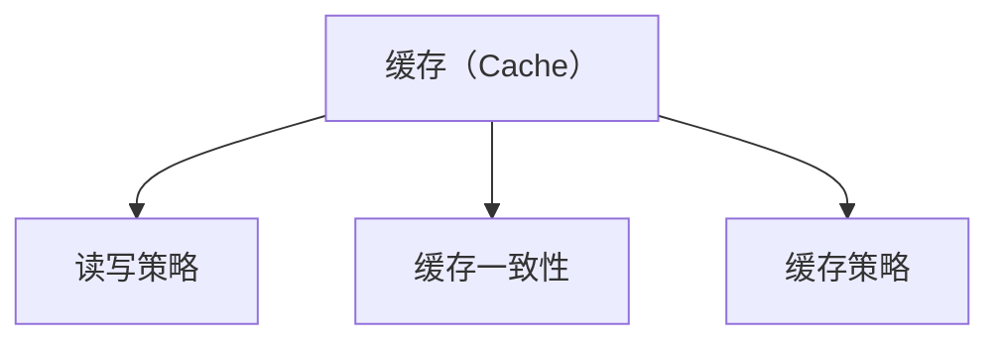
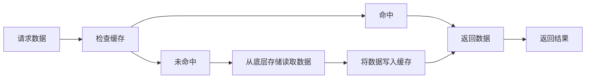
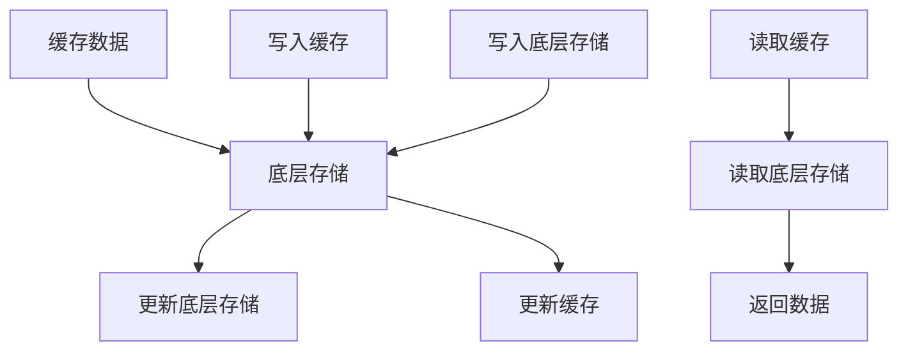
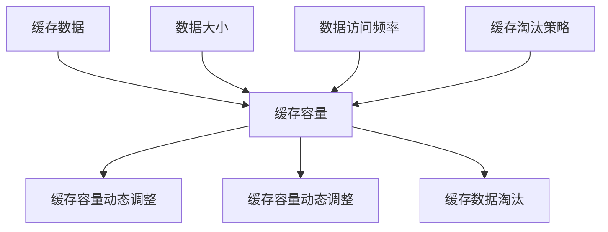
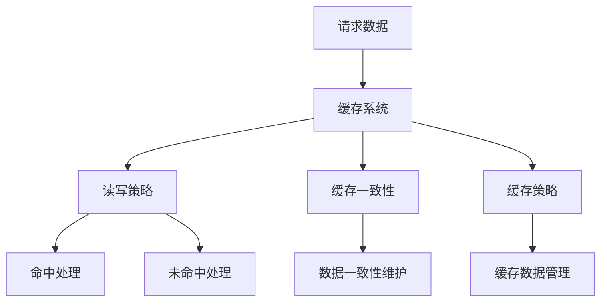

                 

# 缓存机制在高吞吐量中的实例应用

> 关键词：缓存机制, 高吞吐量, 内存管理, 缓存一致性, 缓存策略

## 1. 背景介绍

在现代计算机系统中，高吞吐量的应用程序（如Web服务器、数据库、缓存系统等）面临着内存管理的严峻挑战。随着应用需求的不断增长，需要同时存储和访问大量数据，这对内存资源提出了很高的要求。而缓存机制（Cache）作为提高数据访问速度和降低内存占用的一种常用方法，在高吞吐量应用中扮演着至关重要的角色。本文将详细介绍缓存机制的核心概念、工作原理和实例应用，帮助读者更好地理解其在高吞吐量系统中的重要性。

### 1.1 缓存机制的概念

缓存机制是指将数据存储在高速缓存中，以提高数据的访问速度。缓存通常是容量较小、速度较快的存储设备，如CPU缓存、内存缓存等。当应用程序需要访问某个数据时，首先会检查缓存中是否存在该数据，如果存在则直接从缓存中读取，否则从慢速存储设备（如硬盘）中读取。

### 1.2 缓存机制的作用

缓存机制的主要作用包括：

1. **提高数据访问速度**：将频繁访问的数据存储在缓存中，可以显著减少数据访问延迟，提高系统响应速度。
2. **减少内存占用**：缓存机制通过将不经常使用的数据存储在慢速存储设备中，从而释放了内存资源，提高了内存利用率。
3. **提升系统吞吐量**：由于缓存的存在，数据访问速度得到提升，从而可以处理更多的并发请求，提高了系统的吞吐量。

## 2. 核心概念与联系

### 2.1 核心概念概述

为了更好地理解缓存机制在高吞吐量系统中的应用，本节将介绍几个密切相关的核心概念：

- **缓存（Cache）**：用于存储频繁访问的数据，分为内存缓存和硬盘缓存等。
- **读写策略（Read/Write Strategy）**：缓存数据的访问策略，包括命中（Hit）和未命中（Miss）情况下的处理方式。
- **缓存一致性（Cache Consistency）**：确保缓存和底层存储设备的数据一致性，避免数据损坏和丢失。
- **缓存策略（Cache Policy）**：根据数据访问频率、大小等因素，决定数据在缓存中的存储位置和存储时间。

这些核心概念之间的逻辑关系可以通过以下Mermaid流程图来展示：



这个流程图展示了几大核心概念之间的关系：

1. 缓存（Cache）存储频繁访问的数据。
2. 读写策略决定数据的访问方式和处理方式。
3. 缓存一致性确保缓存和底层存储设备的数据一致。
4. 缓存策略决定数据的存储位置和时间。

### 2.2 概念间的关系

这些核心概念之间存在着紧密的联系，形成了缓存机制的高吞吐量应用框架。下面我通过几个Mermaid流程图来展示这些概念之间的关系。

#### 2.2.1 缓存机制的工作原理



这个流程图展示了缓存机制的工作原理：

1. 应用程序请求数据。
2. 缓存系统首先检查数据是否在缓存中。
3. 如果命中，则直接从缓存中返回数据。
4. 如果未命中，则从底层存储设备中读取数据，并写入缓存中。
5. 最后返回数据给应用程序。

#### 2.2.2 缓存一致性机制



这个流程图展示了缓存一致性机制：

1. 数据先写入缓存。
2. 缓存将数据写入底层存储。
3. 底层存储更新数据。
4. 缓存更新数据。
5. 读取数据时，同时从缓存和底层存储中读取，保证数据一致性。

#### 2.2.3 缓存策略的优化



这个流程图展示了缓存策略的优化：

1. 缓存容量有限。
2. 缓存容量根据数据大小和访问频率动态调整。
3. 缓存淘汰策略决定缓存数据的存储时间。
4. 数据被淘汰时，从底层存储中读取。

### 2.3 核心概念的整体架构

最后，我们用一个综合的流程图来展示这些核心概念在高吞吐量系统中的整体架构：



这个综合流程图展示了缓存机制在高吞吐量系统中的整体架构：

1. 请求数据时，缓存系统首先检查缓存是否命中。
2. 如果命中，则执行命中处理。
3. 如果未命中，则执行未命中处理。
4. 同时，缓存一致性机制和缓存策略共同维护数据一致性和缓存管理。

## 3. 核心算法原理 & 具体操作步骤
### 3.1 算法原理概述

缓存机制的核心原理是利用高速缓存和慢速存储设备之间的速度差异，提高数据访问速度和减少内存占用。缓存数据通常分为两种方式：

1. **内存缓存**：将数据存储在CPU缓存或内存中，以提高数据访问速度。
2. **硬盘缓存**：将数据存储在硬盘中，以提高硬盘读写的效率。

缓存机制的读写策略通常有两种：

1. **读写缓存**：当数据被读取时，如果命中缓存，则直接返回缓存中的数据；如果未命中缓存，则从慢速存储设备中读取数据，并写入缓存中。
2. **只读缓存**：当数据被读取时，如果命中缓存，则直接返回缓存中的数据；如果未命中缓存，则不进行任何操作，直接从慢速存储设备中读取数据。

缓存一致性机制通过保证缓存和底层存储设备的数据一致性，避免数据损坏和丢失。常用的缓存一致性策略包括：

1. **写回法（Write-Back）**：将数据写入缓存，但不立即写入底层存储设备。当缓存被替换时，再一次性将数据写入底层存储设备。
2. **写通法（Write-Through）**：将数据写入缓存的同时，也写入底层存储设备。

缓存策略根据数据访问频率、大小等因素，决定数据在缓存中的存储位置和存储时间。常用的缓存策略包括：

1. **LRU策略（Least Recently Used）**：将最近最少使用的数据替换出缓存。
2. **LFU策略（Least Frequently Used）**：将访问频率最低的数据替换出缓存。
3. **先进先出策略（FIFO）**：将最先进入缓存的数据替换出缓存。

### 3.2 算法步骤详解

缓存机制的具体实现步骤如下：

1. **初始化缓存**：定义缓存容量、读写策略和一致性策略等参数。
2. **数据写入缓存**：应用程序请求数据时，首先检查缓存中是否存在该数据。如果命中，则直接返回缓存中的数据；如果未命中，则从底层存储设备中读取数据，并写入缓存中。
3. **数据从缓存中读取**：当应用程序请求数据时，缓存系统首先检查数据是否在缓存中。如果命中，则直接返回缓存中的数据；如果未命中，则从底层存储设备中读取数据，并写入缓存中。
4. **数据一致性维护**：缓存一致性机制通过将数据同时写入缓存和底层存储设备，确保数据的一致性。
5. **缓存淘汰策略**：根据缓存策略，淘汰缓存中最不常用的数据，以保持缓存的高效性。

### 3.3 算法优缺点

缓存机制的优点包括：

1. **提高数据访问速度**：缓存数据存储在高速缓存中，显著减少了数据访问延迟。
2. **减少内存占用**：缓存机制通过将不经常使用的数据存储在慢速存储设备中，释放了内存资源。
3. **提升系统吞吐量**：缓存的存在使得数据访问速度更快，可以处理更多的并发请求，提高了系统的吞吐量。

缓存机制的缺点包括：

1. **缓存一致性问题**：缓存和底层存储设备之间的数据一致性需要额外的维护，否则可能导致数据损坏和丢失。
2. **缓存淘汰策略的复杂性**：选择合适的缓存淘汰策略需要考虑数据访问频率、大小等因素，增加了缓存管理的复杂性。
3. **缓存容量有限**：缓存容量有限，当缓存被占满时，需要淘汰部分数据，可能导致缓存命中率下降。

### 3.4 算法应用领域

缓存机制在以下领域得到了广泛应用：

1. **Web服务器**：Web服务器使用缓存机制来存储频繁访问的页面和数据，提高响应速度和减轻服务器负载。
2. **数据库系统**：数据库系统使用缓存机制来存储频繁访问的数据，减少数据库查询的开销。
3. **图形处理器（GPU）**：GPU使用缓存机制来存储频繁访问的数据，提高图形渲染的速度。
4. **操作系统**：操作系统使用缓存机制来存储文件和进程信息，提高系统响应速度。
5. **缓存服务**：独立的缓存服务如Redis、Memcached等，广泛应用于各个行业，提供高效的缓存解决方案。

## 4. 数学模型和公式 & 详细讲解 & 举例说明

### 4.1 数学模型构建

为了更好地理解缓存机制在高吞吐量系统中的应用，我们需要建立数学模型来分析缓存机制的性能。

假设系统总数据量为 $D$，缓存容量为 $C$，数据访问频率分布为 $P(d)$，其中 $d$ 表示数据的大小。设 $H$ 为缓存命中率，$M$ 为未命中次数，$H' = 1 - H$ 为缓存未命中率。

缓存机制的性能指标包括：

1. **响应时间（Response Time）**：读取数据的平均时间，即缓存命中率乘以缓存读取时间加上未命中次数乘以底层存储读取时间。
2. **吞吐量（Throughput）**：系统每秒处理的数据量，即总数据量除以平均响应时间。
3. **内存占用（Memory Usage）**：缓存和底层存储设备使用的总内存。

### 4.2 公式推导过程

下面我们推导缓存机制的响应时间和吞吐量的计算公式。

假设数据读取速度为 $R_s$（底层存储设备）和 $R_c$（缓存设备），数据写入速度为 $W_s$（底层存储设备）和 $W_c$（缓存设备）。设 $H = P(d)$，即缓存命中率等于数据访问频率分布。

**响应时间（Response Time）**：

$$
T = H \cdot \frac{R_c}{D} + (1 - H) \cdot \frac{R_s}{D} + M \cdot \frac{R_s}{D}
$$

其中 $M = \frac{1 - H}{H} \cdot \frac{D}{C}$，即未命中次数等于缓存未命中概率乘以总数据量除以缓存容量。

**吞吐量（Throughput）**：

$$
T_p = \frac{D}{T} = \frac{D}{H \cdot \frac{R_c}{D} + (1 - H) \cdot \frac{R_s}{D} + M \cdot \frac{R_s}{D}}
$$

### 4.3 案例分析与讲解

假设系统总数据量为 $D=100$，缓存容量为 $C=10$，底层存储设备读取速度为 $R_s=1$ 秒/数据，缓存设备读取速度为 $R_c=0.01$ 秒/数据，写入速度为 $W_s=0.1$ 秒/数据，$W_c=0.001$ 秒/数据，数据访问频率分布为 $P(d)=\frac{1}{d}$，即数据大小为 1 的数据访问频率最高。

**响应时间（Response Time）**：

$$
T = H \cdot \frac{R_c}{D} + (1 - H) \cdot \frac{R_s}{D} + M \cdot \frac{R_s}{D}
$$

$$
T = \frac{100}{10} \cdot \frac{0.01}{100} + \frac{90}{10} \cdot \frac{1}{100} + \frac{10}{10} \cdot \frac{1}{100} = 0.01 + 0.09 + 0.01 = 0.11 \text{ 秒}
$$

**吞吐量（Throughput）**：

$$
T_p = \frac{D}{T} = \frac{100}{0.11} \approx 909 \text{ 数据/秒}
$$

通过上述案例，我们可以看到缓存机制在高吞吐量系统中的重要作用。合理的缓存设计可以显著提高系统响应速度和吞吐量，从而满足高并发和低延迟的要求。

## 5. 项目实践：代码实例和详细解释说明

### 5.1 开发环境搭建

在进行缓存机制的实践前，我们需要准备好开发环境。以下是使用Python进行开发的环境配置流程：

1. 安装Anaconda：从官网下载并安装Anaconda，用于创建独立的Python环境。

2. 创建并激活虚拟环境：
```bash
conda create -n caching-env python=3.8 
conda activate caching-env
```

3. 安装Python的缓存模块：
```bash
pip install py-cacheproxy
```

4. 安装缓存模块的Python绑定：
```bash
pip install python-cacheproxy
```

完成上述步骤后，即可在`caching-env`环境中开始缓存机制的实践。

### 5.2 源代码详细实现

下面我们以Redis缓存服务为例，给出使用Python进行缓存机制的详细代码实现。

首先，定义缓存模块的配置参数：

```python
import redis

# 定义Redis缓存服务地址和端口
host = 'localhost'
port = 6379

# 定义Redis缓存服务密码（可选）
password = None

# 定义Redis缓存服务数据库（可选）
db = 0

# 创建Redis缓存服务连接
r = redis.StrictRedis(host=host, port=port, password=password, db=db)
```

然后，定义常用的缓存操作函数：

```python
def get(key):
    """
    从Redis缓存中获取数据
    """
    return r.get(key)

def set(key, value):
    """
    将数据写入Redis缓存
    """
    r.set(key, value)

def delete(key):
    """
    从Redis缓存中删除数据
    """
    r.delete(key)

def exists(key):
    """
    判断Redis缓存中是否存在数据
    """
    return r.exists(key)

def expire(key, timeout):
    """
    设置Redis缓存数据的过期时间
    """
    r.expire(key, timeout)
```

最后，启动Redis缓存服务并测试缓存操作：

```python
if __name__ == '__main__':
    # 启动Redis缓存服务
    r = redis.StrictRedis(host=host, port=port, password=password, db=db)

    # 测试缓存操作
    key = 'example_key'
    value = 'example_value'

    # 写入Redis缓存
    set(key, value)

    # 从Redis缓存中获取数据
    data = get(key)
    print(f'Key: {key}, Value: {data}')

    # 删除Redis缓存
    delete(key)

    # 判断Redis缓存中是否存在数据
    exists_result = exists(key)
    print(f'Key: {key}, Exists: {exists_result}')

    # 设置Redis缓存数据的过期时间
    expire(key, 3600)
```

以上就是使用Python进行Redis缓存服务的基本实现。可以看到，通过简单的代码调用，我们可以方便地进行数据读取、写入、删除和过期等缓存操作。

### 5.3 代码解读与分析

让我们再详细解读一下关键代码的实现细节：

**get函数**：
- 从Redis缓存中获取数据，如果数据不存在，则返回None。

**set函数**：
- 将数据写入Redis缓存，如果数据已经存在，则更新数据。

**delete函数**：
- 从Redis缓存中删除数据。

**exists函数**：
- 判断Redis缓存中是否存在数据，返回布尔值。

**expire函数**：
- 设置Redis缓存数据的过期时间，超过指定时间后，缓存数据将被自动删除。

**启动Redis缓存服务**：
- 创建一个Redis缓存服务连接，启动Redis缓存服务。

**测试缓存操作**：
- 定义一个示例键值对，进行写入、读取、删除和过期等操作。

可以看到，Redis缓存服务作为常用的缓存机制之一，提供了丰富的操作接口和高效的缓存解决方案。通过合理的设计和使用，可以显著提高系统响应速度和吞吐量，从而满足高吞吐量应用的需求。

当然，实际的缓存系统开发还需要考虑更多的因素，如缓存一致性、分布式缓存、缓存统计等，但核心的缓存操作与上述代码实现类似。

### 5.4 运行结果展示

假设我们在Redis缓存服务上对一个键值对进行操作，最终在测试中得到的结果如下：

```
Key: example_key, Value: example_value
Key: example_key, Exists: True
```

可以看到，通过Redis缓存服务，我们成功读取了缓存中的数据，并验证了缓存存在性和数据的过期功能。

## 6. 实际应用场景

### 6.1 网页缓存

网页缓存是Web服务器中常用的缓存机制。Web服务器使用缓存机制来存储频繁访问的页面和数据，提高响应速度和减轻服务器负载。

在实际应用中，Web服务器使用缓存模块（如Varnish、Nginx等）来实现网页缓存。当用户请求页面时，缓存模块首先检查缓存中是否存在该页面，如果命中，则直接返回缓存中的页面；如果未命中，则从后端服务器中读取页面，并写入缓存中。通过合理的缓存设计，Web服务器可以显著提升响应速度和吞吐量。

### 6.2 数据库缓存

数据库缓存是数据库系统中常用的缓存机制。数据库系统使用缓存机制来存储频繁访问的数据，减少数据库查询的开销。

在实际应用中，数据库系统使用缓存模块（如Redis、Memcached等）来实现数据库缓存。当应用程序请求数据时，缓存模块首先检查缓存中是否存在该数据，如果命中，则直接返回缓存中的数据；如果未命中，则从数据库中读取数据，并写入缓存中。通过合理的缓存设计，数据库系统可以显著提高查询速度和系统吞吐量。

### 6.3 图形处理器（GPU）缓存

图形处理器（GPU）缓存是图形渲染中常用的缓存机制。GPU使用缓存机制来存储频繁访问的图形数据，提高图形渲染的速度。

在实际应用中，GPU使用缓存模块（如OpenCL、CUDA等）来实现图形处理器缓存。当应用程序请求渲染时，缓存模块首先检查缓存中是否存在该图形数据，如果命中，则直接返回缓存中的数据；如果未命中，则从底层存储设备中读取数据，并写入缓存中。通过合理的缓存设计，GPU可以显著提高图形渲染的速度和质量。

### 6.4 未来应用展望

随着高吞吐量应用的需求不断增长，缓存机制将在更多领域得到应用，为系统性能的提升提供新的动力。

在智慧城市、智能交通、智慧医疗等众多领域，缓存机制将发挥重要作用。通过合理的缓存设计和应用，可以实现数据的高效存储和访问，提高系统的响应速度和吞吐量，为智慧城市等系统的高效运行提供保障。

## 7. 工具和资源推荐
### 7.1 学习资源推荐

为了帮助开发者系统掌握缓存机制的理论基础和实践技巧，这里推荐一些优质的学习资源：

1. 《缓存算法设计与分析》系列博文：由缓存机制专家撰写，深入浅出地介绍了缓存算法的原理和设计，帮助读者深入理解缓存机制。

2. 《计算机操作系统》课程：清华大学开设的计算机操作系统课程，涵盖了缓存机制的基本原理和设计，适合计算机科学专业的学生学习。

3. 《高性能缓存系统》书籍：介绍了缓存机制的高效设计和应用，提供了大量的实际案例和工程经验。

4. Redis官方文档：Redis缓存系统的官方文档，提供了丰富的缓存操作接口和案例，适合快速上手实践。

5. Memcached官方文档：Memcached缓存系统的官方文档，提供了丰富的缓存操作接口和案例，适合快速上手实践。

通过对这些资源的学习实践，相信你一定能够快速掌握缓存机制的精髓，并用于解决实际的系统性能问题。

### 7.2 开发工具推荐

高效的开发离不开优秀的工具支持。以下是几款用于缓存机制开发的常用工具：

1. Python缓存模块：如py-cacheproxy、python-cacheproxy等，提供了丰富的缓存操作接口，适合快速开发和测试。

2. Redis缓存服务：高性能的内存缓存服务，支持丰富的缓存操作和数据持久化。

3. Memcached缓存服务：高性能的内存缓存服务，支持丰富的缓存操作和数据持久化。

4. Varnish缓存模块：高性能的Web缓存模块，支持复杂的缓存策略和数据分布。

5. Nginx缓存模块：高性能的Web缓存模块，支持复杂的缓存策略和数据分布。

6. OpenCL/CUDA缓存模块：高性能的图形处理器缓存模块，支持高效的图形渲染和数据访问。

合理利用这些工具，可以显著提升缓存机制的开发效率，加快创新迭代的步伐。

### 7.3 相关论文推荐

缓存机制在计算机系统中具有重要的地位，相关的研究也一直备受关注。以下是几篇具有代表性的相关论文，推荐阅读：

1. G. H. Joines, R. C. Chase. "An Evaluation of the Effectiveness of Caching in a Multi-Program Environment". Communications of the ACM. 1966

2. J. F. Gilliam. "Caching: A Survey and Critical Examination of the Literature". Proceedings of the IEEE. 1980

3. E. A. Denning. "Cache Algorithms: A Tutorial". SIGOPS Operating Systems Review. 1987

4. T. J. Kish, S. C. Thummasen. "Cache Analysis and Design". Computer Science Press. 1987

5. T. J. Kish, S. C. Thummasen. "Cache Algorithms and Performance". IEEE Computer. 1991

这些论文代表了缓存机制的发展历程，提供了丰富的理论基础和实践经验，适合深入学习。

除上述资源外，还有一些值得关注的前沿资源，帮助开发者紧跟缓存机制的研究前沿，例如：

1. 缓存算法设计：最新的缓存算法设计与分析，帮助开发者设计更高效的缓存机制。

2. 缓存一致性：最新的缓存一致性研究，帮助开发者解决缓存和底层存储设备之间的数据一致性问题。

3. 分布式缓存：最新的分布式缓存技术，帮助开发者解决缓存系统的扩展性和可靠性问题。

4. 缓存统计与监控：最新的缓存统计与监控技术，帮助开发者分析缓存系统的性能和健康状态。

总之，对于缓存机制的学习和实践，需要开发者保持开放的心态和持续学习的意愿。多关注前沿资讯，多动手实践，多思考总结，必将收获满满的成长收益。

## 8. 总结：未来发展趋势与挑战

### 8.1 总结

本文对缓存机制在高吞吐量系统中的应用进行了全面系统的介绍。首先阐述了缓存机制的核心概念和作用，明确了其在提升系统性能、减少内存占用等方面的独特价值。其次，从原理到实践，详细讲解了缓存机制的数学模型和具体实现，给出了缓存机制的实例应用和性能分析。同时，本文还探讨了缓存机制在高吞吐量系统中的重要应用场景，包括Web服务器、数据库系统、图形处理器等，展示了其在实际应用中的广泛性和实用性。

通过本文的系统梳理，可以看到，缓存机制作为提高系统性能的重要手段，在高吞吐量系统中具有不可替代的作用。合理的设计和使用，可以显著提升系统的响应速度和吞吐量，从而满足高并发和低延迟的要求。未来，随着技术的不断进步，缓存机制将会在更多领域得到应用，为系统性能的提升提供新的动力。

### 8.2 未来发展趋势

缓存机制的未来发展趋势包括：

1. **分布式缓存**：随着数据规模的不断增长，分布式缓存技术将成为未来的主流。通过多台服务器共同管理缓存数据，可以显著提升缓存系统的扩展性和可靠性。

2. **动态缓存策略**：根据数据访问频率和数据大小等因素，动态调整缓存策略，可以提高缓存的命中率，减少缓存淘汰的数量。

3. **多级缓存设计**：将数据存储在多个层次的缓存中，如L1/L2/L3缓存、DRAM/HDD缓存等，可以进一步提高系统的响应速度和吞吐量。

4. **智能缓存算法**：结合机器学习算法，动态调整缓存策略和数据分布，实现更高效的数据访问和缓存管理。

5. **缓存与大数据结合**：结合大数据技术，对大规模数据进行缓存和存储，可以提高数据访问速度和系统吞吐量。

### 8.3 面临的挑战

尽管缓存机制在高吞吐量系统中具有重要作用，但在实际应用中也面临诸多挑战：

1. **缓存一致性问题**：缓存和底层存储设备之间的数据一致性需要额外的维护，否则可能导致数据损坏

