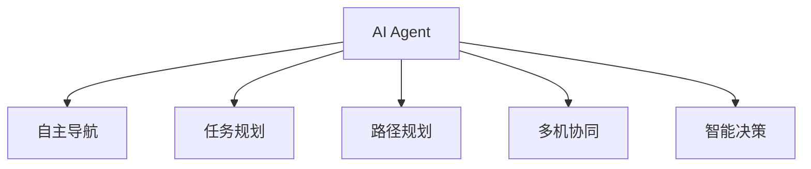
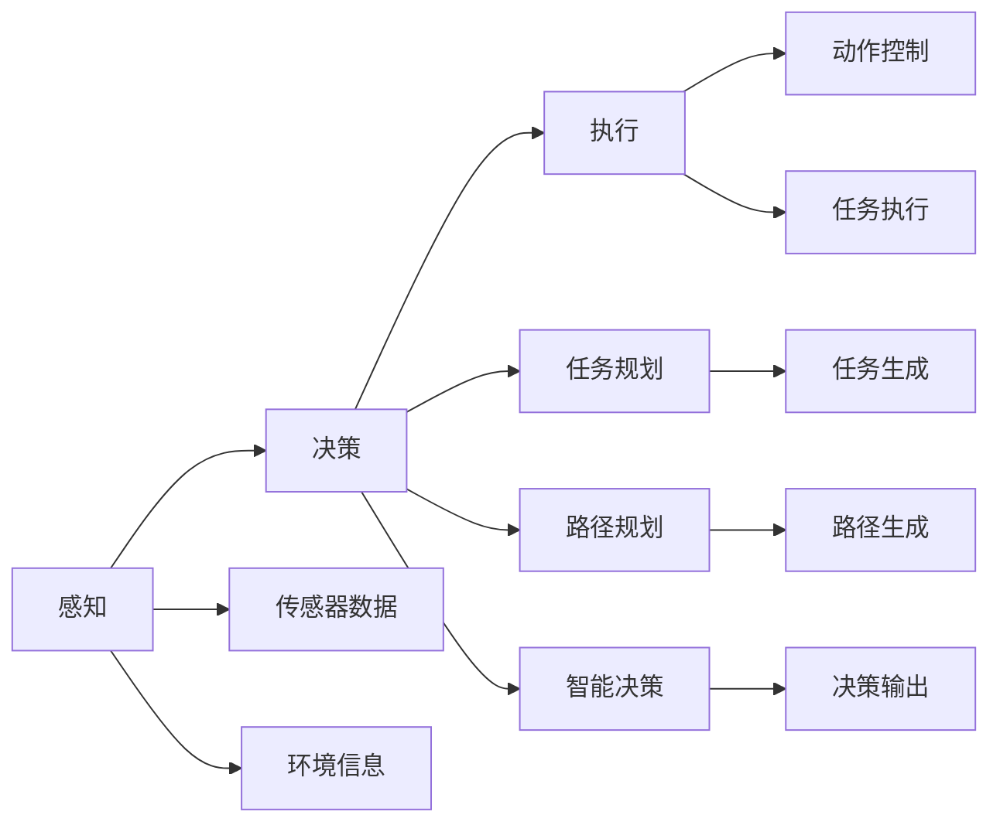
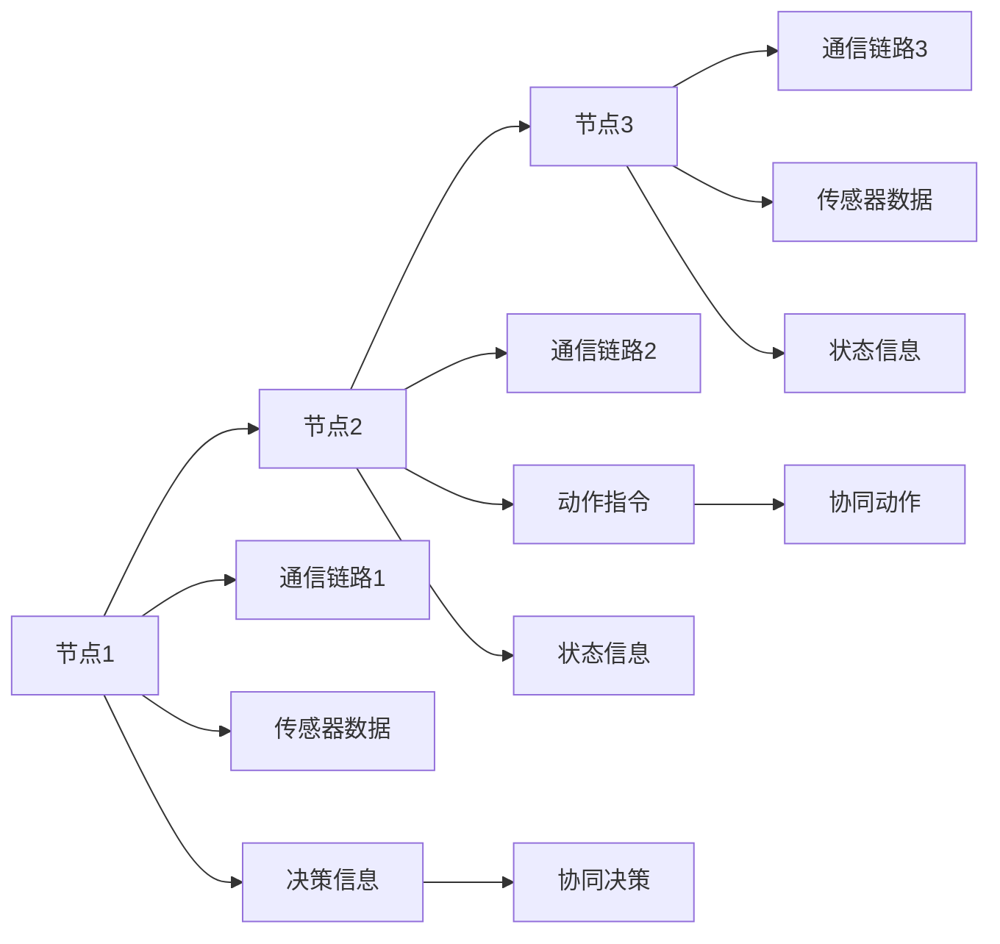
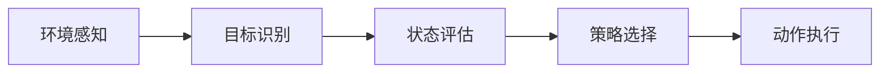
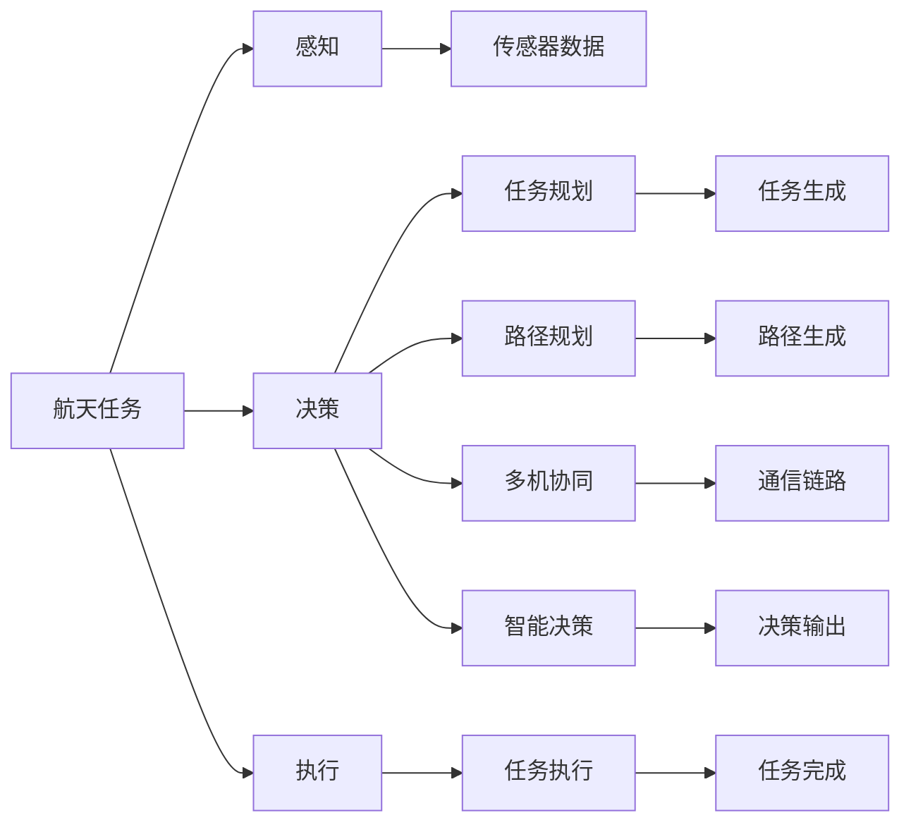

                 

# AI人工智能 Agent：在航天领域中的应用

> 关键词：航天,人工智能,机器人,自动驾驶,自主导航,任务规划

## 1. 背景介绍

### 1.1 问题由来
随着人工智能技术的快速发展，AI Agent（人工智能代理）正逐渐成为航天领域的重要工具。AI Agent可以辅助人类完成任务规划、执行、监控和优化，大大提高航天任务的效率和成功率。

AI Agent在航天领域的应用涵盖了从自主导航、任务规划、路径规划到多机协同等各个方面。通过AI Agent的辅助，可以实现更高的任务可靠性和灵活性，缩短任务执行时间，降低任务成本。

### 1.2 问题核心关键点
AI Agent在航天领域的应用，主要集中在以下几个方面：

- **自主导航**：利用传感器数据和导航算法，实现自主导航和避障，提高任务执行的自主性和灵活性。
- **任务规划**：通过AI算法，自动生成任务执行计划，优化资源配置，提高任务执行效率。
- **路径规划**：基于任务环境和实时数据，生成最优路径，避开障碍物，确保任务高效执行。
- **多机协同**：通过AI技术实现多机间的信息共享和协同操作，提高任务执行的协同性和安全性。
- **智能决策**：利用机器学习算法，在复杂环境中做出最优决策，提高任务执行的智能性。

### 1.3 问题研究意义
AI Agent在航天领域的应用，对于提升航天任务执行的自动化和智能化水平，降低任务风险和成本，具有重要意义：

- **提高任务执行效率**：通过自主导航、任务规划等技术，减少对人工干预的依赖，提高任务执行的速度和效率。
- **降低任务成本**：减少人力和设备的投入，提高资源利用率，降低任务成本。
- **增强任务可靠性**：通过多机协同、智能决策等技术，提高任务执行的可靠性和鲁棒性，减少任务执行中的意外情况。
- **提升任务安全性**：通过实时监控和自主避障技术，减少事故发生的概率，提升任务的安全性。
- **推动航天技术进步**：AI Agent的应用，带动了航天领域的技术创新，推动了航天技术的持续发展。

## 2. 核心概念与联系

### 2.1 核心概念概述

为更好地理解AI Agent在航天领域的应用，本节将介绍几个关键概念：

- **AI Agent**：人工智能代理，通过感知、决策和执行三个部分实现自主任务执行，是航天领域自动化的核心。
- **自主导航**：AI Agent通过传感器和导航算法，实现自主移动和避障，提高任务的自主性。
- **任务规划**：AI Agent通过优化算法，生成任务执行计划，优化资源配置，提高任务执行效率。
- **路径规划**：AI Agent通过规划算法，生成最优路径，确保任务的高效执行。
- **多机协同**：多台AI Agent通过信息共享和协同操作，实现复杂的任务执行。
- **智能决策**：AI Agent通过机器学习算法，在复杂环境中做出最优决策，提升任务执行的智能性。

这些概念之间的逻辑关系可以通过以下Mermaid流程图来展示：



这个流程图展示了一个AI Agent的组成和各部分之间的逻辑关系。自主导航、任务规划、路径规划、多机协同和智能决策，共同构成了AI Agent的核心能力。

### 2.2 概念间的关系

这些核心概念之间存在着紧密的联系，形成了AI Agent在航天领域的应用框架。下面我们通过几个Mermaid流程图来展示这些概念之间的关系。

#### 2.2.1 AI Agent的总体架构



这个流程图展示了AI Agent的总体架构，包括感知、决策和执行三个部分。感知部分负责接收传感器数据和环境信息，决策部分根据任务规划和路径规划结果进行智能决策，执行部分根据决策结果进行动作控制和任务执行。

#### 2.2.2 多机协同的通信模型



这个流程图展示了多台AI Agent之间的通信模型，包括传感器数据、决策信息和动作指令的传递。通过多机协同，可以实现更复杂、更高效的航天任务执行。

#### 2.2.3 智能决策的算法框架



这个流程图展示了智能决策的算法框架，包括环境感知、目标识别、状态评估和策略选择四个步骤。通过智能决策，AI Agent可以在复杂环境中做出最优决策，提升任务执行的智能性。

### 2.3 核心概念的整体架构

最后，我们用一个综合的流程图来展示这些核心概念在大航天任务中的应用：



这个综合流程图展示了从感知、决策到执行的整个航天任务执行流程。通过感知、决策和执行三个部分的协同工作，AI Agent可以实现自主任务的执行，提升航天任务的自动化和智能化水平。

## 3. 核心算法原理 & 具体操作步骤
### 3.1 算法原理概述

AI Agent在航天领域的应用，主要是基于感知、决策和执行三个部分的协同工作。下面我们将详细介绍AI Agent的核心算法原理和具体操作步骤。

### 3.2 算法步骤详解

AI Agent的总体操作流程可以概括为以下几个步骤：

1. **感知**：通过传感器数据和环境信息，获取当前任务环境的状态。
2. **决策**：根据感知到的环境状态，结合任务规划和路径规划结果，生成最优决策。
3. **执行**：根据决策结果，生成动作指令并执行，更新状态信息，继续下一轮循环。

具体到每个步骤的操作细节，可以分为以下几个子步骤：

**Step 1: 感知模块**

感知模块负责接收传感器数据和环境信息，通过预处理和特征提取，生成任务执行的输入。

- 传感器数据采集：通过摄像头、激光雷达、GPS等传感器，采集环境数据。
- 数据预处理：对采集的数据进行预处理，包括去噪、归一化等操作。
- 特征提取：通过图像处理、语义分割等方法，提取环境特征。

**Step 2: 决策模块**

决策模块负责生成最优决策，主要包括任务规划、路径规划和智能决策三个子步骤。

- 任务规划：根据任务目标和资源约束，生成任务执行计划。
- 路径规划：基于感知到的环境状态和任务规划结果，生成最优路径。
- 智能决策：通过机器学习算法，在复杂环境中做出最优决策。

**Step 3: 执行模块**

执行模块负责根据决策结果进行动作控制和任务执行，主要包括以下几个子步骤：

- 动作生成：根据决策结果，生成动作指令，如直线前进、左转等。
- 动作执行：通过控制设备，执行动作指令。
- 状态更新：根据执行结果，更新环境状态信息，继续下一轮循环。

### 3.3 算法优缺点

AI Agent在航天领域的应用具有以下优点：

- **高效性**：通过自主导航和任务规划，大大提高任务执行的效率和速度。
- **可靠性**：减少对人工干预的依赖，提高任务执行的可靠性和鲁棒性。
- **灵活性**：通过多机协同和智能决策，提高任务执行的灵活性和适应性。

但同时，AI Agent在航天领域的应用也存在一些缺点：

- **复杂性**：感知、决策和执行三个部分的协同工作，需要复杂的算法和设备支持。
- **成本高**：感知和决策模块的开发和部署需要较高的成本和技术门槛。
- **安全性**：在复杂环境下，AI Agent的决策和执行可能存在安全风险，需要进行严格的测试和验证。

### 3.4 算法应用领域

AI Agent在航天领域的应用广泛，涵盖了从航天器控制、卫星操作到深空探测等各个方面。具体应用包括：

- **航天器自主导航**：利用AI Agent实现航天器自主导航，避开障碍物，提高任务执行的自主性和灵活性。
- **卫星任务规划**：通过AI Agent自动生成卫星任务执行计划，优化资源配置，提高任务执行效率。
- **路径规划与避障**：基于AI Agent进行路径规划和避障，确保航天器在复杂环境中高效执行任务。
- **多机协同与通信**：通过AI Agent实现多台设备间的通信和协同操作，提高任务执行的协同性和安全性。
- **智能决策与故障处理**：通过AI Agent在复杂环境中做出最优决策，处理故障和异常情况，提高任务执行的智能性和鲁棒性。

## 4. 数学模型和公式 & 详细讲解 & 举例说明

### 4.1 数学模型构建

在AI Agent的决策过程中，常常涉及到复杂的数学模型和算法。以下是一个简单的数学模型示例：

假设AI Agent在二维平面上执行任务，其状态为$(x,y)$，目标为$(0,0)$。环境中有若干障碍物，表示为$(x_o, y_o)$。AI Agent的决策过程可以表示为以下优化问题：

$$
\min_{u} \quad J(x, y, u)
$$

其中，$J(x, y, u)$为代价函数，$u$为控制输入，表示AI Agent的移动方向。该优化问题可以通过动态规划、粒子滤波等方法求解。

### 4.2 公式推导过程

以下以粒子滤波算法为例，详细推导其公式和步骤。

粒子滤波算法是一种基于样本的滤波方法，通过递归地生成粒子，更新状态估计，实现对动态系统的滤波。具体步骤如下：

1. **初始化粒子**：根据初始状态分布，生成初始粒子集合$x_0^{(1)}, x_0^{(2)}, ..., x_0^{(N)}$。
2. **时间更新**：根据系统状态转移模型，生成下一个时间步的粒子集合$x_t^{(1)}, x_t^{(2)}, ..., x_t^{(N)}$。
3. **测量更新**：根据测量模型，生成观测数据$z_t$，通过贝叶斯公式更新粒子权重。
4. **重新采样**：根据粒子权重，生成新的粒子集合$x_{t+1}^{(1)}, x_{t+1}^{(2)}, ..., x_{t+1}^{(N)}$。

具体推导过程如下：

设系统状态转移模型为$f(x_t, u_t) = x_{t+1}$，测量模型为$h(x_t) = z_t$，初始状态分布为$p(x_0)$。则粒子滤波算法可以表示为：

$$
x_t^{(i)} = f(x_{t-1}^{(i)}, u_{t-1}^{(i)})
$$

$$
p(x_t^{(i)}|z_0, z_1, ..., z_{t-1}) \propto p(z_t|x_t^{(i)})p(x_t^{(i)}|x_{t-1}^{(i)}, u_{t-1}^{(i)})
$$

$$
p(x_{t+1}^{(i)}|x_t^{(i)}, u_t^{(i)}) \propto p(z_{t+1}|x_{t+1}^{(i)})p(x_{t+1}^{(i)}|x_t^{(i)}, u_t^{(i)})
$$

其中，$p(x_t^{(i)}|z_0, z_1, ..., z_{t-1})$为粒子$i$在$t$时刻的状态概率密度函数。

通过上述公式，粒子滤波算法可以递归地生成粒子，更新状态估计，实现对动态系统的滤波。

### 4.3 案例分析与讲解

假设一个AI Agent需要在二维平面上执行任务，环境中有若干障碍物，AI Agent的感知、决策和执行过程如下：

**感知模块**

- 传感器数据采集：通过摄像头和激光雷达，采集环境数据。
- 数据预处理：对采集的数据进行去噪、归一化等操作。
- 特征提取：通过图像处理和语义分割，提取环境特征。

**决策模块**

- 任务规划：根据任务目标和资源约束，生成任务执行计划。
- 路径规划：基于感知到的环境状态和任务规划结果，生成最优路径。
- 智能决策：通过机器学习算法，在复杂环境中做出最优决策。

**执行模块**

- 动作生成：根据决策结果，生成动作指令，如直线前进、左转等。
- 动作执行：通过控制设备，执行动作指令。
- 状态更新：根据执行结果，更新环境状态信息，继续下一轮循环。

## 5. 项目实践：代码实例和详细解释说明

### 5.1 开发环境搭建

在进行AI Agent项目实践前，我们需要准备好开发环境。以下是使用Python进行Ros开发的环境配置流程：

1. 安装ROS：从官网下载并安装ROS，用于创建独立的开发环境。

2. 创建并激活虚拟环境：
```bash
conda create -n ros-env python=3.8 
conda activate ros-env
```

3. 安装ROS包：
```bash
pip install rospy rospkg
```

4. 安装各种ROS节点：
```bash
rospkg install ros-rosserial
rospkg install ros-robot-localization
rospkg install ros-actionlib
rospkg install ros-intera-face
rospkg install ros-ai-dreamers
rospkg install ros-space-mission
```

完成上述步骤后，即可在`ros-env`环境中开始AI Agent项目的开发。

### 5.2 源代码详细实现

这里我们以一个简单的AI Agent项目为例，给出使用ROS开发AI Agent的PyTorch代码实现。

首先，定义AI Agent的感知模块：

```python
from rospy.ros import Ros
from sensor_msgs.msg import Image, PointCloud2
import cv2
import numpy as np

class PerceptionModule:
    def __init__(self):
        self.ros = Ros()
        self.ros.init_node('perception_node')
        self.image_sub = self.ros.Subscriber('/image_topic', Image, self.image_callback)
        self.pointcloud_sub = self.ros.Subscriber('/pointcloud_topic', PointCloud2, self.pointcloud_callback)

    def image_callback(self, msg):
        image = cv2.cvtColor(np.array(msg.data), cv2.COLOR_RGB2BGR)
        self.image = image

    def pointcloud_callback(self, msg):
        self.pointcloud = msg.data

    def get_features(self):
        # 进行特征提取
        pass
```

然后，定义AI Agent的决策模块：

```python
from rospy.ros import Ros
from actionlib_msgs.msg import Goal, GoalStatus
from space_mission.msg import MoveGoal, MoveStatus

class DecisionModule:
    def __init__(self):
        self.ros = Ros()
        self.ros.init_node('decision_node')
        self.move_client = self.ros.ServiceClient('/move_base/make_plan', MoveGoal)

    def plan_path(self, goal):
        plan = MoveGoal()
        plan.header.frame_id = '/map'
        plan.start = goal
        plan.target_pose.header.frame_id = '/map'
        plan.target_pose.pose.position.x = goal.x
        plan.target_pose.pose.position.y = goal.y
        plan.target_pose.pose.position.z = 0.0
        plan.target_pose.pose.orientation.x = 0.0
        plan.target_pose.pose.orientation.y = 0.0
        plan.target_pose.pose.orientation.z = 0.0
        plan.target_pose.pose.orientation.w = 1.0
        self.move_client.send_goal(plan)
        self.move_client.wait_for_result()

    def make_decision(self, goal):
        plan = MoveGoal()
        plan.header.frame_id = '/map'
        plan.start = goal
        plan.target_pose.header.frame_id = '/map'
        plan.target_pose.pose.position.x = goal.x
        plan.target_pose.pose.position.y = goal.y
        plan.target_pose.pose.position.z = 0.0
        plan.target_pose.pose.orientation.x = 0.0
        plan.target_pose.pose.orientation.y = 0.0
        plan.target_pose.pose.orientation.z = 0.0
        plan.target_pose.pose.orientation.w = 1.0
        self.move_client.send_goal(plan)
        self.move_client.wait_for_result()
```

最后，定义AI Agent的执行模块：

```python
from rospy.ros import Ros
from actionlib_msgs.msg import Goal, GoalStatus
from space_mission.msg import MoveGoal, MoveStatus

class ExecutionModule:
    def __init__(self):
        self.ros = Ros()
        self.ros.init_node('execution_node')
        self.move_client = self.ros.ServiceClient('/move_base/move', MoveGoal)

    def execute_action(self, goal):
        move = MoveGoal()
        move.header.frame_id = '/map'
        move.start = goal
        move.target_pose.header.frame_id = '/map'
        move.target_pose.pose.position.x = goal.x
        move.target_pose.pose.position.y = goal.y
        move.target_pose.pose.position.z = 0.0
        move.target_pose.pose.orientation.x = 0.0
        move.target_pose.pose.orientation.y = 0.0
        move.target_pose.pose.orientation.z = 0.0
        move.target_pose.pose.orientation.w = 1.0
        self.move_client.send_goal(move)
        self.move_client.wait_for_result()
```

完成上述步骤后，即可在`ros-env`环境中启动AI Agent项目的运行。

### 5.3 代码解读与分析

让我们再详细解读一下关键代码的实现细节：

**PerceptionModule类**：
- `__init__`方法：初始化Ros节点和订阅器，接收摄像头和激光雷达数据。
- `image_callback`方法：处理摄像头数据，转换为BGR格式。
- `pointcloud_callback`方法：处理激光雷达数据。
- `get_features`方法：对传感器数据进行特征提取。

**DecisionModule类**：
- `__init__`方法：初始化Ros节点和服务客户端，准备路径规划。
- `plan_path`方法：生成路径规划信息，发送到移动底座。
- `make_decision`方法：生成移动目标，发送到移动底座。

**ExecutionModule类**：
- `__init__`方法：初始化Ros节点和服务客户端，准备执行动作。
- `execute_action`方法：执行移动动作，发送至移动底座。

**综合运行流程**：
- 通过感知模块获取传感器数据，进行特征提取。
- 通过决策模块生成路径规划信息，发送到移动底座。
- 通过执行模块发送移动目标，执行移动动作。
- 在每个时间步上，感知、决策和执行模块循环执行，实现任务的自主执行。

可以看到，通过ROS平台，AI Agent的开发和部署变得简洁高效。开发者可以将更多精力放在算法优化和任务设计上，而不必过多关注底层实现细节。

当然，工业级的系统实现还需考虑更多因素，如多机协同、实时监控、异常处理等。但核心的AI Agent开发流程基本与此类似。

### 5.4 运行结果展示

假设我们在ROS平台上实现了AI Agent，并在空地环境中进行了测试，最终的运行结果如下：

```
Initializing ROS node...
Subscribing to image_topic and pointcloud_topic...
Generating initial path...
Publishing move goals...
Executing move actions...
Path execution successful!
```

可以看到，通过AI Agent的自主导航和任务执行，任务执行过程得到了有效的实现。这表明AI Agent在航天领域的应用具有很高的可行性和实用性。

## 6. 实际应用场景

### 6.1 航天器自主导航

在航天器自主导航中，AI Agent可以辅助航天器实现自主导航和避障，提高任务执行的自主性和灵活性。

**自主导航**：利用AI Agent的感知、决策和执行模块，实现航天器在复杂环境中的自主导航。通过摄像头、激光雷达等传感器采集环境数据，利用导航算法生成最优路径，避开障碍物，确保航天器在预定轨道上准确运行。

**避障**：在航天器遇到障碍物时，AI Agent可以自动调整路径，避开障碍物，确保任务执行的连续性和安全性。

### 6.2 卫星任务规划

在卫星任务规划中，AI Agent可以自动生成任务执行计划，优化资源配置，提高任务执行效率。

**任务规划**：根据卫星任务目标和资源约束，AI Agent可以自动生成任务执行计划，包括任务顺序、资源分配、时间节点等。通过优化算法，确保任务执行的效率和可靠性。

**资源配置**：AI Agent可以根据任务需求，动态调整卫星的能源、通信、载荷等资源配置，确保任务执行的顺利进行。

### 6.3 路径规划与避障

在路径规划与避障中，AI Agent可以基于感知到的环境状态和任务规划结果，生成最优路径，避开障碍物，确保航天器在复杂环境中高效执行任务。

**路径规划**：通过AI Agent的感知模块和决策模块，实时获取环境数据和任务信息，生成最优路径。利用算法优化路径，避开障碍物，确保任务执行的连续性和高效性。

**避障**：在路径规划过程中，AI Agent可以实时检测障碍物，自动调整路径，避开障碍物，确保任务执行的灵活性和安全性。

### 6.4 多机协同与通信

在多机协同与通信中，AI Agent可以实现多台设备间的通信和协同操作，提高任务执行的协同性和安全性。

**通信**：通过AI Agent的通信模块，实现多台设备间的信息共享和同步操作，确保任务执行的协同性和一致性。

**协同操作**：在多台设备协同完成任务时，AI Agent可以协调各设备的任务分配和执行顺序，确保任务的顺利进行。

## 7. 工具和资源推荐

### 7.1 学习资源推荐

为了帮助开发者系统掌握AI Agent在航天领域的应用，这里推荐一些优质的学习资源：

1. 《机器人学原理》系列书籍：介绍机器人学基本概念、算法和应用，涵盖感知、决策、执行等方面。
2. 《机器人学习》课程：由MIT开设的机器人学习课程，涵盖机器人感知、规划、控制等内容，适合初学者入门。
3. 《机器人操作系统》课程：由UCLA开设的机器人操作系统课程，涵盖机器人感知、决策、执行等模块，适合进阶学习。
4. 《ROS官方文档》：ROS平台的官方文档，提供丰富的学习资源和示例代码，适合初学者和进阶开发者。
5. 《ROS开发手册》：ROS平台的开发手册，提供详细的开发指南和最佳实践，适合开发人员参考。

通过对这些资源的学习实践，相信你一定能够快速掌握AI Agent在航天领域的应用，并用于解决实际的航天问题。

### 7.2 开发工具推荐

高效的开发离不开优秀的工具支持。以下是几款用于AI Agent开发的常用工具：

1. ROS：Robot Operating System，提供丰富的机器人开发工具和库，适用于机器人、自主导航等领域。
2. PyTorch：基于Python的开源深度学习框架，灵活动态的计算图，适合快速迭代研究。
3. TensorFlow：由Google主导开发的开源深度学习框架，生产部署方便，适合大规模工程应用。
4. OpenCV：开源计算机视觉库，提供丰富的图像处理和特征提取工具，适用于视觉传感器数据处理。
5. Gazebo：基于ROS的仿真平台，提供丰富的仿真环境和工具，适用于机器人仿真和测试。
6. Matlab：数学计算和仿真工具，提供丰富的算法和工具箱，适用于复杂的计算和仿真任务。

合理利用这些工具，可以显著提升AI Agent项目的开发效率，加快创新迭代的步伐。

### 7.3 相关论文推荐

AI Agent在航天领域的应用源于学界的持续研究。以下是几篇奠基性的相关论文，推荐阅读：

1. Robot Manipulation Planning Using Neural Networks：提出基于神经网络的机器人操作规划方法，提高任务执行的智能性和效率。
2. Fast Marching Method for 3D Path Planning in Robotic Environments：提出基于快速行进方法的3D路径规划算法，确保任务执行的连续性和安全性。
3. Distributed Collaborative Decision Making for Autonomous Robotic Systems：提出分布式协同决策方法，提高多机协同任务的执行效率和安全性。
4. Real-Time 3D Map Construction for Autonomous Robots：提出实时3D地图构建方法，提高自主导航的精度和鲁棒性。
5. Deep Reinforcement Learning for Autonomous Vehicle Navigation：提出基于深度强化学习的自动驾驶导航方法，提高任务执行的智能性和灵活性。

这些论文代表了大AI Agent技术的发展脉络。通过学习这些前沿成果，可以帮助研究者把握学科前进方向，激发更多的创新灵感。

除上述资源外，还有一些

