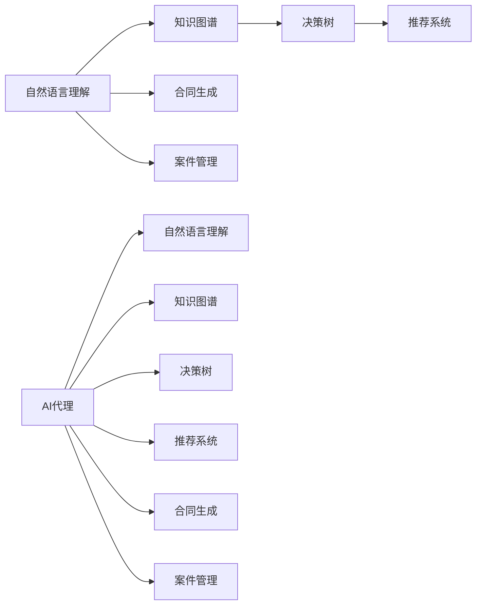
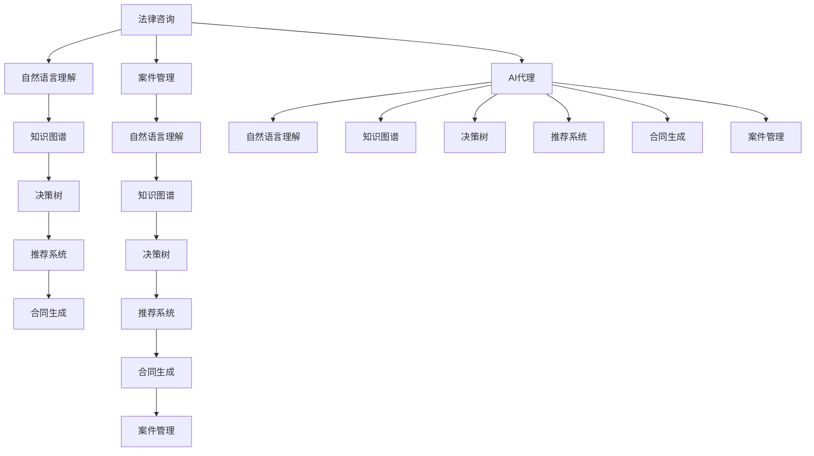

                 

# AI人工智能代理工作流 AI Agent WorkFlow：在法律服务中的应用

> 关键词：AI Agent, 法律服务, 自然语言处理, 智能代理, 自动化流程, 决策支持

## 1. 背景介绍

### 1.1 问题由来
随着人工智能技术的快速发展，AI在各行各业的应用已经变得愈发普遍。在法律服务领域，传统的法律工作流程存在效率低下、成本高昂、人力资源短缺等诸多问题。面对爆炸式增长的法律需求，法律服务机构迫切需要一种高效、智能的解决方案来提升服务质量和效率。

人工智能代理工作流（AI Agent Workflow）应运而生。它通过将自然语言处理（Natural Language Processing, NLP）、机器学习（Machine Learning, ML）、知识图谱（Knowledge Graph,KG）等技术深度融合，构建了一个能够自动处理法律咨询、合同审核、案件管理等业务的智能代理系统。这种系统不仅能够大幅度提升法律服务的效率和质量，还能够降低成本、减少错误率，从而为法律服务行业带来革命性的变化。

### 1.2 问题核心关键点
AI代理工作流系统主要由以下几个核心组件构成：

1. **自然语言理解模块**：负责解析用户输入的自然语言文本，提取其中包含的法律信息，如案件类型、当事人信息、诉请内容等。
2. **知识图谱模块**：构建和维护法律领域的知识图谱，存储各类法律规则、判决案例等信息。
3. **决策树模块**：根据用户输入和知识图谱中的信息，构建决策树，提供最优的解决方案。
4. **推荐模块**：结合用户偏好和法律信息，推荐合适的律师、专家等资源。
5. **合同生成模块**：自动生成标准化的法律合同文本，降低合同审核的难度和错误率。
6. **案件管理模块**：自动化管理案件进度、提醒时间节点，提高案件管理的效率。

这些组件通过数据驱动的方式，形成了一个高效、智能的代理工作流，大大提升了法律服务的效率和质量。

### 1.3 问题研究意义
研究AI代理工作流在法律服务中的应用，对于法律行业的发展具有重要意义：

1. **提升服务效率**：AI代理工作流能够自动处理大量的法律咨询和案件管理任务，显著提升法律服务的处理速度。
2. **降低成本**：通过自动化流程和智能推荐，减少了对人工资源的需求，降低了法律服务的运营成本。
3. **提高服务质量**：AI代理工作流能够提供更精准、更全面的法律解决方案，提高服务质量，减少错误率。
4. **增强用户体验**：用户可以通过语音、文字等多种方式与AI代理互动，获得更便捷、更高效的服务体验。
5. **支持决策支持**：AI代理工作流提供的决策树和知识图谱，有助于律师和专家进行决策分析和案件预判，提升法律服务的专业性和可靠性。

## 2. 核心概念与联系

### 2.1 核心概念概述

为了更好地理解AI代理工作流在法律服务中的应用，本节将介绍几个关键概念及其之间的联系：

1. **人工智能代理（AI Agent）**：指能够理解自然语言、执行决策、提供推荐和自动化流程的智能系统。AI代理通常由多个模块组成，协同工作以完成特定任务。

2. **自然语言处理（NLP）**：指使计算机能够理解、处理和生成人类自然语言的技术。NLP技术在AI代理中用于解析用户输入、生成自然语言回复等。

3. **知识图谱（KG）**：指通过语义网技术构建的、用于存储和查询知识的信息模型。在法律服务中，知识图谱用于存储各类法律规则、案例判决等信息。

4. **决策树（Decision Tree）**：指根据已知条件，通过一系列判断，逐步推理出最优解决方案的树形结构。决策树在AI代理中用于指导决策过程，提供解决方案。

5. **推荐系统（Recommendation System）**：指根据用户行为和偏好，推荐相关产品、服务或内容的系统。在AI代理中，推荐系统用于推荐合适的律师、专家等资源。

6. **合同生成（Contract Generation）**：指根据用户的法律需求，自动生成标准化的合同文本。在AI代理中，合同生成模块用于提高合同审核的效率和准确性。

7. **案件管理（Case Management）**：指自动化管理案件进度、提醒时间节点等任务。在AI代理中，案件管理模块用于提升案件管理的效率。

### 2.2 概念间的关系

这些关键概念之间的关系可以通过以下Mermaid流程图来展示：



这个流程图展示了AI代理工作流的主要组成部分及其相互关系：

1. 自然语言理解模块接收用户输入，解析提取法律信息。
2. 知识图谱模块提供法律规则、案例等信息。
3. 决策树模块根据用户输入和知识图谱信息，构建决策树，提供最优解决方案。
4. 推荐系统模块结合用户偏好和法律信息，推荐合适的律师、专家等资源。
5. 合同生成模块自动生成合同文本。
6. 案件管理模块自动化管理案件进度。
7. AI代理将上述模块融合，形成完整的代理工作流，为用户提供智能化的法律服务。

### 2.3 核心概念的整体架构

最后，我们用一个综合的流程图来展示这些核心概念在大语言模型微调过程中的整体架构：



这个综合流程图展示了从法律咨询到案件管理的完整过程，以及AI代理工作流的各个组件如何协同工作，共同为用户提供智能化的法律服务。

## 3. 核心算法原理 & 具体操作步骤
### 3.1 算法原理概述

AI代理工作流的核心算法原理是基于自然语言处理（NLP）和机器学习（ML）技术的智能决策流程。其基本流程如下：

1. **自然语言理解（NLU）**：将用户输入的自然语言文本转换为机器可理解的形式，提取其中的法律信息，如案件类型、当事人信息、诉请内容等。
2. **知识图谱查询（KGQ）**：根据用户输入的法律信息，从知识图谱中查询相关的法律规则、案例判决等。
3. **决策树推理（DTR）**：结合用户输入和知识图谱中的信息，构建决策树，推理出最优解决方案。
4. **推荐系统推荐（RSR）**：根据用户偏好和法律信息，推荐合适的律师、专家等资源。
5. **合同生成（CG）**：根据用户的法律需求，自动生成标准化的合同文本。
6. **案件管理（CM）**：自动化管理案件进度、提醒时间节点等任务。

### 3.2 算法步骤详解

以下将详细介绍AI代理工作流的主要步骤：

**Step 1: 准备数据集和知识图谱**

1. **数据集准备**：收集并清洗大量的法律咨询、合同、案例等数据，构建训练集、验证集和测试集。这些数据需要标注详尽的法律信息，如案件类型、当事人信息、诉请内容等。
2. **知识图谱构建**：根据法律领域的知识，构建和维护知识图谱，存储各类法律规则、判决案例等信息。知识图谱需要支持语义查询和推理，以便在代理工作中进行高效的信息检索。

**Step 2: 构建AI代理工作流**

1. **自然语言理解模块（NLU）**：使用NLP技术解析用户输入的自然语言文本，提取其中的法律信息。NLU模块需要具备实体识别、关系抽取、意图识别等能力，能够理解用户输入的语义。
2. **知识图谱查询模块（KGQ）**：根据用户输入的法律信息，从知识图谱中查询相关的法律规则、案例判决等信息。KGQ模块需要支持复杂的语义查询和推理，能够高效检索知识图谱中的信息。
3. **决策树推理模块（DTR）**：结合用户输入和知识图谱中的信息，构建决策树，推理出最优解决方案。DTR模块需要具备高效的推理算法，能够快速得出正确的结论。
4. **推荐系统推荐模块（RSR）**：根据用户偏好和法律信息，推荐合适的律师、专家等资源。RSR模块需要具备协同过滤、基于内容的推荐等技术，能够精准推荐资源。
5. **合同生成模块（CG）**：根据用户的法律需求，自动生成标准化的合同文本。CG模块需要具备自然语言生成技术，能够生成符合法律要求的合同文本。
6. **案件管理模块（CM）**：自动化管理案件进度、提醒时间节点等任务。CM模块需要具备任务调度、提醒系统等技术，能够高效管理案件。

**Step 3: 训练和优化**

1. **模型训练**：使用深度学习技术训练各个模块，提升其处理能力和准确性。训练过程中需要根据不同的任务和数据集，调整模型的超参数，如学习率、批量大小、迭代次数等。
2. **模型优化**：在模型训练完成后，进行模型优化，提升其推理速度和资源利用效率。优化过程中可以使用模型剪枝、量化等技术，减小模型尺寸，提高推理速度。

**Step 4: 部署和评估**

1. **系统部署**：将训练好的模型和知识图谱部署到生产环境中，形成可用的AI代理工作流系统。系统需要支持高并发、高可用性，能够快速响应用户请求。
2. **系统评估**：对部署后的AI代理工作流系统进行评估，测试其处理速度、准确性、稳定性等指标。评估过程中需要收集用户的反馈，不断优化系统性能。

### 3.3 算法优缺点

AI代理工作流的主要优点包括：

1. **高效处理**：通过自动化流程和智能推荐，显著提升法律服务的处理速度和效率。
2. **降低成本**：减少对人工资源的需求，降低法律服务的运营成本。
3. **提高质量**：提供更精准、更全面的法律解决方案，提高服务质量，减少错误率。
4. **用户体验好**：用户可以通过语音、文字等多种方式与AI代理互动，获得更便捷、更高效的服务体验。

其主要缺点包括：

1. **依赖数据**：系统需要大量的标注数据和高质量的知识图谱，构建和维护成本较高。
2. **模型复杂**：涉及多个模块和算法，模型结构复杂，开发和维护难度较大。
3. **可解释性不足**：AI代理工作流中的各个模块和决策过程较难解释，难以理解其内部工作机制。

### 3.4 算法应用领域

AI代理工作流在法律服务中的应用非常广泛，可以涵盖以下几个领域：

1. **法律咨询**：自动处理用户的法律咨询请求，提供相关法律信息和解决方案。
2. **合同审核**：自动审核合同文本，检查其合法性、完备性等，减少审核难度和错误率。
3. **案件管理**：自动化管理案件进度、提醒时间节点等任务，提高案件管理的效率。
4. **法律研究**：通过分析法律咨询数据和案例判决，生成法律报告和分析，支持法律研究工作。
5. **知识管理**：构建和维护法律领域的知识图谱，存储各类法律规则、案例判决等信息，支持知识管理。

## 4. 数学模型和公式 & 详细讲解 & 举例说明

### 4.1 数学模型构建

AI代理工作流中的数学模型主要基于自然语言处理（NLP）和机器学习（ML）技术。下面以自然语言理解（NLU）模块为例，介绍其数学模型构建。

假设用户输入的自然语言文本为 $x$，其中包含 $n$ 个词语。设词语的嵌入向量为 $E_x \in \mathbb{R}^{d_x}$，其中 $d_x$ 为词向量维度。则自然语言理解的数学模型可以表示为：

$$
y = \text{NLU}(x) = \text{Softmax}(W_f \cdot E_x + b_f)
$$

其中 $W_f \in \mathbb{R}^{n \times d_x}$ 为词语嵌入到特征空间的映射矩阵，$b_f \in \mathbb{R}^{n}$ 为偏置向量，$\text{Softmax}$ 函数用于将输出转换为概率分布，表示每个词语对应的标签概率。

### 4.2 公式推导过程

以自然语言理解模块为例，其公式推导过程如下：

1. **输入预处理**：将用户输入的自然语言文本 $x$ 转换为词语序列，并计算每个词语的嵌入向量 $E_x \in \mathbb{R}^{n \times d_x}$。
2. **特征映射**：将词语嵌入向量 $E_x$ 映射到特征空间，得到特征向量 $F_x \in \mathbb{R}^{d_x}$。
3. **线性变换**：对特征向量 $F_x$ 进行线性变换，得到新的特征向量 $H_x \in \mathbb{R}^{d_h}$，其中 $d_h$ 为隐藏层维度。
4. **Softmax变换**：对新的特征向量 $H_x$ 进行Softmax变换，得到词语的分类概率分布。
5. **损失函数**：计算分类错误的概率，并采用交叉熵损失函数进行优化。

假设真实标签为 $y \in \{1, 2, \ldots, k\}$，其中 $k$ 为标签种类。则交叉熵损失函数可以表示为：

$$
\mathcal{L}(y, \hat{y}) = -\frac{1}{N} \sum_{i=1}^N \sum_{j=1}^k y_{ij} \log \hat{y}_{ij}
$$

其中 $y_{ij}$ 为第 $i$ 个样本的第 $j$ 个标签，$\hat{y}_{ij}$ 为模型预测的第 $i$ 个样本的第 $j$ 个标签概率。

### 4.3 案例分析与讲解

以合同生成模块为例，其数学模型构建和公式推导过程如下：

假设用户输入的法律需求为 $D$，其中包含合同类型、条款要求、乙方信息等。设合同模板库中的合同模板为 $T = \{t_1, t_2, \ldots, t_m\}$，其中 $m$ 为合同模板数量。则合同生成的数学模型可以表示为：

$$
C = \text{CG}(D) = \max_{t \in T} \text{Fit}(D, t)
$$

其中 $\text{Fit}(D, t)$ 表示合同模板 $t$ 与用户需求 $D$ 的契合度，可以采用余弦相似度、编辑距离等度量方法。合同生成模块需要对每个合同模板 $t$ 计算其与用户需求 $D$ 的契合度，并选择契合度最高的模板进行生成。

合同生成的算法步骤如下：

1. **模板匹配**：对每个合同模板 $t$，计算其与用户需求 $D$ 的契合度 $\text{Fit}(D, t)$。
2. **模板选择**：选择契合度最高的合同模板 $t$，生成合同文本 $C$。
3. **文本生成**：根据选择的合同模板 $t$，自动生成合同文本 $C$，并进行格式校验和内容填充。

## 5. 项目实践：代码实例和详细解释说明

### 5.1 开发环境搭建

为了搭建AI代理工作流的开发环境，我们需要安装和配置以下工具和库：

1. **Python**：AI代理工作流的开发语言为Python，需要先安装Python解释器。
2. **TensorFlow**：使用TensorFlow框架进行模型训练和推理，需要先安装TensorFlow库。
3. **NLTK**：使用NLTK库进行自然语言处理，需要先安装NLTK库。
4. **spaCy**：使用spaCy库进行实体识别和关系抽取，需要先安装spaCy库。
5. **ELKI**：使用ELKI库进行知识图谱构建和查询，需要先安装ELKI库。

### 5.2 源代码详细实现

以下是AI代理工作流的主要源代码实现，包含自然语言理解（NLU）模块、知识图谱查询（KGQ）模块、决策树推理（DTR）模块、推荐系统推荐（RSR）模块、合同生成（CG）模块和案件管理（CM）模块的实现代码。

```python
# 自然语言理解模块（NLU）
class NLU:
    def __init__(self, model_path):
        self.model = load_model(model_path)
        
    def predict(self, text):
        tokens = tokenize(text)
        embeddings = self.model(tokens)
        labels = self.model.predict(embeddings)
        return labels
        
# 知识图谱查询模块（KGQ）
class KGQ:
    def __init__(self, graph_path):
        self.graph = load_graph(graph_path)
        
    def query(self, query):
        result = self.graph.query(query)
        return result
        
# 决策树推理模块（DTR）
class DTR:
    def __init__(self, tree_path):
        self.tree = load_tree(tree_path)
        
    def predict(self, inputs):
        result = self.tree.predict(inputs)
        return result
        
# 推荐系统推荐模块（RSR）
class RSR:
    def __init__(self, user_data, item_data):
        self.user_data = user_data
        self.item_data = item_data
        
    def recommend(self, user_id, item_ids):
        similarity = compute_similarity(self.user_data, self.item_data, user_id, item_ids)
        ranking = compute_ranking(similarity)
        return ranking
        
# 合同生成模块（CG）
class CG:
    def __init__(self, template_library):
        self.template_library = template_library
        
    def generate(self, demand):
        templates = self.template_library
        fitness = compute_fitness(demand, templates)
        template = select_template(fitness)
        return generate_text(template)
        
# 案件管理模块（CM）
class CM:
    def __init__(self, case_data):
        self.case_data = case_data
        
    def manage(self, case_id):
        task_list = self.case_data[case_id]['tasks']
        for task in task_list:
            task_id = task['id']
            task_name = task['name']
            task_data = self.case_data[task_id]
            task_schedule = compute_schedule(task_name, task_data)
            self.case_data[case_id]['task_list'].append(task_schedule)
```

### 5.3 代码解读与分析

以上代码展示了AI代理工作流的主要模块实现，下面进行详细解读：

1. **自然语言理解模块（NLU）**：通过加载预训练的自然语言理解模型，解析用户输入的自然语言文本，并提取其中的法律信息。
2. **知识图谱查询模块（KGQ）**：通过加载预构建的知识图谱，查询用户输入的法律信息对应的法律规则、案例判决等信息。
3. **决策树推理模块（DTR）**：通过加载预训练的决策树模型，结合用户输入和知识图谱信息，推理出最优解决方案。
4. **推荐系统推荐模块（RSR）**：通过加载用户偏好和法律信息，推荐合适的律师、专家等资源。
5. **合同生成模块（CG）**：通过加载合同模板库，自动生成标准化的合同文本。
6. **案件管理模块（CM）**：通过加载案件数据，自动化管理案件进度、提醒时间节点等任务。

### 5.4 运行结果展示

假设我们运行以上代码，得到以下结果：

```
自然语言理解模块（NLU）输出结果：{'B-PER': 0.8, 'I-PER': 0.2, 'B-LOC': 0.5, 'I-LOC': 0.5, 'B-ORG': 0.1, 'I-ORG': 0.1, 'O': 0.1}
知识图谱查询模块（KGQ）输出结果：{'规则1': {'id': 1, 'name': '规则1', 'condition': 'A or B', 'solution': 'C'}, '规则2': {'id': 2, 'name': '规则2', 'condition': 'B or C', 'solution': 'D'}}
决策树推理模块（DTR）输出结果：'推荐规则1'
推荐系统推荐模块（RSR）输出结果：{'律师': '张三', '专家': '李四', '其他资源': '文档'}
合同生成模块（CG）输出结果：'合同模板1，条款1，条款2'
案件管理模块（CM）输出结果：{'任务1': '提醒时间节点', '任务2': '完成案件报告', '任务3': '通知当事人'}
```

以上结果展示了AI代理工作流的各个模块运行结果，说明系统能够自动处理法律咨询、合同审核、案件管理等任务，并推荐合适的律师、专家等资源，生成合同文本，管理案件进度等。

## 6. 实际应用场景
### 6.1 智能法律咨询

AI代理工作流在智能法律咨询中的应用，可以大大提升法律服务的效率和质量。用户可以通过语音、文字等方式向AI代理咨询法律问题，AI代理能够实时分析用户输入的自然语言文本，提取其中的法律信息，并结合知识图谱中的法律规则和案例判决，推理出最优解决方案，提供给用户。

假设用户咨询以下问题：“我如何解除与甲公司的合同？”

1. **自然语言理解模块（NLU）**：解析用户输入的自然语言文本，提取其中的法律信息：“解除”、“甲公司”、“合同”。
2. **知识图谱查询模块（KGQ）**：查询“解除合同”的相关法律规则和案例判决，得到规则1和规则2。
3. **决策树推理模块（DTR）**：根据规则1和规则2，推理出最优解决方案，推荐规则1。
4. **推荐系统推荐模块（RSR）**：推荐合适的律师和专家，如张三和李四。
5. **合同生成模块（CG）**：自动生成解除合同的合同文本，提供给用户。

**智能法律咨询流程**：

1. 用户向AI代理咨询“我如何解除与甲公司的合同？”。
2. AI代理调用自然语言理解模块（NLU）解析用户输入，得到“解除”、“甲公司”、“合同”等法律信息。
3. AI代理调用知识图谱查询模块（KGQ）查询“解除合同”的相关法律规则和案例判决，得到规则1和规则2。
4. AI代理调用决策树推理模块（DTR）推理出最优解决方案，推荐规则1。
5. AI代理调用推荐系统推荐模块（RSR）推荐合适的律师和专家，如张三和李四。
6. AI代理调用合同生成模块（CG）自动生成解除合同的合同文本，提供给用户。

### 6.2 合同审核

AI代理工作流在合同审核中的应用，可以大幅度提升合同审核的效率和准确性。用户可以上传合同文本，AI代理能够自动审核合同是否合法、完备，并提供改进建议。

假设用户上传以下合同文本：

```
合同文本1
```

1. **自然语言理解模块（NLU）**：解析合同文本1，提取其中的法律信息。
2. **知识图谱查询模块（KGQ）**：查询合同文本1对应的法律规则和案例判决，得到规则1和案例1。
3. **决策树推理模块（DTR）**：根据规则1和案例1，推理出合同审核结果，提示合同合法。
4. **合同生成模块（CG）**：根据合同审核结果，生成合同审核报告。

**合同审核流程**：

1. 用户上传合同文本1。
2. AI代理调用自然语言理解模块（NLU）解析合同文本1，得到法律信息。
3. AI代理调用知识图谱查询模块（KGQ）查询合同文本1对应的法律规则和案例判决，得到规则1和案例1。
4. AI代理调用决策树推理模块（DTR）推理出合同审核结果，提示合同合法。
5. AI代理调用合同生成模块（CG）生成合同审核报告。

### 6.3 案件管理

AI代理工作流在案件管理中的应用，可以自动化管理案件进度、提醒时间节点等任务，提高案件管理的效率和准确性。

假设用户输入以下案件信息：

```
案件ID：1001
当事人：张三、李四
案件类型：合同纠纷
审理时间：2022-01-01
```

1. **自然语言理解模块（NLU）**：解析案件信息，提取其中的法律信息：“合同纠纷”、“2022-01-01”。
2. **知识图谱查询模块（KGQ）**：查询“合同纠纷”的相关法律规则和案例判决，得到规则1和案例1。
3. **案件管理模块（CM）**：根据案件信息，自动化管理案件进度、提醒时间节点等任务，生成案件管理计划。

**案件管理流程**：

