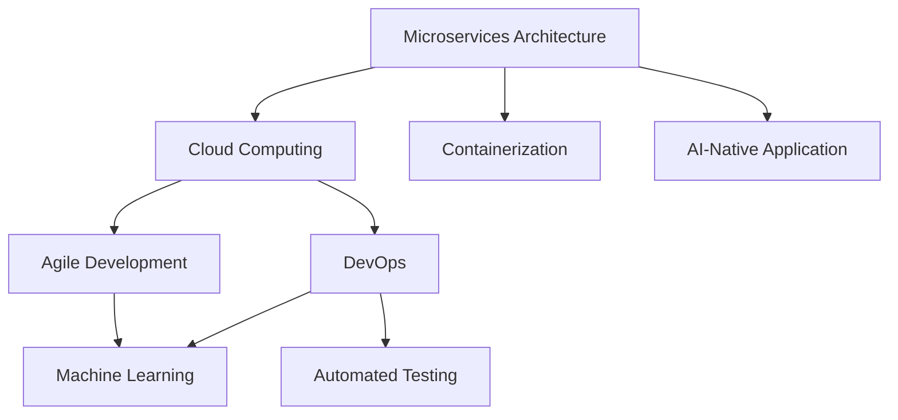

                 

# AI-Native应用开发的最佳实践

> 关键词：
- AI-Native
- 微服务架构
- 云计算
- 容器化
- DevOps
- 敏捷开发
- 机器学习
- 自动化测试

## 1. 背景介绍

随着人工智能技术的不断成熟和普及，AI-Native应用开发已经成为一种新兴的开发范式。AI-Native应用是指那些在设计之初就考虑到人工智能技术的应用场景，通过将人工智能模型直接集成到应用中，提升产品功能和用户体验。这种开发模式不仅提高了应用的核心竞争力，也提升了开发效率，降低了技术门槛，为开发者提供了更灵活和高效的开发平台。本文将从背景介绍、核心概念、核心算法、项目实践、应用场景、工具资源推荐等多个维度，深入探讨AI-Native应用开发的最佳实践，为开发者提供系统的指导和全面的参考。

## 2. 核心概念与联系

### 2.1 核心概念概述

AI-Native应用开发的核心概念主要包括以下几个方面：

- **微服务架构(Microservices Architecture)**：将应用程序拆分成一系列小型、独立、可替换的服务，每个服务运行在其独立的进程中，通过轻量级的通信机制进行交互。微服务架构能够使系统更灵活、易于扩展、容错性更高。
- **云计算(Cloud Computing)**：通过网络提供可扩展的计算资源和服务，用户可以按需使用，无需管理底层硬件。云计算大大降低了开发和运维成本，提高了资源利用率。
- **容器化(Containerization)**：将应用程序及其依赖打包到容器镜像中，容器提供了一个相对独立的环境，便于部署、管理和迁移。容器化简化了微服务架构的部署流程，提高了系统的稳定性。
- **DevOps(DevOps)**：将开发、测试、运维紧密结合，通过自动化工具和流程，提高软件交付速度和质量。DevOps的实践理念能够帮助团队快速迭代，持续提升系统性能。
- **敏捷开发(Agile Development)**：通过迭代开发和快速反馈，满足不断变化的市场需求。敏捷开发强调团队合作、沟通和客户反馈，提高了产品迭代速度和灵活性。
- **机器学习(Machine Learning, ML)**：利用数据和算法，使计算机系统能够从经验中学习和改进。机器学习在AI-Native应用中发挥着核心作用，提供了强大的数据分析和预测能力。
- **自动化测试(Automated Testing)**：通过脚本或工具自动执行测试用例，提高测试效率和覆盖率，确保软件质量和稳定性。自动化测试是AI-Native应用开发的重要组成部分，能够显著缩短开发周期。

这些核心概念之间存在着密切的联系和相互促进的关系。微服务架构和容器化使得AI-Native应用能够快速部署和扩展，云计算提供了所需的计算资源，DevOps和敏捷开发保证了系统的快速迭代和高质量交付，机器学习提供了强大的数据分析和预测能力，自动化测试则保障了系统的稳定性和可靠性。这些技术的结合使用，为AI-Native应用开发提供了全面的支持，极大地提升了开发效率和系统性能。

### 2.2 概念间的关系

以下使用Mermaid流程图展示这些核心概念之间的关系：



这个流程图展示了微服务架构、云计算、容器化、DevOps、敏捷开发、机器学习、自动化测试和AI-Native应用之间的相互关系：

1. **微服务架构**和**容器化**为AI-Native应用提供了部署和扩展的基础。
2. **云计算**提供了所需的计算资源和弹性扩展能力。
3. **DevOps**和**敏捷开发**保障了系统的快速迭代和高质量交付。
4. **机器学习**提供了强大的数据分析和预测能力。
5. **自动化测试**保证了系统的稳定性和可靠性。
6. **AI-Native应用**整合了上述技术，形成了完整的开发和应用生态。

这些概念共同构成了AI-Native应用开发的核心生态系统，极大地提升了系统的开发效率和性能。

## 3. 核心算法原理 & 具体操作步骤

### 3.1 算法原理概述

AI-Native应用开发的算法原理主要基于以下几个方面：

- **模型训练**：通过机器学习算法，对历史数据进行训练，得到具有预测能力的模型。
- **模型集成**：将训练好的模型集成到应用中，提供预测或分类功能。
- **数据处理**：对输入数据进行预处理和特征提取，提升模型性能。
- **模型优化**：通过超参数调优、模型压缩等手段，提高模型的效率和精度。
- **部署和监控**：将模型部署到生产环境中，通过监控系统保障其稳定性和可靠性。

这些算法原理构成了AI-Native应用开发的核心流程，从数据收集、模型训练到模型部署，每一步都需要精心设计和优化，以确保最终的系统性能和用户体验。

### 3.2 算法步骤详解

AI-Native应用开发的步骤可以大致分为以下几个阶段：

1. **需求分析**：明确项目需求和目标，制定详细的需求规格说明书。
2. **数据收集**：收集相关的数据集，并进行初步清洗和预处理。
3. **模型选择和训练**：选择合适的机器学习模型，对数据进行训练，得到预测模型。
4. **模型集成和测试**：将训练好的模型集成到应用中，并进行自动化测试，确保其稳定性和准确性。
5. **部署和监控**：将模型部署到生产环境中，通过监控系统实时监测其运行状态，及时处理异常情况。
6. **持续优化**：根据用户反馈和系统表现，持续优化模型和应用，提升性能和用户体验。

这些步骤不仅适用于AI-Native应用的开发，也适用于传统应用的开发。但AI-Native应用在模型选择、数据处理、模型优化等方面具有独特的要求，需要开发者具备更强的数据处理能力和模型训练经验。

### 3.3 算法优缺点

AI-Native应用开发的算法具有以下优点：

- **高效性**：通过直接集成模型，能够快速实现数据预测和分类功能，提高系统的响应速度。
- **可扩展性**：模型可以通过微调或重新训练，轻松适应新任务和数据，提升系统的灵活性和适应性。
- **可靠性**：通过自动化测试和监控系统，能够保障系统的稳定性和可靠性。
- **用户体验**：AI-Native应用能够提供更智能、更个性化的用户体验，提升用户满意度和忠诚度。

但同时，AI-Native应用开发也存在一些缺点：

- **数据依赖**：AI-Native应用对数据的质量和量级要求较高，数据缺失或不准确会影响模型的预测性能。
- **模型复杂性**：复杂的模型需要更多的计算资源和时间，可能影响应用的实时性和响应速度。
- **技术门槛**：AI-Native应用开发需要具备较强的数据处理和机器学习知识，对开发人员的技术水平要求较高。
- **系统维护**：模型的更新和维护需要持续投入，增加了系统的复杂度和运维成本。

开发者需要权衡这些优缺点，结合具体项目需求，选择合适的开发方案。

### 3.4 算法应用领域

AI-Native应用开发在多个领域都得到了广泛应用，例如：

- **金融科技**：通过AI-Native应用，实现智能风控、反欺诈、信用评分等功能，提升金融服务的智能化水平。
- **医疗健康**：AI-Native应用能够提供智能诊断、个性化推荐、患者管理等功能，提升医疗服务的效率和质量。
- **智能家居**：通过AI-Native应用，实现语音识别、智能推荐、场景控制等功能，提升家居生活的智能化水平。
- **教育培训**：AI-Native应用能够提供个性化学习、智能辅导、评估分析等功能，提升教育培训的效果和效率。
- **智能制造**：通过AI-Native应用，实现预测维护、质量检测、生产调度等功能，提升制造业的智能化水平。

AI-Native应用开发不仅能够提升各个行业的服务水平，还能为开发者提供更广阔的创新空间。

## 4. 数学模型和公式 & 详细讲解 & 举例说明

### 4.1 数学模型构建

AI-Native应用开发中的数学模型主要基于机器学习算法，包括监督学习、无监督学习和强化学习等。以监督学习为例，构建数学模型的步骤如下：

1. **数据准备**：收集和清洗数据，分为训练集和测试集。
2. **特征选择**：选择和提取特征，将输入数据转化为模型能够处理的格式。
3. **模型训练**：使用训练集数据，训练得到预测模型。
4. **模型评估**：使用测试集数据，评估模型的预测性能和泛化能力。
5. **模型优化**：根据评估结果，优化模型参数和超参数，提升模型性能。

以线性回归为例，其数学模型构建如下：

$$
\hat{y} = \theta_0 + \theta_1 x_1 + \theta_2 x_2 + \cdots + \theta_n x_n
$$

其中，$\hat{y}$表示预测值，$\theta_i$表示模型参数，$x_i$表示输入特征。

### 4.2 公式推导过程

以线性回归为例，其公式推导过程如下：

1. **假设模型**：假设线性回归模型为$\hat{y} = \theta_0 + \theta_1 x_1 + \theta_2 x_2 + \cdots + \theta_n x_n$。
2. **代价函数**：定义代价函数$J(\theta)$为均方误差，即$J(\theta) = \frac{1}{2m} \sum_{i=1}^m (y_i - \hat{y}_i)^2$。
3. **梯度下降**：通过梯度下降算法，求解最小化代价函数$J(\theta)$的$\theta$值，即$\theta = \theta - \eta \nabla J(\theta)$，其中$\eta$为学习率，$\nabla J(\theta)$为代价函数的梯度。
4. **模型评估**：使用测试集数据，计算模型的误差，评估模型的预测性能。

### 4.3 案例分析与讲解

以金融风控为例，构建AI-Native应用的过程如下：

1. **数据准备**：收集历史贷款数据，包括用户基本信息、还款记录、信用评分等。
2. **特征选择**：选择和提取特征，如用户年龄、收入、信用评分等。
3. **模型训练**：使用训练集数据，训练得到线性回归模型，预测用户的还款概率。
4. **模型评估**：使用测试集数据，评估模型的预测性能和泛化能力。
5. **模型优化**：根据评估结果，优化模型参数和超参数，提升模型性能。

最终，将训练好的模型集成到金融风控系统中，实现智能反欺诈、信用评分等功能，提升金融服务的智能化水平。

## 5. 项目实践：代码实例和详细解释说明

### 5.1 开发环境搭建

AI-Native应用开发的开发环境搭建步骤如下：

1. **选择编程语言**：选择适合项目的编程语言，如Python、Java等。
2. **安装开发工具**：安装所需的开发工具，如IDE、数据库、版本控制等。
3. **配置开发环境**：配置开发环境，如安装依赖库、配置开发服务器等。
4. **容器化部署**：使用Docker等工具，将应用和数据打包成容器镜像，方便部署和扩展。
5. **云平台部署**：将容器镜像部署到云平台上，如AWS、阿里云、腾讯云等。

### 5.2 源代码详细实现

以线性回归为例，使用Python实现其完整代码如下：

```python
import numpy as np
from sklearn.linear_model import LinearRegression
from sklearn.metrics import mean_squared_error

# 准备数据
X = np.array([[1, 2, 3], [4, 5, 6], [7, 8, 9]])
y = np.array([3, 6, 9])

# 训练模型
model = LinearRegression()
model.fit(X, y)

# 预测和评估
X_test = np.array([[10, 11, 12]])
y_pred = model.predict(X_test)
mse = mean_squared_error(y_pred, [12])
print("Mean Squared Error:", mse)
```

### 5.3 代码解读与分析

上述代码实现了线性回归模型的完整流程，从数据准备、模型训练、预测和评估到模型优化，每一步都进行了详细的解释：

- **数据准备**：使用NumPy生成输入数据X和目标变量y。
- **模型训练**：使用sklearn库中的LinearRegression模型，训练得到预测模型。
- **预测和评估**：使用测试集数据X_test进行预测，计算均方误差。
- **模型优化**：可以通过超参数调优、模型压缩等手段，进一步提升模型的性能和效率。

## 6. 实际应用场景

### 6.4 未来应用展望

随着AI-Native应用开发技术的不断成熟，其应用场景将越来越广泛，涉及金融、医疗、智能家居、教育、智能制造等多个领域。未来，AI-Native应用将具备更强的智能化、个性化和自动化能力，为用户提供更优质的服务和体验。

1. **金融科技**：通过AI-Native应用，实现智能风控、反欺诈、信用评分等功能，提升金融服务的智能化水平。
2. **医疗健康**：AI-Native应用能够提供智能诊断、个性化推荐、患者管理等功能，提升医疗服务的效率和质量。
3. **智能家居**：通过AI-Native应用，实现语音识别、智能推荐、场景控制等功能，提升家居生活的智能化水平。
4. **教育培训**：AI-Native应用能够提供个性化学习、智能辅导、评估分析等功能，提升教育培训的效果和效率。
5. **智能制造**：通过AI-Native应用，实现预测维护、质量检测、生产调度等功能，提升制造业的智能化水平。

## 7. 工具和资源推荐

### 7.1 学习资源推荐

为帮助开发者全面掌握AI-Native应用开发的理论基础和实践技巧，以下是一些优质的学习资源：

1. **书籍**：《深度学习》、《机器学习实战》、《TensorFlow实战》等。
2. **在线课程**：Coursera、Udacity、edX等平台的机器学习和深度学习课程。
3. **博客和论文**：如深度学习社区Kaggle、arXiv等，获取最新的研究进展和技术分享。
4. **社区和论坛**：GitHub、Stack Overflow、Reddit等社区，交流学习经验和解决技术问题。

### 7.2 开发工具推荐

AI-Native应用开发常用的开发工具如下：

1. **编程语言**：Python、Java、Scala等。
2. **框架和库**：TensorFlow、PyTorch、Keras等。
3. **IDE**：Visual Studio Code、PyCharm等。
4. **云平台**：AWS、阿里云、腾讯云等。
5. **容器化工具**：Docker、Kubernetes等。

### 7.3 相关论文推荐

AI-Native应用开发的相关论文如下：

1. "A Survey on Microservice Architecture for AI and ML Applications"（微服务架构在AI和ML应用中的综述）。
2. "Cloud Computing: Concepts, Technology, and Architecture"（云计算：概念、技术和架构）。
3. "DevOps in Software Development: Practices and Tools"（DevOps在软件开发中的应用：实践和工具）。
4. "Agile Software Development: Principles, Practices, and Patterns"（敏捷软件开发：原则、实践和模式）。
5. "Machine Learning for Data Science: Algorithms, Models, and Tools"（数据科学中的机器学习：算法、模型和工具）。

## 8. 总结：未来发展趋势与挑战

### 8.1 研究成果总结

本文从背景介绍、核心概念、核心算法、项目实践、应用场景、工具资源推荐等多个维度，全面系统地探讨了AI-Native应用开发的最佳实践。通过介绍微服务架构、云计算、容器化、DevOps、敏捷开发、机器学习、自动化测试等核心概念，详细阐述了其相互关系和应用场景。同时，通过线性回归模型的代码实例，展示了AI-Native应用开发的完整流程和关键技术点。

### 8.2 未来发展趋势

AI-Native应用开发的未来发展趋势如下：

1. **深度学习与AI-Native应用的融合**：未来的AI-Native应用将更加依赖深度学习技术，通过更复杂的模型和更丰富的数据，提升系统的智能化水平。
2. **云计算与AI-Native应用的协同**：云平台将提供更强大的计算资源和弹性扩展能力，支持大规模AI-Native应用的部署和运行。
3. **容器化与微服务架构的普及**：容器化和微服务架构将得到更广泛的应用，提升系统的可扩展性和灵活性。
4. **DevOps与敏捷开发的融合**：DevOps和敏捷开发将更加紧密结合，提高系统的开发效率和交付速度。
5. **自动化测试与持续集成**：自动化测试和持续集成将得到更广泛的应用，保障系统的稳定性和可靠性。

### 8.3 面临的挑战

AI-Native应用开发在快速发展的同时，也面临着一些挑战：

1. **数据质量与多样性**：数据质量不高、多样性不足，将直接影响模型的预测性能。
2. **模型复杂性与效率**：复杂的模型需要更多的计算资源和时间，可能影响应用的实时性和响应速度。
3. **技术门槛与人才短缺**：AI-Native应用开发对开发人员的技术水平要求较高，存在人才短缺的问题。
4. **系统维护与更新**：模型的更新和维护需要持续投入，增加了系统的复杂度和运维成本。
5. **伦理与安全问题**：AI-Native应用需要考虑伦理和安全问题，避免产生歧视、偏见等不良影响。

### 8.4 研究展望

未来的AI-Native应用开发需要关注以下几个方向：

1. **深度学习模型的优化**：通过优化模型结构和算法，提高模型的效率和精度。
2. **数据增强与多样性**：通过数据增强和多样性扩充，提升模型的泛化能力。
3. **自动化与智能辅助**：引入自动化工具和智能辅助，降低开发人员的工作量，提高开发效率。
4. **模型与业务融合**：将模型与业务深度融合，提升系统的实际应用价值。
5. **伦理与安全保障**：在模型训练和应用中，重视伦理和安全的保障，避免不良影响。

通过持续的研究和实践，AI-Native应用开发必将在未来获得更广泛的应用，为各行各业带来更智能、更高效、更安全的服务和体验。

## 9. 附录：常见问题与解答

**Q1: 如何选择合适的机器学习算法？**

A: 选择合适的机器学习算法需要考虑数据的特点、问题的类型、算法的复杂性等因素。通常可以使用以下步骤：

1. **数据探索**：了解数据的特点和分布，选择适合的特征和模型。
2. **算法选择**：根据问题的类型，选择合适的机器学习算法，如回归、分类、聚类等。
3. **模型训练**：使用训练集数据，训练得到预测模型。
4. **模型评估**：使用测试集数据，评估模型的预测性能和泛化能力。
5. **模型优化**：根据评估结果，优化模型参数和超参数，提升模型性能。

**Q2: 如何处理模型过拟合问题？**

A: 处理模型过拟合问题可以从以下几个方面入手：

1. **数据增强**：通过数据增强和扩充，增加训练集的多样性，提升模型的泛化能力。
2. **正则化**：使用L1、L2正则化、Dropout等技术，防止模型过拟合。
3. **早停策略**：在训练过程中，使用早停策略，及时停止训练，避免过拟合。
4. **模型简化**：通过简化模型结构和减少参数量，降低模型复杂度，避免过拟合。

**Q3: 如何提升AI-Native应用的性能？**

A: 提升AI-Native应用的性能可以从以下几个方面入手：

1. **数据优化**：通过数据清洗和预处理，提升数据质量，增加数据多样性。
2. **模型优化**：通过超参数调优、模型压缩等手段，提高模型的效率和精度。
3. **硬件优化**：使用高效的硬件设备和算法，提升系统的响应速度和计算能力。
4. **系统优化**：通过系统优化和资源调度，提升系统的稳定性和可靠性。

**Q4: 如何保障AI-Native应用的安全性？**

A: 保障AI-Native应用的安全性可以从以下几个方面入手：

1. **数据安全**：保护数据隐私和完整性，避免数据泄露和篡改。
2. **模型安全**：通过模型压缩和加密等手段，防止模型被恶意攻击和篡改。
3. **用户隐私**：保护用户隐私，避免数据滥用和滥用。
4. **伦理保障**：在模型训练和应用中，重视伦理和安全的保障，避免不良影响。

通过不断探索和实践，AI-Native应用开发将能够更好地应对各种挑战，实现更加智能化、安全化和高效化的应用。

