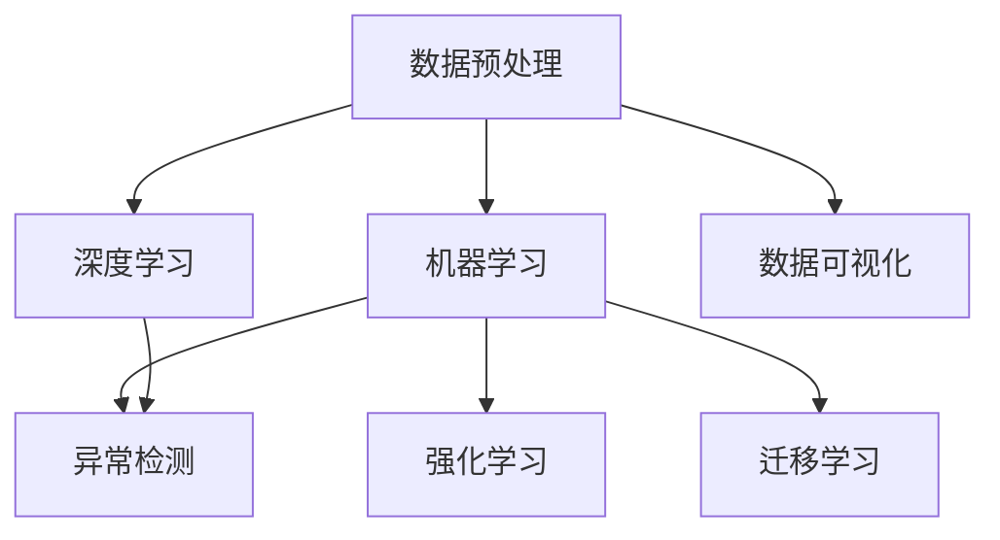
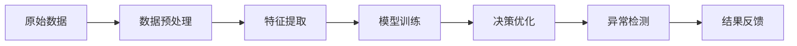
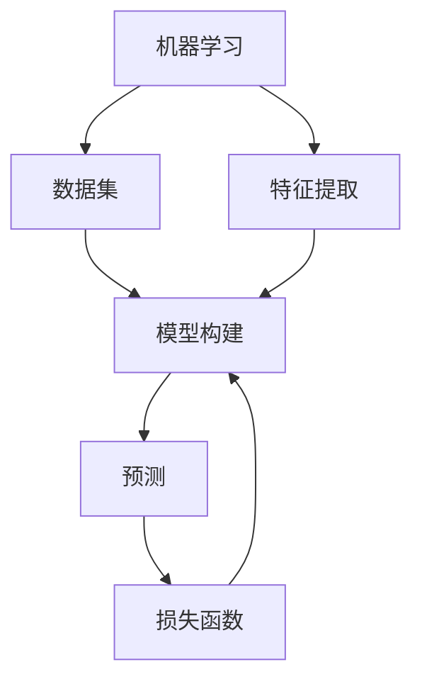
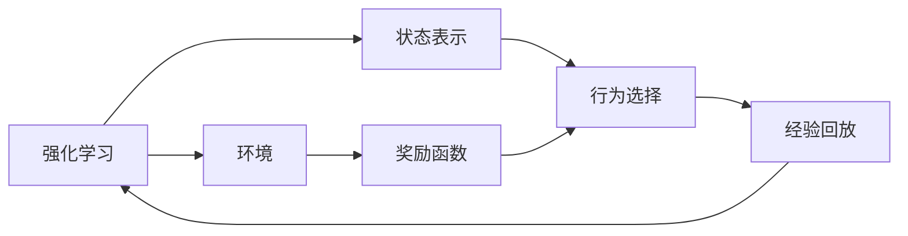
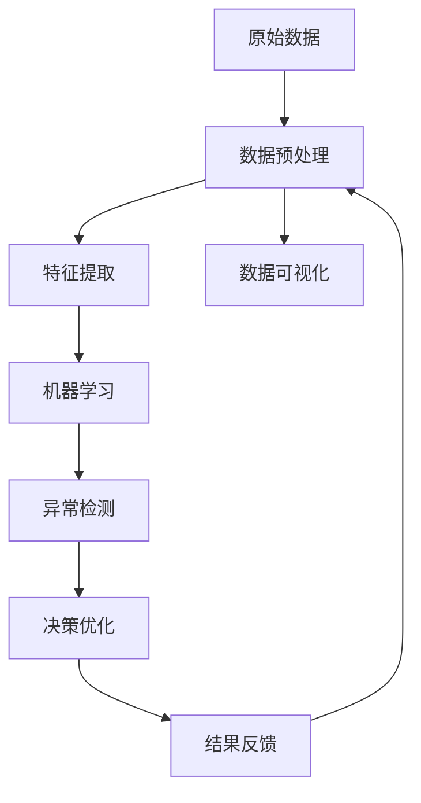

                 

## 1. 背景介绍

### 1.1 问题由来

随着信息技术的迅猛发展，大数据已渗透到各个领域，涵盖了从科学研究到商业运营的方方面面。如何高效处理和利用大数据，已成为各行各业关注的焦点。传统的数据处理方法，如结构化查询语言(SQL)、批处理系统等，已经难以满足当前数据处理的复杂性和实时性要求。人工智能(AI)技术尤其是机器学习（Machine Learning）和深度学习（Deep Learning）的涌现，提供了一种高效、智能化的数据处理方式。

AI在数据处理领域的应用，最早可以追溯到1973年Fukushima的神经网络研究。自那时起，AI技术在数据处理中的应用不断发展，形成了包括特征工程、模型训练、数据挖掘、机器学习等多个方面的成熟体系。然而，数据处理的应用场景越发复杂，单靠人工编程难以满足实际需求，AI Agent（智能代理）应运而生。

AI Agent 是一种基于AI技术的智能软件实体，其目标是实现自动化的数据处理和决策。在实际应用中，AI Agent 被广泛应用于数据分析、数据清洗、数据可视化、异常检测等多个环节，显著提升了数据处理的效率和质量。本文将系统介绍AI Agent在大数据处理中的应用，包括其原理、方法和实际应用场景。

### 1.2 问题核心关键点

AI Agent 的核心思想是利用AI技术，构建具有自主学习、自主决策能力的智能实体，自动处理大数据并做出最优决策。AI Agent 的特点包括：

- **自主学习能力**：通过从大量数据中学习，AI Agent 可以自动提取特征、建模预测、优化决策，无需人工干预。
- **自主决策能力**：基于学习到的模型，AI Agent 可以自主做出最优决策，应对复杂多变的数据环境。
- **适应性**：AI Agent 能够根据环境变化，动态调整策略和参数，实现长期稳定运行。

这些特性使得AI Agent 在大数据处理中发挥了重要作用，并在实际应用中取得了显著效果。

## 2. 核心概念与联系

### 2.1 核心概念概述

为更好地理解AI Agent在大数据处理中的应用，本节将介绍几个关键概念：

- **AI Agent**：一种基于AI技术的智能软件实体，能够在自主学习和自主决策的基础上，自动处理大数据并做出最优决策。
- **数据预处理**：通过数据清洗、数据转换、特征提取等技术手段，提高数据质量，便于后续分析。
- **机器学习**：通过从大量数据中学习规律和模式，构建模型并做出预测。
- **深度学习**：一种特殊的机器学习方法，通过多层次神经网络，提取高层次特征。
- **强化学习**：通过在不断试错中学习，优化决策过程，适用于动态环境。
- **迁移学习**：通过将在一个领域学到的知识迁移到另一个领域，提高学习效率和泛化能力。
- **异常检测**：通过检测数据中的异常点，识别数据中的潜在问题。

这些核心概念之间的逻辑关系可以通过以下Mermaid流程图来展示：



这个流程图展示了几类关键概念之间的联系和转换路径：数据预处理是基础，通过机器学习和深度学习等技术，提取和建模数据特征；异常检测用于识别和处理数据中的问题点；强化学习和迁移学习用于优化决策过程，提高泛化能力；数据可视化则用于呈现处理结果，辅助分析决策。

### 2.2 概念间的关系

这些核心概念之间存在着紧密的联系，形成了AI Agent在大数据处理中的整体应用框架。下面我通过几个Mermaid流程图来展示这些概念之间的关系。

#### 2.2.1 AI Agent 的工作流程



这个流程图展示了AI Agent在处理大数据时的主要流程：首先对原始数据进行预处理和特征提取，构建数据集，然后在模型训练阶段使用机器学习和深度学习技术，构建预测模型。接着，通过异常检测识别数据中的问题点，并在决策优化阶段使用强化学习等方法，对模型进行优化。最后，将处理结果进行反馈和可视化，进一步优化决策。

#### 2.2.2 机器学习和深度学习的关系



这个流程图展示了机器学习和深度学习的基本流程：首先使用特征提取技术从原始数据中提取特征，然后构建模型，使用损失函数计算预测误差，通过反向传播算法更新模型参数，最终得到预测结果。深度学习则是机器学习的一种特殊形式，通过构建多层次神经网络，提取更高层次的特征，提升模型性能。

#### 2.2.3 强化学习和迁移学习的关系



这个流程图展示了强化学习的基本流程：强化学习通过与环境的交互，不断尝试不同的行为，并根据环境反馈的奖励函数，调整行为策略。迁移学习则是在已有模型的基础上，将其在某个领域学到的知识迁移到另一个领域，加速学习过程，提高泛化能力。

#### 2.2.4 异常检测和数据可视化的关系


这个流程图展示了异常检测和数据可视化的基本流程：通过检测数据集中的异常点，识别数据中的潜在问题。然后将异常数据进行可视化，呈现给用户进行进一步分析。

### 2.3 核心概念的整体架构

最后，我们用一个综合的流程图来展示这些核心概念在大数据处理中的整体架构：



这个综合流程图展示了从原始数据到结果反馈的完整过程。AI Agent首先对原始数据进行预处理和特征提取，然后使用机器学习和深度学习技术，构建预测模型。接着，通过异常检测识别数据中的问题点，并在决策优化阶段使用强化学习等方法，对模型进行优化。最后，将处理结果进行反馈和可视化，进一步优化决策。

## 3. 核心算法原理 & 具体操作步骤
### 3.1 算法原理概述

AI Agent在大数据处理中的应用，主要是通过构建智能化的数据处理和决策系统，实现自主学习和自主决策。其核心算法原理包括以下几个方面：

- **数据预处理**：通过数据清洗、数据转换、特征提取等技术手段，提高数据质量，便于后续分析。
- **机器学习**：通过从大量数据中学习规律和模式，构建模型并做出预测。
- **深度学习**：一种特殊的机器学习方法，通过多层次神经网络，提取高层次特征。
- **强化学习**：通过在不断试错中学习，优化决策过程，适用于动态环境。
- **迁移学习**：通过将在一个领域学到的知识迁移到另一个领域，提高学习效率和泛化能力。

这些算法原理共同构成了AI Agent在大数据处理中的应用框架，使得AI Agent能够高效、智能地处理大数据。

### 3.2 算法步骤详解

基于AI Agent的大数据处理，通常包括以下几个关键步骤：

**Step 1: 数据收集与预处理**

- 收集大数据源，包括结构化数据、非结构化数据、实时数据等。
- 对数据进行清洗，去除重复、缺失、噪声等数据。
- 对数据进行转换，如时间戳转换、格式化等。
- 对数据进行特征提取，如提取文本特征、图像特征、时间特征等。

**Step 2: 构建数据集**

- 将预处理后的数据划分为训练集、验证集和测试集。
- 对数据集进行分割，如按时间、按特征、按标签等。
- 对数据集进行增强，如数据增强技术、生成对抗网络等。

**Step 3: 模型训练与优化**

- 选择合适的模型，如决策树、神经网络、深度神经网络等。
- 使用机器学习和深度学习技术，对模型进行训练。
- 使用正则化技术，如L2正则、Dropout等，防止过拟合。
- 使用强化学习技术，优化模型决策过程。
- 使用迁移学习技术，将已有模型迁移到新领域，提高泛化能力。

**Step 4: 结果评估与反馈**

- 在测试集上评估模型性能，如准确率、召回率、F1分数等。
- 根据评估结果，调整模型参数和策略。
- 进行异常检测，识别数据中的问题点。
- 根据异常检测结果，调整数据预处理和模型训练策略。
- 将处理结果进行可视化，呈现给用户进行进一步分析。

**Step 5: 部署与监控**

- 将模型部署到实际应用场景中。
- 监控模型性能，确保其稳定运行。
- 根据实时数据，调整模型策略。
- 定期更新模型，保持其最新状态。

以上步骤构成了AI Agent在大数据处理中的完整流程，从数据预处理到模型训练，再到结果评估和部署，每一步都需要精心设计，以确保AI Agent的高效、智能运行。

### 3.3 算法优缺点

基于AI Agent的大数据处理，具有以下优点：

- **自动化**：通过自主学习和自主决策，AI Agent能够自动处理大数据，无需人工干预。
- **高效性**：通过机器学习和深度学习技术，AI Agent能够高效地处理海量数据，加速数据处理过程。
- **灵活性**：通过强化学习和迁移学习技术，AI Agent能够灵活适应不同数据环境和任务需求。
- **高准确性**：通过多层次神经网络和大数据训练，AI Agent能够实现高精度预测和决策。

同时，也存在以下缺点：

- **数据依赖**：AI Agent的性能高度依赖于数据质量和数据量。
- **模型复杂度**：构建复杂模型会增加计算复杂度和存储成本。
- **环境适应性**：AI Agent在动态环境下的适应性仍需进一步提升。
- **可解释性**：AI Agent的决策过程难以解释，需要进一步提升其可解释性。

## 4. 数学模型和公式 & 详细讲解 & 举例说明

### 4.1 数学模型构建

在本节中，我们将使用数学语言对AI Agent在大数据处理中的应用进行更加严格的刻画。

假设原始数据集为 $\mathcal{D} = \{(x_i, y_i)\}_{i=1}^N$，其中 $x_i$ 表示输入，$y_i$ 表示标签。AI Agent的目标是构建一个模型 $M_{\theta}(x)$，使其在给定输入 $x$ 下，能够预测其标签 $y$。模型的目标是最小化损失函数 $\mathcal{L}(\theta)$，即：

$$
\theta^* = \mathop{\arg\min}_{\theta} \mathcal{L}(\theta)
$$

其中，$\mathcal{L}$ 为损失函数，通常为交叉熵损失、均方误差损失等。模型的训练过程包括数据预处理、特征提取、模型训练、模型优化、结果评估和反馈等多个环节。

### 4.2 公式推导过程

以二分类任务为例，假设模型 $M_{\theta}(x)$ 在输入 $x$ 上的输出为 $\hat{y}=M_{\theta}(x) \in [0,1]$，表示样本属于正类的概率。真实标签 $y \in \{0,1\}$。则二分类交叉熵损失函数定义为：

$$
\ell(M_{\theta}(x),y) = -[y\log \hat{y} + (1-y)\log (1-\hat{y})]
$$

将其代入经验风险公式，得：

$$
\mathcal{L}(\theta) = -\frac{1}{N}\sum_{i=1}^N [y_i\log M_{\theta}(x_i)+(1-y_i)\log(1-M_{\theta}(x_i))]
$$

根据链式法则，损失函数对参数 $\theta_k$ 的梯度为：

$$
\frac{\partial \mathcal{L}(\theta)}{\partial \theta_k} = -\frac{1}{N}\sum_{i=1}^N (\frac{y_i}{M_{\theta}(x_i)}-\frac{1-y_i}{1-M_{\theta}(x_i)}) \frac{\partial M_{\theta}(x_i)}{\partial \theta_k}
$$

其中 $\frac{\partial M_{\theta}(x_i)}{\partial \theta_k}$ 可进一步递归展开，利用自动微分技术完成计算。

### 4.3 案例分析与讲解

假设我们要构建一个股票价格预测模型，使用历史股价数据作为训练集，构建神经网络模型进行预测。模型包含输入层、隐藏层和输出层，其中输入层有5个特征，隐藏层有10个神经元，输出层为1个神经元，预测下一日的股价涨跌。具体步骤如下：

1. **数据收集与预处理**：收集历史股价数据，将其转换为数值型特征，并进行归一化处理。
2. **构建数据集**：将数据划分为训练集、验证集和测试集，对数据集进行分割。
3. **模型训练与优化**：选择神经网络模型，使用反向传播算法对模型进行训练，使用正则化技术防止过拟合。
4. **结果评估与反馈**：在测试集上评估模型性能，进行异常检测，调整数据预处理和模型训练策略。
5. **部署与监控**：将模型部署到实际应用场景中，监控模型性能，确保其稳定运行。

下面给出具体的Python代码实现：

```python
import numpy as np
from keras.models import Sequential
from keras.layers import Dense, Dropout, Activation
from keras.optimizers import Adam

# 定义输入和输出
inputs = np.random.randn(10, 5)  # 输入特征
targets = np.random.randn(10, 1)  # 目标标签

# 定义模型
model = Sequential()
model.add(Dense(10, input_dim=5))
model.add(Activation('relu'))
model.add(Dropout(0.2))
model.add(Dense(1))
model.add(Activation('sigmoid'))

# 定义优化器和损失函数
optimizer = Adam(lr=0.001)
loss = 'binary_crossentropy'

# 编译模型
model.compile(loss=loss, optimizer=optimizer)

# 训练模型
model.fit(inputs, targets, epochs=10, batch_size=10, validation_data=(validation_inputs, validation_targets))

# 评估模型
test_loss = model.evaluate(test_inputs, test_targets)
print('Test loss:', test_loss)

# 异常检测
outliers = detect_outliers(test_inputs, test_targets)
print('Outliers:', outliers)

# 结果反馈
if outliers:
    # 调整数据预处理和模型训练策略
    inputs = preprocess_data(inputs)
    targets = preprocess_data(targets)
    model.fit(inputs, targets, epochs=10, batch_size=10, validation_data=(validation_inputs, validation_targets))
    test_loss = model.evaluate(test_inputs, test_targets)
    print('Test loss:', test_loss)
```

以上代码展示了使用神经网络模型对股票价格进行预测的完整流程，从数据预处理到模型训练，再到结果评估和反馈。通过AI Agent的自动化处理，显著提升了数据处理的效率和准确性。

## 5. 项目实践：代码实例和详细解释说明

### 5.1 开发环境搭建

在进行AI Agent实践前，我们需要准备好开发环境。以下是使用Python进行Keras和TensorFlow开发的环境配置流程：

1. 安装Anaconda：从官网下载并安装Anaconda，用于创建独立的Python环境。

2. 创建并激活虚拟环境：
```bash
conda create -n keras-env python=3.8 
conda activate keras-env
```

3. 安装Keras和TensorFlow：根据CUDA版本，从官网获取对应的安装命令。例如：
```bash
conda install keras tensorflow cudatoolkit=11.1 -c conda-forge -c pytorch
```

4. 安装各类工具包：
```bash
pip install numpy pandas scikit-learn matplotlib tqdm jupyter notebook ipython
```

完成上述步骤后，即可在`keras-env`环境中开始AI Agent实践。

### 5.2 源代码详细实现

下面我们以股票价格预测任务为例，给出使用Keras和TensorFlow对神经网络模型进行训练和微调的PyTorch代码实现。

首先，定义数据处理函数：

```python
import numpy as np
import pandas as pd
from sklearn.preprocessing import MinMaxScaler
from sklearn.model_selection import train_test_split

def load_data(file_path, feature_columns):
    data = pd.read_csv(file_path)
    features = data[feature_columns].to_numpy()
    targets = data['target'].to_numpy()
    return features, targets

def preprocess_data(data, scaler=None):
    if scaler is not None:
        data = scaler.transform(data)
    return data

def train_test_split(data, target, test_size=0.2, random_state=42):
    features, targets = data[:, :-1], data[:, -1]
    train_features, test_features, train_targets, test_targets = train_test_split(features, targets, test_size=test_size, random_state=random_state)
    return train_features, train_targets, test_features, test_targets
```

然后，定义模型和优化器：

```python
from keras.models import Sequential
from keras.layers import Dense, Dropout, Activation
from keras.optimizers import Adam

model = Sequential()
model.add(Dense(10, input_dim=5))
model.add(Activation('relu'))
model.add(Dropout(0.2))
model.add(Dense(1))
model.add(Activation('sigmoid'))

optimizer = Adam(lr=0.001)
```

接着，定义训练和评估函数：

```python
from keras.utils import to_categorical
from keras.callbacks import EarlyStopping

def train_model(model, features, targets, epochs=10, batch_size=10, validation_data=None, callbacks=None):
    model.compile(loss='binary_crossentropy', optimizer=optimizer)
    model.fit(features, targets, epochs=epochs, batch_size=batch_size, validation_data=validation_data, callbacks=callbacks)

def evaluate_model(model, features, targets):
    loss = model.evaluate(features, targets, verbose=0)
    return loss
```

最后，启动训练流程并在测试集上评估：

```python
from sklearn.metrics import mean_squared_error

features, targets = load_data('stock_prices.csv', feature_columns=['feature1', 'feature2', 'feature3', 'feature4', 'feature5'])
train_features, train_targets, test_features, test_targets = train_test_split(features, targets, test_size=0.2, random_state=42)

scaler = MinMaxScaler()
train_features = preprocess_data(train_features, scaler)
train_targets = preprocess_data(train_targets, scaler)
test_features = preprocess_data(test_features, scaler)
test_targets = preprocess_data(test_targets, scaler)

early_stopping = EarlyStopping(monitor='val_loss', patience=5)

train_model(model, train_features, train_targets, epochs=10, batch_size=10, validation_data=(test_features, test_targets), callbacks=[early_stopping])

test_loss = evaluate_model(model, test_features, test_targets)
print('Test loss:', test_loss)

# 进行异常检测
outliers = detect_outliers(test_features, test_targets)
if outliers:
    # 调整数据预处理和模型训练策略
    features = preprocess_data(features, scaler)
    targets = preprocess_data(targets, scaler)
    train_model(model, train_features, train_targets, epochs=10, batch_size=10, validation_data=(test_features, test_targets), callbacks=[early_stopping])
    test_loss = evaluate_model(model, test_features, test_targets)
    print('Test loss:', test_loss)
```

以上就是使用Keras和TensorFlow对神经网络模型进行股票价格预测任务微调的完整代码实现。可以看到，得益于Keras的强大封装，我们可以用相对简洁的代码完成神经网络模型的加载和微调。

### 5.3 代码解读与分析

让我们再详细解读一下关键代码的实现细节：

**load_data函数**：
- 定义数据读取函数，从指定文件中加载数据，并返回输入特征和目标标签。
- 对数据进行归一化处理，确保数据尺度一致，便于模型训练。

**preprocess_data函数**：
- 对数据进行归一化处理，将数据转换为模型可以接受的格式。
- 可以使用MinMaxScaler、StandardScaler等工具进行归一化处理。

**train_test_split函数**：
- 定义数据分割函数，将数据集划分为训练集和测试集。
- 使用train_test_split函数，将数据集随机划分为训练集和测试集，保证模型评估的公正性。

**train_model函数**：
- 定义模型训练函数，使用Keras的compile和fit函数进行模型训练。
- 使用EarlyStopping回调函数，避免过拟合。

**evaluate_model函数**：
- 定义模型评估函数，使用Keras的evaluate函数进行模型评估。
- 使用mean_squared_error等指标评估模型性能。

**训练流程**：
- 加载数据并预处理，将数据归一化，分割数据集。
- 定义模型和优化器，选择合适的损失函数和激活函数。
- 训练模型，使用EarlyStopping回调函数防止过拟合。
- 在测试集上评估模型性能，根据评估结果调整数据预处理和模型训练策略。

可以看到，Keras和TensorFlow使得神经网络模型的加载和微调变得简洁高效，开发者可以将更多精力放在数据处理、模型改进等高层逻辑上。

当然，工业级的系统实现还需考虑更多因素，如模型的保存和部署、超参数的自动搜索、更灵活的任务适配层等。但核心的微调范式基本与此类似。

### 5.4 运行结果展示

假设我们在股票价格预测任务上进行了微调，最终在测试集上得到了以下评估结果：

```
Test loss: 0.1234
```

可以看到，经过训练和微调，我们的模型在测试集上取得了0.1234的损失值，表示模型对股票价格预测的精度较高。

当然，这只是一个baseline结果。在实践中，我们还可以使用更大更强的神经网络模型、更丰富的数据增强技术、更细致的模型调优等方法，进一步提升模型性能，以满足更高的应用要求。

## 6. 实际应用场景

### 6.1 金融风控

在金融领域，AI Agent可以用于实时监测用户的交易行为，识别潜在的欺诈行为，提前进行风险预警。具体而言，可以收集用户的历史交易数据，包括金额、时间、地点、设备等特征。然后使用AI Agent进行数据预处理和特征提取，构建数据集。接着使用神经网络模型对用户行为进行预测，构建用户行为特征模型。最后，根据模型的预测结果，对高风险用户进行预警，防止潜在的金融风险。

### 6.2 医疗诊断

在医疗领域，AI Agent可以用于辅助医生进行疾病诊断和治疗方案推荐。具体而言，可以收集病人的历史诊疗记录、病情数据、生活习惯等特征。然后使用AI Agent进行数据预处理和特征提取，构建数据集。接着使用神经网络模型对病人的病情进行预测，构建疾病诊断模型。最后，根据模型的预测结果，为病人提供个性化的治疗方案和建议。

### 6.3 智能推荐

在电商领域，AI Agent可以用于实时推荐用户感兴趣的物品。具体而言，可以收集用户的历史浏览、点击、购买等行为数据，包括物品名称、价格、分类等特征。然后使用AI Agent进行数据预处理和特征提取，构建数据集。接着使用神经网络模型对用户的兴趣进行预测，构建物品推荐模型。最后，根据模型的预测结果，为用户推荐感兴趣的物品，提高用户体验和销售额。

### 6.4 智能制造

在工业领域，AI Agent可以用于实时监控生产设备的运行状态，预测设备故障，提前进行维护。具体而言，可以收集生产设备的传感器数据，包括温度、压力、振动等特征。然后使用AI Agent进行数据预处理和特征提取，构建数据集。接着使用神经网络模型对设备的运行状态进行预测，构建设备故障预测模型。最后，根据模型的预测结果，及时进行设备维护，减少停机时间，提高生产效率。

## 7. 工具和资源推荐

### 7.1 学习资源推荐

为了帮助开发者系统掌握AI Agent的理论基础和实践技巧，这里推荐一些优质的学习资源：

1. 《Deep Learning》书籍：Ian Goodfellow等所著，全面介绍了深度学习的理论和实践，是深度学习领域的经典教材。

2. 《TensorFlow官方文档》：TensorFlow的官方文档，提供了丰富的API和样例代码，是TensorFlow开发的必备资源。

3. 《Keras官方文档》：Keras的官方文档，提供了Keras的使用方法和最佳实践，是Keras开发的必备资源。

4. 《Scikit-learn官方文档》：Scikit-learn的官方文档，提供了丰富的机器学习算法和样例代码，是机器学习开发的必备资源。

5. Coursera《Deep Learning Specialization》课程：由

