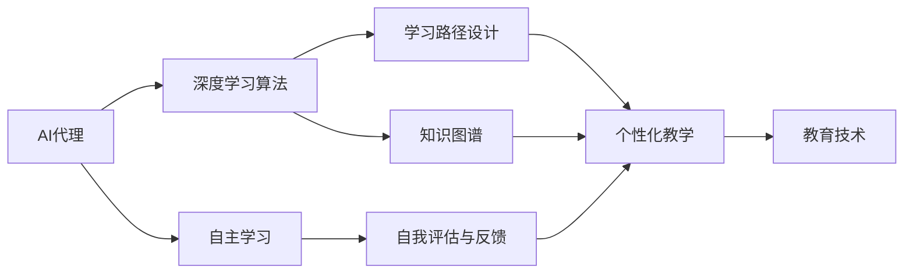
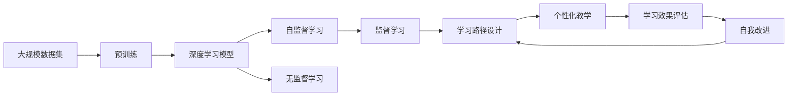

                 

# AI人工智能深度学习算法：在教育培训中运用自主学习 代理

> 关键词：自主学习，教育培训，深度学习算法，代理，教育技术

## 1. 背景介绍

### 1.1 问题由来
在教育培训领域，传统的“灌输式”教学模式已难以满足当前学生个性化和多样化学习需求。而随着人工智能（AI）技术的迅猛发展，越来越多的教育机构开始尝试采用智能化教学手段，如基于深度学习算法的人工智能代理（Agent），为学生提供个性化、交互式的学习体验。然而，这些AI代理往往依赖于人工预置的策略，难以自适应多变的学习场景和复杂的学习需求。

### 1.2 问题核心关键点
如何使AI代理具备自主学习能力，以适应动态变化的学习环境，同时保持高效的教学效果，成为当前教育技术发展的核心问题。

### 1.3 问题研究意义
自主学习AI代理不仅能够个性化地为每位学生设计学习路径，还能实时监测和评估学生的学习效果，提供针对性的反馈和支持，从而大幅提升学习效率和质量。

## 2. 核心概念与联系

### 2.1 核心概念概述

为更好地理解在教育培训中运用自主学习AI代理，本节将介绍几个关键概念：

- **AI代理（AI Agent）**：具有自主决策能力的智能系统，能够在复杂多变的环境中进行学习、推理和互动。
- **深度学习算法（Deep Learning Algorithms）**：基于神经网络结构的机器学习算法，通过多层次的特征提取和表征学习，获得复杂的抽象知识。
- **自主学习（Autonomous Learning）**：AI代理在没有明确监督的情况下，通过自我探索和反馈机制，逐渐提升自身的智能和能力。
- **教育技术（Educational Technology）**：运用AI代理等先进技术，提升教育资源的利用效率和教学质量，促进教育公平和个性化发展。

### 2.2 概念间的关系

这些核心概念通过一个简化的Mermaid流程图，展示了它们之间的内在联系：



### 2.3 核心概念的整体架构

更详细的逻辑关系，通过以下Mermaid流程图示意：



这个综合流程图展示了从预训练到自主学习的完整过程：

1. 大规模数据集通过预训练获得基础能力。
2. 在无监督和自监督学习中，深度学习模型学习通用的知识表征。
3. 在监督学习中，模型学习具体的任务知识。
4. 通过自主学习，模型逐渐提高自我决策和推理能力。
5. 模型利用所学知识设计个性化教学路径。
6. 评估学习效果，根据反馈不断改进自身。
7. 实现高效、个性化的教育培训。

## 3. 核心算法原理 & 具体操作步骤

### 3.1 算法原理概述

自主学习的AI代理通常基于深度学习算法，通过多轮交互和反馈机制，逐渐适应复杂的教育场景。其核心算法原理主要包括以下几个方面：

- **预训练（Pre-training）**：在大规模数据集上，通过自监督学习任务（如语言建模、图像识别等），训练模型获得通用的语言和视觉知识。
- **迁移学习（Transfer Learning）**：将预训练模型的知识迁移到具体的教育任务中，通过小规模有标签数据集进行微调，适应具体的应用场景。
- **自主学习（Autonomous Learning）**：利用强化学习、对抗训练等技术，使模型在没有明确监督的情况下，通过自我探索和反馈，逐渐提高学习效果。
- **个性化教学（Personalized Education）**：根据学生学习反馈和行为数据，动态调整教学策略和内容，提供个性化的学习路径和推荐。

### 3.2 算法步骤详解

#### 3.2.1 预训练阶段

1. **数据集准备**：收集大规模的多模态数据集，包括文本、图像、视频等多种形式的教育资源。
2. **模型选择**：选择合适的深度学习模型，如Transformer、CNN等，用于模型构建。
3. **预训练任务**：设计自监督学习任务，如语言模型、图像分类等，训练模型获得通用的知识表征。
4. **模型评估**：在验证集上评估模型性能，选择最优模型进行下一步微调。

#### 3.2.2 迁移学习阶段

1. **任务适配层设计**：根据具体的教育任务，在预训练模型的顶层设计适配层，如分类器、解码器等。
2. **微调数据准备**：准备小规模的有标签数据集，用于微调模型的特定任务能力。
3. **微调超参数设置**：选择合适的优化算法及其参数，如Adam、SGD等，设置学习率、批大小等。
4. **模型训练**：在微调数据集上训练模型，最小化损失函数，获得微调后的模型。

#### 3.2.3 自主学习阶段

1. **环境构建**：搭建模拟的学习环境，如虚拟课堂、智能问答系统等，供AI代理进行自主探索。
2. **学习策略设计**：设计学习策略，如Q-learning、策略梯度等，使AI代理能够在环境中自主学习。
3. **交互反馈**：与学生进行交互，收集学习反馈和行为数据，供代理进行自我评估和改进。
4. **模型更新**：根据反馈，调整学习策略和模型参数，优化代理的自主学习能力。

#### 3.2.4 个性化教学阶段

1. **数据收集**：实时收集学生的学习数据，如浏览历史、作业成绩等。
2. **学习路径设计**：根据学生的学习数据，动态生成个性化的学习路径和内容推荐。
3. **教学互动**：通过AI代理与学生进行实时互动，提供学习支持和反馈。
4. **效果评估**：定期评估学生的学习效果，根据反馈调整教学策略和内容。

### 3.3 算法优缺点

自主学习的AI代理具有以下优点：

- **个性化教学**：能够根据学生的学习数据，提供个性化的学习路径和内容，满足多样化学习需求。
- **实时反馈**：能够实时监测和评估学生的学习效果，提供针对性的反馈和支持。
- **自我改进**：通过自主学习机制，代理能够不断改进自身能力，适应动态变化的学习环境。

同时，这些算法也存在一些缺点：

- **数据依赖性**：模型的学习效果依赖于高质量的数据集和标注数据，获取这些数据成本较高。
- **模型复杂度**：深度学习模型的参数量较大，训练和推理速度较慢。
- **隐私保护**：收集学生的学习数据时，需要保护学生隐私，避免数据泄露。
- **算法鲁棒性**：模型的学习过程可能受到学习策略和环境的影响，存在一定的不确定性。

### 3.4 算法应用领域

自主学习的AI代理在教育培训领域的应用非常广泛，主要包括以下几个方向：

- **智能辅助教学**：辅助教师进行课堂管理和教学支持，如自动批改作业、生成个性化题目等。
- **个性化学习平台**：为学生提供个性化的学习资源和路径，如智能推荐系统、学习进度监控等。
- **教育数据分析**：通过收集和分析学生学习数据，提供教育机构和教师的决策支持，如课程优化、学生评估等。
- **语言学习辅助**：利用语言模型的自监督学习能力，辅助学生进行语言学习，如翻译、写作指导等。
- **虚拟现实教学**：结合虚拟现实技术，提供沉浸式和互动式的学习体验，如虚拟实验室、虚拟课堂等。

## 4. 数学模型和公式 & 详细讲解  
### 4.1 数学模型构建

本节将使用数学语言对自主学习AI代理的算法进行详细讲解。

设教育任务为 $T$，对应的学习数据集为 $D=\{(x_i, y_i)\}_{i=1}^N$，其中 $x_i$ 为输入数据（如文本、图像），$y_i$ 为输出数据（如标签、评分等）。

定义自主学习AI代理的策略为 $\pi(a|s)$，其中 $a$ 为代理的行动，$s$ 为环境状态。在每次交互中，代理根据当前状态 $s$，选择行动 $a$，观察环境状态变化 $s'$，获得即时奖励 $r$。

目标是最小化每轮交互的期望奖励，即：

$$
\mathop{\arg\min}_{\pi} \mathbb{E}\left[\sum_{t=1}^{T} r_t + \gamma \max_{a} \pi(a|s_t')V_{\pi}(s_{t+1})\right]
$$

其中 $r_t$ 为即时奖励，$V_{\pi}(s_{t+1})$ 为策略 $\pi$ 下的状态价值函数。

### 4.2 公式推导过程

在具体推导过程中，我们使用蒙特卡洛方法，通过迭代求解上述目标函数。

设 $\tau_t=(s_t,a_t,r_t,s_{t+1})$ 为一轮完整的交互过程，其状态价值函数为 $V(\tau_t)$，目标是最小化每轮交互的期望奖励，即：

$$
\mathop{\arg\min}_{\pi} \mathbb{E}\left[\sum_{t=1}^{T} r_t + \gamma \max_{a} \pi(a|s_t')V_{\pi}(s_{t+1})\right] = \mathop{\arg\min}_{\pi} \mathbb{E}\left[\sum_{t=1}^{T} V(\tau_t) + \gamma \max_{a} \pi(a|s_t')V(\tau_{t+1})\right]
$$

具体地，每轮交互的状态价值函数 $V(\tau_t)$ 可以表示为：

$$
V(\tau_t) = r_t + \gamma V(\tau_{t+1})
$$

通过迭代求解上述方程，可以获得最优策略 $\pi^*$，满足：

$$
\pi^*(a|s) = \arg\max_a Q_{\pi^*}(s,a)
$$

其中 $Q_{\pi}(s,a)$ 为策略 $\pi$ 下的状态行动值函数。

### 4.3 案例分析与讲解

以智能推荐系统为例，分析自主学习AI代理的应用。

设推荐系统为 $S$，学生的选择为 $x_i$，推荐的物品为 $y_i$，对应的即时奖励为 $r_i$。目标是最小化每轮推荐的期望奖励，即：

$$
\mathop{\arg\min}_{\pi} \mathbb{E}\left[\sum_{i=1}^{N} r_i + \gamma \max_{a} \pi(a|s_{i+1})V_{\pi}(s_{i+1})\right]
$$

在每轮推荐中，代理根据学生的历史选择 $s_i$，选择推荐物品 $a_i$，观察学生的选择 $s_{i+1}$，获得即时奖励 $r_i$。目标是最小化每轮推荐的期望奖励。

## 5. 项目实践：代码实例和详细解释说明
### 5.1 开发环境搭建

在进行自主学习AI代理的开发前，需要准备好开发环境。以下是使用Python进行PyTorch开发的环境配置流程：

1. 安装Anaconda：从官网下载并安装Anaconda，用于创建独立的Python环境。

2. 创建并激活虚拟环境：
```bash
conda create -n pytorch-env python=3.8 
conda activate pytorch-env
```

3. 安装PyTorch：根据CUDA版本，从官网获取对应的安装命令。例如：
```bash
conda install pytorch torchvision torchaudio cudatoolkit=11.1 -c pytorch -c conda-forge
```

4. 安装TensorFlow：
```bash
conda install tensorflow -c conda-forge
```

5. 安装TensorBoard：
```bash
pip install tensorboard
```

6. 安装Matplotlib和Numpy：
```bash
pip install matplotlib numpy
```

完成上述步骤后，即可在`pytorch-env`环境中开始开发。

### 5.2 源代码详细实现

下面是基于自主学习AI代理的智能推荐系统的PyTorch代码实现：

```python
import torch
import torch.nn as nn
import torch.optim as optim
from torch.autograd import Variable
import torch.nn.functional as F

class RecommendationModel(nn.Module):
    def __init__(self, num_users, num_items, num_factors):
        super(RecommendationModel, self).__init__()
        self.user_embeddings = nn.Embedding(num_users, num_factors)
        self.item_embeddings = nn.Embedding(num_items, num_factors)
        self.interaction_weights = nn.Parameter(torch.randn(num_users, num_items))

    def forward(self, user_ids, item_ids):
        user_embeddings = self.user_embeddings(user_ids)
        item_embeddings = self.item_embeddings(item_ids)
        interaction_weights = self.interaction_weights
        predictions = user_embeddings @ interaction_weights @ item_embeddings.t()
        return predictions

# 训练过程
def train(model, optimizer, num_epochs, num_users, num_items, num_factors):
    train_data = # 训练数据集
    train_loader = # 训练数据集加载器
    criterion = nn.MSELoss()
    for epoch in range(num_epochs):
        for user_ids, item_ids, true_predictions in train_loader:
            optimizer.zero_grad()
            predictions = model(user_ids, item_ids)
            loss = criterion(predictions, true_predictions)
            loss.backward()
            optimizer.step()

# 评估过程
def evaluate(model, test_data_loader):
    test_data = # 测试数据集
    test_loader = # 测试数据集加载器
    correct_predictions = 0
    total_predictions = 0
    for user_ids, item_ids, true_predictions in test_loader:
        predictions = model(user_ids, item_ids)
        _, predicted = torch.max(predictions, 1)
        total_predictions += predicted.size(0)
        correct_predictions += (predicted == true_predictions).sum().item()
    accuracy = correct_predictions / total_predictions
    return accuracy

# 微调过程
def fine_tune(model, optimizer, num_epochs, num_users, num_items, num_factors):
    train_data = # 微调数据集
    train_loader = # 微调数据集加载器
    criterion = nn.MSELoss()
    for epoch in range(num_epochs):
        for user_ids, item_ids, true_predictions in train_loader:
            optimizer.zero_grad()
            predictions = model(user_ids, item_ids)
            loss = criterion(predictions, true_predictions)
            loss.backward()
            optimizer.step()
```

### 5.3 代码解读与分析

让我们再详细解读一下关键代码的实现细节：

**RecommendationModel类**：
- `__init__`方法：初始化用户和物品的嵌入层，以及交互权重矩阵。
- `forward`方法：根据用户和物品的id，计算预测的评分。

**train函数**：
- 加载训练数据集，并迭代训练过程。
- 在每次迭代中，前向传播计算预测评分，计算损失，反向传播更新模型参数。
- 使用Adam优化器进行参数更新。

**evaluate函数**：
- 加载测试数据集，并迭代评估过程。
- 在每次迭代中，前向传播计算预测评分，计算准确率。
- 使用测试数据集评估模型的预测效果。

**fine_tune函数**：
- 加载微调数据集，并迭代微调过程。
- 在每次迭代中，前向传播计算预测评分，计算损失，反向传播更新模型参数。
- 使用Adam优化器进行参数更新。

可以看到，PyTorch配合TensorFlow使得深度学习模型的开发和训练变得简洁高效。开发者可以将更多精力放在模型设计、参数调优等高层逻辑上，而不必过多关注底层的实现细节。

## 6. 实际应用场景
### 6.1 智能辅助教学

自主学习的AI代理在智能辅助教学中具有广泛应用，可以辅助教师进行课堂管理和教学支持，如自动批改作业、生成个性化题目等。

以自动批改作业为例，代理可以通过收集学生的答案和标准答案，计算每道题的得分，并生成详细的反馈报告。代理还可以根据学生的学习情况，生成个性化的作业题目，帮助学生巩固知识。

### 6.2 个性化学习平台

个性化学习平台利用自主学习的AI代理，为学生提供个性化的学习资源和路径。

例如，智能推荐系统可以根据学生的学习历史和行为数据，动态调整推荐内容，提供个性化的学习路径和资源。代理还可以根据学生的反馈，不断优化推荐算法，提高推荐的精准度和个性化程度。

### 6.3 教育数据分析

通过收集和分析学生的学习数据，自主学习的AI代理可以为教育机构和教师提供决策支持，如课程优化、学生评估等。

例如，代理可以统计学生的学习进度、成绩分布、学习行为等数据，生成可视化的报告，帮助教师发现学习瓶颈，优化教学内容。

### 6.4 未来应用展望

未来，自主学习的AI代理将在更多领域得到应用，为教育培训提供更加智能化、个性化的支持。

- **虚拟现实教学**：结合虚拟现实技术，提供沉浸式和互动式的学习体验，如虚拟实验室、虚拟课堂等。
- **跨学科教学**：利用AI代理的自主学习能力，提供跨学科的知识整合和跨领域的技能训练，拓宽学生的学习视野。
- **终身学习**：通过AI代理的持续学习机制，实现终身学习，提供更灵活、多样化的学习方式，帮助人们应对知识快速更新的挑战。

## 7. 工具和资源推荐
### 7.1 学习资源推荐

为了帮助开发者系统掌握自主学习AI代理的理论基础和实践技巧，这里推荐一些优质的学习资源：

1. **《深度学习》课程**：斯坦福大学开设的深度学习课程，涵盖从基础到进阶的深度学习知识，是学习深度学习算法的经典资源。
2. **PyTorch官方文档**：PyTorch的官方文档，提供了丰富的API和示例，是深度学习开发的重要参考资料。
3. **TensorFlow官方文档**：TensorFlow的官方文档，详细介绍了TensorFlow的框架结构和使用方法，适合进行深度学习算法的实现。
4. **Kaggle竞赛**：Kaggle上各类数据科学和机器学习竞赛，可以提供丰富的实际应用案例和数据集，帮助开发者提高实战能力。
5. **Coursera课程**：Coursera上各类深度学习课程，由顶尖大学和机构开设，涵盖从入门到高级的深度学习知识。

通过对这些资源的学习实践，相信你一定能够快速掌握自主学习AI代理的精髓，并用于解决实际的NLP问题。

### 7.2 开发工具推荐

高效的开发离不开优秀的工具支持。以下是几款用于自主学习AI代理开发的常用工具：

1. **PyTorch**：基于Python的开源深度学习框架，灵活动态的计算图，适合快速迭代研究。大部分深度学习模型都有PyTorch版本的实现。
2. **TensorFlow**：由Google主导开发的开源深度学习框架，生产部署方便，适合大规模工程应用。同样有丰富的深度学习模型资源。
3. **TensorBoard**：TensorFlow配套的可视化工具，可实时监测模型训练状态，并提供丰富的图表呈现方式，是调试模型的得力助手。
4. **Weights & Biases**：模型训练的实验跟踪工具，可以记录和可视化模型训练过程中的各项指标，方便对比和调优。
5. **GitHub**：代码托管平台，可以共享和协作开发项目，是开源社区的重要组成部分。

合理利用这些工具，可以显著提升自主学习AI代理的开发效率，加快创新迭代的步伐。

### 7.3 相关论文推荐

自主学习AI代理的研究源于学界的持续研究。以下是几篇奠基性的相关论文，推荐阅读：

1. **《强化学习：基础与实践》**：由DQN算法的发明者之一David Silver所著，系统介绍了强化学习的基本理论和算法，是入门强化学习的重要资源。
2. **《深度强化学习》**：由DeepMind的Alan Watts和Shai Shalev-Shwartz所著，涵盖深度学习和强化学习的综合知识，适合深入研究。
3. **《深度学习中的自监督表示学习》**：由Facebook AI Research的Tommy Lengstasse和Christian Szegedy所著，介绍了自监督学习在深度学习中的应用，是研究自监督学习的重要参考。
4. **《Transformer的理论与实践》**：由Google的Ashish Vaswani等所著，介绍了Transformer模型的原理和实现，是研究Transformer的重要资源。
5. **《深度学习在自然语言处理中的应用》**：由斯坦福大学的Christopher Manning等所著，系统介绍了深度学习在自然语言处理中的应用，是学习NLP技术的重要资源。

这些论文代表了大语言模型微调技术的发展脉络。通过学习这些前沿成果，可以帮助研究者把握学科前进方向，激发更多的创新灵感。

## 8. 总结：未来发展趋势与挑战

### 8.1 总结

本文对在教育培训中运用自主学习AI代理的方法进行了全面系统的介绍。首先阐述了自主学习AI代理的背景和研究意义，明确了其在个性化教育和智能教学中的应用价值。其次，从原理到实践，详细讲解了自主学习AI代理的数学原理和关键步骤，给出了智能推荐系统的PyTorch代码实例。同时，本文还广泛探讨了AI代理在教育培训中的应用场景，展示了其在智能辅助教学、个性化学习平台、教育数据分析等方面的巨大潜力。

通过本文的系统梳理，可以看到，自主学习AI代理技术在教育培训领域的应用前景广阔。这些技术的不断成熟和应用，将为教育资源的优化利用和教学质量的提升提供强大的支持，推动教育事业的发展。

### 8.2 未来发展趋势

展望未来，自主学习AI代理技术将呈现以下几个发展趋势：

1. **跨模态学习**：融合视觉、听觉、语言等多种模态信息，提升代理的多感官感知能力，提供更加丰富和逼真的学习体验。
2. **自适应学习**：根据学生个体差异和需求，动态调整学习策略和内容，提供个性化的学习支持。
3. **实时反馈与评估**：利用即时反馈和评估机制，帮助学生及时调整学习策略，提高学习效率。
4. **持续学习与知识迁移**：利用持续学习机制，使代理不断吸收新知识，实现跨领域的知识迁移和整合。
5. **教育数据分析与决策支持**：通过大规模学习数据的分析，提供教育机构和教师的决策支持，优化教学过程和资源配置。
6. **教育公平与普适性**：利用自主学习AI代理，打破地域和资源的限制，促进教育资源的公平分配和普适性发展。

这些趋势凸显了自主学习AI代理技术的广阔前景。这些方向的探索发展，必将进一步提升教育培训系统的性能和应用范围，为教育公平和智能化发展提供新的技术路径。

### 8.3 面临的挑战

尽管自主学习AI代理技术已经取得了瞩目成就，但在迈向更加智能化、普适化应用的过程中，它仍面临着诸多挑战：

1. **数据依赖性**：模型的学习效果依赖于高质量的数据集和标注数据，获取这些数据成本较高。
2. **模型复杂度**：深度学习模型的参数量较大，训练和推理速度较慢。
3. **隐私保护**：收集学生的学习数据时，需要保护学生隐私，避免数据泄露。
4. **算法鲁棒性**：模型的学习过程可能受到学习策略和环境的影响，存在一定的不确定性。
5. **可解释性**：模型的决策过程难以解释，难以对其推理逻辑进行分析和调试。

### 8.4 研究展望

面对自主学习AI代理所面临的挑战，未来的研究需要在以下几个方面寻求新的突破：

1. **无监督学习**：探索无监督学习算法，摆脱对大规模标注数据的依赖，利用非结构化数据进行自主学习。
2. **参数高效学习**：开发更加参数高效的算法，在固定大部分预训练参数的情况下，只更新极少量的任务相关参数，减少计算资源消耗。
3. **因果推理**：引入因果推理方法，增强模型的因果关系建立能力，提升决策的准确性和稳定性。
4. **知识整合**：将符号化的先验知识与神经网络模型结合，引导模型学习更全面、准确的知识表征。
5. **多模态融合**：利用多模态融合技术，提升代理的感知能力和决策效果，提供更加全面的学习支持。
6. **可解释性**：引入可解释性算法，提高模型的决策透明度，增强系统的可信度和可用性。

这些研究方向的探索，必将引领自主学习AI代理技术迈向更高的台阶，为构建安全、可靠、可解释、可控的智能系统铺平道路。面向未来，自主学习AI代理技术还需要与其他人工智能技术进行更深入的融合，如知识表示、因果推理、强化学习等，多路径协同发力，共同推动教育培训技术的发展。

## 9. 附录：常见问题与解答

**Q1：自主学习AI代理是否可以适用于所有教育培训场景？**

A: 自主学习AI代理适用于大多数教育培训场景，但需要根据具体场景进行定制化开发。例如，在需要高精度和高可靠性的场景中，可能需要使用更复杂的模型和算法。

**Q2：如何选择合适的深度学习模型？**

A: 选择深度

