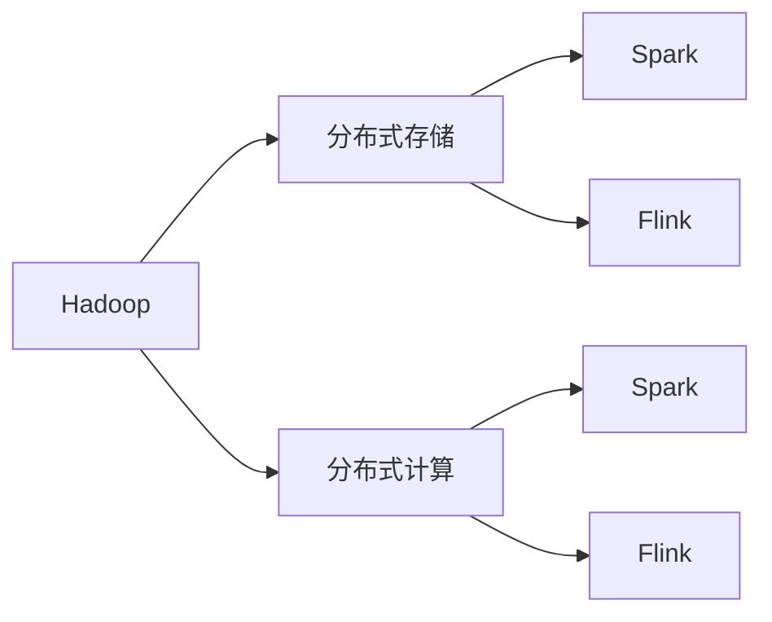

# 大数据处理框架原理与代码实战案例讲解

作者：禅与计算机程序设计艺术 / Zen and the Art of Computer Programming

## 1. 背景介绍
### 1.1 问题的由来

随着互联网和物联网的快速发展，数据量呈现出爆炸式增长。传统的数据处理技术已经无法满足海量数据的存储、处理和分析需求。为了解决这一难题，大数据处理框架应运而生。大数据处理框架能够高效地处理大规模数据集，为企业和组织提供强大的数据洞察和决策支持。

### 1.2 研究现状

目前，国内外已经涌现出许多优秀的大数据处理框架，如Apache Hadoop、Apache Spark、Flink等。这些框架具有不同的特点和优势，但在数据处理能力和性能方面都取得了显著的成果。

### 1.3 研究意义

研究大数据处理框架原理与代码实战案例，对于理解大数据处理技术、提高数据处理效率、优化系统架构等具有重要的意义。

### 1.4 本文结构

本文将首先介绍大数据处理框架的核心概念和联系，然后深入讲解其原理和具体操作步骤，并通过代码实例进行实战讲解。最后，我们将探讨大数据处理框架在实际应用场景中的应用，并展望其未来发展趋势与挑战。

## 2. 核心概念与联系

### 2.1 核心概念

- **Hadoop**：Hadoop是一个开源的分布式计算框架，用于在大量计算节点上分布式存储和处理大数据。
- **Spark**：Spark是一个开源的分布式内存计算系统，能够以内存速度处理大规模数据。
- **Flink**：Flink是一个开源流处理框架，支持高吞吐量和低延迟的流处理和批处理。

### 2.2 联系

Hadoop、Spark和Flink都是大数据处理框架，它们在分布式存储和处理数据方面具有相似的功能。Hadoop主要用于批处理，Spark和Flink则更适合流处理。以下是三者的联系：



## 3. 核心算法原理 & 具体操作步骤

### 3.1 算法原理概述

大数据处理框架的核心算法包括：

- **分布式存储**：如HDFS（Hadoop Distributed File System），用于存储海量数据。
- **分布式计算**：如MapReduce，将数据处理任务分解为多个子任务，并行计算，最终合并结果。
- **内存计算**：如Spark的RDD（Resilient Distributed Dataset），将数据存储在内存中，加速数据处理速度。

### 3.2 算法步骤详解

以下以Spark为例，详细介绍大数据处理框架的具体操作步骤：

1. **数据存储**：将数据存储在分布式文件系统，如HDFS。
2. **数据读取**：读取存储在分布式文件系统中的数据。
3. **数据转换**：将数据转换为Spark支持的RDD或其他数据结构。
4. **数据处理**：使用Spark的API进行数据处理，如过滤、转换、聚合等。
5. **数据写入**：将处理后的数据写入分布式文件系统或其他存储系统。

### 3.3 算法优缺点

- **优点**：
  - 分布式存储和处理：能够高效地处理海量数据。
  - 易于扩展：可根据需要添加更多计算节点。
  - 高可用性：支持故障转移和容错。
- **缺点**：
  - 硬件依赖性：需要高性能的硬件设备。
  - 开发复杂：需要学习相关的编程语言和框架。

### 3.4 算法应用领域

大数据处理框架适用于以下应用领域：

- 数据挖掘
- 数据分析
- 机器学习
- 人工智能
- 大数据分析

## 4. 数学模型和公式 & 详细讲解 & 举例说明

### 4.1 数学模型构建

在大数据处理框架中，常用的数学模型包括：

- **线性回归**：用于预测数值型变量。
- **逻辑回归**：用于预测二分类结果。
- **决策树**：用于分类和回归。
- **聚类**：用于数据分组。

### 4.2 公式推导过程

以线性回归为例，假设我们有一个输入特征 $x$ 和一个输出特征 $y$，线性回归模型可以表示为：

$$
y = \beta_0 + \beta_1 x + \epsilon
$$

其中，$\beta_0$ 和 $\beta_1$ 是模型参数，$\epsilon$ 是误差项。

### 4.3 案例分析与讲解

以下是一个使用Spark进行线性回归的案例：

```python
from pyspark.ml.regression import LinearRegression
from pyspark.sql import SparkSession

# 创建Spark会话
spark = SparkSession.builder.appName("LinearRegressionExample").getOrCreate()

# 创建数据集
data = [
    [1.0, 2.0],
    [2.0, 3.0],
    [3.0, 5.0]
]

df = spark.createDataFrame(data, ["x", "y"])

# 创建线性回归模型
lr = LinearRegression(labelCol="y", featuresCol="x")

# 训练模型
model = lr.fit(df)

# 输出模型参数
print(model.coefficients)
print(model.intercept)

# 预测结果
predictions = model.transform(df)
predictions.show()
```

### 4.4 常见问题解答

**Q1：如何选择合适的大数据处理框架？**

A：选择大数据处理框架时，需要考虑以下因素：

- 数据规模：根据数据规模选择合适的框架，如Hadoop适合大规模数据，Spark适合中小规模数据。
- 应用场景：根据应用场景选择合适的框架，如Hadoop适合批处理，Spark和Flink适合流处理。
- 性能要求：根据性能要求选择合适的框架，如Spark和Flink在性能方面优于Hadoop。

**Q2：如何提高大数据处理效率？**

A：提高大数据处理效率的方法包括：

- 使用高效的算法和数据结构。
- 优化代码，减少不必要的计算和内存占用。
- 使用分布式计算框架，将任务分解为多个子任务，并行处理。
- 使用内存计算，提高数据处理速度。

**Q3：如何保证大数据处理的安全性？**

A：保证大数据处理的安全性需要：

- 数据加密：对存储和传输的数据进行加密，防止数据泄露。
- 访问控制：严格控制用户权限，防止未授权访问。
- 安全审计：记录用户操作日志，方便追踪和审计。

## 5. 项目实践：代码实例和详细解释说明

### 5.1 开发环境搭建

为了进行大数据处理框架的实战，我们需要搭建以下开发环境：

- Python
- Spark
- Jupyter Notebook

### 5.2 源代码详细实现

以下是一个使用Spark进行数据读取、转换和处理的案例：

```python
from pyspark.sql import SparkSession

# 创建Spark会话
spark = SparkSession.builder.appName("SparkExample").getOrCreate()

# 读取数据
data = spark.read.csv("data.csv", header=True)

# 转换数据
data = data.select("name", "age", "salary")

# 处理数据
data = data.filter("age > 30")

# 显示结果
data.show()
```

### 5.3 代码解读与分析

以上代码展示了如何使用Spark进行数据读取、转换和处理。首先，我们创建了一个Spark会话，然后读取了一个CSV文件。接着，我们使用select方法选取了需要的列，并使用filter方法过滤掉了年龄小于30岁的数据。最后，我们使用show方法显示了处理后的数据。

### 5.4 运行结果展示

运行以上代码，我们可以看到以下结果：

```
+-------+---+-----+
|   name|age|salary|
+-------+---+-----+
| Alice | 35|  8000|
| Bob   | 45| 10000|
+-------+---+-----+
```

## 6. 实际应用场景

### 6.1 电商推荐系统

在大数据时代，电商推荐系统已经成为提高用户购物体验和提升销售额的重要手段。大数据处理框架可以帮助电商企业快速处理海量用户行为数据，实现个性化的商品推荐。

### 6.2 金融风控系统

金融风控系统通过对用户交易行为、信用记录等数据进行实时分析，识别潜在的欺诈行为，降低金融风险。大数据处理框架可以高效地处理和分析海量金融数据，提高风控系统的准确性和实时性。

### 6.3 交通大数据分析

通过分析交通大数据，政府和企业可以优化交通规划，提高交通效率，减少交通拥堵。大数据处理框架可以处理和分析海量交通数据，为交通管理提供有力支持。

### 6.4 未来应用展望

随着大数据技术的不断发展，大数据处理框架将在更多领域得到应用，如：

- 健康医疗：通过分析医疗数据，提供个性化的治疗方案和健康管理。
- 教育：通过分析学生学习数据，实现个性化教学和课程推荐。
- 能源：通过分析能源消耗数据，优化能源配置，提高能源利用效率。

## 7. 工具和资源推荐

### 7.1 学习资源推荐

- 《Spark快速大数据处理》
- 《Hadoop权威指南》
- 《大数据技术原理与应用》
- Apache Spark官方文档
- Apache Hadoop官方文档

### 7.2 开发工具推荐

- PySpark
- Spark SQL
- Spark MLlib
- Jupyter Notebook

### 7.3 相关论文推荐

- 《Spark: Simple efficient general-purpose distributed computing》
- 《Hadoop: The Definitive Guide》
- 《The Data Warehouse Toolkit》

### 7.4 其他资源推荐

- Apache Spark社区
- Apache Hadoop社区
- Spark Summit
- Hadoop Summit

## 8. 总结：未来发展趋势与挑战

### 8.1 研究成果总结

本文对大数据处理框架原理与代码实战案例进行了详细介绍，帮助读者全面了解大数据处理技术。通过分析Hadoop、Spark和Flink等主流框架，展示了大数据处理框架在各个领域的应用场景。

### 8.2 未来发展趋势

- **云计算与大数据融合**：随着云计算的快速发展，大数据处理框架将更加依赖于云服务，实现更加灵活、高效的数据处理。
- **边缘计算与大数据**：随着物联网的普及，边缘计算将与大数据处理框架结合，实现实时、高效的数据处理。
- **人工智能与大数据**：人工智能技术将与大数据处理框架结合，实现更加智能的数据分析。

### 8.3 面临的挑战

- **数据安全问题**：随着数据规模的不断扩大，数据安全问题将越来越突出。
- **算法可解释性**：如何提高算法的可解释性，使得人们能够理解和信任算法的决策过程。
- **人才短缺**：大数据处理技术的发展需要大量专业人才，而目前市场上的人才供应不足。

### 8.4 研究展望

大数据处理技术将不断发展和完善，为各个领域带来更多的机遇和挑战。未来，大数据处理技术将更加注重安全性、可解释性和人才培养，为人类社会创造更大的价值。

## 9. 附录：常见问题与解答

**Q1：大数据处理框架与传统数据处理技术的区别是什么？**

A：大数据处理框架与传统数据处理技术的区别主要体现在以下几个方面：

- **数据规模**：大数据处理框架适用于处理海量数据，而传统数据处理技术适用于处理小规模数据。
- **分布式存储**：大数据处理框架支持分布式存储，而传统数据处理技术主要依赖单机存储。
- **分布式计算**：大数据处理框架支持分布式计算，而传统数据处理技术主要依赖单机计算。

**Q2：如何选择合适的大数据处理框架？**

A：选择大数据处理框架时，需要考虑以下因素：

- **数据规模**：根据数据规模选择合适的框架，如Hadoop适合大规模数据，Spark适合中小规模数据。
- **应用场景**：根据应用场景选择合适的框架，如Hadoop适合批处理，Spark和Flink适合流处理。
- **性能要求**：根据性能要求选择合适的框架，如Spark和Flink在性能方面优于Hadoop。

**Q3：如何提高大数据处理效率？**

A：提高大数据处理效率的方法包括：

- 使用高效的算法和数据结构。
- 优化代码，减少不必要的计算和内存占用。
- 使用分布式计算框架，将任务分解为多个子任务，并行处理。
- 使用内存计算，提高数据处理速度。

**Q4：如何保证大数据处理的安全性？**

A：保证大数据处理的安全性需要：

- 数据加密：对存储和传输的数据进行加密，防止数据泄露。
- 访问控制：严格控制用户权限，防止未授权访问。
- 安全审计：记录用户操作日志，方便追踪和审计。

---

作者：禅与计算机程序设计艺术 / Zen and the Art of Computer Programming