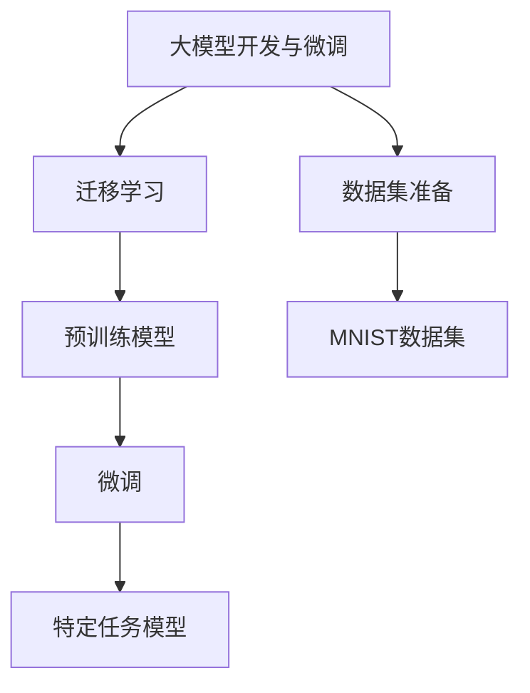

# 从零开始大模型开发与微调：MNIST数据集的准备

## 1. 背景介绍

### 1.1 问题的由来

在人工智能和机器学习领域中,大型神经网络模型已经成为解决各种复杂任务的关键工具。这些模型通过在海量数据上进行训练,能够学习到丰富的特征表示,并在各种下游任务中表现出色。然而,训练这些庞大的模型需要大量的计算资源和时间,这对于个人研究者和小型团队来说是一个巨大的挑战。

为了缓解这一问题,transfer learning(迁移学习)和fine-tuning(微调)技术应运而生。这些技术利用了预训练模型,允许我们在有限的计算资源下,针对特定任务对大型模型进行微调,从而获得可观的性能提升。

### 1.2 研究现状

目前,许多研究人员和实践者都在探索如何更好地利用迁移学习和微调技术。一个关键挑战是如何为特定任务准备高质量的数据集。MNIST数据集作为一个经典的手写数字识别数据集,被广泛用于benchmark测试和模型微调实验。

虽然MNIST数据集相对简单,但它为我们提供了一个绝佳的起点,可以用来学习和实践大模型的微调流程。通过掌握MNIST数据集的准备和处理方法,我们可以为后续更复杂数据集的处理打下坚实的基础。

### 1.3 研究意义

本文旨在为读者提供一个全面的指南,介绍如何从零开始准备MNIST数据集,为大模型的微调做好数据准备工作。通过学习本文的内容,读者将能够:

1. 理解MNIST数据集的背景和重要性
2. 掌握数据集的下载、解压和加载方法
3. 学会对数据进行预处理和增强
4. 了解如何将数据集划分为训练集、验证集和测试集
5. 探索数据可视化技术,直观理解数据的特征

掌握了这些基础知识和技能后,读者就可以更好地应对更复杂的数据集,为大模型的微调之旅打下坚实的基础。

### 1.4 本文结构

本文将按照以下结构展开:

1. 背景介绍
2. 核心概念与联系
3. 核心算法原理与具体操作步骤
4. 数学模型和公式详细讲解与举例说明
5. 项目实践:代码实例和详细解释说明
6. 实际应用场景
7. 工具和资源推荐
8. 总结:未来发展趋势与挑战
9. 附录:常见问题与解答

## 2. 核心概念与联系

在开始探讨MNIST数据集的准备之前,我们需要先了解一些核心概念及它们之间的联系。



1. **大模型开发与微调(Large Model Development and Fine-tuning)**: 这是我们的最终目标。通过对大型预训练模型进行微调,我们可以在有限的计算资源下,为特定任务获得良好的模型性能。
2. **迁移学习(Transfer Learning)**: 这是实现大模型微调的关键技术。迁移学习允许我们将预训练模型中学习到的知识转移到新的任务上,从而加速训练过程并提高模型性能。
3. **数据集准备(Dataset Preparation)**: 为了进行迁移学习和微调,我们需要准备高质量的数据集。本文将重点介绍如何准备MNIST数据集。
4. **预训练模型(Pre-trained Model)**: 这是进行迁移学习和微调的基础。预训练模型通过在大规模数据上进行训练,学习到了丰富的特征表示,为后续的微调奠定了基础。
5. **微调(Fine-tuning)**: 这是将预训练模型应用到特定任务的关键步骤。通过在目标数据集上进行微调,我们可以调整模型参数,使其更好地适应新的任务。
6. **特定任务模型(Task-specific Model)**: 经过微调后,我们就获得了一个针对特定任务(如手写数字识别)的高性能模型。

通过理解这些核心概念及它们之间的联系,我们就可以更好地把握MNIST数据集准备在整个大模型开发与微调过程中的重要地位。

## 3. 核心算法原理与具体操作步骤

### 3.1 算法原理概述

在准备MNIST数据集的过程中,我们将涉及到以下几个核心算法:

1. **数据下载和解压缩**: 我们需要从官方网站下载MNIST数据集,并对其进行解压缩,以获取原始数据文件。
2. **数据加载**: 将原始数据文件加载到内存中,以便进行后续的预处理和操作。
3. **数据预处理**: 对原始数据进行必要的预处理,如归一化、数据增强等,以提高模型的性能和泛化能力。
4. **数据集划分**: 将预处理后的数据划分为训练集、验证集和测试集,以便进行模型训练、评估和测试。
5. **数据可视化**: 通过可视化技术,直观地展示数据的特征和分布,帮助我们更好地理解数据。

### 3.2 算法步骤详解

#### 3.2.1 数据下载和解压缩

MNIST数据集可以从官方网站 http://yann.lecun.com/exdb/mnist/ 下载。下载后,我们需要对压缩文件进行解压缩,以获取四个原始数据文件:

- `train-images-idx3-ubyte.gz`: 训练集图像数据
- `train-labels-idx1-ubyte.gz`: 训练集标签数据
- `t10k-images-idx3-ubyte.gz`: 测试集图像数据
- `t10k-labels-idx1-ubyte.gz`: 测试集标签数据

这些文件采用特殊的二进制格式存储,因此我们需要使用专门的库(如Python的`idx2numpy`库)来加载和解析这些文件。

#### 3.2.2 数据加载

加载MNIST数据集的关键步骤如下:

1. 导入必要的库,如`idx2numpy`、`numpy`等。
2. 使用`idx2numpy.convert_from_file`函数加载原始数据文件。
3. 将加载的数据转换为适当的格式,如NumPy数组。

#### 3.2.3 数据预处理

对于MNIST数据集,常见的预处理步骤包括:

1. **数据归一化**: 将像素值缩放到0-1范围内,以提高模型的收敛速度和性能。
2. **数据增强**: 通过对原始图像进行旋转、平移、缩放等变换,生成新的训练样本,增加数据的多样性,提高模型的泛化能力。

#### 3.2.4 数据集划分

为了评估模型的性能,我们需要将数据集划分为训练集、验证集和测试集。常见的做法是:

1. 从原始数据中划分出一部分作为测试集,用于最终模型性能的评估。
2. 从剩余的数据中再划分出一部分作为验证集,用于模型训练过程中的性能监控和超参数调优。
3. 剩余的数据就是训练集,用于模型的训练。

#### 3.2.5 数据可视化

数据可视化可以帮助我们直观地理解数据的特征和分布。对于MNIST数据集,常见的可视化方法包括:

1. 显示部分图像样本,直观观察手写数字的形态。
2. 绘制像素值的直方图,了解像素值的分布情况。
3. 使用降维技术(如t-SNE)将高维数据投影到二维或三维空间,探索数据的聚类情况。

### 3.3 算法优缺点

#### 优点:

1. **简单高效**: 上述算法步骤相对简单,易于实现和理解。
2. **通用性强**: 这些算法不仅适用于MNIST数据集,也可以应用于其他类似的数据集。
3. **可扩展性好**: 随着数据量的增加,这些算法可以轻松扩展以处理更大规模的数据。

#### 缺点:

1. **数据增强有限**: 对于MNIST这样的简单数据集,数据增强的效果可能有限。
2. **预处理步骤固定**: 对于不同类型的数据集,可能需要调整预处理步骤,算法缺乏灵活性。
3. **可解释性较差**: 这些算法主要关注数据处理,对于模型的可解释性贡献有限。

### 3.4 算法应用领域

上述算法不仅适用于MNIST数据集,也可以应用于其他类似的计算机视觉任务,如:

1. **手写字符识别**: 除了数字,也可以应用于识别手写字母等字符。
2. **图像分类**: 通过调整预处理步骤,可以将这些算法应用于其他图像分类任务。
3. **异常检测**: 通过可视化技术,可以发现数据中的异常样本,用于异常检测任务。

总的来说,这些算法为大模型的微调提供了坚实的数据基础,是进一步探索和实践的重要起点。

## 4. 数学模型和公式详细讲解与举例说明

在准备MNIST数据集的过程中,我们会涉及到一些数学模型和公式,下面将对它们进行详细的讲解和举例说明。

### 4.1 数学模型构建

#### 4.1.1 图像表示

在计算机视觉任务中,图像通常被表示为一个三维张量(tensor),其中:

- 第一维度表示样本数量(batch size)
- 第二、第三维度表示图像的高度和宽度
- 第四维度表示颜色通道数(对于灰度图像,通道数为1)

对于MNIST数据集,每个图像都是28x28的灰度图像,因此可以用一个形状为(N, 28, 28, 1)的张量来表示,其中N是样本数量。

我们可以使用NumPy库来构建这个张量:

```python
import numpy as np

# 假设我们有10个样本
N = 10
images = np.random.randint(0, 256, size=(N, 28, 28, 1))
```

#### 4.1.2 标签表示

对于分类任务,我们需要为每个样本指定一个标签。在MNIST数据集中,标签是0到9之间的整数,表示手写数字的类别。

我们可以使用一个一维张量来表示标签:

```python
labels = np.random.randint(0, 10, size=N)
```

### 4.2 公式推导过程

在数据预处理过程中,我们经常需要对数据进行归一化。归一化的目的是将数据缩放到一个合适的范围内,以提高模型的收敛速度和性能。

对于MNIST数据集,我们可以将像素值缩放到0-1范围内。假设原始像素值范围为[0, 255],归一化公式如下:

$$
x_{norm} = \frac{x - x_{min}}{x_{max} - x_{min}}
$$

其中:
- $x$是原始像素值
- $x_{min}$是像素值的最小值(对于MNIST数据集,为0)
- $x_{max}$是像素值的最大值(对于MNIST数据集,为255)
- $x_{norm}$是归一化后的像素值,范围为[0, 1]

将公式展开,我们可以得到:

$$
x_{norm} = \frac{x - 0}{255 - 0} = \frac{x}{255}
$$

因此,对于MNIST数据集,我们只需要将原始像素值除以255即可实现归一化。

### 4.3 案例分析与讲解

让我们通过一个具体的案例来演示数据预处理和归一化的过程。

假设我们有一个形状为(1, 28, 28, 1)的MNIST图像样本,其像素值范围为[0, 255]:

```python
import numpy as np

# 原始图像样本
image = np.array([[[ 0, 10, 20],
                   [30, 40, 50],
                   [60, 70, 80]]])

# 展示原始图像
print("Original image:\n", image)
```

输出:

```
Original image:
 [[[ 0 10 20]
  [30 40 50]
  [60 70 80]]]
```

现在,我们将对这个图像进行归一化:

```python