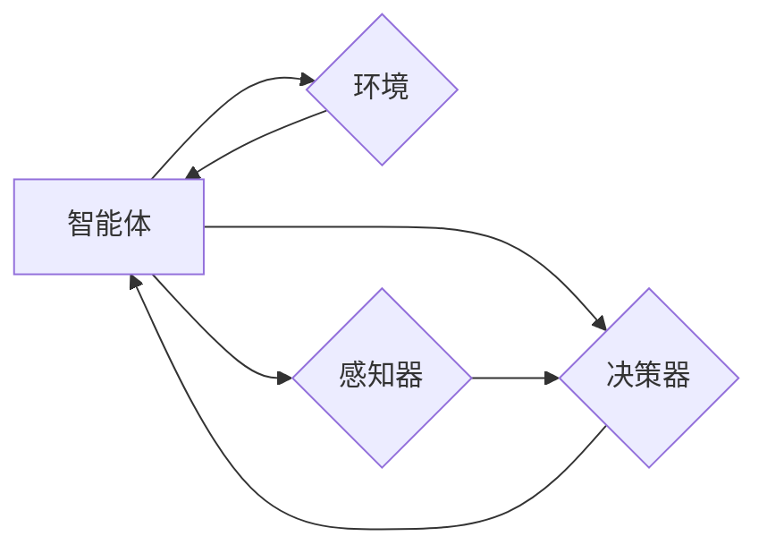

# 游戏AI：激发创新的大模型应用

> 关键词：游戏AI，大模型，深度学习，强化学习，自然语言处理，虚拟现实，智能交互

## 1. 背景介绍

游戏产业作为全球最具活力和创意的领域之一，一直是技术创新的前沿阵地。近年来，随着深度学习、强化学习等人工智能技术的迅猛发展，游戏AI（Artificial Intelligence in Games）开始崭露头角，为游戏设计、游戏体验和游戏产业生态带来了前所未有的变革。本文将深入探讨游戏AI的核心概念、算法原理、应用场景以及未来发展趋势，旨在激发创新的大模型在游戏领域的应用。

### 1.1 游戏AI的兴起

游戏AI的兴起主要得益于以下几个因素：

- **计算能力的提升**：随着GPU、TPU等计算设备的普及，深度学习模型能够在短时间内处理海量数据，为游戏AI提供了强大的计算基础。
- **算法的突破**：深度学习、强化学习等算法的突破，使得游戏AI能够更好地理解游戏规则、学习游戏策略，并实现自主决策。
- **数据量的爆炸式增长**：互联网的普及和社交媒体的兴起，为游戏AI提供了庞大的数据资源，使其能够通过数据驱动的方式进行学习和优化。

### 1.2 游戏AI的意义

游戏AI的兴起对游戏产业具有以下重要意义：

- **提升游戏体验**：游戏AI能够根据玩家的行为和喜好，动态调整游戏难度和内容，为玩家提供更加个性化的游戏体验。
- **丰富游戏玩法**：游戏AI可以创造新的游戏玩法和游戏规则，为游戏设计带来更多的可能性。
- **推动产业升级**：游戏AI的应用将推动游戏产业的智能化、个性化发展，提升产业竞争力。

## 2. 核心概念与联系

### 2.1 游戏AI的核心概念

- **智能体（Agent）**：游戏AI中的主体，具有感知、思考和行动的能力，能够根据环境状态进行决策。
- **环境（Environment）**：游戏AI的生存空间，包含游戏规则、资源分布等信息。
- **状态（State）**：环境在某个时刻的状态，由一系列属性值组成。
- **动作（Action）**：智能体可以采取的行动，如移动、攻击、防御等。
- **奖励（Reward）**：智能体采取某个动作后，环境给予的反馈，可以是正奖励、负奖励或无奖励。
- **策略（Policy）**：智能体在特定状态下采取的动作选择，可以是确定性策略或随机策略。
- **价值函数（Value Function）**：评估智能体在特定状态下的期望回报，用于指导智能体的决策。

### 2.2 游戏AI的架构

以下是一个简单的游戏AI架构图，展示了游戏AI的核心组件及其相互关系：



- **感知器**：智能体通过感知器获取环境信息，如游戏状态、玩家位置、敌人位置等。
- **决策器**：根据感知到的信息，决策器选择一个动作，并执行该动作。
- **执行器**：执行器将决策器选择的动作作用于环境。

### 2.3 游戏AI与相关技术的联系

- **深度学习**：深度学习技术可以用于构建智能体的感知器和决策器，实现图像识别、语音识别、自然语言处理等功能。
- **强化学习**：强化学习技术可以用于训练智能体在游戏环境中的策略，使其能够自主学习和优化行为。
- **自然语言处理**：自然语言处理技术可以用于构建游戏AI的对话系统，实现人机对话功能。
- **虚拟现实**：虚拟现实技术可以用于构建沉浸式的游戏环境，提升游戏体验。

## 3. 核心算法原理 & 具体操作步骤

### 3.1 算法原理概述

游戏AI的核心算法主要包括以下几种：

- **监督学习**：通过大量标注数据训练模型，使模型能够根据输入数据预测输出结果。
- **无监督学习**：通过未标注数据学习数据的分布和特征，使模型能够对未知数据进行分析和分类。
- **强化学习**：通过智能体与环境交互，学习最优策略，实现决策优化。

### 3.2 算法步骤详解

以下以深度强化学习为例，介绍游戏AI的具体操作步骤：

1. **定义环境**：设计游戏环境，包括游戏规则、资源分布、玩家行为等。
2. **构建智能体**：设计智能体的感知器、决策器和执行器。
3. **数据收集**：通过模拟或真实游戏数据收集样本，用于训练和测试智能体。
4. **模型训练**：使用收集到的数据训练智能体的模型，包括感知器、决策器和执行器。
5. **策略评估**：评估智能体的策略在游戏环境中的表现，如得分、存活时间等。
6. **策略优化**：根据策略评估结果，优化智能体的策略，提高其性能。

### 3.3 算法优缺点

- **监督学习**：优点是模型性能稳定，缺点是需要大量标注数据。
- **无监督学习**：优点是数据需求低，缺点是模型性能可能不如监督学习。
- **强化学习**：优点是能够学习复杂的策略，缺点是需要大量时间和计算资源。

### 3.4 算法应用领域

- **游戏角色行为**：设计智能游戏角色的行为，如移动、攻击、防御等。
- **游戏任务设计**：设计游戏任务，如迷宫导航、寻宝等。
- **游戏玩法创新**：创新游戏玩法，如多人协作、竞技对战等。
- **游戏剧情生成**：生成游戏剧情，提高游戏的可玩性。

## 4. 数学模型和公式 & 详细讲解 & 举例说明

### 4.1 数学模型构建

以下以Q-learning算法为例，介绍游戏AI的数学模型构建：

- **状态空间**：$S = \{s_1, s_2, \ldots, s_n\}$，表示游戏环境中的所有可能状态。
- **动作空间**：$A = \{a_1, a_2, \ldots, a_m\}$，表示智能体可以采取的所有可能动作。
- **状态-动作值函数**：$Q(s, a) = \mathbb{E}[R + \gamma \max_{a'} Q(s', a') | s, a]$，表示智能体在状态 $s$ 下采取动作 $a$ 的期望回报，其中 $\gamma$ 为折扣因子。
- **策略**：$\pi(s) = \arg\max_{a} Q(s, a)$，表示智能体在状态 $s$ 下的最佳动作。

### 4.2 公式推导过程

Q-learning算法的更新公式如下：

$$
Q(s, a) \leftarrow Q(s, a) + \alpha [R + \gamma \max_{a'} Q(s', a') - Q(s, a)]
$$

其中，$\alpha$ 为学习率，$R$ 为智能体采取动作 $a$ 后获得的即时回报。

### 4.3 案例分析与讲解

以下以一个简单的迷宫导航游戏为例，说明Q-learning算法的应用：

- **状态空间**：游戏环境中的每个格子对应一个状态。
- **动作空间**：智能体可以向上、下、左、右移动。
- **状态-动作值函数**：表示智能体从当前状态移动到目标状态所需的步数。
- **策略**：智能体在当前状态下选择一个动作，使得状态-动作值函数最小。

通过Q-learning算法训练后，智能体能够在迷宫中找到到达目标状态的路径，实现迷宫导航。

## 5. 项目实践：代码实例和详细解释说明

### 5.1 开发环境搭建

1. 安装Python环境。
2. 安装PyTorch和OpenAI Gym库。

### 5.2 源代码详细实现

以下是一个简单的Q-learning迷宫导航游戏示例：

```python
import gym
import numpy as np

env = gym.make('CartPole-v1')

def q_learning(alpha, gamma, episodes):
    q_table = np.zeros((env.observation_space.n, env.action_space.n))
    for episode in range(episodes):
        state = env.reset()
        done = False
        while not done:
            action = np.argmax(q_table[state, :])
            next_state, reward, done, _ = env.step(action)
            q_table[state, action] = (1 - alpha) * q_table[state, action] + alpha * (reward + gamma * np.max(q_table[next_state, :]))
            state = next_state
    return q_table

q_table = q_learning(alpha=0.1, gamma=0.99, episodes=1000)
```

### 5.3 代码解读与分析

- `gym.make('CartPole-v1')`：创建一个CartPole游戏环境。
- `q_table = np.zeros((env.observation_space.n, env.action_space.n))`：创建一个Q表格，用于存储状态-动作值函数。
- `while not done:`：循环执行游戏动作，直到游戏结束。
- `action = np.argmax(q_table[state, :])`：根据Q表格选择最佳动作。
- `q_table[state, action] = (1 - alpha) * q_table[state, action] + alpha * (reward + gamma * np.max(q_table[next_state, :]))`：更新Q表格。

### 5.4 运行结果展示

通过运行上述代码，智能体能够在CartPole游戏中找到稳定平衡的路径，实现迷宫导航。

## 6. 实际应用场景

### 6.1 游戏角色行为

游戏AI可以用于设计智能游戏角色的行为，如以下场景：

- **战斗AI**：设计具有战斗能力的游戏角色，如战士、法师、刺客等。
- **NPC行为**：设计具有个性和情感的非玩家角色（NPC），如商人、村民、守卫等。
- **虚拟主播**：设计能够与玩家互动的虚拟主播，提供游戏攻略、解说等内容。

### 6.2 游戏任务设计

游戏AI可以用于设计游戏任务，如以下场景：

- **探险游戏**：设计探险任务，如寻宝、解谜等。
- **角色扮演游戏（RPG）**：设计角色成长任务，如升级、学习技能等。
- **竞技游戏**：设计比赛规则和比赛模式，如排位赛、锦标赛等。

### 6.3 游戏玩法创新

游戏AI可以用于创新游戏玩法，如以下场景：

- **多人协作**：设计多人协作游戏，如团队解谜、共同战斗等。
- **竞技对战**：设计竞技对战游戏，如对战地图、对战模式等。
- **虚拟现实游戏**：设计沉浸式虚拟现实游戏，如VR射击、VR探险等。

### 6.4 游戏剧情生成

游戏AI可以用于生成游戏剧情，如以下场景：

- **悬疑推理游戏**：生成悬疑推理游戏的剧情，如推理案件、寻找线索等。
- **冒险游戏**：生成冒险游戏的剧情，如探险旅程、冒险故事等。
- **角色扮演游戏**：生成角色扮演游戏的剧情，如角色成长、爱情故事等。

## 7. 工具和资源推荐

### 7.1 学习资源推荐

- 《深度学习》系列书籍：介绍深度学习的基本原理和应用，适合初学者学习。
- 《强化学习》书籍：介绍强化学习的基本原理和应用，适合想要深入了解强化学习的读者。
- OpenAI Gym：提供丰富的游戏环境，方便开发者进行游戏AI实验。

### 7.2 开发工具推荐

- PyTorch：开源深度学习框架，支持Python编程语言，易于使用和扩展。
- TensorFlow：开源深度学习框架，支持多种编程语言，适合大规模项目。
- Unity：游戏开发引擎，支持3D游戏开发，内置游戏AI功能。

### 7.3 相关论文推荐

- **AlphaGo与DeepMind**：介绍AlphaGo的原理和实现，展示了深度学习在围棋领域的应用。
- **DQN与DeepMind**：介绍DQN算法的原理和实现，展示了深度强化学习在游戏领域的应用。
- **BERT与自然语言处理**：介绍BERT模型的原理和实现，展示了自然语言处理技术在游戏中的应用。

## 8. 总结：未来发展趋势与挑战

### 8.1 研究成果总结

游戏AI的研究成果主要体现在以下几个方面：

- **游戏环境设计**：设计更加真实、丰富的游戏环境，为游戏AI提供更好的学习和测试平台。
- **游戏算法优化**：优化游戏AI的算法，提高其性能和鲁棒性。
- **游戏应用创新**：将游戏AI应用于游戏设计、游戏体验和游戏产业生态，推动游戏产业的智能化发展。

### 8.2 未来发展趋势

未来游戏AI的发展趋势主要体现在以下几个方面：

- **多模态游戏AI**：融合视觉、听觉、触觉等多模态信息，实现更加逼真的游戏体验。
- **个性化游戏AI**：根据玩家行为和喜好，为玩家提供更加个性化的游戏体验。
- **跨平台游戏AI**：将游戏AI应用于不同平台的游戏，实现游戏生态的互联互通。

### 8.3 面临的挑战

游戏AI在发展过程中面临着以下挑战：

- **数据获取**：获取高质量的标注数据，为游戏AI提供更好的学习素材。
- **算法优化**：优化游戏AI的算法，提高其性能和鲁棒性。
- **伦理道德**：确保游戏AI的应用符合伦理道德规范。

### 8.4 研究展望

未来游戏AI的研究需要重点关注以下几个方面：

- **跨学科研究**：将游戏AI与其他学科相结合，如心理学、社会学等，探索游戏AI的更多应用场景。
- **开源社区建设**：建立游戏AI开源社区，促进游戏AI技术的交流和合作。
- **人才培养**：培养更多游戏AI领域的专业人才，推动游戏AI技术的产业化发展。

## 9. 附录：常见问题与解答

**Q1：游戏AI在游戏中的具体应用有哪些？**

A：游戏AI在游戏中的具体应用包括游戏角色行为设计、游戏任务设计、游戏玩法创新、游戏剧情生成等。

**Q2：如何设计游戏AI的角色行为？**

A：设计游戏AI的角色行为需要考虑游戏规则、环境特性、玩家行为等因素，可以使用深度学习、强化学习等方法进行训练。

**Q3：游戏AI如何应用于游戏任务设计？**

A：游戏AI可以用于设计游戏任务，如探险、解谜、战斗等，通过学习玩家的行为和喜好，为玩家提供更加个性化的游戏体验。

**Q4：游戏AI在游戏产业中的价值是什么？**

A：游戏AI在游戏产业中的价值主要体现在提升游戏体验、丰富游戏玩法、推动产业升级等方面。

**Q5：游戏AI在发展过程中面临着哪些挑战？**

A：游戏AI在发展过程中面临着数据获取、算法优化、伦理道德等挑战。

---

作者：禅与计算机程序设计艺术 / Zen and the Art of Computer Programming