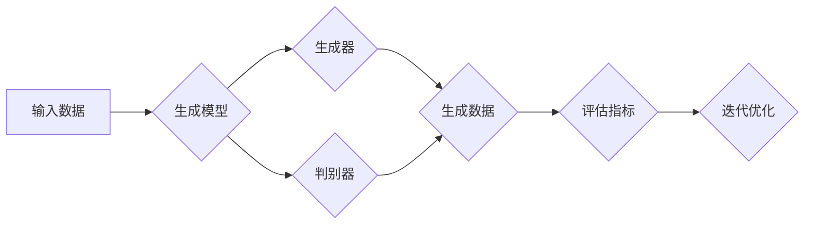

> 生成式AI，用户体验，技术优势，自然语言处理，计算机视觉，个性化推荐，人机交互，场景应用

# 生成式AI：如何利用技术优势提升用户体验？

> 关键词：生成式AI，用户体验，技术优势，自然语言处理，计算机视觉，个性化推荐，人机交互，场景应用

## 1. 背景介绍

随着人工智能技术的快速发展，生成式AI（Generative AI）逐渐成为研究热点。生成式AI能够根据输入信息自主生成新的数据，如文本、图像、音乐等，为用户创造前所未有的体验。本文将探讨如何利用生成式AI的技术优势，提升用户体验。

### 1.1 生成式AI的兴起

生成式AI的兴起源于深度学习技术的进步，特别是生成对抗网络（GANs）的出现。GANs通过两个神经网络（生成器和判别器）的对抗训练，能够生成与真实数据高度相似的样本。这使得生成式AI在图像、音频、视频等领域取得了突破性进展。

### 1.2 生成式AI的应用价值

生成式AI具有以下应用价值：

- **个性化推荐**：根据用户兴趣和行为，生成个性化的内容推荐。
- **创意设计**：辅助艺术家、设计师等创作新的作品。
- **数据增强**：在数据稀缺的情况下，通过生成数据来扩充数据集。
- **人机交互**：生成自然、流畅的对话，提升交互体验。

## 2. 核心概念与联系

### 2.1 核心概念

- **生成对抗网络（GANs）**：一种包含生成器和判别器的神经网络结构，通过对抗训练生成与真实数据相似的新数据。
- **变分自编码器（VAEs）**：一种基于变分推理的生成模型，能够生成具有较高概率分布的新数据。
- **生成式对话系统**：能够生成自然、流畅的对话，提升用户体验。
- **个性化推荐系统**：根据用户兴趣和行为，生成个性化的内容推荐。

### 2.2 核心概念原理和架构的 Mermaid 流程图



在上述流程图中，输入数据经过生成模型，包括生成器和判别器。生成器生成数据，判别器评估数据的真实性。根据评估指标，模型不断迭代优化，直至生成满足要求的数据。

## 3. 核心算法原理 & 具体操作步骤

### 3.1 算法原理概述

生成式AI的核心算法主要包括：

- **生成对抗网络（GANs）**：通过生成器和判别器的对抗训练，生成与真实数据相似的新数据。
- **变分自编码器（VAEs）**：基于变分推理，生成具有较高概率分布的新数据。

### 3.2 算法步骤详解

**生成对抗网络（GANs）**：

1. 初始化生成器G和判别器D的参数。
2. 随机生成一批噪声数据作为生成器的输入。
3. 生成器G生成一批数据X'，判别器D评估X'的真实性。
4. 更新生成器和判别器的参数，使生成器生成的数据更真实，判别器判断数据真实性的能力更强。
5. 重复步骤2-4，直至满足终止条件。

**变分自编码器（VAEs）**：

1. 初始化编码器E和解码器D的参数。
2. 随机生成一批噪声数据作为编码器E的输入。
3. 编码器E将噪声数据编码为潜在变量z。
4. 解码器D将潜在变量z解码为数据X'。
5. 计算损失函数，包括重建损失和KL散度损失。
6. 更新编码器和解码器的参数，减小损失函数。
7. 重复步骤2-6，直至满足终止条件。

### 3.3 算法优缺点

**生成对抗网络（GANs）**：

优点：

- 能够生成高质量、与真实数据相似的新数据。
- 不需要真实数据标签。

缺点：

- 训练难度大，容易陷入模式崩溃。
- 模型难以解释。

**变分自编码器（VAEs）**：

优点：

- 模型结构简单，易于实现。
- 能够生成具有较高概率分布的新数据。

缺点：

- 生成数据质量相对较低。
- 训练过程较为复杂。

### 3.4 算法应用领域

生成式AI在以下领域具有广泛的应用：

- **计算机视觉**：图像生成、图像编辑、图像修复等。
- **自然语言处理**：文本生成、对话系统、机器翻译等。
- **音频处理**：音乐生成、语音合成等。
- **游戏开发**：虚拟角色、场景等。

## 4. 数学模型和公式 & 详细讲解 & 举例说明

### 4.1 数学模型构建

**生成对抗网络（GANs）**：

生成器G的输出为：

$$
X' = G(z)
$$

判别器D的输出为：

$$
D(X) = D(X, \text{real}) - D(X, \text{fake})
$$

其中，$\text{real}$ 表示真实数据，$\text{fake}$ 表示生成数据。

**变分自编码器（VAEs）**：

编码器E的输出为：

$$
z = E(x)
$$

解码器D的输出为：

$$
x = D(z)
$$

损失函数为：

$$
L = \frac{1}{N} \sum_{i=1}^N [D(x)] - D(G(z)) + \lambda D(z)
$$

其中，$\lambda$ 为KL散度系数。

### 4.2 公式推导过程

**生成对抗网络（GANs）**：

GANs的目标函数为：

$$
L(G,D) = \mathbb{E}_{z \sim p_z(z)}[D(G(z))] - \mathbb{E}_{x \sim p_x(x)}[D(x)]
$$

其中，$p_z(z)$ 为潜在变量z的先验分布，$p_x(x)$ 为真实数据x的概率分布。

**变分自编码器（VAEs）**：

VAEs的目标函数为：

$$
L = \mathbb{E}_{z \sim q(z|x)}[D(x)] - \mathbb{E}_{z \sim q(z|x)}[D(G(z))]
$$

其中，$q(z|x)$ 为编码器E的输出概率分布。

### 4.3 案例分析与讲解

**案例一：图像生成**

使用GANs生成真实图像。

1. 初始化生成器G和判别器D的参数。
2. 随机生成一批噪声数据作为生成器的输入。
3. 生成器G生成一批数据X'，判别器D评估X'的真实性。
4. 更新生成器和判别器的参数，使生成器生成的数据更真实，判别器判断数据真实性的能力更强。
5. 重复步骤2-4，直至满足终止条件。

**案例二：文本生成**

使用变分自编码器（VAEs）生成文本。

1. 初始化编码器E和解码器D的参数。
2. 随机生成一批噪声数据作为编码器E的输入。
3. 编码器E将噪声数据编码为潜在变量z。
4. 解码器D将潜在变量z解码为数据X'。
5. 计算损失函数，包括重建损失和KL散度损失。
6. 更新编码器和解码器的参数，减小损失函数。
7. 重复步骤2-6，直至满足终止条件。

## 5. 项目实践：代码实例和详细解释说明

### 5.1 开发环境搭建

1. 安装Python和PyTorch。
2. 安装必要的库，如torchvision、torchtext等。

### 5.2 源代码详细实现

以下是一个简单的GANs代码示例：

```python
import torch
import torch.nn as nn

# 定义生成器
class Generator(nn.Module):
    def __init__(self):
        super(Generator, self).__init__()
        self.net = nn.Sequential(
            nn.Linear(100, 256),
            nn.ReLU(),
            nn.Linear(256, 512),
            nn.ReLU(),
            nn.Linear(512, 1024),
            nn.ReLU(),
            nn.Linear(1024, 784),
            nn.Tanh()
        )

    def forward(self, x):
        return self.net(x)

# 定义判别器
class Discriminator(nn.Module):
    def __init__(self):
        super(Discriminator, self).__init__()
        self.net = nn.Sequential(
            nn.Linear(784, 1024),
            nn.LeakyReLU(0.2),
            nn.Linear(1024, 512),
            nn.LeakyReLU(0.2),
            nn.Linear(512, 256),
            nn.LeakyReLU(0.2),
            nn.Linear(256, 1),
            nn.Sigmoid()
        )

    def forward(self, x):
        return self.net(x)

# 初始化模型
G = Generator().to(device)
D = Discriminator().to(device)

# 训练模型
# ...（此处省略训练代码）

# 生成图像
z = torch.randn(1, 100, device=device)
img = G(z)
print(img)
```

### 5.3 代码解读与分析

以上代码定义了生成器和判别器模型，并给出了一个简单的训练和生成图像的示例。

### 5.4 运行结果展示

运行代码后，将输出一个生成图像。该图像是由GANs模型生成的，可能具有一些随机性，但总体上与真实图像相似。

## 6. 实际应用场景

### 6.1 个性化推荐

生成式AI可以应用于个性化推荐系统，根据用户兴趣和行为，生成个性化的内容推荐。例如，推荐系统可以根据用户的阅读历史、搜索记录、浏览记录等数据，生成符合用户兴趣的书籍、电影、音乐等推荐列表。

### 6.2 创意设计

生成式AI可以辅助艺术家、设计师等创作新的作品。例如，设计师可以使用GANs生成新的服装设计图、室内设计图等，艺术家可以使用VAEs生成新的音乐、绘画作品等。

### 6.3 数据增强

生成式AI可以用于数据增强，在数据稀缺的情况下，通过生成数据来扩充数据集。这对于机器学习模型的训练和评估具有重要意义。

### 6.4 人机交互

生成式AI可以用于生成自然、流畅的对话，提升用户体验。例如，智能客服系统可以使用生成式对话系统，与用户进行更加自然、友好的交互。

## 7. 工具和资源推荐

### 7.1 学习资源推荐

1. 《深度学习》系列书籍：由Ian Goodfellow等作者所著，系统介绍了深度学习理论和技术。
2. PyTorch官方文档：PyTorch官方文档提供了详细的API说明和示例代码，是学习PyTorch的必备资料。
3. TensorFlow官方文档：TensorFlow官方文档提供了详细的API说明和示例代码，是学习TensorFlow的必备资料。

### 7.2 开发工具推荐

1. PyTorch：一个基于Python的开源深度学习框架，具有良好的社区支持和丰富的模型库。
2. TensorFlow：一个基于Python的开源深度学习框架，具有良好的社区支持和丰富的模型库。
3. Keras：一个高级神经网络API，可以方便地构建和训练深度学习模型。

### 7.3 相关论文推荐

1. Generative Adversarial Nets：由Ian Goodfellow等作者于2014年提出，是GANs的奠基性论文。
2. Unsupervised Representation Learning with Deep Convolutional Generative Adversarial Networks：由Alexy Kurakin等作者于2017年提出，介绍了GANs在图像生成方面的应用。
3. Generative Adversarial Text to Image Synthesis：由Alec Radford等作者于2016年提出，介绍了GANs在图像生成方面的应用。

## 8. 总结：未来发展趋势与挑战

### 8.1 研究成果总结

生成式AI技术为提升用户体验提供了新的思路和方法。通过GANs、VAEs等算法，生成式AI能够生成高质量、与真实数据相似的新数据，在个性化推荐、创意设计、数据增强、人机交互等领域具有广泛的应用前景。

### 8.2 未来发展趋势

未来，生成式AI技术将呈现以下发展趋势：

1. **模型效率提升**：通过模型压缩、量化、剪枝等技术，提高生成式AI的推理速度和效率。
2. **泛化能力增强**：通过引入因果推理、对比学习等技术，增强生成式AI的泛化能力，使其能够适应更广泛的场景。
3. **可解释性提升**：通过可解释人工智能技术，提高生成式AI的可解释性，使其决策过程更加透明。

### 8.3 面临的挑战

生成式AI技术仍面临以下挑战：

1. **数据隐私**：生成式AI在生成数据时，可能会泄露用户隐私。
2. **模型偏见**：生成式AI模型可能会学习到数据中的偏见，导致生成数据存在偏见。
3. **伦理道德**：生成式AI在应用过程中，需要遵循伦理道德规范，避免负面影响。

### 8.4 研究展望

未来，生成式AI技术将在以下方面取得突破：

1. **跨模态生成**：实现跨模态数据（如文本、图像、音频）的生成，提升用户体验。
2. **个性化生成**：根据用户需求和场景，生成更加个性化的内容。
3. **可解释性增强**：提高生成式AI的可解释性，使其更加透明、可信。

## 9. 附录：常见问题与解答

**Q1：生成式AI与生成模型有何区别？**

A：生成式AI是一个更广泛的概念，包括各种生成模型，如GANs、VAEs等。生成模型是生成式AI的一种实现方式。

**Q2：如何解决生成式AI中的模式崩溃问题？**

A：模式崩溃是GANs训练过程中常见的问题。可以尝试以下方法解决：
1. 使用不同的损失函数，如Least Squares GANs、Wasserstein GANs等。
2. 调整生成器和判别器的网络结构，使两者更加平衡。
3. 使用不同的优化策略，如Adam、RMSprop等。

**Q3：如何提高生成式AI的生成质量？**

A：提高生成式AI的生成质量可以从以下几个方面入手：
1. 使用更强大的模型，如更深的网络结构、更多的训练数据等。
2. 调整超参数，如学习率、批次大小等。
3. 使用数据增强技术，如翻转、旋转、缩放等。

**Q4：生成式AI在哪些领域具有应用价值？**

A：生成式AI在以下领域具有广泛的应用价值：
1. 个性化推荐
2. 创意设计
3. 数据增强
4. 人机交互
5. 娱乐

作者：禅与计算机程序设计艺术 / Zen and the Art of Computer Programming