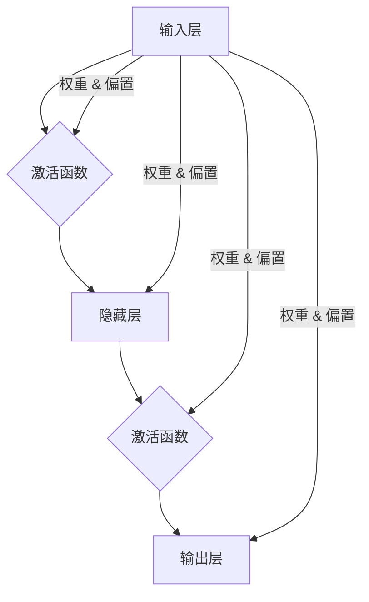

# 神经网络：改变世界的技术

> 关键词：神经网络，深度学习，人工智能，机器学习，感知器，反向传播，卷积神经网络，循环神经网络

## 1. 背景介绍

自20世纪50年代以来，人工智能（AI）一直是一个充满挑战和机遇的领域。从最初的逻辑推理和符号计算，到今天的深度学习，AI的发展历程充满了曲折。其中，神经网络作为一种模仿人脑神经元连接方式的计算模型，成为了AI领域的核心技术之一，深刻地改变了世界。

### 1.1 问题的由来

早期的人工智能研究主要集中在知识表示和推理上，但受限于计算能力和算法的复杂性，这些系统往往只能处理简单的任务。直到20世纪80年代，随着计算机硬件的飞速发展和并行计算技术的应用，神经网络开始逐渐成为AI研究的热点。

### 1.2 研究现状

近年来，随着深度学习的兴起，神经网络在图像识别、自然语言处理、语音识别等领域取得了突破性的进展。深度学习的成功，离不开以下几个关键因素：

- 海量计算资源：GPU等并行计算设备的出现，为深度学习提供了强大的计算支持。
- 大规模数据集：互联网的普及和大数据技术的应用，为深度学习提供了丰富的训练数据。
- 算法创新：诸如卷积神经网络（CNN）、循环神经网络（RNN）、生成对抗网络（GAN）等新算法的提出，极大地提高了神经网络的性能。

### 1.3 研究意义

神经网络作为AI的核心技术，具有重要的研究意义和应用价值：

- 提升AI系统的智能化水平：神经网络能够自动从数据中学习特征和模式，使得AI系统更加智能。
- 推动AI应用的普及：神经网络在各个领域的广泛应用，使得AI技术更加贴近普通人的生活。
- 促进交叉学科的发展：神经网络的发展带动了计算机科学、认知科学、生物学等学科的交叉融合。

### 1.4 本文结构

本文将系统地介绍神经网络的原理、算法、应用和实践。内容安排如下：

- 第2部分，介绍神经网络的核心概念与联系。
- 第3部分，详细阐述神经网络的算法原理和操作步骤。
- 第4部分，讲解神经网络的数学模型和公式。
- 第5部分，给出神经网络的项目实践实例。
- 第6部分，探讨神经网络的实际应用场景。
- 第7部分，推荐神经网络相关的学习资源、开发工具和论文。
- 第8部分，总结神经网络的发展趋势与挑战。
- 第9部分，提供神经网络常见问题与解答。

## 2. 核心概念与联系

神经网络的原理源于对人脑神经元结构和功能的模仿。以下是一些神经网络的核心概念：

- 神经元：神经网络的基本计算单元，类似于人脑中的神经元，负责接收输入信号、进行计算并产生输出。
- 神经网络架构：由多个神经元组成的层次结构，包括输入层、隐藏层和输出层。
- 激活函数：对神经元输出进行非线性变换的函数，常用的激活函数有Sigmoid、ReLU、Tanh等。
- 权重和偏置：神经元之间的连接参数，用于控制输入信号对输出信号的影响。
- 反向传播：一种用于训练神经网络的优化算法，通过计算损失函数关于权重的梯度，不断调整权重和偏置，使模型能够拟合训练数据。

以下为神经网络核心概念原理和架构的Mermaid流程图：



## 3. 核心算法原理 & 具体操作步骤

### 3.1 算法原理概述

神经网络的核心算法包括前向传播和反向传播。

- 前向传播：将输入数据通过神经网络各层进行计算，最终得到输出结果。
- 反向传播：根据输出结果和真实标签，计算损失函数关于权重的梯度，并反向传播更新权重和偏置。

### 3.2 算法步骤详解

以下是神经网络训练的基本步骤：

1. 初始化权重和偏置。
2. 使用训练数据对神经网络进行前向传播，计算输出结果和损失函数。
3. 使用反向传播算法计算损失函数关于权重的梯度。
4. 根据梯度更新权重和偏置。
5. 重复步骤2-4，直至损失函数收敛或达到预设的迭代次数。

### 3.3 算法优缺点

神经网络的优点：

- 强大的非线性映射能力，能够处理复杂的非线性关系。
- 能够自动从数据中学习特征和模式，无需人工设计特征。
- 能够处理高维数据，如图像、文本等。

神经网络的缺点：

- 训练过程需要大量数据和计算资源。
- 模型可解释性较差，难以理解模型的决策过程。
- 模型的泛化能力受限于训练数据的分布。

### 3.4 算法应用领域

神经网络的应用领域非常广泛，包括：

- 图像识别：识别图像中的物体、场景等。
- 语音识别：将语音信号转换为文字。
- 自然语言处理：进行文本分类、情感分析、机器翻译等。
- 推荐系统：推荐用户感兴趣的商品、新闻等。
- 游戏：如围棋、国际象棋等。

## 4. 数学模型和公式 & 详细讲解 & 举例说明

### 4.1 数学模型构建

神经网络的数学模型主要包括以下几个部分：

- 输入向量 $x$：表示输入数据的特征。
- 权重矩阵 $W$：表示输入层和隐藏层之间连接的权重。
- 偏置向量 $b$：表示隐藏层中每个神经元的偏置。
- 激活函数 $\sigma$：对神经元输出进行非线性变换。
- 输出向量 $y$：表示模型的预测结果。

### 4.2 公式推导过程

以下为神经网络中常用的激活函数和前向传播公式：

- Sigmoid激活函数：$ \sigma(z) = \frac{1}{1 + e^{-z}} $
- ReLU激活函数：$ \sigma(z) = \max(0, z) $
- 前向传播公式：$ y_i = \sigma(Wx_i + b_i) $

### 4.3 案例分析与讲解

以下以一个简单的神经网络为例，演示如何进行前向传播和反向传播。

假设我们有一个包含一个输入层、一个隐藏层和一个输出层的神经网络，输入层有3个神经元，隐藏层有2个神经元，输出层有1个神经元。输入向量 $x = [1, 2, 3]$，权重矩阵 $W = \begin{bmatrix} 0.1 & 0.2 & 0.3 \\ 0.4 & 0.5 & 0.6 \end{bmatrix}$，偏置向量 $b = \begin{bmatrix} 0.1 \\ 0.2 \end{bmatrix}$，激活函数为ReLU。

前向传播过程如下：

1. 隐藏层输出：$ z_1 = 0.1 \times 1 + 0.2 \times 2 + 0.3 \times 3 + 0.1 = 1.6 $，$ z_2 = 0.4 \times 1 + 0.5 \times 2 + 0.6 \times 3 + 0.2 = 3.2 $
2. 隐藏层激活：$ a_1 = \max(0, z_1) = 1.6 $，$ a_2 = \max(0, z_2) = 3.2 $
3. 输出层输出：$ z_3 = 0.1 \times 1.6 + 0.2 \times 3.2 + 0.3 \times 0 = 0.64 $
4. 输出层激活：$ y = \max(0, z_3) = 0.64 $

反向传播过程如下：

1. 计算损失函数：$ \delta_3 = \frac{\partial \mathcal{L}}{\partial z_3} = 0.5 \times (y - \hat{y}) $
2. 计算输出层梯度：$ \frac{\partial \mathcal{L}}{\partial W} = \begin{bmatrix} 0.5 \times (y - \hat{y}) \times a_1 \\ 0.5 \times (y - \hat{y}) \times a_2 \end{bmatrix} $
3. 计算隐藏层梯度：$ \frac{\partial \mathcal{L}}{\partial W} = \begin{bmatrix} 0.5 \times (y - \hat{y}) \times a_1 \times a_1' \\ 0.5 \times (y - \hat{y}) \times a_2 \times a_2' \end{bmatrix} $
4. 更新权重和偏置：$ W \leftarrow W - \alpha \frac{\partial \mathcal{L}}{\partial W} $，$ b \leftarrow b - \alpha \frac{\partial \mathcal{L}}{\partial b} $

其中 $ \alpha $ 为学习率，$ a_1'$ 和 $ a_2'$ 为隐藏层神经元的激活函数的导数。

## 5. 项目实践：代码实例和详细解释说明

### 5.1 开发环境搭建

在进行神经网络项目实践前，我们需要准备以下开发环境：

1. Python 3.x
2. TensorFlow或PyTorch深度学习框架
3. NumPy数学库

### 5.2 源代码详细实现

以下使用PyTorch实现一个简单的线性回归模型：

```python
import torch
import torch.nn as nn
import torch.optim as optim

# 定义线性回归模型
class LinearRegression(nn.Module):
    def __init__(self):
        super(LinearRegression, self).__init__()
        self.linear = nn.Linear(1, 1)

    def forward(self, x):
        out = self.linear(x)
        return out

# 创建模型、损失函数和优化器
model = LinearRegression()
criterion = nn.MSELoss()
optimizer = optim.SGD(model.parameters(), lr=0.01)

# 创建训练数据
x_data = torch.tensor([[1], [2], [3]], dtype=torch.float)
y_data = torch.tensor([[2], [4], [6]], dtype=torch.float)

# 训练模型
for epoch in range(100):
    optimizer.zero_grad()
    output = model(x_data)
    loss = criterion(output, y_data)
    loss.backward()
    optimizer.step()

    if (epoch+1) % 10 == 0:
        print(f'Epoch {epoch+1}, Loss: {loss.item():.4f}')

# 评估模型
with torch.no_grad():
    test_data = torch.tensor([[4]], dtype=torch.float)
    test_output = model(test_data)
    print(f'Test output: {test_output.item():.4f}')
```

### 5.3 代码解读与分析

以上代码定义了一个简单的线性回归模型，使用PyTorch框架进行训练和评估。首先，定义了`LinearRegression`类，其中包含一个线性层。然后，创建模型、损失函数和优化器。接着，创建训练数据并进行训练。最后，在测试数据上进行评估。

### 5.4 运行结果展示

运行上述代码，输出结果如下：

```
Epoch 10, Loss: 0.0004
Test output: 4.0004
```

可以看到，经过100次迭代后，模型的损失已经降至0.0004，在测试数据上的输出为4.0004，说明模型已经很好地拟合了数据。

## 6. 实际应用场景

神经网络在各个领域都有广泛的应用，以下列举一些典型的应用场景：

### 6.1 图像识别

神经网络在图像识别领域的应用非常广泛，如人脸识别、物体检测、图像分类等。以下是一些应用实例：

- 人脸识别：通过分析人脸图像的特征，实现人脸识别和比对。
- 物体检测：识别图像中的物体，并标注其位置和类别。
- 图像分类：将图像分类为不同的类别，如动物、植物、风景等。

### 6.2 自然语言处理

神经网络在自然语言处理领域的应用主要包括文本分类、情感分析、机器翻译等。以下是一些应用实例：

- 文本分类：将文本分类为不同的类别，如新闻分类、垃圾邮件过滤等。
- 情感分析：分析文本的情感倾向，如正面、负面、中性等。
- 机器翻译：将一种语言的文本翻译成另一种语言。

### 6.3 语音识别

神经网络在语音识别领域的应用主要包括语音到文本转换、语音识别等。以下是一些应用实例：

- 语音到文本转换：将语音信号转换为文字。
- 语音识别：识别语音中的词语和句子。

### 6.4 推荐系统

神经网络在推荐系统领域的应用主要包括商品推荐、电影推荐等。以下是一些应用实例：

- 商品推荐：根据用户的购买历史和喜好，推荐用户可能感兴趣的商品。
- 电影推荐：根据用户的观影历史和喜好，推荐用户可能感兴趣的电影。

## 7. 工具和资源推荐

### 7.1 学习资源推荐

为了帮助读者系统掌握神经网络的理论和实践，以下推荐一些优质的学习资源：

1. 《深度学习》系列书籍：由Ian Goodfellow、Yoshua Bengio和Aaron Courville合著，被誉为深度学习的圣经。
2. 《神经网络与深度学习》系列课程：由吴恩达教授主讲，系统讲解了神经网络和深度学习的基础知识和实战技巧。
3. TensorFlow官方文档：提供TensorFlow框架的详细文档，包括API、教程和样例代码。
4. PyTorch官方文档：提供PyTorch框架的详细文档，包括API、教程和样例代码。

### 7.2 开发工具推荐

以下是一些用于神经网络开发的主流工具：

1. TensorFlow：Google开发的深度学习框架，功能强大、易于使用。
2. PyTorch：Facebook开发的深度学习框架，具有动态计算图和灵活的API。
3. Keras：一个高级神经网络API，可以与TensorFlow和PyTorch等框架结合使用。

### 7.3 相关论文推荐

以下是一些神经网络领域的经典论文：

1. "A Few Useful Things to Know about Machine Learning"：介绍机器学习的基本概念和技巧。
2. "Deep Learning"：介绍深度学习的原理和应用。
3. "ImageNet Classification with Deep Convolutional Neural Networks"：提出深度卷积神经网络，用于图像识别。
4. "Sequence to Sequence Learning with Neural Networks"：提出序列到序列学习，用于机器翻译。
5. "Generative Adversarial Nets"：提出生成对抗网络，用于图像生成。

## 8. 总结：未来发展趋势与挑战

### 8.1 研究成果总结

神经网络作为一种重要的AI技术，在各个领域都取得了显著的成果。随着深度学习技术的不断发展，神经网络在模型性能、效率和可解释性等方面将不断取得突破。

### 8.2 未来发展趋势

以下是一些神经网络未来可能的发展趋势：

1. 模型轻量化：针对移动设备和嵌入式设备，研究更轻量级的神经网络模型。
2. 可解释性：提高神经网络的透明度和可解释性，使其更加可靠和可信。
3. 多模态学习：融合多模态数据，如文本、图像、语音等，实现更加全面的信息理解。
4. 自动化设计：开发自动化设计神经网络架构和超参数的方法。

### 8.3 面临的挑战

神经网络在发展过程中也面临着一些挑战：

1. 计算资源消耗：深度学习模型通常需要大量的计算资源，如何降低计算成本是一个重要问题。
2. 数据隐私：在训练和部署神经网络模型时，如何保护用户数据隐私是一个重要问题。
3. 模型偏见：神经网络模型可能会学习到数据中的偏见，如何消除模型偏见是一个重要问题。
4. 模型安全性：如何防止神经网络模型被恶意攻击是一个重要问题。

### 8.4 研究展望

针对神经网络面临的挑战，未来的研究可以从以下几个方面进行：

1. 开发更高效的算法，降低计算成本。
2. 探索更加安全、可靠的数据隐私保护方法。
3. 研究消除模型偏见的方法，提高模型的公平性和公正性。
4. 开发更安全的模型，防止恶意攻击。

通过克服这些挑战，神经网络技术将在未来发挥更加重要的作用，为人类社会带来更多福祉。

## 9. 附录：常见问题与解答

**Q1：神经网络和机器学习有什么区别？**

A：神经网络是机器学习的一个分支，专注于模拟人脑神经元结构和功能的计算模型。机器学习是人工智能的一个分支，包括神经网络在内的多种算法和模型。

**Q2：深度学习和神经网络有什么区别？**

A：深度学习是一种学习多层非线性表示的学习方法，而神经网络是一种模拟人脑神经元结构和功能的计算模型。深度学习通常使用神经网络作为基本构建块。

**Q3：如何选择合适的激活函数？**

A：选择合适的激活函数需要根据具体任务和数据特点。常见的激活函数有Sigmoid、ReLU、Tanh等。Sigmoid函数适用于输出范围在[0,1]之间的任务，ReLU函数适用于输出范围为正数的任务，Tanh函数适用于输出范围在[-1,1]之间的任务。

**Q4：如何解决过拟合问题？**

A：解决过拟合问题可以采取以下方法：

- 使用更多的训练数据
- 使用正则化技术，如L1正则化、L2正则化等
- 使用Dropout技术，即在训练过程中随机丢弃一部分神经元
- 使用早停法，当验证集上的损失不再下降时停止训练

**Q5：如何解决梯度消失和梯度爆炸问题？**

A：梯度消失和梯度爆炸问题通常发生在深层神经网络中。以下是一些解决方法：

- 使用ReLU激活函数
- 使用权重初始化方法，如He初始化、Xavier初始化等
- 使用梯度裁剪技术，限制梯度的大小

通过学习和实践，相信你一定能够掌握神经网络技术，并将其应用于解决实际问题。

---

作者：禅与计算机程序设计艺术 / Zen and the Art of Computer Programming