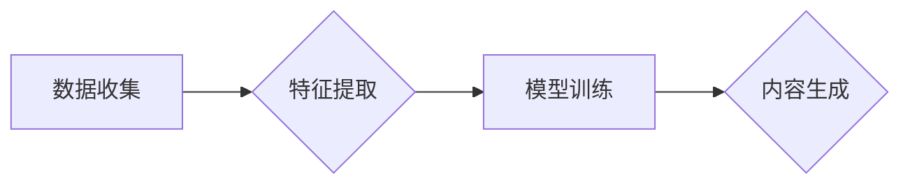

# 生成式AIGC：数据驱动的商业创新

> 关键词：生成式AI，AIGC，人工智能生成内容，数据驱动，商业创新，深度学习，自然语言处理，计算机视觉

## 1. 背景介绍

随着人工智能技术的飞速发展，深度学习、自然语言处理、计算机视觉等领域的突破性进展，使得人工智能从被动地处理数据转变为主动地生成内容。生成式人工智能（AIGC，Artificial Intelligence Generated Content）应运而生，它代表着人工智能从“数据消费者”到“内容创造者”的转变。AIGC能够根据输入数据和预设规则，自主生成文本、图像、音频、视频等多样化内容，为商业创新提供了前所未有的可能性。

### 1.1 AIGC的兴起

近年来，AIGC技术在全球范围内得到了广泛关注。一方面，随着计算能力的提升和算法的优化，AIGC的生成质量不断提高；另一方面，海量的数据资源和云服务的普及，为AIGC的实践提供了坚实的基础。AIGC的兴起，标志着人工智能从工具到平台的转变，为商业创新带来了新的机遇。

### 1.2 AIGC的商业价值

AIGC在商业领域具有广泛的应用前景，以下是一些关键的商业价值：

- **降低内容生产成本**：AIGC可以自动生成大量高质量的内容，减少人力成本，提高内容生产效率。
- **提升个性化体验**：AIGC可以根据用户需求生成个性化的内容，提升用户体验和满意度。
- **加速产品创新**：AIGC可以辅助设计师、创意人员等，快速生成创意方案，加速产品创新。
- **拓展商业领域**：AIGC可以应用于新的商业场景，拓展企业业务范围，创造新的商业模式。

## 2. 核心概念与联系

### 2.1 核心概念原理

AIGC的核心概念是利用人工智能技术自动生成内容。其原理可以概括为以下几个步骤：

1. **数据收集**：收集大量的相关数据，如文本、图像、音频等。
2. **特征提取**：从数据中提取关键特征，为生成提供基础。
3. **模型训练**：使用深度学习模型学习数据的特征和规律。
4. **内容生成**：根据输入数据和模型生成的特征，生成新的内容。

### 2.2 核心概念架构

以下是AIGC的核心概念架构的Mermaid流程图：



### 2.3 核心概念联系

AIGC的核心概念联系体现在以下几个方面：

- **数据与模型**：数据是AIGC的基础，模型是AIGC的核心。良好的数据质量和高效的模型算法是AIGC成功的关键。
- **生成与优化**：AIGC的生成过程是一个不断迭代优化的过程。通过用户反馈和自动优化算法，可以不断提高生成内容的品质。
- **应用与场景**：AIGC的应用场景非常广泛，包括但不限于内容创作、产品设计、广告营销等。

## 3. 核心算法原理 & 具体操作步骤

### 3.1 算法原理概述

AIGC的核心算法主要包括以下几种：

- **生成对抗网络（GAN）**：GAN由生成器和判别器组成，通过对抗训练生成逼真的图像、音频和视频等内容。
- **变分自编码器（VAE）**：VAE通过编码器和解码器学习数据的潜在空间，从而生成新的数据。
- **自回归语言模型**：自回归语言模型通过预测下一个单词来生成文本内容。
- **循环神经网络（RNN）**：RNN能够处理序列数据，适用于生成文本、时间序列等。

### 3.2 算法步骤详解

AIGC的具体操作步骤如下：

1. **数据收集**：收集相关的数据，如文本、图像、音频等。
2. **数据预处理**：对数据进行清洗、去重、标注等预处理操作。
3. **特征提取**：使用特征提取算法提取数据的关键特征。
4. **模型训练**：选择合适的模型算法进行训练，如GAN、VAE、自回归语言模型等。
5. **内容生成**：根据输入数据和模型生成的特征，生成新的内容。
6. **内容优化**：根据用户反馈和自动优化算法，对生成内容进行迭代优化。
7. **应用部署**：将AIGC应用到实际场景中。

### 3.3 算法优缺点

AIGC的算法优缺点如下：

- **优点**：
  - 生成内容丰富多样，能够满足不同的需求。
  - 自动化程度高，能够节省人力成本。
  - 生成内容质量高，能够满足商业需求。
- **缺点**：
  - 模型训练需要大量的计算资源和时间。
  - 生成内容的多样性和创造性有限。
  - 难以保证生成内容的真实性和准确性。

### 3.4 算法应用领域

AIGC的算法应用领域包括：

- **文本生成**：如自动新闻写作、聊天机器人、机器翻译等。
- **图像生成**：如图像编辑、图像生成、风格迁移等。
- **音频生成**：如音乐生成、语音合成等。
- **视频生成**：如视频编辑、视频生成、视频效果等。

## 4. 数学模型和公式 & 详细讲解 & 举例说明

### 4.1 数学模型构建

AIGC的数学模型主要包括以下几种：

- **GAN**：
  - 生成器：$G(z)$，将随机噪声映射到数据空间。
  - 判别器：$D(x)$，判断数据是真实样本还是生成样本。
- **VAE**：
  - 编码器：$E(x)$，将数据映射到潜在空间。
  - 解码器：$D(z)$，将潜在空间的数据映射回数据空间。

### 4.2 公式推导过程

以下以GAN为例，介绍数学公式的推导过程：

- **生成器损失函数**：
  $$L_G = -\mathbb{E}_{z\sim p(z)}[\log D(G(z))]$$
- **判别器损失函数**：
  $$L_D = \mathbb{E}_{x\sim p(x)}[\log D(x)] + \mathbb{E}_{z\sim p(z)}[\log(1-D(G(z))]$$

### 4.3 案例分析与讲解

以下以文本生成为例，分析AIGC的应用。

- **数据收集**：收集大量的文本数据，如新闻、小说、文章等。
- **数据预处理**：对数据进行清洗、去重、标注等预处理操作。
- **特征提取**：使用词嵌入等技术提取文本的语义特征。
- **模型训练**：使用自回归语言模型进行训练。
- **内容生成**：根据输入数据和模型生成的特征，生成新的文本内容。
- **内容优化**：根据用户反馈和自动优化算法，对生成内容进行迭代优化。

## 5. 项目实践：代码实例和详细解释说明

### 5.1 开发环境搭建

以下是使用Python进行AIGC项目开发的环境配置流程：

1. 安装Anaconda：从官网下载并安装Anaconda，用于创建独立的Python环境。
2. 激活虚拟环境：
   ```bash
   conda create -n aigc-env python=3.8
   conda activate aigc-env
   ```
3. 安装必要的库：
   ```bash
   conda install torch transformers datasets
   ```

### 5.2 源代码详细实现

以下是一个简单的文本生成项目示例：

```python
from transformers import AutoModelForCausalLM, AutoTokenizer

model_name = "t5-small"
tokenizer = AutoTokenizer.from_pretrained(model_name)
model = AutoModelForCausalLM.from_pretrained(model_name)

def generate_text(prompt, max_length=50):
    input_ids = tokenizer.encode(prompt, return_tensors="pt").to("cuda")
    output_sequences = model.generate(
        input_ids=input_ids,
        max_length=max_length,
        num_return_sequences=5,
        no_repeat_ngram_size=2,
        temperature=0.7,
    )
    return [tokenizer.decode(sequence, skip_special_tokens=True) for sequence in output_sequences]

prompt = "今天天气"
print(generate_text(prompt))
```

### 5.3 代码解读与分析

- `AutoTokenizer`和`AutoModelForCausalLM`：从Hugging Face的Transformers库中加载预训练模型和分词器。
- `generate_text`函数：根据输入提示生成文本。
- `prompt`：输入提示，用于控制生成文本的主题和风格。
- `max_length`：生成文本的最大长度。
- `num_return_sequences`：生成文本的数量。
- `no_repeat_ngram_size`：避免重复n-gram的长度。
- `temperature`：控制文本生成的随机性。

### 5.4 运行结果展示

假设输入提示为“今天天气”，运行上述代码，可以得到以下生成文本：

```
今天天气很好，阳光明媚，微风拂面。
今天天气晴朗，阳光明媚，心情愉悦。
今天天气寒冷，北风呼啸，裹紧外套。
今天天气阴沉，灰蒙蒙的天空，心情低落。
今天天气炎热，酷热难耐，空调开足。
```

## 6. 实际应用场景

### 6.1 内容创作

AIGC在内容创作领域具有广泛的应用，如：

- **自动新闻写作**：根据新闻数据自动生成新闻稿件。
- **广告文案生成**：根据广告需求自动生成广告文案。
- **创意写作**：辅助作家、诗人等进行创意写作。

### 6.2 产品设计

AIGC可以辅助设计师进行以下工作：

- **图像设计**：自动生成图像，如海报、Logo等。
- **3D建模**：自动生成3D模型，如产品原型、室内设计等。

### 6.3 教育培训

AIGC可以应用于以下教育培训场景：

- **个性化学习**：根据学生的学习情况，自动生成个性化学习内容。
- **虚拟教师**：通过语音、图像等方式，模拟真实教师进行教学。

## 7. 工具和资源推荐

### 7.1 学习资源推荐

- **《深度学习》**：Goodfellow等著，介绍了深度学习的基本概念和常用算法。
- **《自然语言处理综论》**：Jurafsky和Martin著，介绍了自然语言处理的基本理论和应用。
- **《计算机视觉：算法与应用》**：Duda等著，介绍了计算机视觉的基本原理和应用。

### 7.2 开发工具推荐

- **TensorFlow**：Google开源的深度学习框架，功能强大，社区活跃。
- **PyTorch**：Facebook开源的深度学习框架，易于使用，灵活性强。
- **Hugging Face Transformers**：一个基于PyTorch的NLP工具库，提供大量预训练模型和任务。

### 7.3 相关论文推荐

- **"Generative Adversarial Nets"**：Goodfellow等提出的GAN算法。
- **"Unsupervised Representation Learning with Deep Convolutional Generative Adversarial Networks"**：Radford等提出的VAE算法。
- **"Attention Is All You Need"**：Vaswani等提出的Transformer模型。

## 8. 总结：未来发展趋势与挑战

### 8.1 研究成果总结

AIGC作为一种新兴技术，已经取得了显著的成果。在文本生成、图像生成、音频生成等领域，AIGC都取得了令人瞩目的成绩。AIGC在商业领域的应用前景广阔，能够为企业和个人创造巨大的价值。

### 8.2 未来发展趋势

未来AIGC的发展趋势主要包括以下几个方面：

- **模型规模扩大**：随着计算能力的提升，AIGC模型的规模将进一步扩大，生成内容的质量和多样性将得到进一步提升。
- **多模态融合**：AIGC将与其他人工智能技术（如计算机视觉、语音识别等）进行融合，生成多模态内容。
- **个性化生成**：AIGC将更加注重个性化生成，满足不同用户的需求。
- **可解释性增强**：AIGC的可解释性将得到增强，为用户和开发者提供更可靠的保障。

### 8.3 面临的挑战

AIGC在发展过程中也面临着一些挑战：

- **数据质量**：AIGC的生成内容质量很大程度上取决于数据质量。如何获取高质量的数据，是AIGC发展的重要问题。
- **算法优化**：AIGC的算法优化是一个持续的过程，如何提高算法的效率和精度，是AIGC发展的重要挑战。
- **伦理问题**：AIGC的生成内容可能存在偏见、歧视等问题，如何解决这些问题，是AIGC发展的重要课题。

### 8.4 研究展望

未来，AIGC将在以下几个方面进行深入研究：

- **数据质量提升**：研究如何从非结构化数据中提取高质量的特征。
- **算法创新**：研究更高效的算法，提高AIGC的生成质量和效率。
- **伦理规范**：制定AIGC的伦理规范，确保其健康发展。

## 9. 附录：常见问题与解答

**Q1：AIGC的生成内容是否具有真实性？**

A：AIGC的生成内容在一定程度上具有真实性，但并不完全等同于真实内容。AIGC生成的内容是基于大量数据学习和生成的，可能存在偏差、误解等问题。

**Q2：AIGC是否会替代人类创造者？**

A：AIGC是一种工具，可以帮助人类创造者提高效率，但并不能完全替代人类创造者。AIGC的发展需要人类的指导和监督。

**Q3：AIGC在商业领域有哪些应用场景？**

A：AIGC在商业领域具有广泛的应用场景，如内容创作、产品设计、教育培训等。

**Q4：AIGC的伦理问题如何解决？**

A：解决AIGC的伦理问题需要从多个层面进行，包括数据质量、算法设计、伦理规范等。

作者：禅与计算机程序设计艺术 / Zen and the Art of Computer Programming