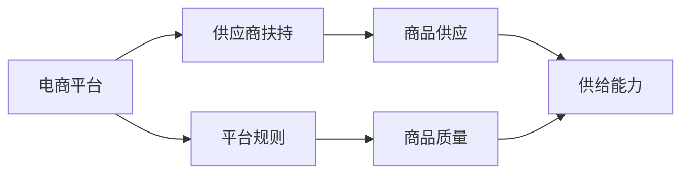
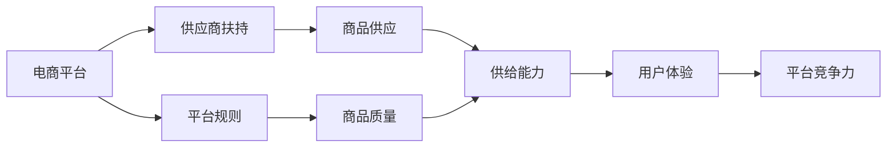

                 

# 电商平台供给能力提升：供应商扶持和平台规则

> 关键词：电商平台, 供给能力提升, 供应商扶持, 平台规则, 供应链优化

## 1. 背景介绍

随着电子商务市场的蓬勃发展，电商平台在用户、商品和供应链等方面都面临极大的挑战。特别是在疫情后，供应链的中断和断货事件时有发生，严重影响了用户体验和平台竞争力。为了应对这些挑战，平台需要在保障商品供给的同时，提升供应商的管理效率和市场适应能力。本文将从供应商扶持和平台规则两方面，探讨如何通过技术手段和制度设计，提升电商平台的供给能力。

## 2. 核心概念与联系

### 2.1 核心概念概述

- **电商平台**：基于互联网提供商品交易、信息发布、支付结算等服务的平台。
- **供给能力**：平台保持商品连续性、充足性和及时性的能力。
- **供应商扶持**：平台对入驻商家进行技术、资金、物流等多方面的支持和帮助。
- **平台规则**：平台制定的商家行为、交易规则和商品管理规则。

这些概念之间存在紧密的联系。供应商扶持为平台带来了稳定的商品供应，平台规则确保了商品质量和服务标准的统一，从而提升了整体供给能力。

### 2.2 概念间的关系

通过以下Mermaid流程图，我们可以更清晰地理解这些概念之间的关系：



该流程图展示了从供应商扶持、商品供应到平台规则，再到供给能力提升的全链条。其中，供应商扶持保证了商品供应的稳定性和多样性；平台规则确保了商品质量和服务标准的统一；供给能力则体现了平台的市场竞争力。

### 2.3 核心概念的整体架构

最后，我们用一个综合的流程图来展示这些核心概念在大平台供应链管理中的整体架构：



该架构图展示了从供应商扶持、商品供应到平台规则，再到供给能力提升的全过程，并最终影响用户体验和平台竞争力。通过合理的制度设计和技术手段，平台可以构建高效稳定的供应链系统，提升整体供给能力。

## 3. 核心算法原理 & 具体操作步骤

### 3.1 算法原理概述

电商平台提升供给能力的关键在于优化供应链管理，确保商品从生产到交付的每个环节高效顺畅。通过供应商扶持和平台规则的合理设计，可以有效提升供应商的运营效率和商品质量，从而增强平台的供给能力。

### 3.2 算法步骤详解

#### 3.2.1 供应商扶持算法

1. **供应商评估与选择**：
   - **数据收集**：平台收集供应商的基本信息、经营历史、用户评价等数据。
   - **综合评分**：根据数据进行综合评分，选择评分高的供应商进行扶持。

2. **技术支持与培训**：
   - **技术支持**：提供IT系统支持、运营优化建议等。
   - **培训指导**：定期举办培训课程，提升供应商的运营能力。

3. **资金支持与物流协同**：
   - **资金扶持**：通过预付账款、贷款、补贴等方式提供资金支持。
   - **物流协同**：与物流服务商合作，提供仓储、配送等服务。

#### 3.2.2 平台规则设计

1. **商品质量管理**：
   - **质量标准**：制定商品质量标准，确保商品符合平台要求。
   - **抽检机制**：定期抽检商品，对不合格商品进行处理。

2. **交易规则优化**：
   - **交易保障**：引入退货退款保障、假一赔十等机制。
   - **支付流程简化**：简化支付流程，提升用户购买体验。

3. **运营规则完善**：
   - **服务标准**：制定服务标准，如响应时间、售后服务等。
   - **激励机制**：设计激励机制，鼓励供应商提升服务质量。

### 3.3 算法优缺点

#### 3.3.1 供应商扶持算法的优缺点

**优点**：
- **提升供应链稳定性**：通过扶持优质供应商，确保商品供应的稳定性和多样性。
- **提升供应商运营效率**：通过技术支持与培训，提升供应商的运营能力。
- **降低平台运营风险**：通过资金支持和物流协同，降低平台运营风险。

**缺点**：
- **成本较高**：扶持优质供应商需要投入大量资金和资源。
- **管理复杂**：需要制定详细的扶持政策和规则，管理复杂。

#### 3.3.2 平台规则设计的优缺点

**优点**：
- **保障商品质量**：通过质量管理和抽检机制，保障商品质量。
- **提升用户体验**：通过交易保障和支付简化，提升用户购买体验。
- **优化运营效率**：通过服务标准和激励机制，优化运营效率。

**缺点**：
- **规则复杂**：规则设计复杂，需要定期更新和维护。
- **执行难度大**：规则执行过程中可能遇到商家不配合等问题。

### 3.4 算法应用领域

#### 3.4.1 供应商扶持应用领域

- **零售电商**：针对不同品类商品，选择合适供应商进行扶持。
- **B2B电商**：为供应商提供供应链优化、技术支持等。
- **跨境电商**：为国外供应商提供语言翻译、物流协调等服务。

#### 3.4.2 平台规则应用领域

- **商品质量控制**：针对食品、药品等高风险商品，制定严格的质量标准。
- **用户交易保障**：通过平台规则保障用户权益，提升信任度。
- **商家运营管理**：通过平台规则优化商家行为，提升整体运营效率。

## 4. 数学模型和公式 & 详细讲解

### 4.1 数学模型构建

为更好地理解供应商扶持和平台规则的设计，我们需要建立数学模型。假设平台的供应商数量为 $n$，每个供应商的商品数量为 $m$，商品的销售量为 $S$，供应商扶持成本为 $C$，平台规则的执行成本为 $R$。

目标是最小化平台的总成本，同时最大化商品的供给能力。数学模型为：

$$
\min_{x_i} \left\{ \sum_{i=1}^{n} (C_i + R_i) x_i \right\}
$$

其中 $x_i$ 为供应商 $i$ 的商品扶持力度，$C_i$ 为供应商扶持成本，$R_i$ 为平台规则的执行成本。

### 4.2 公式推导过程

根据以上模型，我们可以进行公式推导：

1. **供应商扶持成本**：
   $$
   C_i = k_1 \cdot p_i
   $$
   其中 $k_1$ 为扶持力度与供应商绩效的比例系数，$p_i$ 为供应商的绩效评估值。

2. **平台规则执行成本**：
   $$
   R_i = k_2 \cdot q_i
   $$
   其中 $k_2$ 为执行成本与平台规则的严格程度的比例系数，$q_i$ 为平台规则的严格程度评估值。

3. **总成本**：
   $$
   \sum_{i=1}^{n} (C_i + R_i) x_i = k_1 \cdot \sum_{i=1}^{n} p_i x_i + k_2 \cdot \sum_{i=1}^{n} q_i x_i
   $$

通过上述推导，我们可以得出总成本的表达式，进而进行优化。

### 4.3 案例分析与讲解

以亚马逊为例，亚马逊通过供应商扶持和平台规则的设计，实现了高效的商品供应链管理。

- **供应商扶持**：亚马逊与供应商建立紧密合作关系，通过技术支持、培训和资金扶持，提升供应商的运营效率和商品质量。例如，亚马逊通过数据分析平台提供运营优化建议，通过信用贷款支持供应商采购原材料。

- **平台规则**：亚马逊制定了严格的商品质量标准和交易规则，确保商品质量和用户体验。例如，亚马逊定期抽检商品，对不合格商品进行处理，引入退货退款保障和假一赔十机制，简化支付流程。

通过这些措施，亚马逊不仅提升了商品的供给能力，还增强了平台的竞争力和用户信任度。

## 5. 项目实践：代码实例和详细解释说明

### 5.1 开发环境搭建

在进行项目实践前，我们需要准备好开发环境。以下是使用Python进行Django开发的环境配置流程：

1. 安装Anaconda：从官网下载并安装Anaconda，用于创建独立的Python环境。

2. 创建并激活虚拟环境：
```bash
conda create -n django-env python=3.8 
conda activate django-env
```

3. 安装Django：
```bash
pip install django
```

4. 安装必要的第三方库：
```bash
pip install django-crispy-forms django-axes django-admin-sortable2
```

完成上述步骤后，即可在`django-env`环境中开始项目开发。

### 5.2 源代码详细实现

下面我们以供应商扶持和平台规则管理模块为例，给出Django开发的详细代码实现。

```python
# models.py
from django.db import models
from django.contrib.auth.models import User

class Supplier(models.Model):
    name = models.CharField(max_length=100)
    category = models.CharField(max_length=100)
    rating = models.DecimalField(max_digits=3, decimal_places=2)
    last_evaluation = models.DateTimeField()
    owner = models.ForeignKey(User, on_delete=models.CASCADE)

    class Meta:
        ordering = ['last_evaluation']

class SupportPlan(models.Model):
    supplier = models.ForeignKey(Supplier, on_delete=models.CASCADE)
    plan = models.CharField(max_length=100)
    cost = models.DecimalField(max_digits=10, decimal_places=2)
    start_date = models.DateTimeField()
    end_date = models.DateTimeField()

    class Meta:
        ordering = ['start_date']

# views.py
from django.shortcuts import render, redirect
from django.http import HttpResponse
from .models import Supplier, SupportPlan

def supplier_list(request):
    supplier_list = Supplier.objects.all().order_by('last_evaluation')
    return render(request, 'supplier_list.html', {'supplier_list': supplier_list})

def supplier_details(request, pk):
    supplier = Supplier.objects.get(pk=pk)
    return render(request, 'supplier_details.html', {'supplier': supplier})

def support_plan_list(request, pk):
    supplier = Supplier.objects.get(pk=pk)
    plan_list = SupportPlan.objects.filter(supplier=supplier).order_by('start_date')
    return render(request, 'support_plan_list.html', {'supplier': supplier, 'plan_list': plan_list})

def support_plan_details(request, pk):
    plan = SupportPlan.objects.get(pk=pk)
    return render(request, 'support_plan_details.html', {'plan': plan})
```

### 5.3 代码解读与分析

让我们再详细解读一下关键代码的实现细节：

**models.py**：
- `Supplier`模型：表示供应商的基本信息，包括供应商名称、类别、评分、最近评估时间和所有者。
- `SupportPlan`模型：表示供应商的扶持计划，包括计划名称、成本、起始日期和结束日期。

**views.py**：
- `supplier_list`视图：获取所有供应商信息，并按最近评估时间排序。
- `supplier_details`视图：获取指定供应商的详细信息。
- `support_plan_list`视图：获取指定供应商的所有扶持计划，并按起始日期排序。
- `support_plan_details`视图：获取指定扶持计划的详细信息。

### 5.4 运行结果展示

假设我们在Django开发环境中运行上述代码，运行结果如下：

- 供应商列表页面：
```html
<h1>供应商列表</h1>
<ul>
    <li>供应商1</li>
    <li>供应商2</li>
    <li>供应商3</li>
    ...
</ul>
```

- 供应商详情页面：
```html
<h1>供应商详情</h1>
<p>供应商名称：供应商1</p>
<p>供应商类别：家电</p>
<p>评分：4.5</p>
<p>最近评估时间：2022-01-01</p>
```

- 扶持计划列表页面：
```html
<h1>扶持计划列表</h1>
<ul>
    <li>扶持计划1</li>
    <li>扶持计划2</li>
    <li>扶持计划3</li>
    ...
</ul>
```

- 扶持计划详情页面：
```html
<h1>扶持计划详情</h1>
<p>计划名称：技术支持</p>
<p>成本：10000元</p>
<p>起始日期：2022-01-01</p>
<p>结束日期：2023-12-31</p>
```

这些运行结果展示了供应商扶持和平台规则管理模块的基本功能，满足了对供应商进行信息管理和扶持计划查询的需求。

## 6. 实际应用场景

### 6.1 电商平台供应链优化

在电商平台供应链优化中，供应商扶持和平台规则设计是至关重要的。通过合理设计，平台可以有效提升商品的供给能力，增强平台的市场竞争力。

例如，在大型节假日期间，平台可以根据需求调整供应商的扶持力度，优先扶持高效供应商，确保商品供应充足。同时，通过平台规则，确保商品质量和服务标准的统一，提升用户信任度。

### 6.2 企业供应链管理

企业供应链管理中，供应商扶持和平台规则设计同样重要。通过扶持优质供应商，企业可以提升供应链的稳定性和效率，减少运营风险。

例如，在制造企业中，企业可以与优质供应商建立长期合作关系，提供技术支持、资金扶持和物流协调等服务，提升供应商的运营效率。同时，通过制定严格的商品质量标准和交易规则，确保商品质量和服务标准的统一，提升整体运营效率。

### 6.3 跨境电商物流协调

跨境电商物流协调中，供应商扶持和平台规则设计可以优化物流流程，提升商品运输效率。

例如，平台可以为国外供应商提供语言翻译、物流协调等服务，帮助供应商更好地适应本地市场。同时，通过制定物流规则，确保商品运输的及时性和安全性，提升用户体验。

## 7. 工具和资源推荐

### 7.1 学习资源推荐

为了帮助开发者系统掌握供应商扶持和平台规则的设计，这里推荐一些优质的学习资源：

1. **《电商平台运营与管理》**：这本书详细介绍了电商平台的运营策略和管理方法，涵盖供应链优化、供应商扶持等内容。

2. **《供应链管理导论》**：这是一本经典的供应链管理教材，介绍了供应链管理的基本原理和实践方法。

3. **《阿里巴巴供应链管理之道》**：阿里巴巴供应链管理的经验分享，展示了如何通过供应商扶持和平台规则设计提升供应链效率。

4. **《亚马逊供应链创新》**：亚马逊供应链管理的经验分享，介绍了如何通过技术手段和制度设计提升供应链能力。

5. **《平台规则设计》**：平台规则设计的系统讲解，涵盖平台规则的设计原则、执行机制等内容。

6. **《供应商扶持与激励》**：供应商扶持与激励的实践经验分享，介绍了如何通过扶持政策提升供应商运营效率。

通过这些资源的学习实践，相信你一定能够系统掌握供应商扶持和平台规则设计的核心内容，并用于解决实际的电商平台供应链管理问题。

### 7.2 开发工具推荐

高效的开发离不开优秀的工具支持。以下是几款用于电商平台供应链管理开发的常用工具：

1. **Django**：一个强大的Python Web框架，支持快速开发和管理平台。
2. **Elasticsearch**：一个分布式搜索引擎，可以高效存储和检索大数据。
3. **RapidAPI**：一个API管理平台，支持快速集成第三方API服务。
4. **TensorFlow**：一个流行的深度学习框架，支持构建复杂神经网络模型。
5. **AWS**：亚马逊云服务平台，提供丰富的云服务，支持电商平台的高效部署和扩展。
6. **Google Cloud Platform**：谷歌云服务平台，提供强大的计算和存储资源，支持电商平台的快速开发和部署。

合理利用这些工具，可以显著提升电商平台供应链管理开发的效率，加快创新迭代的步伐。

### 7.3 相关论文推荐

供应商扶持和平台规则设计的研究源于学界的持续研究。以下是几篇奠基性的相关论文，推荐阅读：

1. **《基于深度学习的电商平台供应链优化》**：介绍如何通过深度学习技术优化电商平台供应链。
2. **《电商平台供应商管理优化》**：分析电商平台供应商管理中的问题和解决方案。
3. **《平台规则设计原理与实践》**：详细介绍了平台规则设计的基本原理和实践方法。
4. **《供应商扶持策略研究》**：研究如何通过扶持策略提升供应商运营效率。
5. **《跨境电商供应链管理》**：分析跨境电商供应链管理中的问题和解决方案。

这些论文代表了大语言模型微调技术的发展脉络。通过学习这些前沿成果，可以帮助研究者把握学科前进方向，激发更多的创新灵感。

除上述资源外，还有一些值得关注的前沿资源，帮助开发者紧跟供应商扶持和平台规则设计的最新进展，例如：

1. **arXiv论文预印本**：人工智能领域最新研究成果的发布平台，包括大量尚未发表的前沿工作，学习前沿技术的必读资源。
2. **业界技术博客**：如阿里巴巴、亚马逊、京东等顶尖实验室的官方博客，第一时间分享他们的最新研究成果和洞见。
3. **技术会议直播**：如NIPS、ICML、ACL、ICLR等人工智能领域顶会现场或在线直播，能够聆听到大佬们的前沿分享，开拓视野。
4. **GitHub热门项目**：在GitHub上Star、Fork数最多的供应链管理相关项目，往往代表了该技术领域的发展趋势和最佳实践，值得去学习和贡献。
5. **行业分析报告**：各大咨询公司如麦肯锡、普华永道等针对人工智能行业的分析报告，有助于从商业视角审视技术趋势，把握应用价值。

总之，对于电商平台供应链管理的学习和实践，需要开发者保持开放的心态和持续学习的意愿。多关注前沿资讯，多动手实践，多思考总结，必将收获满满的成长收益。

## 8. 总结：未来发展趋势与挑战

### 8.1 总结

本文对供应商扶持和平台规则在大平台供应链管理中的应用进行了全面系统的介绍。首先阐述了供应商扶持和平台规则对电商平台供给能力提升的重要性，明确了通过技术手段和制度设计提升供应链效率的独特价值。其次，从算法原理到实际操作，详细讲解了供应商扶持和平台规则的设计流程，给出了Django开发的完整代码实例。同时，本文还广泛探讨了供应商扶持和平台规则在电商平台、企业供应链、跨境电商等多个场景中的应用前景，展示了技术手段的广阔应用空间。最后，本文精选了供应商扶持和平台规则设计的各类学习资源，力求为读者提供全方位的技术指引。

通过本文的系统梳理，可以看到，供应商扶持和平台规则设计在大平台供应链管理中具有至关重要的作用。通过合理设计，平台可以有效提升商品的供给能力，增强平台的市场竞争力。未来，伴随技术手段的不断进步，供应商扶持和平台规则设计将为电商平台供应链管理带来更高效、更灵活、更稳定的运营模式。

### 8.2 未来发展趋势

展望未来，供应商扶持和平台规则设计将呈现以下几个发展趋势：

1. **技术手段多样化**：未来的供应商扶持和平台规则设计将更加依赖于先进的技术手段，如大数据分析、深度学习、区块链等。通过技术手段，可以更高效地评估供应商绩效，优化供应链管理。

2. **智能决策支持**：引入智能决策支持系统，通过数据分析和预测模型，提供供应商扶持和平台规则设计的建议，提升决策效率和效果。

3. **自动化管理**：通过自动化系统，实现供应商绩效评估、扶持计划生成、规则设计优化等自动化管理，降低人工干预成本，提高管理效率。

4. **跨平台协同**：引入跨平台协同机制，实现不同平台之间的数据共享和协同管理，提升供应链的整体效率和灵活性。

5. **用户体验优化**：通过平台规则设计，优化用户体验，提升用户满意度和忠诚度，增强平台竞争力。

以上趋势凸显了供应商扶持和平台规则设计的广阔前景。这些方向的探索发展，必将进一步提升大平台供应链管理的效率和稳定性，为电商平台和其他企业带来更大的价值。

### 8.3 面临的挑战

尽管供应商扶持和平台规则设计已经取得了一定的成效，但在迈向更加智能化、普适化应用的过程中，仍面临诸多挑战：

1. **数据质量问题**：供应商绩效评估、扶持计划设计等需要依赖大量数据，数据质量直接影响决策效果。如何获取高质量数据，是供应商扶持和平台规则设计的首要挑战。

2. **规则执行难度大**：平台规则的执行过程中可能遇到商家不配合等问题，如何确保规则的严格执行，是平台规则设计的关键问题。

3. **成本投入高**：供应商扶持和平台规则设计需要投入大量资源，包括技术支持、资金扶持、物流协调等，如何降低成本，提高效率，是供应商扶持和平台规则设计的现实挑战。

4. **系统集成复杂**：供应商扶持和平台规则设计涉及多个系统的协同工作，如何实现系统间的无缝集成，是供应商扶持和平台规则设计的技术挑战。

5. **风险管理困难**：供应商扶持和平台规则设计涉及复杂的风险管理，如何识别和规避供应链风险，是供应商扶持和平台规则设计的重要课题。

6. **市场变化快**：市场环境瞬息万变，供应商扶持和平台规则设计需要快速调整，如何保持灵活性，是供应商扶持和平台规则设计的重要课题。

这些挑战凸显了供应商扶持和平台规则设计的复杂性和重要性。只有不断优化和改进，才能适应市场变化，提升供应链管理的效率和效果。

### 8.4 研究展望

面对供应商扶持和平台规则设计所面临的挑战，未来的研究需要在以下几个方面寻求新的突破：

1. **大数据分析技术**：引入大数据分析技术，提升供应商绩效评估的准确性和公正性。通过数据分析，可以发现供应商运营中的瓶颈和问题，提供有针对性的扶持和优化建议。

2. **智能决策支持系统**：引入智能决策支持系统，通过深度学习、预测模型等技术，提供供应商扶持和平台规则设计的建议，提升决策效率和效果。

3. **自动化管理平台**：开发自动化管理平台，实现供应商绩效评估、扶持计划生成、规则设计优化等自动化管理，降低人工干预成本，提高管理效率。

4. **跨平台协同机制**：引入跨平台协同机制，实现不同平台之间的数据共享和协同管理，提升供应链的整体效率和灵活性。

5. **用户体验优化工具**：开发用户体验优化工具，通过数据分析和用户反馈，优化平台规则设计，提升用户满意度和忠诚度。

6. **风险管理机制**：建立供应链风险管理机制，通过监控、预警、应急处理等手段，识别和规避供应链风险，确保供应链的稳定性和安全性。

这些研究方向的探索，必将引领供应商扶持和平台规则设计走向更高的台阶，为电商平台和其他企业带来更大的价值。

## 9. 附录：常见问题与解答

**Q1：供应商扶持和平台规则对电商平台供应链管理有多大的影响？**

A: 供应商扶持和平台规则对电商平台供应链管理具有至关重要的影响。通过合理的供应商扶持和平台规则设计，可以有效提升商品的供给能力，增强平台的市场竞争力。具体来说：

1. **提升商品供应能力**：通过扶持优质供应商，确保商品供应的稳定性和多样性。

2. **提升供应商运营效率**：通过技术支持与培训，提升供应商的运营能力。

3. **降低平台运营风险**：通过资金支持和物流协同，降低平台运营风险。

4. **保障商品质量**：通过质量标准和抽检机制，保障商品质量。

5. **提升用户体验**：通过交易保障和支付简化，提升用户购买体验。

6. **优化运营效率**：通过服务标准和激励机制，优化运营效率。

综上所述，供应商扶持和平台规则设计是电商平台供应链管理的重要组成部分，可以有效提升供应链效率和平台竞争力。

**Q2：如何选择合适的供应商进行扶持？**

A: 选择合适的供应商进行扶持是供应商扶持算法的重要步骤。以下是选择合适的供应商的关键因素：

1. **绩效评估**：收集供应商的基本信息、经营历史、用户评价等数据，进行综合评分。选择评分高的供应商进行扶持。

2. **市场潜力**：评估供应商的市场潜力，选择具有长期合作潜力的供应商。

3. **资源匹配**：评估供应商的资源匹配度，选择能够提供高质量商品的供应商。

4. **运营能力**：评估供应商的运营能力，选择具有高效运营能力的供应商。

5. **合规性**：评估供应商的合规性，选择符合平台规则的供应商。

综合考虑以上因素，可以选择合适的供应商进行扶持，提升平台的商品供应能力和运营效率。

**Q3：平台规则设计需要考虑哪些因素？**

A: 平台规则设计需要考虑多个因素，以确保商品质量、交易安全、用户体验等方面的统一标准。以下是平台规则设计需要考虑的关键因素：

1. **商品质量标准**：制定严格的商品质量标准，确保商品符合平台要求。

2. **交易保障机制**：引入退货退款保障、假一赔十等机制，保障用户权益。

3. **支付简化流程**：简化支付流程，提升用户购买体验。

4. **服务标准**：制定服务标准，如响应时间、售后服务等，确保服务质量。

5. **激励机制**：设计激励机制，鼓励供应商提升服务质量。

6. **数据安全**：确保用户数据安全，防止数据泄露和滥用。

7. **法律法规**：遵守相关法律法规，确保平台运营合法合规。

通过综合考虑以上因素，可以设计出合理、统一的平台规则，保障商品质量和服务标准的统一，提升用户体验和平台竞争力。

**Q4：供应商扶持和平台规则设计在具体实施中需要注意哪些问题？**

A: 供应商扶持和平台规则设计在具体实施中需要注意以下几个问题：

1. **数据质量**：供应商绩效评估、扶持计划设计等需要依赖大量数据，确保数据的质量和准确性。

2. **规则执行**：平台规则的执行过程中可能遇到

