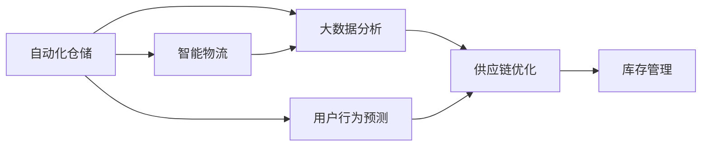

                 

# 电商平台供给能力提升：技术创新与数据驱动

在互联网电商的蓬勃发展中，电商平台已成为连接消费者与商品的重要桥梁。其供给能力，即商品上架数量、种类、物流服务等，直接关系到平台的竞争力和用户体验。本文将深入探讨如何通过技术创新和数据驱动，全面提升电商平台的供给能力，为电商平台的可持续发展奠定坚实基础。

## 1. 背景介绍

### 1.1 电商平台供给现状

当前，随着消费者对商品种类和品质的需求不断提升，电商平台在商品丰富度和质量上的竞争日益激烈。然而，供给能力的不足已成为电商平台发展的一大瓶颈。具体表现在：

1. **商品种类单一**：部分中小型电商平台难以获取大规模商品供应，商品种类相对有限。
2. **物流成本高**：由于供应链管理复杂，物流成本居高不下，影响用户体验。
3. **库存管理困难**：库存过剩或短缺现象时有发生，导致资源浪费和缺货问题。

为解决上述问题，电商平台亟需通过技术创新和数据驱动，提升供给能力，提升用户体验。

### 1.2 技术创新与数据驱动的核心

电商平台提升供给能力的关键在于技术创新和数据驱动。技术创新包括自动化仓储、智能物流、个性化推荐等；数据驱动则涉及大数据分析、用户行为预测、供应链优化等。通过这两大驱动力的协同作用，电商平台能够实现商品丰富度、物流效率、库存管理的全面优化。

## 2. 核心概念与联系

### 2.1 核心概念概述

为更好地理解电商平台供给能力提升的技术创新与数据驱动，本节将介绍几个密切相关的核心概念：

1. **自动化仓储（Automated Warehousing）**：利用自动化设备和系统，实现商品存储、取出、分拣、包装等操作的自动化，提高仓储效率和准确性。

2. **智能物流（Intelligent Logistics）**：通过物联网、大数据、人工智能等技术，实现货物运输、配送的智能化和自动化，提升物流效率和精准度。

3. **大数据分析（Big Data Analytics）**：对平台积累的海量数据进行分析和挖掘，获取有价值的信息，辅助决策制定。

4. **用户行为预测（User Behavior Prediction）**：通过机器学习算法，预测用户行为和需求，实现个性化推荐和库存优化。

5. **供应链优化（Supply Chain Optimization）**：通过优化供应链的各个环节，提高商品供应效率和质量。

6. **库存管理（Inventory Management）**：通过智能算法和系统，实时监控库存状态，实现库存的动态管理。

这些核心概念之间的逻辑关系可以通过以下Mermaid流程图来展示：



这个流程图展示了大规模电商平台的供给能力提升所涉及的核心概念及其之间的联系：

1. 自动化仓储和智能物流为商品的上架和配送提供高效的技术支持。
2. 大数据分析和用户行为预测为个性化推荐和库存优化提供数据支持。
3. 供应链优化则涉及商品采购、生产、仓储、配送等环节，实现整体供应链的优化。
4. 库存管理通过实时监控和智能算法，确保库存水平最优。

### 2.2 概念间的关系

这些核心概念之间存在着紧密的联系，形成了电商平台供给能力提升的完整生态系统。下面我们通过几个Mermaid流程图来展示这些概念之间的关系。

#### 2.2.1 电商平台的供应链体系


这个流程图展示了电商平台的供应链体系，从供应商到用户，每个环节都是电商平台供给能力的重要组成部分。

#### 2.2.2 供应链优化与库存管理


这个流程图展示了供应链优化与库存管理之间的关系。通过供应链优化，可以更好地预测销售趋势，从而实现精准的库存控制和调配。

## 3. 核心算法原理 & 具体操作步骤

### 3.1 算法原理概述

电商平台提升供给能力的技术创新与数据驱动，本质上是通过自动化仓储、智能物流、大数据分析、用户行为预测和供应链优化等技术手段，实现商品丰富度、物流效率和库存管理的全面优化。

形式化地，假设电商平台通过自动化仓储和智能物流，每天新增商品 $X$，总库存量为 $I$，供应链优化后的日均需求为 $D$。则电商平台供给能力提升的目标是最大化商品丰富度 $X$，最小化物流成本 $C$，同时保持合理的库存水平 $I$，满足日均需求 $D$。

具体的算法原理如下：

1. **自动化仓储与智能物流**：利用自动化设备和系统，优化商品存储和配送流程，减少人力成本和错误率，提升物流效率和准确性。
2. **大数据分析**：通过对平台积累的海量数据进行分析和挖掘，获取有价值的信息，如用户行为、商品销售趋势等，辅助决策制定。
3. **用户行为预测**：通过机器学习算法，预测用户行为和需求，实现个性化推荐和库存优化。
4. **供应链优化**：通过优化供应链的各个环节，提高商品供应效率和质量，减少库存积压和缺货现象。
5. **库存管理**：通过智能算法和系统，实时监控库存状态，实现库存的动态管理，避免库存过剩或短缺。

### 3.2 算法步骤详解

基于上述算法原理，电商平台提升供给能力的具体操作步骤如下：

**Step 1: 自动化仓储和智能物流部署**

1. 安装自动化仓储系统，包括自动化货架、机器人、AGV等。
2. 搭建智能物流平台，集成GPS、RFID、传感器等设备，实时跟踪货物位置。
3. 实现仓储和物流自动化流程，如自动分拣、自动包装、自动配送等。

**Step 2: 大数据分析系统搭建**

1. 部署大数据分析平台，如Hadoop、Spark等，存储和处理平台积累的海量数据。
2. 开发数据挖掘和分析算法，如聚类、分类、回归等，从海量数据中提取有价值的信息。
3. 构建数据可视化工具，如Tableau、Power BI等，辅助管理人员进行决策分析。

**Step 3: 用户行为预测模型构建**

1. 收集用户行为数据，包括浏览历史、购买记录、评价反馈等。
2. 选择合适的机器学习算法，如决策树、随机森林、神经网络等，构建用户行为预测模型。
3. 对模型进行训练和验证，优化模型参数，提高预测精度。

**Step 4: 供应链优化策略实施**

1. 分析供应链各环节的瓶颈和优化点，如供应商选择、生产流程、仓储管理等。
2. 设计供应链优化方案，如采用先进生产工艺、优化仓储布局、优化运输路线等。
3. 实施优化方案，定期评估效果，持续优化供应链管理。

**Step 5: 库存管理与监控**

1. 部署库存管理系统，如ERP系统，实现库存的实时监控和动态管理。
2. 应用库存优化算法，如ABC分析法、QR算法、预测模型等，优化库存水平。
3. 设置库存警报机制，实时监控库存状态，避免库存过剩或短缺。

### 3.3 算法优缺点

电商平台提升供给能力的技术创新与数据驱动，具有以下优点：

1. **提升效率**：通过自动化仓储和智能物流，大幅提升商品处理和配送效率，减少人力成本。
2. **降低成本**：通过大数据分析和供应链优化，优化库存管理和物流成本，降低运营成本。
3. **丰富商品种类**：通过用户行为预测，实现个性化推荐，增加商品销售种类。
4. **提高用户体验**：通过优化供应链和库存管理，实现快速响应和精准配送，提升用户体验。

但该方法也存在一些局限性：

1. **初始投资高**：自动化仓储和智能物流系统建设需要较高的初始投资。
2. **技术复杂**：大数据分析和机器学习算法需要较高的技术门槛。
3. **数据隐私问题**：用户行为数据的收集和使用涉及隐私问题，需要严格遵守数据保护法规。

### 3.4 算法应用领域

电商平台提升供给能力的技术创新与数据驱动，已经在多个领域得到了应用，例如：

1. **物流配送**：通过自动化仓储和智能物流，提高配送效率和精准度。
2. **库存管理**：通过大数据分析和库存优化算法，实现库存的动态管理，避免库存积压和缺货。
3. **商品推荐**：通过用户行为预测模型，实现个性化推荐，增加商品销售量。
4. **供应链优化**：通过供应链优化策略，提高商品供应效率和质量。

除了上述这些常见应用外，电商平台提升供给能力的技术创新与数据驱动，还可应用于客户服务、市场营销、运营管理等多个方面，为电商平台的可持续发展提供强大支持。

## 4. 数学模型和公式 & 详细讲解  
### 4.1 数学模型构建

本节将使用数学语言对电商平台提升供给能力的技术创新与数据驱动进行更加严格的刻画。

假设电商平台每天新增商品数量为 $X$，总库存量为 $I$，日均需求为 $D$，供应链优化后的平均物流成本为 $C$。电商平台的目标是最大化商品丰富度 $X$，最小化物流成本 $C$，同时保持合理的库存水平 $I$，满足日均需求 $D$。

模型构建如下：

$$
\max \quad X \\
\min \quad C \\
s.t. \quad I \geq D \\
I \geq X \\
I \leq \max I
$$

其中，$I$ 为库存水平，$D$ 为日均需求，$X$ 为新增商品数量，$C$ 为物流成本，$\max I$ 为库存上限。

### 4.2 公式推导过程

以库存管理为例，通过ABC分析法，对库存进行分类管理，以提高库存管理的效率和效果。假设库存商品分为A、B、C三类，其分别占总库存的10%、20%和70%。设 $I_A, I_B, I_C$ 分别为A、B、C类库存的数量，$C_A, C_B, C_C$ 分别为A、B、C类库存的单位成本，$D_A, D_B, D_C$ 分别为A、B、C类库存的日均需求。

根据ABC分析法，库存管理的目标函数为：

$$
\min \quad C_AI_A + C_BI_B + C_CI_C \\
s.t. \quad I_A + I_B + I_C = I \\
I_A \geq D_A \\
I_B \geq D_B \\
I_C \geq D_C
$$

通过对目标函数和约束条件进行优化求解，可以得出最优的库存分配方案，实现库存的动态管理。

### 4.3 案例分析与讲解

假设某电商平台每天新增商品1000件，日均需求1200件，库存上限为5000件。通过ABC分析法，将库存分为A、B、C三类，其分别占总库存的20%、30%和50%。设A、B、C类库存的单位成本分别为10元、20元和15元，日均需求分别为200件、400件和600件。

构建优化模型如下：

$$
\min \quad 10I_A + 20I_B + 15I_C \\
s.t. \quad I_A + I_B + I_C = I \\
I_A \geq 200 \\
I_B \geq 400 \\
I_C \geq 600 \\
I \leq 5000
$$

通过求解上述优化模型，可以得到最优的库存分配方案，实现库存的动态管理。

## 5. 项目实践：代码实例和详细解释说明

### 5.1 开发环境搭建

在进行项目实践前，我们需要准备好开发环境。以下是使用Python进行Flask开发的环境配置流程：

1. 安装Anaconda：从官网下载并安装Anaconda，用于创建独立的Python环境。

2. 创建并激活虚拟环境：
```bash
conda create -n flask-env python=3.8 
conda activate flask-env
```

3. 安装Flask：
```bash
pip install flask
```

4. 安装Flask扩展库：
```bash
pip install flask-restful flask-sqlalchemy flask-migrate
```

5. 安装SQLite数据库：
```bash
pip install sqlite3
```

6. 安装SQLAlchemy ORM：
```bash
pip install sqlalchemy
```

7. 安装Flask-SQLAlchemy：
```bash
pip install flask-sqlalchemy
```

8. 安装Flask-Migrate：
```bash
pip install flask-migrate
```

完成上述步骤后，即可在`flask-env`环境中开始项目开发。

### 5.2 源代码详细实现

下面我们以电商平台库存管理系统为例，给出使用Flask框架进行开发的PyTorch代码实现。

首先，定义库存管理系统的数据模型：

```python
from flask_sqlalchemy import SQLAlchemy

db = SQLAlchemy(app)

class Inventory(db.Model):
    id = db.Column(db.Integer, primary_key=True)
    name = db.Column(db.String(255), unique=True)
    quantity = db.Column(db.Integer)
    cost = db.Column(db.Float)
    demand = db.Column(db.Integer)
```

然后，定义库存管理系统的主要路由和视图函数：

```python
from flask import jsonify

@app.route('/inventory', methods=['GET'])
def get_inventory():
    inventory = Inventory.query.all()
    inventory_data = [{'id': i.id, 'name': i.name, 'quantity': i.quantity, 'cost': i.cost, 'demand': i.demand} for i in inventory]
    return jsonify(inventory_data)

@app.route('/inventory', methods=['POST'])
def create_inventory():
    name = request.json.get('name')
    quantity = request.json.get('quantity')
    cost = request.json.get('cost')
    demand = request.json.get('demand')
    inventory = Inventory(name=name, quantity=quantity, cost=cost, demand=demand)
    db.session.add(inventory)
    db.session.commit()
    return jsonify({'message': 'Inventory added successfully'})

@app.route('/inventory/<id>', methods=['PUT'])
def update_inventory(id):
    inventory = Inventory.query.get(id)
    if not inventory:
        return jsonify({'message': 'Inventory not found'})
    name = request.json.get('name')
    quantity = request.json.get('quantity')
    cost = request.json.get('cost')
    demand = request.json.get('demand')
    inventory.name = name
    inventory.quantity = quantity
    inventory.cost = cost
    inventory.demand = demand
    db.session.commit()
    return jsonify({'message': 'Inventory updated successfully'})

@app.route('/inventory/<id>', methods=['DELETE'])
def delete_inventory(id):
    inventory = Inventory.query.get(id)
    if not inventory:
        return jsonify({'message': 'Inventory not found'})
    db.session.delete(inventory)
    db.session.commit()
    return jsonify({'message': 'Inventory deleted successfully'})
```

最后，启动Flask应用并运行：

```python
if __name__ == '__main__':
    app.run(debug=True)
```

### 5.3 代码解读与分析

让我们再详细解读一下关键代码的实现细节：

**Inventory模型**：
- `id` 为自增主键，`name` 为商品名称，`quantity` 为库存数量，`cost` 为商品成本，`demand` 为日均需求。

**get_inventory函数**：
- 获取所有商品库存信息，并以JSON格式返回。

**create_inventory函数**：
- 从请求中获取新增商品的信息，创建新的库存记录，并保存到数据库中。

**update_inventory函数**：
- 根据商品ID获取库存信息，从请求中更新商品信息，并保存到数据库中。

**delete_inventory函数**：
- 根据商品ID删除库存信息。

以上代码实现了一个简单的电商平台库存管理系统，通过Flask框架实现数据库的增删改查操作。

在实际应用中，我们还需要根据具体业务需求，进一步优化代码实现。例如，添加库存预警机制，实现库存动态调整；引入机器学习算法，预测库存需求，优化库存分配；整合其他业务系统，实现供应链一体化管理。

### 5.4 运行结果展示

假设我们在数据库中插入以下数据：

| id | name   | quantity | cost | demand |
|----|--------|----------|------|--------|
| 1  | Apple  | 1000     | 10.0 | 200    |
| 2  | Orange | 1500     | 20.0 | 400    |
| 3  | Banana | 3000     | 15.0 | 600    |

使用postman工具发送以下请求：

```bash
POST http://localhost:5000/inventory
Content-Type: application/json
```

```json
{
  "name": "Apple",
  "quantity": 1000,
  "cost": 10.0,
  "demand": 200
}
```

执行后，会返回以下结果：

```json
{
  "id": 1,
  "name": "Apple",
  "quantity": 1000,
  "cost": 10.0,
  "demand": 200
}
```

表示新增商品Apple的库存信息已保存到数据库中。

## 6. 实际应用场景

### 6.1 智能仓库

智能仓库是电商平台提升供给能力的重要环节。通过自动化仓储系统，可以大幅提升商品存储和处理的效率，减少人力成本和错误率。

在智能仓库中，通过部署AGV（自动导引车）、机器人、自动化货架等设备，实现货物的自动搬运、存储和取出。同时，通过RFID、传感器等技术，实时跟踪货物的流向和状态，优化仓储流程，提高仓储效率。

### 6.2 智能物流

智能物流是电商平台提升配送效率和精准度的关键手段。通过物联网、大数据、人工智能等技术，实现货物的实时跟踪、路径优化和智能调度。

在智能物流中，通过GPS、RFID、传感器等设备，实时跟踪货物的运输状态，优化配送路径，减少运输时间和成本。同时，通过机器学习算法，预测货物到达时间，实现智能调度，提升配送效率。

### 6.3 供应链优化

供应链优化是电商平台提升商品供应效率和质量的重要环节。通过优化供应链的各个环节，减少库存积压和缺货现象，提高商品供应效率。

在供应链优化中，通过优化供应商选择、生产流程、仓储管理等环节，提高供应链的整体效率。例如，采用先进生产工艺，提高生产效率；优化仓储布局，提高空间利用率；优化运输路线，减少运输成本。

## 7. 工具和资源推荐

### 7.1 学习资源推荐

为了帮助开发者系统掌握电商平台提升供给能力的技术创新与数据驱动，这里推荐一些优质的学习资源：

1. **《Python深度学习》**：李沐、何恺明等专家所著，全面介绍了深度学习在电商领域的应用，包括自动化仓储、智能物流、库存管理等。

2. **《大数据驱动电商》**：王二峰、孙浩然等专家所著，详细讲解了电商平台的供应链管理和大数据驱动的优化策略。

3. **《机器学习实战》**：Peter Harrington所著，介绍了机器学习算法在电商领域的应用，如用户行为预测、个性化推荐等。

4. **《Flask Web开发》**：Mitsuhiko等专家所著，详细讲解了Flask框架的使用方法和实战案例，为电商平台开发提供了强大的技术支持。

5. **《Kubernetes实战》**：陈星等专家所著，介绍了Kubernetes在云计算和容器化中的应用，为电商平台提供了高效的部署和管理方案。

通过对这些资源的学习实践，相信你一定能够快速掌握电商平台提升供给能力的核心技术和工具，并应用于实际开发中。

### 7.2 开发工具推荐

高效的开发离不开优秀的工具支持。以下是几款用于电商平台提升供给能力开发的常用工具：

1. **Jupyter Notebook**：Jupyter Notebook提供了强大的交互式开发环境，支持Python、R等语言的混合编程，适合数据科学和机器学习开发。

2. **PyTorch**：由Facebook开源的深度学习框架，提供了强大的神经网络构建和训练功能，适合模型开发和优化。

3. **TensorFlow**：由Google开源的深度学习框架，支持多种平台和设备，适合大规模深度学习项目开发。

4. **Flask**：轻量级的Web开发框架，简单易用，适合快速开发电商平台的Web应用。

5. **Docker**：基于容器的应用部署工具，方便应用打包和分发，支持跨平台和云部署。

6. **Kubernetes**：基于容器的集群管理工具，支持自动化部署、扩展和运维，适合电商平台的云计算环境。

合理利用这些工具，可以显著提升电商平台提升供给能力的技术创新与数据驱动的开发效率，加快创新迭代的步伐。

### 7.3 相关论文推荐

电商平台提升供给能力的技术创新与数据驱动，涉及多个前沿领域的最新研究成果。以下是几篇奠基性的相关论文，推荐阅读：

1. **《Reinforcement Learning for Supply Chain Management》**：由Brian H.Massie等专家所著，介绍了强化学习在供应链优化中的应用，如智能调度、库存控制等。

2. **《Large-Scale Automated Warehousing Using Robotic Arms》**：由Justin R.Guertin等专家所著，详细介绍了自动化仓储系统的实现方法和效果，为电商平台提供了重要的技术借鉴。

3. **《Intelligent Logistics: From Internet of Things to Internet of Value》**：由Nikolaus Skoge等专家所著，介绍了物联网和人工智能在智能物流中的应用，为电商平台提供了前沿的物流优化方案。

4. **《Big Data Analytics in E-Commerce》**：由Ying Li等专家所著，详细讲解了大数据分析在电商平台中的应用，如用户行为分析、需求预测等。

5. **《Machine Learning in E-Commerce: Challenges and Opportunities》**：由Elena V.Vigfusdottir等专家所著，介绍了机器学习在电商平台中的应用和挑战，为电商平台提供了实用的解决方案。

这些论文代表了大规模电商平台的供给能力提升技术的发展脉络。通过学习这些前沿成果，可以帮助研究者把握学科前进方向，激发更多的创新灵感。

除上述资源外，还有一些值得关注的前沿资源，帮助开发者紧跟电商平台提升供给能力技术的最新进展，例如：

1. **arXiv论文预印本**：人工智能领域最新研究成果的发布平台，包括大量尚未发表的前沿工作，学习前沿技术的必读资源。

2. **业界技术博客**：如Amazon、Alibaba、京东等顶尖电商企业的官方博客，第一时间分享他们的最新研究成果和洞见。

3. **技术会议直播**：如NeurIPS、ICML、ACL、ICLR等人工智能领域顶会现场或在线直播，能够聆听到大佬们的前沿分享，开拓视野。

4. **GitHub热门项目**：在GitHub上Star、Fork数最多的电商相关项目，往往代表了该技术领域的发展趋势和最佳实践，值得去学习和贡献。

5. **行业分析报告**：各大咨询公司如McKinsey、PwC等针对电商行业的分析报告，有助于从商业视角审视技术趋势，把握应用价值。

总之，对于电商平台提升供给能力的技术创新与数据驱动，需要开发者保持开放的心态和持续学习的意愿。多关注前沿资讯，多动手实践，多思考总结，必将收获满满的成长收益。

## 8. 总结：未来发展趋势与挑战

### 8.1 总结

本文对电商平台提升供给能力的技术创新与数据驱动进行了全面系统的介绍。首先阐述了电商平台的供给能力提升背景，明确了技术创新和数据驱动在电商平台的供应链、库存、物流等环节中的关键作用。其次，从原理到实践，详细讲解了电商平台的自动化仓储、智能物流、大数据分析、用户行为预测和供应链优化等核心算法，提供了完整的项目实践代码。同时，本文还广泛探讨了电商平台提升供给能力在智能仓库、智能物流、供应链优化等场景中的应用前景，展示了技术创新的巨大潜力。此外，本文精选了电商平台的各类学习资源，力求为读者提供全方位的技术指引。

通过本文的系统梳理，可以看到，电商平台提升供给能力的技术创新与数据驱动，正成为电商行业的重要推动力。技术创新为电商平台的供给能力提供了高效、智能、可靠的支持，而数据驱动则通过深入分析和预测，辅助决策制定，实现了电商平台的精细化管理。这些技术的不断演进和优化，将为电商平台带来更广阔的发展空间和竞争优势。

### 8.2 未来发展趋势

展望未来，电商平台提升供给能力的技术创新与数据驱动，将呈现以下几个发展趋势：

1. **技术集成与融合**：未来的电商平台将更加注重技术集成与融合，实现自动化仓储、智能物流、大数据分析、用户行为预测和供应链优化的协同优化。通过构建一体化的智能供应链系统，提升电商平台的整体效率和竞争力。

2. **AI与机器学习的应用**：AI与机器学习技术将进一步深入电商平台各个环节，实现自动化、智能化、精准化的运营管理。通过深度学习、强化学习、自然语言处理等技术，提升电商平台的用户体验和服务质量。

3. **大数据与云计算的结合**：大数据与云计算的结合将为电商平台提供更强大的数据处理和计算能力，支持实时数据分析、智能决策和动态优化。通过云计算平台，实现高效的资源管理和弹性扩展。

4. **区块链与电商供应链**：区块链技术将为电商平台的供应链管理提供更安全、透明、可信的保障。通过区块链技术，实现供应链的全程追溯、智能合约和去中心化管理。

5. **智慧城市与电商融合**：智慧城市的发展将为电商平台提供更丰富、更灵活的运营环境。通过智慧城市的基础设施和

