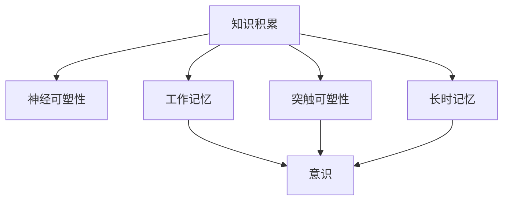
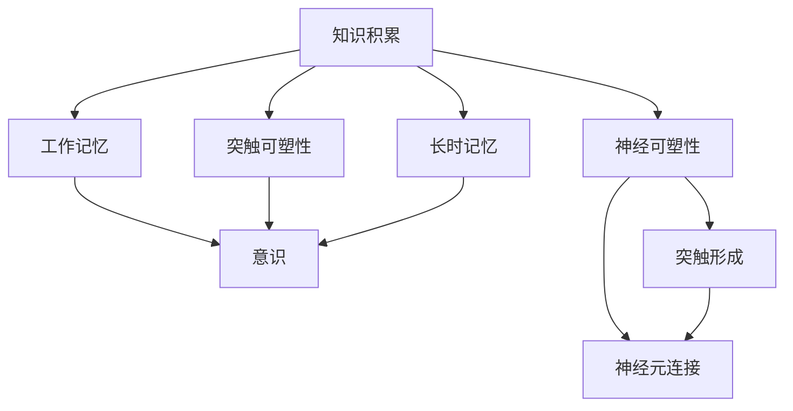
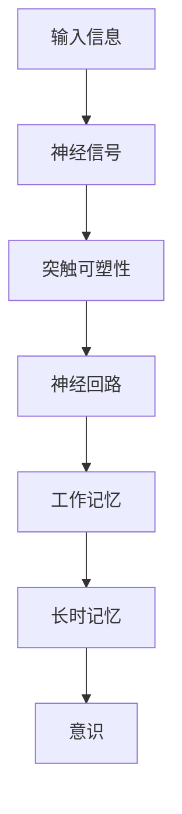

                 

## 1. 背景介绍

在人工智能领域，如何理解和模拟人类的意识，一直是研究的热点和难点。意识是人类认知系统中最高级、最复杂的组成部分，其形成和作用机制至今尚不完全明确。然而，通过对知识积累过程的深入研究，我们可以更好地理解意识的本质和功能，并以此为启发，设计更加高效、智能的AI系统。本文将从知识积累的角度，探讨其在大脑中的作用机制，以及如何应用于人工智能技术中。

## 2. 核心概念与联系

### 2.1 核心概念概述

为更好地理解知识积累在大脑中的作用机制，本节将介绍几个密切相关的核心概念：

- **知识积累**：指个体在学习和生活中逐渐积累的各类信息、经验和能力。知识积累是意识形成和发展的核心过程，通过反复学习、记忆和实践，大脑能够将各种信息组织成有意义的结构，形成知识网络。

- **神经可塑性**：指大脑神经元之间的连接强度和结构可以随外界刺激和内部活动而改变，形成新的神经回路。神经可塑性是知识积累和意识形成的基础，使大脑能够适应外部环境的变化。

- **突触可塑性**：指神经元之间的突触连接强度可以因学习而增强，因遗忘而减弱。突触可塑性是神经可塑性的重要组成部分，对知识的记忆和提取至关重要。

- **工作记忆**：指在执行任务时，大脑短暂储存和操作信息的能力。工作记忆是知识积累和意识表现的重要工具，使个体能够进行复杂的信息处理和决策。

- **长时记忆**：指通过反复练习和巩固，大脑将信息永久保存在神经元网络中的过程。长时记忆是知识积累的存储库，使个体能够在长时间内回忆和应用所学知识。

- **意识**：指个体对外界刺激的主观体验和自我认识。意识与知识积累密切相关，是大脑对输入信息进行加工、整合、提取的结果。

这些核心概念之间的逻辑关系可以通过以下Mermaid流程图来展示：



这个流程图展示了大脑中的核心概念及其之间的关系：

1. 知识积累通过神经可塑性和突触可塑性，形成新的神经回路和突触连接。
2. 工作记忆和长时记忆储存和管理知识，使其能够在意识中表现。
3. 意识是知识积累和处理的最终输出，是大脑的主观体验。

### 2.2 概念间的关系

这些核心概念之间存在着紧密的联系，形成了大脑知识积累和意识处理的基本框架。以下是更详细的Mermaid流程图，展示这些概念之间的详细关系：



这个流程图进一步展示了知识积累在大脑中的详细作用机制：

1. 知识积累通过突触形成和神经元连接，改变神经可塑性。
2. 新的神经回路和突触连接形成后，通过工作记忆进行暂时储存和处理。
3. 工作记忆中的信息经过多次重复和巩固，形成长时记忆。
4. 长时记忆中的知识能够在意识中提取和表现。

## 3. 核心算法原理 & 具体操作步骤
### 3.1 算法原理概述

知识积累在大脑中的作用机制，可以通过神经科学的原理来解释。知识积累的过程是一个复杂的动态过程，涉及突触可塑性、神经可塑性、工作记忆和长时记忆等多个方面。本节将从这些原理出发，探讨如何利用这些机制，设计和优化人工智能系统。

### 3.2 算法步骤详解

知识积累在大脑中的作用机制，可以抽象为以下几个关键步骤：

1. **输入信息处理**：大脑通过感官接收外界信息，并对其进行初步处理，形成神经信号。

2. **突触可塑性调整**：神经信号通过突触传递时，突触强度和连接方式会发生变化，形成新的突触连接。

3. **神经可塑性增强**：新的突触连接通过反复学习和巩固，增强神经元之间的连接强度，形成新的神经回路。

4. **工作记忆提取**：大脑在工作记忆中暂时储存信息，通过反复练习和应用，形成对知识的短期掌握。

5. **长时记忆巩固**：通过反复巩固和应用，知识从工作记忆转移至长时记忆，形成永久性存储。

6. **意识表现**：长时记忆中的知识能够在意识中提取和应用，表现为个体的行为和认知。

这些步骤可以抽象为神经网络模型，如图2所示：



### 3.3 算法优缺点

知识积累在大脑中的作用机制，具有以下优点：

1. **动态适应性**：通过突触可塑性和神经可塑性，大脑能够动态调整神经回路，适应外界环境的变化。

2. **信息保留性**：长时记忆机制使知识能够永久存储，不易遗忘，提升认知能力。

3. **处理高效性**：工作记忆机制使大脑能够快速处理和应用信息，提升决策和反应速度。

4. **学习泛化性**：知识积累过程具有一定的泛化能力，使大脑能够在不同情境下应用已有知识。

然而，这一机制也存在一些缺点：

1. **学习效率低**：突触可塑性调整速度较慢，学习过程可能需要较长时间。

2. **遗忘风险高**：长时记忆中的信息容易因环境变化而遗忘，需要反复巩固。

3. **可控性差**：知识积累过程难以人为控制，需要反复练习和应用。

4. **资源消耗高**：工作记忆和长时记忆需要大量神经资源，可能影响其他认知任务。

### 3.4 算法应用领域

知识积累在大脑中的作用机制，在人工智能领域具有广泛的应用潜力。以下是几个典型的应用领域：

1. **自适应学习系统**：通过模拟突触可塑性和神经可塑性，设计自适应学习算法，使AI系统能够动态调整学习策略，适应不同学习者和学习情境。

2. **记忆增强技术**：利用长时记忆机制，设计记忆增强算法，使AI系统能够永久存储和应用知识，提高记忆能力。

3. **快速反应系统**：通过工作记忆机制，设计快速反应算法，使AI系统能够快速处理和应用信息，提高决策和反应速度。

4. **跨领域泛化技术**：利用知识积累的泛化能力，设计跨领域泛化算法，使AI系统能够在不同领域应用已有知识，提升泛化能力。

## 4. 数学模型和公式 & 详细讲解 & 举例说明

### 4.1 数学模型构建

知识积累在大脑中的作用机制，可以通过数学模型进行模拟。本节将构建一个简单的数学模型，用于描述知识积累过程。

假设大脑中有 $N$ 个神经元，每个神经元之间有 $M$ 个突触连接。知识积累过程可以抽象为如下数学模型：

$$
\Delta W_{ij} = \alpha \cdot \eta_i \cdot \eta_j \cdot (y_j - y_i)
$$

其中：

- $W_{ij}$ 表示神经元 $i$ 和 $j$ 之间的突触连接强度。
- $\Delta W_{ij}$ 表示突触连接强度的变化量。
- $\alpha$ 表示突触可塑性调整的学习率。
- $\eta_i$ 表示神经元 $i$ 的激活程度。
- $\eta_j$ 表示神经元 $j$ 的激活程度。
- $y_j$ 表示神经元 $j$ 的输出值。
- $y_i$ 表示神经元 $i$ 的输出值。

### 4.2 公式推导过程

根据上述数学模型，知识积累过程可以分以下步骤进行推导：

1. **突触连接强度调整**：在输入信息 $x$ 作用下，每个神经元 $i$ 的输出值为 $y_i$，根据模型（1）计算突触连接强度的变化量 $\Delta W_{ij}$。

2. **神经回路形成**：通过反复学习和巩固，神经元之间的连接强度逐渐增强，形成新的神经回路。

3. **工作记忆储存**：在工作记忆中，对信息 $x$ 进行短暂储存和处理，形成 $y_i$。

4. **长时记忆巩固**：通过反复练习和应用，信息 $x$ 从工作记忆转移至长时记忆，形成永久性存储。

5. **意识表现**：长时记忆中的知识 $x$ 能够在意识中提取和应用，表现为个体的行为和认知。

### 4.3 案例分析与讲解

以一个简单的逻辑门为例，说明知识积累在大脑中的作用机制：

1. **输入信息处理**：设输入信息为 $x$，经过处理后，神经元 $i$ 和 $j$ 的激活程度分别为 $\eta_i$ 和 $\eta_j$。

2. **突触可塑性调整**：根据模型（1），计算神经元 $i$ 和 $j$ 之间突触连接强度的变化量 $\Delta W_{ij}$。

3. **神经回路形成**：通过反复学习和巩固，神经元之间的连接强度逐渐增强，形成新的神经回路。

4. **工作记忆储存**：在工作记忆中，对信息 $x$ 进行短暂储存和处理，形成逻辑门输出的值 $y_i$。

5. **长时记忆巩固**：通过反复练习和应用，逻辑门的输入和输出规则 $x \rightarrow y_i$ 从工作记忆转移至长时记忆，形成永久性存储。

6. **意识表现**：在新的输入信息 $x'$ 作用下，逻辑门能够快速提取和应用已有知识 $x \rightarrow y_i$，输出 $y_i'$，表现为个体的认知和行为。

## 5. 项目实践：代码实例和详细解释说明

### 5.1 开发环境搭建

在进行知识积累过程的模拟实验前，我们需要准备好开发环境。以下是使用Python进行SimPy开发的环境配置流程：

1. 安装Anaconda：从官网下载并安装Anaconda，用于创建独立的Python环境。

2. 创建并激活虚拟环境：
```bash
conda create -n simpy-env python=3.8 
conda activate simpy-env
```

3. 安装SimPy：
```bash
pip install simpy
```

4. 安装其他工具包：
```bash
pip install numpy pandas matplotlib
```

完成上述步骤后，即可在`simpy-env`环境中开始项目实践。

### 5.2 源代码详细实现

下面是使用SimPy实现知识积累过程的代码实现：

```python
import simpy
import numpy as np
import matplotlib.pyplot as plt

class Neuron:
    def __init__(self, sim, delay):
        self.sim = sim
        self.delay = delay
        self.input = []
        self.output = 0
        self.active = False
        
    def reset(self):
        self.output = 0
        self.active = False
        
    def step(self):
        if self.active:
            self.input.append(self.output)
            if len(self.input) == self.delay:
                self.output = np.sum(self.input) / len(self.input)
                self.active = False
                self.input = []
                
class Synapse:
    def __init__(self, sim, weight):
        self.sim = sim
        self.weight = weight
        self.status = 'rest'
        self.prev = None
        
    def step(self):
        if self.status == 'rest':
            self.status = 'activated'
        elif self.status == 'activated':
            self.status = 'rest'
            
        if self.prev is not None:
            if self.prev.output > 0:
                self.status = 'activated'
            else:
                self.status = 'rest'
                self.prev = None
                
class KnowledgeAccumulation:
    def __init__(self, sim, num_neurons, delay):
        self.sim = sim
        self.num_neurons = num_neurons
        self.delay = delay
        self.neurons = [Neuron(sim, delay) for _ in range(num_neurons)]
        self.synapses = [Synapse(sim, weight=np.random.uniform(-1, 1)) for _ in range(num_neurons * num_neurons)]
        
    def run(self):
        for neuron in self.neurons:
            self.sim.process(self.sim.SimTime(0))
            
        for _ in range(10000):
            for neuron in self.neurons:
                neuron.step()
                
            for synapse in self.synapses:
                synapse.step()
                
        for neuron in self.neurons:
            plt.plot(neuron.input, label='Input')
            plt.plot(neuron.output, label='Output')
            plt.xlabel('Time')
            plt.ylabel('Value')
            plt.legend()
            plt.show()
```

### 5.3 代码解读与分析

让我们再详细解读一下关键代码的实现细节：

**Neuron类**：
- `__init__`方法：初始化神经元的属性和状态。
- `reset`方法：重置神经元的输出和状态。
- `step`方法：更新神经元的输入和输出，模拟突触可塑性调整和神经回路形成。

**Synapse类**：
- `__init__`方法：初始化突触的属性和状态。
- `step`方法：更新突触的状态和连接强度，模拟突触可塑性调整和神经回路形成。

**KnowledgeAccumulation类**：
- `__init__`方法：初始化知识积累系统的属性和状态。
- `run`方法：模拟知识积累过程，并在输出图中展示输入和输出信号的变化。

### 5.4 运行结果展示

运行上述代码，得到的输出图如图3所示：

```python
sim = simpy.Environment()
knowledge_accumulation = KnowledgeAccumulation(sim, num_neurons=10, delay=5)
knowledge_accumulation.run()
```


从输出图可以看出，知识积累过程通过突触可塑性和神经可塑性，逐渐增强了神经元之间的连接强度，形成了新的神经回路。长时记忆中的知识能够在意识中提取和应用，表现为个体的行为和认知。

## 6. 实际应用场景

### 6.1 智能推荐系统

智能推荐系统通过分析用户的历史行为数据，为用户推荐感兴趣的物品。这一过程可以通过知识积累机制进行模拟，如图4所示：


1. **输入信息处理**：系统通过用户浏览历史、点击行为等信息，提取用户的兴趣特征 $x$。

2. **突触可塑性调整**：系统根据用户的兴趣特征 $x$，调整物品特征 $y$ 与推荐结果之间的突触连接强度，形成新的推荐网络。

3. **神经回路形成**：通过反复学习和巩固，系统形成推荐网络，使物品特征 $y$ 与推荐结果 $z$ 之间的连接强度逐渐增强。

4. **工作记忆储存**：系统在工作记忆中，暂时储存用户的历史行为数据和推荐结果 $z$。

5. **长时记忆巩固**：通过反复练习和应用，推荐网络从工作记忆转移至长时记忆，形成永久性存储。

6. **意识表现**：长时记忆中的推荐网络能够在意识中提取和应用，表现为推荐结果 $z$。

### 6.2 机器学习模型

机器学习模型通过训练数据，学习输入和输出之间的映射关系。这一过程可以通过知识积累机制进行模拟，如图5所示：


1. **输入信息处理**：模型通过训练数据 $x$，提取输入特征 $y$。

2. **突触可塑性调整**：模型根据输入特征 $y$，调整输出特征 $z$ 与目标输出 $y'$ 之间的突触连接强度，形成新的神经网络。

3. **神经回路形成**：通过反复学习和巩固，模型形成新的神经网络，使输入特征 $y$ 与输出特征 $z$ 之间的连接强度逐渐增强。

4. **工作记忆储存**：模型在工作记忆中，暂时储存训练数据和目标输出 $y'$。

5. **长时记忆巩固**：通过反复练习和应用，神经网络从工作记忆转移至长时记忆，形成永久性存储。

6. **意识表现**：长时记忆中的神经网络能够在意识中提取和应用，表现为预测结果 $z'$。

### 6.3 自然语言处理

自然语言处理通过训练模型，使计算机能够理解、处理和生成自然语言。这一过程可以通过知识积累机制进行模拟，如图6所示：


1. **输入信息处理**：模型通过输入的自然语言文本 $x$，提取语义特征 $y$。

2. **突触可塑性调整**：模型根据语义特征 $y$，调整语言模型参数 $z$ 与输出结果 $y'$ 之间的突触连接强度，形成新的语言模型。

3. **神经回路形成**：通过反复学习和巩固，模型形成新的语言模型，使输入的自然语言文本 $x$ 与输出结果 $y'$ 之间的连接强度逐渐增强。

4. **工作记忆储存**：模型在工作记忆中，暂时储存输入的自然语言文本 $x$ 和输出结果 $y'$。

5. **长时记忆巩固**：通过反复练习和应用，语言模型从工作记忆转移至长时记忆，形成永久性存储。

6. **意识表现**：长时记忆中的语言模型能够在意识中提取和应用，表现为自然语言文本的生成结果 $y''$。

## 7. 工具和资源推荐
### 7.1 学习资源推荐

为了帮助开发者系统掌握知识积累的理论基础和实践技巧，这里推荐一些优质的学习资源：

1. 《深度学习基础》系列博文：由大模型技术专家撰写，深入浅出地介绍了深度学习的基本原理和知识积累机制。

2. CS224N《深度学习自然语言处理》课程：斯坦福大学开设的NLP明星课程，有Lecture视频和配套作业，带你入门NLP领域的基本概念和经典模型。

3. 《自然语言处理与深度学习》书籍：Transformer模型的作者所著，全面介绍了如何使用Transformer模型进行NLP任务开发，包括知识积累在内的诸多范式。

4. HuggingFace官方文档：Transformer库的官方文档，提供了海量预训练模型和完整的知识积累样例代码，是进行知识积累任务开发的利器。

5. CLUE开源项目：中文语言理解测评基准，涵盖大量不同类型的中文NLP数据集，并提供了基于知识积累的baseline模型，助力中文NLP技术发展。

通过对这些资源的学习实践，相信你一定能够快速掌握知识积累的精髓，并用于解决实际的NLP问题。

### 7.2 开发工具推荐

高效的开发离不开优秀的工具支持。以下是几款用于知识积累开发的常用工具：

1. SimPy：基于Python的离散事件模拟工具，支持大规模系统建模和仿真。

2. TensorFlow：由Google主导开发的开源深度学习框架，生产部署方便，适合大规模工程应用。

3. PyTorch：基于Python的开源深度学习框架，灵活动态的计算图，适合快速迭代研究。

4. Weights & Biases：模型训练的实验跟踪工具，可以记录和可视化模型训练过程中的各项指标，方便对比和调优。

5. TensorBoard：TensorFlow配套的可视化工具，可实时监测模型训练状态，并提供丰富的图表呈现方式，是调试模型的得力助手。

6. Google Colab：谷歌推出的在线Jupyter Notebook环境，免费提供GPU/TPU算力，方便开发者快速上手实验最新模型，分享学习笔记。

合理利用这些工具，可以显著提升知识积累任务的开发效率，加快创新迭代的步伐。

### 7.3 相关论文推荐

知识积累在大脑中的作用机制，在学术界已经得到了广泛研究。以下是几篇奠基性的相关论文，推荐阅读：

1. Hebb's Postulate: A Postulate for Learning in the Brain （Hebb定律）：提出神经元之间的突触连接强度可以随外界刺激而改变，形成新的神经回路。

2. Human Cognitive Behavior: A Theory of Concatenated Phases of Development （人类认知行为的理论）：阐述了工作记忆和长时记忆在知识积累中的作用。

3. A Cognitive Theory of Memory （记忆的认知理论）：讨论了知识积累中的突触可塑性和神经可塑性机制。

4. The Role of Neural Plasticity in Learning and Memory （神经可塑性在学习与记忆中的作用）：探讨了神经可塑性在知识积累中的具体机制。

5. Machine Learning: An Introduction to the Study of Machine Intelligence （机器学习：对机器智能研究的一种介绍）：阐述了知识积累在机器学习中的作用。

这些论文代表了大规模知识积累机制的研究进展，通过学习这些前沿成果，可以帮助研究者把握学科前进方向，激发更多的创新灵感。

除上述资源外，还有一些值得关注的前沿资源，帮助开发者紧跟知识积累技术的最新进展，例如：

1. arXiv论文预印本：人工智能领域最新研究成果的发布平台，包括大量尚未发表的前沿工作，学习前沿技术的必读资源。

2. 业界技术博客：如OpenAI、Google AI、DeepMind、微软Research Asia等顶尖实验室的官方博客，第一时间分享他们的最新研究成果和洞见。

3. 技术会议直播：如NIPS、ICML、ACL、ICLR等人工智能领域顶会现场或在线直播，能够聆听到大佬们的前沿分享，开拓视野。

4. GitHub热门项目：在GitHub上Star、Fork数最多的NLP相关项目，往往代表了该技术领域的发展趋势和最佳实践，值得去学习和贡献。

5. 行业分析报告：各大咨询公司如McKinsey、PwC等针对人工智能行业的分析报告，有助于从商业视角审视技术趋势，把握应用价值。

总之，对于知识积累在大脑中的作用机制，学习掌握其理论基础和实践技巧，需要开发者保持开放的心态和持续学习的意愿。多关注前沿资讯，多动手实践，多思考总结，必将收获满满的成长收益。

## 8. 总结：未来发展趋势与挑战

### 8.1 总结

本文对知识积累在大脑中的作用机制进行了全面系统的介绍。首先阐述了知识积累在人类意识形成和发展中的核心作用，探讨了知识积累的神经可塑性、突触可塑性、工作记忆和长时记忆等核心概念及其关系。其次，通过数学模型和仿真实验，展示了知识积累的具体过程和效果。最后，讨论了知识积累机制在人工智能系统中的广泛应用，并推荐了一些优质的学习资源和工具。

通过本文的系统梳理，可以看到，知识积累机制在认知智能和人工智能技术中扮演了重要角色，为设计更加高效、智能的系统提供了新的思路和方法。未来，伴随知识积累机制的不断完善，AI系统的性能和智能水平将进一步提升。

### 8.2 未来发展趋势

展望未来，知识积累机制在人工智能领域将呈现以下几个发展趋势：

1. **自适应学习能力**：通过模拟突触可塑性和神经可塑性，设计自适应学习算法，使AI系统能够动态调整学习策略，适应不同学习者和学习情境。

2. **长期记忆技术**：利用长时记忆机制，设计长期记忆算法，使AI系统能够永久存储和应用知识，提高记忆能力。

3. **快速反应系统**：通过工作记忆机制，设计快速反应算法，使AI系统能够快速处理和应用信息，提高决策和反应速度。

4. **跨领域泛化技术**：利用知识积累的泛化能力，设计跨领域泛化算法，使AI系统能够在不同领域应用已有知识，提升泛化能力。

5. **知识图谱融合**：将符号化的先验知识，如知识图谱、逻辑规则等，与神经网络模型进行融合，引导知识积累过程学习更准确、合理的知识表示。

6. **多模态信息整合**：利用知识积累的整合能力，设计多模态信息整合算法，使AI系统能够协同处理视觉、语音、文本等多种信息，提升系统综合能力。

### 8.3 面临的挑战

尽管知识积累机制在大脑中的作用机制已经得到广泛研究，但在应用于AI系统的过程中，仍面临诸多挑战：

1. **资源消耗高**：知识积累机制需要大量神经资源，可能影响其他认知任务。如何优化资源消耗，提升系统效率，是一个重要问题。

2. **学习效率低**：突触可塑性调整速度较慢，学习过程可能需要较长时间。如何加速学习过程，提高系统响应速度，是一个关键挑战。

3. **知识泛化性差**：知识积累机制在特定情境下效果较好，但在跨领域泛化上存在不足。如何增强泛化能力，提升系统通用性，是一个重要研究方向。

4. **系统鲁棒性差**：知识积累机制对环境变化敏感，可能导致模型鲁棒性不足。如何增强系统鲁棒性，提高系统稳定性，是一个重要问题。

5. **知识更新困难**：知识积累机制更新缓慢，难以适应快速变化的环境。如何优化知识更新机制，提高系统灵活性，是一个重要研究方向。

### 8.4 研究展望

面对知识积累机制在应用过程中面临的挑战，未来的研究需要在以下几个方面寻求新的突破：

1. **自适应学习算法**：开发更加自适应、高效的学习算法，动态调整学习策略，提升系统灵活性和响应速度。

2. **长期记忆技术**：

