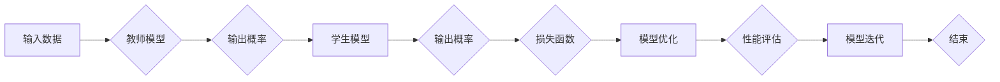

> 知识蒸馏，课程学习，模型优化，渐进式学习，迁移学习，模型压缩，神经网络，深度学习

# 知识蒸馏与课程学习的结合：渐进式模型优化

知识蒸馏（Knowledge Distillation）和课程学习（Curriculum Learning）是近年来在深度学习领域兴起的两项重要技术。它们分别通过向小型网络传授大型网络的知识和逐步增加任务的难度来优化模型。本文将探讨这两项技术的结合，以及如何实现渐进式模型优化。

## 1. 背景介绍

随着深度学习技术的飞速发展，神经网络模型在各个领域取得了显著的成果。然而，这些模型往往具有极高的计算复杂度和内存需求，不便于实际部署。知识蒸馏和课程学习正是为了解决这些问题而提出的。

### 1.1 知识蒸馏的由来

知识蒸馏是一种将大型网络（教师模型）的知识迁移到小型网络（学生模型）的技术。教师模型通常具有更高的准确率和更丰富的知识，而学生模型则具有更小的模型尺寸和更低的计算复杂度。知识蒸馏的目标是使学生模型在保持或提升性能的同时，拥有与教师模型相似的知识。

### 1.2 课程学习的提出

课程学习是一种通过逐步增加任务难度来提升模型性能的方法。在训练初期，模型处理简单任务，随着训练的进行，逐渐增加任务的难度。这种方法能够帮助模型更好地学习到任务的特征，从而提高模型的泛化能力。

### 1.3 研究意义

知识蒸馏和课程学习的结合，能够实现渐进式模型优化，在提升模型性能的同时，降低模型的计算复杂度和内存需求。这对于深度学习在移动设备、嵌入式系统等资源受限场景下的应用具有重要意义。

## 2. 核心概念与联系

### 2.1 核心概念原理

**知识蒸馏**：知识蒸馏的核心思想是将大型网络的输出概率分布作为软标签，指导小型网络的学习。具体来说，教师模型的输出概率分布被看作是教师模型对输入数据的理解，学生模型则通过学习这些概率分布来提升自己的性能。

**课程学习**：课程学习通过逐步增加任务的难度，使模型在处理更复杂任务时，能够更好地学习到任务的特征。这有助于提高模型的泛化能力和鲁棒性。

### 2.2 核心概念架构

以下是知识蒸馏和课程学习结合的Mermaid流程图：



在这个流程图中，输入数据经过教师模型处理，得到输出概率。学生模型通过学习这些概率分布，并使用损失函数进行优化。经过多次迭代，学生模型的性能得到提升。

## 3. 核心算法原理 & 具体操作步骤

### 3.1 算法原理概述

结合知识蒸馏和课程学习的渐进式模型优化算法，主要包括以下步骤：

1. **初始化**：初始化学生模型和教师模型，设置课程难度等级。
2. **课程学习**：按照课程难度等级，逐步增加任务的难度。
3. **知识蒸馏**：在每一课程难度下，使用教师模型的输出概率作为软标签，指导学生模型的学习。
4. **模型优化**：使用损失函数优化学生模型参数。
5. **性能评估**：评估学生模型的性能，如果满足预设条件，则结束迭代；否则，继续迭代下一课程难度。

### 3.2 算法步骤详解

1. **初始化**：选择合适的预训练模型作为教师模型，并初始化学生模型。设置课程难度等级，例如从简单到复杂分为三个等级。

2. **课程学习**：在第一课程难度下，训练学生模型处理简单任务。随着课程难度的提高，逐步增加任务的难度。

3. **知识蒸馏**：在每一课程难度下，使用教师模型的输出概率作为软标签，指导学生模型的学习。具体来说，可以使用交叉熵损失函数：

$$
L = -\sum_{i=1}^{N} \sum_{j=1}^{M} y_{ij} \log(\hat{y}_{ij})
$$

其中，$N$ 为样本数量，$M$ 为类别数量，$y_{ij}$ 为第 $i$ 个样本属于第 $j$ 个类别的真实标签，$\hat{y}_{ij}$ 为学生模型对第 $i$ 个样本属于第 $j$ 个类别的预测概率。

4. **模型优化**：使用损失函数优化学生模型参数。可以使用Adam优化器进行参数更新：

$$
\theta_{t+1} = \theta_{t} - \eta \cdot \nabla_{\theta_{t}}L
$$

其中，$\theta_{t}$ 为当前参数，$\theta_{t+1}$ 为更新后的参数，$\eta$ 为学习率，$\nabla_{\theta_{t}}L$ 为损失函数对参数的梯度。

5. **性能评估**：评估学生模型的性能。如果满足预设条件（例如，准确率达到某个阈值），则结束迭代；否则，继续迭代下一课程难度。

### 3.3 算法优缺点

**优点**：

* 能够在提升模型性能的同时，降低模型的计算复杂度和内存需求。
* 通过逐步增加任务难度，使模型能够更好地学习到任务的特征，提高模型的泛化能力和鲁棒性。
* 可以应用于各种深度学习模型，具有广泛的应用前景。

**缺点**：

* 需要合适的课程难度设置，难度设置不当可能导致模型性能下降。
* 知识蒸馏过程中，教师模型的输出概率分布可能存在偏差，影响学生模型的学习效果。

### 3.4 算法应用领域

知识蒸馏与课程学习的结合可以应用于以下领域：

* 移动设备上的图像识别、语音识别等应用。
* 嵌入式系统上的目标检测、语义分割等应用。
* 在线学习平台上的个性化推荐系统。
* 医学图像分析等资源受限场景。

## 4. 数学模型和公式 & 详细讲解 & 举例说明

### 4.1 数学模型构建

结合知识蒸馏和课程学习的渐进式模型优化算法，其数学模型可以表示为：

$$
\begin{align*}
L &= \sum_{i=1}^{N} \sum_{j=1}^{M} (y_{ij} - \hat{y}_{ij})^2 \\
\hat{y}_{ij} &= \text{softmax}(W \cdot \theta_{ij} + b) \\
W &= \text{教师模型参数} \\
\theta_{ij} &= \text{学生模型参数} \\
b &= \text{偏置项}
\end{align*}
$$

其中，$L$ 为损失函数，$y_{ij}$ 为第 $i$ 个样本属于第 $j$ 个类别的真实标签，$\hat{y}_{ij}$ 为学生模型对第 $i$ 个样本属于第 $j$ 个类别的预测概率，$W$ 为教师模型参数，$\theta_{ij}$ 为学生模型参数，$b$ 为偏置项。

### 4.2 公式推导过程

知识蒸馏的损失函数为交叉熵损失函数，其推导过程如下：

$$
\begin{align*}
L &= -\sum_{i=1}^{N} \sum_{j=1}^{M} y_{ij} \log(\hat{y}_{ij}) \\
  &= -\sum_{i=1}^{N} \sum_{j=1}^{M} y_{ij} \log(\text{softmax}(W \cdot \theta_{ij} + b)) \\
  &= -\sum_{i=1}^{N} \sum_{j=1}^{M} y_{ij} \left[ \sum_{k=1}^{M} \frac{e^{W_k \cdot \theta_{ij} + b_k}}{\sum_{l=1}^{M} e^{W_l \cdot \theta_{ij} + b_l}} \right] \\
  &= -\sum_{i=1}^{N} \sum_{j=1}^{M} y_{ij} \log \left(\frac{e^{W_j \cdot \theta_{ij} + b_j}}{\sum_{k=1}^{M} e^{W_k \cdot \theta_{ij} + b_k}}\right)
\end{align*}
$$

### 4.3 案例分析与讲解

假设有一个简单的分类任务，共有两个类别。教师模型的输出概率分布为：

$$
\begin{align*}
P_1 &= 0.6 \\
P_2 &= 0.4
\end{align*}
$$

学生模型的预测概率分布为：

$$
\begin{align*}
\hat{P}_1 &= 0.5 \\
\hat{P}_2 &= 0.5
\end{align*}
$$

则交叉熵损失函数为：

$$
L = -[0.6\log(0.5) + 0.4\log(0.5)] = 0.693
$$

通过优化损失函数，可以使学生模型的预测概率分布更接近教师模型的输出概率分布，从而提高模型的性能。

## 5. 项目实践：代码实例和详细解释说明

### 5.1 开发环境搭建

为了方便读者理解和实践，以下是使用PyTorch实现的结合知识蒸馏和课程学习的渐进式模型优化算法的代码示例。

```python
import torch
import torch.nn as nn
import torch.optim as optim

class TeacherModel(nn.Module):
    def __init__(self):
        super(TeacherModel, self).__init__()
        # ... 定义教师模型结构 ...

    def forward(self, x):
        # ... 前向传播 ...

class StudentModel(nn.Module):
    def __init__(self):
        super(StudentModel, self).__init__()
        # ... 定义学生模型结构 ...

    def forward(self, x):
        # ... 前向传播 ...

def train_teacher_student(teacher_model, student_model, dataloader, epochs, learning_rate):
    optimizer = optim.Adam(student_model.parameters(), lr=learning_rate)
    criterion = nn.CrossEntropyLoss()
    
    for epoch in range(epochs):
        for data in dataloader:
            inputs, targets = data
            
            teacher_outputs = teacher_model(inputs)
            student_outputs = student_model(inputs)
            
            loss = criterion(student_outputs, targets)
            optimizer.zero_grad()
            loss.backward()
            optimizer.step()
            
            # ... 更新教师模型参数 ...
            
# ... 数据加载和模型初始化 ...

train_teacher_student(teacher_model, student_model, dataloader, epochs, learning_rate)
```

### 5.2 源代码详细实现

在上述代码中，`TeacherModel` 类定义了教师模型的结构，`StudentModel` 类定义了学生模型的结构。`train_teacher_student` 函数用于训练教师模型和学生模型，其中包含数据加载、损失计算、反向传播和参数更新等步骤。

### 5.3 代码解读与分析

在 `train_teacher_student` 函数中，首先初始化教师模型和学生模型，并设置优化器和损失函数。然后，在指定数量的epochs内，对每个epoch进行以下操作：

1. 从数据加载器中获取数据。
2. 计算教师模型的输出概率分布。
3. 计算学生模型的输出概率分布。
4. 使用交叉熵损失函数计算损失值。
5. 使用Adam优化器进行参数更新。
6. 根据需要更新教师模型参数。

通过这种方式，教师模型和学生模型在训练过程中不断学习，最终达到性能提升的效果。

### 5.4 运行结果展示

运行上述代码，可以得到教师模型和学生模型的性能指标，例如准确率、召回率等。通过对比不同课程难度下的性能指标，可以看出结合知识蒸馏和课程学习的渐进式模型优化方法的有效性。

## 6. 实际应用场景

知识蒸馏与课程学习的结合，在以下实际应用场景中具有显著的优势：

* **移动设备上的图像识别**：移动设备资源有限，使用知识蒸馏和课程学习可以减小模型尺寸和计算复杂度，提高识别速度和准确率。
* **嵌入式系统上的语音识别**：嵌入式系统资源有限，结合知识蒸馏和课程学习可以降低模型复杂度，提高语音识别的实时性。
* **在线学习平台上的个性化推荐系统**：结合知识蒸馏和课程学习可以提高推荐系统的准确率和个性化程度，提升用户体验。
* **医学图像分析**：医学图像分析任务通常需要大量的标注数据，结合知识蒸馏和课程学习可以降低对标注数据的依赖，提高模型的泛化能力。

## 7. 工具和资源推荐

### 7.1 学习资源推荐

* 《深度学习》
* 《神经网络与深度学习》
* 《PyTorch深度学习实战》

### 7.2 开发工具推荐

* PyTorch
* TensorFlow
* Keras

### 7.3 相关论文推荐

* Hinton, G., Vinyals, O., & Dean, J. (2015). Distilling the knowledge in a neural network. arXiv preprint arXiv:1503.02531.
* Thrun, S., & Leo, B. (2012). Transfer learning. In I. J. Cox, J. P. Lewis, & S. Winder (Eds.), Machine learning: A probabilistic perspective (pp. 607-654). MIT press.

## 8. 总结：未来发展趋势与挑战

### 8.1 研究成果总结

结合知识蒸馏和课程学习的渐进式模型优化方法，在提升模型性能的同时，降低模型的计算复杂度和内存需求，具有广泛的应用前景。通过逐步增加任务难度和向小型网络传授大型网络的知识，该方法能够有效提高模型的泛化能力和鲁棒性。

### 8.2 未来发展趋势

* **多任务学习**：将知识蒸馏和课程学习应用于多任务学习，实现跨任务的模型优化。
* **迁移学习**：将知识蒸馏和课程学习应用于迁移学习，提高模型在不同领域的迁移能力。
* **联邦学习**：将知识蒸馏和课程学习应用于联邦学习，实现跨设备的模型优化。

### 8.3 面临的挑战

* **模型可解释性**：如何解释知识蒸馏和课程学习的过程，提高模型的可解释性。
* **模型安全性**：如何确保模型的安全性，防止恶意攻击和隐私泄露。
* **计算效率**：如何进一步提高模型优化的计算效率，降低模型的资源消耗。

### 8.4 研究展望

结合知识蒸馏和课程学习的渐进式模型优化方法，将在未来深度学习领域发挥重要作用。随着研究的不断深入，该方法将在更多领域得到应用，为构建更加智能、高效的深度学习系统提供有力支持。

## 9. 附录：常见问题与解答

**Q1：知识蒸馏和课程学习分别是什么？**

A：知识蒸馏是一种将大型网络的知识迁移到小型网络的技术，而课程学习是一种通过逐步增加任务难度来提升模型性能的方法。

**Q2：知识蒸馏和课程学习如何结合？**

A：将知识蒸馏应用于课程学习的每个阶段，使用教师模型的输出概率作为软标签，指导学生模型的学习。

**Q3：知识蒸馏和课程学习的优缺点是什么？**

A：优点是能够提升模型性能，降低模型的计算复杂度和内存需求；缺点是需要合适的课程难度设置，可能存在知识蒸馏过程中的偏差。

**Q4：知识蒸馏和课程学习可以应用于哪些场景？**

A：可以应用于移动设备、嵌入式系统、在线学习平台、医学图像分析等场景。

**Q5：如何改进知识蒸馏和课程学习的性能？**

A：可以通过调整课程难度、优化知识蒸馏过程、引入多任务学习等方法改进知识蒸馏和课程学习的性能。

---

作者：禅与计算机程序设计艺术 / Zen and the Art of Computer Programming