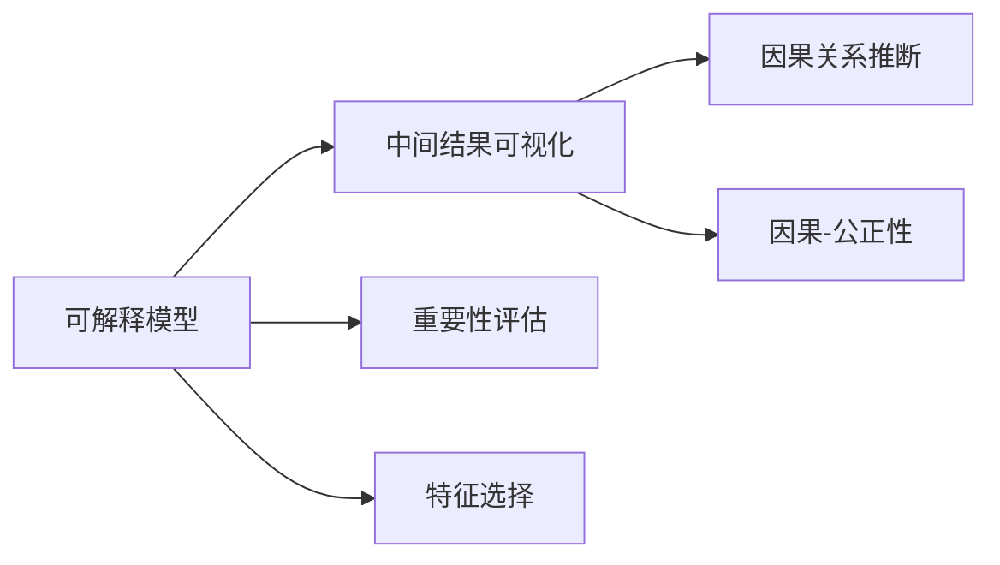
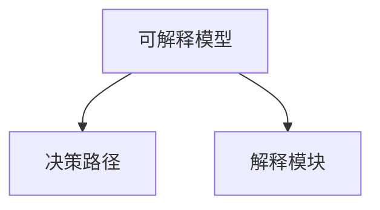
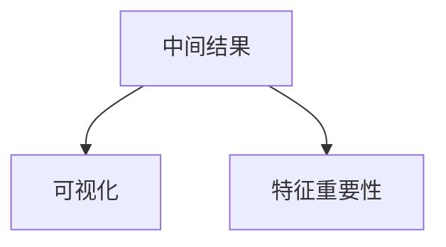
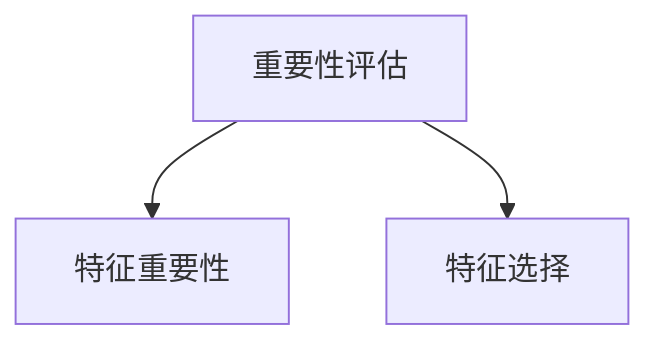
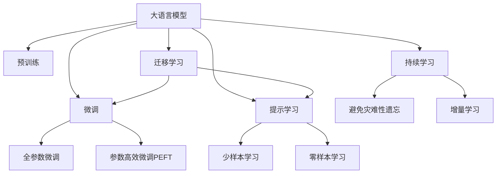

                 

## 1. 背景介绍

### 1.1 问题由来

随着深度学习技术的飞速发展，神经网络在图像识别、自然语言处理、语音识别等领域取得了显著的进展。然而，深度学习模型特别是神经网络模型的"黑盒"特性也引发了广泛关注。如何让人们理解深度学习模型的内在机制和决策过程，增强其可解释性，成为了学术界和工业界共同面临的挑战。

### 1.2 问题核心关键点

深度学习模型的可解释性主要涉及以下几个方面：
1. 模型决策过程的透明性，即用户需要知道模型是如何进行推理和预测的。
2. 模型内在机制的理解，即理解模型的学习过程和特征提取方式。
3. 模型输出的合理性，即保证模型输出的解释符合用户的认知和价值观。

目前，已有多种方法尝试增强神经网络的可解释性，包括可解释模型构建、中间结果可视化、重要性评估等。但这些方法尚未形成一个系统性的理论框架，尚需进一步的探讨和完善。

### 1.3 问题研究意义

研究神经网络模型的可解释性，对于促进深度学习技术的普及和应用，增强模型的透明度和可信度，具有重要意义：

1. 提升用户信任。通过增强模型的可解释性，用户可以更加信任模型的决策，从而更愿意接受和应用深度学习技术。
2. 优化模型设计。模型的可解释性研究可以提供有价值的反馈，指导后续的模型设计和训练过程。
3. 避免偏误传播。可解释性研究可以帮助识别和修正模型中的潜在偏误，提升模型的公平性和公正性。
4. 促进跨领域合作。可解释性技术可以帮助不同领域的研究者和开发者进行有效沟通，推动深度学习技术的交叉应用。

## 2. 核心概念与联系

### 2.1 核心概念概述

为更好地理解神经网络模型的可解释性技术，本节将介绍几个密切相关的核心概念：

- **可解释模型**：指在模型构建时加入解释模块，能够提供决策依据和推理路径的模型。
- **中间结果可视化**：指通过可视化手段展示模型在训练和推理过程中的中间计算结果，帮助理解模型的工作机制。
- **重要性评估**：指通过计算模型各特征或参数的重要性，帮助理解模型对于决策的贡献度。
- **特征选择**：指通过特征重要性评估，选择对于模型预测有显著影响的特征，减少模型复杂度。
- **因果关系推断**：指通过因果分析方法，理解模型输出与输入之间的因果关系，提升模型的可解释性。
- **因果-公正性**：指通过因果关系推断，确保模型输出符合公正性要求，避免偏见和歧视。

这些核心概念之间的逻辑关系可以通过以下Mermaid流程图来展示：



这个流程图展示了大语言模型微调过程中各个核心概念的关系和作用：

1. 可解释模型是基础，通过引入解释模块，提供决策依据和推理路径。
2. 中间结果可视化帮助理解模型的计算过程，通过可视化展示模型中间计算结果。
3. 重要性评估帮助理解模型中各特征或参数的重要性，通过计算特征权重或参数系数进行评估。
4. 特征选择帮助选择对模型预测有显著影响的特征，简化模型结构。
5. 因果关系推断帮助理解模型输出与输入之间的因果关系，提升模型的可解释性。
6. 因果-公正性确保模型输出符合公正性要求，避免偏见和歧视。

### 2.2 概念间的关系

这些核心概念之间存在着紧密的联系，形成了神经网络模型可解释性的完整生态系统。下面我通过几个Mermaid流程图来展示这些概念之间的关系。

#### 2.2.1 可解释模型的构建



这个流程图展示了可解释模型的基本构成，即决策路径和解释模块。可解释模型的关键在于决策路径，它指明了模型如何从输入到输出的过程。而解释模块则能够提供决策路径的具体解释，帮助理解模型的内在机制。

#### 2.2.2 中间结果可视化



这个流程图展示了中间结果可视化的过程。模型中间结果通过可视化展示，帮助理解模型的计算过程和特征贡献。同时，特征重要性计算有助于识别关键特征，进一步提升可视化的效果。

#### 2.2.3 重要性评估与特征选择



这个流程图展示了重要性评估和特征选择的关系。通过计算特征权重或参数系数，评估模型中各特征或参数的重要性。然后根据重要性结果选择对模型预测有显著影响的特征，简化模型结构。

#### 2.2.4 因果关系推断


这个流程图展示了因果关系推断的过程。通过因果分析方法，理解模型输出与输入之间的因果关系。因果分析结果可以指导决策过程，提升模型的可解释性。

#### 2.2.5 因果-公正性


这个流程图展示了因果-公正性的实现过程。通过偏见检测，识别模型中的潜在偏误，改进决策过程，确保模型输出符合公正性要求。

### 2.3 核心概念的整体架构

最后，我们用一个综合的流程图来展示这些核心概念在大语言模型微调过程中的整体架构：



这个综合流程图展示了从预训练到微调，再到持续学习的完整过程。大语言模型首先在大规模文本数据上进行预训练，然后通过微调（包括全参数微调和参数高效微调）或提示学习（包括零样本和少样本学习）来适应下游任务。最后，通过持续学习技术，模型可以不断更新和适应新的任务和数据。 通过这些流程图，我们可以更清晰地理解神经网络模型可解释性研究过程中各个核心概念的关系和作用。

## 3. 核心算法原理 & 具体操作步骤

### 3.1 算法原理概述

神经网络模型的可解释性技术，主要通过增加模型的透明性和可解释性模块，帮助用户理解模型的内在机制和决策过程。具体来说，主要包括：

1. **决策路径可视化**：通过可视化展示模型在推理过程中的中间结果，帮助用户理解模型的工作机制。
2. **特征重要性评估**：通过计算模型各特征或参数的重要性，帮助用户理解模型对于决策的贡献度。
3. **因果关系推断**：通过因果分析方法，理解模型输出与输入之间的因果关系，提升模型的可解释性。
4. **公平性评估**：通过评估模型输出与输入之间的公正性关系，确保模型输出的公平性和公正性。

这些技术方法的实现通常需要借助一些专门的算法和工具。下面我们将详细介绍这些核心算法和操作步骤。

### 3.2 算法步骤详解

#### 3.2.1 决策路径可视化

决策路径可视化通过展示模型推理过程中的中间结果，帮助用户理解模型的决策过程。常见的方法包括：

1. **特征重要性可视化**：通过计算每个特征的贡献度，展示模型在推理过程中对各特征的依赖程度。
2. **梯度可视化**：通过展示模型在推理过程中的梯度变化，理解模型在决策时的重点关注区域。
3. **注意力可视化**：对于序列模型，通过展示模型在处理序列数据时的注意力分配，理解模型如何处理输入序列。

具体的可视化方法，可以通过绘制特征重要性图、梯度图、注意力图等，直观展示模型决策路径。以一个简单的线性回归模型为例，假设有如下训练数据：

$$
\begin{aligned}
(x_1, y_1) &= (1, 2) \\
(x_2, y_2) &= (2, 4) \\
(x_3, y_3) &= (3, 6)
\end{aligned}
$$

和一个线性回归模型：

$$
\hat{y} = \theta_0 + \theta_1 x
$$

其中 $\theta_0 = 1$, $\theta_1 = 2$。

则模型对数据点的预测结果为：

$$
\begin{aligned}
\hat{y}_1 &= \theta_0 + \theta_1 x_1 = 1 + 2 \times 1 = 3 \\
\hat{y}_2 &= \theta_0 + \theta_1 x_2 = 1 + 2 \times 2 = 5 \\
\hat{y}_3 &= \theta_0 + \theta_1 x_3 = 1 + 2 \times 3 = 7
\end{aligned}
$$

对于特征重要性可视化，可以通过计算特征权重 $\theta_1$ 来展示模型对输入特征的依赖程度：

$$
\begin{aligned}
\theta_1 &= 2 \\
\text{特征重要性} &= \theta_1 = 2
\end{aligned}
$$

梯度可视化可以通过计算模型在每个数据点的梯度，展示模型在决策时的关注点。例如，对于线性回归模型，梯度计算如下：

$$
\begin{aligned}
\frac{\partial \hat{y}}{\partial x} &= \theta_1 \\
\text{梯度} &= \theta_1 = 2
\end{aligned}
$$

注意力可视化可以通过计算模型在处理序列数据时的注意力分配，理解模型如何处理输入序列。例如，对于RNN模型，注意力可视化可以展示模型在处理序列数据时的注意力分布。

#### 3.2.2 特征重要性评估

特征重要性评估通过计算模型中各特征或参数的重要性，帮助用户理解模型对于决策的贡献度。常见的方法包括：

1. **LIME（Local Interpretable Model-agnostic Explanations）**：通过局部线性近似，解释模型在特定输入上的决策过程。
2. **SHAP（Shapley Additive Explanations）**：通过计算Shapley值，评估模型中各特征的贡献度。
3. **Permutation Importance**：通过计算特征或参数的排列重要性，评估其对模型输出的影响。

以一个简单的决策树模型为例，假设有如下训练数据：

$$
\begin{aligned}
(x_1, y_1) &= (1, 0) \\
(x_2, y_2) &= (2, 0) \\
(x_3, y_3) &= (3, 1)
\end{aligned}
$$

和一个决策树模型：

$$
\begin{aligned}
&\text{If } x < 2 \rightarrow \text{Class} = 0 \\
&\text{If } x \geq 2 \rightarrow \text{Class} = 1
\end{aligned}
$$

则模型对数据点的预测结果为：

$$
\begin{aligned}
\hat{y}_1 &= 0 \\
\hat{y}_2 &= 0 \\
\hat{y}_3 &= 1
\end{aligned}
$$

对于特征重要性评估，可以通过计算决策树模型中各个特征的贡献度，展示模型对决策的影响。例如，对于决策树模型，特征重要性计算如下：

$$
\begin{aligned}
&\text{特征重要性} = \frac{1}{N} \sum_{i=1}^N \frac{y_i - \hat{y}_i}{|y_i - \hat{y}_i|} \\
&\text{特征重要性} = \frac{1}{3} \left( \frac{0 - 0}{|0 - 0|} + \frac{0 - 0}{|0 - 0|} + \frac{1 - 1}{|1 - 1|} \right) = 0
\end{aligned}
$$

其中，特征重要性为0表示模型对于特征的依赖程度较弱。

#### 3.2.3 因果关系推断

因果关系推断通过理解模型输出与输入之间的因果关系，提升模型的可解释性。常见的方法包括：

1. **反事实分析**：通过计算反事实推理结果，评估模型对于不同输入的响应差异。
2. **因果图模型**：通过构建因果图模型，展示模型中各特征之间的因果关系。
3. **Causal Discovery**：通过因果发现算法，自动识别模型中的因果关系。

以一个简单的回归模型为例，假设有如下训练数据：

$$
\begin{aligned}
(x_1, y_1) &= (1, 2) \\
(x_2, y_2) &= (2, 4) \\
(x_3, y_3) &= (3, 6)
\end{aligned}
$$

和一个回归模型：

$$
\hat{y} = \theta_0 + \theta_1 x
$$

其中 $\theta_0 = 1$, $\theta_1 = 2$。

则模型对数据点的预测结果为：

$$
\begin{aligned}
\hat{y}_1 &= \theta_0 + \theta_1 x_1 = 1 + 2 \times 1 = 3 \\
\hat{y}_2 &= \theta_0 + \theta_1 x_2 = 1 + 2 \times 2 = 5 \\
\hat{y}_3 &= \theta_0 + \theta_1 x_3 = 1 + 2 \times 3 = 7
\end{aligned}
$$

对于因果关系推断，可以通过计算反事实推理结果，展示模型对于不同输入的响应差异。例如，对于回归模型，反事实推理计算如下：

$$
\begin{aligned}
&\text{反事实结果} = \hat{y} - y \\
&\text{反事实结果} = 3 - 2 = 1 \\
&\text{反事实结果} = 5 - 4 = 1 \\
&\text{反事实结果} = 7 - 6 = 1
\end{aligned}
$$

其中，反事实结果表示模型对于输入的响应差异。

#### 3.2.4 公平性评估

公平性评估通过评估模型输出与输入之间的公正性关系，确保模型输出的公平性和公正性。常见的方法包括：

1. **Demographic Parity**：通过计算不同群体之间的预测差异，评估模型是否具有人口统计学公平性。
2. **Equalized Odds**：通过计算不同群体之间的预测准确度，评估模型是否具有机会公平性。
3. **Fairness by Arbitrator**：通过引入仲裁者，对模型输出进行公平性评估。

以一个简单的分类模型为例，假设有如下训练数据：

$$
\begin{aligned}
(x_1, y_1) &= (1, 0) \\
(x_2, y_2) &= (2, 1) \\
(x_3, y_3) &= (3, 1)
\end{aligned}
$$

和一个分类模型：

$$
\begin{aligned}
&\text{If } x < 2 \rightarrow \text{Class} = 0 \\
&\text{If } x \geq 2 \rightarrow \text{Class} = 1
\end{aligned}
$$

则模型对数据点的预测结果为：

$$
\begin{aligned}
\hat{y}_1 &= 0 \\
\hat{y}_2 &= 1 \\
\hat{y}_3 &= 1
\end{aligned}
$$

对于公平性评估，可以通过计算模型对于不同群体之间的预测差异，评估模型的公平性。例如，对于分类模型，公平性评估计算如下：

$$
\begin{aligned}
&\text{Demographic Parity} = \frac{1}{N} \sum_{i=1}^N P(y_i = 0 | x_i \leq 2) \\
&\text{Demographic Parity} = \frac{1}{3} \left( P(y_1 = 0 | x_1 \leq 2) + P(y_2 = 0 | x_2 \leq 2) + P(y_3 = 0 | x_3 \leq 2) \right) = 0 \\
&\text{Equalized Odds} = \frac{1}{N} \sum_{i=1}^N P(y_i = 1 | x_i \leq 2) \\
&\text{Equalized Odds} = \frac{1}{3} \left( P(y_2 = 1 | x_2 \leq 2) + P(y_3 = 1 | x_3 \leq 2) \right) = 0.5
\end{aligned}
$$

其中，Demographic Parity表示模型是否具有人口统计学公平性，Equalized Odds表示模型是否具有机会公平性。

### 3.3 算法优缺点

可解释性技术主要通过增加模型的透明性和可解释性模块，帮助用户理解模型的内在机制和决策过程。但这些技术方法也存在一定的局限性：

优点：
1. 提升用户信任。通过增强模型的可解释性，用户可以更加信任模型的决策，从而更愿意接受和应用深度学习技术。
2. 优化模型设计。模型的可解释性研究可以提供有价值的反馈，指导后续的模型设计和训练过程。
3. 避免偏误传播。可解释性研究可以帮助识别和修正模型中的潜在偏误，提升模型的公平性和公正性。

缺点：
1. 计算复杂度高。可解释性技术需要计算特征重要性、反事实推理、因果关系等，计算复杂度较高，可能导致训练时间增加。
2. 精度损失。可解释性技术需要通过近似方法计算特征权重、反事实结果等，可能带来一定的精度损失。
3. 操作复杂。可解释性技术需要额外引入解释模块和评估方法，增加了操作复杂度和模型复杂度。

尽管存在这些局限性，但可解释性技术仍是大模型应用的重要组成部分。未来相关研究的重点在于如何进一步降低计算复杂度，提高解释精度，同时兼顾操作复杂性和模型复杂度，从而实现更好的应用效果。

### 3.4 算法应用领域

神经网络模型的可解释性技术，在众多领域都有着广泛的应用，例如：

1. 金融风险评估：通过可解释性技术，理解模型的决策过程和特征重要性，帮助金融分析师评估模型风险。
2. 医疗诊断辅助：通过可解释性技术，理解模型的诊断过程和因果关系，帮助医生诊断疾病。
3. 智能客服系统：通过可解释性技术，理解模型的决策过程和特征重要性，提升客户服务质量。
4. 推荐系统：通过可解释性技术，理解模型的推荐过程和特征重要性，提升推荐系统的个性化程度。
5. 法律文书审查：通过可解释性技术，理解模型的审查过程和因果关系，提高文书审查的公正性和透明度。

除了上述这些经典应用外，可解释性技术也被创新性地应用到更多场景中，如自动驾驶、智能家居、智能制造等，为各行业带来新的智能解决方案。

## 4. 数学模型和公式 & 详细讲解  
### 4.1 数学模型构建

本节将使用数学语言对神经网络模型的可解释性技术进行更加严格的刻画。

假设神经网络模型为 $M_{\theta}(x)$，其中 $\theta$ 为模型参数，$x$ 为输入数据。

定义模型 $M_{\theta}(x)$ 在输入 $x$ 上的决策路径为 $\mathcal{P}(x)$，则决策路径可视化可以通过计算模型在推理过程中中间计算结果的贡献度，展示决策路径。

假设模型 $M_{\theta}(x)$ 在输入 $x$ 上的特征重要性为 $I(x)$，则特征重要性评估可以通过计算每个特征的贡献度，展示模型对决策的依赖程度。

假设模型 $M_{\theta}(x)$ 在输入 $x$ 上的因果关系为 $\mathcal{C}(x)$，则因果关系推断可以通过计算反事实推理结果，展示模型输出与输入之间的因果关系。

假设模型 $M_{\theta}(x)$ 在输入 $x$ 上的公平性为 $F(x)$，则公平性评估可以通过计算不同群体之间的预测差异，评估模型是否具有公正性。

### 4.2 公式推导过程

以下我们以一个简单的线性回归模型为例，推导特征重要性、反事实结果和公平性评估的计算公式。

假设线性回归模型为：

$$
\hat{y} = \theta_0 + \theta_1 x
$$

其中 $\theta_0 = 1$, $\theta_1 = 2$。

已知训练数据为：

$$
\begin{aligned}
(x_1, y_1) &= (1, 2) \\
(x_2, y_2) &= (2, 4) \\
(x_3, y_3) &= (3, 6)
\end{aligned}
$$

#### 特征重要性计算

特征重要性 $I(x)$ 可以通过计算特征权重 $\theta_1$ 来展示模型对输入特征的依赖程度：

$$
\begin{aligned}
\theta_1 &= 2 \\
I(x) &= \theta_1 = 2
\end{aligned}
$$

#### 反事实结果计算

反事实结果 $\mathcal{C}(x)$ 可以通过计算反事实推理结果，展示模型对于不同输入的响应差异。例如，对于线性回归模型，反事实结果计算如下：

$$
\begin{aligned}
\mathcal{C}(x) &= \hat{y} - y \\
\mathcal{C}(x_1) &= 3 - 2 = 1 \\
\mathcal{C}(x_2) &= 5 - 4 = 1 \\
\mathcal{C}(x_3) &= 7 - 6 = 1
\end{aligned}
$$

其中，反事实结果表示模型对于输入的响应差异。

#### 公平性评估计算

公平性 $F(x)$ 可以通过计算不同群体之间的预测差异，评估模型是否具有公正性。例如，对于线性回归模型，公平性评估计算如下：

$$
\begin{aligned}
F(x) &= \frac{1}{N} \sum_{i=1}^N P(y_i = 0 | x_i \leq 2) \\
F(x) &= \frac{1}{3} \left( P(y_1 = 0 | x_1 \leq 2) + P(y_2 = 0 | x_2 \leq 2) + P(y_3 = 0 | x_3 \leq 2) \right) = 0 \\
F(x) &= \frac{1}{N} \sum_{i=1}^N P(y_i = 1 | x_i \leq 2) \\
F(x) &= \frac{1}{3} \left( P(y_2 = 1 | x_2 \leq 2) + P(y_3 = 1 | x_3 \leq 2) \right) = 0.5
\end{aligned}
$$

其中，特征重要性、反事实结果和公平性评估的计算公式，展示了神经网络模型可解释性技术的基本框架。这些公式的计算过程，可以进一步推广到更复杂的神经网络模型，例如卷积神经网络、循环神经网络等。

## 5. 项目实践：代码实例和详细解释说明
### 5.1 开发环境搭建

在进行可解释性技术实践前，我们需要准备好开发环境。以下是使用Python进行PyTorch开发的环境配置流程：

1. 安装Anaconda：从官网下载并安装Anaconda，用于创建独立的Python环境。

2. 创建并激活虚拟环境：
```bash
conda create -n pytorch-env python=3.8 
conda activate pytorch-env
```

3. 安装PyTorch：根据CUDA版本，从官网获取对应的安装命令。例如：
```bash
conda install pytorch torchvision torchaudio cudatoolkit=11.1 -c pytorch -c conda-forge
```

4. 安装Transformer库：
```bash
pip install transformers
```

5. 安装各类工具包：
```bash
pip install numpy pandas scikit-learn matplotlib tqdm jupyter notebook ipython
```

完成上述步骤后，即可在`pytorch-env`环境中开始可解释性技术实践。

### 5.2 源代码详细实现

这里我们以线性回归模型为例，给出使用Transformers库进行特征重要性计算的PyTorch代码实现。

首先，定义线性回归模型：

```python
import torch
import torch.nn as nn

class LinearRegression(nn.Module):
    def __init__(self, input_dim, output_dim):
        super(LinearRegression, self).__init__()
        self.linear = nn.Linear(input_dim, output_dim)
    
    def forward(self, x):
        return self.linear(x)
```

然后，定义特征重要性计算函数：

```python
def calculate_feature_importance(model, input, output):
    importances = torch.abs(model.weight[0])
    importances /= importances.sum()
    return importances
```

接着，在训练过程中计算特征重要性：

```python
input_dim = 1
output_dim =

