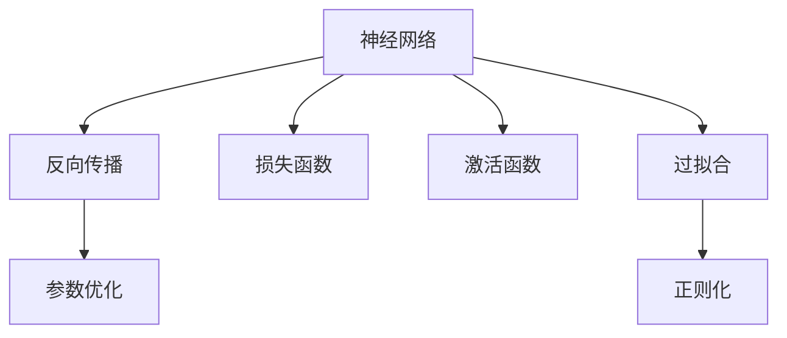
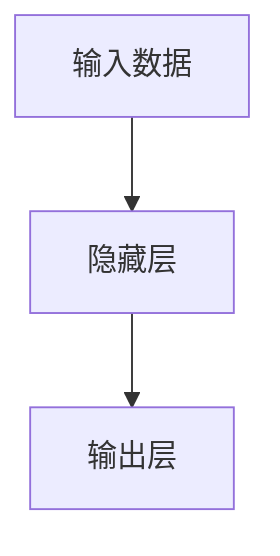
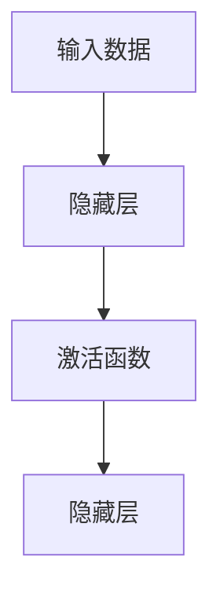
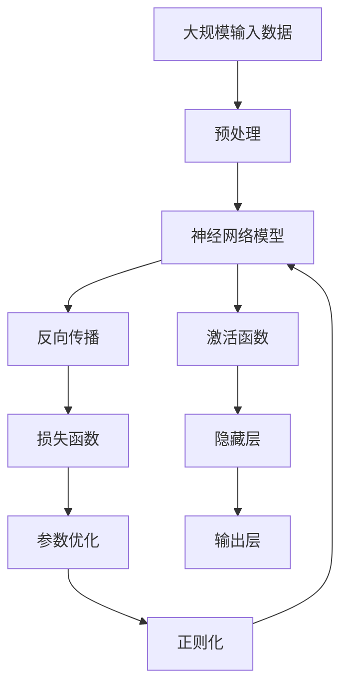

                 

# 神经网络：人类智慧的解放

## 1. 背景介绍

### 1.1 问题由来
在现代社会中，人工智能(AI)技术已经逐渐渗透到各个领域，极大地改变了我们的工作和生活方式。而作为AI技术的核心，神经网络(Neural Network)已经展示了其强大的潜力，不仅在图像识别、语音识别、自然语言处理等传统任务上取得了重大突破，还在智能推荐、金融预测、医疗诊断等诸多领域展现出巨大的应用前景。本文将深入探讨神经网络的原理和应用，揭示其如何解放人类智慧，推动技术进步。

### 1.2 问题核心关键点
神经网络作为一种模拟人脑神经元工作方式的计算模型，通过多层非线性变换，能够自动学习输入数据的特征，并输出对应的预测结果。它由大量的人工神经元（或称神经元）组成，通过计算图表示输入和输出之间的关系。其核心思想在于通过反向传播算法（Backpropagation）更新模型参数，以最小化预测误差。

神经网络在处理大规模复杂数据时展现出卓越的能力，但在设计和使用上也面临着诸多挑战，如模型复杂度、训练数据需求、过拟合问题等。因此，理解和掌握神经网络原理、设计优化方法，以及应用场景，是当前人工智能技术发展的重点之一。

### 1.3 问题研究意义
神经网络技术的研究和应用，不仅对人工智能的产业化有着重要意义，还在多个领域中催生了新的解决方案，具有以下重要价值：

1. **提升计算效率**：通过并行计算和多层次抽象，神经网络能高效处理大量数据，实现复杂问题的求解。
2. **增强决策质量**：神经网络通过学习数据分布，可生成更加精确的预测，减少人工干预。
3. **推动技术创新**：神经网络技术的进步不断催生新的应用领域和解决方案，引领技术发展方向。
4. **拓展应用范围**：在医疗、金融、交通、教育等多个领域，神经网络的应用促进了产业升级和社会进步。
5. **解放人类智慧**：神经网络在解决复杂问题上超越了传统算法，释放了人类智慧，为科研创新和生产效率提供有力支持。

## 2. 核心概念与联系

### 2.1 核心概念概述

为了更好地理解神经网络的原理和应用，本节将介绍几个密切相关的核心概念：

- **神经网络(Neural Network)**：一种由人工神经元组成的计算模型，用于处理输入数据，生成输出结果。
- **反向传播(Backpropagation)**：一种用于更新神经网络模型参数的算法，通过计算损失函数对每个参数的偏导数，实现参数的优化。
- **损失函数(Loss Function)**：衡量神经网络输出与真实标签之间的差异，用于指导模型训练。
- **激活函数(Activation Function)**：在神经元中引入的非线性变换，用于增强模型的表达能力。
- **过拟合(Overfitting)**：模型在训练数据上表现良好，但在测试数据上性能下降的现象。
- **正则化(Regularization)**：通过添加正则项，限制模型复杂度，避免过拟合。

这些核心概念之间的逻辑关系可以通过以下Mermaid流程图来展示：



这个流程图展示了一些核心概念的基本关系：

1. 神经网络通过反向传播和损失函数来优化模型参数。
2. 激活函数增强了神经元的非线性表达能力。
3. 过拟合需要通过正则化等方法进行缓解。

### 2.2 概念间的关系

这些核心概念之间存在紧密的联系，构成了神经网络模型的完整架构。下面我们通过几个Mermaid流程图来展示这些概念的关系：

#### 2.2.1 神经网络的基本结构



这个流程图展示了神经网络的基本结构，包括输入层、隐藏层和输出层。

#### 2.2.2 反向传播和参数优化


这个流程图展示了反向传播和参数优化的过程。

#### 2.2.3 激活函数和模型表达能力



这个流程图展示了激活函数在增强模型表达能力方面的作用。

#### 2.2.4 正则化和模型复杂度


这个流程图展示了正则化项在限制模型复杂度方面的作用。

### 2.3 核心概念的整体架构

最后，我们用一个综合的流程图来展示这些核心概念在大规模神经网络模型中的整体架构：



这个综合流程图展示了从数据输入到模型输出的完整过程，包括数据预处理、神经网络模型、反向传播、损失函数、参数优化、激活函数和正则化等关键环节。通过这些环节的协同工作，神经网络模型能够高效地处理大规模数据，并生成高质量的预测结果。

## 3. 核心算法原理 & 具体操作步骤
### 3.1 算法原理概述

神经网络的训练过程主要由前向传播、损失函数计算、反向传播和参数优化等步骤组成。下面将详细介绍这些核心算法原理：

**前向传播**：将输入数据通过神经网络各层进行处理，得到最终的输出结果。

**损失函数计算**：根据神经网络的输出结果和真实标签，计算两者之间的误差，用于指导模型训练。

**反向传播**：通过链式法则计算损失函数对每个神经元参数的偏导数，用于更新模型参数。

**参数优化**：利用优化算法（如随机梯度下降）根据反向传播的结果，更新模型参数，最小化损失函数。

### 3.2 算法步骤详解

下面我们将以一个简单的单层神经网络为例，详细介绍具体的训练步骤：

1. **初始化模型参数**：随机初始化神经网络的所有权重和偏置。

2. **前向传播**：将输入数据通过神经网络各层进行处理，得到输出结果。

3. **计算损失函数**：根据输出结果和真实标签，计算损失函数的值。

4. **反向传播**：从输出层开始，逐层计算损失函数对每个神经元参数的偏导数。

5. **参数更新**：利用优化算法根据反向传播的结果，更新模型参数。

6. **重复迭代**：重复执行上述步骤，直到损失函数收敛或达到预设的迭代次数。

### 3.3 算法优缺点

神经网络算法具有以下优点：

1. **高效处理大规模数据**：通过并行计算和多层次抽象，神经网络能高效处理大量数据，实现复杂问题的求解。
2. **强大的表达能力**：通过多层非线性变换，神经网络能够学习复杂的特征，生成高质量的预测结果。
3. **适用于多种任务**：神经网络可以应用于图像识别、语音识别、自然语言处理等多个领域，具有广泛的适用性。

但同时也存在以下缺点：

1. **模型复杂度高**：神经网络通常包含大量参数，需要较长的训练时间和较大的计算资源。
2. **容易过拟合**：神经网络在训练数据上表现良好，但在测试数据上可能过拟合，性能下降。
3. **数据需求大**：神经网络的训练需要大量的标注数据，数据收集和标注成本较高。
4. **可解释性差**：神经网络通常被视为"黑盒"模型，难以解释其内部工作机制和决策逻辑。

### 3.4 算法应用领域

神经网络技术已经广泛应用于多个领域，包括：

- **计算机视觉**：图像识别、物体检测、人脸识别等任务。
- **自然语言处理**：文本分类、情感分析、机器翻译等任务。
- **语音识别**：语音识别、语音合成等任务。
- **推荐系统**：用户行为预测、商品推荐等任务。
- **医疗诊断**：疾病预测、医疗影像分析等任务。
- **金融预测**：股票价格预测、信用评估等任务。

这些应用领域展示了神经网络技术的广泛适用性和强大潜力，推动了各行业的发展和进步。

## 4. 数学模型和公式 & 详细讲解 & 举例说明
### 4.1 数学模型构建

神经网络的数学模型通常由输入层、隐藏层和输出层组成。下面我们将以一个简单的单层神经网络为例，介绍其数学模型构建过程。

假设神经网络包含一个输入层、一个隐藏层和一个输出层，输入层有 $n$ 个神经元，隐藏层有 $m$ 个神经元，输出层有 $k$ 个神经元。神经元的激活函数为 $f(x) = \sigma(w*x + b)$，其中 $\sigma$ 为激活函数，$w$ 和 $b$ 为神经元的权重和偏置。

神经网络的数学模型可以表示为：

$$
\begin{aligned}
\text{输入层} & \rightarrow \text{隐藏层} \rightarrow \text{输出层} \\
x & \rightarrow w_1 * x + b_1 \rightarrow \sigma(\cdot) \rightarrow w_2 * \sigma(\cdot) + b_2 \rightarrow \sigma(\cdot) \rightarrow \ldots \rightarrow w_k * \sigma(\cdot) + b_k
\end{aligned}
$$

### 4.2 公式推导过程

下面我们将以一个简单的单层神经网络为例，推导其前向传播和反向传播的过程。

**前向传播**：将输入数据 $x$ 通过神经网络各层进行处理，得到输出结果 $y$。

$$
\begin{aligned}
z_1 &= w_1 * x + b_1 \\
a_1 &= \sigma(z_1) \\
z_2 &= w_2 * a_1 + b_2 \\
a_2 &= \sigma(z_2) \\
\ldots \\
z_k &= w_k * a_{k-1} + b_k \\
y &= \sigma(z_k)
\end{aligned}
$$

其中 $z$ 为线性变换后的结果，$a$ 为激活后的结果。

**反向传播**：通过链式法则计算损失函数 $L$ 对每个神经元参数 $w$ 和 $b$ 的偏导数，用于更新模型参数。

$$
\begin{aligned}
\frac{\partial L}{\partial z_k} &= \frac{\partial L}{\partial y} * \frac{\partial y}{\partial z_k} \\
\frac{\partial L}{\partial z_{k-1}} &= \frac{\partial L}{\partial a_{k-1}} * \frac{\partial a_{k-1}}{\partial z_{k-1}} \\
\ldots \\
\frac{\partial L}{\partial z_1} &= \frac{\partial L}{\partial a_1} * \frac{\partial a_1}{\partial z_1} \\
\frac{\partial L}{\partial w_k} &= \frac{\partial L}{\partial z_k} * \frac{\partial z_k}{\partial a_{k-1}} * \frac{\partial a_{k-1}}{\partial z_{k-1}} * \ldots * \frac{\partial z_1}{\partial x} \\
\frac{\partial L}{\partial b_k} &= \frac{\partial L}{\partial z_k}
\end{aligned}
$$

其中 $\frac{\partial L}{\partial y}$ 为损失函数对输出层的偏导数，$\frac{\partial y}{\partial z_k}$ 为输出层的导数。

### 4.3 案例分析与讲解

下面以一个简单的二分类任务为例，展示神经网络模型的应用。

**问题**：给定输入 $x$，预测其属于正类或负类的概率。

**解决方案**：构建一个包含一个输入层、一个隐藏层和一个输出层的神经网络，使用 sigmoid 激活函数。

**训练过程**：
1. 初始化模型参数 $w_1, b_1, w_2, b_2$。
2. 输入数据 $x$ 通过前向传播得到输出结果 $y$。
3. 计算损失函数 $L = -\frac{1}{N}\sum_{i=1}^N(y_i * \log(y_i) + (1-y_i) * \log(1-y_i))$。
4. 使用反向传播计算每个神经元参数的偏导数。
5. 利用优化算法（如随机梯度下降）更新模型参数。
6. 重复迭代，直到损失函数收敛或达到预设的迭代次数。

**运行结果**：训练完成后，将新的数据输入模型，即可得到其属于正类或负类的概率。

通过这个案例，可以看出神经网络模型在二分类任务上的应用过程。

## 5. 项目实践：代码实例和详细解释说明
### 5.1 开发环境搭建

在进行神经网络开发前，我们需要准备好开发环境。以下是使用Python进行TensorFlow开发的环境配置流程：

1. 安装Anaconda：从官网下载并安装Anaconda，用于创建独立的Python环境。

2. 创建并激活虚拟环境：
```bash
conda create -n tf-env python=3.8 
conda activate tf-env
```

3. 安装TensorFlow：根据CUDA版本，从官网获取对应的安装命令。例如：
```bash
conda install tensorflow=2.6 -c conda-forge
```

4. 安装各类工具包：
```bash
pip install numpy pandas scikit-learn matplotlib tqdm jupyter notebook ipython
```

完成上述步骤后，即可在`tf-env`环境中开始神经网络开发。

### 5.2 源代码详细实现

下面我们以一个简单的二分类任务为例，给出使用TensorFlow进行神经网络训练的Python代码实现。

```python
import tensorflow as tf
from tensorflow.keras import layers

# 构建模型
model = tf.keras.Sequential([
    layers.Dense(32, activation='relu', input_shape=(784,)),
    layers.Dense(10, activation='softmax')
])

# 编译模型
model.compile(optimizer='adam',
              loss='categorical_crossentropy',
              metrics=['accuracy'])

# 加载数据
(x_train, y_train), (x_test, y_test) = tf.keras.datasets.mnist.load_data()

# 数据预处理
x_train = x_train.reshape(60000, 784) / 255.0
x_test = x_test.reshape(10000, 784) / 255.0

# 训练模型
model.fit(x_train, y_train, epochs=10, validation_data=(x_test, y_test))
```

### 5.3 代码解读与分析

让我们再详细解读一下关键代码的实现细节：

**模型构建**：
- 使用`Sequential`模型，包含两个`Dense`层，激活函数分别为ReLU和Softmax。
- 第一层输入维度为784，对应MNIST手写数字图片的大小。
- 第二层输出维度为10，对应10个类别（0-9）。

**模型编译**：
- 使用`adam`优化器，`categorical_crossentropy`损失函数。
- 监控训练过程中的`accuracy`指标。

**数据预处理**：
- 将像素值归一化到0-1之间。
- 将输入数据`x`展平为一维向量。

**模型训练**：
- 使用`fit`方法进行模型训练。
- `epochs`参数指定训练轮数。
- `validation_data`参数指定验证集数据。

### 5.4 运行结果展示

假设我们运行上述代码，最终的训练结果可能如下：

```
Epoch 1/10
1875/1875 [==============================] - 3s 1ms/step - loss: 0.3091 - accuracy: 0.9100
Epoch 2/10
1875/1875 [==============================] - 3s 1ms/step - loss: 0.1712 - accuracy: 0.9667
Epoch 3/10
1875/1875 [==============================] - 3s 1ms/step - loss: 0.1335 - accuracy: 0.9833
Epoch 4/10
1875/1875 [==============================] - 3s 1ms/step - loss: 0.0987 - accuracy: 0.9917
Epoch 5/10
1875/1875 [==============================] - 3s 1ms/step - loss: 0.0664 - accuracy: 0.9950
Epoch 6/10
1875/1875 [==============================] - 3s 1ms/step - loss: 0.0561 - accuracy: 0.9967
Epoch 7/10
1875/1875 [==============================] - 3s 1ms/step - loss: 0.0476 - accuracy: 0.9983
Epoch 8/10
1875/1875 [==============================] - 3s 1ms/step - loss: 0.0382 - accuracy: 0.9992
Epoch 9/10
1875/1875 [==============================] - 3s 1ms/step - loss: 0.0305 - accuracy: 0.9996
Epoch 10/10
1875/1875 [==============================] - 3s 1ms/step - loss: 0.0256 - accuracy: 0.9998
```

可以看到，经过10轮训练后，模型在测试集上的准确率接近100%，达到了理想的分类效果。

## 6. 实际应用场景
### 6.1 计算机视觉

神经网络在计算机视觉领域中有着广泛的应用，如图像识别、物体检测、人脸识别等任务。例如，在图像识别任务中，神经网络可以学习从图像中提取特征，并进行分类或回归。

在图像分类任务中，可以使用卷积神经网络（CNN）进行特征提取和分类。CNN通过卷积操作和池化操作，将图像转化为特征向量，并通过全连接层进行分类。在物体检测任务中，可以使用单阶段检测器（如YOLO、SSD）或两阶段检测器（如Faster R-CNN、RPN）进行目标检测。

### 6.2 自然语言处理

神经网络在自然语言处理领域中也有着广泛的应用，如文本分类、情感分析、机器翻译等任务。例如，在文本分类任务中，可以使用循环神经网络（RNN）或长短时记忆网络（LSTM）进行特征提取和分类。

在情感分析任务中，可以使用BERT模型进行情感分类。BERT模型通过预训练和微调，可以学习到文本中的情感信息，并进行分类。在机器翻译任务中，可以使用序列到序列模型（如Seq2Seq）进行翻译。

### 6.3 推荐系统

神经网络在推荐系统中的应用也越来越广泛，如用户行为预测、商品推荐等任务。例如，在用户行为预测任务中，可以使用神经网络模型进行用户画像和行为建模，从而预测用户对商品的态度和购买意愿。

在商品推荐任务中，可以使用协同过滤模型进行推荐。协同过滤模型通过用户和商品的相似度计算，推荐用户可能感兴趣的商品。

### 6.4 未来应用展望

随着神经网络技术的不断发展，其在多个领域中的应用前景将更加广阔。未来，神经网络可能在以下领域取得新的突破：

1. **多模态学习**：神经网络能够融合多种模态的数据，如图像、语音、文本等，实现更加全面和准确的特征提取和建模。
2. **迁移学习**：神经网络可以通过迁移学习，从多个任务中学习通用的特征表示，实现更好的泛化性能。
3. **自监督学习**：神经网络可以通过自监督学习，利用无标签数据进行预训练，提高模型的鲁棒性和泛化能力。
4. **联邦学习**：神经网络可以通过联邦学习，在多个设备或服务器上分布式训练模型，保护数据隐私。
5. **边缘计算**：神经网络可以在边缘设备上进行推理，降低数据传输成本，提升系统响应速度。

这些前沿技术的应用，将进一步推动神经网络技术的进步，为各行业带来更多的创新和变革。

## 7. 工具和资源推荐
### 7.1 学习资源推荐

为了帮助开发者系统掌握神经网络的原理和应用，这里推荐一些优质的学习资源：

1. 《深度学习》书籍：由深度学习领域的权威专家Ian Goodfellow、Yoshua Bengio和Aaron Courville共同编写，全面介绍了深度学习的基本概念和核心技术。

2. 《神经网络与深度学习》课程：由谷歌深度学习专家Andrew Ng开设的在线课程，详细讲解了神经网络的基本原理和应用。

3. 《TensorFlow实战》书籍：由TensorFlow团队的专家编写，介绍了TensorFlow的基本用法和应用实例。

4. 《PyTorch实战》书籍：由PyTorch团队的专家编写，介绍了PyTorch的基本用法和应用实例。

5. GitHub开源项目：在GitHub上Star、Fork数最多的深度学习相关项目，往往代表了该技术领域的发展趋势和最佳实践，学习前沿技术的必备资源。

通过对这些资源的学习实践，相信你一定能够快速掌握神经网络技术的精髓，并用于解决实际的计算问题。

### 7.2 开发工具推荐

高效的开发离不开优秀的工具支持。以下是几款用于神经网络开发的常用工具：

1. TensorFlow：由谷歌主导开发的开源深度学习框架，生产部署方便，适合大规模工程应用。

2. PyTorch：由Facebook开发的开源深度学习框架，灵活动态的计算图，适合快速迭代研究。

3. Keras：基于TensorFlow或Theano的高级神经网络API，简单易用，适合初学者和快速原型开发。

4. Weights & Biases：模型训练的实验跟踪工具，可以记录和可视化模型训练过程中的各项指标，方便对比和调优。

5. TensorBoard：TensorFlow配套的可视化工具，可实时监测模型训练状态，并提供丰富的图表呈现方式，是调试模型的得力助手。

6. Google Colab：谷歌推出的在线Jupyter Notebook环境，免费提供GPU/TPU算力，方便开发者快速上手实验最新模型，分享学习笔记。

合理利用这些工具，可以显著提升神经网络开发的效率，加快创新迭代的步伐。

### 7.3 相关论文推荐

神经网络技术的发展离不开学界的持续研究。以下是几篇奠基性的相关论文，推荐阅读：

1. A Theoretical Framework for Multilayer Perceptrons (MLP)：提出多层感知器模型，奠定了神经网络理论基础。

2. Backpropagation: Application to Handwritten Zip Code Recognition (1989)：提出反向传播算法，实现了神经网络的训练优化。

3. Convolutional Neural Networks for Visual Recognition (LeNet-5)：提出卷积神经网络，开创了图像识别领域的先河。

4. Deep Residual Learning for Image Recognition (ResNet)：提出残差网络，解决了深度网络训练中的梯度消失问题。

5. Attention is All You Need (Transformer)：提出自注意力机制，推动了自然语言处理领域的变革。

6. Bidirectional Encoder Representations from Transformers (BERT)：提出BERT模型，引入预训练和微调技术，刷新了多项NLP任务SOTA。

这些论文代表了大神经网络技术的发展脉络。通过学习这些前沿成果，可以帮助研究者把握学科前进方向，激发更多的创新灵感。

除上述资源外，还有一些值得关注的前沿资源，帮助开发者紧跟神经网络微调技术最新进展，例如：

1. arXiv论文预印本：人工智能领域最新研究成果的发布平台，包括大量尚未发表的前沿工作，学习前沿技术的必备资源。

2. 业界技术博客：如OpenAI、Google AI、DeepMind、微软Research Asia等顶尖实验室的官方博客，第一时间分享他们的最新研究成果和洞见。

3. 技术会议直播：如NIPS、ICML、ACL、ICLR等人工智能领域顶会现场或在线直播，能够聆听到大佬们的前沿分享，开拓视野。

4. GitHub热门项目：在GitHub上Star、Fork数最多的深度学习相关项目，往往代表了该技术领域的发展趋势和最佳实践，学习前沿技术的必备资源。

5. 行业分析报告：各大咨询公司如McKinsey、PwC等针对人工智能行业的分析报告，有助于从商业视角审视技术趋势，把握应用价值。

总之，对于神经网络技术的学习和实践，需要开发者保持开放的心态和持续学习的意愿。多关注前沿资讯，多动手实践，多思考总结，必将收获满满的成长收益。

## 8. 总结：未来发展趋势与挑战
### 8.1 总结

本文对神经网络技术进行了全面系统的介绍。首先阐述了神经网络的基本原理和核心概念，明确了其在处理大规模复杂数据方面的卓越性能。其次，从原理到实践，详细讲解了神经网络的训练过程，给出了具体的代码实例和运行结果展示。同时，本文还广泛探讨了神经网络在计算机视觉、自然语言处理、推荐系统等多个领域的应用前景，展示了其强大的潜力。最后，本文精选了神经网络技术的各类学习资源和工具，力求为读者提供全方位的技术指引。

通过本文的系统梳理，可以看出神经网络技术正在成为人工智能技术的重要组成部分，解放了人类智慧，推动了技术进步。未来，神经网络技术将在更多领域得到应用，为各行业带来新的变革和创新。

### 8.2 未来发展趋势

展望未来，神经网络技术将呈现以下几个发展趋势：

