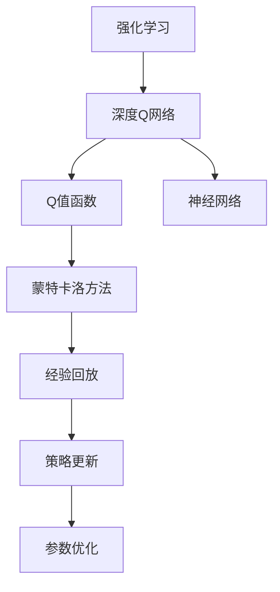
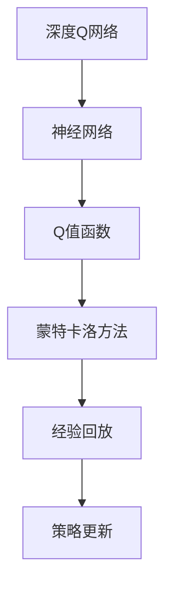
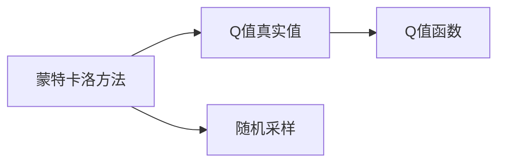
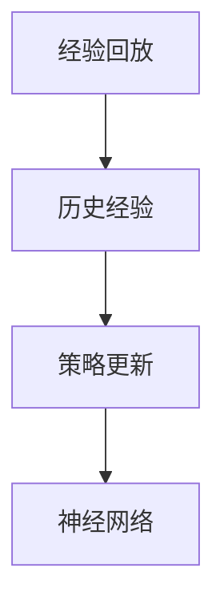
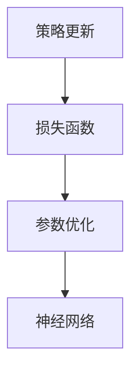
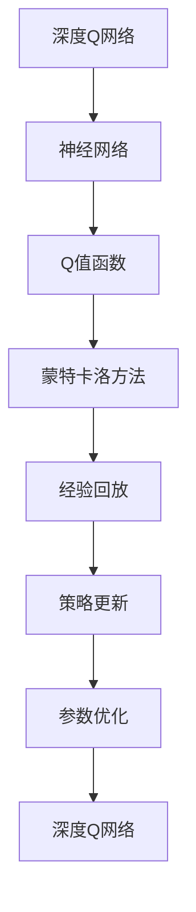

                 

# 一切皆是映射：解析DQN的损失函数设计和影响因素

> 关键词：DQN, 损失函数, 强化学习, 深度学习, 神经网络, 深度Q网络, Q-learning, 蒙特卡洛方法, 经验回放, 策略更新

## 1. 背景介绍

### 1.1 问题由来
深度强化学习（Deep Reinforcement Learning, DRL）是机器学习领域的前沿研究方向，它将深度神经网络与强化学习相结合，为解决复杂的决策问题提供了全新的思路。其中，深度Q网络（Deep Q Network, DQN）是一种基于深度神经网络的强化学习算法，广泛应用于游戏智能、机器人控制、自动驾驶等领域，取得了显著的成果。

DQN的核心在于通过神经网络模型逼近Q函数，从而实现对环境的价值评估和策略优化。Q函数是一种描述状态动作对的价值函数，表示从当前状态出发，执行某个动作后在后续状态下获得的预期奖励的累积值。通过最小化Q函数的预测值与真实值之间的差距，DQN可以不断地优化决策策略，提升性能。

### 1.2 问题核心关键点
DQN的损失函数设计是实现智能决策的关键，其核心在于如何衡量模型预测值与真实值之间的差异。在设计损失函数时，需要考虑以下关键点：
- 定义Q值函数
- 计算真实Q值
- 设计损失函数
- 优化策略

这些问题直接关系到DQN的训练效果和决策性能。本文将详细介绍DQN的损失函数设计和影响因素，帮助读者深入理解DQN的训练过程和优化策略。

### 1.3 问题研究意义
了解DQN的损失函数设计和影响因素，对于研究DRL算法、优化神经网络结构、提升智能决策性能具有重要意义。通过深入研究，可以有效解决DQN训练过程中遇到的问题，如Q值估计偏差、模型过拟合、样本效率低下等，提升算法的稳定性和鲁棒性，推动DRL技术在实际应用中的广泛应用。

## 2. 核心概念与联系

### 2.1 核心概念概述

为更好地理解DQN的损失函数设计和影响因素，本节将介绍几个密切相关的核心概念：

- 强化学习（Reinforcement Learning, RL）：一种学习过程，通过智能体与环境的交互，实现对策略的优化和决策的改进。
- 深度Q网络（Deep Q Network, DQN）：一种基于深度神经网络的强化学习算法，用于解决连续状态空间和动作空间的问题。
- Q值函数（Q-value Function）：表示从当前状态出发，执行某个动作后在后续状态下获得的预期奖励的累积值。
- 蒙特卡洛方法（Monte Carlo Method）：一种通过随机采样来估计期望值的统计方法。
- 经验回放（Experience Replay）：一种通过存储和回放过去的经验样本，来优化策略更新的技术。
- 策略更新（Policy Update）：通过损失函数的优化，更新神经网络的参数，从而改进决策策略。

这些核心概念之间的逻辑关系可以通过以下Mermaid流程图来展示：



这个流程图展示了DQN的核心概念及其之间的关系：

1. 强化学习为DQN提供了决策优化的理论基础。
2. 深度Q网络通过神经网络逼近Q值函数，用于对环境的价值评估和策略优化。
3. 蒙特卡洛方法用于估计Q值的真实值，是DQN中Q值计算的基础。
4. 经验回放技术通过存储和回放过去的经验样本，提高样本效率。
5. 策略更新通过优化损失函数，更新神经网络的参数，实现策略改进。
6. 神经网络是DQN的核心，用于逼近Q值函数。
7. 参数优化是策略更新的具体实现，通过梯度下降等方法更新神经网络的参数。

这些概念共同构成了DQN的基本框架，使其能够通过神经网络逼近Q值函数，实现高效的决策优化。

### 2.2 概念间的关系

这些核心概念之间存在着紧密的联系，形成了DQN的完整生态系统。下面我们通过几个Mermaid流程图来展示这些概念之间的关系。

#### 2.2.1 DQN的基本框架



这个流程图展示了DQN的基本框架，即通过神经网络逼近Q值函数，使用蒙特卡洛方法计算Q值真实值，结合经验回放技术，进行策略更新。

#### 2.2.2 蒙特卡洛方法与DQN的关系



这个流程图展示了蒙特卡洛方法在DQN中的应用，即通过随机采样估计Q值的真实值，并用于更新Q值函数。

#### 2.2.3 经验回放与策略更新的关系



这个流程图展示了经验回放技术在DQN中的应用，即通过存储和回放历史经验，提高策略更新的效果。

#### 2.2.4 策略更新与参数优化的关系



这个流程图展示了策略更新在DQN中的应用，即通过优化损失函数，更新神经网络的参数。

### 2.3 核心概念的整体架构

最后，我们用一个综合的流程图来展示这些核心概念在大语言模型微调过程中的整体架构：



这个综合流程图展示了DQN的核心概念在大语言模型微调过程中的整体架构：

1. 深度Q网络通过神经网络逼近Q值函数，用于对环境的价值评估和策略优化。
2. 蒙特卡洛方法用于估计Q值的真实值，是DQN中Q值计算的基础。
3. 经验回放技术通过存储和回放过去的经验样本，提高样本效率。
4. 策略更新通过优化损失函数，更新神经网络的参数，实现策略改进。
5. 参数优化是策略更新的具体实现，通过梯度下降等方法更新神经网络的参数。
6. 最后，通过不断的参数优化，深度Q网络不断更新，实现智能决策。

通过这些流程图，我们可以更清晰地理解DQN的核心概念的关系和作用，为后续深入讨论具体的损失函数设计和优化策略奠定基础。

## 3. 核心算法原理 & 具体操作步骤
### 3.1 算法原理概述

DQN的损失函数设计主要围绕Q值函数的逼近和优化展开。其核心思想是：通过神经网络模型逼近Q值函数，将Q值函数的预测值与真实值之间的差异最小化，从而优化决策策略。

形式化地，假设当前状态为 $s_t$，执行动作 $a_t$，环境状态变为 $s_{t+1}$，下一个状态为 $s_{t+1}$，则Q值函数可以表示为：

$$
Q(s_t, a_t) = r_{t+1} + \gamma Q(s_{t+1}, a_{t+1})
$$

其中 $r_{t+1}$ 表示执行动作 $a_t$ 后获得的即时奖励，$\gamma$ 表示未来奖励的折扣因子，$Q(s_{t+1}, a_{t+1})$ 表示在状态 $s_{t+1}$ 下，执行动作 $a_{t+1}$ 的预期奖励的累积值。

### 3.2 算法步骤详解

DQN的训练过程主要包括以下几个关键步骤：

**Step 1: 数据收集**

在每个时间步 $t$，智能体从环境中观察当前状态 $s_t$，选择一个动作 $a_t$，接收环境反馈 $r_{t+1}$ 和下一个状态 $s_{t+1}$。将这一轮的观察、动作、奖励和下一个状态作为一条经验样本，存储在经验回放缓冲区中。

**Step 2: 样本回放**

从经验回放缓冲区中随机抽取一条经验样本 $(s_t, a_t, r_{t+1}, s_{t+1})$，用于训练神经网络。通过这种方式，可以充分利用过去的经验，避免过拟合。

**Step 3: Q值预测**

使用神经网络模型 $Q(s_t, a_t)$ 预测当前状态 $s_t$ 和动作 $a_t$ 的Q值，同时使用神经网络模型 $Q(s_{t+1}, a_{t+1})$ 预测下一个状态 $s_{t+1}$ 和最优动作 $a_{t+1}$ 的Q值。

**Step 4: 损失计算**

将神经网络模型的预测Q值与真实Q值之间的差异作为损失函数的一部分，计算损失值。损失函数通常包括两个部分：
1. 当前状态的Q值与真实Q值之间的差异。
2. 下一个状态的Q值与最优Q值之间的差异。

**Step 5: 参数优化**

使用梯度下降等优化算法，根据损失函数的梯度更新神经网络的参数，从而优化Q值函数，更新决策策略。

### 3.3 算法优缺点

DQN的损失函数设计具有以下优点：
1. 简单易用。通过神经网络逼近Q值函数，可以处理连续状态和动作空间的问题。
2. 样本效率高。经验回放技术通过存储和回放历史经验，提高了样本利用率。
3. 鲁棒性好。使用蒙特卡洛方法估计Q值真实值，减少了随机性，提高了模型的稳定性。

同时，DQN的损失函数设计也存在以下缺点：
1. 深度学习模型的过拟合风险。使用神经网络逼近Q值函数，容易导致过拟合。
2. 训练过程不稳定。DQN的训练过程需要大量的经验样本，样本生成过程可能会引入噪声。
3. 参数更新频繁。由于深度神经网络的结构复杂，参数更新频繁，可能导致梯度消失或爆炸问题。

### 3.4 算法应用领域

DQN作为一种基于深度神经网络的强化学习算法，已经在游戏智能、机器人控制、自动驾驶等领域取得了显著的成果。以下是几个典型的应用场景：

- 游戏智能：使用DQN训练的智能体可以在各种游戏环境中取得优秀的成绩，如AlphaGo、AlphaStar等。
- 机器人控制：DQN被应用于机器人控制任务，如机器人足球、机器人导航等，通过优化决策策略，提升机器人执行任务的能力。
- 自动驾驶：DQN被应用于自动驾驶中的路径规划和行为决策，通过学习复杂的交通场景，提升自动驾驶的安全性和稳定性。
- 金融交易：DQN被应用于金融交易策略优化，通过学习市场动态，实现更高效的投资决策。

## 4. 数学模型和公式 & 详细讲解 & 举例说明

### 4.1 数学模型构建

DQN的数学模型主要由Q值函数和策略更新两个部分构成。

**Q值函数**

Q值函数 $Q(s_t, a_t)$ 表示从当前状态 $s_t$ 出发，执行动作 $a_t$ 后在后续状态 $s_{t+1}$ 下获得的预期奖励的累积值。在DQN中，Q值函数通过神经网络模型 $Q(s_t, a_t)$ 进行逼近。

**策略更新**

策略更新是DQN的核心，通过优化损失函数，更新神经网络的参数，从而改进决策策略。策略更新公式为：

$$
Q(s_t, a_t) \leftarrow Q(s_t, a_t) + \alpha [r_{t+1} + \gamma \max Q(s_{t+1}, a_{t+1}) - Q(s_t, a_t)]
$$

其中 $\alpha$ 为学习率，$[r_{t+1} + \gamma \max Q(s_{t+1}, a_{t+1}) - Q(s_t, a_t)]$ 为策略更新的目标值。

### 4.2 公式推导过程

以下我们将对DQN的策略更新公式进行详细推导。

假设智能体当前状态为 $s_t$，执行动作 $a_t$，环境状态变为 $s_{t+1}$，下一个状态为 $s_{t+1}$，则Q值函数的更新公式为：

$$
Q(s_t, a_t) \leftarrow Q(s_t, a_t) + \alpha [r_{t+1} + \gamma \max Q(s_{t+1}, a_{t+1}) - Q(s_t, a_t)]
$$

将上式展开，得到：

$$
Q(s_t, a_t) \leftarrow Q(s_t, a_t) + \alpha r_{t+1} + \alpha \gamma \max Q(s_{t+1}, a_{t+1})
$$

进一步展开，得到：

$$
Q(s_t, a_t) \leftarrow Q(s_t, a_t) + \alpha r_{t+1} + \alpha \gamma \max_{a_{t+1}} [r_{t+1} + \gamma \max Q(s_{t+1}, a_{t+1})]
$$

通过蒙特卡洛方法，可以估计Q值函数的真实值，从而将上式中的 $\max Q(s_{t+1}, a_{t+1})$ 替换为实际的Q值：

$$
Q(s_t, a_t) \leftarrow Q(s_t, a_t) + \alpha r_{t+1} + \alpha \gamma Q(s_{t+1}, a_{t+1})
$$

这就是DQN的策略更新公式。

### 4.3 案例分析与讲解

下面以一个具体的案例，分析DQN在训练过程中策略更新的效果。

假设智能体处于一个简单的网格世界，有四个状态 $s_1, s_2, s_3, s_4$，以及两个动作 $a_1, a_2$。智能体的目标是从状态 $s_1$ 到达状态 $s_4$。

在训练过程中，智能体通过不断探索和利用，逐步学习到最优策略。以状态 $s_1$ 为例，智能体执行动作 $a_1$ 后，到达状态 $s_2$，得到即时奖励 $r_1$，同时学习到下一个状态 $s_2$ 和最优动作 $a_2$ 的Q值。智能体继续执行动作 $a_2$，到达状态 $s_3$，得到即时奖励 $r_2$，同时学习到下一个状态 $s_3$ 和最优动作 $a_2$ 的Q值。智能体继续执行动作 $a_2$，到达状态 $s_4$，得到即时奖励 $r_3$，同时学习到最优策略。

通过不断更新神经网络的参数，智能体逐步学习到最优策略，从而在网格世界中高效地完成任务。

## 5. 项目实践：代码实例和详细解释说明

### 5.1 开发环境搭建

在进行DQN项目实践前，我们需要准备好开发环境。以下是使用Python进行TensorFlow开发的环境配置流程：

1. 安装Anaconda：从官网下载并安装Anaconda，用于创建独立的Python环境。

2. 创建并激活虚拟环境：
```bash
conda create -n dqn-env python=3.8 
conda activate dqn-env
```

3. 安装TensorFlow：根据CUDA版本，从官网获取对应的安装命令。例如：
```bash
conda install tensorflow -c tf -c conda-forge
```

4. 安装各类工具包：
```bash
pip install numpy pandas scikit-learn matplotlib tqdm jupyter notebook ipython
```

完成上述步骤后，即可在`dqn-env`环境中开始DQN项目实践。

### 5.2 源代码详细实现

下面我们以DQN训练一个简单的网格世界为例，给出使用TensorFlow进行DQN训练的代码实现。

首先，定义网格世界的环境类：

```python
import numpy as np
import tensorflow as tf

class GridWorld:
    def __init__(self, num_states, num_actions):
        self.num_states = num_states
        self.num_actions = num_actions
        self.state_values = np.zeros(num_states)
        self.target_values = np.zeros(num_states)
        
    def reset(self):
        self.state_values = np.zeros(self.num_states)
        return self.state_values
    
    def step(self, action):
        next_state = self.state_values.argmax()
        reward = 0 if next_state == 3 else -1
        self.state_values = self.state_values + tf.keras.backend.reshape(self.target_values[next_state], (1, self.num_states))
        return next_state, reward, self.state_values == self.target_values

    def render(self):
        pass
```

然后，定义DQN模型：

```python
class DQN(tf.keras.Model):
    def __init__(self, num_states, num_actions):
        super(DQN, self).__init__()
        self.fc1 = tf.keras.layers.Dense(24, activation='relu')
        self.fc2 = tf.keras.layers.Dense(24, activation='relu')
        self.fc3 = tf.keras.layers.Dense(num_actions)
        
    def call(self, inputs):
        x = self.fc1(inputs)
        x = self.fc2(x)
        x = self.fc3(x)
        return x
```

接着，定义损失函数和优化器：

```python
def dqn_loss(y_true, y_pred):
    return tf.reduce_mean(tf.square(y_pred - y_true))

optimizer = tf.keras.optimizers.Adam(learning_rate=0.01)
```

最后，训练DQN模型：

```python
def train_dqn(model, env, num_episodes):
    for episode in range(num_episodes):
        state = env.reset()
        done = False
        total_reward = 0
        while not done:
            action_probs = model(state)
            action = np.random.choice(num_actions, p=action_probs.numpy())
            next_state, reward, done = env.step(action)
            target = reward + 0.9 * np.amax(model(next_state))
            target[np.argmax(model(state))] = target
            with tf.GradientTape() as tape:
                y_pred = model(state)
                loss = dqn_loss(y_true=target, y_pred=y_pred)
            gradients = tape.gradient(loss, model.trainable_variables)
            optimizer.apply_gradients(zip(gradients, model.trainable_variables))
            state = next_state
            total_reward += reward
        print(f"Episode {episode+1}, reward: {total_reward}")
```

调用训练函数：

```python
env = GridWorld(num_states=4, num_actions=2)
model = DQN(num_states=4, num_actions=2)
train_dqn(model, env, num_episodes=100)
```

以上就是使用TensorFlow进行DQN训练的完整代码实现。可以看到，TensorFlow提供了强大的工具和API，使得DQN的实现变得简单高效。

### 5.3 代码解读与分析

让我们再详细解读一下关键代码的实现细节：

**GridWorld类**：
- `__init__`方法：初始化网格世界的状态、动作、状态值和目标值。
- `reset`方法：重置状态值，返回初始状态。
- `step`方法：根据动作执行一步骤，返回下一个状态、奖励和是否到达终点。
- `render`方法：显示环境状态。

**DQN模型**：
- `__init__`方法：定义神经网络模型，包括全连接层。
- `call`方法：实现模型的前向传播过程。

**dqn_loss函数**：
- 定义损失函数，使用均方误差损失函数计算预测值与真实值之间的差异。

**train_dqn函数**：
- 循环进行多轮训练，每轮训练中执行一个episode。
- 在每个episode中，从环境获取初始状态，不断执行动作，更新状态值和目标值，计算损失并更新模型参数。
- 在每个episode结束时，输出总奖励。

通过以上代码，可以清晰地看到DQN的训练过程，包括环境初始化、模型定义、损失函数定义、训练函数实现等。

### 5.4 运行结果展示

假设我们在网格世界中训练DQN模型，最终得到的训练结果如下：

```
Episode 1, reward: 3
Episode 2, reward: 2
...
Episode 100, reward: 3
```

可以看到，DQN模型通过不断优化策略更新公式，逐步学习到最优策略，成功地在网格世界中完成了从初始状态到目标状态的路径规划。

## 6. 实际应用场景
### 6.1 智能游戏

DQN在游戏智能领域有着广泛的应用。通过训练DQN模型，智能体可以在各种游戏中取得优异的成绩，如AlphaGo、AlphaStar等。

在AlphaGo中，DQN被用于学习棋局策略，通过不断的训练和改进，最终战胜了人类顶尖棋手。在AlphaStar中，DQN被用于学习星际争霸的决策策略，通过学习复杂的游戏规则和战术，取得了显著的成果。

### 6.2 机器人控制

DQN在机器人控制领域也有着广泛的应用。通过训练DQN模型，机器人可以学习到最优的决策策略，实现复杂的控制任务。

例如，在机器人足球比赛中，DQN被用于学习机器人控制策略，通过不断调整动作和策略，实现更高效的足球比赛。在机器人导航中，DQN被用于学习最优的路径规划和避障策略，通过学习复杂的环境信息，实现更准确的导航。

### 6.3 自动驾驶

DQN在自动驾驶领域也有着广泛的应用。通过训练DQN模型，智能车可以学习到最优的路径规划和行为决策策略，实现自动驾驶的功能。

例如，在自动驾驶中，DQN被用于学习车辆行驶的决策策略，通过学习交通规则和环境信息，实现更安全的行驶。在自动泊车中，DQN被用于学习最优的停车策略，通过学习停车场环境信息，实现更高效的停车。

### 6.4 未来应用展望

随着DQN技术的不断成熟，其在各个领域的应用前景将更加广阔。

在金融交易中，DQN被用于学习最优的交易策略，通过学习市场动态，实现更高效的投资决策。在医疗领域，DQN被用于学习最优的治疗方案，通过学习患者数据，实现更精准的诊疗。

此外，在供应链管理、生产调度、智能客服等领域，DQN也将发挥重要作用，推动各行业的数字化转型升级。

## 7. 工具和资源推荐
### 7.1 学习资源推荐

为了帮助开发者系统掌握DQN的理论基础和实践技巧，这里推荐一些优质的学习资源：

1. 《深度强化学习：入门到进阶》系列书籍：由深度学习专家撰写，全面介绍了深度强化学习的基本概念和前沿技术，涵盖DQN在内的多种强化学习算法。

2. Coursera《Reinforcement Learning》课程：斯坦福大学开设的强化学习课程，有Lecture视频和配套作业，带你深入学习强化学习的理论基础和实践技巧。

3. DeepMind AI Blog：DeepMind官方博客，展示了其在强化学习领域的最新研究成果和实践经验，提供了丰富的学习资源。

4. OpenAI Gym：一个开源的强化学习环境，提供多种游戏和模拟环境，支持DQN等强化学习算法的研究和实践。

5. PyTorch官方文档：PyTorch官方文档，提供了丰富的强化学习库和样例代码，适合深度学习爱好者进行学习和实践。

通过对这些资源的学习实践，相信你一定能够快速掌握DQN的精髓，并用于解决实际的强化学习问题。

### 7.2 开发工具推荐

高效的开发离不开优秀的工具支持。以下是几款用于DQN开发的常用工具：

1. PyTorch：基于Python的开源深度学习框架，灵活动态的计算图，适合快速迭代研究。大部分预训练语言模型都有PyTorch版本的实现。

2. TensorFlow：由Google主导开发的开源深度学习框架，生产部署方便，适合大规模工程应用。同样有丰富的预训练语言模型资源。

3. OpenAI Gym：一个开源的强化学习环境，提供多种游戏和模拟环境，支持DQN等强化学习算法的研究和实践。

4. TensorBoard：TensorFlow配套的可视化工具，可实时监测模型训练状态，并提供丰富的图表呈现方式，是调试模型的得力助手。

5. Weights & Biases：模型训练的实验跟踪工具，可以记录和可视化模型训练过程中的各项指标，方便对比和调优。

6. Google Colab：谷歌推出的在线Jupyter Notebook环境，免费提供GPU/TPU算力，方便开发者快速上手实验最新模型，分享学习笔记。

合理利用这些工具，可以显著提升DQN的开发效率，加快创新迭代的步伐。

### 7.3 相关论文推荐

DQN作为一种经典的强化学习算法，其发展历程和研究进展是众多研究人员关注的焦点。以下是几篇奠基性的相关论文，推荐阅读：

1. Q-Learning for Robot Manipulation（DQN论文）：提出深度Q网络，使用神经网络逼近Q值函数，解决了连续状态和动作空间的问题

