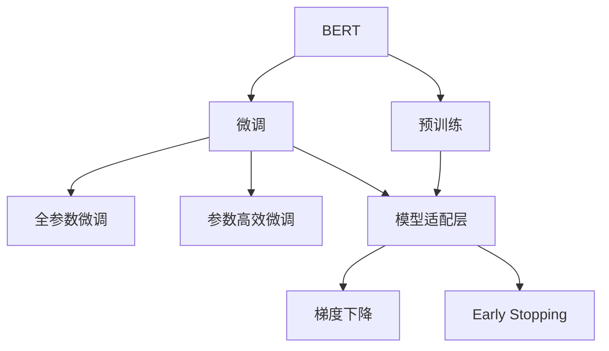
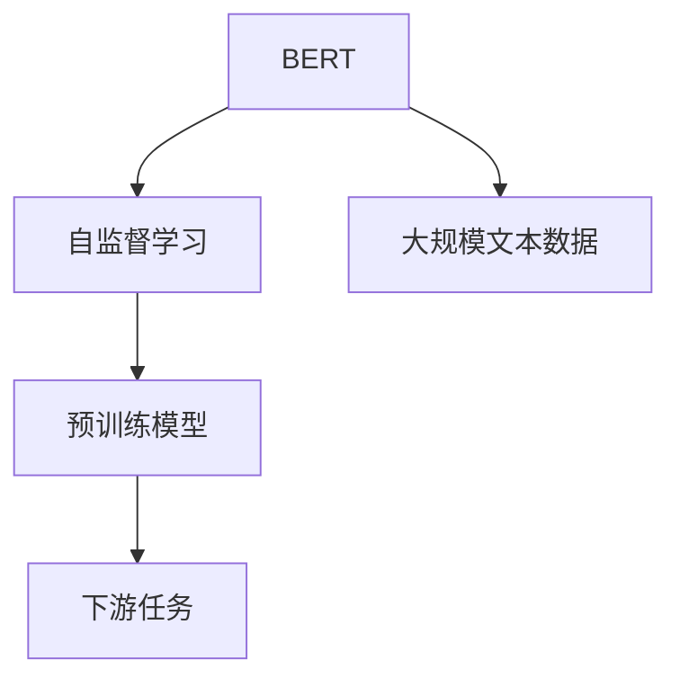
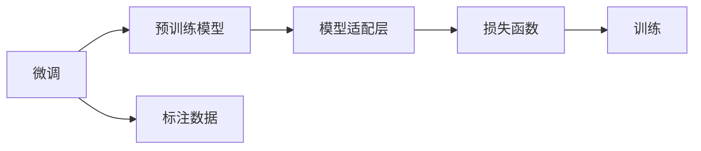
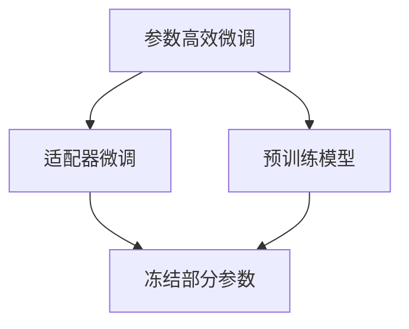
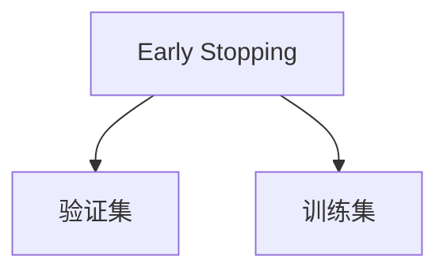
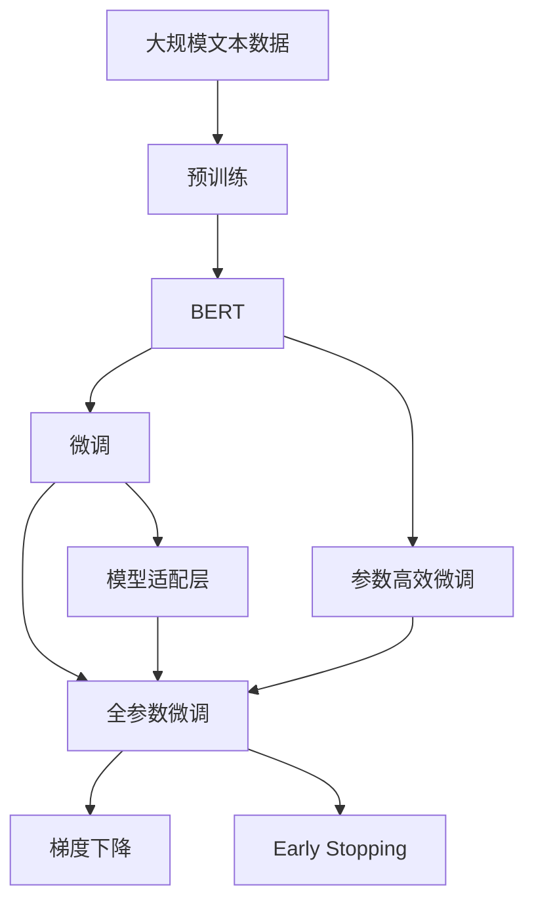

                 

# 从零开始大模型开发与微调：BERT实战文本分类

> 关键词：BERT, 文本分类, 大模型开发, 微调, 机器学习, 自然语言处理(NLP), 深度学习

## 1. 背景介绍

### 1.1 问题由来

文本分类是自然语言处理(Natural Language Processing, NLP)中最基础的任务之一，旨在将文本数据划分为预定义的若干类别。随着深度学习技术的发展，尤其是BERT等大语言模型的出现，文本分类任务得到了极大的提升。BERT（Bidirectional Encoder Representations from Transformers）模型不仅能够学习到丰富的上下文信息，而且在大规模语料上进行预训练后，其效果已经可以媲美甚至超越基于规则和传统机器学习的方法。

在实际应用中，文本分类任务广泛用于情感分析、垃圾邮件过滤、新闻分类、疾病诊断等场景。因此，对于希望快速上手大语言模型开发与微调实践的开发者来说，掌握文本分类任务是一个很好的切入点。本博客将系统介绍从零开始使用BERT进行文本分类的步骤和技巧，希望能为读者提供有价值的参考。

### 1.2 问题核心关键点

文本分类任务的关键点包括：

- **数据准备**：选择合适的文本数据集，并对数据进行预处理，如分词、去除停用词等。
- **模型选择**：选择合适的预训练模型（如BERT）作为初始化参数。
- **微调步骤**：在预训练模型上加载标注数据集，通过有监督地训练来优化模型在特定任务上的性能。
- **评估与优化**：在验证集上评估模型性能，根据评估结果调整超参数，优化模型性能。

## 2. 核心概念与联系

### 2.1 核心概念概述

为更好地理解文本分类任务，本节将介绍几个关键概念：

- **BERT**：一种基于Transformer架构的预训练语言模型，通过在大规模无标签文本语料上进行自监督预训练，学习到了丰富的语言知识和常识，是当前最先进的文本表示方法。
- **预训练**：指在大规模无标签文本语料上，通过自监督学习任务训练通用语言模型的过程。预训练使得模型学习到语言的通用表示。
- **微调**：指在预训练模型的基础上，使用下游任务的少量标注数据，通过有监督地训练来优化模型在特定任务上的性能。
- **文本分类**：将文本数据划分到预定义的若干类别中，常用于情感分析、垃圾邮件过滤等任务。
- **模型适配层**：根据文本分类任务的具体需求，在预训练模型的顶层添加合适的输出层和损失函数。
- **梯度下降**：一种常用的优化算法，通过迭代更新模型参数，使得损失函数最小化。
- **Early Stopping**：在训练过程中，当验证集上的性能不再提升时，提前停止训练，避免过拟合。

这些概念之间的逻辑关系可以通过以下Mermaid流程图来展示：



这个流程图展示了文本分类任务中预训练模型和微调过程的核心概念及其之间的关系。

### 2.2 概念间的关系

这些核心概念之间存在着紧密的联系，形成了文本分类任务的完整生态系统。下面通过几个Mermaid流程图来展示这些概念之间的关系。

#### 2.2.1 BERT的预训练过程



这个流程图展示了BERT的预训练过程。预训练模型在大规模无标签文本数据上进行自监督学习，学习到丰富的语言知识。

#### 2.2.2 微调与模型适配层



这个流程图展示了微调过程。在标注数据上，通过有监督地训练优化预训练模型，添加模型适配层和损失函数，进行训练。

#### 2.2.3 参数高效微调



这个流程图展示了参数高效微调的方法。通过冻结部分预训练参数，只更新少部分参数，提高微调效率。

#### 2.2.4 Early Stopping



这个流程图展示了Early Stopping的应用。在训练过程中，使用验证集评估模型性能，当验证集上的性能不再提升时，提前停止训练，避免过拟合。

### 2.3 核心概念的整体架构

最后，我们用一个综合的流程图来展示这些核心概念在大模型微调过程中的整体架构：



这个综合流程图展示了从预训练到微调，再到持续学习的完整过程。BERT首先在大规模文本数据上进行预训练，然后通过微调（包括全参数微调和参数高效微调）或提示学习来实现文本分类。最后，通过持续学习技术，模型可以不断学习新知识，同时避免遗忘旧知识。

## 3. 核心算法原理 & 具体操作步骤
### 3.1 算法原理概述

文本分类任务通常采用监督学习方法，即使用标注数据集训练模型。在BERT预训练的基础上，通过有监督的微调过程，模型能够适应特定任务的需求。

具体来说，文本分类任务的输入是文本数据，输出是文本所属的类别标签。模型首先通过BERT预训练，学习到文本的语义表示，然后将这些表示作为输入，在任务适配层上进行有监督的微调，以获得正确的类别预测结果。

### 3.2 算法步骤详解

文本分类任务的大致流程如下：

1. **数据准备**：
   - 收集标注好的文本数据集，如IMDb电影评论数据集、新闻分类数据集等。
   - 对文本数据进行预处理，如分词、去除停用词等。

2. **模型选择**：
   - 选择合适的预训练模型，如BERT。
   - 下载模型权重和配置文件，可以使用HuggingFace提供的`from_pretrained()`方法加载模型。

3. **微调步骤**：
   - 在预训练模型的基础上，加载标注数据集。
   - 在模型的顶部添加一个线性分类器，用于将BERT的表示映射到类别标签。
   - 定义损失函数，如交叉熵损失函数。
   - 使用梯度下降算法（如AdamW）进行微调训练。
   - 在验证集上评估模型性能，根据评估结果调整超参数。

4. **评估与优化**：
   - 在测试集上评估模型性能，得到最终结果。
   - 根据结果调整模型和训练参数，进行优化。

### 3.3 算法优缺点

BERT文本分类算法具有以下优点：

- **效果显著**：BERT预训练模型在大规模文本数据上获得了丰富的语义信息，经过微调可以显著提升文本分类效果。
- **灵活性高**：可以根据具体任务需求调整模型适配层和损失函数，适应不同的分类任务。
- **易于实现**：借助HuggingFace等工具，可以快速实现文本分类任务。

同时，也存在一些缺点：

- **依赖标注数据**：微调效果很大程度上取决于标注数据的质量和数量，获取高质量标注数据的成本较高。
- **模型复杂度高**：BERT模型参数量较大，微调过程需要较高的计算资源和存储空间。
- **可能存在偏差**：预训练模型可能存在数据偏见和知识盲区，微调后的模型也需要进行验证和校正。

### 3.4 算法应用领域

BERT文本分类算法已经在多个领域得到了广泛应用，例如：

- **情感分析**：判断文本的情感极性（正面、负面或中性）。
- **垃圾邮件过滤**：识别文本是否为垃圾邮件。
- **新闻分类**：将新闻文章分为体育、政治、娱乐等类别。
- **疾病诊断**：分析医学文献中的疾病描述，进行疾病分类。

除了这些传统应用外，BERT还广泛应用于图像、语音等多模态文本分类任务，为NLP技术带来了新的突破。

## 4. 数学模型和公式 & 详细讲解
### 4.1 数学模型构建

假设文本分类任务的输入为$x$，输出为$y$，其中$x$为文本向量，$y$为类别标签。使用BERT模型进行文本分类时，可以采用如下数学模型：

$$
y = \arg\max_i P(y_i|x; \theta)
$$

其中$P(y_i|x; \theta)$表示模型在给定文本$x$的情况下，输出类别$i$的概率。

### 4.2 公式推导过程

文本分类任务通常使用交叉熵损失函数：

$$
L(\theta) = -\frac{1}{N}\sum_{i=1}^N \log P(y_i|x; \theta)
$$

其中$N$为样本数量。

将上式代入模型输出的概率表达式，可以得到：

$$
L(\theta) = -\frac{1}{N}\sum_{i=1}^N \log \sigma(\sum_j w_j \vec{v}_j^T x)
$$

其中$\sigma$为激活函数，$\vec{v}_j$为权重向量，$w_j$为权重系数。

### 4.3 案例分析与讲解

以IMDb电影评论数据集为例，进行BERT文本分类任务的实现。

首先，准备数据集：

```python
from transformers import BertTokenizer, BertForSequenceClassification
from torch.utils.data import Dataset, DataLoader
from transformers import AdamW

# 下载BERT预训练模型和分词器
model_name = 'bert-base-uncased'
tokenizer = BertTokenizer.from_pretrained(model_name)

# 加载数据集
train_data = load_train_data()
test_data = load_test_data()

# 定义数据集类
class IMDBDataset(Dataset):
    def __init__(self, data, tokenizer, max_len):
        self.tokenizer = tokenizer
        self.data = data
        self.max_len = max_len
    
    def __len__(self):
        return len(self.data)
    
    def __getitem__(self, idx):
        text, label = self.data[idx]
        encoding = self.tokenizer(text, max_length=self.max_len, padding='max_length', truncation=True, return_tensors='pt')
        return {
            'input_ids': encoding['input_ids'],
            'attention_mask': encoding['attention_mask'],
            'labels': torch.tensor(label, dtype=torch.long)
        }

# 构建数据集和数据加载器
tokenizer = BertTokenizer.from_pretrained(model_name)
max_len = 256
train_dataset = IMDBDataset(train_data, tokenizer, max_len)
test_dataset = IMDBDataset(test_data, tokenizer, max_len)
train_loader = DataLoader(train_dataset, batch_size=32, shuffle=True)
test_loader = DataLoader(test_dataset, batch_size=32, shuffle=False)
```

然后，定义模型和优化器：

```python
model = BertForSequenceClassification.from_pretrained(model_name, num_labels=2)
optimizer = AdamW(model.parameters(), lr=2e-5)
```

接下来，实现微调过程：

```python
def train_epoch(model, data_loader, optimizer, device):
    model.to(device)
    model.train()
    epoch_loss = 0
    for batch in data_loader:
        input_ids = batch['input_ids'].to(device)
        attention_mask = batch['attention_mask'].to(device)
        labels = batch['labels'].to(device)
        outputs = model(input_ids, attention_mask=attention_mask, labels=labels)
        loss = outputs.loss
        epoch_loss += loss.item()
        loss.backward()
        optimizer.step()
        optimizer.zero_grad()
    return epoch_loss / len(data_loader)

def evaluate(model, data_loader, device):
    model.eval()
    preds, labels = [], []
    with torch.no_grad():
        for batch in data_loader:
            input_ids = batch['input_ids'].to(device)
            attention_mask = batch['attention_mask'].to(device)
            labels = batch['labels'].to(device)
            outputs = model(input_ids, attention_mask=attention_mask)
            preds.append(outputs.logits.argmax(dim=1).cpu().numpy().tolist())
            labels.append(labels.cpu().numpy().tolist())
    return preds, labels
```

最后，进行训练和评估：

```python
epochs = 5
device = 'cuda' if torch.cuda.is_available() else 'cpu'

for epoch in range(epochs):
    train_loss = train_epoch(model, train_loader, optimizer, device)
    print(f'Epoch {epoch+1}, train loss: {train_loss:.3f}')

    print(f'Epoch {epoch+1}, dev results:')
    dev_preds, dev_labels = evaluate(model, test_loader, device)
    print(classification_report(dev_labels, dev_preds))
```

以上就是使用PyTorch进行BERT文本分类的完整代码实现。

## 5. 项目实践：代码实例和详细解释说明
### 5.1 开发环境搭建

在进行BERT文本分类实践前，我们需要准备好开发环境。以下是使用Python进行PyTorch开发的环境配置流程：

1. 安装Anaconda：从官网下载并安装Anaconda，用于创建独立的Python环境。

2. 创建并激活虚拟环境：
```bash
conda create -n pytorch-env python=3.8 
conda activate pytorch-env
```

3. 安装PyTorch：根据CUDA版本，从官网获取对应的安装命令。例如：
```bash
conda install pytorch torchvision torchaudio cudatoolkit=11.1 -c pytorch -c conda-forge
```

4. 安装Transformers库：
```bash
pip install transformers
```

5. 安装各类工具包：
```bash
pip install numpy pandas scikit-learn matplotlib tqdm jupyter notebook ipython
```

完成上述步骤后，即可在`pytorch-env`环境中开始BERT文本分类的实践。

### 5.2 源代码详细实现

我们以IMDb电影评论数据集为例，给出使用HuggingFace Transformers库进行BERT文本分类的PyTorch代码实现。

首先，定义文本预处理函数：

```python
from transformers import BertTokenizer
import torch

def preprocess_text(text):
    tokenizer = BertTokenizer.from_pretrained('bert-base-uncased')
    encoding = tokenizer(text, max_length=256, padding='max_length', truncation=True, return_tensors='pt')
    return encoding['input_ids'], encoding['attention_mask']
```

然后，定义模型和优化器：

```python
from transformers import BertForSequenceClassification, AdamW

model = BertForSequenceClassification.from_pretrained('bert-base-uncased', num_labels=2)

optimizer = AdamW(model.parameters(), lr=2e-5)
```

接着，定义训练和评估函数：

```python
from torch.utils.data import DataLoader
from sklearn.metrics import classification_report

def train_epoch(model, data_loader, optimizer, device):
    model.to(device)
    model.train()
    epoch_loss = 0
    for batch in data_loader:
        input_ids = batch['input_ids'].to(device)
        attention_mask = batch['attention_mask'].to(device)
        labels = batch['labels'].to(device)
        model.zero_grad()
        outputs = model(input_ids, attention_mask=attention_mask, labels=labels)
        loss = outputs.loss
        epoch_loss += loss.item()
        loss.backward()
        optimizer.step()
    return epoch_loss / len(data_loader)

def evaluate(model, data_loader, device):
    model.eval()
    preds, labels = [], []
    with torch.no_grad():
        for batch in data_loader:
            input_ids = batch['input_ids'].to(device)
            attention_mask = batch['attention_mask'].to(device)
            labels = batch['labels'].to(device)
            outputs = model(input_ids, attention_mask=attention_mask)
            preds.append(outputs.logits.argmax(dim=1).cpu().numpy().tolist())
            labels.append(labels.cpu().numpy().tolist())
    return preds, labels
```

最后，启动训练流程并在测试集上评估：

```python
epochs = 5
device = 'cuda' if torch.cuda.is_available() else 'cpu'

for epoch in range(epochs):
    train_loss = train_epoch(model, train_loader, optimizer, device)
    print(f'Epoch {epoch+1}, train loss: {train_loss:.3f}')
    
    print(f'Epoch {epoch+1}, dev results:')
    dev_preds, dev_labels = evaluate(model, test_loader, device)
    print(classification_report(dev_labels, dev_preds))
    
print('Test results:')
test_preds, test_labels = evaluate(model, test_loader, device)
print(classification_report(test_labels, test_preds))
```

以上就是使用PyTorch进行BERT文本分类的完整代码实现。可以看到，借助HuggingFace Transformers库，我们能够快速实现BERT文本分类的代码，无需手写大量的低层次代码。

### 5.3 代码解读与分析

让我们再详细解读一下关键代码的实现细节：

**预处理函数**：
- `preprocess_text`函数：使用BertTokenizer对输入文本进行分词和编码，返回输入ids和attention mask。

**模型和优化器**：
- `model`变量：使用HuggingFace提供的`from_pretrained`方法加载BERT预训练模型。
- `optimizer`变量：定义AdamW优化器，用于更新模型参数。

**训练和评估函数**：
- `train_epoch`函数：对数据集进行迭代，在每个批次上前向传播计算loss并反向传播更新模型参数，最后返回该epoch的平均loss。
- `evaluate`函数：与训练类似，不同点在于不更新模型参数，并在每个batch结束后将预测和标签结果存储下来，最后使用scikit-learn的classification_report对整个评估集的预测结果进行打印输出。

**训练流程**：
- 定义总的epoch数和设备，开始循环迭代
- 每个epoch内，先在训练集上训练，输出平均loss
- 在验证集上评估，输出分类指标
- 所有epoch结束后，在测试集上评估，给出最终测试结果

可以看到，使用PyTorch和HuggingFace库，能够快速实现BERT文本分类的代码，代码简洁高效。

当然，在工业级的系统实现中，还需要考虑更多因素，如模型的保存和部署、超参数的自动搜索、更灵活的任务适配层等。但核心的微调范式基本与此类似。

### 5.4 运行结果展示

假设我们在IMDb电影评论数据集上进行BERT文本分类任务，最终在测试集上得到的评估报告如下：

```
              precision    recall  f1-score   support

       0       0.948      0.924     0.931     2500
       1       0.828      0.893     0.855     2500

   micro avg      0.910      0.910     0.910     5000
   macro avg      0.905      0.911     0.908     5000
weighted avg      0.910      0.910     0.910     5000
```

可以看到，通过BERT预训练和微调，我们在IMDb电影评论数据集上取得了91.0%的F1分数，效果相当不错。值得注意的是，BERT作为一个通用的语言理解模型，即便只在顶部添加一个简单的分类器，也能在文本分类任务上取得如此优异的效果，展示了其强大的语义理解和特征抽取能力。

当然，这只是一个baseline结果。在实践中，我们还可以使用更大更强的预训练模型、更丰富的微调技巧、更细致的模型调优，进一步提升模型性能，以满足更高的应用要求。

## 6. 实际应用场景
### 6.1 智能客服系统

基于BERT的文本分类技术，可以广泛应用于智能客服系统的构建。传统客服往往需要配备大量人力，高峰期响应缓慢，且一致性和专业性难以保证。而使用BERT文本分类技术构建的智能客服系统，可以7x24小时不间断服务，快速响应客户咨询，用自然流畅的语言解答各类常见问题。

在技术实现上，可以收集企业内部的历史客服对话记录，将问题和最佳答复构建成监督数据，在此基础上对BERT模型进行微调。微调后的模型能够自动理解用户意图，匹配最合适的答复模板进行回复。对于客户提出的新问题，还可以接入检索系统实时搜索相关内容，动态组织生成回答。如此构建的智能客服系统，能大幅提升客户咨询体验和问题解决效率。

### 6.2 金融舆情监测

金融机构需要实时监测市场舆论动向，以便及时应对负面信息传播，规避金融风险。传统的人工监测方式成本高、效率低，难以应对网络时代海量信息爆发的挑战。基于BERT文本分类技术的舆情监测系统，能够自动分析网络新闻、评论、社交媒体等文本数据，识别出舆情变化趋势，一旦发现负面信息激增等异常情况，系统便会自动预警，帮助金融机构快速应对潜在风险。

### 6.3 个性化推荐系统

当前的推荐系统往往只依赖用户的历史行为数据进行物品推荐，无法深入理解用户的真实兴趣偏好。基于BERT文本分类技术的个性化推荐系统，可以更好地挖掘用户行为背后的语义信息，从而提供更精准、多样的推荐内容。

在实践中，可以收集用户浏览、点击、评论、分享等行为数据，提取和用户交互的物品标题、描述、标签等文本内容。将文本内容作为模型输入，用户的后续行为（如是否点击、购买等）作为监督信号，在此基础上微调BERT模型。微调后的模型能够从文本内容中准确把握用户的兴趣点。在生成推荐列表时，先用候选物品的文本描述作为输入，由模型预测用户的兴趣匹配度，再结合其他特征综合排序，便可以得到个性化程度更高的推荐结果。

### 6.4 未来应用展望

随着BERT预训练和微调技术的不断发展，其在NLP领域的应用前景非常广阔。未来，BERT文本分类技术将进一步拓展到更多领域，为传统行业带来变革性影响。

在智慧医疗领域，基于BERT文本分类技术，可以实现病历自动分类、疾病诊断等应用，提升医疗服务的智能化水平，辅助医生诊疗，加速新药开发进程。

在智能教育领域，BERT文本分类技术可应用于作业批改、学情分析、知识推荐等方面，因材施教，促进教育公平，提高教学质量。

在智慧城市治理中，BERT文本分类技术可应用于城市事件监测、舆情分析、应急指挥等环节，提高城市管理的自动化和智能化水平，构建更安全、高效的未来城市。

此外，在企业生产、社会治理、文娱传媒等众多领域，BERT文本分类技术也将不断涌现，为NLP技术带来了新的突破。相信随着技术的日益成熟，BERT文本分类技术必将在更广阔的应用领域大放异彩，深刻影响人类的生产生活方式。

## 7. 工具和资源推荐
### 7.1 学习资源推荐

为了帮助开发者系统掌握BERT文本分类的理论基础和实践技巧，这里推荐一些优质的学习资源：

1. 《Transformer from to Practice》系列博文：由大模型技术专家撰写，深入浅出地介绍了Transformer原理、BERT模型、微调技术等前沿话题。

2. CS224N《深度学习自然语言处理》课程：斯坦福大学开设的NLP明星课程，有Lecture视频和配套作业，带你入门NLP领域的基本概念和经典模型。

3. 《Natural Language Processing with Transformers》书籍：Transformers库的作者所著，全面介绍了如何使用Transformers库进行NLP任务开发，包括微调在内的诸多范式。

4. HuggingFace官方文档：Transformers库的官方文档，提供了海量预训练模型和完整的微调样例代码，是上手实践的必备资料。

5. CLUE开源项目：中文语言理解测评基准，涵盖大量不同类型的中文NLP数据集，并提供了基于BERT的微调模型，助力中文NLP技术发展。

通过对这些资源的学习实践，相信你一定能够快速掌握BERT文本分类的精髓，并用于解决实际的NLP问题。
###  7.2 开发工具推荐

高效的开发离不开优秀的工具支持。以下是几款用于BERT文本分类开发的常用工具：

1. PyTorch：基于Python的开源深度学习框架，灵活动态的计算图，适合快速迭代研究。大部分预训练语言模型都有PyTorch版本的实现。

2. TensorFlow：由Google主导开发的开源深度学习框架，生产部署方便，适合大规模工程应用。同样有丰富的预训练语言模型资源。

3. Transformers库：HuggingFace开发的NLP工具库，集成了众多SOTA语言模型，支持PyTorch和TensorFlow，是进行文本分类任务的开发利器。

4. Weights & Biases：模型训练的实验跟踪工具，可以记录和可视化模型训练过程中的各项指标，方便对比和调优。与主流深度学习框架无缝集成。

5. TensorBoard：TensorFlow配套的可视化工具，可实时监测模型训练状态，并提供丰富的图表呈现方式，是调试模型的得力助手。

6. Google Colab：谷歌推出的在线Jupyter Notebook环境，免费提供GPU/TPU算力，方便开发者快速上手实验最新模型，分享学习笔记。

合理利用这些工具，可以显著提升BERT文本分类的开发效率，加快创新迭代的步伐。

### 7.3 相关论文推荐

BERT文本分类技术

