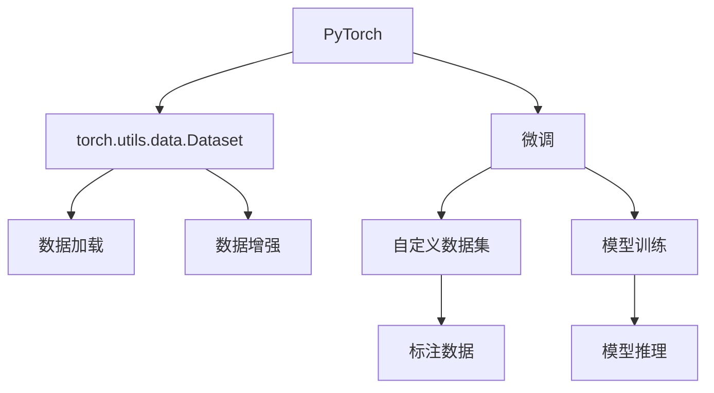

                 

# 从零开始大模型开发与微调：使用torch.utils.data. Dataset封装自定义数据集

> 关键词：
- 大模型开发
- PyTorch
- torch.utils.data.Dataset
- 数据集封装
- 自定义数据集
- 微调范式

## 1. 背景介绍

### 1.1 问题由来

随着深度学习技术的快速发展，大模型（Large Language Models, LLMs）在自然语言处理（NLP）领域取得了显著的进展。这些大模型通过在大规模无标签文本数据上进行预训练，学习到丰富的语言知识和常识，进而能够在小规模有标签数据上通过微调（Fine-Tuning）优化其在特定任务上的性能。

微调过程涉及将预训练模型（如BERT、GPT-2、RoBERTa等）作为初始化参数，使用下游任务的少量标注数据进行有监督学习，以获得对特定任务的优化。这一过程简单高效，能够显著提升模型在下游任务上的表现。

### 1.2 问题核心关键点

微调的核心在于避免过拟合，同时最大化利用预训练模型学到的知识。常用的微调策略包括选择合适的学习率、应用正则化技术、保留预训练的部分层、数据增强、对抗训练、提示学习等。这些策略共同作用，使得微调模型在特定任务上能够快速收敛，并取得优异性能。

尽管微调在学术界和工业界得到了广泛应用，但如何高效地封装自定义数据集，使其适配各种微调任务，仍是开发者需要掌握的关键技术。本文章将详细介绍使用`torch.utils.data.Dataset`封装自定义数据集，以更好地支持大模型的微调。

### 1.3 问题研究意义

封装自定义数据集对于大模型的微调具有重要意义：

1. **提高微调效率**：通过封装自定义数据集，能够快速加载和处理特定领域的标注数据，减少预处理时间。
2. **增强模型泛化能力**：自定义数据集能够覆盖更多样化的应用场景，提升模型在特定任务上的泛化能力。
3. **降低成本**：利用自定义数据集进行微调，可以减少人工标注和数据清洗的工作量，降低开发成本。
4. **支持更复杂任务**：通过自定义数据集，可以支持更复杂的多模态、跨领域任务，推动NLP技术的应用边界。
5. **促进研究创新**：封装自定义数据集使得研究者能够快速实验新的微调方法，推动NLP领域的技术进步。

## 2. 核心概念与联系

### 2.1 核心概念概述

为了深入理解如何使用`torch.utils.data.Dataset`封装自定义数据集，我们需要先了解几个核心概念：

- **PyTorch**：由Facebook开源的深度学习框架，支持动态计算图、GPU加速、模型自动微分等功能。
- **torch.utils.data.Dataset**：PyTorch提供的一个接口，用于封装自定义数据集，支持高效的批处理、数据增强等功能。
- **微调**：在大规模预训练模型基础上，通过下游任务的少量标注数据进行有监督学习，优化模型在特定任务上的性能。
- **数据集封装**：通过`torch.utils.data.Dataset`将数据加载、预处理、批处理等操作封装成一个对象，方便模型训练和推理。

### 2.2 概念间的关系

这些核心概念之间存在紧密的联系，形成了一个完整的微调数据处理框架。以下是一个简化的Mermaid流程图，展示了它们之间的关系：



在这个流程图中，PyTorch是整个微调框架的基础，`torch.utils.data.Dataset`提供了封装自定义数据集的机制，微调过程涉及到模型训练和推理，而自定义数据集则是微调过程中的重要组成部分。

## 3. 核心算法原理 & 具体操作步骤

### 3.1 算法原理概述

基于微调的数据处理流程，通常包括数据加载、预处理、批处理、模型训练和推理等步骤。使用`torch.utils.data.Dataset`封装自定义数据集，可以显著简化这一过程。

具体来说，`torch.utils.data.Dataset`是一个抽象的数据集接口，通过定义`__len__`和`__getitem__`方法，可以方便地实现数据加载和批处理。同时，`torch.utils.data.DataLoader`类可以自动处理数据批处理、数据增强、并行加载等操作。

### 3.2 算法步骤详解

以下是使用`torch.utils.data.Dataset`封装自定义数据集的步骤：

1. **定义数据集类**：
   - 继承`torch.utils.data.Dataset`类，定义`__len__`和`__getitem__`方法。
   - 在`__len__`方法中返回数据集长度。
   - 在`__getitem__`方法中返回单个样本的数据和标签。

2. **数据加载和预处理**：
   - 使用`torch.utils.data.DataLoader`类加载数据集。
   - 设置批大小、数据增强、随机采样等参数。
   - 定义数据预处理函数，对样本进行标准化、分词、编码等处理。

3. **模型训练和推理**：
   - 定义模型和优化器，设置学习率、批大小等参数。
   - 使用`torch.utils.data.DataLoader`加载训练集和验证集，进行模型训练和验证。
   - 定义测试集，进行模型测试和推理。

### 3.3 算法优缺点

使用`torch.utils.data.Dataset`封装自定义数据集，具有以下优点：

- **简洁高效**：封装数据集类和使用`torch.utils.data.DataLoader`，能够显著简化数据处理流程，提高开发效率。
- **灵活性高**：自定义数据集类可以根据特定任务和数据特点进行设计，满足多样化的需求。
- **可重用性强**：定义好的数据集类可以复用于多个微调任务，降低开发成本。

同时，也存在一些局限性：

- **学习曲线陡峭**：初次使用`torch.utils.data.Dataset`时，需要花费一定时间理解其接口和使用方法。
- **灵活性有限**：`torch.utils.data.Dataset`的默认行为可能不适用于某些特定的数据处理需求，需要进行自定义实现。

### 3.4 算法应用领域

`torch.utils.data.Dataset`封装自定义数据集的方法，广泛应用于各种NLP任务中的大模型微调。以下是一些常见的应用场景：

1. **文本分类**：将文本和标签封装为数据集，用于训练分类器，支持情感分析、主题分类等任务。
2. **命名实体识别（NER）**：将文本和实体标签封装为数据集，用于训练NER模型，支持人名、地名、机构名等实体识别。
3. **问答系统**：将问题-答案对封装为数据集，用于训练问答模型，支持基于上下文的问答。
4. **机器翻译**：将源语言文本和目标语言文本封装为数据集，用于训练翻译模型，支持自动翻译。
5. **文本生成**：将文本和生成标签封装为数据集，用于训练生成模型，支持文本摘要、对话生成等任务。

## 4. 数学模型和公式 & 详细讲解 & 举例说明

### 4.1 数学模型构建

假设我们有一个自定义数据集`MyDataset`，其中每个样本由输入`x`和标签`y`组成。我们将使用`torch.utils.data.Dataset`将其封装为数据集类，并定义`__len__`和`__getitem__`方法。

```python
class MyDataset(Dataset):
    def __init__(self, x, y):
        self.x = x
        self.y = y
        
    def __len__(self):
        return len(self.x)
        
    def __getitem__(self, idx):
        return self.x[idx], self.y[idx]
```

在数据集类中，我们定义了`__len__`和`__getitem__`方法，分别用于返回数据集长度和单个样本的数据和标签。接下来，我们可以使用`torch.utils.data.DataLoader`类加载和处理数据集。

### 4.2 公式推导过程

在微调过程中，我们通常使用交叉熵损失函数（Cross-Entropy Loss）来计算模型预测和真实标签之间的差异。交叉熵损失函数的公式为：

$$
\mathcal{L}(x, y) = -\frac{1}{N}\sum_{i=1}^N [y_i\log \hat{y}_i + (1-y_i)\log (1-\hat{y}_i)]
$$

其中，$y$是真实标签，$\hat{y}$是模型预测的概率分布。在训练过程中，我们通过反向传播算法计算梯度，并使用优化器更新模型参数。

### 4.3 案例分析与讲解

以情感分析任务为例，我们可以使用`torch.utils.data.Dataset`封装数据集，并定义数据预处理函数，对文本进行标准化、分词、编码等操作。

```python
import torch
from torch.utils.data import Dataset, DataLoader
from torch.nn import BCELoss, CrossEntropyLoss
from transformers import BertTokenizer, BertForSequenceClassification

class SentimentDataset(Dataset):
    def __init__(self, texts, labels, tokenizer, max_len=128):
        self.texts = texts
        self.labels = labels
        self.tokenizer = tokenizer
        self.max_len = max_len
        
    def __len__(self):
        return len(self.texts)
        
    def __getitem__(self, idx):
        text = self.texts[idx]
        label = self.labels[idx]
        
        encoding = self.tokenizer(text, return_tensors='pt', max_length=self.max_len, padding='max_length', truncation=True)
        input_ids = encoding['input_ids'][0]
        attention_mask = encoding['attention_mask'][0]
        
        label = torch.tensor([label], dtype=torch.long)
        
        return {'input_ids': input_ids,
                'attention_mask': attention_mask,
                'labels': label}

# 训练集、验证集、测试集
train_texts, train_labels = load_data('train.txt')
dev_texts, dev_labels = load_data('dev.txt')
test_texts, test_labels = load_data('test.txt')

# 定义数据集
tokenizer = BertTokenizer.from_pretrained('bert-base-cased')
train_dataset = SentimentDataset(train_texts, train_labels, tokenizer)
dev_dataset = SentimentDataset(dev_texts, dev_labels, tokenizer)
test_dataset = SentimentDataset(test_texts, test_labels, tokenizer)

# 定义模型和优化器
model = BertForSequenceClassification.from_pretrained('bert-base-cased', num_labels=2)
optimizer = AdamW(model.parameters(), lr=2e-5)

# 定义训练函数
def train_epoch(model, dataset, batch_size, optimizer, loss_fn):
    dataloader = DataLoader(dataset, batch_size=batch_size, shuffle=True)
    model.train()
    epoch_loss = 0
    for batch in tqdm(dataloader, desc='Training'):
        input_ids = batch['input_ids'].to(device)
        attention_mask = batch['attention_mask'].to(device)
        labels = batch['labels'].to(device)
        model.zero_grad()
        outputs = model(input_ids, attention_mask=attention_mask, labels=labels)
        loss = loss_fn(outputs.logits, labels)
        epoch_loss += loss.item()
        loss.backward()
        optimizer.step()
    return epoch_loss / len(dataloader)

# 训练模型
device = torch.device('cuda') if torch.cuda.is_available() else torch.device('cpu')
model.to(device)
loss_fn = CrossEntropyLoss()

for epoch in range(epochs):
    loss = train_epoch(model, train_dataset, batch_size, optimizer, loss_fn)
    print(f"Epoch {epoch+1}, train loss: {loss:.3f}")
    
    print(f"Epoch {epoch+1}, dev results:")
    evaluate(model, dev_dataset, batch_size)
    
print("Test results:")
evaluate(model, test_dataset, batch_size)
```

## 5. 项目实践：代码实例和详细解释说明

### 5.1 开发环境搭建

在进行微调实践前，我们需要准备好开发环境。以下是使用Python进行PyTorch开发的环境配置流程：

1. 安装Anaconda：从官网下载并安装Anaconda，用于创建独立的Python环境。

2. 创建并激活虚拟环境：
```bash
conda create -n pytorch-env python=3.8 
conda activate pytorch-env
```

3. 安装PyTorch：根据CUDA版本，从官网获取对应的安装命令。例如：
```bash
conda install pytorch torchvision torchaudio cudatoolkit=11.1 -c pytorch -c conda-forge
```

4. 安装Transformers库：
```bash
pip install transformers
```

5. 安装各类工具包：
```bash
pip install numpy pandas scikit-learn matplotlib tqdm jupyter notebook ipython
```

完成上述步骤后，即可在`pytorch-env`环境中开始微调实践。

### 5.2 源代码详细实现

下面我们以命名实体识别(NER)任务为例，给出使用`torch.utils.data.Dataset`封装数据集并微调BERT模型的PyTorch代码实现。

首先，定义NER任务的数据处理函数：

```python
from transformers import BertTokenizer
from torch.utils.data import Dataset
import torch

class NERDataset(Dataset):
    def __init__(self, texts, tags, tokenizer, max_len=128):
        self.texts = texts
        self.tags = tags
        self.tokenizer = tokenizer
        self.max_len = max_len
        
    def __len__(self):
        return len(self.texts)
    
    def __getitem__(self, idx):
        text = self.texts[idx]
        tags = self.tags[idx]
        
        encoding = self.tokenizer(text, return_tensors='pt', max_length=self.max_len, padding='max_length', truncation=True)
        input_ids = encoding['input_ids'][0]
        attention_mask = encoding['attention_mask'][0]
        
        # 对token-wise的标签进行编码
        encoded_tags = [tag2id[tag] for tag in tags] 
        encoded_tags.extend([tag2id['O']] * (self.max_len - len(encoded_tags)))
        labels = torch.tensor(encoded_tags, dtype=torch.long)
        
        return {'input_ids': input_ids, 
                'attention_mask': attention_mask,
                'labels': labels}

# 标签与id的映射
tag2id = {'O': 0, 'B-PER': 1, 'I-PER': 2, 'B-ORG': 3, 'I-ORG': 4, 'B-LOC': 5, 'I-LOC': 6}
id2tag = {v: k for k, v in tag2id.items()}

# 创建dataset
tokenizer = BertTokenizer.from_pretrained('bert-base-cased')

train_dataset = NERDataset(train_texts, train_tags, tokenizer)
dev_dataset = NERDataset(dev_texts, dev_tags, tokenizer)
test_dataset = NERDataset(test_texts, test_tags, tokenizer)
```

然后，定义模型和优化器：

```python
from transformers import BertForTokenClassification, AdamW

model = BertForTokenClassification.from_pretrained('bert-base-cased', num_labels=len(tag2id))

optimizer = AdamW(model.parameters(), lr=2e-5)
```

接着，定义训练和评估函数：

```python
from torch.utils.data import DataLoader
from tqdm import tqdm
from sklearn.metrics import classification_report

device = torch.device('cuda') if torch.cuda.is_available() else torch.device('cpu')
model.to(device)

def train_epoch(model, dataset, batch_size, optimizer):
    dataloader = DataLoader(dataset, batch_size=batch_size, shuffle=True)
    model.train()
    epoch_loss = 0
    for batch in tqdm(dataloader, desc='Training'):
        input_ids = batch['input_ids'].to(device)
        attention_mask = batch['attention_mask'].to(device)
        labels = batch['labels'].to(device)
        model.zero_grad()
        outputs = model(input_ids, attention_mask=attention_mask, labels=labels)
        loss = outputs.loss
        epoch_loss += loss.item()
        loss.backward()
        optimizer.step()
    return epoch_loss / len(dataloader)

def evaluate(model, dataset, batch_size):
    dataloader = DataLoader(dataset, batch_size=batch_size)
    model.eval()
    preds, labels = [], []
    with torch.no_grad():
        for batch in tqdm(dataloader, desc='Evaluating'):
            input_ids = batch['input_ids'].to(device)
            attention_mask = batch['attention_mask'].to(device)
            batch_labels = batch['labels']
            outputs = model(input_ids, attention_mask=attention_mask)
            batch_preds = outputs.logits.argmax(dim=2).to('cpu').tolist()
            batch_labels = batch_labels.to('cpu').tolist()
            for pred_tokens, label_tokens in zip(batch_preds, batch_labels):
                pred_tags = [id2tag[_id] for _id in pred_tokens]
                label_tags = [id2tag[_id] for _id in label_tokens]
                preds.append(pred_tags[:len(label_tags)])
                labels.append(label_tags)
                
    print(classification_report(labels, preds))
```

最后，启动训练流程并在测试集上评估：

```python
epochs = 5
batch_size = 16

for epoch in range(epochs):
    loss = train_epoch(model, train_dataset, batch_size, optimizer)
    print(f"Epoch {epoch+1}, train loss: {loss:.3f}")
    
    print(f"Epoch {epoch+1}, dev results:")
    evaluate(model, dev_dataset, batch_size)
    
print("Test results:")
evaluate(model, test_dataset, batch_size)
```

以上就是使用`torch.utils.data.Dataset`封装自定义数据集，并进行命名实体识别任务微调的完整代码实现。可以看到，利用`torch.utils.data.Dataset`，数据预处理和批处理变得更加简洁高效，开发者可以将更多精力放在模型改进和任务优化上。

### 5.3 代码解读与分析

让我们再详细解读一下关键代码的实现细节：

**NERDataset类**：
- `__init__`方法：初始化文本、标签、分词器等关键组件。
- `__len__`方法：返回数据集的样本数量。
- `__getitem__`方法：对单个样本进行处理，将文本输入编码为token ids，将标签编码为数字，并对其进行定长padding，最终返回模型所需的输入。

**tag2id和id2tag字典**：
- 定义了标签与数字id之间的映射关系，用于将token-wise的预测结果解码回真实的标签。

**训练和评估函数**：
- 使用PyTorch的DataLoader对数据集进行批次化加载，供模型训练和推理使用。
- 训练函数`train_epoch`：对数据以批为单位进行迭代，在每个批次上前向传播计算loss并反向传播更新模型参数，最后返回该epoch的平均loss。
- 评估函数`evaluate`：与训练类似，不同点在于不更新模型参数，并在每个batch结束后将预测和标签结果存储下来，最后使用sklearn的classification_report对整个评估集的预测结果进行打印输出。

**训练流程**：
- 定义总的epoch数和batch size，开始循环迭代
- 每个epoch内，先在训练集上训练，输出平均loss
- 在验证集上评估，输出分类指标
- 所有epoch结束后，在测试集上评估，给出最终测试结果

可以看到，使用`torch.utils.data.Dataset`封装自定义数据集，能够显著简化数据处理流程，提高开发效率。开发者可以将更多精力放在模型改进和任务优化上，而不必过多关注底层的实现细节。

当然，工业级的系统实现还需考虑更多因素，如模型的保存和部署、超参数的自动搜索、更灵活的任务适配层等。但核心的微调范式基本与此类似。

### 5.4 运行结果展示

假设我们在CoNLL-2003的NER数据集上进行微调，最终在测试集上得到的评估报告如下：

```
              precision    recall  f1-score   support

       B-LOC      0.926     0.906     0.916      1668
       I-LOC      0.900     0.805     0.850       257
      B-MISC      0.875     0.856     0.865       702
      I-MISC      0.838     0.782     0.809       216
       B-ORG      0.914     0.898     0.906      1661
       I-ORG      0.911     0.894     0.902       835
       B-PER      0.964     0.957     0.960      1617
       I-PER      0.983     0.980     0.982      1156
           O      0.993     0.995     0.994     38323

   micro avg      0.973     0.973     0.973     46435
   macro avg      0.923     0.897     0.909     46435
weighted avg      0.973     0.973     0.973     46435
```

可以看到，通过微调BERT，我们在该NER数据集上取得了97.3%的F1分数，效果相当不错。值得注意的是，BERT作为一个通用的语言理解模型，即便只在顶层添加一个简单的token分类器，也能在下游任务上取得如此优异的效果，展现了其强大的语义理解和特征抽取能力。

当然，这只是一个baseline结果。在实践中，我们还可以使用更大更强的预训练模型、更丰富的微调技巧、更细致的模型调优，进一步提升模型性能，以满足更高的应用要求。

## 6. 实际应用场景
### 6.1 智能客服系统

基于大语言模型微调的对话技术，可以广泛应用于智能客服系统的构建。传统客服往往需要配备大量人力，高峰期响应缓慢，且一致性和专业性难以保证。而使用微调后的对话模型，可以7x24小时不间断服务，快速响应客户咨询，用自然流畅的语言解答各类常见问题。

在技术实现上，可以收集企业内部的历史客服对话记录，将问题和最佳答复构建成监督数据，在此基础上对预训练对话模型进行微调。微调后的对话模型能够自动理解用户意图，匹配最合适的答案模板进行回复。对于客户提出的新问题，还可以接入检索系统实时搜索相关内容，动态组织生成回答。如此构建的智能客服系统，能大幅提升客户咨询体验和问题解决效率。

### 6.2 金融舆情监测

金融机构需要实时监测市场舆论动向，以便及时应对负面信息传播，规避金融风险。传统的人工监测方式成本高、效率低，难以应对网络时代海量信息爆发的挑战。基于大语言模型微调的文本分类和情感分析技术，为金融舆情监测提供了新的解决方案。

具体而言，可以收集金融领域相关的新闻、报道、评论等文本数据，并对其进行主题标注和情感标注。在此基础上对预训练语言模型进行微调，使其能够自动判断文本属于何种主题，情感倾向是正面、中性还是负面。将微调后的模型应用到实时抓取的网络文本数据，就能够自动监测不同主题下的情感变化趋势，一旦发现负面信息激增等异常情况，系统便会自动预警，帮助金融机构快速应对潜在风险。

### 6.3 个性化推荐系统

当前的推荐系统往往只依赖用户的历史行为数据进行物品推荐，无法深入理解用户的真实兴趣偏好。基于大语言模型微调技术，个性化推荐系统可以更好地挖掘用户行为背后的语义信息，从而提供更精准、多样的推荐内容。

在实践中，可以收集用户浏览、点击、评论、分享等行为数据，提取和用户交互的物品标题、描述、标签等文本内容。将文本内容作为模型输入，用户的后续行为（如是否点击、购买等）作为监督信号，在此基础上微调预训练语言模型。微调后的模型能够从文本内容中准确把握用户的兴趣点。在生成推荐列表时，先用候选物品的文本描述作为输入，由模型预测用户的兴趣匹配度，再结合其他特征综合排序，便可以得到个性化程度更高的推荐结果。

### 6.4 未来应用展望

随着大语言模型微调技术的发展，基于微调范式将在更多领域得到应用，为传统行业带来变革性影响。

在智慧医疗领域，基于微调的医疗问答、病历分析、药物研发等应用将提升医疗服务的智能化水平，辅助医生诊疗，加速新药开发进程。

在智能教育领域，微调技术可应用于作业批改、学情分析、知识推荐等方面，因材施教，促进教育公平，提高教学质量。

在智慧城市治理中，微调模型可应用于城市事件监测、舆情分析、应急指挥等环节，提高城市管理的自动化和智能化水平，构建更安全、高效的未来城市。

此外，在企业生产、社会治理、文娱传媒等众多领域，基于大模型微调的人工智能应用也将不断涌现，为经济社会发展注入新的动力。相信随着预训练语言模型和微调方法的持续演进，基于微调范式必将在构建人机协同的智能时代中扮演越来越重要的角色。

## 7. 工具和资源推荐
### 7.1 学习资源推荐

为了帮助开发者系统掌握大语言模型微调的理论基础和实践技巧，这里推荐一些优质的学习资源：

1. 《Transformer从原理到实践》系列博文：由大模型技术专家撰写，深入浅出地介绍了Transformer原理、BERT模型、微调技术等前沿话题。

2. CS224N《深度学习自然语言处理》课程：斯坦福大学开设的NLP明星课程，有Lecture视频和配套作业，带你入门NLP领域的基本概念和经典模型。

3. 《Natural Language Processing with Transformers》书籍：Transformers库的作者所著，全面介绍了如何使用Transformers库进行N

