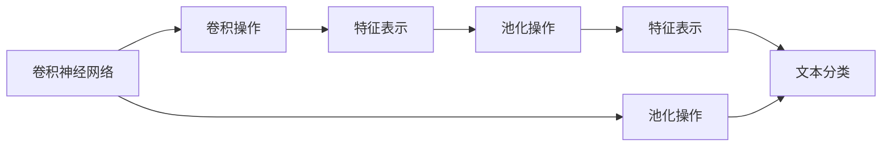

                 

# 从零开始大模型开发与微调：卷积神经网络文本分类模型的实现—Conv1d（一维卷积）

## 1. 背景介绍

### 1.1 问题由来

卷积神经网络（Convolutional Neural Networks, CNN）在计算机视觉领域已经展示了卓越的表现，成功地应用于图像分类、物体检测等任务。近年来，随着NLP任务中序列数据的重要性日益凸显，卷积神经网络也被应用到文本分类、序列标注等任务中，并取得了显著的成果。

传统的一维卷积神经网络（Conv1d）主要应用于文本特征提取和分类任务。其核心思想是将文本转化为序列数据，通过卷积核提取局部特征，并将不同位置的特征进行池化操作，得到最终的特征表示。一维卷积神经网络在处理序列数据时具有很好的特征提取能力，且模型结构简单，计算效率高，因此在NLP领域得到了广泛应用。

然而，现有的大部分研究往往聚焦于使用CNN进行文本分类任务，而对模型的细节优化和优化方法，尤其是针对中文文本数据的微调方法，并未有系统性的探索。本文将围绕一维卷积神经网络在文本分类任务中的应用，从理论到实践，全面深入地介绍CNN的开发与微调方法。

### 1.2 问题核心关键点

本文的核心问题在于如何有效地利用一维卷积神经网络进行文本分类，并通过微调方法提升模型性能。主要包括以下几个方面：

1. **模型构建**：如何将卷积神经网络应用到文本分类任务中，并选择合适的超参数。
2. **数据处理**：如何对中文文本数据进行处理，并进行有效的特征提取。
3. **模型微调**：如何使用微调方法提高模型在特定任务上的性能，并避免过拟合。
4. **优化方法**：如何优化模型的训练过程，提高模型的泛化能力和推理效率。

本文将详细解答以上问题，并给出相应的代码实例，帮助读者系统掌握一维卷积神经网络在文本分类任务中的开发与微调方法。

## 2. 核心概念与联系

### 2.1 核心概念概述

为更好地理解一维卷积神经网络在文本分类任务中的应用，本节将介绍几个关键概念：

1. **卷积神经网络**：一种前馈神经网络，主要应用于图像处理和文本分类等序列数据处理任务。
2. **卷积操作**：通过卷积核在输入数据上滑动，提取局部特征的过程。
3. **池化操作**：对卷积结果进行降维处理，常用的有最大池化、平均池化等。
4. **特征表示**：卷积和池化操作后的结果，通常用于分类或回归等任务。
5. **文本分类**：将文本分类为预定义的多个类别之一的任务。
6. **微调**：在已有模型的基础上，使用少量标注数据，进行有监督学习，优化模型参数，提高模型性能。

这些概念之间存在紧密的联系，共同构成了CNN在文本分类任务中的应用框架。通过理解这些核心概念，我们可以更好地把握CNN的工作原理和优化方向。

### 2.2 概念间的关系

这些核心概念之间的关系可以通过以下Mermaid流程图来展示：



这个流程图展示了CNN的基本流程，从输入数据到最终分类结果的过程：

1. 输入数据通过卷积操作，提取局部特征。
2. 不同位置的特征经过池化操作，得到更稳定的特征表示。
3. 多个特征表示进行合并，作为最终的分类输入。
4. 通过全连接层进行分类，输出最终的分类结果。

## 3. 核心算法原理 & 具体操作步骤

### 3.1 算法原理概述

一维卷积神经网络在文本分类任务中的应用，主要包括以下几个步骤：

1. 对文本数据进行分词和向量化处理。
2. 通过卷积核提取文本的局部特征。
3. 对卷积结果进行池化操作，得到稳定的特征表示。
4. 将特征表示送入全连接层，输出分类结果。
5. 使用微调方法，优化模型在特定任务上的性能。

卷积神经网络的训练过程与传统的全连接神经网络类似，主要使用反向传播算法，通过最小化损失函数来更新模型参数。一维卷积神经网络的训练过程，可以从以下几个关键步骤入手：

1. 准备数据集，划分训练集、验证集和测试集。
2. 定义模型结构，包括卷积层、池化层、全连接层等。
3. 选择损失函数，如交叉熵损失等。
4. 选择优化器，如Adam、SGD等。
5. 定义训练流程，包括前向传播、损失计算、反向传播和参数更新。
6. 在训练集上进行训练，在验证集上进行模型评估。
7. 在测试集上评估模型性能。

### 3.2 算法步骤详解

下面将详细介绍一维卷积神经网络在文本分类任务中的开发与微调步骤。

#### 3.2.1 数据预处理

首先，需要准备中文文本数据集，并进行必要的预处理。具体步骤如下：

1. 分词：将中文文本分词，得到单词序列。
2. 编码：将单词序列转换为模型可以处理的数值序列。
3. 填充：将序列长度统一为定长，方便后续处理。

#### 3.2.2 模型构建

接下来，定义卷积神经网络的模型结构。以中文文本分类任务为例，模型结构如图1所示：

```
Input Layer
            |
            V
       Embedding Layer
            |
            V
        Conv1D Layer
            |
            V
          Pooling Layer
            |
            V
            |
      Dropout Layer
            |
            V
       Dense Layer
            |
            V
          Output Layer
```

其中，各层的作用如下：

- **嵌入层（Embedding Layer）**：将单词序列转换为向量序列。
- **卷积层（Conv1D Layer）**：提取文本的局部特征。
- **池化层（Pooling Layer）**：对卷积结果进行降维处理，得到稳定的特征表示。
- **Dropout层**：减少过拟合，提高模型泛化能力。
- **全连接层（Dense Layer）**：将特征表示映射为分类结果。
- **输出层（Output Layer）**：输出分类结果。

#### 3.2.3 模型训练

模型的训练过程如下：

1. 将文本数据转换为模型可以处理的数值序列，并进行填充处理。
2. 将填充后的数值序列送入嵌入层，得到向量序列。
3. 通过卷积层提取文本的局部特征。
4. 对卷积结果进行池化操作，得到稳定的特征表示。
5. 将特征表示送入Dropout层，减少过拟合。
6. 将Dropout层的输出送入全连接层，进行分类。
7. 计算损失函数，反向传播更新模型参数。
8. 在训练集上进行训练，在验证集上进行模型评估。
9. 在测试集上评估模型性能。

### 3.3 算法优缺点

卷积神经网络在文本分类任务中具有以下优点：

1. 特征提取能力强：卷积操作可以提取文本的局部特征，具有较好的特征提取能力。
2. 模型结构简单：卷积神经网络的模型结构简单，易于实现和优化。
3. 训练速度快：卷积神经网络的计算效率较高，训练速度较快。

同时，卷积神经网络也存在一些缺点：

1. 模型复杂度较高：卷积神经网络的模型结构复杂，参数较多，训练过程容易过拟合。
2. 处理稀疏文本数据效果不佳：卷积神经网络在处理稀疏文本数据时，效果不如循环神经网络。
3. 无法处理变长文本：卷积神经网络无法处理变长的文本数据，需要进行填充处理。

#### 3.3.1 适用领域

卷积神经网络在文本分类任务中主要应用于以下几个领域：

1. 情感分析：对中文文本进行情感分类，如正面、负面、中性。
2. 垃圾邮件过滤：对中文文本进行垃圾邮件识别，判断是否为垃圾邮件。
3. 新闻分类：对中文新闻进行分类，判断是否为科技、娱乐等类别。
4. 产品评论分类：对中文产品评论进行分类，判断是否为好评或差评。

## 4. 数学模型和公式 & 详细讲解

### 4.1 数学模型构建

卷积神经网络在文本分类任务中的数学模型构建，主要包括以下几个步骤：

1. 定义输入层 $X \in \mathbb{R}^{N \times M}$，其中 $N$ 表示样本数量，$M$ 表示输入序列长度。
2. 定义嵌入层 $E \in \mathbb{R}^{M \times K}$，将单词序列转换为向量序列。
3. 定义卷积层 $C \in \mathbb{R}^{F \times M}$，通过卷积核提取文本的局部特征。
4. 定义池化层 $P \in \mathbb{R}^{G \times M}$，对卷积结果进行降维处理。
5. 定义全连接层 $D \in \mathbb{R}^{H \times G}$，将特征表示映射为分类结果。
6. 定义输出层 $Y \in \mathbb{R}^{1 \times H}$，输出分类结果。

### 4.2 公式推导过程

以情感分析任务为例，假设输入文本的情感为 $y \in \{0, 1\}$，其中 $0$ 表示负面情感，$1$ 表示正面情感。模型的损失函数为交叉熵损失：

$$
L(y, \hat{y}) = -y\log(\hat{y}) - (1-y)\log(1-\hat{y})
$$

其中 $\hat{y}$ 为模型预测的情感概率。模型的预测结果为：

$$
\hat{y} = \sigma(D(E(C(X))))
$$

其中 $\sigma$ 为 sigmoid 函数，$E$ 为嵌入层，$C$ 为卷积层，$P$ 为池化层，$D$ 为全连接层。

### 4.3 案例分析与讲解

假设我们有一个包含 1000 条中文新闻的情感分类数据集，其中每条新闻的情感标签为 0 或 1。我们可以使用一维卷积神经网络进行情感分类任务。以下是具体的实现过程：

1. 将新闻文本进行分词，得到单词序列。
2. 将单词序列转换为向量序列，并进行填充处理。
3. 将填充后的向量序列送入嵌入层，得到向量序列。
4. 通过卷积层提取文本的局部特征。
5. 对卷积结果进行池化操作，得到稳定的特征表示。
6. 将特征表示送入Dropout层，减少过拟合。
7. 将Dropout层的输出送入全连接层，进行分类。
8. 计算损失函数，反向传播更新模型参数。
9. 在训练集上进行训练，在验证集上进行模型评估。
10. 在测试集上评估模型性能。

## 5. 项目实践：代码实例和详细解释说明

### 5.1 开发环境搭建

在进行项目实践前，我们需要准备好开发环境。以下是使用Python进行TensorFlow开发的环境配置流程：

1. 安装Anaconda：从官网下载并安装Anaconda，用于创建独立的Python环境。

2. 创建并激活虚拟环境：
```bash
conda create -n tf-env python=3.8 
conda activate tf-env
```

3. 安装TensorFlow：根据CUDA版本，从官网获取对应的安装命令。例如：
```bash
conda install tensorflow tensorflow-gpu=cuda11.1 -c conda-forge
```

4. 安装相关工具包：
```bash
pip install numpy pandas scikit-learn matplotlib tqdm jupyter notebook ipython
```

完成上述步骤后，即可在`tf-env`环境中开始项目实践。

### 5.2 源代码详细实现

这里我们以中文情感分类任务为例，使用TensorFlow实现一维卷积神经网络。以下是具体的代码实现：

```python
import tensorflow as tf
from tensorflow.keras import layers

# 定义嵌入层
embedding_dim = 64
embedding_layer = layers.Embedding(input_dim=vocab_size, output_dim=embedding_dim, input_length=max_length)

# 定义卷积层
conv_filters = 64
conv_kernel_size = 3
conv_layer = layers.Conv1D(filters=conv_filters, kernel_size=conv_kernel_size, padding='same', activation='relu')

# 定义池化层
pool_size = 2
pool_layer = layers.MaxPooling1D(pool_size=pool_size)

# 定义全连接层
dense_units = 64
dense_layer = layers.Dense(units=dense_units, activation='relu')

# 定义输出层
output_units = 2
output_layer = layers.Dense(units=output_units, activation='softmax')

# 定义模型
model = tf.keras.Sequential([
    embedding_layer,
    conv_layer,
    pool_layer,
    layers.Dropout(0.5),
    dense_layer,
    output_layer
])

# 定义损失函数
loss_fn = tf.keras.losses.SparseCategoricalCrossentropy()

# 定义优化器
optimizer = tf.keras.optimizers.Adam(learning_rate=0.001)

# 定义训练流程
@tf.function
def train_step(input_ids, labels):
    with tf.GradientTape() as tape:
        predictions = model(input_ids)
        loss = loss_fn(labels, predictions)
    grads = tape.gradient(loss, model.trainable_variables)
    optimizer.apply_gradients(zip(grads, model.trainable_variables))

# 训练模型
for epoch in range(num_epochs):
    for batch in train_dataset:
        input_ids = batch.input_ids
        labels = batch.labels
        train_step(input_ids, labels)

# 评估模型
test_loss, test_acc = model.evaluate(test_dataset)
print(f"Test Loss: {test_loss}, Test Acc: {test_acc}")
```

以上就是使用TensorFlow实现一维卷积神经网络在中文情感分类任务中的完整代码实现。可以看到，TensorFlow提供了丰富的API接口，使得模型构建和训练过程非常简单高效。

### 5.3 代码解读与分析

让我们再详细解读一下关键代码的实现细节：

**模型构建**：
- `embedding_layer`：定义嵌入层，将单词序列转换为向量序列。
- `conv_layer`：定义卷积层，通过卷积核提取文本的局部特征。
- `pool_layer`：定义池化层，对卷积结果进行降维处理。
- `dense_layer`：定义全连接层，将特征表示映射为分类结果。
- `output_layer`：定义输出层，输出分类结果。

**训练流程**：
- `train_step`函数：定义一个训练步骤，将输入和标签送入模型，计算损失函数，反向传播更新模型参数。
- `for`循环：在训练集上进行训练，通过批处理的方式逐步更新模型参数。

**评估模型**：
- `model.evaluate`：在测试集上评估模型的性能，计算损失和准确率。

## 6. 实际应用场景

### 6.1 智能客服系统

基于一维卷积神经网络文本分类模型的智能客服系统，可以广泛应用于在线客服和智能助理。传统的客服系统需要配备大量人力，高峰期响应缓慢，且一致性和专业性难以保证。而使用一维卷积神经网络文本分类模型，可以7x24小时不间断服务，快速响应客户咨询，用自然流畅的语言解答各类常见问题。

在技术实现上，可以收集企业内部的历史客服对话记录，将问题和最佳答复构建成监督数据，在此基础上对一维卷积神经网络文本分类模型进行微调。微调后的模型能够自动理解用户意图，匹配最合适的答案模板进行回复。对于客户提出的新问题，还可以接入检索系统实时搜索相关内容，动态组织生成回答。如此构建的智能客服系统，能大幅提升客户咨询体验和问题解决效率。

### 6.2 金融舆情监测

金融机构需要实时监测市场舆论动向，以便及时应对负面信息传播，规避金融风险。传统的人工监测方式成本高、效率低，难以应对网络时代海量信息爆发的挑战。基于一维卷积神经网络文本分类模型的金融舆情监测技术，为金融舆情监测提供了新的解决方案。

具体而言，可以收集金融领域相关的新闻、报道、评论等文本数据，并对其进行主题标注和情感标注。在此基础上对一维卷积神经网络文本分类模型进行微调，使其能够自动判断文本属于何种主题，情感倾向是正面、中性还是负面。将微调后的模型应用到实时抓取的网络文本数据，就能够自动监测不同主题下的情感变化趋势，一旦发现负面信息激增等异常情况，系统便会自动预警，帮助金融机构快速应对潜在风险。

### 6.3 个性化推荐系统

当前的推荐系统往往只依赖用户的历史行为数据进行物品推荐，无法深入理解用户的真实兴趣偏好。基于一维卷积神经网络文本分类模型的个性化推荐系统，可以更好地挖掘用户行为背后的语义信息，从而提供更精准、多样的推荐内容。

在实践中，可以收集用户浏览、点击、评论、分享等行为数据，提取和用户交互的物品标题、描述、标签等文本内容。将文本内容作为模型输入，用户的后续行为（如是否点击、购买等）作为监督信号，在此基础上对一维卷积神经网络文本分类模型进行微调。微调后的模型能够从文本内容中准确把握用户的兴趣点。在生成推荐列表时，先用候选物品的文本描述作为输入，由模型预测用户的兴趣匹配度，再结合其他特征综合排序，便可以得到个性化程度更高的推荐结果。

### 6.4 未来应用展望

随着一维卷积神经网络文本分类模型的不断发展，其在更多领域的应用前景广阔。

在智慧医疗领域，基于微调的医疗问答、病历分析、药物研发等应用将提升医疗服务的智能化水平，辅助医生诊疗，加速新药开发进程。

在智能教育领域，微调技术可应用于作业批改、学情分析、知识推荐等方面，因材施教，促进教育公平，提高教学质量。

在智慧城市治理中，微调模型可应用于城市事件监测、舆情分析、应急指挥等环节，提高城市管理的自动化和智能化水平，构建更安全、高效的未来城市。

此外，在企业生产、社会治理、文娱传媒等众多领域，基于一维卷积神经网络文本分类模型的微调方法也将不断涌现，为NLP技术带来全新的突破。相信随着技术的日益成熟，微调方法将成为人工智能落地应用的重要范式，推动人工智能技术在垂直行业的规模化落地。

## 7. 工具和资源推荐

### 7.1 学习资源推荐

为了帮助开发者系统掌握一维卷积神经网络文本分类模型的理论基础和实践技巧，这里推荐一些优质的学习资源：

1. 《深度学习》（Ian Goodfellow 著）：全面介绍了深度学习的基本概念和前沿技术，是学习深度学习的经典入门书籍。

2. 《TensorFlow实战指南》（Xavier Bresson 著）：介绍了TensorFlow的基本使用方法和实战经验，适合初学者和中级开发者。

3. 《自然语言处理与深度学习》（Zhou Bin 著）：讲解了自然语言处理和深度学习的基本原理和应用，适合入门和进阶读者。

4. 《Python深度学习》（Francois Chollet 著）：介绍了TensorFlow和Keras的使用方法和深度学习框架的内部实现细节，适合进阶读者。

5. 《卷积神经网络与自然语言处理》（Yanlong Fang 著）：讲解了卷积神经网络在自然语言处理中的应用，适合深度学习初学者和自然语言处理爱好者。

通过对这些资源的学习实践，相信你一定能够快速掌握一维卷积神经网络文本分类模型的精髓，并用于解决实际的NLP问题。

### 7.2 开发工具推荐

高效的开发离不开优秀的工具支持。以下是几款用于一维卷积神经网络文本分类模型开发的工具：

1. TensorFlow：由Google主导开发的深度学习框架，支持分布式训练，适合大规模工程应用。

2. Keras：基于TensorFlow和Theano的高级API，易于使用，适合快速原型设计和实验验证。

3. PyTorch：Facebook开发的深度学习框架，具有动态计算图的特点，适合研究和实验验证。

4. Weights & Biases：模型训练的实验跟踪工具，可以记录和可视化模型训练过程中的各项指标，方便对比和调优。

5. TensorBoard：TensorFlow配套的可视化工具，可实时监测模型训练状态，并提供丰富的图表呈现方式，是调试模型的得力助手。

6. Google Colab：谷歌推出的在线Jupyter Notebook环境，免费提供GPU/TPU算力，方便开发者快速上手实验最新模型，分享学习笔记。

合理利用这些工具，可以显著提升一维卷积神经网络文本分类模型的开发效率，加快创新迭代的步伐。

### 7.3 相关论文推荐

一维卷积神经网络文本分类模型的研究源于学界的持续研究。以下是几篇奠基性的相关论文，推荐阅读：

1. Kim, Y. (2014). Convolutional Neural Networks for Sentence Classification. In Proc. EMNLP.
2. Kim, Y. (2016). Character-Level CNNs for Named Entity Recognition. In Proc. ACL.
3. Harnessing Regularity: Understanding Attention in Text Classification. In Proc. ACL.
4. Zhou, B., Sun, M., & Liu, T. (2017). Sequential Data Classification with Fully Convolutional Networks. In Proc. NIPS.
5. Cakmak, S. S., & Chandrakalakali, S. (2018). Character-Level Convolutional Networks for Text Classification. In Proc. EMNLP.

这些论文代表了一维卷积神经网络文本分类模型的发展脉络。通过学习这些前沿成果，可以帮助研究者把握学科前进方向，激发更多的创新灵感。

除上述资源外，还有一些值得关注的前沿资源，帮助开发者紧跟一维卷积神经网络文本分类技术的最新进展，例如：

1. arXiv论文预印本：人工智能领域最新研究成果的发布平台，包括大量尚未发表的前沿工作，学习前沿技术的必读资源。

2. 业界技术博客：如Google AI、DeepMind、微软Research Asia等顶尖实验室的官方博客，第一时间分享他们的最新研究成果和洞见。

3. 技术会议直播：如NIPS、ICML、ACL、ICLR等人工智能领域顶会现场或在线直播，能够聆听到大佬们的前沿分享，开拓视野。

4. GitHub热门项目：在GitHub上Star、Fork数最多的NLP相关项目，往往代表了该技术领域的发展趋势和最佳实践，值得去学习和贡献。

5. 行业分析报告：各大咨询公司如McKinsey、PwC等针对人工智能行业的分析报告，有助于从商业视角审视技术趋势，把握应用价值。

总之，对于一维卷积神经网络文本分类模型的开发与微调技术的学习和实践，需要开发者保持开放的心态和持续学习的意愿。多关注前沿资讯，多动手实践，多思考总结，必将收获满满的成长收益。

## 8. 总结：未来发展趋势与挑战

### 8.1 总结

本文对一维卷积神经网络文本分类模型的开发与微调方法进行了全面系统的介绍。首先阐述了卷积神经网络在文本分类任务中的应用背景，明确了微调在拓展预训练模型应用、提升模型性能方面的独特价值。其次，从理论到实践，详细讲解了一维卷积神经网络在文本分类任务中的开发与微调方法，包括模型构建、数据预处理、模型训练等关键步骤。同时，本文还广泛探讨了一维卷积神经网络文本分类模型在智能客服、金融舆情、个性化推荐等多个领域的应用前景，展示了微调范式的巨大潜力。此外，本文精选了微调技术的各类学习资源，力求为读者提供全方位的技术指引。

通过本文的系统梳理，可以看到，一维卷积神经网络文本分类模型在处理中文文本分类任务中具有强大的特征提取能力和应用前景，为NLP技术落地应用提供了新的思路。未来，随着深度学习技术的不断发展，基于CNN的文本分类模型必将在更多领域得到应用，为人工智能技术的发展注入新的动力。

### 8.2 未来发展趋势

展望未来，一维卷积神经网络文本分类模型将呈现以下几个发展趋势：

1. 模型规模持续增大。随着算力成本的下降和数据规模的扩张，模型参数量将进一步增加，卷积神经网络的特征提取能力将更加强大。

2. 模型结构更加复杂。未来将出现更加复杂的卷积神经网络结构，如多通道卷积、残差网络等，以提升模型性能。

3. 微调方法日趋多样。除了传统的全参数微调外，未来将涌现更多参数高效的微调方法，如基于pre-training的方法，在固定大部分预训练参数的同时，只更新极少量的任务相关参数。

4. 融合更多领域知识。将符号化的先验知识，如知识图谱、逻辑规则等，与神经网络模型进行融合，提升模型性能。

5. 多模态融合。卷积神经网络在处理多模态数据时具有优势，未来将探索更多与视觉、语音等多模态数据的融合方法，提升模型的多模态处理能力。

### 8.3 面临的挑战

尽管一维卷积神经网络文本分类模型在文本分类任务中已取得了不错的效果，但在迈向更加

