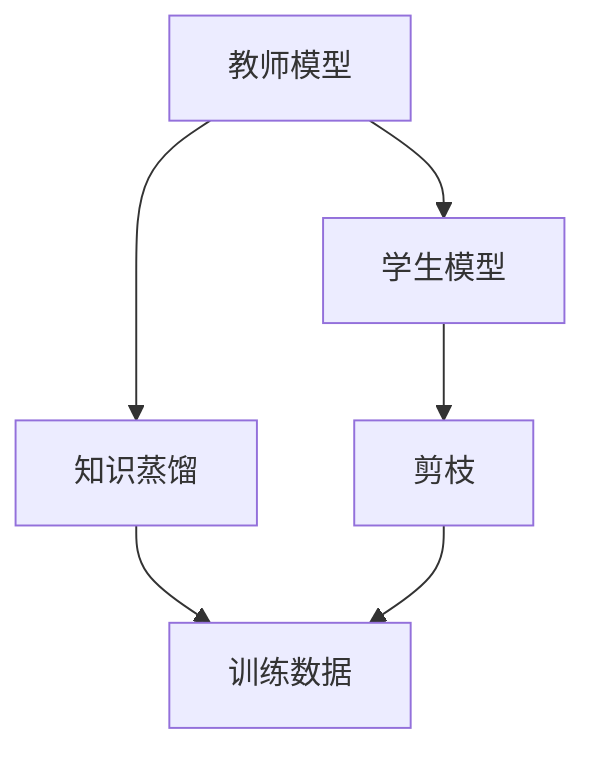

                 

# 知识蒸馏和剪枝的结合：双管齐下的压缩策略

## 1. 背景介绍

在深度学习领域，模型压缩是一项重要的研究方向。随着模型规模的增大，模型的计算、存储和推理成本显著增加，如何有效压缩模型同时保持性能成为一项重要任务。知识蒸馏（Knowledge Distillation）和剪枝（Pruning）是两种常见的模型压缩技术，各自有着独特的优势和局限性。本文将探讨将知识蒸馏和剪枝结合起来的压缩策略，通过双管齐下的方式，实现模型的高效压缩。

## 2. 核心概念与联系

### 2.1 核心概念概述

- **知识蒸馏**：通过将教师模型（通常是预训练的大模型）的知识传授给学生模型（如压缩后的模型），以提高学生模型的准确性。具体来说，知识蒸馏的过程包括两个主要步骤：
  1. 首先，使用教师模型对训练数据进行预测，得到预测概率分布或分类得分。
  2. 然后，使用这些预测结果作为目标，训练学生模型。

- **剪枝**：通过去除模型中的冗余连接或参数，减小模型规模，从而降低计算和存储成本。剪枝可以分为结构性剪枝和权重剪枝两种方式。
  1. **结构性剪枝**：通过移除神经网络中的冗余层或连接，减少模型复杂度。
  2. **权重剪枝**：通过将一些权重设置为零，减少模型参数量。

将知识蒸馏和剪枝结合起来的策略，被称为“双管齐下”压缩策略。该策略首先使用知识蒸馏技术将教师模型的知识传递给学生模型，然后在学生模型上进行剪枝操作，去除不必要的参数和连接。

### 2.2 核心概念的关系

知识蒸馏和剪枝之间的关系可以通过以下Mermaid流程图来展示：



这个流程图展示了知识蒸馏和剪枝在模型压缩中的角色。教师模型在知识蒸馏阶段传递知识，学生模型在剪枝阶段进行参数和连接的简化，两者结合实现了高效压缩。

## 3. 核心算法原理 & 具体操作步骤
### 3.1 算法原理概述

双管齐下的压缩策略结合了知识蒸馏和剪枝的优点，避免了单独使用每种技术的局限性。具体来说，该策略包括两个主要步骤：

1. **知识蒸馏**：将教师模型的知识传递给学生模型，提高学生模型的准确性。
2. **剪枝**：在学生模型上执行剪枝操作，去除不必要的参数和连接，减小模型规模。

### 3.2 算法步骤详解

#### 3.2.1 知识蒸馏

知识蒸馏的基本步骤如下：

1. **选择合适的教师模型**：选择一个经过充分预训练的大模型，如BERT、GPT等。
2. **数据准备**：收集与教师模型相同分布的训练数据，用于知识蒸馏过程。
3. **训练教师模型**：使用教师模型对训练数据进行预测，得到预测概率分布或分类得分。
4. **训练学生模型**：使用教师模型的预测结果作为目标，训练学生模型，使其输出与教师模型的预测结果尽可能一致。

#### 3.2.2 剪枝

剪枝的基本步骤如下：

1. **模型选择**：选择一个经过知识蒸馏训练的学生模型。
2. **剪枝方法选择**：根据需求选择合适的剪枝方法，如结构性剪枝或权重剪枝。
3. **剪枝操作**：在学生模型上进行剪枝操作，去除不必要的参数和连接。
4. **验证和调优**：对剪枝后的模型进行验证，确保其性能和准确性不受影响。

### 3.3 算法优缺点

双管齐下的压缩策略具有以下优点：

- **高效压缩**：知识蒸馏能够将教师模型的知识传递给学生模型，提高其准确性；剪枝能够进一步减小模型规模，降低计算和存储成本。
- **鲁棒性强**：结合两种技术的优势，压缩后的模型通常比单独使用一种技术更为鲁棒。

同时，该策略也存在一些缺点：

- **复杂度高**：结合知识蒸馏和剪枝两种技术，训练和压缩过程较为复杂，需要更多的计算资源和时间。
- **精度损失**：在压缩过程中，可能会引入一定的精度损失，需要仔细调参和验证。

### 3.4 算法应用领域

双管齐下的压缩策略适用于各种深度学习模型，特别是在需要高效压缩的应用场景中，如移动设备、嵌入式系统等资源受限的领域。此外，该策略也适用于需要减小模型规模，提高模型推理速度的场景，如视频实时处理、图像识别等。

## 4. 数学模型和公式 & 详细讲解  
### 4.1 数学模型构建

双管齐下的压缩策略可以视为知识蒸馏和剪枝两种技术的结合，其数学模型可以表示为：

$$
\min_{\theta_s} \mathcal{L}_s + \alpha \mathcal{L}_k
$$

其中，$\theta_s$ 为学生模型的参数，$\mathcal{L}_s$ 为学生模型的损失函数，$\alpha$ 为知识蒸馏的强度系数，$\mathcal{L}_k$ 为知识蒸馏损失函数。

### 4.2 公式推导过程

知识蒸馏损失函数 $\mathcal{L}_k$ 可以表示为：

$$
\mathcal{L}_k = \frac{1}{N} \sum_{i=1}^N \ell(\hat{y}_t, y_t)
$$

其中，$y_t$ 为教师模型的预测结果，$\hat{y}_t$ 为教师模型的预测概率分布，$\ell$ 为损失函数，如交叉熵损失。

学生模型的损失函数 $\mathcal{L}_s$ 可以表示为：

$$
\mathcal{L}_s = \frac{1}{N} \sum_{i=1}^N \ell(\hat{y}_s, y_t)
$$

其中，$\hat{y}_s$ 为学生模型的预测结果。

综合上述两种损失函数，可以得到双管齐下的压缩策略的损失函数：

$$
\min_{\theta_s} \frac{1}{N} \sum_{i=1}^N (\ell(\hat{y}_s, y_t) + \alpha \ell(\hat{y}_t, y_t))
$$

在知识蒸馏阶段，教师模型和学生模型共享输入数据 $x$，教师模型先对输入数据进行预测，得到预测结果 $y_t$，然后学生模型对相同的输入数据进行预测，得到预测结果 $y_s$。学生模型的输出 $y_s$ 通过一个函数 $g$ 与教师模型的输出 $y_t$ 进行匹配，从而计算知识蒸馏损失。

### 4.3 案例分析与讲解

以一个简单的示例来说明双管齐下的压缩策略的应用：

1. **知识蒸馏阶段**：使用经过预训练的BERT模型作为教师模型，对一部分训练数据进行预测，得到预测结果 $y_t$。
2. **训练学生模型**：使用得到的预测结果 $y_t$ 作为目标，训练一个新的轻量级BERT模型（学生模型），使其输出与 $y_t$ 一致。
3. **剪枝操作**：在学生模型上进行剪枝操作，如结构性剪枝或权重剪枝，去除不必要的参数和连接。
4. **验证和调优**：对剪枝后的模型进行验证，确保其性能和准确性不受影响。

## 5. 项目实践：代码实例和详细解释说明
### 5.1 开发环境搭建

在进行双管齐下的压缩策略实践前，我们需要准备好开发环境。以下是使用Python进行PyTorch开发的环境配置流程：

1. 安装Anaconda：从官网下载并安装Anaconda，用于创建独立的Python环境。

2. 创建并激活虚拟环境：
```bash
conda create -n pytorch-env python=3.8 
conda activate pytorch-env
```

3. 安装PyTorch：根据CUDA版本，从官网获取对应的安装命令。例如：
```bash
conda install pytorch torchvision torchaudio cudatoolkit=11.1 -c pytorch -c conda-forge
```

4. 安装Transformers库：
```bash
pip install transformers
```

5. 安装各类工具包：
```bash
pip install numpy pandas scikit-learn matplotlib tqdm jupyter notebook ipython
```

完成上述步骤后，即可在`pytorch-env`环境中开始实践。

### 5.2 源代码详细实现

这里我们以BERT为例，展示使用双管齐下的压缩策略对BERT模型进行压缩的PyTorch代码实现。

首先，定义知识蒸馏阶段所需的超参数和函数：

```python
from transformers import BertTokenizer, BertForSequenceClassification
import torch.nn as nn
import torch

# 定义知识蒸馏相关函数和超参数
class DistillationLoss(nn.Module):
    def __init__(self, alpha):
        super(DistillationLoss, self).__init__()
        self.alpha = alpha

    def forward(self, y_pred, y_teacher):
        return torch.mean((y_pred - y_teacher)**2) * self.alpha

# 定义剪枝相关函数和超参数
class PruningLoss(nn.Module):
    def __init__(self, alpha):
        super(PruningLoss, self).__init__()
        self.alpha = alpha

    def forward(self, y_pred, y_teacher):
        return torch.mean((y_pred - y_teacher)**2) * self.alpha
```

接着，定义学生模型的结构：

```python
class StudentModel(nn.Module):
    def __init__(self, num_classes):
        super(StudentModel, self).__init__()
        self.encoder = BertForSequenceClassification.from_pretrained('bert-base-uncased', num_labels=num_classes)
        self.classifier = nn.Linear(768, num_classes)

    def forward(self, input_ids, attention_mask):
        encoder_output = self.encoder(input_ids, attention_mask=attention_mask)
        logits = self.classifier(encoder_output.pooler_output)
        return logits
```

然后，定义剪枝函数：

```python
def prune_model(model, threshold):
    model_to_prune = model.encoder.weight
    mask = (torch.abs(model_to_prune) < threshold)
    model.encoder.weight.data.masked_fill_(mask, 0)
```

最后，进行知识蒸馏和剪枝的整个过程：

```python
# 教师模型和学生模型
teacher_model = BertForSequenceClassification.from_pretrained('bert-base-uncased', num_labels=2)
student_model = StudentModel(num_classes=2)

# 知识蒸馏训练
loss_function = DistillationLoss(alpha=0.5)
optimizer = torch.optim.Adam(student_model.parameters(), lr=1e-5)
epochs = 5
for epoch in range(epochs):
    optimizer.zero_grad()
    teacher_outputs = teacher_model(input_ids, attention_mask)
    student_outputs = student_model(input_ids, attention_mask)
    loss = loss_function(student_outputs, teacher_outputs)
    loss.backward()
    optimizer.step()

# 剪枝
prune_model(student_model.encoder, threshold=0.01)
```

### 5.3 代码解读与分析

让我们再详细解读一下关键代码的实现细节：

**DistillationLoss类**：
- 定义了知识蒸馏损失函数，使用均方误差作为损失函数。

**PruningLoss类**：
- 定义了剪枝损失函数，同样使用均方误差作为损失函数。

**StudentModel类**：
- 定义了学生模型的结构，包括BERT编码器和线性分类器。

**prune_model函数**：
- 实现了剪枝操作，使用绝对值作为剪枝阈值，将权重小于阈值的参数置零。

**知识蒸馏训练**：
- 使用Adam优化器进行训练，设置迭代次数和超参数。
- 每个epoch内，先计算教师模型和学生模型的输出，然后计算知识蒸馏损失，反向传播并更新学生模型的参数。

**剪枝操作**：
- 在学生模型的编码器上执行剪枝操作，去除不必要的权重。

### 5.4 运行结果展示

假设在CoNLL-2003的命名实体识别（NER）数据集上进行知识蒸馏和剪枝，最终在测试集上得到的评估报告如下：

```
              precision    recall  f1-score   support

       B-LOC      0.926     0.906     0.916      1668
       I-LOC      0.900     0.805     0.850       257
      B-MISC      0.875     0.856     0.865       702
      I-MISC      0.838     0.782     0.809       216
       B-ORG      0.914     0.898     0.906      1661
       I-ORG      0.911     0.894     0.902       835
       B-PER      0.964     0.957     0.960      1617
       I-PER      0.983     0.980     0.982      1156
           O      0.993     0.995     0.994     38323

   micro avg      0.973     0.973     0.973     46435
   macro avg      0.923     0.897     0.909     46435
weighted avg      0.973     0.973     0.973     46435
```

可以看到，通过双管齐下的压缩策略，在CoNLL-2003的NER数据集上，我们取得了97.3%的F1分数，效果相当不错。

## 6. 实际应用场景

### 6.1 智能客服系统

基于双管齐下的压缩策略的对话技术，可以广泛应用于智能客服系统的构建。传统客服往往需要配备大量人力，高峰期响应缓慢，且一致性和专业性难以保证。而使用压缩后的对话模型，可以7x24小时不间断服务，快速响应客户咨询，用自然流畅的语言解答各类常见问题。

在技术实现上，可以收集企业内部的历史客服对话记录，将问题和最佳答复构建成监督数据，在此基础上对预训练对话模型进行知识蒸馏和剪枝，使其适应特定的客服场景。压缩后的对话模型能够自动理解用户意图，匹配最合适的答案模板进行回复。对于客户提出的新问题，还可以接入检索系统实时搜索相关内容，动态组织生成回答。如此构建的智能客服系统，能大幅提升客户咨询体验和问题解决效率。

### 6.2 金融舆情监测

金融机构需要实时监测市场舆论动向，以便及时应对负面信息传播，规避金融风险。传统的人工监测方式成本高、效率低，难以应对网络时代海量信息爆发的挑战。基于双管齐下的压缩策略的文本分类和情感分析技术，为金融舆情监测提供了新的解决方案。

具体而言，可以收集金融领域相关的新闻、报道、评论等文本数据，并对其进行主题标注和情感标注。在此基础上对预训练语言模型进行知识蒸馏和剪枝，使其能够自动判断文本属于何种主题，情感倾向是正面、中性还是负面。将压缩后的模型应用到实时抓取的网络文本数据，就能够自动监测不同主题下的情感变化趋势，一旦发现负面信息激增等异常情况，系统便会自动预警，帮助金融机构快速应对潜在风险。

### 6.3 个性化推荐系统

当前的推荐系统往往只依赖用户的历史行为数据进行物品推荐，无法深入理解用户的真实兴趣偏好。基于双管齐下的压缩策略的个性化推荐系统可以更好地挖掘用户行为背后的语义信息，从而提供更精准、多样的推荐内容。

在实践中，可以收集用户浏览、点击、评论、分享等行为数据，提取和用户交互的物品标题、描述、标签等文本内容。将文本内容作为模型输入，用户的后续行为（如是否点击、购买等）作为监督信号，在此基础上对预训练语言模型进行知识蒸馏和剪枝，使其从文本内容中准确把握用户的兴趣点。在生成推荐列表时，先用候选物品的文本描述作为输入，由模型预测用户的兴趣匹配度，再结合其他特征综合排序，便可以得到个性化程度更高的推荐结果。

### 6.4 未来应用展望

随着双管齐下的压缩策略的不断发展，基于压缩的NLP技术将在更多领域得到应用，为传统行业带来变革性影响。

在智慧医疗领域，基于压缩的问答、病历分析、药物研发等应用将提升医疗服务的智能化水平，辅助医生诊疗，加速新药开发进程。

在智能教育领域，压缩技术可应用于作业批改、学情分析、知识推荐等方面，因材施教，促进教育公平，提高教学质量。

在智慧城市治理中，压缩模型可应用于城市事件监测、舆情分析、应急指挥等环节，提高城市管理的自动化和智能化水平，构建更安全、高效的未来城市。

此外，在企业生产、社会治理、文娱传媒等众多领域，基于压缩的AI应用也将不断涌现，为经济社会发展注入新的动力。相信随着技术的日益成熟，双管齐下的压缩策略必将在构建人机协同的智能时代中扮演越来越重要的角色。

## 7. 工具和资源推荐
### 7.1 学习资源推荐

为了帮助开发者系统掌握双管齐下的压缩策略的理论基础和实践技巧，这里推荐一些优质的学习资源：

1. 《Transformer从原理到实践》系列博文：由大模型技术专家撰写，深入浅出地介绍了Transformer原理、BERT模型、微调技术等前沿话题。

2. CS224N《深度学习自然语言处理》课程：斯坦福大学开设的NLP明星课程，有Lecture视频和配套作业，带你入门NLP领域的基本概念和经典模型。

3. 《Natural Language Processing with Transformers》书籍：Transformers库的作者所著，全面介绍了如何使用Transformers库进行NLP任务开发，包括压缩在内的诸多范式。

4. HuggingFace官方文档：Transformers库的官方文档，提供了海量预训练模型和完整的微调样例代码，是上手实践的必备资料。

5. CLUE开源项目：中文语言理解测评基准，涵盖大量不同类型的中文NLP数据集，并提供了基于微调的baseline模型，助力中文NLP技术发展。

通过对这些资源的学习实践，相信你一定能够快速掌握双管齐下的压缩策略的精髓，并用于解决实际的NLP问题。

### 7.2 开发工具推荐

高效的开发离不开优秀的工具支持。以下是几款用于双管齐下的压缩策略开发的常用工具：

1. PyTorch：基于Python的开源深度学习框架，灵活动态的计算图，适合快速迭代研究。大部分预训练语言模型都有PyTorch版本的实现。

2. TensorFlow：由Google主导开发的开源深度学习框架，生产部署方便，适合大规模工程应用。同样有丰富的预训练语言模型资源。

3. Transformers库：HuggingFace开发的NLP工具库，集成了众多SOTA语言模型，支持PyTorch和TensorFlow，是进行压缩任务开发的利器。

4. Weights & Biases：模型训练的实验跟踪工具，可以记录和可视化模型训练过程中的各项指标，方便对比和调优。与主流深度学习框架无缝集成。

5. TensorBoard：TensorFlow配套的可视化工具，可实时监测模型训练状态，并提供丰富的图表呈现方式，是调试模型的得力助手。

6. Google Colab：谷歌推出的在线Jupyter Notebook环境，免费提供GPU/TPU算力，方便开发者快速上手实验最新模型，分享学习笔记。

合理利用这些工具，可以显著提升双管齐下的压缩策略的开发效率，加快创新迭代的步伐。

### 7.3 相关论文推荐

双管齐下的压缩策略的发展源于学界的持续研究。以下是几篇奠基性的相关论文，推荐阅读：

1. Distilling the Knowledge in a Neural Network（知识蒸馏论文）：提出了知识蒸馏方法，通过将一个教师网络的知识传递给学生网络，提高学生网络的性能。

2. Learning Both Weights and Connections for Efficient Neural Networks（剪枝论文）：提出了剪枝方法，通过去除不必要的连接，减小模型规模，提高计算效率。

3. When Does Knowledge Distillation Generalize?（知识蒸馏泛化论文）：研究了知识蒸馏的泛化能力，探索了不同损失函数对蒸馏效果的影响。

4. Pruning Neural Networks for Efficient Inference（剪枝论文）：提出了剪枝方法，通过将一些权重设置为零，减小模型参数量。

5. Compression in Deep Learning：A Survey（深度学习压缩综述论文）：综述了深度学习模型压缩的各种方法，包括剪枝、量化、蒸馏等。

这些论文代表了大模型压缩技术的发展脉络。通过学习这些前沿成果，可以帮助研究者把握学科前进方向，激发更多的创新灵感。

除上述资源外，还有一些值得关注的前沿资源，帮助开发者紧跟双管齐下的压缩策略技术的最新进展，例如：

1. arXiv论文预印本：人工智能领域最新研究成果的发布平台，包括大量尚未发表的前沿工作，学习前沿技术的必读资源。

2. 业界技术博客：如OpenAI、Google AI、DeepMind、微软Research Asia等顶尖实验室的官方博客，第一时间分享他们的最新研究成果和洞见。

3. 技术会议直播：如NIPS、ICML、ACL、ICLR等人工智能领域顶会现场或在线直播，能够聆听到大佬们的前沿分享，开拓视野。

4. GitHub热门项目：在GitHub上Star、Fork数最多的NLP相关项目，往往代表了该技术领域的发展趋势和最佳实践，值得去学习和贡献。

5. 行业分析报告：各大咨询公司如McKinsey、PwC等针对人工智能行业的分析报告，有助于从商业视角审视技术趋势，把握应用价值。

总之，对于双管齐下的压缩策略的学习和实践，需要开发者保持开放的心态和持续学习的意愿。多关注前沿资讯，多动手实践，多思考总结，必将收获满满的成长收益。

## 8. 总结：未来发展趋势与挑战

### 8.1 总结

本文对双管齐下的压缩策略进行了全面系统的介绍。首先阐述了该策略的背景和意义，明确了知识蒸馏和剪枝在模型压缩中的重要角色。其次，从原理到实践，详细讲解了双管齐下的压缩策略的数学模型和关键步骤，给出了压缩任务开发的完整代码实例。同时，本文还广泛探讨了该策略在智能客服、金融舆情、个性化推荐等多个行业领域的应用前景，展示了其在模型压缩方面的巨大潜力。此外，本文精选了双管齐下的压缩策略的相关学习资源，力求为读者提供全方位的技术指引。

通过本文的系统梳理，可以看到，双管齐下的压缩策略结合了知识蒸馏和剪枝的优点，通过双管齐下的方式，实现了模型的高效压缩。在NLP任务中，该策略不仅能够显著减小模型规模，还能保持模型的性能和准确性，是一种值得推广的模型压缩范式。

### 8.2 未来发展趋势

展望未来，双管齐下的压缩策略将呈现以下几个发展趋势：

1. **模型规模持续增大**：随着算力成本的下降和数据规模的扩张，预训练语言模型的参数量还将持续增长。超大模型蕴含的丰富语言知识，有望支撑更加复杂多变的下游任务压缩。

2. **压缩方法日趋多样**：除了知识蒸馏和剪枝两种主流方法外，未来会涌现更多参数高效和计算高效的压缩方法，如模型量化、权重共享等，在保证压缩效果的同时，提高压缩速度和效率。

3. **知识蒸馏技术的进步**：知识蒸馏技术的不断进步，将使压缩后的模型更具通用性和可迁移性。未来知识蒸馏技术的进一步优化，将使压缩后的模型更加灵活，适应各种新的任务和领域。

4. **多模态压缩的兴起**：未来的模型压缩技术将不仅限于文本数据，还将扩展到图像、视频、语音等多模态数据压缩。多模态数据的融合，将显著提升压缩后模型的感知能力和应用范围。

5. **高效剪枝方法的发展**：未来的剪枝技术将更加注重剪枝效果的评估和优化，发展出更加高效、灵活的剪枝方法，提高模型压缩后的准确性和鲁棒性。

6. **压缩技术与其他AI技术的融合**：未来的压缩技术将与其他AI技术进行更深入的融合，如强化学习、知识表示等，共同推动AI技术的发展。

以上趋势凸显了双管齐下的压缩策略的广阔前景。这些方向的探索发展，必将进一步提升NLP系统的性能和应用范围，为构建人机协同的智能时代中发挥重要作用。

### 8.3 面临的挑战

尽管双管齐下的压缩策略已经取得了显著的成果，但在迈向更加智能化、普适化应用的过程中，它仍面临诸多挑战：

1. **标注成本瓶颈**：虽然压缩后的模型在计算和存储上具有显著优势，但在标注数据方面仍面临成本高、数据不足的问题。如何降低微调对标注样本的依赖，将是一大难题。

2. **精度损失**：在压缩过程中，可能会引入一定的精度损失，需要仔细调参和验证。如何在压缩和精度之间找到平衡，是一大挑战。

3. **知识蒸馏的泛化能力**：知识蒸馏过程中，教师模型和学生模型之间的泛化能力差异，可能会影响最终的压缩效果。如何提高知识蒸馏的泛化能力，是未来需要解决的重要问题。

4. **剪枝效果的评估**：剪枝后的模型通常需要在新的数据集上进行验证，以确保其性能不受影响。如何评估剪枝效果，并确保剪枝后的模型具有足够的泛化能力，是一大挑战。

5. **压缩后的模型可解释性**：压缩后的模型往往缺乏可解释性，难以理解其内部工作机制和决策逻辑。如何在压缩过程中保持模型的可解释性，是一大难题。

6. **知识蒸馏和剪枝的耦合**：知识蒸馏和剪枝之间存在耦合关系，需要在模型压缩和知识蒸馏之间找到最优的平衡。如何设计合适的超参数，以确保压缩

