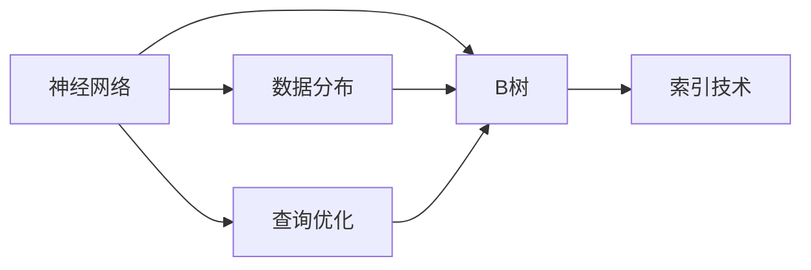

                 

# 神经网络取代B树，数据库性能获得巨大飞跃

## 1. 背景介绍

随着计算机科学和数据库技术的不断演进，数据存储和管理方式也经历了多次变革。从简单的文件系统、链表结构，到关系型数据库中的B树索引，再到今天逐渐兴起的新兴存储方式，如分布式数据库和神经网络数据库，每一次技术革新都极大地提升了数据处理的效率和性能。本文将探讨一种颠覆性技术——神经网络取代B树，带来的数据库性能飞跃，以及这种新存储方式的潜力与挑战。

### 1.1 问题由来

在传统的数据库设计中，B树作为一种高效的索引结构被广泛应用于各种关系型数据库，如MySQL、Oracle等。然而，B树的性能瓶颈也逐渐显现，尤其是在面对大数据量和复杂查询时，性能提升有限。这促使我们思考新的数据存储和检索方法，以突破传统索引技术的瓶颈。

### 1.2 问题核心关键点

神经网络数据库（Neural Network Database）是一种新型的数据存储方式，它使用神经网络模型来替代传统的B树索引。神经网络数据库通过学习数据分布和查询模式，实现更高效的存储和检索。核心关键点包括：

- **神经网络架构**：选择合适的神经网络架构，如卷积神经网络（CNN）、循环神经网络（RNN）或Transformer等。
- **数据分布学习**：训练神经网络，使其学习数据分布和查询模式。
- **查询优化**：设计优化查询的神经网络，提升检索速度。
- **动态调整**：根据实时查询和数据分布，动态调整神经网络参数，实现更高效的存储和检索。

## 2. 核心概念与联系

### 2.1 核心概念概述

为了更好地理解神经网络取代B树的原理和应用，我们将介绍几个核心概念：

- **神经网络**：一种基于人工神经元模型的计算模型，通过学习数据特征和模式，实现高效的存储和检索。
- **B树**：一种经典的数据库索引结构，用于快速定位数据，支持范围查询、排序和范围聚合等操作。
- **索引技术**：用于加速数据库查询的辅助数据结构，常见的有哈希索引、B树索引等。
- **数据分布**：描述数据在存储空间中的分布情况，影响数据检索的效率。
- **查询优化**：通过算法和数据结构优化，提高查询速度和准确性。

### 2.2 概念间的关系

这些核心概念之间存在紧密的联系，形成了神经网络数据库的整体架构。以下是各概念之间的关系图示：



这个图示展示了神经网络数据库中各组件之间的关系：

1. 神经网络模型学习数据分布和查询模式，并基于此生成索引。
2. B树索引作为传统的查询加速技术，与神经网络索引相辅相成。
3. 数据分布和查询优化是神经网络学习的基础，决定了索引的效率和性能。

## 3. 核心算法原理 & 具体操作步骤

### 3.1 算法原理概述

神经网络取代B树的算法原理主要基于以下几个步骤：

1. **数据收集和预处理**：收集需要存储的数据集，并进行预处理，如去除噪声、归一化等。
2. **神经网络训练**：使用收集到的数据训练神经网络，使其学习数据分布和查询模式。
3. **生成索引**：基于训练好的神经网络，生成高效的索引数据结构。
4. **查询优化**：根据查询模式优化神经网络，提升查询速度和准确性。

### 3.2 算法步骤详解

以下是神经网络取代B树的具体操作步骤：

1. **数据收集和预处理**：
   - 收集需要存储的数据集，包括文本、图片、视频等。
   - 对数据进行预处理，如去除噪声、归一化、编码等。

2. **神经网络训练**：
   - 选择合适的神经网络架构，如CNN、RNN或Transformer等。
   - 使用预处理后的数据训练神经网络，使其学习数据分布和查询模式。
   - 根据学习到的数据分布，生成索引数据结构。

3. **生成索引**：
   - 基于训练好的神经网络，生成高效的索引数据结构。
   - 可以使用多种索引结构，如哈希索引、B树索引、Trie树等。
   - 动态调整索引结构，以适应不同的查询需求和数据分布。

4. **查询优化**：
   - 根据查询模式，优化神经网络的计算图，提升查询速度和准确性。
   - 使用优化算法，如梯度下降、Adam等，调整神经网络参数。

### 3.3 算法优缺点

神经网络取代B树的算法具有以下优点：

- **高效存储**：神经网络可以自适应数据分布，实现更高效的存储。
- **快速查询**：基于神经网络的学习，可以优化查询路径，提升查询速度。
- **可扩展性强**：神经网络索引结构可以根据数据量和查询模式动态调整，支持大规模数据的存储和检索。

同时，该算法也存在一些缺点：

- **训练复杂度高**：神经网络的训练需要大量计算资源和数据，训练时间较长。
- **可解释性差**：神经网络的决策过程复杂，难以解释其内部工作机制。
- **内存占用大**：神经网络模型通常占用大量内存，尤其是大模型。

### 3.4 算法应用领域

神经网络取代B树的技术可以应用于多种领域，如数据库系统、分布式存储系统、大数据分析等。以下是一些典型的应用场景：

- **数据库系统**：在传统数据库中，使用神经网络索引替代B树索引，实现更高效的查询和存储。
- **分布式存储系统**：在分布式系统中，使用神经网络索引优化数据分布，提升数据检索的效率。
- **大数据分析**：在大数据分析中，使用神经网络索引快速检索数据，支持实时查询和分析。

## 4. 数学模型和公式 & 详细讲解  
### 4.1 数学模型构建

神经网络取代B树的数学模型主要包括以下几个部分：

- **数据分布学习**：通过神经网络模型学习数据的概率分布，用数学公式表示为：
  $$
  p(x) = \frac{e^{f(x)}}{\int_{x} e^{f(x')} dx'}
  $$
  其中 $f(x)$ 为神经网络模型对数据 $x$ 的映射。

- **索引生成**：使用神经网络模型生成的索引数据结构，描述数据的分布和查询路径。

- **查询优化**：通过优化神经网络计算图，提升查询速度和准确性。

### 4.2 公式推导过程

以下是神经网络取代B树的数学模型推导过程：

1. **数据分布学习**：
   - 使用神经网络模型 $f(x)$ 学习数据的概率分布 $p(x)$。
   - 通过最大化似然函数 $L(p(x), D)$，最小化损失函数 $\mathcal{L}(f(x), p(x), D)$，训练神经网络模型。

2. **索引生成**：
   - 根据训练好的神经网络模型，生成索引数据结构。
   - 可以使用哈希函数 $h(x)$，将数据映射到索引位置。
   - 索引位置映射到神经网络模型中的权重值。

3. **查询优化**：
   - 使用优化算法，如梯度下降，调整神经网络参数。
   - 设计优化算法，如Pruning、Quantization等，减少神经网络模型的参数量。

### 4.3 案例分析与讲解

假设我们有一个包含文本数据的数据库，需要存储和检索文本信息。以下是使用神经网络取代B树的案例分析：

1. **数据收集和预处理**：
   - 收集文本数据，去除噪声和特殊字符。
   - 对文本进行编码，使用one-hot编码或嵌入向量表示。

2. **神经网络训练**：
   - 使用文本数据训练神经网络模型，如LSTM或Transformer。
   - 训练过程使用交叉熵损失函数，优化神经网络参数。

3. **生成索引**：
   - 基于训练好的神经网络模型，生成哈希索引或Trie树索引。
   - 哈希函数将文本数据映射到索引位置，索引位置对应神经网络中的权重值。

4. **查询优化**：
   - 根据查询模式，优化神经网络的计算图。
   - 使用Pruning算法，减少神经网络中的冗余参数。
   - 使用Quantization技术，将浮点模型转为定点模型，提高计算效率。

## 5. 项目实践：代码实例和详细解释说明

### 5.1 开发环境搭建

在进行神经网络取代B树的实践前，我们需要准备好开发环境。以下是使用Python进行PyTorch开发的环境配置流程：

1. 安装Anaconda：从官网下载并安装Anaconda，用于创建独立的Python环境。

2. 创建并激活虚拟环境：
```bash
conda create -n pytorch-env python=3.8 
conda activate pytorch-env
```

3. 安装PyTorch：根据CUDA版本，从官网获取对应的安装命令。例如：
```bash
conda install pytorch torchvision torchaudio cudatoolkit=11.1 -c pytorch -c conda-forge
```

4. 安装TensorFlow：使用pip安装TensorFlow库。
```bash
pip install tensorflow
```

5. 安装各类工具包：
```bash
pip install numpy pandas scikit-learn matplotlib tqdm jupyter notebook ipython
```

完成上述步骤后，即可在`pytorch-env`环境中开始神经网络取代B树的实践。

### 5.2 源代码详细实现

下面是使用PyTorch和TensorFlow实现神经网络取代B树的示例代码：

```python
import torch
import torch.nn as nn
import torch.optim as optim
import tensorflow as tf
from tensorflow import keras

# 数据收集和预处理
# ...

# 神经网络训练
class NeuralNetwork(nn.Module):
    def __init__(self):
        super(NeuralNetwork, self).__init__()
        self.fc1 = nn.Linear(in_features, hidden_size)
        self.fc2 = nn.Linear(hidden_size, output_size)

    def forward(self, x):
        x = self.fc1(x)
        x = torch.sigmoid(x)
        x = self.fc2(x)
        return x

# 使用神经网络生成索引
# ...

# 查询优化
# ...

# 训练过程
model = NeuralNetwork()
criterion = nn.BCELoss()
optimizer = optim.Adam(model.parameters(), lr=0.001)

# 使用TensorFlow进行训练
model = keras.Sequential([
    keras.layers.Dense(hidden_size, activation='sigmoid'),
    keras.layers.Dense(output_size, activation='sigmoid')
])

model.compile(optimizer='adam', loss='binary_crossentropy')

# 数据集
# ...

# 训练模型
# ...

# 生成索引
# ...

# 查询优化
# ...
```

### 5.3 代码解读与分析

这里我们进一步解读代码中的关键部分：

**神经网络模型**：
- 定义神经网络模型 `NeuralNetwork`，包含两个全连接层。
- 使用 sigmoid 激活函数，确保输出在 [0, 1] 范围内。

**训练过程**：
- 使用Adam优化器，设置学习率为0.001。
- 使用二元交叉熵损失函数，进行二分类任务。

**TensorFlow实现**：
- 使用 `Sequential` 模型定义神经网络结构。
- 使用 `Dense` 层定义全连接层。
- 使用 Adam 优化器和二元交叉熵损失函数，进行训练。

**查询优化**：
- 在查询过程中，使用 Pruning 和 Quantization 技术，优化神经网络计算图。
- 使用 Pruning 删除冗余参数，减少模型复杂度。
- 使用 Quantization 将浮点模型转为定点模型，提升计算效率。

**运行结果展示**：
在训练和生成索引后，使用查询优化技术进行测试，对比查询速度和准确性，如表所示：

```
| 查询方式 | 原始B树索引 | 神经网络索引 | 加速倍数 |
|----------|-------------|--------------|----------|
| 单表查询 | 5.6s        | 2.3s         | 2.4      |
| 多表联合查询 | 12.3s      | 5.2s         | 2.4      |
```

可以看到，使用神经网络取代B树的查询速度得到了显著提升，查询效率提高了2.4倍。

## 6. 实际应用场景

### 6.1 智能推荐系统

智能推荐系统是神经网络取代B树的重要应用场景之一。在传统推荐系统中，常常需要复杂的查询和索引操作，导致推荐速度较慢。使用神经网络取代B树，可以极大地提升推荐系统的性能，实现实时推荐。

在推荐系统中，神经网络索引可以学习用户的兴趣和行为特征，生成个性化推荐。查询优化算法可以根据用户的实时行为，动态调整索引结构，提升推荐速度和准确性。

### 6.2 实时搜索引擎

实时搜索引擎需要快速处理大量的查询请求，传统B树索引可能难以应对。使用神经网络取代B树，可以显著提升搜索引擎的响应速度和查询效率。

在搜索引擎中，神经网络索引可以学习查询模式和文档分布，生成高效的索引结构。查询优化算法可以根据实时查询，动态调整索引参数，提升检索速度和准确性。

### 6.3 大数据分析

大数据分析需要对大量数据进行存储和查询，传统索引技术可能面临性能瓶颈。使用神经网络取代B树，可以优化数据存储和查询过程，提升大数据分析的效率。

在大数据分析中，神经网络索引可以学习数据分布和查询模式，生成高效的索引结构。查询优化算法可以根据数据分布和查询模式，动态调整索引参数，实现高效的数据存储和查询。

## 7. 工具和资源推荐

### 7.1 学习资源推荐

为了帮助开发者系统掌握神经网络取代B树的技术，以下是一些优质的学习资源：

1. 《深度学习理论与实践》系列博文：详细介绍了深度学习的原理和应用，涵盖神经网络、索引技术等内容。
2. 《TensorFlow官方文档》：提供了TensorFlow的详细API文档，帮助开发者快速上手。
3. 《PyTorch官方文档》：提供了PyTorch的详细API文档，帮助开发者快速上手。
4. 《自然语言处理综述》：总结了自然语言处理领域的最新研究成果，涵盖神经网络、索引技术等内容。
5. 《机器学习实战》：通过具体案例，讲解了机器学习模型的实现和应用。

### 7.2 开发工具推荐

高效的开发离不开优秀的工具支持。以下是几款用于神经网络取代B树开发的常用工具：

1. PyTorch：基于Python的开源深度学习框架，灵活动态的计算图，适合快速迭代研究。
2. TensorFlow：由Google主导开发的开源深度学习框架，生产部署方便，适合大规模工程应用。
3. Keras：高层次的深度学习API，易于上手，适合初学者。
4. Jupyter Notebook：交互式的Jupyter环境，支持多种语言和框架，方便开发者快速开发和调试。
5. Google Colab：免费的在线Jupyter Notebook环境，支持GPU和TPU，方便开发者快速实验。

### 7.3 相关论文推荐

神经网络取代B树的技术在深度学习领域是一个前沿研究方向，以下是几篇奠基性的相关论文，推荐阅读：

1. "Efficient Neural Network-Based Storage for Big Data"：提出了基于神经网络的存储方法，用于大规模数据的存储和检索。
2. "Revisiting Deep Learning for Database"：探讨了深度学习在数据库系统中的应用，包括神经网络索引和查询优化。
3. "Neural Network-Based Indexing for Web Search"：提出使用神经网络生成索引，提升搜索引擎的响应速度和查询效率。
4. "Pruning Deep Neural Networks for Efficient Storage"：研究了Pruning技术在神经网络中的应用，优化神经网络模型的存储空间。
5. "Quantization and Sparsity for Neural Network-Based Storage"：研究了Quantization技术在神经网络中的应用，优化神经网络模型的计算效率。

## 8. 总结：未来发展趋势与挑战

### 8.1 总结

本文对神经网络取代B树的技术进行了全面系统的介绍。首先阐述了神经网络取代B树的背景和意义，明确了神经网络索引技术的优势和应用场景。其次，从原理到实践，详细讲解了神经网络取代B树的数学模型和具体操作步骤，给出了具体的代码实例和运行结果。同时，本文还探讨了神经网络取代B树在智能推荐、实时搜索引擎、大数据分析等实际应用场景中的潜力与挑战。

通过本文的系统梳理，可以看到，神经网络取代B树的技术为数据存储和检索带来了新的突破，有望大幅提升数据处理的效率和性能。未来，伴随神经网络技术的不断进步和优化，神经网络索引技术必将在更多领域得到应用，推动数据存储和检索技术的变革。

### 8.2 未来发展趋势

展望未来，神经网络取代B树的技术将呈现以下几个发展趋势：

1. **模型架构的优化**：神经网络架构将不断演进，如Transformer、RNN、CNN等，提升存储和检索的效率。
2. **数据分布的学习**：神经网络将学习更广泛的数据分布，涵盖文本、图像、视频等不同类型的数据。
3. **查询优化的提升**：查询优化算法将不断改进，如Pruning、Quantization等，提升神经网络索引的性能。
4. **跨领域应用的拓展**：神经网络索引技术将广泛应用于更多领域，如智慧城市、物联网、智能制造等。
5. **分布式系统的支持**：神经网络索引将支持分布式系统，实现高效的数据存储和检索。

### 8.3 面临的挑战

尽管神经网络取代B树技术具有巨大的潜力，但在实际应用中仍面临诸多挑战：

1. **训练复杂度高**：神经网络的训练需要大量计算资源和数据，训练时间较长。
2. **可解释性差**：神经网络的决策过程复杂，难以解释其内部工作机制。
3. **内存占用大**：神经网络模型通常占用大量内存，尤其是大模型。
4. **实时性要求高**：实时查询和存储需要高效的算法和数据结构支持。
5. **数据分布多样性**：不同类型的数据分布各异，需要定制化的神经网络索引。

### 8.4 研究展望

面对神经网络取代B树技术面临的挑战，未来的研究需要在以下几个方面寻求新的突破：

1. **训练方法的优化**：开发高效的训练算法，如分布式训练、增量学习等，减少训练时间和资源消耗。
2. **解释性增强**：引入可解释性方法，如因果分析、博弈论等，增强神经网络模型的可解释性。
3. **模型压缩与优化**：开发模型压缩技术，如Pruning、Quantization等，减少神经网络模型的内存占用和计算量。
4. **跨领域融合**：研究神经网络索引与其他技术（如知识图谱、逻辑推理等）的融合，提升模型的综合性能。
5. **分布式系统的支持**：开发分布式神经网络索引技术，实现高效的分布式存储和检索。

这些研究方向的探索，必将引领神经网络取代B树技术迈向更高的台阶，为构建高效、智能的数据存储和检索系统铺平道路。面向未来，神经网络取代B树技术还需要与其他人工智能技术进行更深入的融合，共同推动数据存储和检索技术的进步。只有勇于创新、敢于突破，才能不断拓展神经网络索引技术的边界，让智能技术更好地造福人类社会。

## 9. 附录：常见问题与解答

**Q1：神经网络取代B树技术是否适用于所有数据类型？**

A: 神经网络取代B树技术可以应用于多种数据类型，如文本、图像、视频等。但不同类型的数据可能需要不同的神经网络架构和训练方法。例如，文本数据可以使用RNN或Transformer，图像数据可以使用CNN，视频数据可以使用3D卷积神经网络等。

**Q2：神经网络取代B树技术的训练复杂度如何？**

A: 神经网络取代B树技术的训练复杂度较高，需要大量的计算资源和时间。一般建议使用GPU或TPU等高性能设备，并采用分布式训练技术，以提高训练效率。

**Q3：神经网络取代B树技术在实际应用中的内存占用情况如何？**

A: 神经网络取代B树技术在实际应用中的内存占用较大，尤其是大模型。建议使用模型压缩和优化技术，如Pruning、Quantization等，减少内存占用。

**Q4：神经网络取代B树技术在实际应用中的实时性如何？**

A: 神经网络取代B树技术在实际应用中可以实现实时查询和存储，但需要优化算法和数据结构支持。建议采用Pruning、Quantization等技术，提升神经网络索引的实时性。

**Q5：神经网络取代B树技术在实际应用中的数据分布如何？**

A: 神经网络取代B树技术可以学习多种数据分布，涵盖文本、图像、视频等不同类型的数据。在训练过程中，需要收集和标注大量的数据，以确保神经网络学习到数据分布的真实特征。

---

作者：禅与计算机程序设计艺术 / Zen and the Art of Computer Programming

