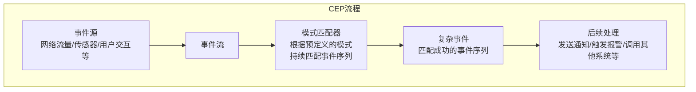
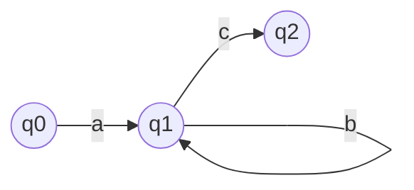
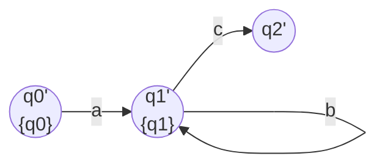

# Flink CEP原理与代码实例讲解

## 1. 背景介绍

### 1.1 问题的由来

在当今快速发展的数字时代，实时数据处理已成为各行业的关键需求。从金融交易、网络安全到物联网监控,都需要对大量持续产生的数据进行实时分析和处理。然而,传统的数据处理系统往往无法满足这种实时性和低延迟的要求,因为它们主要专注于批量处理静态数据集。

为了解决这一问题,复杂事件处理(Complex Event Processing, CEP)应运而生。CEP旨在从大量动态数据流中识别出有意义的事件模式,并对这些模式采取相应的操作。它能够实时检测和响应各种复杂的事件序列,例如网络入侵尝试、金融欺诈行为、设备故障等。

### 1.2 研究现状

目前,已有多种CEP系统和框架被广泛应用,如Apache Flink、Apache Spark Streaming、Apache Storm等。其中,Apache Flink凭借其低延迟、高吞吐量和容错性,成为流行的分布式流处理框架之一。Flink CEP作为Flink的核心模块,提供了一种声明式的API,允许开发人员使用类似SQL的模式匹配语言来定义复杂事件。

然而,尽管Flink CEP提供了强大的功能,但对于初学者来说,掌握其核心概念和使用方法仍然具有一定挑战性。许多开发人员对CEP的原理、算法和实现细节缺乏深入理解,这可能导致他们难以充分利用Flink CEP的潜力。

### 1.3 研究意义

本文旨在深入探讨Flink CEP的核心原理和实现细节,并通过代码示例和实际案例分析,帮助读者全面掌握Flink CEP的使用方法。通过对CEP概念、算法、数学模型和实践经验的深入剖析,读者将能够:

1. 理解CEP的基本概念和工作原理
2. 掌握Flink CEP的核心算法和数学模型
3. 学习如何使用Flink CEP进行复杂事件处理
4. 了解Flink CEP在实际应用场景中的实践经验
5. 获取CEP相关的学习资源和开发工具推荐

通过本文的学习,读者将能够更好地把握Flink CEP的本质,提高开发效率,并为未来的实时数据处理项目做好准备。

### 1.4 本文结构

本文将按照以下结构进行阐述:

1. 背景介绍
2. 核心概念与联系
3. 核心算法原理与具体操作步骤
4. 数学模型和公式详细讲解与举例说明
5. 项目实践:代码实例和详细解释说明
6. 实际应用场景
7. 工具和资源推荐
8. 总结:未来发展趋势与挑战
9. 附录:常见问题与解答

## 2. 核心概念与联系

在深入探讨Flink CEP的原理和实现之前,我们需要先了解一些核心概念。这些概念不仅构成了CEP的基础,也是相互关联的。理解它们及其联系对于掌握CEP至关重要。

### 2.1 事件(Event)

在CEP中,事件是指发生在特定时间点的一个原子操作或状态变化。事件可以来自各种来源,如网络流量、传感器读数、用户交互等。每个事件通常包含以下几个基本属性:

- 事件类型(Type):用于标识事件的类别或含义。
- 事件时间(Timestamp):记录事件发生的时间戳。
- 事件数据(Data):事件携带的具体信息或负载。

事件是CEP处理的基本单元,CEP系统需要持续消费和处理这些事件流。

### 2.2 模式(Pattern)

模式是CEP中的核心概念之一。它定义了一系列需要检测的有序或无序事件序列,并指定了这些事件之间的条件和约束关系。模式可以用不同的语言或API来描述,如Flink CEP中的模式流(Pattern Stream)DSL。

一个简单的模式示例如下:

```
START -> A -> B -> C
```

这个模式表示,CEP系统需要检测事件流中的"A事件"后紧跟"B事件",再紧跟"C事件"的序列。只有当所有事件按照指定顺序出现时,才会被视为匹配该模式。

模式可以包含各种条件和约束,如事件类型、事件数据、时间窗口等,使得它们能够表达复杂的业务逻辑和规则。

### 2.3 复杂事件(Complex Event)

当一个模式被事件流中的事件序列成功匹配时,CEP系统就会生成一个复杂事件。复杂事件本质上是对原始事件流的高级抽象和聚合,它代表了一个更有意义的情况或状态。

复杂事件可以包含匹配到的原始事件数据,也可以携带额外的元数据,如匹配时间、规则名称等。CEP系统通常会对这些复杂事件执行进一步的处理操作,如发送通知、触发报警或调用其他系统。

### 2.4 CEP流程概览

现在,让我们来看一下CEP的整体流程是如何运作的:



1. 事件源持续产生原始事件,形成事件流。
2. 事件流被送入CEP系统的模式匹配器模块。
3. 模式匹配器根据预定义的模式,持续扫描事件流,尝试匹配出符合条件的事件序列。
4. 一旦发现匹配的事件序列,模式匹配器就会生成一个复杂事件。
5. 复杂事件可以被进一步处理,如发送通知、触发报警或调用其他系统执行相应的操作。

通过这个流程,CEP系统能够实时监控和检测事件流中的重要模式,并快速作出响应,从而满足各种实时数据处理需求。

## 3. 核心算法原理与具体操作步骤

在上一节中,我们介绍了CEP的核心概念及其相互关系。现在,让我们深入探讨Flink CEP的核心算法原理和具体操作步骤。

### 3.1 算法原理概述

Flink CEP的核心算法是一种基于有限状态机(Finite State Machine, FSM)的模式匹配算法。它将预定义的模式表示为一个状态机,并使用这个状态机来持续扫描事件流,判断事件序列是否与模式相匹配。

这个算法的工作原理可以概括为以下几个步骤:

1. **模式编译**: 将用户定义的模式编译为一个非确定有限状态自动机(Non-deterministic Finite Automaton, NFA)。
2. **NFA到DFA的转换**: 将NFA转换为确定有限状态自动机(Deterministic Finite Automaton, DFA),以提高匹配效率。
3. **状态机遍历**: 使用DFA持续扫描事件流,根据当前状态和输入事件进行状态转移。
4. **匹配检测**: 当达到DFA的终止状态时,表示找到一个匹配的事件序列,生成相应的复杂事件。
5. **状态维护**: 维护状态机的当前状态,以便在下一个事件到来时继续匹配过程。

这种基于状态机的算法具有以下优点:

- 高效性: DFA能够以线性时间复杂度匹配事件序列,保证了高效的模式匹配。
- 准确性: 状态机能够精确地表示和匹配复杂的事件模式,包括顺序、时间约束等条件。
- 可扩展性: 算法可以处理各种类型的事件模式,包括有序、无序、负模式等。

接下来,我们将详细讨论这个算法的具体操作步骤。

### 3.2 算法步骤详解

#### 3.2.1 模式编译

在模式编译阶段,Flink CEP会将用户定义的模式表达式转换为一个NFA。这个NFA是一个5元组:

$$
NFA = (Q, \Sigma, \delta, q_0, F)
$$

其中:

- $Q$ 是状态集合
- $\Sigma$ 是输入符号集合(即事件类型集合)
- $\delta$ 是状态转移函数,定义了在给定当前状态和输入符号时,应该转移到哪个状态
- $q_0$ 是初始状态
- $F$ 是终止状态集合

以下是一个简单的模式及其对应的NFA示例:

```
模式: a b+ c?
```



在这个NFA中:

- 状态集合 $Q = \{q_0, q_1, q_2\}$
- 输入符号集合 $\Sigma = \{a, b, c\}$
- 初始状态 $q_0$
- 终止状态集合 $F = \{q_2\}$

状态转移函数 $\delta$ 定义了如下转移规则:

- $\delta(q_0, a) = q_1$
- $\delta(q_1, b) = q_1$
- $\delta(q_1, c) = q_2$

这个NFA能够匹配模式"a b+ c?"中的任何有效事件序列,如"a b c"、"a b b c"、"a b b b"等。

#### 3.2.2 NFA到DFA的转换

虽然NFA能够精确地表示事件模式,但它的匹配效率较低,因为在每个状态下,它可能需要同时考虑多个可能的转移路径。为了提高匹配效率,Flink CEP会将NFA转换为等价的DFA。

DFA与NFA的主要区别在于,对于给定的当前状态和输入符号,DFA的状态转移是确定的,只有一条转移路径。这种确定性使得DFA能够以线性时间复杂度匹配事件序列。

DFA转换过程使用了子集构造算法,该算法将NFA的每个状态集合视为DFA的一个状态。转换后的DFA为一个5元组:

$$
DFA = (Q', \Sigma, \delta', q_0', F')
$$

其中:

- $Q'$ 是新的状态集合,每个状态都是NFA状态的子集
- $\Sigma$ 是输入符号集合(与NFA相同)
- $\delta'$ 是新的状态转移函数
- $q_0'$ 是新的初始状态,包含NFA初始状态 $q_0$
- $F'$ 是新的终止状态集合,包含NFA终止状态集合 $F$ 的子集

以上一节的NFA为例,转换后的DFA如下:



在这个DFA中:

- 状态集合 $Q' = \{\{q_0\}, \{q_1\}, \{q_2\}\}$
- 输入符号集合 $\Sigma = \{a, b, c\}$
- 初始状态 $q_0' = \{q_0\}$
- 终止状态集合 $F' = \{\{q_2\}\}$

状态转移函数 $\delta'$ 定义了如下转移规则:

- $\delta'(\{q_0\}, a) = \{q_1\}$
- $\delta'(\{q_1\}, b) = \{q_1\}$
- $\delta'(\{q_1\}, c) = \{q_2\}$

可以看出,这个DFA与原始NFA是等价的,但它的状态转移是确定的,从而提高了匹配效率。

#### 3.2.3 状态机遍历和匹配检测

在完成模式编译