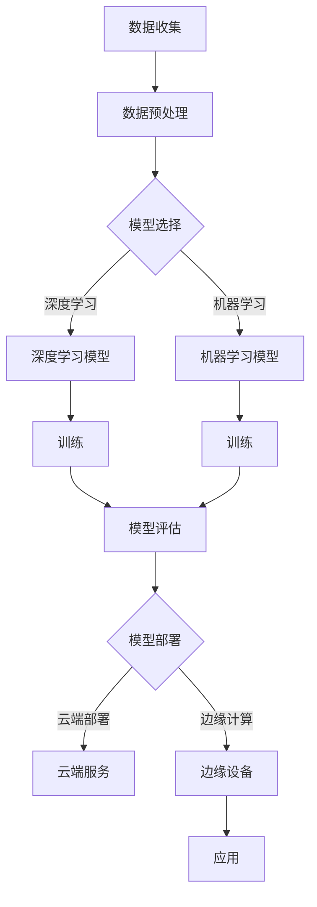

> 人工智能，机器学习，深度学习，自然语言处理，自动驾驶，强化学习，未来趋势

# Andrej Karpathy：人工智能的未来发展方向

### 1. 背景介绍

人工智能（AI）作为计算机科学的一个分支，已经经历了数十年的发展。从早期的规则推理系统到现代的深度学习模型，AI技术已经取得了显著的进步。Andrej Karpathy，作为OpenAI的早期成员和特斯拉AI项目负责人，他的工作在AI领域产生了深远的影响。本文将探讨Andrej Karpathy对人工智能未来发展方向的观点和见解。

### 2. 核心概念与联系

#### 2.1 Mermaid 流程图



#### 2.2 核心概念

- **数据收集**：AI系统的基础是数据，无论是训练模型还是进行实时决策，都需要高质量的数据。
- **数据预处理**：原始数据往往需要清洗、格式化等预处理步骤，以便模型训练。
- **模型选择**：根据具体任务选择合适的模型架构，如深度学习或机器学习模型。
- **训练**：使用标记数据对模型进行训练，调整模型参数以优化性能。
- **模型评估**：在独立的测试集上评估模型性能，确保模型的泛化能力。
- **模型部署**：将训练好的模型部署到云端或边缘设备，用于实际应用。
- **应用**：AI模型在实际场景中的应用，如自动驾驶、自然语言处理等。

### 3. 核心算法原理 & 具体操作步骤

#### 3.1 算法原理概述

AI系统的核心是算法，其中深度学习是最受欢迎的方法之一。深度学习通过多层神经网络模拟人脑的学习过程，能够从大量数据中学习复杂的模式。

#### 3.2 算法步骤详解

1. **数据收集**：收集相关领域的海量数据，如图片、文本、语音等。
2. **数据预处理**：清洗数据，去除噪声，进行数据增强等。
3. **模型选择**：根据任务需求选择合适的深度学习模型，如卷积神经网络（CNN）、循环神经网络（RNN）或Transformer。
4. **模型训练**：使用标注数据进行模型训练，调整模型参数。
5. **模型评估**：在独立的测试集上评估模型性能，调整模型结构或参数。
6. **模型部署**：将模型部署到云端或边缘设备，用于实际应用。
7. **应用反馈**：收集应用中的反馈数据，用于模型优化和迭代。

#### 3.3 算法优缺点

**优点**：

- **强大学习能力**：能够从大量数据中学习复杂的模式。
- **泛化能力强**：能够将学到的知识应用于新的任务和数据。
- **自动特征提取**：能够自动提取数据中的特征，无需人工设计。

**缺点**：

- **数据需求量大**：需要大量的标注数据进行训练。
- **计算资源需求高**：训练过程需要大量的计算资源。
- **可解释性差**：模型的决策过程往往缺乏可解释性。

#### 3.4 算法应用领域

- **自然语言处理**：如机器翻译、情感分析、文本摘要等。
- **计算机视觉**：如图像识别、物体检测、图像生成等。
- **语音识别**：如语音转文本、语音合成等。
- **自动驾驶**：如车辆检测、车道线检测、障碍物检测等。

### 4. 数学模型和公式 & 详细讲解 & 举例说明

#### 4.1 数学模型构建

深度学习模型通常基于以下数学模型：

- **线性代数**：用于表示数据和处理矩阵运算。
- **概率论和统计学**：用于模型训练和评估。
- **微积分**：用于优化模型参数。

#### 4.2 公式推导过程

以下是一个简单的线性回归模型公式：

$$
y = \theta_0 + \theta_1x_1 + \theta_2x_2 + \ldots + \theta_nx_n
$$

其中，$y$ 是预测值，$x_1, x_2, \ldots, x_n$ 是输入特征，$\theta_0, \theta_1, \ldots, \theta_n$ 是模型参数。

#### 4.3 案例分析与讲解

以下是一个简单的神经网络模型示例：

- **输入层**：接收输入特征。
- **隐藏层**：使用激活函数对输入特征进行处理。
- **输出层**：输出预测值。

该模型的公式可以表示为：

$$
h = f(W \cdot x + b)
$$

其中，$h$ 是隐藏层的输出，$W$ 是权重矩阵，$x$ 是输入特征，$b$ 是偏置项，$f$ 是激活函数。

### 5. 项目实践：代码实例和详细解释说明

#### 5.1 开发环境搭建

1. 安装Python和必要的库，如NumPy、TensorFlow或PyTorch。
2. 准备训练数据集和测试数据集。

#### 5.2 源代码详细实现

以下是一个简单的线性回归模型实现：

```python
import numpy as np

class LinearRegression:
    def __init__(self):
        self.weights = None
        self.bias = None

    def fit(self, X, y):
        X = np.hstack((np.ones((X.shape[0], 1)), X))
        self.weights = np.linalg.inv(X.T @ X) @ X.T @ y
        self.bias = y - X @ self.weights

    def predict(self, X):
        X = np.hstack((np.ones((X.shape[0], 1)), X))
        return X @ self.weights + self.bias
```

#### 5.3 代码解读与分析

- `__init__` 方法：初始化模型的权重和偏置。
- `fit` 方法：使用最小二乘法训练模型参数。
- `predict` 方法：使用训练好的模型进行预测。

#### 5.4 运行结果展示

```python
# 创建数据集
X = np.array([[1, 1], [1, 2], [1, 3]])
y = np.dot(X, np.array([1, 2])) + 3

# 创建模型
model = LinearRegression()

# 训练模型
model.fit(X, y)

# 预测
print(model.predict(np.array([[1, 1]])))
```

### 6. 实际应用场景

#### 6.1 自动驾驶

自动驾驶是AI技术的典型应用场景。通过使用深度学习技术，如CNN和RNN，自动驾驶系统可以识别道路标志、车辆、行人等，并做出相应的驾驶决策。

#### 6.2 自然语言处理

自然语言处理（NLP）是AI的另一个重要应用领域。通过使用Transformer等模型，NLP系统可以自动翻译语言、生成文本摘要、进行情感分析等。

### 7. 工具和资源推荐

#### 7.1 学习资源推荐

- 《深度学习》 - Goodfellow, Bengio, Courville
- 《Python机器学习》 - Sebastian Raschka
- TensorFlow官方文档
- PyTorch官方文档

#### 7.2 开发工具推荐

- TensorFlow
- PyTorch
- Jupyter Notebook

#### 7.3 相关论文推荐

- "A Guide to Vector Embeddings for NLP" - William Turczyk
- "Attention is All You Need" - Vaswani et al.
- "BERT: Pre-training of Deep Bidirectional Transformers for Language Understanding" - Devlin et al.

### 8. 总结：未来发展趋势与挑战

#### 8.1 研究成果总结

AI技术在过去几十年取得了巨大的进步，从简单的规则推理到复杂的深度学习模型，AI系统已经能够完成各种复杂的任务。

#### 8.2 未来发展趋势

- **更强大的模型**：随着计算能力的提升，AI模型将变得更加复杂和强大。
- **更广泛的应用**：AI技术将应用于更多领域，如医疗、金融、教育等。
- **更可解释的模型**：开发可解释的AI模型，提高模型的透明度和可靠性。

#### 8.3 面临的挑战

- **数据隐私**：如何保护用户数据隐私是一个重要挑战。
- **算法偏见**：如何消除算法偏见，避免歧视是一个重要问题。
- **计算资源**：训练复杂的AI模型需要大量的计算资源。

#### 8.4 研究展望

AI技术将继续发展，未来将会有更多创新的应用出现。同时，我们也需要关注AI技术的伦理和社会影响，确保AI技术能够造福人类社会。

### 9. 附录：常见问题与解答

**Q1：什么是深度学习？**

A：深度学习是一种模拟人脑神经网络的学习方法，通过多层神经网络对数据进行学习，能够从大量数据中学习复杂的模式。

**Q2：什么是机器学习？**

A：机器学习是一种使计算机能够从数据中学习并做出决策或预测的方法。

**Q3：深度学习与机器学习的区别是什么？**

A：深度学习是机器学习的一个分支，它使用多层神经网络来学习数据中的复杂模式。

**Q4：AI技术有哪些应用？**

A：AI技术广泛应用于医疗、金融、教育、交通、娱乐等领域。

**Q5：AI技术有哪些挑战？**

A：AI技术面临的挑战包括数据隐私、算法偏见、计算资源等。

作者：禅与计算机程序设计艺术 / Zen and the Art of Computer Programming