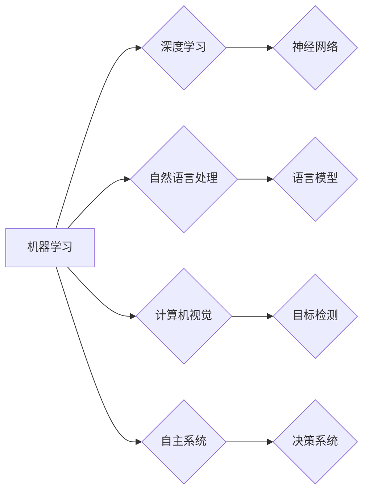

# Andrej Karpathy：人工智能的未来发展趋势

> 关键词：人工智能，未来趋势，深度学习，机器学习，自然语言处理，计算机视觉，自主系统

## 1. 背景介绍

人工智能（AI）作为计算机科学的一个分支，正迅速改变着我们的世界。从自动驾驶汽车到智能助手，从医疗诊断到金融分析，AI技术的应用已经渗透到我们生活的方方面面。Andrej Karpathy，作为一位杰出的AI研究者和工程师，对AI的未来发展趋势有着深刻的洞察。本文将基于Karpathy的观点，探讨人工智能的未来发展趋势。

## 2. 核心概念与联系

### 2.1 AI的核心概念

人工智能的核心概念可以概括为以下几点：

- **机器学习**：机器学习是AI的核心技术之一，它使计算机系统能够从数据中学习并做出决策。
- **深度学习**：深度学习是机器学习的一个子集，它通过模拟人脑神经网络的结构和功能，在图像识别、语音识别等领域取得了显著的成果。
- **自然语言处理（NLP）**：自然语言处理是AI的一个分支，它使计算机能够理解和处理人类语言。
- **计算机视觉**：计算机视觉是AI的另一个分支，它使计算机能够从图像和视频中提取信息。
- **自主系统**：自主系统是指能够自主执行任务的系统，如自动驾驶汽车和无人机。

### 2.2 Mermaid流程图

以下是一个简单的Mermaid流程图，展示了AI的核心概念及其相互关系：



## 3. 核心算法原理 & 具体操作步骤

### 3.1 算法原理概述

AI的核心算法主要包括以下几种：

- **神经网络**：神经网络是一种模拟人脑神经元连接的模型，通过学习数据中的模式来做出决策。
- **递归神经网络（RNN）**：递归神经网络是一种处理序列数据的神经网络，如语言模型和语音识别。
- **卷积神经网络（CNN）**：卷积神经网络是一种用于图像识别和处理的神经网络。
- **生成对抗网络（GAN）**：生成对抗网络由生成器和判别器组成，用于生成新的数据样本。

### 3.2 算法步骤详解

以下是AI算法的一般步骤：

1. **数据收集**：收集用于训练和测试的数据。
2. **数据预处理**：清洗和预处理数据，使其适合模型训练。
3. **模型选择**：选择合适的模型架构。
4. **模型训练**：使用训练数据训练模型。
5. **模型评估**：使用测试数据评估模型性能。
6. **模型优化**：根据评估结果优化模型参数。

### 3.3 算法优缺点

- **优点**：AI算法能够处理复杂的数据，并自动学习数据中的模式。
- **缺点**：AI算法通常需要大量的数据来训练，且难以解释其决策过程。

### 3.4 算法应用领域

AI算法在以下领域得到了广泛应用：

- **图像识别**：如人脸识别、物体检测。
- **语音识别**：如语音助手、语音翻译。
- **自然语言处理**：如机器翻译、情感分析。
- **自动驾驶**：如车辆检测、路径规划。

## 4. 数学模型和公式 & 详细讲解 & 举例说明

### 4.1 数学模型构建

AI的数学模型主要包括以下几种：

- **损失函数**：损失函数用于衡量模型预测结果与真实值之间的差异。
- **优化算法**：优化算法用于调整模型参数，以最小化损失函数。
- **激活函数**：激活函数用于引入非线性，使模型能够学习更复杂的模式。

### 4.2 公式推导过程

以下是一个简单的神经网络损失函数的推导过程：

$$
L(\theta) = \frac{1}{2} \sum_{i=1}^{n} (y_i - \hat{y}_i)^2
$$

其中，$y_i$ 是真实值，$\hat{y}_i$ 是模型的预测值。

### 4.3 案例分析与讲解

以下是一个简单的神经网络分类问题的实例：

假设我们有一个简单的神经网络，包含一个输入层、一个隐藏层和一个输出层。输入层有3个神经元，隐藏层有2个神经元，输出层有2个神经元。我们使用softmax函数作为输出层的激活函数。

输入层到隐藏层的权重矩阵为 $W_1$，隐藏层到输出层的权重矩阵为 $W_2$，偏置向量分别为 $b_1$ 和 $b_2$。

给定一个输入样本 $x$，网络的前向传播过程如下：

$$
h = \sigma(W_1x + b_1)
$$

$$
\hat{y} = \sigma(W_2h + b_2)
$$

其中，$\sigma$ 是sigmoid函数。

## 5. 项目实践：代码实例和详细解释说明

### 5.1 开发环境搭建

为了进行AI项目的实践，你需要以下开发环境：

- 操作系统：Linux或MacOS
- 编程语言：Python
- 深度学习框架：TensorFlow或PyTorch

### 5.2 源代码详细实现

以下是一个简单的神经网络分类器的Python代码实现：

```python
import numpy as np
from sklearn.datasets import load_iris
from sklearn.model_selection import train_test_split
from sklearn.metrics import accuracy_score
from tensorflow.keras.models import Sequential
from tensorflow.keras.layers import Dense, Dropout

# 加载数据
data = load_iris()
X = data.data
y = data.target

# 分割数据集
X_train, X_test, y_train, y_test = train_test_split(X, y, test_size=0.2, random_state=42)

# 构建模型
model = Sequential([
    Dense(64, activation='relu', input_shape=(X_train.shape[1],)),
    Dropout(0.5),
    Dense(32, activation='relu'),
    Dropout(0.5),
    Dense(2, activation='softmax')
])

# 编译模型
model.compile(optimizer='adam', loss='sparse_categorical_crossentropy', metrics=['accuracy'])

# 训练模型
model.fit(X_train, y_train, epochs=10, validation_split=0.1)

# 评估模型
y_pred = model.predict(X_test)
y_pred_labels = np.argmax(y_pred, axis=1)
accuracy = accuracy_score(y_test, y_pred_labels)
print(f"Accuracy: {accuracy:.2f}")
```

### 5.3 代码解读与分析

这段代码首先从sklearn库中加载了Iris数据集，并对其进行分割。然后，使用TensorFlow的Sequential模型构建了一个简单的神经网络，包含两个隐藏层和两个Dropout层。接着，编译和训练模型，并在测试集上评估模型性能。

## 6. 实际应用场景

AI技术在以下场景中得到了广泛应用：

- **医疗诊断**：AI可以辅助医生进行疾病诊断，提高诊断准确性和效率。
- **金融服务**：AI可以用于风险评估、欺诈检测和投资建议。
- **自动驾驶**：AI可以用于车辆控制、环境感知和决策制定。
- **智能家居**：AI可以用于智能家居系统的控制和管理。

### 6.4 未来应用展望

AI技术的未来应用将更加广泛，以下是一些可能的趋势：

- **更智能的机器人**：机器人将能够更好地理解和响应人类指令，执行更复杂的任务。
- **个性化服务**：AI将能够根据用户的行为和偏好提供个性化服务。
- **自动化决策**：AI将能够自动化许多决策过程，提高效率和准确性。
- **新的商业模式**：AI将创造新的商业模式，改变我们的工作和生活方式。

## 7. 工具和资源推荐

### 7.1 学习资源推荐

- 《深度学习》（Ian Goodfellow、Yoshua Bengio、Aaron Courville 著）
- 《Python机器学习》（Sebastian Raschka 著）
- Coursera上的《机器学习》课程（Andrew Ng 著）

### 7.2 开发工具推荐

- TensorFlow
- PyTorch
- Keras
- Jupyter Notebook

### 7.3 相关论文推荐

- "ImageNet Classification with Deep Convolutional Neural Networks"（Alex Krizhevsky、Ilya Sutskever、Geoffrey Hinton）
- "A Neural Turing Machine"（Christopher J. Hesse、Ian Goodfellow）
- "Generative Adversarial Nets"（Ian Goodfellow、Jean Pouget-Abadie、Mehdi Mirza、Bing Xu、David Warde-Farley、Sherjil Ozair、Aaron Courville）

## 8. 总结：未来发展趋势与挑战

### 8.1 研究成果总结

本文基于Andrej Karpathy的观点，探讨了人工智能的未来发展趋势。AI技术正在迅速发展，并将在未来几十年内改变我们的世界。深度学习、自然语言处理、计算机视觉等领域取得了显著的成果，AI的应用场景也将越来越广泛。

### 8.2 未来发展趋势

- AI技术将更加通用和智能化。
- AI将与人类更加紧密地协作。
- AI将在更多领域得到应用。

### 8.3 面临的挑战

- AI技术的可解释性。
- AI技术的安全性和伦理问题。
- AI技术的公平性和透明度。

### 8.4 研究展望

未来的AI研究需要关注以下方面：

- 开发更加可解释、可信赖的AI系统。
- 确保AI技术的安全性和伦理性。
- 提高AI技术的公平性和透明度。
- 探索AI技术在更多领域的应用。

## 9. 附录：常见问题与解答

**Q1：AI技术是否能够完全取代人类？**

A：AI技术可以辅助人类完成许多任务，但它们不能完全取代人类。人类具有创造力、情感和道德判断能力，这些是目前AI无法完全复制的。

**Q2：AI技术的未来发展趋势是什么？**

A：AI技术的未来发展趋势包括更加通用和智能化、与人类更加紧密地协作、在更多领域得到应用。

**Q3：AI技术的挑战有哪些？**

A：AI技术的挑战包括可解释性、安全性和伦理问题、公平性和透明度。

**Q4：如何学习AI技术？**

A：学习AI技术可以通过阅读相关书籍、参加在线课程、参与项目实践等方式。

---

作者：禅与计算机程序设计艺术 / Zen and the Art of Computer Programming