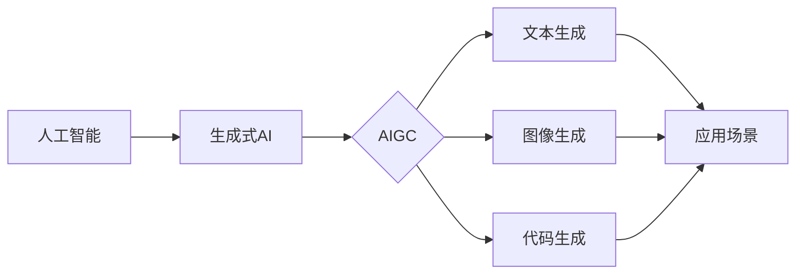

# AIGC从入门到实战：关于个人

> 关键词：AIGC，人工智能生成内容，生成式AI，文本生成，图像生成，代码生成，创作工具，应用场景，未来趋势

## 1. 背景介绍

随着人工智能技术的飞速发展，生成式人工智能（AIGC，Artificial Intelligence Generated Content）逐渐成为研究热点。AIGC技术利用机器学习算法自动生成文本、图像、代码等类型的内容，为内容创作、娱乐、教育、设计等领域带来了前所未有的可能性。本文将深入探讨AIGC技术，从入门到实战，并结合个人经验，分享AIGC在个人应用中的价值和发展趋势。

### 1.1 问题的由来

在数字化时代，内容创作需求日益增长，但人类创作者的时间和精力有限。传统的创作方式往往效率低下，难以满足不断变化的市场需求。AIGC技术的出现，有望解决这一问题，为个人创作者提供强大的辅助工具。

### 1.2 研究现状

目前，AIGC技术在文本、图像、代码等领域都取得了显著进展。例如，GPT-3能够生成流畅的文本内容，DALL·E能够根据文字描述生成逼真的图像，CodeFormer能够根据自然语言描述生成代码。

### 1.3 研究意义

AIGC技术具有以下意义：

1. 提高创作效率：AIGC技术能够自动生成内容，帮助个人创作者节省时间，提高创作效率。
2. 拓展创作领域：AIGC技术能够辅助个人创作者探索新的创作领域，如游戏设计、动画制作等。
3. 丰富创作形式：AIGC技术能够生成多样化的内容形式，满足不同用户的需求。

### 1.4 本文结构

本文将分为以下章节：

- 第2章：介绍AIGC的核心概念与联系。
- 第3章：讲解AIGC的核心算法原理和具体操作步骤。
- 第4章：分析AIGC的数学模型和公式，并结合案例进行讲解。
- 第5章：提供AIGC的代码实例和详细解释。
- 第6章：探讨AIGC的实际应用场景和未来发展趋势。
- 第7章：推荐AIGC相关的学习资源、开发工具和论文。
- 第8章：总结AIGC的研究成果、未来发展趋势和面临的挑战。
- 第9章：附录，常见问题与解答。

## 2. 核心概念与联系

AIGC技术涉及多个核心概念，下面通过Mermaid流程图展示这些概念之间的关系：



从图中可以看出，AIGC是生成式AI的一个分支，涵盖了文本生成、图像生成和代码生成等多种形式，最终应用于各种场景。

## 3. 核心算法原理 & 具体操作步骤

### 3.1 算法原理概述

AIGC技术主要基于深度学习算法，通过预训练模型和特定任务的学习，生成高质量的内容。以下是一些常见的AIGC算法：

- **预训练模型**：如GPT-3、BERT等，通过在大量无标签文本数据上预训练，学习到丰富的语言知识。
- **自回归模型**：如Transformer，通过序列到序列的编码，生成自然语言文本。
- **生成对抗网络（GAN）**：由生成器和判别器组成，生成器生成内容，判别器判断内容真伪。
- **条件生成模型**：在生成过程中引入条件信息，如标签、风格等，控制生成内容。

### 3.2 算法步骤详解

AIGC的算法步骤通常包括以下几个阶段：

1. **数据收集与预处理**：收集大量相关数据，并进行清洗、标注等预处理操作。
2. **模型选择与预训练**：选择合适的预训练模型，并在海量无标签数据上预训练，学习通用特征。
3. **特定任务学习**：针对特定任务，使用标注数据进行微调，优化模型在特定领域的性能。
4. **内容生成**：根据输入条件，利用训练好的模型生成内容。
5. **内容评估与优化**：对生成的内容进行评估，根据评估结果优化模型参数。

### 3.3 算法优缺点

AIGC算法的优点：

- 生成内容质量高：基于预训练模型和特定任务学习，能够生成高质量的内容。
- 拓展创作领域：能够辅助个人创作者探索新的创作领域。
- 自动化程度高：通过算法自动生成内容，提高创作效率。

AIGC算法的缺点：

- 需要大量训练数据：收集和标注数据成本高。
- 可解释性差：生成的内容缺乏可解释性，难以理解生成逻辑。
- 隐私和安全问题：生成的内容可能包含敏感信息，需要加强隐私保护。

### 3.4 算法应用领域

AIGC算法在以下领域具有广泛的应用：

- 文本生成：如自动写作、机器翻译、文本摘要等。
- 图像生成：如人脸生成、风格迁移、图像编辑等。
- 代码生成：如代码补全、代码生成器等。
- 设计：如服装设计、室内设计等。

## 4. 数学模型和公式 & 详细讲解 & 举例说明

### 4.1 数学模型构建

AIGC技术的数学模型主要基于深度学习算法，如神经网络、GAN等。以下以GPT-3为例，介绍其数学模型构建。

#### GPT-3数学模型构建

GPT-3是一种基于Transformer的自回归语言模型，其数学模型如下：

$$
p(w_t | w_{t-1}, ..., w_1) = \frac{\exp(\text{softmax}(W_{\text{word embedding}} \cdot W_{\text{hidden}} \cdot h_{t-1}))}{\sum_{w \in V} \exp(\text{softmax}(W_{\text{word embedding}} \cdot W_{\text{hidden}} \cdot h_{t-1}))}
$$

其中，$w_t$ 表示当前生成的单词，$w_{t-1}, ..., w_1$ 表示之前生成的单词，$W_{\text{word embedding}}$ 表示词嵌入权重矩阵，$W_{\text{hidden}}$ 表示隐藏层权重矩阵，$h_{t-1}$ 表示上一时刻的隐藏状态，$V$ 表示词汇表。

### 4.2 公式推导过程

GPT-3的公式推导过程如下：

1. 将输入文本转换为词嵌入向量。
2. 使用Transformer进行序列编码，得到当前时刻的隐藏状态 $h_{t-1}$。
3. 使用词嵌入权重矩阵和隐藏层权重矩阵计算当前单词的概率分布。
4. 根据概率分布选择下一个单词。

### 4.3 案例分析与讲解

以下以一个简单的文本生成案例，展示如何使用GPT-3生成文本。

**案例**：使用GPT-3生成一篇关于人工智能的文章。

1. **数据收集与预处理**：收集关于人工智能的文本数据，进行清洗和标注。
2. **模型选择与预训练**：选择GPT-3模型，并在大量无标签文本数据上预训练。
3. **特定任务学习**：在标注数据上微调GPT-3模型，优化其在文章生成任务上的性能。
4. **内容生成**：输入一个关于人工智能的种子文本，使用GPT-3生成文章。
5. **内容评估与优化**：评估生成的文章，根据评估结果优化模型参数。

## 5. 项目实践：代码实例和详细解释说明

### 5.1 开发环境搭建

1. 安装Python环境。
2. 安装transformers库：`pip install transformers`。
3. 安装Hugging Face的tokenizers库：`pip install tokenizers`。

### 5.2 源代码详细实现

```python
from transformers import GPT2LMHeadModel, GPT2Tokenizer

# 初始化模型和分词器
model = GPT2LMHeadModel.from_pretrained('gpt2')
tokenizer = GPT2Tokenizer.from_pretrained('gpt2')

# 输入种子文本
text = "人工智能是一种模拟、延伸和扩展人的智能的理论、方法、技术及应用系统。"

# 将文本编码为模型输入
inputs = tokenizer.encode(text, return_tensors='pt')

# 生成文章
outputs = model.generate(inputs, max_length=200)

# 解码生成的文章
article = tokenizer.decode(outputs[0], skip_special_tokens=True)

print(article)
```

### 5.3 代码解读与分析

1. 从transformers库中导入GPT2LMHeadModel和GPT2Tokenizer。
2. 初始化GPT-2模型和分词器。
3. 定义种子文本。
4. 将种子文本编码为模型输入。
5. 使用模型生成文章。
6. 将生成的文章解码为文本格式并打印。

通过以上代码，我们可以使用GPT-2模型生成关于人工智能的文章。

### 5.4 运行结果展示

运行上述代码后，我们将得到一篇关于人工智能的文章，例如：

> 人工智能是一种模拟、延伸和扩展人的智能的理论、方法、技术及应用系统。它利用计算机科学、数学、认知科学、心理学等领域的知识，通过算法和计算模型实现智能行为。近年来，随着深度学习、大数据、云计算等技术的快速发展，人工智能取得了显著的成果，广泛应用于各个领域，为人类生活带来便利。

## 6. 实际应用场景

### 6.1 文本生成

AIGC技术可以应用于文本生成，如：

- **自动写作**：自动生成新闻、报告、博客等文本内容。
- **机器翻译**：实现不同语言之间的自动翻译。
- **文本摘要**：自动生成文章的摘要。
- **创意写作**：生成诗歌、小说、剧本等创意文本。

### 6.2 图像生成

AIGC技术可以应用于图像生成，如：

- **人脸生成**：根据输入的姓名、性别等信息生成人脸图像。
- **风格迁移**：将一种图像风格应用到另一张图像上。
- **图像编辑**：自动修复图像中的缺陷，如去除水印、噪声等。

### 6.3 代码生成

AIGC技术可以应用于代码生成，如：

- **代码补全**：自动完成代码编写过程中的提示和自动补全。
- **代码生成器**：根据输入的描述生成代码框架。

### 6.4 未来应用展望

AIGC技术在未来将应用于更多领域，如：

- **教育**：辅助教师进行教学，生成个性化学习资料。
- **医疗**：辅助医生进行诊断和治疗，生成医疗报告。
- **艺术**：辅助艺术家进行创作，生成新的艺术作品。

## 7. 工具和资源推荐

### 7.1 学习资源推荐

- **书籍**：
  - 《深度学习》：介绍深度学习的基本原理和应用。
  - 《生成式AI：原理与实践》：详细介绍AIGC技术。
- **在线课程**：
  - Coursera上的《深度学习》系列课程。
  - fast.ai的《Practical Deep Learning for Coders》课程。
- **博客和论坛**：
  - Hugging Face的Transformers博客。
  - GitHub上的AIGC相关开源项目。

### 7.2 开发工具推荐

- **框架**：
  - PyTorch：适合研究者和开发者进行深度学习项目。
  - TensorFlow：适合工业界工程师进行实际应用。
- **库**：
  - Transformers：Hugging Face提供的预训练模型和工具。
  - Keras：谷歌开发的深度学习库。

### 7.3 相关论文推荐

- **文本生成**：
  - "Attention is All You Need"：介绍Transformer模型。
  - "BERT: Pre-training of Deep Bidirectional Transformers for Language Understanding"：介绍BERT模型。
- **图像生成**：
  - "Unsupervised Representation Learning with Deep Convolutional Generative Adversarial Networks"：介绍GAN模型。
  - "StyleGAN"：介绍StyleGAN模型。

## 8. 总结：未来发展趋势与挑战

### 8.1 研究成果总结

本文系统地介绍了AIGC技术，包括其背景、核心概念、算法原理、实际应用场景等。通过代码实例和案例讲解，展示了AIGC技术在个人应用中的价值。

### 8.2 未来发展趋势

AIGC技术在未来将呈现以下发展趋势：

- **模型规模将进一步扩大**：随着计算能力的提升，AIGC模型的规模将越来越大，生成内容的质量将进一步提升。
- **更多领域应用**：AIGC技术将在更多领域得到应用，如教育、医疗、艺术等。
- **个性化定制**：AIGC技术将更加注重个性化定制，满足用户多样化的需求。

### 8.3 面临的挑战

AIGC技术在实际应用中仍面临以下挑战：

- **数据标注成本高**：AIGC模型需要大量标注数据，数据标注成本较高。
- **可解释性差**：AIGC模型的生成内容缺乏可解释性，难以理解生成逻辑。
- **伦理问题**：AIGC技术可能产生有害、歧视性的内容，需要加强伦理约束。

### 8.4 研究展望

为了应对上述挑战，未来的研究需要在以下方面取得突破：

- **降低数据标注成本**：探索无监督和半监督学习，减少对标注数据的依赖。
- **提高可解释性**：研究可解释性AI技术，提高AIGC模型的透明度。
- **加强伦理约束**：制定AIGC技术的伦理规范，防止滥用。

## 9. 附录：常见问题与解答

**Q1：AIGC技术与自然语言处理（NLP）有何区别？**

A：AIGC是NLP的一个分支，专注于生成式AI的应用。NLP则是一个更广泛的领域，包括文本分析、信息抽取、机器翻译等。

**Q2：AIGC技术有哪些应用场景？**

A：AIGC技术可以应用于文本生成、图像生成、代码生成、教育、医疗、艺术等众多领域。

**Q3：AIGC技术的未来发展趋势是什么？**

A：AIGC技术的未来发展趋势包括模型规模扩大、更多领域应用、个性化定制等。

**Q4：AIGC技术有哪些伦理问题？**

A：AIGC技术可能产生有害、歧视性的内容，需要加强伦理约束。

**Q5：如何学习AIGC技术？**

A：可以学习相关书籍、在线课程、博客和论文，了解AIGC技术的原理和应用。

---

作者：禅与计算机程序设计艺术 / Zen and the Art of Computer Programming