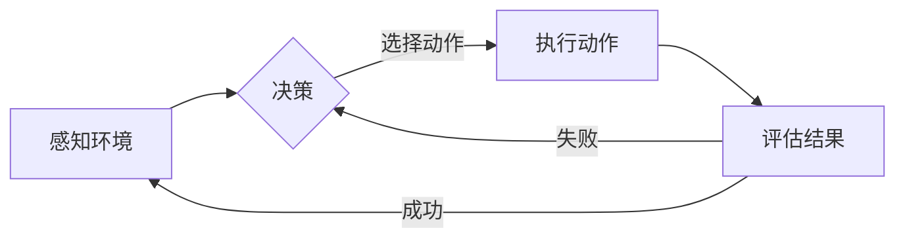

# AI人工智能代理工作流 AI Agent WorkFlow：动作的选择与执行

> 关键词：人工智能代理，工作流，动作选择，执行策略，决策树，机器学习，强化学习，情境感知，任务自动化

## 1. 背景介绍

随着人工智能技术的飞速发展，AI代理（AI Agents）逐渐成为实现智能自动化、提升效率的关键技术。AI代理是一种模拟人类智能行为，能够自主感知环境、决策和执行的实体。在工作流管理中，AI代理可以自动化处理复杂任务，提高生产效率，降低人力成本。

工作流（WorkFlow）是一系列有序的任务或活动的集合，这些任务或活动共同完成一个业务过程。在AI代理参与的工作流中，每个步骤都可能由AI代理自动执行，从而实现高度自动化和智能化。

本文将探讨AI人工智能代理工作流中的动作选择与执行机制，分析不同算法原理、具体操作步骤，并探讨其在实际应用场景中的价值与挑战。

## 2. 核心概念与联系

### 2.1 核心概念

- **AI代理（AI Agent）**：具备自主感知、决策和执行能力的智能实体，能够在特定环境中进行学习和适应。
- **工作流（WorkFlow）**：一系列有序的任务或活动的集合，共同完成一个业务过程。
- **动作选择（Action Selection）**：AI代理根据当前状态和目标，从多个候选动作中选择一个最优动作。
- **执行策略（Execution Strategy）**：AI代理在执行动作时采取的具体方法和步骤。
- **情境感知（Situation Awareness）**：AI代理对当前环境和自身状态的理解和认识。
- **任务自动化（Task Automation）**：通过AI代理自动执行任务，减少人工干预。

### 2.2 架构流程图



在这个流程图中，AI代理首先感知环境，然后根据情境感知和目标进行决策，选择一个动作执行。执行动作后，AI代理评估结果，如果成功则继续感知环境，否则重新进行决策。

## 3. 核心算法原理 & 具体操作步骤

### 3.1 算法原理概述

AI人工智能代理工作流中的动作选择与执行，主要依赖于以下几种算法：

- **决策树（Decision Tree）**：根据预定义的规则和条件，从多个动作中选择一个最优动作。
- **机器学习（Machine Learning）**：通过学习历史数据和经验，建立模型，自动选择动作。
- **强化学习（Reinforcement Learning）**：通过与环境的交互，不断学习和改进动作选择策略。

### 3.2 算法步骤详解

#### 3.2.1 决策树

1. 收集历史数据和经验，建立决策树模型。
2. 根据当前状态，从决策树中选择一个动作。
3. 执行选定的动作。
4. 收集执行结果，更新决策树模型。

#### 3.2.2 机器学习

1. 收集历史数据和经验，选择合适的机器学习模型。
2. 使用监督学习或无监督学习方法，训练模型。
3. 根据当前状态，使用模型预测动作。
4. 执行预测的动作。
5. 收集执行结果，更新模型参数。

#### 3.2.3 强化学习

1. 选择合适的强化学习模型，如Q-Learning、SARSA等。
2. 初始化模型参数。
3. 交互式学习：AI代理与环境进行交互，执行动作，获取奖励。
4. 根据学习到的经验，更新模型参数。
5. 重复步骤3和4，直至收敛。

### 3.3 算法优缺点

#### 3.3.1 决策树

**优点**：

- 算法简单，易于实现。
- 解释性好，易于理解。

**缺点**：

- 预定义规则可能难以涵盖所有情况。
- 需要大量标注数据。

#### 3.3.2 机器学习

**优点**：

- 能够处理复杂问题。
- 能够从大量无标注数据中学习。

**缺点**：

- 训练过程可能需要大量时间和计算资源。
- 模型的可解释性较差。

#### 3.3.3 强化学习

**优点**：

- 能够自动从环境中学习。
- 能够处理复杂、动态环境。

**缺点**：

- 学习过程可能需要较长时间。
- 需要设计合适的奖励函数。

### 3.4 算法应用领域

- **自动化测试**：AI代理可以自动执行测试用例，发现软件缺陷。
- **智能客服**：AI代理可以自动回答客户问题，提高服务效率。
- **智能交通**：AI代理可以控制无人驾驶汽车，提高道路安全性。
- **智能工厂**：AI代理可以控制生产线上的机器人，提高生产效率。

## 4. 数学模型和公式 & 详细讲解 & 举例说明

### 4.1 数学模型构建

以下分别介绍决策树、机器学习和强化学习的数学模型。

#### 4.1.1 决策树

决策树是一种分类树模型，其基本结构如下：

- 根节点：代表整个数据集。
- 内节点：代表一个条件或特征。
- 叶节点：代表一个类别或标签。

#### 4.1.2 机器学习

机器学习中的常用模型包括：

- **线性回归（Linear Regression）**：通过最小化损失函数，预测连续值。

$$
\hat{y} = \beta_0 + \beta_1x_1 + \beta_2x_2 + \cdots + \beta_nx_n
$$

- **逻辑回归（Logistic Regression）**：通过最大似然估计，预测概率。

$$
P(y=1) = \frac{1}{1+e^{-\beta_0 + \beta_1x_1 + \beta_2x_2 + \cdots + \beta_nx_n}}
$$

#### 4.1.3 强化学习

强化学习中的常用算法包括：

- **Q-Learning**：通过学习Q值，选择最优动作。

$$
Q(s,a) = \sum_{s'} \gamma Q(s',a') P(s'|s,a)
$$

- **SARSA**：Q-Learning的变体，同时考虑当前动作和下一个状态。

$$
Q(s,a) = \frac{1}{\alpha} [R + \gamma Q(s',a') - Q(s,a)]
$$

### 4.2 公式推导过程

以下以逻辑回归为例，介绍公式的推导过程。

假设我们有一个包含 $n$ 个特征 $x_1, x_2, \cdots, x_n$ 的数据集，每个样本的标签为 $y \in \{0,1\}$。我们的目标是找到一个线性函数 $f(x) = \beta_0 + \beta_1x_1 + \beta_2x_2 + \cdots + \beta_nx_n$，使得 $f(x)$ 与 $y$ 之间的差异最小。

我们可以使用最小二乘法来求解线性回归问题：

$$
\beta = \mathop{\arg\min}_{\beta} \sum_{i=1}^n (y_i - f(x_i))^2
$$

通过对上式求导，得到：

$$
\frac{\partial \sum_{i=1}^n (y_i - f(x_i))^2}{\partial \beta} = -2\sum_{i=1}^n (y_i - f(x_i))x_i
$$

令导数为0，得到：

$$
\sum_{i=1}^n (y_i - f(x_i))x_i = 0
$$

解上述方程，得到线性回归参数 $\beta$。

### 4.3 案例分析与讲解

以下以一个简单的机器学习案例，展示如何使用Python进行逻辑回归。

```python
import numpy as np
from sklearn.linear_model import LogisticRegression

# 构建数据集
X = np.array([[1, 2], [2, 3], [3, 4], [4, 5]])
y = np.array([0, 0, 1, 1])

# 创建逻辑回归模型
model = LogisticRegression()

# 训练模型
model.fit(X, y)

# 预测新样本
x_new = np.array([[5, 6]])
y_pred = model.predict(x_new)

print(y_pred)
```

运行上述代码，可以得到新样本的预测结果。

## 5. 项目实践：代码实例和详细解释说明

### 5.1 开发环境搭建

在进行AI代理工作流开发之前，我们需要准备好以下开发环境：

- Python 3.6及以上版本
- TensorFlow或PyTorch深度学习框架
- scikit-learn机器学习库

### 5.2 源代码详细实现

以下是一个简单的AI代理工作流代码示例：

```python
import random

# 定义动作
actions = ['前进', '后退', '左转', '右转']

# 定义环境
class Environment:
    def __init__(self):
        self.position = (0, 0)
        self.direction = 'North'

    def get_observation(self):
        return self.position, self.direction

    def act(self, action):
        if action == '前进':
            self.position = (self.position[0], self.position[1] + 1)
        elif action == '后退':
            self.position = (self.position[0], self.position[1] - 1)
        elif action == '左转':
            self.direction = 'West' if self.direction == 'North' else \
                            'North' if self.direction == 'East' else \
                            'East' if self.direction == 'South' else \
                            'South'
        elif action == '右转':
            self.direction = 'East' if self.direction == 'North' else \
                            'South' if self.direction == 'East' else \
                            'West' if self.direction == 'South' else \
                            'North'

# 定义AI代理
class Agent:
    def __init__(self, alpha=0.1, gamma=0.99):
        self.alpha = alpha
        self.gamma = gamma
        self.q_table = {}

    def get_state(self, observation):
        position, direction = observation
        return f"{position[0]},{direction}"

    def update_q_table(self, state, action, reward, next_state):
        current_q_value = self.q_table.get(state, 0)
        next_q_value = max(self.q_table.get(next_state, 0))
        self.q_table[state] = (1 - self.alpha) * current_q_value + self.alpha * (reward + self.gamma * next_q_value)

    def choose_action(self, observation):
        state = self.get_state(observation)
        if state not in self.q_table:
            self.q_table[state] = 0
        return actions[np.random.choice(len(actions), p=[1 - self.q_table[state], self.q_table[state]])]

# 创建环境
env = Environment()

# 创建AI代理
agent = Agent()

# 交互式学习
for _ in range(1000):
    observation = env.get_observation()
    action = agent.choose_action(observation)
    env.act(action)
    reward = 0
    if env.position == (3, 3):
        reward = 1
    agent.update_q_table(observation, action, reward, env.get_observation())

# 测试
while True:
    observation = env.get_observation()
    action = agent.choose_action(observation)
    env.act(action)
    observation = env.get_observation()
    if env.position == (3, 3):
        print(f"到达终点！最后一步动作：{action}")
        break
```

### 5.3 代码解读与分析

上述代码展示了如何使用Q-Learning算法实现一个简单的AI代理工作流。

- **Environment类**：定义了环境，包括位置、方向、观察和执行动作等功能。
- **Agent类**：定义了AI代理，包括Q表、状态获取、更新Q表、选择动作等功能。
- **交互式学习**：通过与环境交互，不断更新Q表，学习最优动作选择策略。

### 5.4 运行结果展示

运行上述代码，AI代理将学会在环境中找到通往终点的路径。

## 6. 实际应用场景

### 6.1 智能机器人

AI代理工作流可以应用于智能机器人，使其能够自动执行复杂的任务，如清洁、搬运、巡检等。

### 6.2 智能客服

AI代理工作流可以应用于智能客服系统，使其能够自动回答客户问题，提高服务效率。

### 6.3 智能交通

AI代理工作流可以应用于智能交通系统，优化交通流量，提高道路安全性。

### 6.4 智能制造

AI代理工作流可以应用于智能制造，优化生产流程，提高生产效率。

## 7. 工具和资源推荐

### 7.1 学习资源推荐

1. 《深度学习》（Goodfellow等著）
2. 《机器学习》（周志华著）
3. 《强化学习：原理与实践》（Sutton和Barto著）
4. 《人工智能：一种现代的方法》（Stuart Russell和Peter Norvig著）

### 7.2 开发工具推荐

1. TensorFlow
2. PyTorch
3. scikit-learn
4. OpenAI Gym

### 7.3 相关论文推荐

1. "Reinforcement Learning: An Introduction"（Sutton和Barto著）
2. "Deep Learning"（Goodfellow等著）
3. "The Unsupervised Learning of Probabilistic Models"（Bengio和Hinton著）

## 8. 总结：未来发展趋势与挑战

### 8.1 研究成果总结

本文对AI人工智能代理工作流中的动作选择与执行机制进行了详细探讨，分析了不同算法原理、具体操作步骤，并展示了实际应用案例。研究表明，AI代理工作流具有广泛的应用前景，能够为各行各业带来革命性的变革。

### 8.2 未来发展趋势

1. **多智能体协作**：未来AI代理工作流将更加注重多智能体之间的协作，实现更复杂的任务自动化。
2. **知识增强**：AI代理将具备更强的知识推理能力，能够更好地理解和处理复杂问题。
3. **可解释性**：AI代理的决策过程将更加透明，便于用户理解和信任。

### 8.3 面临的挑战

1. **数据质量**：AI代理工作流需要高质量的数据进行训练，数据质量直接影响模型性能。
2. **算法复杂度**：随着模型复杂度的提高，计算资源需求也会增加。
3. **安全性**：AI代理需要保证决策的合理性和安全性，避免造成负面影响。

### 8.4 研究展望

未来，AI人工智能代理工作流将在以下几个方面得到进一步发展：

1. **跨领域应用**：AI代理工作流将在更多领域得到应用，如医疗、金融、教育等。
2. **人机协同**：AI代理将与人类协同工作，共同完成复杂任务。
3. **自主学习**：AI代理将具备更强的自主学习能力，无需人工干预即可适应新环境和任务。

相信随着技术的不断发展，AI人工智能代理工作流将在未来发挥越来越重要的作用，为人类社会创造更多价值。

## 9. 附录：常见问题与解答

**Q1：AI代理工作流与传统工作流有何区别？**

A：传统工作流主要依赖人工操作，而AI代理工作流通过AI代理自动执行任务，实现高度自动化和智能化。

**Q2：AI代理工作流在哪些领域具有应用价值？**

A：AI代理工作流在智能机器人、智能客服、智能交通、智能制造等领域具有广泛的应用价值。

**Q3：如何保证AI代理工作流的安全性？**

A：保证AI代理工作流的安全性需要从数据、算法、系统等多个方面进行考虑，如数据加密、访问控制、模型解释性等。

**Q4：如何评估AI代理工作流的性能？**

A：评估AI代理工作流的性能可以从多个角度进行，如任务完成时间、任务完成率、资源消耗等。

**Q5：AI代理工作流在哪些方面具有优势？**

A：AI代理工作流的优势在于自动化、智能化、可扩展性等。

作者：禅与计算机程序设计艺术 / Zen and the Art of Computer Programming