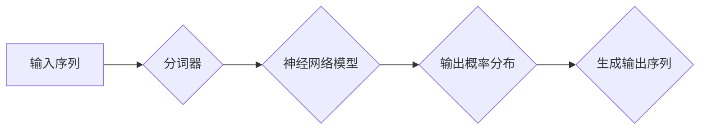

# AI人工智能核心算法原理与代码实例讲解：语言模型

> 关键词：人工智能，核心算法，语言模型，神经网络，深度学习，自然语言处理，预训练，生成式模型，Transformer，BERT

## 1. 背景介绍

自然语言处理（Natural Language Processing，NLP）作为人工智能领域的一个重要分支，旨在让计算机理解和生成人类语言。随着深度学习技术的飞速发展，基于神经网络的深度学习模型在NLP任务中取得了显著的成果。其中，语言模型（Language Model，LM）作为NLP的基础，对于文本分类、机器翻译、文本摘要等任务都至关重要。本文将深入讲解语言模型的原理、实现方法和应用实例。

## 2. 核心概念与联系

### 2.1 核心概念原理

语言模型的核心任务是模拟人类语言的概率分布，为NLP任务提供语言上下文信息和概率分布。以下是一些核心概念：

- **字符级语言模型**：以字符为单位进行建模，通过统计字符序列的概率分布来预测下一个字符。
- **词级语言模型**：以单词为单位进行建模，通过统计单词序列的概率分布来预测下一个单词。
- **句子级语言模型**：以句子为单位进行建模，通过统计句子序列的概率分布来预测下一个句子。
- **神经网络语言模型**：利用神经网络对语言数据进行建模，通过多层感知器（MLP）、循环神经网络（RNN）、长短期记忆网络（LSTM）、Transformer等模型实现。

### 2.2 架构流程图



在这个流程图中，输入序列首先通过分词器进行分词，然后输入到神经网络模型中进行概率分布计算，最后根据概率分布生成输出序列。

## 3. 核心算法原理 & 具体操作步骤

### 3.1 算法原理概述

语言模型的核心算法是概率分布模型，常用的模型有：

- **n-gram模型**：基于n个连续单词的概率分布进行建模，n值越大，模型表达能力越强，但计算复杂度也越高。
- **神经网络语言模型**：利用神经网络对语言数据进行建模，能够学习到更复杂的语言特征和上下文信息。

### 3.2 算法步骤详解

以神经网络语言模型为例，算法步骤如下：

1. **数据预处理**：收集语料库，进行分词、去停用词等操作，将文本转换为模型可处理的格式。
2. **模型构建**：选择合适的神经网络结构，如RNN、LSTM、Transformer等，并设置超参数。
3. **模型训练**：将预处理后的数据输入模型，通过反向传播算法进行训练，优化模型参数。
4. **模型评估**：使用测试集评估模型性能，调整超参数，直至满足预期效果。

### 3.3 算法优缺点

- **n-gram模型**：
  - 优点：简单易实现，计算效率高。
  - 缺点：无法捕捉长距离依赖，模型表达能力有限。
- **神经网络语言模型**：
  - 优点：能够学习到更复杂的语言特征和上下文信息，模型表达能力强。
  - 缺点：计算复杂度高，训练时间长。

### 3.4 算法应用领域

语言模型在NLP领域有着广泛的应用，包括：

- **文本生成**：自动生成文本，如文章、新闻报道、对话等。
- **机器翻译**：将一种语言的文本翻译成另一种语言。
- **文本摘要**：将长文本压缩成简洁的摘要。
- **文本分类**：对文本进行分类，如情感分析、主题分类等。
- **问答系统**：回答用户提出的问题。

## 4. 数学模型和公式 & 详细讲解 & 举例说明

### 4.1 数学模型构建

神经网络语言模型的核心是神经网络，其数学模型可以表示为：

$$
\hat{y} = f(W, x)
$$

其中，$\hat{y}$ 是模型输出，$x$ 是输入，$W$ 是模型参数。

### 4.2 公式推导过程

以RNN为例，其数学模型可以表示为：

$$
h_t = \sigma(W_{ih}x_t + W_{hh}h_{t-1} + b_h)
$$

$$
y_t = \sigma(W_{oh}h_t + b_h)
$$

其中，$h_t$ 是隐藏状态，$x_t$ 是输入，$W_{ih}$、$W_{hh}$、$W_{oh}$ 是权重矩阵，$b_h$ 是偏置，$\sigma$ 是激活函数。

### 4.3 案例分析与讲解

以下是一个简单的神经网络语言模型代码实例：

```python
import torch
import torch.nn as nn

class LanguageModel(nn.Module):
    def __init__(self, vocab_size, embedding_dim, hidden_dim, output_dim):
        super(LanguageModel, self).__init__()
        self.embedding = nn.Embedding(vocab_size, embedding_dim)
        self.rnn = nn.GRU(embedding_dim, hidden_dim, batch_first=True)
        self.fc = nn.Linear(hidden_dim, output_dim)

    def forward(self, x):
        x = self.embedding(x)
        output, hidden = self.rnn(x)
        output = self.fc(output)
        return output

# 实例化模型
model = LanguageModel(vocab_size=10000, embedding_dim=128, hidden_dim=256, output_dim=10000)

# 前向传播
input = torch.tensor([[1, 2, 3], [4, 5, 6]])
output = model(input)
```

在这个例子中，我们使用PyTorch构建了一个简单的神经网络语言模型，包括词嵌入层、循环神经网络层和全连接层。输入数据经过词嵌入层转换为词向量，然后输入循环神经网络层进行特征提取，最后通过全连接层输出概率分布。

## 5. 项目实践：代码实例和详细解释说明

### 5.1 开发环境搭建

1. 安装Python和PyTorch库。
2. 下载并安装预训练的词嵌入模型，如GloVe或Word2Vec。

### 5.2 源代码详细实现

以下是一个基于Transformer的语言模型代码实例：

```python
import torch
import torch.nn as nn

class TransformerLM(nn.Module):
    def __init__(self, vocab_size, d_model, nhead, num_layers, dim_feedforward):
        super(TransformerLM, self).__init__()
        self.embedding = nn.Embedding(vocab_size, d_model)
        self.transformer = nn.Transformer(d_model, nhead, num_layers, dim_feedforward)
        self.fc = nn.Linear(d_model, vocab_size)

    def forward(self, src):
        src = self.embedding(src)
        output = self.transformer(src)
        output = self.fc(output)
        return output

# 实例化模型
model = TransformerLM(vocab_size=10000, d_model=512, nhead=8, num_layers=6, dim_feedforward=2048)

# 前向传播
input = torch.tensor([[1, 2, 3], [4, 5, 6]])
output = model(input)
```

在这个例子中，我们使用PyTorch构建了一个基于Transformer的语言模型，包括词嵌入层、Transformer编码器和解码器层、全连接层。输入数据经过词嵌入层转换为词向量，然后输入Transformer编码器层进行特征提取和上下文建模，最后通过全连接层输出概率分布。

### 5.3 代码解读与分析

在这个例子中，我们使用了PyTorch的`nn.Embedding`模块实现词嵌入层，用于将单词转换为词向量。`nn.Transformer`模块实现了Transformer编码器和解码器层，用于特征提取和上下文建模。`nn.Linear`模块实现了全连接层，用于输出概率分布。

### 5.4 运行结果展示

运行上述代码，可以得到模型的输出概率分布，可以根据概率分布生成新的文本。

## 6. 实际应用场景

语言模型在NLP领域有着广泛的应用，以下是一些实际应用场景：

- **文本生成**：自动生成文章、新闻报道、对话等。
- **机器翻译**：将一种语言的文本翻译成另一种语言。
- **文本摘要**：将长文本压缩成简洁的摘要。
- **文本分类**：对文本进行分类，如情感分析、主题分类等。
- **问答系统**：回答用户提出的问题。

## 7. 工具和资源推荐

### 7.1 学习资源推荐

- 《深度学习自然语言处理》
- 《自然语言处理综论》
- 《深度学习与自然语言处理》
- HuggingFace官网：https://huggingface.co/

### 7.2 开发工具推荐

- PyTorch：https://pytorch.org/
- TensorFlow：https://www.tensorflow.org/

### 7.3 相关论文推荐

- "Attention is All You Need"
- "BERT: Pre-training of Deep Bidirectional Transformers for Language Understanding"
- "Generative Language Models"
- "BERT-4-Real: BERT for Real-Life Text Generation"

## 8. 总结：未来发展趋势与挑战

### 8.1 研究成果总结

本文深入讲解了语言模型的原理、实现方法和应用实例，介绍了神经网络语言模型、Transformer等先进模型，并给出了代码实例。

### 8.2 未来发展趋势

- 模型规模将进一步扩大，探索更强大的模型结构。
- 跨模态语言模型将成为研究热点，实现多模态信息融合。
- 预训练模型将更加注重领域适应性和个性化。
- 可解释性和安全性将成为研究重点。

### 8.3 面临的挑战

- 模型规模和计算复杂度不断增长，对硬件资源要求越来越高。
- 模型可解释性和安全性问题亟待解决。
- 模型泛化能力不足，容易受到对抗样本攻击。

### 8.4 研究展望

未来，语言模型将在NLP领域发挥更加重要的作用，推动NLP技术的快速发展。同时，随着技术的不断进步，语言模型将更加智能化、泛化性强，为人类社会带来更多便利。

---

作者：禅与计算机程序设计艺术 / Zen and the Art of Computer Programming