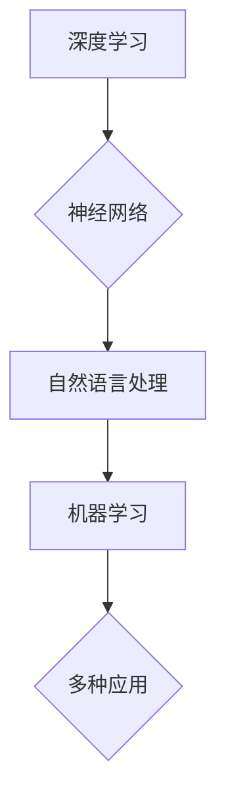

> 人工智能，深度学习，神经网络，自然语言处理，自动驾驶，机器学习，未来策略

# Andrej Karpathy：人工智能的未来发展策略

人工智能（AI）正以前所未有的速度改变着我们的世界。作为深度学习领域的领军人物，Andrej Karpathy对AI的未来发展有着深刻的见解和独特的策略。本文将基于Karpathy的观点，探讨人工智能的未来发展趋势、面临的挑战以及应对策略。

## 1. 背景介绍

Andrej Karpathy是Google DeepMind的研究科学家，也是深度学习领域的知名专家。他在自然语言处理（NLP）和机器学习领域有着丰富的经验，曾经参与开发过著名的神经网络架构BERT。Karpathy在多个领域都展现了卓越的创新能力，包括自动驾驶、图像识别和游戏AI等。

## 2. 核心概念与联系

### 2.1 核心概念

#### 深度学习

深度学习是一种机器学习方法，它使用多层神经网络来学习数据的复杂表示。这些神经网络通过反向传播算法优化其参数，从而能够从数据中学习到复杂的模式。

#### 神经网络

神经网络是由相互连接的神经元组成的计算系统，每个神经元都负责处理输入数据的一部分，并将结果传递给其他神经元。通过多层神经元的组合，神经网络能够处理复杂的输入数据，并从中提取特征。

#### 自然语言处理

自然语言处理（NLP）是人工智能的一个分支，旨在让计算机能够理解和生成人类语言。NLP在机器翻译、情感分析、语音识别等领域有着广泛的应用。

#### 机器学习

机器学习是一种使计算机系统能够从数据中学习并做出决策或预测的方法。机器学习分为监督学习、无监督学习和强化学习。

### 2.2 Mermaid流程图



## 3. 核心算法原理 & 具体操作步骤

### 3.1 算法原理概述

深度学习算法的核心是神经网络，它通过学习大量的数据来发现数据中的复杂模式。神经网络由输入层、隐藏层和输出层组成。输入层接收原始数据，隐藏层处理这些数据，并提取特征，输出层产生最终的输出。

### 3.2 算法步骤详解

1. 数据预处理：对原始数据进行分析和清洗，以便神经网络可以处理。
2. 构建神经网络模型：设计网络结构，包括层数、每层的神经元数量等。
3. 训练模型：使用训练数据集对模型进行训练，优化模型参数。
4. 评估模型：使用验证数据集评估模型性能，调整模型结构或参数。
5. 部署模型：将训练好的模型部署到实际应用中。

### 3.3 算法优缺点

#### 优点

- 能够处理复杂的数据和模式。
- 能够从大量数据中自动学习特征。
- 在多个领域取得了显著的成果。

#### 缺点

- 需要大量的数据和计算资源。
- 模型的可解释性较差。
- 可能存在过拟合问题。

### 3.4 算法应用领域

深度学习在以下领域有着广泛的应用：

- 机器视觉：图像和视频识别、物体检测、图像生成等。
- 自然语言处理：文本分类、机器翻译、情感分析等。
- 语音识别：语音转文字、语音合成等。
- 自动驾驶：环境感知、路径规划、决策等。

## 4. 数学模型和公式 & 详细讲解 & 举例说明

### 4.1 数学模型构建

深度学习模型通常由多个数学函数组成，包括激活函数、损失函数、优化算法等。

#### 激活函数

激活函数是神经网络中用于将线性组合转化为非线性输出的函数。常见的激活函数有ReLU、Sigmoid、Tanh等。

$$
f(x) = \max(0, x)
$$

#### 损失函数

损失函数用于衡量模型预测值与真实值之间的差异。常见的损失函数有均方误差（MSE）、交叉熵损失等。

$$
L(y, \hat{y}) = -[y\log \hat{y} + (1-y)\log (1-\hat{y})]
$$

#### 优化算法

优化算法用于找到最小化损失函数的模型参数。常见的优化算法有梯度下降（GD）、Adam等。

### 4.2 公式推导过程

以交叉熵损失函数为例，推导其梯度的计算过程。

$$
\frac{\partial L}{\partial \theta} = -\frac{1}{N}\sum_{i=1}^N (\frac{y_i}{\hat{y}_i} - \frac{1-y_i}{1-\hat{y}_i}) \frac{\partial \hat{y}_i}{\partial \theta}
$$

### 4.3 案例分析与讲解

以BERT模型为例，分析其数学模型和公式。

BERT模型是一种基于Transformer的自回归语言模型，它通过掩码语言模型（Masked Language Model，MLM）和下一句预测（Next Sentence Prediction，NSP）两个任务进行预训练。

$$
\text{MaskedLM}(X) = \text{Transformer}(X)
$$
$$
\text{NextSentenceLM}(X) = \text{Transformer}(X)
$$

其中，X为输入序列，Transformer为Transformer模型。

## 5. 项目实践：代码实例和详细解释说明

### 5.1 开发环境搭建

使用TensorFlow或PyTorch等深度学习框架进行开发。

### 5.2 源代码详细实现

以下是一个简单的神经网络模型实现：

```python
import tensorflow as tf

def build_model():
    model = tf.keras.Sequential([
        tf.keras.layers.Dense(128, activation='relu', input_shape=(784,)),
        tf.keras.layers.Dense(10, activation='softmax')
    ])
    return model

model = build_model()
```

### 5.3 代码解读与分析

以上代码定义了一个简单的神经网络模型，包含两个全连接层。输入层接受784个输入，输出层有10个输出，表示10个分类结果。

### 5.4 运行结果展示

使用训练数据和测试数据对模型进行训练和评估。

## 6. 实际应用场景

深度学习在以下领域有着广泛的应用：

- 机器视觉：图像识别、物体检测、图像生成等。
- 自然语言处理：文本分类、机器翻译、情感分析等。
- 语音识别：语音转文字、语音合成等。
- 自动驾驶：环境感知、路径规划、决策等。

## 7. 工具和资源推荐

### 7.1 学习资源推荐

- Coursera的《深度学习》课程
- TensorFlow官方文档
- PyTorch官方文档

### 7.2 开发工具推荐

- TensorFlow
- PyTorch
- Keras

### 7.3 相关论文推荐

- "A Neural Network for Machine Translation"（神经网络机器翻译）
- "BERT: Pre-training of Deep Bidirectional Transformers for Language Understanding"（BERT：预训练双向Transformer用于语言理解）

## 8. 总结：未来发展趋势与挑战

### 8.1 研究成果总结

深度学习在人工智能领域取得了显著的成果，并在多个领域得到了广泛应用。

### 8.2 未来发展趋势

- 模型规模将不断扩大，参数量将超过千亿级别。
- 模型结构将更加多样化，适应不同的应用场景。
- 模型的可解释性将得到提高。
- 模型的安全性和鲁棒性将得到加强。

### 8.3 面临的挑战

- 需要更多的计算资源。
- 需要更多的数据。
- 模型的可解释性较差。
- 模型的安全性和鲁棒性有待提高。

### 8.4 研究展望

未来，深度学习将继续发展，并在更多领域得到应用。随着计算能力的提升和算法的优化，深度学习将在人工智能领域发挥更大的作用。

## 9. 附录：常见问题与解答

### 9.1 人工智能与深度学习的区别是什么？

人工智能是机器能够模拟人类智能行为的科学，而深度学习是人工智能的一个分支，它使用神经网络来模拟人类大脑的神经元连接方式。

### 9.2 深度学习有哪些应用？

深度学习在多个领域有着广泛的应用，如机器视觉、自然语言处理、语音识别、自动驾驶等。

### 9.3 如何学习深度学习？

可以通过在线课程、书籍、开源项目等方式学习深度学习。

### 9.4 深度学习有哪些挑战？

深度学习需要大量的计算资源和数据，模型的可解释性较差，安全性和鲁棒性有待提高。

作者：禅与计算机程序设计艺术 / Zen and the Art of Computer Programming