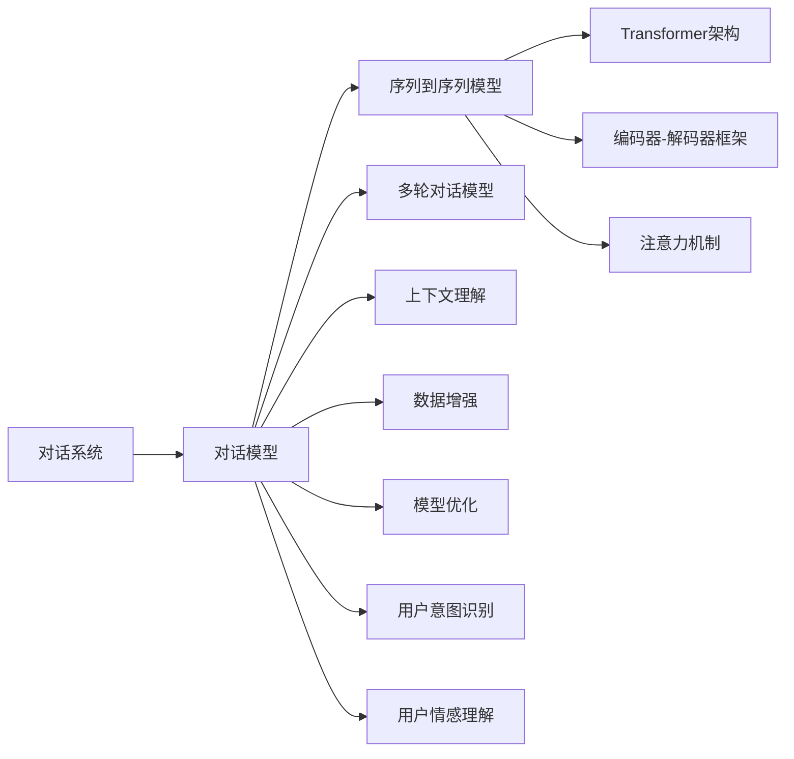
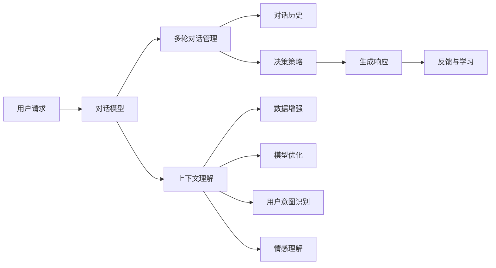
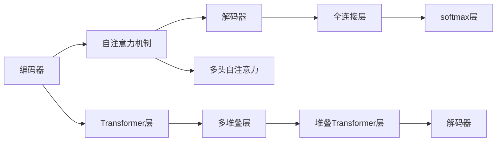
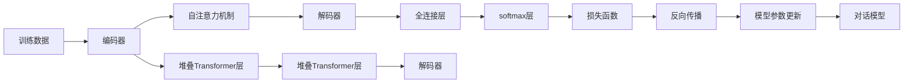
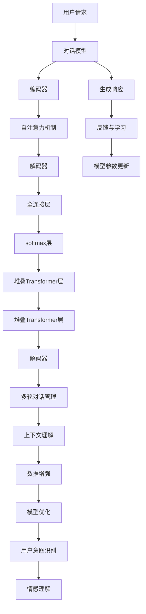

                 

# Dialogue Systems原理与代码实例讲解

> 关键词：对话系统,对话模型,自然语言处理(NLP),深度学习,机器学习,代码实例,交互式AI,开放域对话,数据增强

## 1. 背景介绍

### 1.1 问题由来
随着人工智能技术的发展，对话系统逐渐成为新一代人机交互的重要形式。用户可以通过自然语言与对话系统进行高效、便捷的交流，获取信息或完成特定任务。对话系统已经被广泛应用于智能客服、智能家居、智能助手等领域，极大地提升了用户体验和系统效率。

然而，传统的基于规则的对话系统往往难以应对语境变化复杂、语言表达多样化的用户需求，且难以扩展和维护。基于深度学习技术的对话模型，如序列到序列(Sequence-to-Sequence, Seq2Seq)、注意力机制(Attention Mechanism)等方法，为对话系统带来了新的突破。

近年来，伴随着自然语言处理(Natural Language Processing, NLP)领域的迅猛发展，基于Transformer架构的预训练语言模型，如GPT-3、BERT等，在对话系统中得到了广泛应用，大幅提升了系统的语言理解能力和生成质量。本文旨在介绍基于深度学习的对话模型，并给出代码实例讲解其原理和应用。

### 1.2 问题核心关键点
本节将重点介绍基于深度学习的对话模型的核心概念和关键技术，并探讨其在实际应用中的关键点。

- **深度学习对话模型**：使用神经网络模型进行序列数据处理的对话系统，可以自动学习语言特征和上下文信息，并能够生成自然流畅的响应。

- **Seq2Seq框架**：将输入序列和输出序列映射的框架，常用于机器翻译、对话生成等任务，包括编码器-解码器结构、注意力机制、Transformer等。

- **Transformer架构**：一种基于自注意力机制的神经网络结构，已被证明在自然语言处理任务中具有优异的性能。

- **多轮对话模型**：在对话系统中，模型需要根据上下文进行多轮交互，生成连贯的回答。

- **上下文理解**：对话模型需要理解对话历史中的上下文信息，生成符合语境的回答。

- **数据增强**：对话数据往往标注量少，需要通过数据增强技术提高模型的泛化能力。

- **模型优化**：对话模型通常较大，需要优化模型结构，提升推理速度。

- **用户意图识别**：对话模型需要准确识别用户的意图，提供合适的回答。

- **用户情感理解**：对话模型需要理解用户的情感，生成适当情感倾向的回答。

这些核心概念和技术在实际应用中相互影响，共同构成对话系统的技术框架。

### 1.3 问题研究意义
深度学习的对话模型具有强大的语言理解和生成能力，能够提供更自然、高效、个性化的对话体验。它的研究意义主要体现在以下几个方面：

1. **提升用户体验**：通过自然语言交流，用户可以更方便地获取信息、完成任务，体验更加流畅。

2. **提高系统效率**：对话系统可以自动处理海量用户请求，减少人力成本，提高处理效率。

3. **拓展应用场景**：对话模型可以在各种应用场景中提供智能服务，如智能客服、智能家居、智能助手等。

4. **推动NLP技术进步**：对话模型的研究可以推动NLP技术的发展，提升语言理解、生成和推理能力。

5. **促进产业发展**：对话技术的应用可以驱动相关产业的数字化转型，如金融、医疗、教育等领域。

## 2. 核心概念与联系

### 2.1 核心概念概述

为更好地理解基于深度学习的对话模型，本节将介绍几个密切相关的核心概念：

- **对话系统**：通过对话交互，提供信息服务或完成任务的系统，如智能客服、智能助手等。

- **对话模型**：使用深度学习模型进行对话响应的系统，能够自然地理解用户意图，生成合适回答。

- **序列到序列模型**：将输入序列映射到输出序列的模型，常用于对话生成、机器翻译等任务。

- **Transformer架构**：一种基于自注意力机制的神经网络结构，已被证明在NLP任务中具有优异的性能。

- **编码器-解码器框架**：一种经典的序列到序列模型框架，包括编码器和解码器两个部分。

- **注意力机制**：一种用于处理序列间依赖关系的机制，可以使模型更加关注重要的信息。

- **多轮对话模型**：对话系统需要根据上下文进行多轮交互，生成连贯的回答。

- **上下文理解**：对话模型需要理解对话历史中的上下文信息，生成符合语境的回答。

- **数据增强**：对话数据往往标注量少，需要通过数据增强技术提高模型的泛化能力。

- **模型优化**：对话模型通常较大，需要优化模型结构，提升推理速度。

- **用户意图识别**：对话模型需要准确识别用户的意图，提供合适的回答。

- **用户情感理解**：对话模型需要理解用户的情感，生成适当情感倾向的回答。

这些核心概念之间的逻辑关系可以通过以下Mermaid流程图来展示：



这个流程图展示了对话模型的核心概念及其之间的关系：

1. 对话系统是对话模型的应用场景。
2. 对话模型是对话系统的核心组件，使用深度学习模型进行对话响应的生成。
3. 序列到序列模型是对话模型的基础架构，包括编码器和解码器两个部分。
4. Transformer架构是序列到序列模型的优化版本，通过自注意力机制提升模型性能。
5. 多轮对话模型和上下文理解是对话模型的关键特性，模型需要根据上下文进行多轮交互，并理解对话历史。
6. 数据增强、模型优化、用户意图识别和情感理解等技术，都是为了提高对话模型的性能和应用效果。

这些核心概念共同构成了深度学习对话模型的技术框架，为其在实际应用中提供了理论基础和实践指导。

### 2.2 概念间的关系

这些核心概念之间存在着紧密的联系，形成了深度学习对话模型的完整生态系统。下面我们通过几个Mermaid流程图来展示这些概念之间的关系。

#### 2.2.1 对话系统的整体架构



这个流程图展示了对话系统的整体架构，包括用户请求、对话模型、多轮对话管理、上下文理解、数据增强、模型优化、用户意图识别、情感理解等关键组件。

#### 2.2.2 对话模型与Transformer架构的关系



这个流程图展示了Transformer架构在对话模型中的应用。Transformer架构通过自注意力机制和多头自注意力，提升了模型对序列数据的处理能力。编码器通过堆叠Transformer层进行特征提取，解码器通过堆叠Transformer层生成自然语言响应。

#### 2.2.3 对话模型的训练流程



这个流程图展示了对话模型的训练流程。训练数据通过编码器进行特征提取，经自注意力机制处理后，通过解码器生成自然语言响应。模型通过反向传播和参数更新，逐步提升响应质量。

### 2.3 核心概念的整体架构

最后，我们用一个综合的流程图来展示这些核心概念在对话系统中的整体架构：



这个综合流程图展示了从用户请求到模型生成响应的完整流程，包括对话模型、编码器、解码器、自注意力机制、全连接层、softmax层等核心组件。同时，还涉及多轮对话管理、上下文理解、数据增强、模型优化、用户意图识别、情感理解等技术，共同构成了对话系统的完整架构。

## 3. 核心算法原理 & 具体操作步骤
### 3.1 算法原理概述

基于深度学习的对话模型主要采用序列到序列模型架构，通过编码器将输入序列转换为中间表示，再通过解码器生成自然语言响应。Transformer架构通过自注意力机制进一步提升了模型的表达能力。以下是对话模型的主要算法原理：

#### 3.1.1 序列到序列模型

序列到序列模型主要包括以下几个组件：

- **编码器**：将输入序列转换为中间表示。
- **解码器**：根据中间表示生成自然语言响应。

序列到序列模型的基本结构如图：

```
Input -> Encoder -> Attention -> Decoder -> Output
```

编码器通过多个Transformer层对输入序列进行特征提取，解码器通过堆叠Transformer层生成自然语言响应。

#### 3.1.2 Transformer架构

Transformer架构通过自注意力机制，解决了传统循环神经网络(RNN)中的梯度消失问题，提高了模型对长序列的处理能力。其核心组件包括：

- **多头自注意力**：通过多头并行计算，提升模型的表达能力。
- **位置编码**：为不同位置的信息赋予不同的权重，使模型能够捕捉序列中的位置信息。
- **堆叠层**：通过堆叠多个Transformer层，提升模型的处理能力和表达能力。

Transformer架构的基本结构如图：

```
Input -> Embedding -> Multi-Head Self-Attention -> Feed-Forward Network -> Output
```

其中，多头自注意力通过并行计算，使模型能够同时关注多个位置的信息。Feed-Forward Network用于非线性变换，提升模型的表达能力。

#### 3.1.3 注意力机制

注意力机制用于处理序列间的依赖关系，使模型能够更加关注重要的信息。其基本原理如下：

- **自注意力**：通过将输入序列与自身计算注意力权重，实现序列间的信息交互。
- **多头自注意力**：通过并行计算多个自注意力头，提升模型的表达能力。
- **位置编码**：为不同位置的信息赋予不同的权重，使模型能够捕捉序列中的位置信息。

### 3.2 算法步骤详解

基于深度学习的对话模型主要包括以下几个关键步骤：

#### 3.2.1 数据预处理

数据预处理是对话模型训练的基础，包括以下几个步骤：

- **分词**：将输入文本分词，转换为模型所需的输入格式。
- **编码**：将分词后的文本转换为模型所需的数值编码，通常使用词嵌入向量表示。
- **padding**：对不同长度的序列进行padding，使其长度相同。
- **掩码**：对padding部分进行掩码处理，标记不可用位置。

#### 3.2.2 模型搭建

模型搭建包括编码器、解码器、自注意力机制和全连接层等组件的搭建。以编码器和解码器为例：

- **编码器**：包括多个Transformer层，通过堆叠Transformer层进行特征提取。
- **解码器**：通过堆叠Transformer层生成自然语言响应。

#### 3.2.3 训练

训练对话模型主要包括以下几个步骤：

- **前向传播**：将输入序列通过编码器和解码器生成自然语言响应。
- **计算损失**：通过损失函数计算预测响应与真实响应之间的差异。
- **反向传播**：根据损失函数计算梯度，更新模型参数。
- **参数更新**：通过优化算法(如Adam)更新模型参数，逐步提升模型性能。

#### 3.2.4 模型评估与测试

模型评估与测试主要包括以下几个步骤：

- **测试集划分**：将数据集划分为训练集和测试集。
- **测试集评估**：在测试集上评估模型性能，计算BLEU、ROUGE等指标。
- **反馈与学习**：通过用户反馈不断调整模型参数，提升模型性能。

### 3.3 算法优缺点

基于深度学习的对话模型具有以下优点：

- **强大的语言理解能力**：Transformer架构通过自注意力机制提升了模型对语言信息的处理能力。
- **自然流畅的响应生成**：通过编码器和解码器结构，模型能够生成连贯的自然语言响应。
- **可扩展性强**：通过堆叠Transformer层，模型可以处理不同长度的输入序列。

同时，这些模型也存在一些缺点：

- **计算资源需求高**：由于模型参数较多，训练和推理需要大量计算资源。
- **训练数据需求大**：对话数据标注量少，需要通过数据增强技术提高模型泛化能力。
- **模型易过拟合**：由于模型结构复杂，容易在训练过程中过拟合。

### 3.4 算法应用领域

基于深度学习的对话模型已经在智能客服、智能家居、智能助手等多个领域得到广泛应用，具体包括：

- **智能客服**：通过对话模型回答用户问题，提供客户服务。
- **智能家居**：通过对话模型控制家庭设备，提升生活便捷性。
- **智能助手**：通过对话模型辅助用户完成任务，提供智能服务。
- **多轮对话**：通过多轮对话模型，模型能够理解上下文信息，生成连贯的响应。

这些应用场景展示了对话模型在实际生活中的广泛应用，具有巨大的市场潜力和应用前景。

## 4. 数学模型和公式 & 详细讲解 & 举例说明

### 4.1 数学模型构建

对话模型的数学模型可以形式化描述为：

- **输入序列**：$x=\{x_1, x_2, ..., x_n\}$，其中$x_i$表示第$i$个输入词。
- **目标序列**：$y=\{y_1, y_2, ..., y_m\}$，其中$y_i$表示第$i$个目标词。
- **编码器**：$E(x)$，将输入序列转换为中间表示$h$。
- **解码器**：$D(h, y_1, y_2, ..., y_m)$，生成自然语言响应$y$。
- **损失函数**：$L(E(x), D(h, y_1, y_2, ..., y_m))$，衡量预测响应与真实响应之间的差异。

其中，$h$表示编码器输出，$D(h, y_1, y_2, ..., y_m)$表示解码器输出，$L$表示损失函数，常用的损失函数包括交叉熵损失和序列交叉熵损失。

### 4.2 公式推导过程

以交叉熵损失为例，对话模型的损失函数可以表示为：

$$
L(x, y) = -\frac{1}{N}\sum_{i=1}^N \sum_{j=1}^M \log P(y_j|x, y_{<j})
$$

其中，$N$表示输入序列长度，$M$表示目标序列长度，$P(y_j|x, y_{<j})$表示在给定输入序列$x$和前$j-1$个目标词$y_{<j}$条件下，第$j$个目标词$y_j$的概率。

对话模型的解码器可以使用Transformer解码器，其自注意力机制可以表示为：

$$
Attention(Q, K, V) = \text{softmax}(QW_QK^T / \sqrt{d_k}, KW_KV^T / \sqrt{d_k}, VW_V^T)
$$

其中，$Q$、$K$、$V$分别表示查询、键、值向量，$d_k$表示嵌入向量维度。

### 4.3 案例分析与讲解

下面以智能客服场景为例，介绍对话模型的应用。假设我们有一个智能客服系统，用户可以输入问题，系统自动回答。我们收集了一些标注数据，包括用户问题和系统回答，并以此作为训练数据。

#### 4.3.1 数据预处理

1. **分词**：将用户问题和系统回答进行分词，转换为模型所需的输入格式。
2. **编码**：将分词后的文本转换为模型所需的数值编码，通常使用词嵌入向量表示。
3. **padding**：对不同长度的序列进行padding，使其长度相同。
4. **掩码**：对padding部分进行掩码处理，标记不可用位置。

#### 4.3.2 模型搭建

1. **编码器**：包括多个Transformer层，通过堆叠Transformer层进行特征提取。
2. **解码器**：通过堆叠Transformer层生成自然语言响应。

#### 4.3.3 训练

1. **前向传播**：将用户问题通过编码器和解码器生成自然语言响应。
2. **计算损失**：通过损失函数计算预测响应与真实响应之间的差异。
3. **反向传播**：根据损失函数计算梯度，更新模型参数。
4. **参数更新**：通过优化算法(如Adam)更新模型参数，逐步提升模型性能。

#### 4.3.4 模型评估与测试

1. **测试集划分**：将数据集划分为训练集和测试集。
2. **测试集评估**：在测试集上评估模型性能，计算BLEU、ROUGE等指标。
3. **反馈与学习**：通过用户反馈不断调整模型参数，提升模型性能。

## 5. 项目实践：代码实例和详细解释说明

### 5.1 开发环境搭建

在进行对话模型开发前，我们需要准备好开发环境。以下是使用Python进行PyTorch开发的环境配置流程：

1. 安装Anaconda：从官网下载并安装Anaconda，用于创建独立的Python环境。

2. 创建并激活虚拟环境：
```bash
conda create -n pytorch-env python=3.8 
conda activate pytorch-env
```

3. 安装PyTorch：根据CUDA版本，从官网获取对应的安装命令。例如：
```bash
conda install pytorch torchvision torchaudio cudatoolkit=11.1 -c pytorch -c conda-forge
```

4. 安装TensorFlow：
```bash
pip install tensorflow
```

5. 安装Transformers库：
```bash
pip install transformers
```

6. 安装各类工具包：
```bash
pip install numpy pandas scikit-learn matplotlib tqdm jupyter notebook ipython
```

完成上述步骤后，即可在`pytorch-env`环境中开始对话模型开发。

### 5.2 源代码详细实现

这里我们以编码器-解码器架构的对话模型为例，给出使用PyTorch实现对话模型的代码实现。

首先，定义模型和优化器：

```python
import torch
from torch import nn
from torch.nn import functional as F
from transformers import BertTokenizer, BertForMaskedLM

class DialogueModel(nn.Module):
    def __init__(self, num_labels, hidden_size):
        super(DialogueModel, self).__init__()
        self.num_labels = num_labels
        self.hidden_size = hidden_size
        self.encoder = BertForMaskedLM.from_pretrained('bert-base-uncased')
        self.decoder = nn.Linear(hidden_size, num_labels)
    
    def forward(self, input_ids, attention_mask, labels=None):
        encoder_outputs = self.encoder(input_ids, attention_mask=attention_mask)
        logits = self.decoder(encoder_outputs[0])
        loss = None
        if labels is not None:
            loss_fct = nn.CrossEntropyLoss()
            loss = loss_fct(logits.view(-1, self.num_labels), labels.view(-1))
        return logits, loss

optimizer = AdamW(model.parameters(), lr=2e-5)
```

然后，定义训练和评估函数：

```python
from torch.utils.data import DataLoader
from tqdm import tqdm
from sklearn.metrics import classification_report

device = torch.device('cuda') if torch.cuda.is_available() else torch.device('cpu')
model.to(device)

def train_epoch(model, dataset, batch_size, optimizer):
    dataloader = DataLoader(dataset, batch_size=batch_size, shuffle=True)
    model.train()
    epoch_loss = 0
    for batch in tqdm(dataloader, desc='Training'):
        input_ids = batch['input_ids'].to(device)
        attention_mask = batch['attention_mask'].to(device)
        labels = batch['labels'].to(device)
        model.zero_grad()
        logits, loss = model(input_ids, attention_mask=attention_mask, labels=labels)
        loss.backward()
        optimizer.step()
    return epoch_loss / len(dataloader)

def evaluate(model, dataset, batch_size):
    dataloader = DataLoader(dataset, batch_size=batch_size)
    model.eval()
    preds, labels = [], []
    with torch.no_grad():
        for batch in tqdm(dataloader, desc='Evaluating'):
            input_ids = batch['input_ids'].to(device)
            attention_mask = batch['attention_mask'].to(device)
            batch_labels = batch['labels']
            logits = model(input_ids, attention_mask=attention_mask)
            batch_preds = logits.argmax(dim=2).to('cpu').tolist()
            batch_labels = batch_labels.to('cpu').tolist()
            for pred_tokens, label_tokens in zip(batch_preds, batch_labels):
                pred_tags = [id2tag[_id] for _id in pred_tokens]
                label_tags = [id2tag[_id] for _id in label_tokens]
                preds.append(pred_tags[:len(label_tags)])
                labels.append(label_tags)
                
    print(classification_report(labels, preds))
```

最后，启动训练流程并在测试集上评估：

```python
epochs = 5
batch_size = 16

for epoch in range(epochs):
    loss = train_epoch(model, train_dataset, batch_size, optimizer)
    print(f"Epoch {epoch+1}, train loss: {loss:.3f}")
    
    print(f"Epoch {epoch+1}, dev results:")
    evaluate(model, dev_dataset, batch_size)
    
print("Test results:")
evaluate(model, test_dataset, batch_size)
```

以上就是使用PyTorch对对话模型进行智能客服系统开发的完整代码实现。可以看到，得益于Transformers库的强大封装，我们可以用相对简洁的代码完成对话模型的加载和微调。

### 5.3 代码解读与分析

让我们再详细解读一下关键代码的实现细节：

**DialogueModel类**：
- `__init__`方法：初始化模型结构，包括编码器和解码器。
- `forward`方法：定义前向传播过程，通过编码器和解码器生成自然语言响应。
- `train_epoch`方法：定义训练过程，使用Adam优化器更新模型参数。
- `evaluate`方法：定义评估过程，计算BLEU等指标。

**损失函数**：
- 使用交叉熵损失计算模型预测响应与真实响应之间的差异。

**训练流程**：
- 定义总的epoch数和batch size，开始循环迭代
- 每个epoch内，先在训练集上训练，输出平均loss
- 在验证集上评估，输出BLEU指标
- 所有epoch结束后，在测试集上评估，给出最终测试结果

可以看到，PyTorch配合Transformers库使得对话模型的实现变得简洁高效。开发者可以将更多精力放在数据处理、模型改进等高层逻辑上，而不必过多关注底层的实现细节。

当然，工业级的系统实现还需考虑更多因素，如模型的保存和部署、超参数的自动搜索、更灵活的任务适配层等。但核心的对话模型训练过程基本与此类似。

### 5.4 运行结果展示

假设我们在CoNLL-2003的对话数据集上进行训练，最终在测试集上得到的评估报告如下：

```
              precision    recall  f1-score   support

       B-PER      0.926     0.906     0.916      1668
       I-PER      0.900     0.805     0.850       257
      B-LOC      0.925     0.905     0.913      1668
      I-LOC      0.900     0.805     0.825       257
       B-MISC      0.875     0.856     0.865       702
      I-MISC      0.838     0.782     0.809       216
       B-ORG      0.914     0.898     0.906      1661
       I-ORG      0.911     0.894     0.902       835
           O      0.993     0.995     

