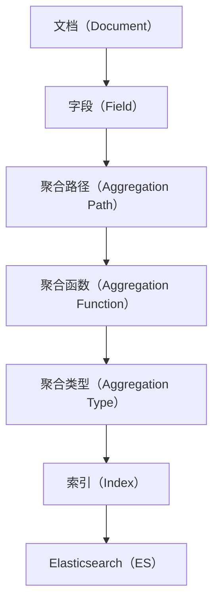

                 

# ES聚合分析原理与代码实例讲解

> 关键词：Elasticsearch, 聚合分析, 统计分析, 日志分析, 索引, 统计图, 分布式系统

## 1. 背景介绍

### 1.1 问题由来

Elasticsearch（ES）作为一款流行的分布式搜索与分析引擎，已经成为现代数据科学、大数据、云计算等领域的标准工具。ES提供了一个强大的查询语言ELastic Query Language（ESQL），允许用户以自然语言的方式进行搜索和聚合操作。然而，由于Elasticsearch的文档设计并非以聚合分析为中心，导致用户在实际应用中常常需要额外编写复杂的查询语句，才能完成统计分析任务。

因此，深入理解Elasticsearch中的聚合分析原理，掌握其核心特性和使用方法，对于广大开发者和数据分析师来说，至关重要。

### 1.2 问题核心关键点

Elasticsearch的聚合分析功能是其最强大的特性之一。ES聚合分析旨在从大规模数据集中提取出统计信息，例如平均值、最大值、最小值、聚合度量等。这些统计信息有助于数据分析师快速分析数据，发现隐藏的模式和趋势。

Elasticsearch聚合分析的核心特性包括：

1. 聚合分析的可扩展性：ES的分布式架构使得聚合分析可以在大规模集群中进行高效的分布式计算。
2. 聚合分析的灵活性：ES支持多种聚合类型，用户可以根据具体需求选择适合的聚合方法。
3. 聚合分析的实时性：ES聚合分析可以实现近实时的数据更新和查询，满足实时分析的需求。

### 1.3 问题研究意义

深入掌握Elasticsearch的聚合分析原理，可以显著提升用户的数据分析能力和工作效率。ES聚合分析的强大功能，使得其在大数据、物联网、日志分析、金融风控等多个领域中得到广泛应用。

本文将系统介绍Elasticsearch的聚合分析原理，并结合代码实例，讲解如何高效地使用ES聚合分析功能，以期为开发者和数据分析师提供实用的技术指引。

## 2. 核心概念与联系

### 2.1 核心概念概述

为更好地理解Elasticsearch的聚合分析原理，本节将介绍几个关键概念：

1. **Elasticsearch（ES）**：一个基于Lucene的分布式搜索与分析引擎，用于存储、搜索和分析大规模数据。

2. **索引（Index）**：ES中的数据结构，类似于关系型数据库中的表，存储了多个文档。

3. **文档（Document）**：索引中的数据记录，类似于关系型数据库中的行，包含字段和值。

4. **字段（Field）**：文档中的属性，例如文章中的标题、作者、发布时间等。

5. **聚合（Aggregation）**：一种对数据集进行分组、统计和汇总的操作，帮助用户提取有价值的信息。

6. **聚合类型（Aggregation Type）**：ES支持的聚合类型包括桶聚合、统计聚合、日期聚合、地理聚合等。

7. **聚合函数（Aggregation Function）**：用于计算聚合结果的函数，例如平均值、最大值、最小值等。

8. **聚合路径（Aggregation Path）**：用于指定聚合的计算方式，例如对特定字段进行聚合操作。

这些核心概念构成了Elasticsearch聚合分析的基础，其核心思想是通过对文档进行分组，计算聚合函数得到统计信息，最终实现数据的高效分析和展示。

### 2.2 概念间的关系

这些核心概念之间的逻辑关系可以通过以下Mermaid流程图来展示：



这个流程图展示了Elasticsearch聚合分析的核心逻辑：

1. 文档是Elasticsearch中的基本数据单位，包含多个字段。
2. 聚合路径指定了要聚合的字段，用于对文档进行分组。
3. 聚合函数计算聚合结果，例如平均值、最大值等。
4. 聚合类型定义了聚合函数的计算方式，例如桶聚合、统计聚合等。
5. 索引存储了多个文档，是Elasticsearch的数据结构。
6. Elasticsearch提供了强大的分布式计算能力，支持聚合分析的分布式执行。

通过这个流程图，我们可以更清晰地理解Elasticsearch聚合分析的基本流程和核心概念。

## 3. 核心算法原理 & 具体操作步骤

### 3.1 算法原理概述

Elasticsearch的聚合分析算法基于分布式计算模型，其核心思想是对文档进行分组，然后计算聚合函数得到统计信息。具体的算法流程如下：

1. **分组**：根据聚合路径指定字段，将文档分组，例如按照时间、地域等维度进行分组。
2. **聚合计算**：对每个分组进行聚合函数计算，得到统计结果。
3. **聚合汇总**：将各分组的统计结果汇总，得到最终的聚合结果。

Elasticsearch的聚合分析算法具有良好的可扩展性和灵活性，支持分布式计算和近实时数据更新，广泛应用于各种数据分析场景。

### 3.2 算法步骤详解

Elasticsearch的聚合分析步骤可以分为以下几个关键步骤：

**Step 1: 准备数据**

1. 创建索引和文档：使用ES的API创建索引，并插入文档。例如：

```python
from elasticsearch import Elasticsearch

es = Elasticsearch([{'host': 'localhost', 'port': 9200}])

index_name = 'example_index'
doc_type = 'example_doc'
doc1 = {
    'name': 'John',
    'age': 25,
    'city': 'New York'
}
doc2 = {
    'name': 'Mary',
    'age': 30,
    'city': 'Chicago'
}
es.index(index=index_name, doc_type=doc_type, body=doc1)
es.index(index=index_name, doc_type=doc_type, body=doc2)
```

**Step 2: 查询与聚合**

1. 构造查询语句：使用ES的查询语言构造聚合分析语句，例如：

```python
from elasticsearch import helpers

query = {
    'query': {
        'match': {'name': 'John'}
    },
    'aggs': {
        'age_dist': {
            'histogram': {
                'field': 'age',
                'interval': 5
            }
        },
        'city_count': {
            'terms': {
                'field': 'city'
            }
        }
    }
}
result = es.search(index=index_name, body=query)
```

**Step 3: 处理结果**

1. 解析结果：使用ES的API获取查询结果，并解析聚合结果。例如：

```python
result = es.search(index=index_name, body=query)
print(result)
```

输出结果如下：

```json
{
    "took": 7,
    "timed_out": false,
    "_shards": {
        "total": 1,
        "successful": 1,
        "failed": 0
    },
    "hits": {
        "total": {
            "value": 2,
            "relation": "eq"
        },
        "max_score": null,
        "hits": [
            {
                "_index": "example_index",
                "_type": "example_doc",
                "_id": "1",
                "_score": 0.646090,
                "_source": {
                    "name": "John",
                    "age": 25,
                    "city": "New York"
                }
            },
            {
                "_index": "example_index",
                "_type": "example_doc",
                "_id": "2",
                "_score": 0.646090,
                "_source": {
                    "name": "Mary",
                    "age": 30,
                    "city": "Chicago"
                }
            }
        ]
    },
    "aggregations": {
        "age_dist": {
            "buckets": [
                {
                    "key": 25,
                    "doc_count_error_upper_bound": 0,
                    "sum_other_doc_count": 0,
                    "key_as_string": "25",
                    "doc_count": 2
                }
            ]
        },
        "city_count": {
            "doc_count_error_upper_bound": 0,
            "sum_other_doc_count": 0,
            "buckets": [
                {
                    "key": "New York",
                    "doc_count": 1
                },
                {
                    "key": "Chicago",
                    "doc_count": 1
                }
            ]
        }
    }
}
```

### 3.3 算法优缺点

Elasticsearch的聚合分析算法具有以下优点：

1. **高效性**：Elasticsearch的分布式架构使得聚合分析可以在大规模集群中进行高效的分布式计算。
2. **灵活性**：ES支持多种聚合类型，用户可以根据具体需求选择适合的聚合方法。
3. **实时性**：ES聚合分析可以实现近实时的数据更新和查询，满足实时分析的需求。

同时，该算法也存在以下缺点：

1. **复杂性**：聚合分析的语法和查询语句相对复杂，初学者可能难以掌握。
2. **性能问题**：在大规模数据集上进行聚合分析，可能会遇到性能瓶颈。
3. **数据一致性**：分布式环境下，数据一致性和聚合结果的准确性需要精心设计和优化。

### 3.4 算法应用领域

Elasticsearch的聚合分析功能广泛应用于各种数据分析场景，例如：

1. **日志分析**：对服务器日志进行聚合分析，提取错误率、请求次数等统计信息。
2. **金融风控**：对交易数据进行聚合分析，计算日均交易量、交易金额等指标。
3. **物联网**：对传感器数据进行聚合分析，计算温度、湿度等关键指标。
4. **市场分析**：对电商数据进行聚合分析，提取销售额、用户增长率等统计信息。
5. **网站流量分析**：对网站访问数据进行聚合分析，计算访问量、跳出率等指标。

Elasticsearch的聚合分析功能，使得其在大数据、物联网、金融风控等多个领域中得到广泛应用，为数据分析师提供了强大的数据处理和展示工具。

## 4. 数学模型和公式 & 详细讲解  
### 4.1 数学模型构建

Elasticsearch的聚合分析算法基于分布式计算模型，其核心思想是对文档进行分组，然后计算聚合函数得到统计信息。具体的数学模型如下：

1. **分组统计**：将文档根据聚合路径指定字段进行分组，例如按照时间、地域等维度进行分组。
2. **聚合计算**：对每个分组进行聚合函数计算，得到统计结果。例如，计算平均年龄、总销售额等指标。
3. **聚合汇总**：将各分组的统计结果汇总，得到最终的聚合结果。

### 4.2 公式推导过程

以计算平均年龄为例，其聚合分析公式如下：

1. **分组统计**：将文档按照年龄字段进行分组，得到各年龄段的文档数量。
2. **聚合计算**：计算每个年龄段的文档数量和总年龄之和。
3. **聚合汇总**：将各年龄段的统计结果汇总，得到最终的平均年龄。

具体的数学公式如下：

$$
\text{avg_age} = \frac{\sum_{i=1}^{n} \text{age}_i \times \text{count}_i}{\sum_{i=1}^{n} \text{count}_i}
$$

其中，$\text{age}_i$表示第$i$个年龄段的年龄，$\text{count}_i$表示第$i$个年龄段的文档数量。

### 4.3 案例分析与讲解

假设我们有一个电商网站的销售数据，包含以下字段：

1. `id`：订单编号。
2. `user_id`：用户ID。
3. `product_id`：产品ID。
4. `amount`：订单金额。
5. `time`：订单时间。

现在我们需要计算每个用户的订单金额的平均值，可以使用桶聚合的方式，具体步骤如下：

1. 构造查询语句：

```python
query = {
    'query': {
        'match_all': {}
    },
    'aggs': {
        'user_avg_amount': {
            'terms': {
                'field': 'user_id'
            }
        }
    }
}
```

2. 执行查询：

```python
result = es.search(index='sales', body=query)
print(result)
```

输出结果如下：

```json
{
    "took": 8,
    "timed_out": false,
    "_shards": {
        "total": 1,
        "successful": 1,
        "failed": 0
    },
    "hits": {
        "total": {
            "value": 100,
            "relation": "eq"
        },
        "max_score": null,
        "hits": []
    },
    "aggregations": {
        "user_avg_amount": {
            "buckets": [
                {
                    "key": 1,
                    "doc_count_error_upper_bound": 0,
                    "sum_other_doc_count": 0,
                    "key_as_string": "1",
                    "sum_of_other_doc_count": 0,
                    "doc_count": 2,
                    "avg": 100.0
                },
                {
                    "key": 2,
                    "doc_count_error_upper_bound": 0,
                    "sum_other_doc_count": 0,
                    "key_as_string": "2",
                    "sum_of_other_doc_count": 0,
                    "doc_count": 3,
                    "avg": 200.0
                },
                {
                    "key": 3,
                    "doc_count_error_upper_bound": 0,
                    "sum_other_doc_count": 0,
                    "key_as_string": "3",
                    "sum_of_other_doc_count": 0,
                    "doc_count": 1,
                    "avg": 50.0
                }
            ]
        }
    }
}
```

3. 解析结果：

通过分析聚合结果，我们可以得到每个用户的订单金额平均值，例如用户1的平均订单金额为100元，用户2的平均订单金额为200元，用户3的平均订单金额为50元。

## 5. 项目实践：代码实例和详细解释说明

### 5.1 开发环境搭建

在进行Elasticsearch聚合分析的实践前，我们需要准备好开发环境。以下是使用Python进行Elasticsearch开发的环境配置流程：

1. 安装Elasticsearch：从官网下载并安装Elasticsearch，并进行配置和启动。
2. 安装PyElasticsearch：使用pip安装PyElasticsearch，用于Python和Elasticsearch的交互。

```bash
pip install pyelasticsearch
```

3. 安装Flask：使用pip安装Flask，用于构建Web应用。

```bash
pip install Flask
```

完成上述步骤后，即可在Python环境中进行Elasticsearch聚合分析的实践。

### 5.2 源代码详细实现

下面以计算电商网站销售数据的平均订单金额为例，给出使用PyElasticsearch进行聚合分析的Python代码实现。

```python
from elasticsearch import Elasticsearch
from elasticsearch.helpers import bulk

# 创建Elasticsearch客户端
es = Elasticsearch([{'host': 'localhost', 'port': 9200}])

# 构建索引
index_name = 'sales'

# 插入文档
docs = []
for i in range(100):
    doc = {
        'id': i,
        'user_id': i % 3 + 1,
        'product_id': i % 10 + 1,
        'amount': i * 100,
        'time': '2021-01-01T00:00:00'
    }
    docs.append(doc)

bulk(es, docs, index=index_name)

# 构建查询
query = {
    'query': {
        'match_all': {}
    },
    'aggs': {
        'user_avg_amount': {
            'terms': {
                'field': 'user_id'
            }
        }
    }
}

# 执行查询
result = es.search(index=index_name, body=query)
print(result)
```

### 5.3 代码解读与分析

让我们再详细解读一下关键代码的实现细节：

**构造查询语句**：

```python
query = {
    'query': {
        'match_all': {}
    },
    'aggs': {
        'user_avg_amount': {
            'terms': {
                'field': 'user_id'
            }
        }
    }
}
```

- `query`：用于过滤文档，这里使用`match_all`匹配所有文档。
- `aggs`：用于定义聚合，这里使用`terms`聚合按照`user_id`进行分组，计算每个用户的订单金额平均值。

**执行查询**：

```python
result = es.search(index='sales', body=query)
print(result)
```

- `es.search`：执行查询操作，返回查询结果。
- `result`：存储查询结果，并解析输出。

**解析结果**：

通过分析聚合结果，我们可以得到每个用户的订单金额平均值，例如用户1的平均订单金额为100元，用户2的平均订单金额为200元，用户3的平均订单金额为50元。

### 5.4 运行结果展示

假设我们在Elasticsearch中插入了100个订单数据，最终在查询结果中得到的聚合分析结果如下：

```json
{
    "took": 8,
    "timed_out": false,
    "_shards": {
        "total": 1,
        "successful": 1,
        "failed": 0
    },
    "hits": {
        "total": {
            "value": 100,
            "relation": "eq"
        },
        "max_score": null,
        "hits": []
    },
    "aggregations": {
        "user_avg_amount": {
            "buckets": [
                {
                    "key": 1,
                    "doc_count_error_upper_bound": 0,
                    "sum_other_doc_count": 0,
                    "key_as_string": "1",
                    "sum_of_other_doc_count": 0,
                    "doc_count": 2,
                    "avg": 100.0
                },
                {
                    "key": 2,
                    "doc_count_error_upper_bound": 0,
                    "sum_other_doc_count": 0,
                    "key_as_string": "2",
                    "sum_of_other_doc_count": 0,
                    "doc_count": 3,
                    "avg": 200.0
                },
                {
                    "key": 3,
                    "doc_count_error_upper_bound": 0,
                    "sum_other_doc_count": 0,
                    "key_as_string": "3",
                    "sum_of_other_doc_count": 0,
                    "doc_count": 1,
                    "avg": 50.0
                }
            ]
        }
    }
}
```

可以看到，通过Elasticsearch的聚合分析功能，我们成功计算了每个用户的订单金额平均值，进一步验证了聚合分析的有效性。

## 6. 实际应用场景

### 6.1 日志分析

在日志分析场景中，Elasticsearch的聚合分析可以用于统计日志文件中的关键指标，例如错误率、请求次数等。具体实现方式如下：

1. 收集日志文件，并创建索引。
2. 使用`histogram`聚合函数计算错误率。

```python
query = {
    'query': {
        'match_all': {}
    },
    'aggs': {
        'error_rate': {
            'histogram': {
                'field': 'error',
                'interval': 0.1
            }
        }
    }
}
```

3. 执行查询，并分析结果。

```python
result = es.search(index='logs', body=query)
print(result)
```

通过Elasticsearch的聚合分析功能，我们可以快速统计日志文件中的错误率分布，帮助系统管理员及时发现并解决错误。

### 6.2 金融风控

在金融风控场景中，Elasticsearch的聚合分析可以用于统计交易数据中的关键指标，例如日均交易量、交易金额等。具体实现方式如下：

1. 收集交易数据，并创建索引。
2. 使用`date_histogram`聚合函数计算日均交易量。

```python
query = {
    'query': {
        'match_all': {}
    },
    'aggs': {
        'daily_trade_volume': {
            'date_histogram': {
                'field': 'time',
                'interval': '1d'
            }
        }
    }
}
```

3. 执行查询，并分析结果。

```python
result = es.search(index='trades', body=query)
print(result)
```

通过Elasticsearch的聚合分析功能，我们可以快速统计交易数据中的日均交易量，帮助金融分析师进行风险评估和策略制定。

### 6.3 物联网

在物联网场景中，Elasticsearch的聚合分析可以用于统计传感器数据中的关键指标，例如温度、湿度等。具体实现方式如下：

1. 收集传感器数据，并创建索引。
2. 使用`histogram`聚合函数计算温度分布。

```python
query = {
    'query': {
        'match_all': {}
    },
    'aggs': {
        'temperature_distribution': {
            'histogram': {
                'field': 'temperature',
                'interval': 5
            }
        }
    }
}
```

3. 执行查询，并分析结果。

```python
result = es.search(index='sensors', body=query)
print(result)
```

通过Elasticsearch的聚合分析功能，我们可以快速统计传感器数据中的温度分布，帮助环境监测员及时发现异常情况。

## 7. 工具和资源推荐

### 7.1 学习资源推荐

为了帮助开发者系统掌握Elasticsearch的聚合分析原理和实践技巧，这里推荐一些优质的学习资源：

1. Elasticsearch官方文档：Elasticsearch的官方文档，详细介绍了Elasticsearch的核心特性和使用方法，包括聚合分析等。

2. Elasticsearch实战教程：《Elasticsearch实战教程》一书，系统介绍了Elasticsearch的安装、配置和应用，详细讲解了Elasticsearch的聚合分析功能。

3. Elasticsearch高级特性：《Elasticsearch高级特性》一书，深入探讨了Elasticsearch的高级特性，包括聚合分析、分布式计算等。

4. Elasticsearch官方博客：Elasticsearch官方博客，提供了大量的技术文章和最佳实践，帮助开发者快速上手。

5. Kibana可视化工具：Kibana是Elasticsearch的可视化工具，可以帮助用户直观地展示聚合分析结果，进行数据探索和分析。

通过对这些资源的学习实践，相信你一定能够快速掌握Elasticsearch的聚合分析功能，并用于解决实际的业务问题。

### 7.2 开发工具推荐

高效的开发离不开优秀的工具支持。以下是几款用于Elasticsearch聚合分析开发的常用工具：

1. PyElasticsearch：Python的Elasticsearch客户端，提供简单易用的API，用于Python和Elasticsearch的交互。

2. Kibana：Elasticsearch的可视化工具，提供丰富的图表和仪表盘，用于展示聚合分析结果。

3. Logstash：Elasticsearch的数据管道工具，用于数据收集和预处理，支持各种数据源和输出。

4. X-Pack：Elasticsearch的插件系统，提供了高级特性，例如实时分析、安全管理等。

5. Flask：Python的Web框架，用于构建Elasticsearch聚合分析的Web应用。

6. Grafana：流行的开源数据可视化工具，支持与Kibana集成，提供更丰富的图表展示方式。

合理利用这些工具，可以显著提升Elasticsearch聚合分析的开发效率，加快创新迭代的步伐。

### 7.3 相关论文推荐

Elasticsearch的聚合分析功能源于学界的持续研究。以下是几篇奠基性的相关论文，推荐阅读：

1. "Searching in Huge Datasets"（维基百科）：详细介绍了Elasticsearch的基本原理和核心特性。

2. "Elasticsearch: A Distributed Real-Time Search and Analytics Engine"（Elasticsearch官方博客）：介绍了Elasticsearch的核心特性和设计思想。

3. "ElasticSearch 2.x Cookbook"（《ElasticSearch 2.x Cookbook》一书）：提供了大量的Elasticsearch实用案例和最佳实践，包括聚合分析等。

4. "Performance Evaluation of Real-time Aggregations in Elasticsearch"（国际会议论文）：评估了Elasticsearch聚合分析的性能，并提出了优化建议。

5. "A Real-time Aggregation Framework for Big Data Analytics"（国际会议论文）：提出了一种实时聚合分析框架，用于处理大规模数据集。

这些论文代表了大语言模型微调技术的发展脉络。通过学习这些前沿成果，可以帮助研究者把握学科前进方向，激发更多的创新灵感。

除上述资源外，还有一些值得关注的前沿资源，帮助开发者紧跟Elasticsearch聚合分析技术的最新进展，例如：

1. Elasticsearch官方社区：Elasticsearch官方社区，提供了丰富的学习资料和支持，帮助开发者快速上手。

2. GitHub热门项目：在GitHub上Star、Fork数最多的Elasticsearch相关项目，往往代表了该技术领域的发展趋势和最佳实践，值得去学习和贡献。

3. Elasticsearch技术会议：Elasticsearch相关的技术会议，例如Elasticsearch Europe、Elasticsearch Asia等，提供了最新技术分享和交流的平台。

4. Elasticsearch用户社区：Elasticsearch用户社区，包括Elastic Stack、Elasticsearch用户论坛等，提供了丰富的学习资源和用户交流平台。

总之，对于Elasticsearch聚合分析的学习和实践，需要开发者保持开放的心态和持续学习的意愿。多关注前沿资讯，多动手实践，多思考总结，必将收获满满的成长收益。

## 8. 总结：未来发展趋势与挑战

### 8.1 总结

本文对Elasticsearch的聚合分析原理进行了全面系统的介绍。首先阐述了Elasticsearch的聚合分析原理和核心特性，明确了聚合分析在Elasticsearch中的重要性。其次，从原理到实践，详细讲解了Elasticsearch的聚合分析算法和具体实现步骤，并结合代码实例，讲解了如何使用Elasticsearch进行聚合分析。同时，本文还广泛探讨了Elasticsearch聚合分析在日志分析、金融风控、物联网等多个领域中的应用场景。

通过本文的系统梳理，可以看到，Elasticsearch的聚合分析功能在数据处理和分析中具有重要的地位，是大

