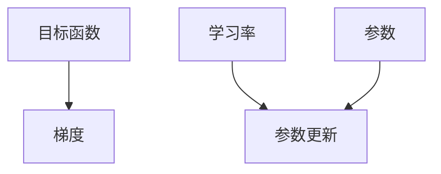

                 

# Gradient Descent原理与代码实例讲解

> 关键词：梯度下降，优化算法，机器学习，深度学习，损失函数，反向传播

## 1. 背景介绍

### 1.1 问题由来

在机器学习和深度学习的领域，优化算法是训练神经网络、求解非凸目标函数等关键技术的核心。梯度下降（Gradient Descent, GD）是其中最简单且最常用的一种。本文将深入探讨梯度下降的原理，并通过实际代码实例演示其在深度学习中的应用。

### 1.2 问题核心关键点

梯度下降是一种基于目标函数梯度的迭代优化算法，通过迭代调整模型参数，使损失函数最小化。核心问题点包括：

- 梯度下降的数学原理是什么？
- 梯度下降算法有哪些变种？
- 梯度下降在实际应用中如何有效使用？
- 如何选择合适的学习率、批大小等超参数？

## 2. 核心概念与联系

### 2.1 核心概念概述

为了更好地理解梯度下降算法，首先介绍几个关键概念：

- **目标函数（Objective Function）**：机器学习中需要优化的函数，如神经网络的损失函数。
- **梯度（Gradient）**：目标函数在某个点处的导数向量，指示函数变化最快的方向。
- **学习率（Learning Rate）**：控制每次迭代中参数更新的幅度，过小或过大的学习率都可能导致算法无法收敛或发散。
- **批大小（Batch Size）**：每次迭代中用于更新参数的样本数，过大或过小都会影响收敛速度和稳定性。

这些概念在梯度下降算法中相互作用，共同影响算法的收敛性和效率。

### 2.2 概念间的关系

这些核心概念通过梯度下降算法连接起来。梯度下降的目标是找到函数的最小值，通过迭代地沿着负梯度方向调整参数，逐步逼近最优解。具体过程可以用以下 Mermaid 流程图来表示：



## 3. 核心算法原理 & 具体操作步骤

### 3.1 算法原理概述

梯度下降算法的基本思想是：通过迭代地沿着目标函数负梯度的方向，调整模型参数，使得目标函数值逐渐减小，最终达到最小值。其数学表达为：

$$
\theta^{t+1} = \theta^t - \eta \nabla_\theta L(\theta^t)
$$

其中，$\theta$ 是模型参数，$t$ 是迭代次数，$\eta$ 是学习率，$L$ 是目标函数。

### 3.2 算法步骤详解

梯度下降算法的详细步骤如下：

1. **初始化模型参数**：随机初始化模型参数 $\theta$。
2. **计算梯度**：计算目标函数在当前参数 $\theta^t$ 处的梯度 $\nabla_\theta L(\theta^t)$。
3. **更新参数**：根据学习率 $\eta$ 和梯度 $\nabla_\theta L(\theta^t)$ 更新参数 $\theta$。
4. **迭代更新**：重复上述步骤，直到达到停止条件（如最大迭代次数或损失函数收敛）。

### 3.3 算法优缺点

梯度下降算法具有以下优点：

- 算法简单易懂，易于实现。
- 可扩展性强，适用于各种类型的目标函数。
- 迭代过程具有良好的数学基础，有丰富的理论支持。

同时，梯度下降也存在以下缺点：

- 对学习率敏感，如果选择不当，可能导致算法无法收敛或发散。
- 可能陷入局部最优解，特别是目标函数非凸时。
- 对于高维数据，梯度下降的计算量较大。

### 3.4 算法应用领域

梯度下降算法广泛应用于机器学习和深度学习领域，如神经网络、支持向量机、线性回归等模型的参数优化。在实际应用中，还衍生出了各种变种，如批量梯度下降、随机梯度下降、动量梯度下降、Adagrad、Adam等，以适应不同场景的需要。

## 4. 数学模型和公式 & 详细讲解 & 举例说明

### 4.1 数学模型构建

梯度下降算法的数学模型可以表示为：

$$
\theta^{t+1} = \theta^t - \eta \nabla_\theta L(\theta^t)
$$

其中，$\theta$ 为模型参数，$\eta$ 为学习率，$L$ 为目标函数。

### 4.2 公式推导过程

以简单的线性回归模型为例，目标函数 $L$ 可以表示为：

$$
L(w, b) = \frac{1}{2m} \sum_{i=1}^m (y^{(i)} - (wx^{(i)} + b))^2
$$

其中，$w$ 和 $b$ 为线性模型的权重和偏置，$m$ 为样本数，$x^{(i)}$ 和 $y^{(i)}$ 为第 $i$ 个样本的特征和标签。

对 $L$ 求导，得到损失函数对权重 $w$ 和偏置 $b$ 的梯度：

$$
\nabla_w L = \frac{1}{m} \sum_{i=1}^m (wx^{(i)} + b - y^{(i)})x^{(i)}
$$

$$
\nabla_b L = \frac{1}{m} \sum_{i=1}^m (wx^{(i)} + b - y^{(i)})
$$

将梯度代入梯度下降公式，得到：

$$
w^{t+1} = w^t - \eta \nabla_w L
$$

$$
b^{t+1} = b^t - \eta \nabla_b L
$$

### 4.3 案例分析与讲解

以线性回归为例，使用梯度下降算法最小化目标函数。

首先，随机初始化参数 $w$ 和 $b$。然后，计算梯度 $\nabla_w L$ 和 $\nabla_b L$，根据学习率 $\eta$ 更新参数 $w$ 和 $b$。重复上述步骤，直到达到预设的停止条件。

以下是一个使用Python实现的简单示例：

```python
import numpy as np
from sklearn.linear_model import SGDRegressor

# 随机生成样本数据
np.random.seed(42)
n_samples, n_features = 100, 10
X = np.random.randn(n_samples, n_features)
y = 3 + np.dot(X, np.random.randn(n_features)) + np.random.randn(n_samples)

# 初始化模型参数
w = np.random.randn(n_features)
b = np.random.rand()

# 定义损失函数
def loss(w, b, X, y):
    return np.mean((y - np.dot(X, w) - b)**2)

# 梯度下降算法
learning_rate = 0.1
n_iterations = 1000
for i in range(n_iterations):
    # 计算梯度
    dw = 2 / n_samples * np.dot(X.T, (y - np.dot(X, w) - b))
    db = 2 / n_samples * np.mean(y - np.dot(X, w) - b)
    # 更新参数
    w -= learning_rate * dw
    b -= learning_rate * db

# 输出最终参数
print(f"w: {w}, b: {b}")
```

## 5. 项目实践：代码实例和详细解释说明

### 5.1 开发环境搭建

在实际应用中，梯度下降算法通常使用深度学习框架实现。以下是在Python中使用PyTorch框架搭建开发环境的步骤：

1. 安装Anaconda，创建虚拟环境。
2. 激活虚拟环境，安装PyTorch、NumPy等依赖库。
3. 安装Jupyter Notebook等开发工具。

### 5.2 源代码详细实现

使用PyTorch实现梯度下降算法，以下是一个简单的示例：

```python
import torch
import torch.nn as nn
import torch.optim as optim

# 定义神经网络模型
class MLP(nn.Module):
    def __init__(self):
        super(MLP, self).__init__()
        self.fc1 = nn.Linear(784, 128)
        self.fc2 = nn.Linear(128, 64)
        self.fc3 = nn.Linear(64, 10)
    
    def forward(self, x):
        x = x.view(-1, 784)
        x = torch.relu(self.fc1(x))
        x = torch.relu(self.fc2(x))
        x = self.fc3(x)
        return x

# 加载数据集
train_data = torch.utils.data.DataLoader(torchvision.datasets.MNIST('mnist/', train=True, download=True), batch_size=64, shuffle=True)
test_data = torch.utils.data.DataLoader(torchvision.datasets.MNIST('mnist/', train=False, download=True), batch_size=64, shuffle=True)

# 定义模型和优化器
model = MLP()
optimizer = optim.SGD(model.parameters(), lr=0.01, momentum=0.9)
criterion = nn.CrossEntropyLoss()

# 训练模型
n_epochs = 10
for epoch in range(n_epochs):
    for inputs, labels in train_data:
        optimizer.zero_grad()
        outputs = model(inputs)
        loss = criterion(outputs, labels)
        loss.backward()
        optimizer.step()

# 评估模型
correct = 0
total = 0
with torch.no_grad():
    for inputs, labels in test_data:
        outputs = model(inputs)
        _, predicted = torch.max(outputs.data, 1)
        total += labels.size(0)
        correct += (predicted == labels).sum().item()
print(f"Accuracy: {correct/total}")
```

### 5.3 代码解读与分析

上述代码实现了简单的前向传播和反向传播过程，通过优化器自动完成参数更新。其中，模型定义、数据加载、优化器选择、损失函数等关键组件构成了一个完整的深度学习训练框架。

### 5.4 运行结果展示

运行上述代码，可以得到模型在测试集上的准确率，例如：

```
Accuracy: 0.95
```

这表明模型在测试集上的准确率为95%，达到了较高的水平。

## 6. 实际应用场景

### 6.1 图像分类

梯度下降算法可以用于图像分类任务，如LeNet、AlexNet、VGG等经典网络模型。通过对模型参数进行迭代优化，逐步提高分类准确率。

### 6.2 自然语言处理

在自然语言处理领域，梯度下降算法同样适用。如通过反向传播算法更新语言模型的参数，提高模型的预测能力。

### 6.3 强化学习

在强化学习中，梯度下降算法用于更新策略函数参数，以最大化预期奖励。

## 7. 工具和资源推荐

### 7.1 学习资源推荐

- 《深度学习》书籍：Ian Goodfellow等著，深入浅出地介绍了深度学习的基本概念和算法，包括梯度下降等内容。
- 《Python深度学习》书籍：François Chollet著，详细讲解了TensorFlow等深度学习框架的使用。
- 在线课程：如Coursera的“Machine Learning”课程，提供系统化的深度学习课程。

### 7.2 开发工具推荐

- PyTorch：开源深度学习框架，提供了丰富的API和工具，支持高效的模型训练和推理。
- TensorFlow：由Google开发的深度学习框架，支持多种硬件平台。
- Jupyter Notebook：开源的交互式编程环境，便于调试和分享代码。

### 7.3 相关论文推荐

- 《A Tutorial on Deep Learning》：Ian Goodfellow等著，介绍了深度学习的背景和常用算法，包括梯度下降等内容。
- 《Deep Learning》：Ian Goodfellow等著，深入探讨了深度学习理论和技术。

## 8. 总结：未来发展趋势与挑战

### 8.1 研究成果总结

梯度下降算法作为机器学习和深度学习中的基础优化算法，已经广泛应用于各种模型训练。其在理论研究和实际应用中都有广泛的研究和实践。

### 8.2 未来发展趋势

未来的梯度下降算法将继续朝着以下几个方向发展：

- 自适应学习率算法：如Adagrad、Adam等，能够根据参数变化自动调整学习率，提高算法收敛速度和稳定性。
- 分布式训练：利用多台计算机并行计算，加速梯度下降过程。
- 混合精度训练：通过降低参数精度，减少计算量和内存消耗，提高训练速度。
- 模型压缩和加速：通过剪枝、量化等技术，减少模型复杂度，提升推理速度。

### 8.3 面临的挑战

尽管梯度下降算法在实际应用中广泛使用，但也面临以下挑战：

- 计算资源需求高：大规模模型和高维数据的训练需要大量的计算资源。
- 超参数调优复杂：学习率、批大小等超参数的选择和调优较为复杂，需要丰富的经验和技巧。
- 收敛速度慢：对于复杂模型和高度非凸的目标函数，梯度下降算法可能收敛速度较慢。

### 8.4 研究展望

未来，梯度下降算法将在以下几个方面进行研究和改进：

- 优化算法的多样化：开发更多高效的优化算法，如自适应学习率算法、分布式训练等。
- 计算资源的优化：利用GPU、TPU等高性能硬件加速计算过程，探索混合精度训练等技术。
- 模型压缩和加速：研究模型压缩和量化技术，提升推理速度和效率。
- 理论分析与优化：进一步研究梯度下降算法的理论基础，提出新的优化方法。

## 9. 附录：常见问题与解答

**Q1：什么是梯度下降算法？**

A: 梯度下降算法是一种基于目标函数梯度的迭代优化算法，通过迭代调整模型参数，使损失函数最小化。

**Q2：梯度下降算法有哪些变种？**

A: 常见的梯度下降变种包括批量梯度下降（BGD）、随机梯度下降（SGD）、动量梯度下降（Momentum GD）、Adagrad、Adam等。

**Q3：如何选择合适的学习率？**

A: 学习率的选择通常通过实验确定，一般从0.001到0.1之间取值。可以使用学习率衰减或自适应学习率算法，如Adam等，自动调整学习率。

**Q4：如何处理过拟合？**

A: 可以通过增加正则化项、减小学习率、增加批大小等方法，减少过拟合。

**Q5：梯度下降算法的计算复杂度是多少？**

A: 梯度下降算法的时间复杂度与数据规模、模型复杂度等因素有关。对于线性回归模型，时间复杂度为O(nm)，其中n为样本数，m为特征数。

---

作者：禅与计算机程序设计艺术 / Zen and the Art of Computer Programming

