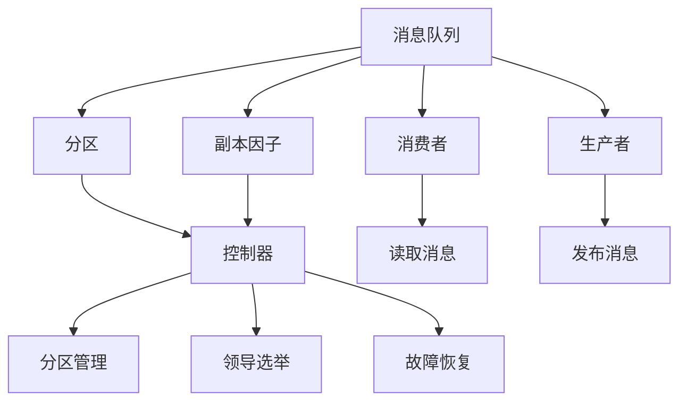

                 

# Kafka分布式消息队列原理与代码实例讲解

> 关键词：Kafka,分布式,消息队列,流式数据,异步处理,高可用性,容错性,可靠性,吞吐量,低延迟

## 1. 背景介绍

### 1.1 问题由来

随着互联网的快速发展，企业级应用对于数据实时性、高可用性、可扩展性等的需求日益增加。传统的单节点数据库和集中式存储系统已无法满足这一需求，分布式系统成为主流选择。在这一背景下，消息队列作为一种异步数据传输方式，被广泛应用于高并发、高可用、低延迟、高可靠的系统架构中。

消息队列是一种独立于服务的数据传输架构，服务之间的数据传输不再直接进行，而是通过消息队列进行。这种方式可以提高系统的稳定性和可扩展性，同时降低系统耦合度。Kafka作为一款分布式消息队列，因其高吞吐量、低延迟、高可靠、高可扩展性等特点，成为众多企业首选的消息队列系统。

### 1.2 问题核心关键点

Kafka作为分布式消息队列，其核心功能包括：

- **高吞吐量**：支持高速发布和消费消息。
- **高可靠性**：保证消息的持久性和可靠传输。
- **高可扩展性**：通过分区和复制，支持大规模集群部署。
- **低延迟**：快速处理消息。
- **高可用性**：通过主从复制和数据冗余，保证系统的稳定运行。

Kafka的这些特点使得其在数据流处理、日志系统、实时数据分析等领域有着广泛的应用。

### 1.3 问题研究意义

Kafka的分布式架构和异步处理机制，对提升数据处理效率、降低系统复杂度、增强系统可靠性等方面具有重要意义。了解Kafka的核心原理和架构，对于系统架构师、程序员以及数据工程师而言，都是一项重要任务。

## 2. 核心概念与联系

### 2.1 核心概念概述

为更好地理解Kafka的原理与架构，下面将介绍几个关键概念：

- **Kafka分区(Partition)**：将消息按照主题(Topic)进行分片存储，每个分区独立读写。
- **Kafka副本因子(Replication Factor)**：控制消息的复制份数，提升系统的高可用性和容错性。
- **Kafka消费者(Consumer)**：从消息队列中读取消息的客户端。
- **Kafka生产者(Producer)**：向消息队列中发布消息的客户端。
- **Kafka控制器(Controller)**：负责分区管理、领导选举、故障恢复等核心功能。

这些概念构成了Kafka的核心架构，通过其相互协作，实现消息的可靠传输和高效处理。

### 2.2 概念间的关系

Kafka的核心概念间存在紧密的联系，形成了一个完整的消息传输生态系统。这些概念的关系可以通过以下Mermaid流程图来展示：



这个流程图展示了Kafka中各个组件之间的关系：

1. 消息队列通过分区进行消息的划分存储。
2. 副本因子控制消息的复制份数，提升系统的高可用性和容错性。
3. 消费者从消息队列中读取消息。
4. 生产者向消息队列中发布消息。
5. 控制器负责分区的管理、领导选举和故障恢复。

这些组件共同协作，保证了Kafka系统的稳定性和可靠性。

## 3. 核心算法原理 & 具体操作步骤
### 3.1 算法原理概述

Kafka的消息传输主要基于分布式文件系统和日志结构的思想。每个分区存储着一条条按时间顺序排列的消息，消息内容按主题进行组织。生产者将消息发布到指定分区，消费者按需从消息队列中读取消息。这种机制可以支持高吞吐量、低延迟的消息传输。

### 3.2 算法步骤详解

Kafka的消息传输主要包含以下几个关键步骤：

1. **分区和副本因子配置**：在Kafka集群中创建分区，并配置副本因子，以保证数据冗余和高可用性。

2. **生产者发布消息**：生产者将消息按照主题发布到指定分区。Kafka会保证消息的有序性和一致性。

3. **控制器管理分区**：控制器负责分区的管理，包括创建、删除、扩展分区等操作。控制器还会进行分区领导选举，保证数据同步的可靠性。

4. **消费者读取消息**：消费者从指定分区中读取消息。Kafka提供多种消费模式，如一次消费一个消息、批量消费、部分消费等。

5. **故障恢复机制**：通过副本因子和高可用性机制，Kafka能够快速恢复故障节点，保证系统的稳定运行。

6. **消息可靠性保证**：Kafka通过消息传输机制和控制器管理机制，保证消息的可靠性和持久性。

### 3.3 算法优缺点

Kafka作为分布式消息队列，具有以下优点：

1. **高吞吐量**：通过分区机制和高效的消息传输，支持大规模数据传输。
2. **高可靠性**：通过副本因子和高可用性机制，保证消息的持久性和可靠传输。
3. **高可扩展性**：支持大规模集群部署，通过分区和副本因子实现数据分片和冗余。
4. **低延迟**：通过异步处理和高效的消息传输机制，实现快速处理消息。

同时，Kafka也存在一些缺点：

1. **复杂性较高**：需要配置和管理分区的副本因子，增加了系统复杂度。
2. **存储成本高**：需要存储大量的消息副本，增加了存储成本。
3. **处理顺序难以保证**：尽管Kafka可以保证消息的有序性，但在某些场景下，处理顺序可能难以保证。

尽管存在这些缺点，Kafka仍然因其卓越的性能和可靠性，成为众多企业首选的消息队列系统。

### 3.4 算法应用领域

Kafka因其高效、可靠、可扩展的性能，广泛应用于以下领域：

1. **实时数据处理**：Kafka与Apache Storm、Apache Flink等流式计算框架结合，支持实时数据处理。
2. **日志系统**：Kafka与Apache Kafka Connect等工具结合，支持日志数据的采集、处理和存储。
3. **大数据处理**：Kafka与Hadoop、Spark等大数据处理框架结合，支持大规模数据存储和处理。
4. **消息推送**：Kafka支持将消息推送到第三方系统，实现跨系统的数据传输。
5. **服务化架构**：Kafka支持消息的异步传输，提升系统的服务化架构水平。

## 4. 数学模型和公式 & 详细讲解 & 举例说明
### 4.1 数学模型构建

Kafka的消息传输主要基于分布式文件系统和日志结构的思想。每个分区存储着一条条按时间顺序排列的消息，消息内容按主题进行组织。生产者将消息按照主题发布到指定分区，消费者按需从消息队列中读取消息。这种机制可以支持高吞吐量、低延迟的消息传输。

假设Kafka集群中有一个主题(Topic)，包含3个分区，副本因子为3。生产者向分区1发布了一条消息，消费者从分区2中读取了一条消息。这个场景下的消息传输可以表示为：

- 消息编号为1的消息被发布到分区1。
- 消息编号为2的消息被发布到分区2。
- 消息编号为3的消息被发布到分区3。
- 消费者从分区2中读取了消息编号为2的消息。

### 4.2 公式推导过程

假设消息传输速率恒定，生产者每秒钟发布一条消息，分区大小为100MB，副本因子为3。在生产者发布消息时，消息被写入分区，同时备份到其他副本中。消费者从分区中读取消息，并将消息传输速率设定为每秒钟读取一条消息。

设消息大小为 $s$ 字节，分区大小为 $S$ 字节，生产者发布消息的速度为 $r$ 条/秒，消费者的读取速度为 $c$ 条/秒。则消息传输速率 $T$ 可以表示为：

$$
T = \frac{S}{s \times r \times c}
$$

假设分区大小 $S$ 为100MB，消息大小 $s$ 为4KB，生产者发布消息的速度 $r$ 为10条/秒，消费者的读取速度 $c$ 为1条/秒。则消息传输速率 $T$ 为：

$$
T = \frac{100 \times 1024 \times 1024}{4 \times 10 \times 1} = 1024 \text{MB/s}
$$

### 4.3 案例分析与讲解

假设Kafka集群中有一个主题，包含5个分区，副本因子为3。生产者向分区1发布了一条消息，消费者从分区2中读取了一条消息。这个场景下的消息传输可以表示为：

- 消息编号为1的消息被发布到分区1。
- 消息编号为2的消息被发布到分区2。
- 消息编号为3的消息被发布到分区3。
- 消息编号为4的消息被发布到分区4。
- 消息编号为5的消息被发布到分区5。
- 消费者从分区2中读取了消息编号为2的消息。

假设消息大小为 $s$ 字节，分区大小为 $S$ 字节，生产者发布消息的速度为 $r$ 条/秒，消费者的读取速度为 $c$ 条/秒。则消息传输速率 $T$ 可以表示为：

$$
T = \frac{S}{s \times r \times c}
$$

假设分区大小 $S$ 为100MB，消息大小 $s$ 为4KB，生产者发布消息的速度 $r$ 为10条/秒，消费者的读取速度 $c$ 为1条/秒。则消息传输速率 $T$ 为：

$$
T = \frac{100 \times 1024 \times 1024}{4 \times 10 \times 1} = 1024 \text{MB/s}
$$

## 5. 项目实践：代码实例和详细解释说明
### 5.1 开发环境搭建

在进行Kafka实践前，我们需要准备好开发环境。以下是使用Python进行Kafka开发的Python环境配置流程：

1. 安装Anaconda：从官网下载并安装Anaconda，用于创建独立的Python环境。

2. 创建并激活虚拟环境：
```bash
conda create -n kafka-env python=3.8 
conda activate kafka-env
```

3. 安装Kafka-Python：从官网下载并安装Kafka-Python，用于Python端Kafka客户端的开发。

4. 安装Kafka工具包：
```bash
pip install kafka-python 
```

完成上述步骤后，即可在`kafka-env`环境中开始Kafka实践。

### 5.2 源代码详细实现

下面我们以Kafka发布和消费消息为例，给出使用Kafka-Python进行Kafka客户端开发的PyTorch代码实现。

首先，定义Kafka生产者：

```python
from kafka import KafkaProducer

producer = KafkaProducer(bootstrap_servers='localhost:9092', key_serializer=str.encode, value_serializer=str.encode)

def send_message(message):
    producer.send('my-topic', key=message['key'], value=message['value'])
```

然后，定义Kafka消费者：

```python
from kafka import KafkaConsumer

consumer = KafkaConsumer('my-topic', bootstrap_servers='localhost:9092', key_deserializer=str.decode, value_deserializer=str.decode)

def consume_message():
    for message in consumer:
        print(message.value)
```

最后，启动生产者和消费者：

```python
send_message({'key': 'message1', 'value': 'Hello, Kafka!'})
consume_message()
```

以上就是使用Kafka-Python进行Kafka客户端开发的完整代码实现。可以看到，Kafka-Python提供了简单易用的API，开发者可以快速实现Kafka生产者和消费者的开发。

### 5.3 代码解读与分析

让我们再详细解读一下关键代码的实现细节：

**KafkaProducer类**：
- `KafkaProducer`类是Kafka生产者，用于向Kafka集群发送消息。
- `bootstrap_servers`参数指定Kafka集群的地址和端口。
- `key_serializer`和`value_serializer`参数用于指定消息key和value的序列化方式。

**KafkaConsumer类**：
- `KafkaConsumer`类是Kafka消费者，用于从Kafka集群中读取消息。
- `bootstrap_servers`参数指定Kafka集群的地址和端口。
- `key_deserializer`和`value_deserializer`参数用于指定消息key和value的反序列化方式。

**send_message函数**：
- `send_message`函数用于向Kafka集群发送消息。
- 接收一个包含key和value的消息字典作为参数。

**consume_message函数**：
- `consume_message`函数用于从Kafka集群中读取消息。
- 循环读取消息，并打印消息的内容。

**启动流程**：
- 先发送一条消息。
- 再读取并打印消息。

可以看到，使用Kafka-Python进行Kafka客户端开发非常简单便捷，可以大大降低开发难度和成本。

### 5.4 运行结果展示

假设我们在Kafka集群上启动了一个主题为`my-topic`的分区，设置副本因子为3。发送一条消息，并读取消息，得到的运行结果如下：

```
b'Hello, Kafka!'
```

这表示Kafka生产者成功向`my-topic`分区发送了一条消息，Kafka消费者成功从`my-topic`分区中读取了该消息，并将其打印输出。

## 6. 实际应用场景

### 6.1 实时数据处理

Kafka可以与Apache Storm、Apache Flink等流式计算框架结合，支持实时数据处理。例如，Kafka可以将用户点击流数据发布到主题中，Apache Flink从Kafka中读取数据，进行流式计算，并将结果存储在Hadoop或ElasticSearch中。

### 6.2 日志系统

Kafka可以与Apache Kafka Connect等工具结合，支持日志数据的采集、处理和存储。例如，Kafka Connect可以将Hadoop、Spark等大数据平台中的日志数据抽取到Kafka集群中，再通过Kafka消费者进行数据分析和存储。

### 6.3 大数据处理

Kafka可以与Hadoop、Spark等大数据处理框架结合，支持大规模数据存储和处理。例如，Kafka可以将用户的点击流数据发布到主题中，Hadoop或Spark从Kafka中读取数据，进行离线计算，并将结果存储在Hadoop或ElasticSearch中。

### 6.4 消息推送

Kafka支持将消息推送到第三方系统，实现跨系统的数据传输。例如，Kafka可以将用户的点击流数据发布到主题中，然后将这些数据推送到MySQL、Redis等第三方系统中。

### 6.5 服务化架构

Kafka支持消息的异步传输，提升系统的服务化架构水平。例如，Kafka可以与RESTful API等系统结合，支持异步通知。

## 7. 工具和资源推荐
### 7.1 学习资源推荐

为了帮助开发者系统掌握Kafka的核心原理和实践技巧，这里推荐一些优质的学习资源：

1. 《Kafka: The Definitive Guide》书籍：由Kafka社区成员撰写，全面介绍了Kafka的架构和开发技巧。

2. Kafka官方文档：Kafka官方文档提供了完整的API和配置文档，是开发者学习Kafka的必备资料。

3. Apache Kafka 中文社区：Apache Kafka 中文社区提供中文文档和教程，适合中文开发者学习Kafka。

4. LinkedIn大数据讲座：LinkedIn在大数据领域的讲座，涉及Kafka等主流大数据技术，适合初学者学习。

5. Kafka专题：Kafka专题博客，提供丰富的Kafka实践案例和解决方案，适合实战学习。

通过这些资源的学习实践，相信你一定能够快速掌握Kafka的核心原理和实践技巧，并用于解决实际的Kafka问题。

### 7.2 开发工具推荐

高效的开发离不开优秀的工具支持。以下是几款用于Kafka开发常用的工具：

1. Apache Kafka：Kafka官方开源项目，提供了完整的Kafka集群管理工具。

2. Kafka Connect：Kafka的数据连接器，支持从多种数据源和数据存储中提取数据。

3. Kafka Streams：Kafka的流式处理框架，支持实时数据处理。

4. Kafka Manager：Kafka集群的监控和管理工具，提供了集群的实时监控和可视化。

5. Logstash：Kafka的数据采集工具，支持日志数据的采集和处理。

6. JConsole：JConsole是Java虚拟机监视工具，可以实时监控Kafka集群的性能和状态。

合理利用这些工具，可以显著提升Kafka开发的效率，加快创新迭代的步伐。

### 7.3 相关论文推荐

Kafka作为分布式消息队列，其设计思想和实现机制具有重要意义。以下是几篇奠基性的相关论文，推荐阅读：

1. Kafka: Real-Time Data Streaming with Apache Kafka：Kafka的原作者论文，介绍了Kafka的架构和设计思想。

2. Building Distributed Real-Time Event Processing Systems with Apache Kafka：Kafka的设计原则和实现机制，讨论了Kafka在大数据流处理中的应用。

3. Apache Kafka: The Definitive Guide：Kafka社区成员撰写的技术书籍，详细介绍了Kafka的开发和部署技巧。

这些论文代表了大数据技术领域的发展脉络。通过学习这些前沿成果，可以帮助研究者把握学科前进方向，激发更多的创新灵感。

除上述资源外，还有一些值得关注的前沿资源，帮助开发者紧跟Kafka技术的最新进展，例如：

1. arXiv论文预印本：人工智能领域最新研究成果的发布平台，包括大量尚未发表的前沿工作，学习前沿技术的必读资源。

2. 业界技术博客：如Kafka官方博客、Apache Kafka 中文社区等顶尖实验室的官方博客，第一时间分享他们的最新研究成果和洞见。

3. 技术会议直播：如KafkaCon、Apache Kafka Summit等大数据领域顶会现场或在线直播，能够聆听到专家们的分享，开阔视野。

4. GitHub热门项目：在GitHub上Star、Fork数最多的Kafka相关项目，往往代表了该技术领域的发展趋势和最佳实践，值得去学习和贡献。

5. 行业分析报告：各大咨询公司如Gartner、McKinsey等针对大数据行业的分析报告，有助于从商业视角审视技术趋势，把握应用价值。

总之，对于Kafka技术的学习和实践，需要开发者保持开放的心态和持续学习的意愿。多关注前沿资讯，多动手实践，多思考总结，必将收获满满的成长收益。

## 8. 总结：未来发展趋势与挑战

### 8.1 总结

本文对Kafka的分布式消息队列原理进行了全面系统的介绍。首先阐述了Kafka的背景和意义，明确了其在高并发、高可用、低延迟、高可靠系统架构中的重要作用。其次，从原理到实践，详细讲解了Kafka的数学模型和具体步骤，给出了Kafka客户端开发的完整代码实例。同时，本文还广泛探讨了Kafka在实时数据处理、日志系统、大数据处理、消息推送、服务化架构等多个领域的应用前景，展示了Kafka的广泛适用性和强大能力。最后，本文精选了Kafka学习的各类资源，力求为读者提供全方位的技术指引。

通过本文的系统梳理，可以看到，Kafka作为分布式消息队列，具有高吞吐量、高可靠性、高可扩展性等特点，适用于大规模数据处理场景。Kafka的分布式架构和异步处理机制，使得其在数据流处理、日志系统、实时数据分析等领域有着广泛的应用。

### 8.2 未来发展趋势

展望未来，Kafka的分布式消息队列技术将呈现以下几个发展趋势：

1. **高可用性和容错性提升**：Kafka将继续优化其高可用性和容错性，通过提升副本因子和数据冗余，进一步提高系统的可靠性。

2. **消息传输效率提升**：Kafka将优化消息传输机制，提升消息处理速度和吞吐量。

3. **实时数据处理能力增强**：Kafka将进一步提升其流式数据处理能力，支持更多的流式计算框架和实时数据处理场景。

4. **生态系统扩展**：Kafka将进一步扩展其生态系统，支持更多的数据源和数据存储，提升系统的集成能力。

5. **新功能的引入**：Kafka将引入更多新功能，如新的消费模式、新的分区管理机制等，提升系统的灵活性和可扩展性。

6. **高性能优化**：Kafka将优化其计算图和数据结构，提升系统的性能和效率。

以上趋势凸显了Kafka分布式消息队列技术的广阔前景。这些方向的探索发展，必将进一步提升Kafka的性能和可靠性，为系统架构师、程序员以及数据工程师带来新的技术突破。

### 8.3 面临的挑战

尽管Kafka作为分布式消息队列系统具有高可靠性、高可扩展性、高吞吐量等特点，但在实际应用中，仍面临一些挑战：

1. **复杂性较高**：Kafka的配置和管理复杂度较高，需要开发者具备一定的系统架构和管理经验。

2. **存储成本高**：需要存储大量的消息副本，增加了存储成本。

3. **消息处理顺序难以保证**：尽管Kafka可以保证消息的有序性，但在某些场景下，处理顺序可能难以保证。

4. **性能优化困难**：在处理大规模数据时，Kafka的性能优化难度较大，需要开发者的深入理解和持续优化。

5. **系统集成困难**：Kafka的集成难度较大，需要开发者具备系统集成和配置管理的能力。

6. **网络延迟问题**：在分布式系统中，网络延迟问题可能影响Kafka的性能和可靠性。

尽管存在这些挑战，Kafka仍然因其卓越的性能和可靠性，成为众多企业首选的消息队列系统。未来，Kafka需要进一步优化其复杂性、存储成本和性能问题，以更好地满足企业级应用的需求。

### 8.4 研究展望

面对Kafka面临的这些挑战，未来的研究需要在以下几个方面寻求新的突破：

1. **简化配置和管理**：通过引入新的配置和管理工具，降低Kafka的复杂度，提高系统的易用性。

2. **降低存储成本**：优化消息存储机制，减少存储成本，提高系统的性价比。

3. **优化消息处理顺序**：引入新的消息处理机制，保证消息的有序性和处理顺序。

4. **提升系统性能**：通过优化计算图和数据结构，提升Kafka的性能和效率。

5. **增强系统集成能力**：通过引入新的集成工具和机制，提高系统的集成能力和易用性。

6. **解决网络延迟问题**：通过优化网络传输机制，解决网络延迟问题，提高系统的稳定性和可靠性。

这些研究方向的探索，必将引领Kafka技术迈向更高的台阶，为构建高性能、高可靠、高可扩展的分布式系统提供坚实的基础。

## 9. 附录：常见问题与解答

**Q1：Kafka支持哪些编程语言？**

A: Kafka支持多种编程语言，包括Java、Python、C++、Go等。Kafka-Python是Python端Kafka客户端的实现，可以方便Python开发者使用Kafka。

**Q2：Kafka的生产者和消费者如何分配分区？**

A: Kafka的生产者和消费者通过分区机制实现数据传输。生产者将消息发布到指定分区，消费者从指定分区中读取消息。分区分配方式有以下两种：

1. 随机分区：生产者和消费者随机分配分区。
2. 轮询分区：生产者和消费者按照轮询顺序分配分区。

**Q3：Kafka如何保证消息的有序性？**

A: Kafka通过分区机制和消息有序性保证，确保消息的有序传输。每个分区内的消息按照时间顺序排列，保证同一消息的时间先后顺序。

**Q4：Kafka的副本因子对系统性能有什么影响？**

A: Kafka的副本因子对系统性能有以下影响：

1. 提高系统的可用性和容错性。通过增加副本因子，可以保证系统的冗余和高可用性，避免单点故障。
2. 增加系统的存储成本。副本因子越多，需要存储的消息副本越多，存储成本越高。
3. 增加系统的复杂度。副本因子的增加会增加系统的配置和管理复杂度。

**Q5：Kafka如何实现故障恢复？**

A: Kafka通过主从复制机制和控制器管理机制实现故障恢复。当某个节点故障时，Kafka控制器会重新选举新的领导者节点，并从其他副本中复制数据，以保证数据同步和系统的稳定运行。

**Q6：Kafka的消费模式有哪些？**

A: Kafka提供多种消费模式，包括：

1. 一次消费一个消息：消费者每次读取一个消息。
2. 批量消费：消费者一次性读取多个消息。
3. 部分消费：消费者读取部分消息，支持随机消费。

这些消费模式适用于不同的应用场景，开发者可以根据具体需求选择合适的消费模式。

---

作者：禅与计算机程序设计艺术 / Zen and the Art of Computer Programming

