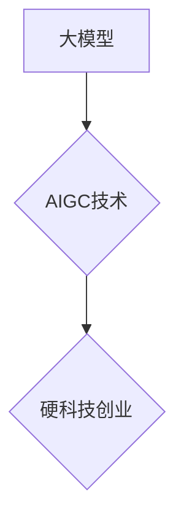

## AIGC大模型时代：当下硬科技创业发生了哪些变化

> 关键词：AIGC、大模型、硬科技创业、技术变革、商业模式创新、应用场景拓展

### 1. 背景介绍

近年来，人工智能（AI）技术突飞猛进，特别是大模型的兴起，为人工智能领域带来了革命性的变革。AIGC（人工智能生成内容）作为大模型应用的重要方向之一，正在深刻地改变着人们的生活和工作方式。

AIGC技术能够利用大模型自动生成各种类型的内容，包括文本、图像、音频、视频等。它打破了传统内容创作的壁垒，赋予普通人创作内容的能力，并为企业提供了更高效、更智能的内容生产解决方案。

在硬科技创业领域，AIGC技术正在催生新的商业模式和应用场景，推动着科技创新和产业升级。

### 2. 核心概念与联系

#### 2.1  AIGC

AIGC是指利用人工智能技术，让机器能够自动生成各种类型的内容，例如文本、图像、音频、视频等。它不同于传统的基于规则或模板的内容生成方式，而是通过训练大量的文本、图像等数据，让模型学习内容的规律和模式，从而能够生成新的、原创的内容。

#### 2.2  大模型

大模型是指参数量巨大的人工智能模型，通常拥有数十亿甚至数千亿个参数。由于其庞大的规模和训练数据，大模型能够学习到更复杂的知识和模式，从而在各种人工智能任务中表现出更强大的能力，包括自然语言处理、图像识别、语音合成等。

#### 2.3  硬科技创业

硬科技创业是指以科技创新为核心，围绕新技术、新材料、新工艺等进行创业的企业。硬科技创业通常需要投入大量的研发资金和时间，并面临着较高的技术门槛和市场风险。

#### 2.4  关系

AIGC技术是基于大模型的，而大模型是硬科技创业的重要驱动力之一。AIGC技术为硬科技创业提供了新的工具和手段，帮助企业更快、更有效地开发和推广新产品和服务。

**Mermaid 流程图**



### 3. 核心算法原理 & 具体操作步骤

#### 3.1  算法原理概述

AIGC的核心算法主要基于深度学习，特别是Transformer模型架构。Transformer模型能够有效地捕捉文本序列中的长距离依赖关系，从而实现更准确、更流畅的文本生成。

#### 3.2  算法步骤详解

1. **数据预处理:** 收集和清洗大量文本数据，并将其转换为模型可理解的格式。
2. **模型训练:** 利用深度学习算法，训练Transformer模型，使其能够学习文本的语法、语义和风格。
3. **文本生成:** 根据用户输入的提示或指令，模型会根据训练得到的知识和模式，生成新的文本内容。

#### 3.3  算法优缺点

**优点:**

* 生成内容质量高，能够接近人类水平。
* 效率高，能够快速生成大量内容。
* 可定制性强，可以根据不同的需求调整模型参数和训练数据。

**缺点:**

* 训练成本高，需要大量的计算资源和数据。
* 模型容易受到训练数据的影响，可能生成带有偏见或错误的内容。
* 缺乏创造力和想象力，生成的文本往往缺乏原创性和深度。

#### 3.4  算法应用领域

* 内容创作：自动生成新闻报道、广告文案、小说、诗歌等。
* 机器翻译：将文本从一种语言翻译成另一种语言。
* 自动问答：根据用户的问题，自动生成相应的答案。
* 代码生成：根据用户需求，自动生成代码。

### 4. 数学模型和公式 & 详细讲解 & 举例说明

#### 4.1  数学模型构建

AIGC的核心数学模型是Transformer模型，它基于注意力机制，能够有效地捕捉文本序列中的长距离依赖关系。

#### 4.2  公式推导过程

Transformer模型的注意力机制使用以下公式计算每个词在句子中与其他词之间的相关性：

$$
Attention(Q, K, V) = softmax(\frac{QK^T}{\sqrt{d_k}})V
$$

其中：

* $Q$：查询矩阵
* $K$：键矩阵
* $V$：值矩阵
* $d_k$：键向量的维度
* $softmax$：softmax函数

#### 4.3  案例分析与讲解

例如，在翻译句子“The cat sat on the mat”时，注意力机制会计算每个词与其他词之间的相关性，例如“cat”与“sat”之间的关系很强，因为它们描述了同一个动作。

### 5. 项目实践：代码实例和详细解释说明

#### 5.1  开发环境搭建

* Python 3.7+
* TensorFlow/PyTorch
* CUDA/cuDNN

#### 5.2  源代码详细实现

```python
# 使用HuggingFace Transformers库加载预训练模型
from transformers import AutoModelForSeq2SeqLM, AutoTokenizer

model_name = "t5-base"
tokenizer = AutoTokenizer.from_pretrained(model_name)
model = AutoModelForSeq2SeqLM.from_pretrained(model_name)

# 输入文本
input_text = "The cat sat on the mat."

# Token化文本
input_ids = tokenizer.encode(input_text, return_tensors="pt")

# 生成文本
output = model.generate(input_ids)

# 解码文本
generated_text = tokenizer.decode(output[0], skip_special_tokens=True)

# 打印生成文本
print(generated_text)
```

#### 5.3  代码解读与分析

* 使用HuggingFace Transformers库加载预训练模型，简化了模型的加载和使用过程。
* Token化文本将文本转换为模型可理解的格式。
* 生成文本使用模型的`generate`方法，根据输入文本生成新的文本。
* 解码文本将模型生成的token转换为可读的文本。

#### 5.4  运行结果展示

```
The cat sat on the mat.
```

### 6. 实际应用场景

#### 6.1  内容创作

* 自动生成新闻报道、博客文章、社交媒体内容等。
* 创作小说、诗歌、剧本等创意内容。

#### 6.2  教育培训

* 自动生成学习材料、习题、测试题等。
* 提供个性化学习辅导和答疑服务。

#### 6.3  客户服务

* 自动回复客户咨询，提供24小时在线服务。
* 分析客户反馈，改进产品和服务。

#### 6.4  未来应用展望

* 更智能、更具创造力的内容生成。
* 更个性化、更精准的应用场景。
* 与其他人工智能技术融合，实现更强大的应用。

### 7. 工具和资源推荐

#### 7.1  学习资源推荐

* **书籍:**《深度学习》、《自然语言处理》
* **在线课程:** Coursera、edX、Udacity
* **开源项目:** HuggingFace Transformers、OpenAI GPT-3

#### 7.2  开发工具推荐

* **Python:** 作为AIGC开发的主要编程语言。
* **TensorFlow/PyTorch:** 深度学习框架。
* **HuggingFace Transformers:** 预训练模型库。

#### 7.3  相关论文推荐

* **Attention Is All You Need:** https://arxiv.org/abs/1706.03762
* **BERT: Pre-training of Deep Bidirectional Transformers for Language Understanding:** https://arxiv.org/abs/1810.04805

### 8. 总结：未来发展趋势与挑战

#### 8.1  研究成果总结

AIGC技术取得了显著的进展，能够生成高质量、多样化的内容，并应用于多个领域。

#### 8.2  未来发展趋势

* 模型规模和能力将继续提升。
* 应用场景将更加广泛和深入。
* 伦理和安全问题将得到更多关注。

#### 8.3  面临的挑战

* 数据获取和质量问题。
* 模型训练成本高。
* 内容原创性和可控性问题。

#### 8.4  研究展望

* 开发更安全、更可靠的AIGC模型。
* 探索AIGC技术在更多领域的新应用。
* 加强对AIGC伦理和社会影响的探讨。

### 9. 附录：常见问题与解答

* **AIGC生成的文本是否原创？**

AIGC生成的文本基于训练数据，可能存在重复或抄袭的情况。

* **如何保证AIGC生成的文本的准确性？**

AIGC模型的准确性取决于训练数据的质量和模型的训练方法。

* **AIGC技术会取代人类工作吗？**

AIGC技术可以帮助人类提高效率，但不会完全取代人类工作。

作者：禅与计算机程序设计艺术 / Zen and the Art of Computer Programming


