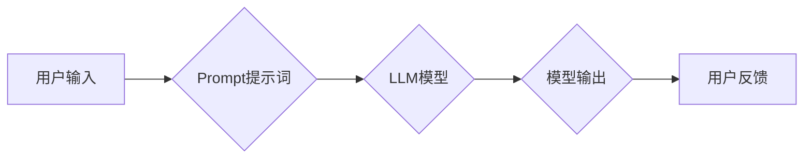

## AI大模型Prompt提示词最佳实践：用简单语言解释具体话题

> 关键词：AI大模型、Prompt提示词、自然语言处理、文本生成、模型训练、最佳实践、应用场景

## 1. 背景介绍

近年来，大规模语言模型（LLM）在自然语言处理领域取得了令人瞩目的成就。从文本生成、翻译到问答和代码编写，LLM展现出强大的能力，为我们带来了许多新的可能性。然而，LLM的性能很大程度上取决于输入的Prompt提示词。一个精心设计的Prompt可以引导模型生成更准确、更相关的输出，而一个模糊不清的Prompt则可能导致模型产生混乱或无关的结果。因此，学习如何编写高质量的Prompt提示词对于充分利用LLM的潜力至关重要。

## 2. 核心概念与联系

**2.1  Prompt提示词**

Prompt提示词是用户与LLM交互的关键信息，它包含了用户想要模型完成的任务或生成的内容的描述。Prompt可以是简单的文本指令，也可以是复杂的场景描述，甚至包含示例数据。

**2.2  LLM模型架构**

LLM通常基于Transformer网络架构，它利用自注意力机制学习语言的上下文关系，从而能够理解和生成更复杂的文本。

**2.3  Prompt工程**

Prompt工程是指设计、优化和评估Prompt提示词的过程，旨在提高LLM的性能和准确性。

**Mermaid 流程图**



## 3. 核心算法原理 & 具体操作步骤

**3.1  算法原理概述**

LLM的训练过程本质上是一个预测下一个词的概率的过程。通过大量的文本数据训练，模型学习了语言的语法规则和语义关系，从而能够根据输入的Prompt提示词预测最合适的后续词，最终生成完整的文本。

**3.2  算法步骤详解**

1. **数据预处理:** 将文本数据进行清洗、分词、标记等操作，使其适合模型训练。
2. **模型训练:** 使用训练数据训练LLM模型，通过反向传播算法不断调整模型参数，使其能够准确预测下一个词的概率。
3. **Prompt设计:** 根据需要设计合适的Prompt提示词，引导模型生成目标文本。
4. **模型推理:** 将Prompt提示词输入到训练好的LLM模型中，模型根据训练数据和Prompt提示词预测后续词，最终生成文本。

**3.3  算法优缺点**

**优点:**

* 能够生成高质量的文本，包括故事、诗歌、文章等。
* 可以用于多种自然语言处理任务，例如翻译、问答、代码生成等。
* 随着训练数据的增加，模型性能不断提升。

**缺点:**

* 训练成本高，需要大量的计算资源和数据。
* 模型可能存在偏差，生成文本可能带有偏见或错误信息。
* 对Prompt提示词的依赖性强，Prompt设计不当可能导致模型生成不理想的结果。

**3.4  算法应用领域**

* 文本生成：小说、诗歌、剧本、广告文案等。
* 翻译：将一种语言翻译成另一种语言。
* 问答：根据给定的问题生成答案。
* 代码生成：根据自然语言描述生成代码。
* 聊天机器人：构建能够与人类进行自然对话的聊天机器人。

## 4. 数学模型和公式 & 详细讲解 & 举例说明

**4.1  数学模型构建**

LLM通常使用Transformer网络架构，其核心是自注意力机制。自注意力机制允许模型在处理文本时关注不同词之间的关系，从而更好地理解上下文信息。

**4.2  公式推导过程**

自注意力机制的计算过程可以概括为以下公式：

$$
Attention(Q, K, V) = softmax(\frac{QK^T}{\sqrt{d_k}})V
$$

其中：

* $Q$：查询矩阵
* $K$：键矩阵
* $V$：值矩阵
* $d_k$：键向量的维度
* $softmax$：softmax函数，用于归一化注意力权重

**4.3  案例分析与讲解**

假设我们有一个句子“我爱吃苹果”，我们想要计算“吃”这个词与其他词之间的注意力权重。

1. 将句子中的每个词转换为向量表示，形成查询矩阵 $Q$、键矩阵 $K$ 和值矩阵 $V$。
2. 计算 $QK^T$，得到一个注意力权重矩阵。
3. 对注意力权重矩阵进行softmax归一化，得到每个词对“吃”的注意力权重。
4. 将注意力权重与值矩阵相乘，得到“吃”这个词的上下文表示。

## 5. 项目实践：代码实例和详细解释说明

**5.1  开发环境搭建**

* Python 3.7+
* PyTorch 或 TensorFlow
* CUDA 和 cuDNN (可选，用于GPU加速)

**5.2  源代码详细实现**

```python
import torch
from torch import nn

class Transformer(nn.Module):
    def __init__(self, vocab_size, embedding_dim, num_heads, num_layers):
        super(Transformer, self).__init__()
        self.embedding = nn.Embedding(vocab_size, embedding_dim)
        self.transformer_layers = nn.ModuleList([
            nn.TransformerEncoderLayer(embedding_dim, num_heads)
            for _ in range(num_layers)
        ])
        self.linear = nn.Linear(embedding_dim, vocab_size)

    def forward(self, x):
        x = self.embedding(x)
        for layer in self.transformer_layers:
            x = layer(x)
        x = self.linear(x)
        return x
```

**5.3  代码解读与分析**

* `Transformer`类定义了一个基本的Transformer模型。
* `embedding`层将词索引转换为词向量。
* `transformer_layers`是一个模块列表，包含多个`TransformerEncoderLayer`层，用于进行多层编码。
* `linear`层将编码后的输出映射到词汇表大小。

**5.4  运行结果展示**

训练好的模型可以用于文本生成任务。例如，给定一个Prompt提示词“今天天气”，模型可以生成以下文本：

> 今天天气晴朗，阳光明媚。

## 6. 实际应用场景

**6.1  聊天机器人**

LLM可以用于构建能够与人类进行自然对话的聊天机器人，例如客服机器人、陪伴机器人等。

**6.2  文本摘要**

LLM可以自动生成文本摘要，例如新闻文章摘要、会议记录摘要等。

**6.3  机器翻译**

LLM可以用于机器翻译，将一种语言翻译成另一种语言。

**6.4  未来应用展望**

LLM在未来将有更广泛的应用场景，例如：

* 自动写作：帮助人们生成各种类型的文本，例如文章、故事、诗歌等。
* 代码生成：根据自然语言描述自动生成代码。
* 教育辅助：提供个性化的学习辅导和知识问答。
* 科学研究：加速科学发现和知识积累。

## 7. 工具和资源推荐

**7.1  学习资源推荐**

* **书籍:**
    * 《深度学习》
    * 《自然语言处理》
* **在线课程:**
    * Coursera: 自然语言处理
    * edX: 深度学习
* **博客和网站:**
    * The Gradient
    * Towards Data Science

**7.2  开发工具推荐**

* **PyTorch:** 深度学习框架
* **TensorFlow:** 深度学习框架
* **Hugging Face Transformers:** 预训练模型库

**7.3  相关论文推荐**

* Attention Is All You Need
* BERT: Pre-training of Deep Bidirectional Transformers for Language Understanding
* GPT-3: Language Models are Few-Shot Learners

## 8. 总结：未来发展趋势与挑战

**8.1  研究成果总结**

近年来，LLM取得了显著进展，在文本生成、翻译、问答等任务上表现出色。

**8.2  未来发展趋势**

* 模型规模进一步扩大，性能提升
* 更加高效的训练方法
* 针对特定领域的模型定制
* 增强模型的可解释性和安全性

**8.3  面临的挑战**

* 数据偏见和公平性问题
* 模型训练成本高
* 安全性和隐私问题
* 缺乏对模型行为的理解

**8.4  研究展望**

未来研究将集中在解决上述挑战，开发更加安全、高效、可解释的LLM，并将其应用于更广泛的领域。

## 9. 附录：常见问题与解答

**9.1  如何选择合适的Prompt提示词？**

* 明确任务目标
* 提供足够的上下文信息
* 使用简洁明了的语言
* 提供示例数据

**9.2  如何评估Prompt提示词的质量？**

* 衡量模型输出的准确性、相关性和流畅度
* 使用指标，例如BLEU、ROUGE、Perplexity

**9.3  如何优化Prompt提示词？**

* 通过实验和迭代调整Prompt提示词
* 使用Prompt工程工具和技术


作者：禅与计算机程序设计艺术 / Zen and the Art of Computer Programming 
