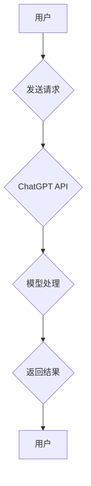

## ChatGPT 开发者模式

> 关键词：ChatGPT, 语言模型, 应用程序接口, 开发者模式, 自然语言处理, 训练数据

## 1. 背景介绍

ChatGPT，由 OpenAI 开发的强大语言模型，凭借其出色的文本生成能力和自然语言理解能力，迅速成为人工智能领域备受瞩目的明星。自其公开发布以来，ChatGPT 已被广泛应用于各种领域，例如聊天机器人、文本摘要、代码生成、创意写作等。然而，对于开发者而言，仅仅使用预训练的 ChatGPT 模型可能无法满足其个性化需求。因此，OpenAI 推出了 ChatGPT 开发者模式，为开发者提供了更深入的控制和定制化能力，使其能够将 ChatGPT 集成到自己的应用程序中，并根据特定场景进行微调和优化。

## 2. 核心概念与联系

ChatGPT 开发者模式的核心概念在于提供一个开放的平台，让开发者可以访问和利用 ChatGPT 的底层模型和训练数据。通过这个平台，开发者可以：

* **访问 API 接口:** 使用 API 接口，开发者可以向 ChatGPT 发送文本输入，并接收其生成的文本输出。
* **微调模型参数:** 开发者可以根据自己的应用场景，对 ChatGPT 的模型参数进行微调，以提高模型在特定任务上的性能。
* **提供自定义训练数据:** 开发者可以提供自己的训练数据，让 ChatGPT 在特定领域或任务上进行更精准的训练。

**核心概念与联系流程图:**



## 3. 核心算法原理 & 具体操作步骤

### 3.1  算法原理概述

ChatGPT 基于 Transformer 架构，是一种深度学习模型，专门用于处理序列数据，例如文本。Transformer 模型的核心在于其自注意力机制，能够捕捉文本中单词之间的长距离依赖关系，从而实现更准确的文本理解和生成。

### 3.2  算法步骤详解

1. **输入处理:** 将用户输入的文本转换为数字表示，例如词嵌入。
2. **编码阶段:** 使用 Transformer 的编码器层，将输入文本编码成一个隐藏表示，捕捉文本的语义信息。
3. **解码阶段:** 使用 Transformer 的解码器层，根据编码后的隐藏表示生成文本输出。
4. **输出处理:** 将生成的数字表示转换为文本形式，并返回给用户。

### 3.3  算法优缺点

**优点:**

* 能够捕捉长距离依赖关系，实现更准确的文本理解和生成。
* 训练效率高，能够处理大量文本数据。
* 可迁移性强，可以应用于多种自然语言处理任务。

**缺点:**

* 计算资源需求高，训练和推理都需要大量的计算能力。
* 模型参数量大，需要大量的存储空间。
* 训练数据质量对模型性能影响较大。

### 3.4  算法应用领域

* 聊天机器人
* 文本摘要
* 机器翻译
* 代码生成
* 创意写作
* 问答系统

## 4. 数学模型和公式 & 详细讲解 & 举例说明

### 4.1  数学模型构建

ChatGPT 的数学模型构建基于 Transformer 架构，主要包括编码器和解码器两个部分。

* **编码器:** 使用多层 Transformer 块，每个块包含自注意力层和前馈神经网络层。自注意力层能够捕捉文本中单词之间的关系，而前馈神经网络层能够学习单词的语义表示。
* **解码器:** 类似于编码器，解码器也使用多层 Transformer 块，但它还包含一个掩码机制，防止解码器在生成文本时看到未来的单词。

### 4.2  公式推导过程

Transformer 模型的核心是自注意力机制，其计算公式如下：

$$
Attention(Q, K, V) = \frac{exp(Q \cdot K^T / \sqrt{d_k})}{exp(Q \cdot K^T / \sqrt{d_k})} \cdot V
$$

其中：

* $Q$：查询矩阵
* $K$：键矩阵
* $V$：值矩阵
* $d_k$：键向量的维度

### 4.3  案例分析与讲解

假设我们有一个句子 "The cat sat on the mat"，将其转换为词嵌入表示，得到四个词向量：

* "The"： [0.1, 0.2, 0.3]
* "cat"： [0.4, 0.5, 0.6]
* "sat"： [0.7, 0.8, 0.9]
* "on"： [1.0, 1.1, 1.2]

使用自注意力机制计算每个词向量与其他词向量的相关性，可以得到一个注意力矩阵，该矩阵表示每个词与其他词之间的关系强度。例如，"cat" 与 "sat" 的相关性较高，因为它们在句子中紧密相连。

## 5. 项目实践：代码实例和详细解释说明

### 5.1  开发环境搭建

* Python 3.7+
* OpenAI API 访问密钥
* pip 安装依赖库：

```bash
pip install openai
```

### 5.2  源代码详细实现

```python
import openai

# 设置 OpenAI API 访问密钥
openai.api_key = "YOUR_API_KEY"

# 定义一个函数，用于使用 ChatGPT 生成文本
def generate_text(prompt):
    response = openai.Completion.create(
        engine="text-davinci-003",
        prompt=prompt,
        max_tokens=100,
        temperature=0.7,
    )
    return response.choices[0].text.strip()

# 示例使用
prompt = "写一首关于春天的诗"
generated_text = generate_text(prompt)
print(generated_text)
```

### 5.3  代码解读与分析

* 该代码首先导入 `openai` 库，并设置 OpenAI API 访问密钥。
* `generate_text()` 函数接受一个文本提示作为输入，并使用 OpenAI 的 `Completion.create()` 方法调用 ChatGPT 模型生成文本。
* `engine` 参数指定使用的模型，这里使用的是 `text-davinci-003` 模型。
* `prompt` 参数指定文本提示。
* `max_tokens` 参数指定生成的文本最大长度，单位为单词。
* `temperature` 参数控制文本生成的随机性，值越大，生成的文本越随机。
* 最后，代码打印生成的文本。

### 5.4  运行结果展示

运行该代码后，将输出一首关于春天的诗。

## 6. 实际应用场景

ChatGPT 开发者模式在各个领域都有着广泛的应用场景：

* **聊天机器人:** 开发更智能、更自然的聊天机器人，能够理解用户意图并提供更精准的回复。
* **文本摘要:** 自动生成文本摘要，帮助用户快速了解文章内容。
* **机器翻译:** 实现更准确、更流畅的机器翻译，突破语言障碍。
* **代码生成:** 根据自然语言描述自动生成代码，提高开发效率。
* **创意写作:** 辅助作家创作小说、剧本、诗歌等创意内容。

### 6.4  未来应用展望

随着 ChatGPT 模型的不断发展和完善，其应用场景将更加广泛，例如：

* **个性化教育:** 根据学生的学习情况，提供个性化的学习内容和辅导。
* **医疗诊断:** 辅助医生进行疾病诊断，提高诊断准确率。
* **法律服务:** 自动生成法律文件，提高法律服务效率。

## 7. 工具和资源推荐

### 7.1  学习资源推荐

* **OpenAI 官方文档:** https://platform.openai.com/docs/
* **Hugging Face Transformers 库:** https://huggingface.co/docs/transformers/index

### 7.2  开发工具推荐

* **Python:** https://www.python.org/
* **Jupyter Notebook:** https://jupyter.org/

### 7.3  相关论文推荐

* **Attention Is All You Need:** https://arxiv.org/abs/1706.03762

## 8. 总结：未来发展趋势与挑战

### 8.1  研究成果总结

ChatGPT 开发者模式为开发者提供了更深入的控制和定制化能力，推动了自然语言处理技术的快速发展。

### 8.2  未来发展趋势

* 模型规模和性能将继续提升，能够处理更复杂的任务。
* 多模态模型将成为主流，能够处理文本、图像、音频等多种数据类型。
* 模型训练数据将更加丰富多样，能够更好地适应不同的应用场景。

### 8.3  面临的挑战

* 模型训练成本高，需要大量的计算资源和数据。
* 模型安全性问题，例如生成虚假信息、偏见和歧视。
* 模型解释性问题，难以理解模型的决策过程。

### 8.4  研究展望

未来研究将集中在以下几个方面：

* 降低模型训练成本，提高模型训练效率。
* 提升模型安全性，防止模型生成有害信息。
* 增强模型解释性，使模型决策更加透明。


## 9. 附录：常见问题与解答

* **如何获取 OpenAI API 访问密钥？**

  访问 OpenAI 官网，注册账号并申请 API 访问密钥。

* **ChatGPT 模型有哪些不同的版本？**

  OpenAI 提供了多种不同的 ChatGPT 模型，例如 `text-davinci-003`、`text-curie-001` 等，每个模型都有不同的性能和价格。

* **如何微调 ChatGPT 模型？**

  OpenAI 提供了 Fine-tuning API，可以根据自己的应用场景对 ChatGPT 模型进行微调。

* **ChatGPT 模型可以处理哪些语言？**

  ChatGPT 模型主要支持英文，但也支持一些其他语言，例如中文、法语、西班牙语等。

作者：禅与计算机程序设计艺术 / Zen and the Art of Computer Programming 


