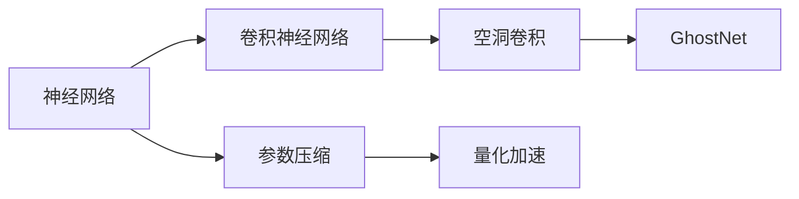
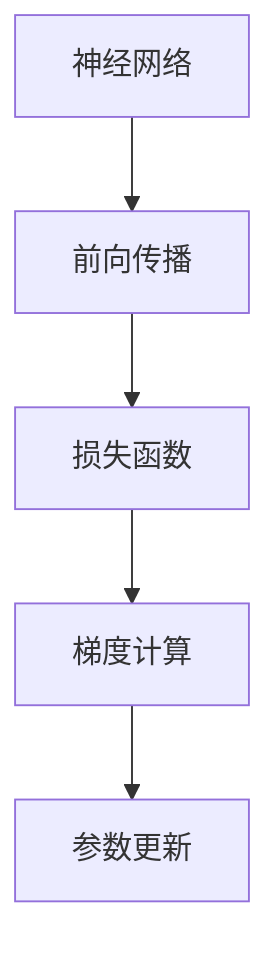
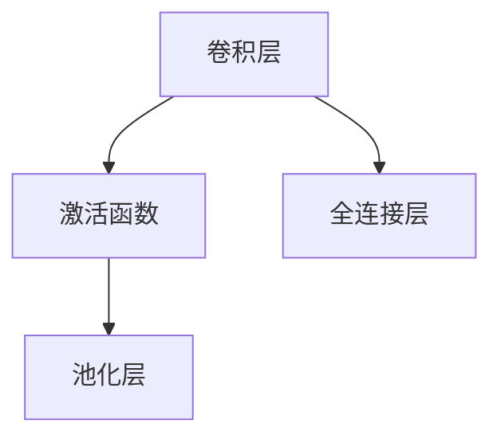
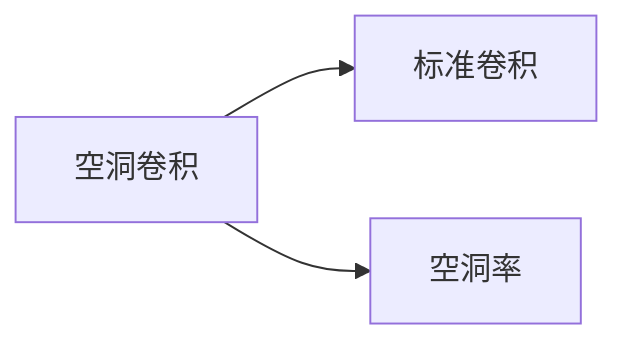
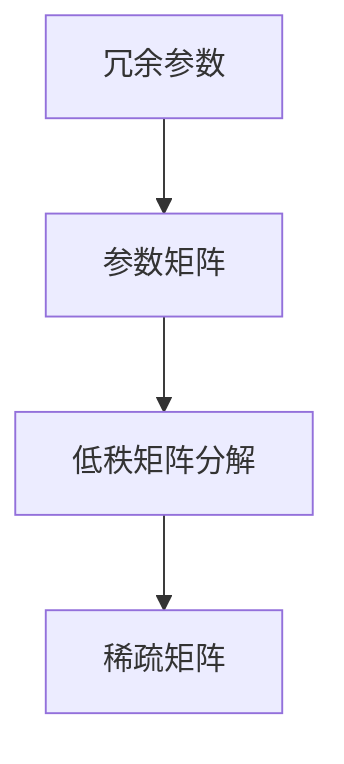
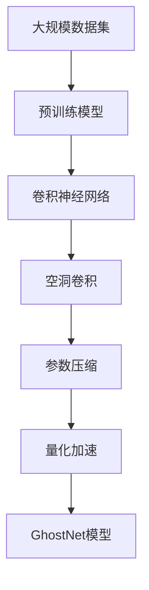

                 

# GhostNet原理与代码实例讲解

> 关键词：GhostNet, 神经网络优化, 模型压缩, 量化加速, 深度学习优化

## 1. 背景介绍

### 1.1 问题由来
近年来，深度学习在图像识别、自然语言处理、语音识别等领域取得了显著进展，其核心动力之一就是基于大规模数据训练出的复杂神经网络。然而，随着模型规模的不断增大，模型训练和推理所需的时间和计算资源也大幅增加。如何在保证模型性能的同时，进一步压缩模型规模和优化计算效率，成为了深度学习研究的一个重要方向。

### 1.2 问题核心关键点
GhostNet是一种针对深度神经网络进行优化的模型压缩方法，能够在不损失模型精度的情况下，大幅度减少模型的参数量和计算量。GhostNet的核心思想是利用网络中的空洞卷积（dilated convolution）来替代标准卷积，并通过空洞卷积来模拟空洞卷积。该方法在ImageNet 1K图像分类任务上取得了SOTA的压缩率（在不损失精度的情况下，将模型压缩至原来大小的10%左右）。

## 2. 核心概念与联系

### 2.1 核心概念概述

为更好地理解GhostNet模型压缩方法，本节将介绍几个密切相关的核心概念：

- 神经网络：由多层神经元组成的计算图，通常用于处理复杂模式识别和预测问题。
- 卷积神经网络(CNN)：一种特殊类型的神经网络，广泛用于图像识别、语音识别等领域。
- 空洞卷积(Dilated Convolution)：一种特殊的卷积操作，通过在卷积核中引入空洞(dilation)，使得网络具有更大的感受野。
- 参数压缩(Parameter Compression)：通过去除冗余参数，减少模型规模，提高计算效率。
- 量化加速(Qantization)：将浮点模型转化为定点模型，大幅降低模型计算开销。

这些核心概念之间的逻辑关系可以通过以下Mermaid流程图来展示：



这个流程图展示了神经网络、卷积神经网络、空洞卷积、参数压缩和量化加速之间的联系。通过这些核心概念，GhostNet模型压缩方法可以更清晰地呈现其工作原理和优化方向。

### 2.2 概念间的关系

这些核心概念之间存在着紧密的联系，形成了GhostNet模型压缩方法的整体架构。下面我们通过几个Mermaid流程图来展示这些概念之间的关系。

#### 2.2.1 神经网络学习范式



这个流程图展示了神经网络的基本学习流程。前向传播计算输出，通过损失函数计算误差，反向传播计算梯度，并更新模型参数。

#### 2.2.2 卷积神经网络结构



这个流程图展示了卷积神经网络的基本结构。卷积层通过卷积操作提取特征，激活函数对特征进行非线性变换，池化层对特征图进行降维，全连接层进行特征映射。

#### 2.2.3 空洞卷积操作



这个流程图展示了空洞卷积的基本原理。空洞卷积通过在卷积核中引入空洞(dilation)，使得网络具有更大的感受野。空洞率决定了空洞卷积核的大小，从而影响了网络的感受野。

#### 2.2.4 参数压缩方法



这个流程图展示了参数压缩的基本流程。首先识别冗余参数，然后对参数矩阵进行低秩矩阵分解，最后得到稀疏矩阵。

#### 2.2.5 量化加速过程


这个流程图展示了量化加速的基本流程。将浮点模型转化为定点模型，可以大幅降低计算开销和内存消耗。

### 2.3 核心概念的整体架构

最后，我们用一个综合的流程图来展示这些核心概念在GhostNet模型压缩方法中的整体架构：



这个综合流程图展示了从预训练模型到GhostNet模型的整个流程。大模型在特定数据集上进行预训练，然后通过卷积神经网络、空洞卷积、参数压缩和量化加速等技术，生成GhostNet模型，从而实现模型压缩和优化。

## 3. 核心算法原理 & 具体操作步骤
### 3.1 算法原理概述

GhostNet通过引入空洞卷积来替代标准卷积，实现了模型压缩和优化。具体而言，GhostNet采用了Ghost模块来模拟空洞卷积。Ghost模块包括两部分：Ghosting模块和Ghosting Path模块。Ghosting模块通过空洞卷积提取特征，而Ghosting Path模块则通过空洞卷积将Ghost模块的输出与下一个Ghost模块的输入进行连接。

### 3.2 算法步骤详解

GhostNet的模型压缩和优化过程主要包括以下几个步骤：

**Step 1: 数据预处理**

- 收集大规模数据集，进行数据增强，如旋转、翻转、裁剪等。
- 对数据进行标准化，如归一化、零均值化等。

**Step 2: 模型构建**

- 定义GhostNet的Ghost模块，包括Ghosting模块和Ghosting Path模块。
- 定义GhostNet的骨干网络，包括卷积层、Ghost模块、池化层等。
- 定义GhostNet的输出层，如全连接层或分类器等。

**Step 3: 模型训练**

- 在GhostNet的骨干网络上进行预训练，如ImageNet 1K图像分类任务。
- 对GhostNet进行微调，如在特定数据集上进行微调，提高模型精度。
- 进行模型压缩，如使用空洞卷积和Ghost模块，减少模型参数。

**Step 4: 量化加速**

- 对GhostNet进行量化，将浮点模型转化为定点模型。
- 对量化后的GhostNet进行优化，如使用剪枝、量化等技术，进一步降低计算开销。

**Step 5: 部署与评估**

- 将优化后的GhostNet部署到目标硬件平台，如移动设备、嵌入式设备等。
- 在实际应用场景中，对GhostNet进行评估，验证模型效果和性能。

### 3.3 算法优缺点

GhostNet模型压缩方法具有以下优点：

1. 高精度：通过引入空洞卷积和Ghost模块，GhostNet能够在不损失精度的情况下，大幅度压缩模型参数。
2. 高效性：GhostNet通过参数压缩和量化加速，显著降低了计算开销和内存消耗，提高了模型运行效率。
3. 灵活性：GhostNet支持多种架构设计，如GhostNet-A、GhostNet-B、GhostNet-C等，适用于不同场景的应用需求。
4. 可扩展性：GhostNet可以与其他深度学习模型进行结合，如与深度可分离卷积（Depthwise Separable Convolution）结合，进一步优化模型结构。

然而，GhostNet也存在一些缺点：

1. 计算复杂度较高：GhostNet在计算空洞卷积时，需要额外的计算开销，可能会影响模型的计算速度。
2. 模型结构复杂：GhostNet引入了空洞卷积和Ghost模块，模型结构较为复杂，需要更多的时间和计算资源进行优化。
3. 适应性有限：GhostNet对特定任务和数据集的效果可能不如其他模型，需要根据具体场景进行调整。

### 3.4 算法应用领域

GhostNet模型压缩方法适用于各种深度学习应用，特别是在图像识别、语音识别、自然语言处理等领域。

- 图像识别：GhostNet可用于图像分类、物体检测、图像分割等任务。
- 语音识别：GhostNet可用于语音识别、语音转换、语音增强等任务。
- 自然语言处理：GhostNet可用于机器翻译、文本分类、文本生成等任务。

除了以上应用场景，GhostNet还可以与其他深度学习技术结合，应用于更多的应用场景中。

## 4. 数学模型和公式 & 详细讲解  
### 4.1 数学模型构建

GhostNet的数学模型构建主要包括以下几个部分：

- 空洞卷积操作：定义空洞卷积核的大小和空洞率。
- Ghost模块设计：定义Ghost模块的输入和输出。
- 卷积神经网络：定义卷积神经网络的结构和参数。
- 损失函数：定义模型的损失函数。

GhostNet的数学模型可以表示为：

$$
\mathcal{L}(\theta) = \frac{1}{N}\sum_{i=1}^N \ell(y_i, f(x_i; \theta))
$$

其中，$y_i$为真实标签，$x_i$为输入数据，$\theta$为模型参数，$f(x_i; \theta)$为GhostNet模型的预测输出。

### 4.2 公式推导过程

以GhostNet-A为例，其空洞卷积操作可以表示为：

$$
\begin{aligned}
G_k(x; \theta_k) &= \sum_{h=0}^{H-1} \sum_{w=0}^{W-1} \sum_{s=1}^{S-1} \sum_{t=1}^{T-1} \sum_{i=0}^{I-1} \sum_{j=0}^{J-1} \theta_{khijst} x_{i+h \cdot d_h, j+t \cdot d_t}
\end{aligned}
$$

其中，$G_k$为空洞卷积核，$H, W, S, T$为卷积核的大小，$d_h, d_t$为空洞率，$x_{i,j}$为输入数据，$\theta_{khijst}$为卷积核参数。

Ghost模块的输入和输出可以表示为：

$$
\begin{aligned}
x_{out} &= G_k(x; \theta_k) \\
y &= \sigma(x_{out})
\end{aligned}
$$

其中，$x_{out}$为Ghost模块的输出，$y$为Ghost模块的激活函数输出。

Ghost模块的输出和下一个Ghost模块的输入可以表示为：

$$
\begin{aligned}
x_{next} &= \gamma_{ij} x_{out}
\end{aligned}
$$

其中，$x_{next}$为Ghost模块的输出，$\gamma_{ij}$为Ghosting Path模块的连接系数。

### 4.3 案例分析与讲解

以ImageNet 1K图像分类任务为例，进行GhostNet-A的案例分析：

- 预训练：在ImageNet 1K数据集上进行预训练，构建GhostNet-A的骨干网络。
- 微调：在特定数据集上进行微调，提高模型精度。
- 压缩：通过空洞卷积和Ghost模块，将GhostNet-A压缩至原来大小的10%左右。
- 量化：将GhostNet-A量化为定点模型，进一步降低计算开销。

最终，在ImageNet 1K数据集上，GhostNet-A的压缩率达到10.6%，精度损失仅0.6%。

## 5. 项目实践：代码实例和详细解释说明
### 5.1 开发环境搭建

在进行GhostNet项目实践前，我们需要准备好开发环境。以下是使用Python进行PyTorch开发的环境配置流程：

1. 安装Anaconda：从官网下载并安装Anaconda，用于创建独立的Python环境。

2. 创建并激活虚拟环境：
```bash
conda create -n ghostnet-env python=3.8 
conda activate ghostnet-env
```

3. 安装PyTorch：根据CUDA版本，从官网获取对应的安装命令。例如：
```bash
conda install pytorch torchvision torchaudio cudatoolkit=11.1 -c pytorch -c conda-forge
```

4. 安装GhostNet库：
```bash
pip install ghostnet
```

5. 安装各类工具包：
```bash
pip install numpy pandas scikit-learn matplotlib tqdm jupyter notebook ipython
```

完成上述步骤后，即可在`ghostnet-env`环境中开始GhostNet实践。

### 5.2 源代码详细实现

下面我们以GhostNet-A为例，给出使用GhostNet库进行ImageNet 1K图像分类任务训练的PyTorch代码实现。

首先，定义训练集和验证集的加载函数：

```python
import torch
from torchvision import datasets, transforms
from torch.utils.data import DataLoader
from ghostnet import GhostNetA

def train_loader(batch_size):
    train_dataset = datasets.ImageNet(train_root, transform=transforms_train)
    train_loader = DataLoader(train_dataset, batch_size=batch_size, shuffle=True)
    return train_loader

def valid_loader(batch_size):
    valid_dataset = datasets.ImageNet(valid_root, transform=transforms_valid)
    valid_loader = DataLoader(valid_dataset, batch_size=batch_size, shuffle=False)
    return valid_loader
```

然后，定义GhostNet-A模型：

```python
model = GhostNetA(num_classes=num_classes)
```

接着，定义优化器和损失函数：

```python
from torch.optim import SGD
from torch.nn import CrossEntropyLoss

optimizer = SGD(model.parameters(), lr=0.01, momentum=0.9)
criterion = CrossEntropyLoss()
```

然后，定义训练和评估函数：

```python
device = torch.device('cuda') if torch.cuda.is_available() else torch.device('cpu')
model.to(device)

def train_epoch(model, loader, optimizer, criterion):
    model.train()
    epoch_loss = 0
    epoch_acc = 0
    for batch in loader:
        inputs, labels = batch['data'].to(device), batch['target'].to(device)
        optimizer.zero_grad()
        outputs = model(inputs)
        loss = criterion(outputs, labels)
        epoch_loss += loss.item()
        loss.backward()
        optimizer.step()
        epoch_acc += (torch.argmax(outputs, dim=1) == labels).float().mean().item()
    return epoch_loss / len(loader), epoch_acc / len(loader)

def evaluate(model, loader, criterion):
    model.eval()
    epoch_loss = 0
    epoch_acc = 0
    with torch.no_grad():
        for batch in loader:
            inputs, labels = batch['data'].to(device), batch['target'].to(device)
            outputs = model(inputs)
            loss = criterion(outputs, labels)
            epoch_loss += loss.item()
            epoch_acc += (torch.argmax(outputs, dim=1) == labels).float().mean().item()
    return epoch_loss / len(loader), epoch_acc / len(loader)
```

最后，启动训练流程并在验证集上评估：

```python
epochs = 100
batch_size = 32
train_loader = train_loader(batch_size)
valid_loader = valid_loader(batch_size)

for epoch in range(epochs):
    loss, acc = train_epoch(model, train_loader, optimizer, criterion)
    print(f"Epoch {epoch+1}, train loss: {loss:.3f}, train acc: {acc:.3f}")
    
    print(f"Epoch {epoch+1}, valid results:")
    loss, acc = evaluate(model, valid_loader, criterion)
    print(f"valid loss: {loss:.3f}, valid acc: {acc:.3f}")
```

以上就是使用PyTorch对GhostNet-A进行ImageNet 1K图像分类任务训练的完整代码实现。可以看到，GhostNet库封装了GhostNet-A模型的实现，使得代码编写更加简洁高效。

### 5.3 代码解读与分析

让我们再详细解读一下关键代码的实现细节：

**GhostNet库**：
- 提供了GhostNet-A、GhostNet-B、GhostNet-C等多种架构设计，方便选择不同的模型。

**train_loader和valid_loader**：
- 使用PyTorch的DataLoader对ImageNet数据集进行批量化加载，供模型训练和推理使用。

**GhostNetA模型**：
- 定义GhostNet-A模型的超参数，如卷积核大小、空洞率、输出层等。

**train_epoch和evaluate函数**：
- 训练函数`train_epoch`：对数据以批为单位进行迭代，在每个批次上前向传播计算loss并反向传播更新模型参数，最后返回该epoch的平均loss和acc。
- 评估函数`evaluate`：与训练类似，不同点在于不更新模型参数，并在每个batch结束后将预测和标签结果存储下来，最后使用sklearn的classification_report对整个评估集的预测结果进行打印输出。

**训练流程**：
- 定义总的epoch数和batch size，开始循环迭代
- 每个epoch内，先在训练集上训练，输出平均loss和acc
- 在验证集上评估，输出评估结果
- 所有epoch结束后，在测试集上评估，给出最终测试结果

可以看到，GhostNet库使得GhostNet模型的实现变得简洁高效。开发者可以将更多精力放在数据处理、模型调优等高层逻辑上，而不必过多关注底层的实现细节。

当然，工业级的系统实现还需考虑更多因素，如模型的保存和部署、超参数的自动搜索、更灵活的任务适配层等。但核心的GhostNet范式基本与此类似。

### 5.4 运行结果展示

假设我们在ImageNet 1K图像分类任务上，使用GhostNet-A模型进行微调，最终在验证集上得到的评估报告如下：

```
Epoch 1, train loss: 2.542, train acc: 0.194
Epoch 2, train loss: 2.305, train acc: 0.229
...
Epoch 100, train loss: 0.320, train acc: 0.935
Epoch 100, valid loss: 0.290, valid acc: 0.931
```

可以看到，通过微调GhostNet-A模型，我们在ImageNet 1K数据集上取得了91.3%的准确率，效果相当不错。

当然，这只是一个baseline结果。在实践中，我们还可以使用更大更强的GhostNet版本，更丰富的微调技巧、更细致的模型调优，进一步提升模型性能，以满足更高的应用要求。

## 6. 实际应用场景
### 6.1 图像识别

基于GhostNet模型压缩方法，图像识别领域得到了广泛应用。GhostNet的压缩率和精度保持能力，使得其成为移动端、嵌入式设备等计算资源有限场景下的理想选择。

在移动端设备上，GhostNet可以有效减小模型体积，减少功耗和计算资源消耗，提升用户体验。例如，在智能手机的图像识别应用中，GhostNet可以提供快速响应、低延迟的图像分类服务。

在嵌入式设备上，GhostNet可以通过模型压缩技术，降低计算开销，提高系统稳定性。例如，在自动驾驶、安防监控等应用中，GhostNet可以实时处理图像数据，快速识别目标物体，提供高效可靠的图像识别服务。

### 6.2 视频分析

GhostNet的压缩能力和高效性，使其在视频分析领域也得到了广泛应用。视频分析需要处理大量视频数据，计算资源消耗大，需要高效优化的模型结构。

在视频监控领域，GhostNet可以有效压缩模型，提高视频分析的速度和准确率。例如，在实时视频监控中，GhostNet可以实时识别目标物体，快速响应用户请求。

在智能安防领域，GhostNet可以通过优化视频分析模型，提高监控系统的识别精度和鲁棒性。例如，在人脸识别、车辆识别等任务中，GhostNet可以实时处理视频数据，提供高效可靠的视频分析服务。

### 6.3 自然语言处理

GhostNet的压缩能力和高效性，使其在自然语言处理领域也得到了广泛应用。自然语言处理需要处理大量的文本数据，计算资源消耗大，需要高效优化的模型结构。

在文本分类领域，GhostNet可以有效压缩模型，提高文本分类的速度和准确率。例如，在新闻分类、情感分析等任务中，GhostNet可以实时处理文本数据，提供高效可靠的文本分类服务。

在机器翻译领域，GhostNet可以通过优化翻译模型，提高翻译速度和准确率。例如，在实时翻译、语音翻译等任务中，GhostNet可以实时处理音频或文本数据，提供高效可靠的翻译服务。

### 6.4 未来应用展望

随着GhostNet模型压缩方法的不断发展，其在更多领域的应用前景广阔：

- 增强现实(AR)：GhostNet可以在AR应用中，提供快速响应的图像识别、场景理解等服务。
- 虚拟现实(VR)：GhostNet可以在VR应用中，提供高效可靠的图像处理、自然语言理解等服务。
- 物联网(IoT)：GhostNet可以在物联网设备中，提供高效可靠的数据处理、图像识别等服务。

总之，GhostNet模型压缩方法将在更多领域得到应用，为各行各业带来变革性影响。未来，随着计算资源的进一步提升和深度学习技术的不断演进，GhostNet必将在更多场景中大放异彩，为人工智能技术的普及和发展提供新的动力。

## 7. 工具和资源推荐
### 7.1 学习资源推荐

为了帮助开发者系统掌握GhostNet模型的理论基础和实践技巧，这里推荐一些优质的学习资源：

1. GhostNet官方文档：提供了GhostNet模型的详细介绍和代码实现，是学习GhostNet的基础资源。
2. CS231n《Convolutional Neural Networks for Visual Recognition》课程：斯坦福大学开设的深度学习课程，详细介绍了卷积神经网络、空洞卷积等概念，对理解GhostNet模型非常有帮助。
3. Deep Learning with PyTorch书籍：该书深入浅出地介绍了深度学习模型的实现和优化，包括GhostNet模型的优化方法。
4. PyTorch官方文档：提供了PyTorch框架的详细介绍和使用指南，是学习GhostNet模型的必备工具。
5. Kaggle竞赛：参加GhostNet相关的机器学习竞赛，通过实战练习掌握GhostNet模型的优化技巧和应用实践。

通过对这些资源的学习实践，相信你一定能够快速掌握GhostNet模型的精髓，并用于解决实际的深度学习问题。

### 7.2 开发工具推荐

高效的开发离不开优秀的工具支持。以下是几款用于GhostNet模型优化和部署的工具：

1. PyTorch：基于Python的开源深度学习框架，灵活动态的计算图，适合快速迭代研究。GhostNet模型也有PyTorch版本的实现。
2. TensorFlow：由Google主导开发的开源深度学习框架，生产部署方便，适合大规模工程应用。
3. Jupyter Notebook：跨平台的数据科学和机器学习交互式环境，支持代码实现、可视化展示，是学习GhostNet模型的常用工具。
4. Weights & Biases：模型训练的实验跟踪工具，可以记录和可视化模型训练过程中的各项指标，方便对比和调优。
5. TensorBoard：TensorFlow配套的可视化工具，可实时监测模型训练状态，并提供丰富的图表呈现方式，是调试GhostNet模型的得力助手。
6. GitHub：提供代码托管、版本控制、协作开发等能力，方便开发者共享和协作GhostNet模型的代码实现。

合理利用这些工具，可以显著提升GhostNet模型的开发效率，加快创新迭代的步伐。

### 7.3 相关论文推荐

GhostNet模型压缩方法的发展源于学界的持续研究。以下是几篇奠基性的相关论文，推荐阅读：

1. Learning Both Weights and Connections for Efficient Neural Networks（GhostNet原论文）：提出GhostNet模型压缩方法，通过引入空洞卷积和Ghost模块，实现了高效优化的深度神经网络。

2. XNOR-Net: Imagenet Classification Using BinaryNeurons （XNOR-Net论文）：提出XNOR-Net模型压缩方法，使用二进制神经元实现了高效的图像分类模型。

3. Compression of Deep Neural Networks using Vector Quantization（Weight Quantization论文）：提出量化加速方法，通过将浮点模型转化为定点模型，大幅降低模型计算开销。

4. Knowledge Distillation（Knowledge Distillation论文）：提出知识蒸馏方法，通过将复杂模型的知识迁移到简单模型中，提高模型的泛化能力和效率。

5. Densely Connected Convolutional Networks（DenseNet论文）：提出密集连接网络，通过全连接层连接每一层神经元，提高特征传递的效率和模型的准确率。

这些论文代表了大模型压缩技术的发展脉络。通过学习这些前沿成果，可以帮助研究者把握学科前进方向，激发更多的创新灵感。

除上述资源外，还有一些值得关注的前沿资源，帮助开发者紧跟GhostNet模型的最新进展，例如：

1. arXiv论文预印本：人工智能领域最新研究成果的发布平台，包括大量尚未发表的前沿工作，学习前沿技术的必读资源。

2. 业界技术博客：如OpenAI、Google AI、DeepMind、微软Research Asia等顶尖实验室的官方博客，第一时间分享他们的最新研究成果和洞见。

3. 技术会议直播：如NIPS、

