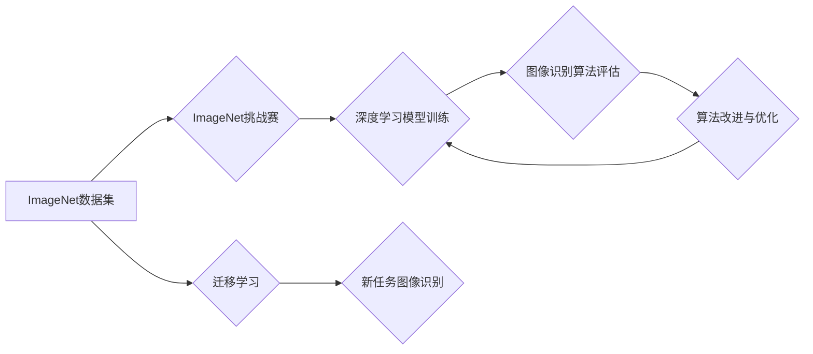

## ImageNet在AI图像识别中的历史

> 关键词：ImageNet, 图像识别, 深度学习, 计算机视觉, AlexNet, 迁移学习, 大规模数据集

### 1. 背景介绍

在人工智能领域，图像识别一直是研究的热点之一。从传统的基于规则的图像识别方法到如今的深度学习时代，图像识别技术经历了飞速发展。而ImageNet数据集和ImageNet挑战赛作为图像识别领域的重要里程碑，推动了深度学习在图像识别领域的应用，并最终催生了如今的计算机视觉革命。

早期图像识别方法主要依赖于人工提取特征，例如颜色、纹理、形状等。这些方法需要大量的专家知识和手工设计，并且难以处理复杂场景下的图像识别任务。随着深度学习技术的兴起，基于深度神经网络的图像识别方法逐渐成为主流。深度神经网络能够自动学习图像特征，并具有强大的泛化能力，能够有效地处理复杂图像识别任务。

### 2. 核心概念与联系

**2.1 ImageNet数据集**

ImageNet是一个由斯坦福大学和麻省理工学院共同创建的大规模图像识别数据集。它包含超过1400万张图像，涵盖超过2万个类别。ImageNet数据集的规模和类别丰富性使其成为深度学习图像识别模型训练和评估的理想平台。

**2.2 ImageNet挑战赛**

ImageNet挑战赛是每年举办的图像识别竞赛，旨在评估不同图像识别算法的性能。挑战赛的参赛者需要使用自己的算法对ImageNet数据集进行分类，并提交结果。ImageNet挑战赛的举办推动了深度学习图像识别算法的快速发展，并促进了图像识别技术的应用推广。

**2.3 深度学习与图像识别**

深度学习是一种机器学习方法，它利用多层神经网络来学习数据特征。深度学习在图像识别领域取得了显著的成果，例如AlexNet、VGGNet、ResNet等深度神经网络模型在ImageNet挑战赛中取得了优异的成绩。

**2.4 迁移学习**

迁移学习是一种利用预训练模型进行新任务学习的方法。由于ImageNet数据集规模庞大，预训练在ImageNet数据集上的模型能够学习到丰富的图像特征，这些特征可以迁移到其他图像识别任务中，从而提高新任务的学习效率。

**Mermaid 流程图**

### 3. 核心算法原理 & 具体操作步骤

**3.1 算法原理概述**

深度学习在图像识别领域的核心算法是卷积神经网络（CNN）。CNN能够有效地学习图像特征，并具有强大的泛化能力。CNN的结构由多个卷积层、池化层和全连接层组成。卷积层通过卷积核提取图像特征，池化层对特征图进行降维，全连接层将提取到的特征进行分类。

**3.2 算法步骤详解**

1. **数据预处理:** 将图像数据预处理，例如调整大小、归一化等。
2. **卷积层:** 使用卷积核对图像进行卷积运算，提取图像特征。
3. **池化层:** 对卷积层的输出进行池化运算，例如最大池化、平均池化等，降低特征图的维度。
4. **激活函数:** 使用激活函数对池化层的输出进行非线性变换，例如ReLU、Sigmoid等。
5. **全连接层:** 将池化层的输出连接到全连接层，进行分类。
6. **损失函数:** 使用损失函数评估模型的性能，例如交叉熵损失函数。
7. **优化算法:** 使用优化算法更新模型参数，例如梯度下降、Adam等。

**3.3 算法优缺点**

**优点:**

* 能够自动学习图像特征，无需人工设计特征。
* 具有强大的泛化能力，能够有效地处理复杂图像识别任务。
* 在ImageNet挑战赛中取得了优异的成绩。

**缺点:**

* 训练深度神经网络需要大量的计算资源和时间。
* 深度神经网络的结构设计和参数调优需要一定的经验和技巧。
* 深度神经网络的解释性较差，难以理解模型的决策过程。

**3.4 算法应用领域**

深度学习图像识别算法在各个领域都有广泛的应用，例如：

* **人脸识别:** 用于身份验证、人脸搜索等。
* **物体检测:** 用于自动驾驶、安防监控等。
* **图像分类:** 用于医疗诊断、电商推荐等。
* **图像分割:** 用于医学图像分析、自动驾驶等。

### 4. 数学模型和公式 & 详细讲解 & 举例说明

**4.1 数学模型构建**

深度学习图像识别模型的数学模型主要基于神经网络的结构和激活函数。

* **卷积层:** 卷积层使用卷积核对图像进行卷积运算，卷积核的权重参数需要通过训练学习。卷积运算的数学公式如下：

$$
y_{i,j} = \sum_{m=0}^{M-1} \sum_{n=0}^{N-1} x_{i+m,j+n} * w_{m,n}
$$

其中：

* $y_{i,j}$ 是卷积层的输出特征图上的像素值。
* $x_{i+m,j+n}$ 是输入图像上的像素值。
* $w_{m,n}$ 是卷积核上的权重参数。
* $M$ 和 $N$ 是卷积核的大小。

* **池化层:** 池化层对卷积层的输出进行降维，常用的池化方法是最大池化和平均池化。最大池化选择每个池化窗口内的最大值作为输出，平均池化则计算每个池化窗口内的平均值作为输出。

* **激活函数:** 激活函数用于引入非线性，使神经网络能够学习更复杂的特征。常用的激活函数包括ReLU、Sigmoid和Tanh等。

**4.2 公式推导过程**

深度学习模型的训练过程是通过反向传播算法来更新模型参数的。反向传播算法的核心思想是通过计算损失函数对每个参数的梯度，并使用梯度下降算法来更新参数值。

**4.3 案例分析与讲解**

AlexNet是ImageNet挑战赛2012年冠军模型，它使用了ReLU激活函数、Dropout正则化技术和数据增强技术，取得了显著的性能提升。AlexNet的结构包括五个卷积层、三个全连接层和一个softmax分类层。

### 5. 项目实践：代码实例和详细解释说明

**5.1 开发环境搭建**

使用Python语言和深度学习框架TensorFlow或PyTorch搭建开发环境。

**5.2 源代码详细实现**

使用深度学习框架的API实现CNN模型的结构和训练过程。

**5.3 代码解读与分析**

解释代码中使用的函数、类和参数，以及模型训练过程中的关键步骤。

**5.4 运行结果展示**

展示模型在ImageNet数据集上的训练和测试结果，包括准确率、损失函数等指标。

### 6. 实际应用场景

**6.1 人脸识别**

使用深度学习图像识别模型进行人脸识别，用于身份验证、人脸搜索等应用。

**6.2 物体检测**

使用深度学习图像识别模型进行物体检测，用于自动驾驶、安防监控等应用。

**6.3 图像分类**

使用深度学习图像识别模型进行图像分类，用于医疗诊断、电商推荐等应用。

**6.4 未来应用展望**

深度学习图像识别技术将继续发展，并应用于更多领域，例如：

* **医疗诊断:** 辅助医生进行疾病诊断，提高诊断准确率。
* **自动驾驶:** 帮助自动驾驶汽车识别道路环境和障碍物。
* **机器人视觉:** 赋予机器人视觉感知能力，使其能够更好地理解周围环境。

### 7. 工具和资源推荐

**7.1 学习资源推荐**

* **书籍:**

    * 《深度学习》
    * 《计算机视觉:算法与应用》

* **在线课程:**

    * Coursera上的深度学习课程
    * Udacity上的计算机视觉课程

**7.2 开发工具推荐**

* **深度学习框架:** TensorFlow, PyTorch
* **图像处理库:** OpenCV

**7.3 相关论文推荐**

* **AlexNet:** ImageNet Classification with Deep Convolutional Neural Networks
* **VGGNet:** Very Deep Convolutional Networks for Large-Scale Image Recognition
* **ResNet:** Deep Residual Learning for Image Recognition

### 8. 总结：未来发展趋势与挑战

**8.1 研究成果总结**

ImageNet数据集和ImageNet挑战赛推动了深度学习图像识别技术的快速发展，取得了显著的成果。深度学习图像识别模型在ImageNet数据集上的准确率已经超过了人类水平。

**8.2 未来发展趋势**

* **模型更深更广:** 研究更深更广的深度神经网络模型，提高模型的表达能力和泛化能力。
* **数据更丰富更多样:** 收集和构建更丰富、更多样化的图像数据集，提高模型的鲁棒性和泛化性。
* **解释性更强:** 研究更具解释性的深度学习模型，使模型的决策过程更加透明。

**8.3 面临的挑战**

* **计算资源:** 训练深度神经网络需要大量的计算资源，这对于资源有限的机构和个人来说是一个挑战。
* **数据标注:** 构建高质量的图像数据集需要大量的标注工作，这非常耗时和费力。
* **伦理问题:** 深度学习图像识别技术可能存在伦理问题，例如数据隐私、算法偏见等，需要引起重视和解决。

**8.4 研究展望**

未来，深度学习图像识别技术将继续发展，并应用于更多领域，为人类社会带来更多便利和福祉。

### 9. 附录：常见问题与解答

**9.1 如何选择合适的深度学习框架？**

TensorFlow和PyTorch是目前最流行的深度学习框架，它们各有优缺点。TensorFlow更适合于生产环境，PyTorch更适合于研究和开发。

**9.2 如何进行图像数据预处理？**

图像数据预处理包括调整图像大小、归一化、数据增强等步骤。

**9.3 如何评估深度学习图像识别模型的性能？**

常用的评估指标包括准确率、召回率、F1-score等。

**9.4 如何解决深度学习模型的过拟合问题？**

常用的解决方法包括正则化、Dropout、数据增强等。

作者：禅与计算机程序设计艺术 / Zen and the Art of Computer Programming 
