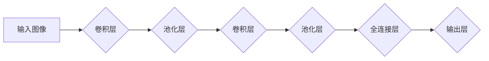

## Python深度学习实践：构建深度卷积网络识别图像

> 关键词：深度学习、卷积神经网络、图像识别、Python、TensorFlow、Keras

## 1. 背景介绍

图像识别作为人工智能领域的重要应用之一，在各个领域都发挥着越来越重要的作用。从自动驾驶、医疗诊断到人脸识别、物体检测，深度学习技术为图像识别带来了革命性的进步。

深度卷积神经网络（Deep Convolutional Neural Networks，CNN）凭借其强大的特征提取能力和准确率，成为图像识别领域的主流算法。本文将以Python为编程语言，使用TensorFlow和Keras框架，带领读者构建一个深度卷积网络，实现图像识别任务。

## 2. 核心概念与联系

### 2.1 卷积神经网络（CNN）

卷积神经网络（CNN）是一种专门设计用于处理图像数据的深度神经网络。其结构灵感来源于生物视觉系统，通过卷积层、池化层和全连接层来提取图像特征。

* **卷积层:** 利用卷积核（filter）对图像进行卷积运算，提取图像局部特征。
* **池化层:** 对卷积层的输出进行下采样，减少数据维度，提高网络鲁棒性。
* **全连接层:** 将池化层的输出连接到全连接层，进行分类或回归任务。

### 2.2 TensorFlow 和 Keras

TensorFlow 是 Google 开发的开源机器学习平台，提供强大的计算图构建和优化能力。Keras 是基于 TensorFlow 的高层深度学习框架，提供简洁易用的API，方便用户快速构建和训练深度学习模型。

**CNN 架构流程图**



## 3. 核心算法原理 & 具体操作步骤

### 3.1 算法原理概述

深度卷积网络的训练过程主要包括以下步骤：

1. **数据预处理:** 将图像数据进行尺寸调整、归一化等预处理操作，以提高模型训练效率和精度。
2. **模型构建:** 使用 TensorFlow 和 Keras 框架构建深度卷积网络模型，定义卷积层、池化层和全连接层结构。
3. **模型编译:** 选择合适的优化器、损失函数和评价指标，编译模型。
4. **模型训练:** 使用训练数据训练模型，通过反向传播算法更新模型参数。
5. **模型评估:** 使用测试数据评估模型性能，计算准确率、召回率等指标。
6. **模型调优:** 根据评估结果，调整模型参数、学习率等超参数，提高模型性能。

### 3.2 算法步骤详解

1. **数据预处理:**

* **尺寸调整:** 将图像数据调整为模型输入所需的尺寸。
* **归一化:** 将图像像素值归一化到 [0, 1] 范围，提高模型训练稳定性。
* **数据增强:** 使用数据增强技术，例如随机旋转、翻转、裁剪等，增加训练数据的多样性，提高模型泛化能力。

2. **模型构建:**

* 使用 Keras API 定义模型结构，例如 Sequential 模型或 Functional API 模型。
* 添加卷积层、池化层和全连接层，并设置相应的参数，例如卷积核大小、步长、池化窗口大小等。
* 定义输出层，根据任务类型选择合适的激活函数，例如 softmax 函数用于分类任务。

3. **模型编译:**

* 选择合适的优化器，例如 Adam 优化器。
* 选择合适的损失函数，例如交叉熵损失函数用于分类任务。
* 选择合适的评价指标，例如准确率、召回率等。

4. **模型训练:**

* 使用训练数据训练模型，设置训练轮数、批处理大小等参数。
* 使用训练过程中的损失值和评价指标来监控模型训练情况。

5. **模型评估:**

* 使用测试数据评估模型性能，计算准确率、召回率等指标。
* 使用混淆矩阵等工具分析模型预测结果。

6. **模型调优:**

* 根据评估结果，调整模型参数、学习率等超参数，提高模型性能。
* 使用交叉验证等技术进行模型调优。

### 3.3 算法优缺点

**优点:**

* 强大的特征提取能力，能够自动学习图像特征。
* 高准确率，在图像识别任务中表现出色。
* 能够处理大规模图像数据。

**缺点:**

* 训练时间长，需要大量的计算资源。
* 模型参数多，容易过拟合。
* 对数据质量要求高，需要大量高质量的训练数据。

### 3.4 算法应用领域

* **图像分类:** 将图像分类到预定义的类别中，例如识别猫、狗、汽车等。
* **物体检测:** 在图像中检测到多个物体，并识别物体的类别和位置。
* **图像分割:** 将图像分割成多个区域，每个区域对应不同的物体或场景。
* **人脸识别:** 根据人脸特征识别个人身份。
* **医疗诊断:** 使用图像数据辅助医生进行疾病诊断。

## 4. 数学模型和公式 & 详细讲解 & 举例说明

### 4.1 数学模型构建

深度卷积网络的数学模型主要基于线性变换、非线性激活函数和反向传播算法。

* **线性变换:** 卷积层和全连接层使用矩阵乘法进行线性变换，将输入数据映射到输出空间。
* **非线性激活函数:** 非线性激活函数，例如 ReLU 函数、Sigmoid 函数等，引入非线性因素，使网络能够学习更复杂的特征。
* **反向传播算法:** 反向传播算法用于更新模型参数，通过计算梯度，调整参数值，使模型输出与真实值之间的误差最小化。

### 4.2 公式推导过程

* **卷积运算:**

$$
y_{i,j} = \sum_{m=0}^{M-1} \sum_{n=0}^{N-1} x_{i+m,j+n} * w_{m,n}
$$

其中：

* $y_{i,j}$ 是卷积输出的像素值。
* $x_{i+m,j+n}$ 是输入图像的像素值。
* $w_{m,n}$ 是卷积核的权重值。
* $M$ 和 $N$ 是卷积核的大小。

* **池化运算:**

$$
y_{i,j} = \max(x_{i,j}, x_{i+1,j}, x_{i,j+1}, x_{i+1,j+1})
$$

其中：

* $y_{i,j}$ 是池化输出的像素值。
* $x_{i,j}$ 是输入数据中的像素值。

* **损失函数:**

$$
L = \frac{1}{N} \sum_{i=1}^{N} \left( y_i - \hat{y}_i \right)^2
$$

其中：

* $L$ 是损失函数的值。
* $N$ 是样本数量。
* $y_i$ 是真实标签。
* $\hat{y}_i$ 是模型预测的标签。

### 4.3 案例分析与讲解

**图像分类任务:**

假设我们有一个图像分类任务，需要将图像分类到猫、狗、鸟三种类别中。我们可以使用一个深度卷积网络，例如 AlexNet 模型，进行训练。

* **输入层:** 将图像数据作为输入，尺寸为 224x224x3。
* **卷积层:** 使用多个卷积层提取图像特征，例如 AlexNet 模型中包含五个卷积层。
* **池化层:** 使用池化层降低数据维度，提高网络鲁棒性。
* **全连接层:** 将池化层的输出连接到全连接层，进行分类任务。
* **输出层:** 使用 softmax 函数将输出映射到三个类别概率。

训练过程中，使用交叉熵损失函数和 Adam 优化器，训练模型参数，使模型输出的类别概率与真实标签之间的误差最小化。

## 5. 项目实践：代码实例和详细解释说明

### 5.1 开发环境搭建

* **Python:** 使用 Python 3.6 或更高版本。
* **TensorFlow:** 安装 TensorFlow 库，例如 `pip install tensorflow`。
* **Keras:** Keras 是 TensorFlow 的高层 API，无需单独安装。
* **其他库:** 安装必要的其他库，例如 NumPy、Matplotlib 等。

### 5.2 源代码详细实现

```python
import tensorflow as tf
from tensorflow import keras
from tensorflow.keras import layers

# 定义模型
model = keras.Sequential(
    [
        layers.Conv2D(32, (3, 3), activation="relu", input_shape=(224, 224, 3)),
        layers.MaxPooling2D((2, 2)),
        layers.Conv2D(64, (3, 3), activation="relu"),
        layers.MaxPooling2D((2, 2)),
        layers.Conv2D(128, (3, 3), activation="relu"),
        layers.MaxPooling2D((2, 2)),
        layers.Flatten(),
        layers.Dense(10, activation="softmax"),
    ]
)

# 编译模型
model.compile(
    optimizer="adam",
    loss="sparse_categorical_crossentropy",
    metrics=["accuracy"],
)

# 训练模型
model.fit(x_train, y_train, epochs=10)

# 评估模型
loss, accuracy = model.evaluate(x_test, y_test)
print("Loss:", loss)
print("Accuracy:", accuracy)
```

### 5.3 代码解读与分析

* **模型定义:** 使用 Keras 的 `Sequential` 模型定义一个深度卷积网络，包含卷积层、池化层和全连接层。
* **模型编译:** 使用 `compile` 方法编译模型，选择优化器、损失函数和评价指标。
* **模型训练:** 使用 `fit` 方法训练模型，传入训练数据和训练轮数。
* **模型评估:** 使用 `evaluate` 方法评估模型性能，传入测试数据。

### 5.4 运行结果展示

训练完成后，可以查看模型的损失值和准确率，评估模型的性能。

## 6. 实际应用场景

深度卷积网络在图像识别领域有着广泛的应用场景，例如：

* **自动驾驶:** 用于识别道路标志、交通信号灯、行人、车辆等，辅助车辆自动驾驶。
* **医疗诊断:** 用于识别病灶、肿瘤、骨折等，辅助医生进行疾病诊断。
* **人脸识别:** 用于识别个人身份，应用于安防、支付等领域。
* **图像搜索:** 用于根据图像内容进行搜索，提高图像搜索效率。
* **电商推荐:** 用于根据用户画像和商品图像进行推荐，提高用户购物体验。

### 6.4 未来应用展望

随着深度学习技术的不断发展，深度卷积网络在图像识别领域将有更广泛的应用前景，例如：

* **更精准的图像识别:** 提高模型准确率，识别更细粒度的图像类别。
* **更鲁棒的图像识别:** 提高模型对噪声、模糊、光照变化等因素的鲁棒性。
* **更智能的图像理解:** 结合自然语言处理等技术，实现对图像内容的更深入理解。
* **更个性化的图像服务:** 根据用户需求，提供个性化的图像识别服务。

## 7. 工具和资源推荐

### 7.1 学习资源推荐

* **书籍:**
    * 《深度学习》 - Ian Goodfellow, Yoshua Bengio, Aaron Courville
    * 《Python深度学习实践》 - François Chollet
* **在线课程:**
    * Coursera: 深度学习 Specialization
    * Udacity: Deep Learning Nanodegree
    * fast.ai: Practical Deep Learning for Coders

### 7.2 开发工具推荐

*