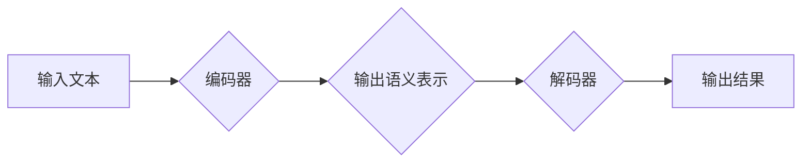

## Python深度学习实践：解析BERT如何改善文本理解

> 关键词：BERT, 深度学习, 自然语言处理, 文本理解, Transformer, 预训练模型, Fine-tuning

## 1. 背景介绍

近年来，深度学习在自然语言处理（NLP）领域取得了显著进展，尤其是在文本理解任务上。传统的文本理解方法往往依赖于手工提取特征，而深度学习模型能够自动学习文本的语义表示，从而提升文本理解的准确性和效率。

BERT（Bidirectional Encoder Representations from Transformers）是谷歌于2018年提出的一个基于Transformer架构的预训练语言模型，它在文本理解任务上取得了突破性的成果，成为NLP领域的新宠。BERT的出现标志着深度学习在文本理解领域迈向了一个新的阶段。

## 2. 核心概念与联系

### 2.1  Transformer架构

Transformer是一种新型的神经网络架构，它摒弃了传统的循环神经网络（RNN）的顺序处理方式，采用了一种并行处理机制，能够更有效地处理长文本序列。Transformer的核心组件是**自注意力机制（Self-Attention）**和**多头注意力机制（Multi-Head Attention）**，它们能够捕捉文本中单词之间的长距离依赖关系，从而更好地理解文本的语义。

### 2.2  预训练模型

预训练模型是指在大量文本数据上进行预训练的深度学习模型，它已经学习了语言的语法和语义知识。使用预训练模型可以显著减少模型训练所需的时间和数据量，并且能够提升模型的性能。BERT就是一种预训练语言模型，它在大量的英文文本数据上进行预训练，学习了丰富的语言表示。

### 2.3  BERT模型结构

BERT模型由两部分组成：**编码器（Encoder）**和**解码器（Decoder）**。编码器负责将输入文本序列编码成语义表示，解码器则根据编码后的语义表示进行文本生成或分类等任务。BERT模型的编码器采用多层Transformer结构，每个Transformer层包含多个自注意力机制和前馈神经网络。

**Mermaid 流程图**



## 3. 核心算法原理 & 具体操作步骤

### 3.1  算法原理概述

BERT模型的核心算法是**双向编码（Bidirectional Encoding）**。传统的语言模型通常采用单向编码方式，只考虑单词的前向或后向上下文信息。而BERT模型则采用双向编码方式，同时考虑单词的前向和后向上下文信息，从而更好地理解单词的语义。

BERT模型使用**Masked Language Modeling（MLM）**和**Next Sentence Prediction（NSP）**两种预训练任务来学习语言表示。

* **MLM任务：**随机遮盖输入文本中的部分单词，然后让模型预测被遮盖单词的词语。
* **NSP任务：**给定两个句子，判断它们是否相邻。

通过这两个预训练任务，BERT模型能够学习到丰富的语言表示，包括单词的语义、语法和上下文信息。

### 3.2  算法步骤详解

1. **数据预处理：**将文本数据进行分词、标记等预处理操作。
2. **模型初始化：**初始化BERT模型的参数。
3. **预训练：**使用MLM和NSP任务对BERT模型进行预训练。
4. **微调：**将预训练好的BERT模型用于特定下游任务，例如文本分类、问答系统等，通过微调模型参数来提升模型在特定任务上的性能。

### 3.3  算法优缺点

**优点：**

* 能够捕捉文本中单词之间的长距离依赖关系。
* 预训练模型能够显著减少模型训练所需的时间和数据量。
* 在文本理解任务上取得了突破性的成果。

**缺点：**

* 模型参数量较大，需要较大的计算资源进行训练和推理。
* 预训练模型主要基于英文文本数据，在处理其他语言文本时可能需要进行额外的训练。

### 3.4  算法应用领域

BERT模型在NLP领域有着广泛的应用，例如：

* 文本分类
* 问答系统
* 情感分析
* 机器翻译
* 文本摘要

## 4. 数学模型和公式 & 详细讲解 & 举例说明

### 4.1  数学模型构建

BERT模型的数学模型构建基于Transformer架构，主要包括以下几个部分：

* **词嵌入层（Word Embedding Layer）：**将每个单词映射到一个低维向量空间中。
* **多层Transformer编码器（Multi-Layer Transformer Encoder）：**包含多个Transformer层，每个Transformer层包含自注意力机制和前馈神经网络。
* **输出层（Output Layer）：**根据编码后的语义表示进行文本分类、生成等任务。

### 4.2  公式推导过程

BERT模型的数学公式推导过程较为复杂，涉及到自注意力机制、多头注意力机制、前馈神经网络等多个模块的计算。

**自注意力机制公式：**

$$
Attention(Q, K, V) = \frac{exp(Q \cdot K^T / \sqrt{d_k})}{exp(Q \cdot K^T / \sqrt{d_k})} \cdot V
$$

其中：

* $Q$：查询矩阵
* $K$：键矩阵
* $V$：值矩阵
* $d_k$：键向量的维度

**多头注意力机制公式：**

$$
MultiHead(Q, K, V) = Concat(head_1, head_2,..., head_h) \cdot W_o
$$

其中：

* $head_1, head_2,..., head_h$：每个头的注意力输出
* $W_o$：线性变换矩阵

### 4.3  案例分析与讲解

BERT模型在文本分类任务上的应用案例：

假设我们想要构建一个情感分析模型，用于判断文本的正面、负面或中性情感。我们可以使用预训练好的BERT模型进行微调，将BERT模型的输出层修改为一个包含三个类别的分类器。

在训练过程中，我们将情感标注好的文本数据输入到BERT模型中，并使用交叉熵损失函数来训练模型。经过微调后，BERT模型能够准确地识别文本的情感类别。

## 5. 项目实践：代码实例和详细解释说明

### 5.1  开发环境搭建

* Python 3.6+
* TensorFlow 2.0+
* PyTorch 1.0+
* CUDA Toolkit (如果使用GPU)

### 5.2  源代码详细实现

```python
from transformers import BertTokenizer, BertModel

# 加载预训练模型和词典
tokenizer = BertTokenizer.from_pretrained('bert-base-uncased')
model = BertModel.from_pretrained('bert-base-uncased')

# 文本预处理
text = "This is a great movie!"
input_ids = tokenizer.encode(text, add_special_tokens=True)

# 模型推理
outputs = model(input_ids)

# 获取隐藏状态
last_hidden_state = outputs.last_hidden_state

#...后续处理
```

### 5.3  代码解读与分析

* **加载预训练模型和词典:** 使用`transformers`库加载预训练好的BERT模型和词典。
* **文本预处理:** 使用`tokenizer`将文本转换为模型可识别的输入格式。
* **模型推理:** 将预处理后的文本输入到BERT模型中进行推理。
* **获取隐藏状态:** 从模型输出中获取隐藏状态，这些隐藏状态包含了文本的语义表示。

### 5.4  运行结果展示

运行上述代码后，将输出BERT模型对输入文本的隐藏状态。这些隐藏状态可以用于后续的文本理解任务，例如文本分类、问答系统等。

## 6. 实际应用场景

BERT模型在实际应用场景中展现出强大的文本理解能力，例如：

* **搜索引擎:** BERT可以用于理解用户搜索意图，提高搜索结果的准确性和相关性。
* **聊天机器人:** BERT可以用于训练更智能的聊天机器人，能够更好地理解用户对话内容并提供更精准的回复。
* **问答系统:** BERT可以用于构建更准确的问答系统，能够更好地理解用户的问题并提供相关答案。

### 6.4  未来应用展望

BERT模型在未来将有更广泛的应用场景，例如：

* **个性化推荐:** BERT可以用于分析用户的阅读偏好，提供更个性化的推荐内容。
* **自动写作:** BERT可以用于辅助自动写作，例如生成新闻报道、撰写邮件等。
* **法律文本分析:** BERT可以用于分析法律文本，识别关键信息和法律关系。

## 7. 工具和资源推荐

### 7.1  学习资源推荐

* **BERT论文:** https://arxiv.org/abs/1810.04805
* **Hugging Face Transformers库:** https://huggingface.co/transformers/
* **Google AI Blog:** https://ai.googleblog.com/

### 7.2  开发工具推荐

* **TensorFlow:** https://www.tensorflow.org/
* **PyTorch:** https://pytorch.org/
* **Jupyter Notebook:** https://jupyter.org/

### 7.3  相关论文推荐

* **XLNet:** https://arxiv.org/abs/1906.08237
* **RoBERTa:** https://arxiv.org/abs/1907.11692
* **GPT-3:** https://openai.com/blog/gpt-3/

## 8. 总结：未来发展趋势与挑战

### 8.1  研究成果总结

BERT模型的出现标志着深度学习在文本理解领域取得了重大突破，它能够有效地捕捉文本中单词之间的长距离依赖关系，并学习到丰富的语言表示。BERT模型在各种文本理解任务上都取得了优异的性能，并被广泛应用于实际场景。

### 8.2  未来发展趋势

* **模型规模和性能提升:** 未来将会有更大规模的BERT模型出现，并通过新的训练方法和架构设计进一步提升模型性能。
* **多模态文本理解:** 将BERT模型与其他模态数据（例如图像、音频）融合，实现多模态文本理解。
* **跨语言文本理解:** 将BERT模型应用于跨语言文本理解任务，例如机器翻译、跨语言问答等。

### 8.3  面临的挑战

* **计算资源需求:** 大规模BERT模型的训练和推理需要大量的计算资源，这对于资源有限的机构或个人来说是一个挑战。
* **数据偏见:** 预训练模型主要基于英文文本数据，在处理其他语言文本时可能存在数据偏见问题。
* **可解释性:** BERT模型是一个复杂的深度学习模型，其内部工作机制难以理解，这对于模型的信任度和应用推广来说是一个挑战。

### 8.4  研究展望

未来研究将继续探索BERT模型的潜力，例如：

* 开发更有效的训练方法和架构设计，提升模型规模和性能。
* 探索新的应用场景，例如多模态文本理解、跨语言文本理解等。
* 研究BERT模型的可解释性，提高模型的透明度和信任度。

## 9. 附录：常见问题与解答

* **BERT模型的训练数据是什么？**

BERT模型主要基于英文文本数据进行预训练，包括书籍、文章、维基百科等多种文本类型。

* **BERT模型的输出是什么？**

BERT模型的输出是每个单词的隐藏状态，这些隐藏状态包含了单词的语义表示。

* **如何使用BERT模型进行文本分类？**

可以使用预训练好的BERT模型进行微调，将BERT模型的输出层修改为一个包含多个类别的分类器。

* **BERT模型的开源代码在哪里？**

BERT模型的开源代码可以在Hugging Face Transformers库中找到：https://huggingface.co/transformers/


作者：禅与计算机程序设计艺术 / Zen and the Art of Computer Programming 
