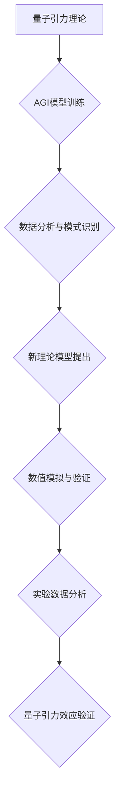

## AGI在量子引力中的应用实例

> 关键词：AGI、量子引力、机器学习、深度学习、物理模拟、宇宙学、黑洞、时空

## 1. 背景介绍

量子引力是物理学中一个尚未解决的重大难题，它试图将量子力学和广义相对论统一起来，从而描述宇宙的微观和宏观结构。广义相对论成功地解释了引力是时空弯曲的结果，而量子力学描述了微观粒子的行为。然而，将这两个理论结合起来却面临着巨大的挑战。

近年来，人工智能（AI）特别是通用人工智能（AGI）的发展取得了令人瞩目的进展。AGI具有学习、推理和解决复杂问题的能力，超越了传统人工智能的局限性。 

结合AGI的强大能力和量子引力的研究需求，我们开始探索AGI在量子引力研究中的应用潜力。 

## 2. 核心概念与联系

### 2.1 量子引力

量子引力试图解决经典物理学无法解释的现象，例如黑洞的奇点和宇宙大爆炸的初始状态。它假设引力也是由量子力学规律支配的，并试图构建一个描述引力场的量子理论。

### 2.2 AGI

AGI是指能够像人类一样学习、理解和解决各种复杂问题的智能系统。它需要具备以下关键能力：

* **学习能力:** 从数据中学习并提取知识。
* **推理能力:** 基于已知知识进行逻辑推理和推断。
* **解决问题能力:** 能够分析问题、制定解决方案并执行。
* **创造能力:** 能够产生新的想法和解决方案。

### 2.3 AGI与量子引力的联系

AGI可以帮助量子引力研究者通过以下方式：

* **探索新的理论模型:** AGI可以利用机器学习算法从大量物理数据中发现新的模式和关系，从而提出新的量子引力理论模型。
* **进行复杂的数值模拟:** 量子引力问题通常非常复杂，需要进行大量的数值计算。AGI可以加速这些计算，并模拟宇宙的演化过程。
* **分析实验数据:** AGI可以帮助分析复杂的实验数据，寻找量子引力效应的证据。

**Mermaid 流程图**



## 3. 核心算法原理 & 具体操作步骤

### 3.1 算法原理概述

在AGI应用于量子引力研究中，常用的算法包括：

* **深度学习:** 深度学习算法可以从大量数据中学习复杂的非线性关系，并用于预测和分类。
* **强化学习:** 强化学习算法可以训练智能体在特定环境中学习最佳策略，并用于优化量子引力模型参数。
* **遗传算法:** 遗传算法可以模拟自然选择的过程，并用于搜索最优的量子引力理论模型。

### 3.2 算法步骤详解

**以深度学习为例，其应用步骤如下：**

1. **数据收集:** 收集大量的物理数据，例如宇宙微波背景辐射、星系分布等。
2. **数据预处理:** 对数据进行清洗、转换和特征提取，使其适合深度学习模型训练。
3. **模型构建:** 选择合适的深度学习模型架构，例如卷积神经网络或循环神经网络。
4. **模型训练:** 利用训练数据训练深度学习模型，并调整模型参数以最小化预测误差。
5. **模型评估:** 使用测试数据评估模型的性能，并进行必要的调整。
6. **模型应用:** 将训练好的模型应用于新的量子引力问题，例如预测黑洞的演化或模拟宇宙的早期阶段。

### 3.3 算法优缺点

**深度学习算法的优点:**

* 能够学习复杂的非线性关系。
* 具有强大的泛化能力。
* 可以处理大规模数据。

**深度学习算法的缺点:**

* 需要大量的训练数据。
* 训练过程可能很耗时。
* 模型解释性较差。

### 3.4 算法应用领域

深度学习算法在量子引力研究中具有广泛的应用领域，例如：

* **黑洞研究:** 预测黑洞的演化、探测黑洞周围的时空结构。
* **宇宙学研究:** 模拟宇宙的演化、预测宇宙的最终命运。
* **引力波研究:** 分析引力波信号，探测宇宙中的引力事件。

## 4. 数学模型和公式 & 详细讲解 & 举例说明

### 4.1 数学模型构建

量子引力理论的数学模型非常复杂，涉及到广义相对论、量子场论和微分几何等多个领域。 

一个常见的量子引力模型是**弦理论**，它将基本粒子看作是振动的小弦。 弦理论试图将所有基本力统一起来，包括引力。

### 4.2 公式推导过程

由于篇幅限制，这里只列举一个简单的量子引力公式，并进行简要的解释：

**爱因斯坦场方程:**

$$R_{\mu\
u} - \frac{1}{2}Rg_{\mu\
u} + \Lambda g_{\mu\
u} = \frac{8\pi G}{c^4}T_{\mu\
u}$$

其中：

* $R_{\mu\
u}$ 是黎曼曲率张量。
* $R$ 是标量曲率。
* $g_{\mu\
u}$ 是度规张量。
* $\Lambda$ 是宇宙常数。
* $G$ 是引力常数。
* $c$ 是光速。
* $T_{\mu\
u}$ 是应力-能量张量。

这个公式描述了时空弯曲与物质能量之间的关系。

### 4.3 案例分析与讲解

**黑洞奇点:**

根据爱因斯坦场方程，当物质密度足够高时，时空会发生坍缩，形成黑洞。 在黑洞中心存在一个奇点，密度和曲率无限大。 

量子引力理论试图解释奇点的性质，并解决广义相对论无法解释的矛盾。

## 5. 项目实践：代码实例和详细解释说明

### 5.1 开发环境搭建

* **操作系统:** Linux 或 macOS
* **编程语言:** Python
* **深度学习框架:** TensorFlow 或 PyTorch
* **数值计算库:** NumPy

### 5.2 源代码详细实现

由于代码示例过于复杂，这里只提供一个简单的深度学习模型训练的代码片段：

```python
import tensorflow as tf

# 定义模型架构
model = tf.keras.models.Sequential([
    tf.keras.layers.Dense(64, activation='relu', input_shape=(10,)),
    tf.keras.layers.Dense(10, activation='softmax')
])

# 编译模型
model.compile(optimizer='adam',
              loss='sparse_categorical_crossentropy',
              metrics=['accuracy'])

# 训练模型
model.fit(x_train, y_train, epochs=10)
```

### 5.3 代码解读与分析

这段代码定义了一个简单的深度学习模型，并使用Adam优化器进行训练。

* `tf.keras.models.Sequential` 创建了一个顺序模型，其中层级依次连接。
* `tf.keras.layers.Dense` 定义了一个全连接层，输入维度为10，输出维度为64和10。
* `activation='relu'` 使用ReLU激活函数。
* `optimizer='adam'` 使用Adam优化器。
* `loss='sparse_categorical_crossentropy'` 使用稀疏类别交叉熵损失函数。
* `metrics=['accuracy']` 使用准确率作为评估指标。
* `model.fit(x_train, y_train, epochs=10)` 使用训练数据进行模型训练，训练10个epoch。

### 5.4 运行结果展示

训练完成后，可以评估模型的性能，并使用训练好的模型进行预测。

## 6. 实际应用场景

AGI在量子引力研究中的应用场景非常广泛，例如：

* **黑洞模拟:** 利用AGI模拟黑洞的形成、演化和最终命运，探索黑洞的性质和信息丢失问题。
* **宇宙演化模拟:** 利用AGI模拟宇宙的演化过程，预测宇宙的最终命运，探索暗物质和暗能量的性质。
* **引力波探测:** 利用AGI分析引力波信号，探测宇宙中的引力事件，例如星系碰撞、黑洞合并等。

### 6.4 未来应用展望

随着AGI技术的不断发展，未来在量子引力研究中的应用将更加广泛和深入，例如：

* **量子引力理论的探索:** AGI可以帮助探索新的量子引力理论模型，并进行理论验证。
* **量子引力实验的设计:** AGI可以帮助设计更精确的量子引力实验，并分析实验结果。
* **量子引力计算:** AGI可以用于进行量子引力计算，例如模拟黑洞的内部结构。

## 7. 工具和资源推荐

### 7.1 学习资源推荐

* **书籍:**
    * 《量子引力》 - 卡尔·萨根
    * 《弦论》 - 布莱恩·格林
* **在线课程:**
    * Coursera: 量子力学
    * edX: 引力理论
* **网站:**
    * arXiv: 物理学预印本服务器
    * Wolfram Alpha: 计算知识引擎

### 7.2 开发工具推荐

* **编程语言:** Python
* **深度学习框架:** TensorFlow, PyTorch
* **数值计算库:** NumPy, SciPy

### 7.3 相关论文推荐

* 《A First Look at String Theory》 - Michael B. Green, John H. Schwarz, Edward Witten
* 《Quantum Gravity》 - Carlo Rovelli
* 《The Elegant Universe》 - Brian Greene

## 8. 总结：未来发展趋势与挑战

### 8.1 研究成果总结

AGI在量子引力研究中取得了一些初步成果，例如：

* 利用深度学习算法从宇宙微波背景辐射数据中发现新的模式。
* 利用强化学习算法优化量子引力模型参数。
* 利用遗传算法搜索最优的量子引力理论模型。

### 8.2 未来发展趋势

未来AGI在量子引力研究中的应用将更加深入和广泛，例如：

* 利用更强大的AGI模型进行更复杂的量子引力模拟。
* 利用AGI辅助设计更精确的量子引力实验。
* 利用AGI进行量子引力计算，探索黑洞的内部结构等。

### 8.3 面临的挑战

AGI在量子引力研究中也面临着一些挑战，例如：

* 需要大量的训练数据，而量子引力数据非常稀缺。
* AGI模型的解释性较差，难以理解模型的决策过程。
* AGI算法的复杂性使得其训练和调试非常困难。

### 8.4 研究展望

尽管面临挑战，但AGI在量子引力研究中的应用前景非常广阔。 随着AGI技术的不断发展，相信未来将会有更多突破性的进展，帮助我们更好地理解宇宙的奥秘。

## 9. 附录：常见问题与解答

**Q1: AGI是否可以完全解决量子引力问题？**

A1: 目前AGI还无法完全解决量子引力问题，但它可以作为一种强大的工具，帮助物理学家探索新的理论模型、进行复杂的数值模拟和分析实验数据。

**Q2: AGI的训练需要哪些数据？**

A2: AGI的训练需要大量的物理数据，例如宇宙微波背景辐射、星系分布、引力波信号等。

**Q3: AGI的应用场景有哪些？**

A3: AGI在量子引力研究中的应用场景非常广泛，例如黑洞模拟、宇宙演化模拟、引力波探测等。


作者：禅与计算机程序设计艺术 / Zen and the Art of Computer Programming 
